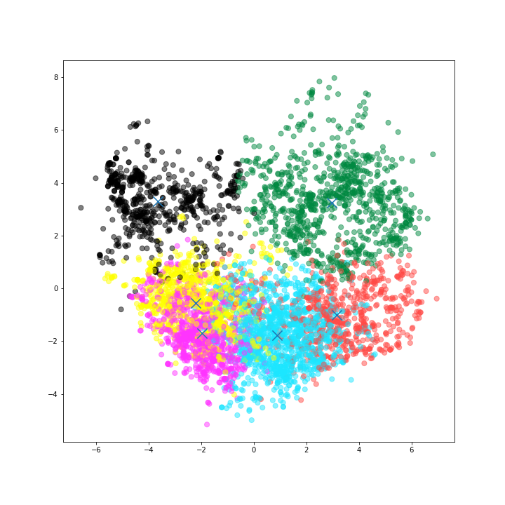

# Abstract

This report studies European users' rating behaviors on Google Maps to analyze people's general preferences in places in the Travel cluster. Twenty-four categories in tourism are being analyzed to generate interest groups on one or more specific types of places. Using a modified K-mean Clustering Algorithm, we will try to extract all possible useful information from the data.

The evaluation will use variance to see how well they are being clustered; And pick important details for output.

This project explores rare aspects of rating relationships in different tourism sectors.  The results generated will allow stakeholders like the tourism board of a city/a country or a local restaurant union to analyze the performance related to other sectors.

+++

# Introduction

People travel to a lot of different places. With modern technology, we can now rate different places we visited via different platforms like TripAdvisor or Google Maps. Of course, different people have different views and preferences on the places they visited. However, it is infrequent to see people's general preference for different places and their relationship with different locations. For example, people who are interested in visiting parks are possibly not interested in visiting the museum. However, we usually do not have sufficient information to show their relationship between different tourism sectors. Do they have opinions on other places? 

Researches on such topics are not uncommon; one of the closest examples is the recommended system used in travel-related platforms like TripAdvisor. However, it is rare for people to bring up the relationships between each travel clusters; for example, how people like the 

This data set is originally used for a project[1] to compare and evaluate different types of a clustering algorithm; the data set is referring to "Social Media Data in Tourism," which have little actual involvement of my topic.

# Model

## K-Means Clustering

The algorithm we use as generally is called K-means Clustering, and more specifically, Sequential K-Means Clustering.

K-means clustering is one of the method to perform vector quantization. It aims to partition $n$ observations into $k$ clusters in which each pieces of information belongs to the cluster with the nearest mean (In our algorithm, it's cluster centroid), acting as a prototype of the cluster. The algorithm Sequential K-Means Clustering Went like following:

> - Make initial guesses for the means $m_1, m_2,\ldots, m_k$
> - Set the counts $n_1, n_2,\ldots, n_k$ to zero 
> - Until no sgnificant change
>     - Acquire the next example, $x$
>     - If $m_i$ is closest to $x$
>         - Increment $n_i$
>         - Replace $m_i$ by $m_i+ \frac 1 {n_i} ( x–m_i )$
>     - end if 
> - end until 


## PCA

PCA will also be used in the algorithm to use as a way to reduce the feature in order to visualize the output.

PCA, short for Principal Components Analysis, is an algorithm that allows you to transform the columns of a dataset into a new set of features(Principal Components). This allows compressing a large chunk of the information across the full dataset into fewer feature columns(In this case, 24 features reduced into 2). This enables dimensionality reduction and the ability to visualize the separation of classes or clusters if any.


# Algorithm

The alorithm will be a modified version of K-means clustering algorithm, in order to "predict" without a set of samples. The model here we are introducing is called **Wild K-means clustering**, targeting a multi-featured data set. It is achieved by greedily exploring all possible clusters selection of clusters (up to the count of all features) and selecting the most optimal one; the minimal amount of the clustering will be 3 since it is a clustering algorithm targeted at the multi-feature data set.

The general algorithm goes like the following:

> - for a amount of cluster $k \in \{3, f\}$ as f in number of features 
>     - Make initial guesses for the means $m_1, m_2,\ldots, m_k$
>     - Set the counts $n_1, n_2,\ldots, n_k$ to zero 
>     - Until no sgnificant change
>         - Acquire the next example, $x$
>         - If $m_i$ is closest to $x$
>             - Increment $n_i$
>             - Replace $m_i$ by $m_i+ \frac 1 {n_i} ( x–m_i )$
>         - end if 
>     - end until
>     - for each cluster $i \in \{1, k\}$ 
>         - generate mean $M_{i, c=k}$ and variance $\sigma^2_{i, c=k}$
> - end for
> - selecting best cluster set with optimal $\sigma^2$


# Evaluation

The raw data is in the following format:

```
Attribute 1 : Unique user id 
Attribute 2 : Average ratings on churches 
Attribute 3 : Average ratings on resorts 
Attribute 4 : Average ratings on beaches 
Attribute 5 : Average ratings on parks 
Attribute 6 : Average ratings on theatres 
Attribute 7 : Average ratings on museums 
Attribute 8 : Average ratings on malls 
Attribute 9 : Average ratings on zoo 
Attribute 10 : Average ratings on restaurants 
Attribute 11 : Average ratings on pubs/bars 
Attribute 12 : Average ratings on local services 
Attribute 13 : Average ratings on burger/pizza shops 
Attribute 14 : Average ratings on hotels/other lodgings 
Attribute 15 : Average ratings on juice bars 
Attribute 16 : Average ratings on art galleries 
Attribute 17 : Average ratings on dance clubs 
Attribute 18 : Average ratings on swimming pools 
Attribute 19 : Average ratings on gyms 
Attribute 20 : Average ratings on bakeries 
Attribute 21 : Average ratings on beauty & spas 
Attribute 22 : Average ratings on cafes 
Attribute 23 : Average ratings on view points 
Attribute 24 : Average ratings on monuments 
Attribute 25 : Average ratings on gardens
```


Attribute 1 is the unique ID, and the rest of the attributes are 
The Attribute 1 is the unique user-id "User xxx"; the rest of the attributes are in `float64` format in a range of $0\le x<1$(no rating and ratings with no rating with a comment, since there is no rating below 1 in Google Maps), and $1\le x \le 5$.

The processed data for Attribute 1  is converted into numbers only to identify a specific user.

As from the data, we will be evaluating the value using the optimal variance $\hat{\sigma}^2$:

|   c |    $\hat{\sigma}^2$    |
|-----|----------|
|  25 | 0.69358  |
|  24 | 0.707861 |
|  23 | 0.724883 |
|  21 | 0.73339  |
|  22 | 0.735398 |
|  19 | 0.747117 |
|  20 | 0.748348 |
|  18 | 0.773284 |
|  17 | 0.788496 |
|  16 | 0.803223 |
|  15 | 0.826222 |
|  14 | 0.834439 |
|  13 | 0.851727 |
|  12 | 0.854033 |
|  11 | 0.892368 |
|  10 | 0.914183 |
|   9 | 0.931482 |
|   8 | 0.949316 |
|   7 | 0.975929 |
|   6 | 1.02136  |
|   5 | 1.09182  |
|   4 | 1.1588   |
|   3 | 1.2703   |

From the table shown, we can see that when $c=25$, it has the best performance overall.

An interesting to be noted is that in general, when there is more clusters ($c$), the optimal variance is lower, but it is not necessarily the case; for example, $c=19$ has a better performance compared to $c=20$.

Full data generated will not be shown here due to that it's over 100 pages but will be available in Appendix 1; we will use the one with the optimal variance to extract the useful data; the data can be referenced in Appendix 1.

Not all result will be presented since it will be very time consuming;
The following will be an analysis of Cluster 6 ($c=6$):



The centroids for the result are:
- Cluster 1: [1.39459581 2.75693862 3.18901198 3.67492515 4.34295659 3.82436377 3.6680988  2.44330838 2.62864521 2.44422156 2.06458832 2.05857784 1.9755988  1.68366766 1.31549401 1.06060629 0.66377994 0.49068862 0.57853293 0.69215569 0.75052395 0.84936377 1.47962575 1.66857036]
- Cluster 2: [1.64222069 2.23524138 3.12688276 4.30198621 4.07157241 3.19455172 2.73111724 2.19028966 2.66308966 2.7106069  2.66801379 1.60211034 1.86553103 1.27107586 1.18943448 1.21446897 0.87113103 0.66957241 0.62275862 0.99022069 1.04284138 4.8164     2.48915862 1.78110345]
- Cluster 3: [2.35293048 2.68588235 2.47594652 2.21981818 2.03368984 1.86232086 1.93660963 1.57042781 1.75239572 1.57786096 1.56959358 1.43775401 1.53926203 1.85524064 2.35116578 1.62990374 1.80596791 1.92019251 2.51033155 2.13161497 1.87616043 2.66295187 2.46274866 2.62175401]
- Cluster 4: [1.23235294 1.57614253 1.70075792 2.20024887 2.30085973 2.56595023 3.70004525 3.63363122 4.51929864 4.46661765 4.18727376 2.0985181 1.86495475 1.35076923 1.39468326 1.11776018 0.67200226 0.39847285 0.35665158 0.44542986 0.57705882 1.23752262 1.09892534 1.19277149]
- Cluster 5: [0.80804241 1.05639478 1.67466558 1.65530179 1.67223491 1.68489396 3.04200653 1.97225122 2.74554649 2.85598695 3.15755302 3.9193311 4.16468189 4.84915171 4.00512235 1.50665579 1.22274062 0.92818923 1.17433931 1.00164763 0.72564437 0.74091354 0.70825449 0.80737357]
- Cluster 6: [1.1463136  2.90791277 2.29411215 2.28029076 2.5226999  3.44659398 4.62954309 3.24079958 4.46145379 3.16738318 2.19661475 1.89575286 2.03956386 2.99186916 3.66857736 0.80458982 0.65244029 0.65366563 0.71086189 0.84416407 0.8325026  0.92033229 0.90160955 1.03196262]

From the detailed data, we can see that:

- People in cluster 1 tend to love parks, theatres, and museums with comparably higher ratings, but they have bad or no opinion in other sections;
- People in cluster 2 tend to love parks, theatres, and view points with comparably higher ratings, but they have bad or no opinion in other sections;
- People in cluster 3 tend to have negative rating across 25 sections;
- People in cluster 4 tend to love malls, zoo, restaurants, pubs/bars, and local services with comparably higher ratings, but they have bad or no opinion in other sections;
- People in cluster 5 tend to love local services, burger/pizza shops, hotels/other lodgings, juice bars, and art galleries with comparably higher ratings, but they have bad or no opinion in other sections;
- People in cluster 6 tend to love museums, malls, zoo, restaurants, pubs/bars, and art galleries with comparably higher ratings but they have bad or no opinion in other sections.

From these data, we can generate some clear trends:

- From clusters 1 and 2, parks and theatres usually come together. In such way, travel sites or agencies should provide possibly related trips; In the future city planning, parks and theatres could be planned closer;
- From clusters 4 and 6, malls, zoo, restaurants, and pubs/bars usually come together. In such a way, travel sites or agencies should provide trips like zoo in the morning and city center in the evening; For a city, they could optimize the route from the zoo to the city center.
- From all clusters, we could notice some attributes are never high rated. This means that in this dataset people do not like these places; travel agents could help avoid the type of people in the data set to visit these places.

# Conclusion

In this project, we introduced a new algorithm Wild K-Means Clustering and using the algorithm, we can obtain the result and analyze the output. 

As you can see from the analysis example from the result section, if we use a data set with age group/gender/job, the data set obtained could be run under a more targeted analysis. This will potentially allow organizations like travel agents or government to know what they need to plan or do across the travel sectors, as shown in the result section.

+++

# References

[1] S. Renjith, A. Sreekumar and M. Jathavedan, "Evaluation of Partitioning Clustering Algorithms for Processing Social Media Data in Tourism Domain," 2018 IEEE Recent Advances in Intelligent Computational Systems (RAICS), Thiruvananthapuram, India, 2018, pp. 127-131, doi: 10.1109/RAICS.2018.8635080.

+++

# Appendix 1: Full Data Generated
