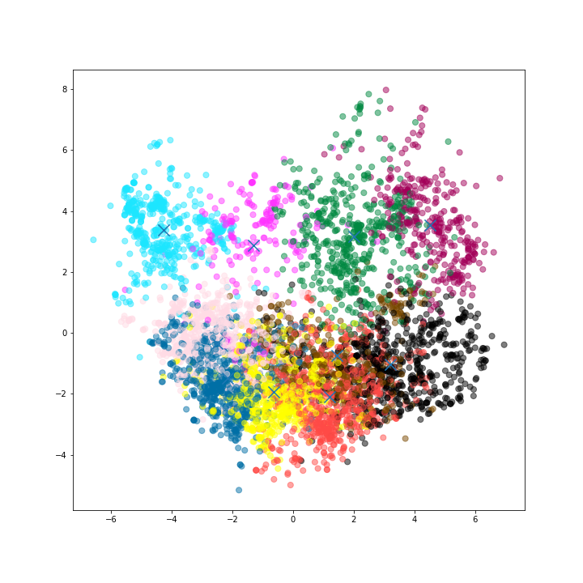
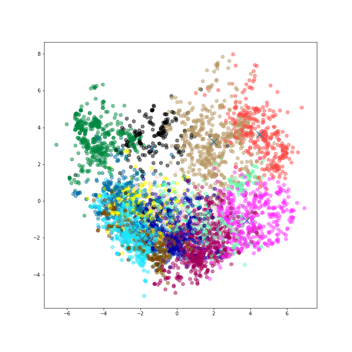
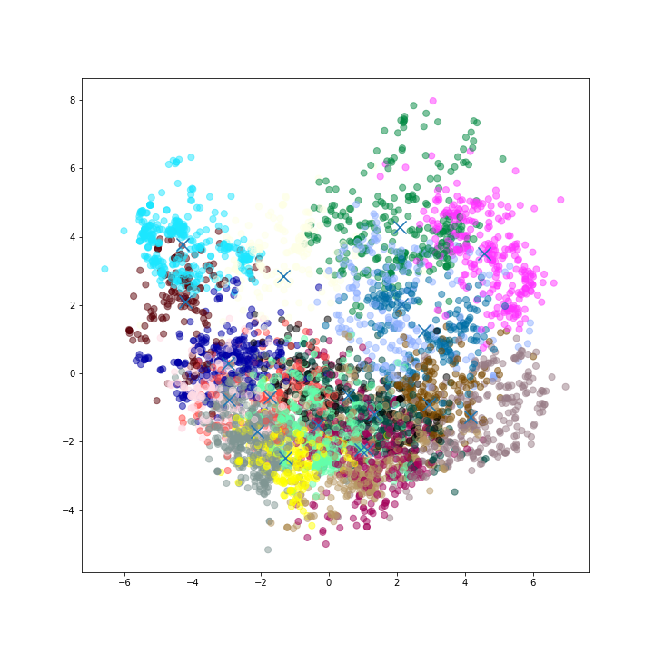
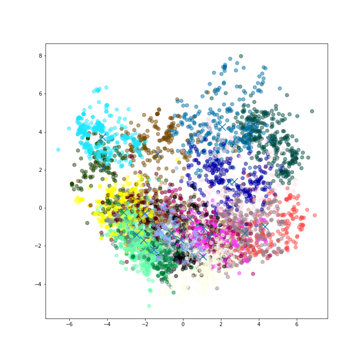
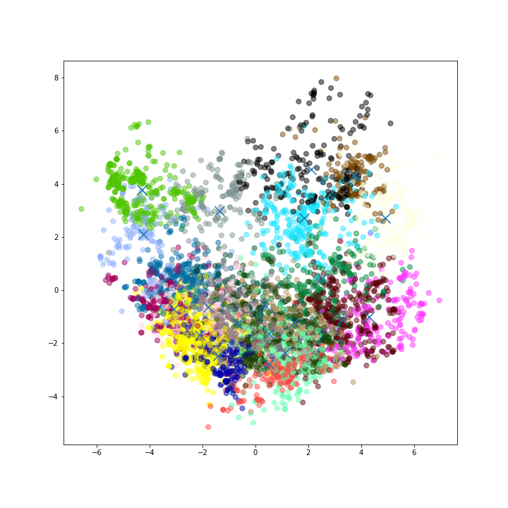

## Wild K-Means Analysis with c=3

### Cluster 1

Centroid: [1.47473988 2.58014188 3.17622701 3.93369417 4.35620074 3.68776668
 3.38255912 2.38800315 2.66427746 2.56808723 2.30514451 1.92290068
 1.89490804 1.44955334 1.27282186 1.09087756 0.71874934 0.53799264
 0.56334209 0.68768261 0.83410405 2.16883342 1.86606411 1.69665791]

|                       |     mean |   variance |
|-----------------------|----------|------------|
| churches              | 1.47474  |   0.45427  |
| resorts               | 2.58014  |   1.98845  |
| beaches               | 3.17623  |   1.90132  |
| parks                 | 3.93369  |   1.35595  |
| theatres              | 4.3562   |   0.829006 |
| museums               | 3.68777  |   1.32208  |
| malls                 | 3.38256  |   1.69203  |
| zoo                   | 2.388    |   0.713739 |
| restaurants           | 2.66428  |   1.24816  |
| pubs/bars             | 2.56809  |   1.2175   |
| local services        | 2.30514  |   1.62642  |
| burger/pizza shops    | 1.9229   |   1.51953  |
| hotels/other lodgings | 1.89491  |   1.8782   |
| juice bars            | 1.44955  |   0.9506   |
| art galleries         | 1.27282  |   0.565704 |
| dance clubs           | 1.09088  |   0.736796 |
| swimming pools        | 0.718749 |   0.273806 |
| gyms                  | 0.537993 |   0.140904 |
| bakeries              | 0.563342 |   0.219757 |
| beauty & spas         | 0.687683 |   0.59773  |
| cafes                 | 0.834104 |   0.660468 |
| view points           | 2.16883  |   3.52046  |
| monuments             | 1.86606  |   2.71171  |
| gardens               | 1.69666  |   1.64419  |

### Cluster 2

Centroid: [1.09217532 1.94081575 1.91878247 2.10635552 2.26159903 2.71249594
 3.92371753 3.08294237 4.02136364 3.57480519 3.17992289 2.49004058
 2.57762987 2.91948458 2.86511364 1.05508523 0.76166802 0.60881494
 0.70284497 0.73211851 0.69591315 0.99393263 0.90449269 1.05949675]

|                       |     mean |   variance |
|-----------------------|----------|------------|
| churches              | 1.09218  |   0.416946 |
| resorts               | 1.94082  |   2.22568  |
| beaches               | 1.91878  |   0.876463 |
| parks                 | 2.10636  |   0.846266 |
| theatres              | 2.2616   |   0.865694 |
| museums               | 2.7125   |   1.56922  |
| malls                 | 3.92372  |   1.66692  |
| zoo                   | 3.08294  |   1.39163  |
| restaurants           | 4.02136  |   1.10824  |
| pubs/bars             | 3.57481  |   1.45509  |
| local services        | 3.17992  |   1.98477  |
| burger/pizza shops    | 2.49004  |   1.79852  |
| hotels/other lodgings | 2.57763  |   2.26588  |
| juice bars            | 2.91948  |   3.10876  |
| art galleries         | 2.86511  |   3.65206  |
| dance clubs           | 1.05509  |   1.18167  |
| swimming pools        | 0.761668 |   0.478488 |
| gyms                  | 0.608815 |   0.336455 |
| bakeries              | 0.702845 |   0.654976 |
| beauty & spas         | 0.732119 |   0.694422 |
| cafes                 | 0.695913 |   0.190904 |
| view points           | 0.993933 |   0.76846  |
| monuments             | 0.904493 |   0.298948 |
| gardens               | 1.0595   |   0.47587  |

### Cluster 3

Centroid: [2.24505051 2.72189164 2.57993572 2.37275482 2.09508724 1.91503214
 2.00198347 1.58112029 1.90707071 1.61614325 1.55245179 1.41836547
 1.50550964 1.83767677 2.3482461  1.68250689 1.77623508 1.80272727
 2.2841506  2.15224059 1.80677686 2.7314876  2.36745638 2.45695133]

|                       |    mean |   variance |
|-----------------------|---------|------------|
| churches              | 2.24505 |   0.772511 |
| resorts               | 2.72189 |   1.01003  |
| beaches               | 2.57994 |   0.928049 |
| parks                 | 2.37275 |   0.786588 |
| theatres              | 2.09509 |   0.318084 |
| museums               | 1.91503 |   0.245933 |
| malls                 | 2.00198 |   0.719754 |
| zoo                   | 1.58112 |   0.16659  |
| restaurants           | 1.90707 |   0.863545 |
| pubs/bars             | 1.61614 |   0.300035 |
| local services        | 1.55245 |   0.235415 |
| burger/pizza shops    | 1.41837 |   0.232767 |
| hotels/other lodgings | 1.50551 |   0.565504 |
| juice bars            | 1.83768 |   1.47624  |
| art galleries         | 2.34825 |   2.97952  |
| dance clubs           | 1.68251 |   1.87994  |
| swimming pools        | 1.77624 |   2.33293  |
| gyms                  | 1.80273 |   2.29036  |
| bakeries              | 2.28415 |   3.22136  |
| beauty & spas         | 2.15224 |   2.86758  |
| cafes                 | 1.80678 |   1.8451   |
| view points           | 2.73149 |   2.35542  |
| monuments             | 2.36746 |   1.49161  |
| gardens               | 2.45695 |   1.52616  |
## Wild K-Means Analysis with c=4

### Cluster 1

Centroid: [1.4798258  2.58821992 3.20727817 3.97522047 4.39390855 3.69733261
 3.36381056 2.36280348 2.60441481 2.57826347 2.34364725 1.9429178
 1.95174741 1.51774088 1.29283615 1.10441481 0.726957   0.54130648
 0.55551987 0.66354927 0.82535112 2.18989657 1.89175286 1.74039194]

|                       |     mean |   variance |
|-----------------------|----------|------------|
| churches              | 1.4799   |   0.439379 |
| resorts               | 2.58766  |   1.96469  |
| beaches               | 3.20754  |   1.86356  |
| parks                 | 3.97463  |   1.28263  |
| theatres              | 4.39195  |   0.789976 |
| museums               | 3.69777  |   1.33696  |
| malls                 | 3.36414  |   1.68307  |
| zoo                   | 2.36346  |   0.62252  |
| restaurants           | 2.6059   |   1.10764  |
| pubs/bars             | 2.57908  |   1.1296   |
| local services        | 2.34598  |   1.60609  |
| burger/pizza shops    | 1.94425  |   1.51379  |
| hotels/other lodgings | 1.95327  |   1.97364  |
| juice bars            | 1.51963  |   1.16287  |
| art galleries         | 1.29292  |   0.620942 |
| dance clubs           | 1.10445  |   0.753644 |
| swimming pools        | 0.727303 |   0.279263 |
| gyms                  | 0.541642 |   0.140301 |
| bakeries              | 0.555715 |   0.173165 |
| beauty & spas         | 0.663611 |   0.481114 |
| cafes                 | 0.825242 |   0.638185 |
| view points           | 2.19062  |   3.56838  |
| monuments             | 1.8931   |   2.78215  |
| gardens               | 1.74038  |   1.73743  |

### Cluster 2

Centroid: [2.27586402 2.77915958 2.63935788 2.42642115 2.12604344 1.92974504
 1.97395656 1.54787535 1.90114259 1.5890085  1.50756374 1.37123702
 1.45677998 1.73902738 2.18990557 1.51084986 1.5821813  1.67162417
 2.36909348 2.24348442 1.82898961 2.78194523 2.38322002 2.47534466]

|                       |    mean |   variance |
|-----------------------|---------|------------|
| churches              | 2.27586 |   0.823993 |
| resorts               | 2.77916 |   1.02889  |
| beaches               | 2.63936 |   0.978328 |
| parks                 | 2.42642 |   0.868438 |
| theatres              | 2.12604 |   0.357549 |
| museums               | 1.92975 |   0.26417  |
| malls                 | 1.97396 |   0.632728 |
| zoo                   | 1.54788 |   0.145616 |
| restaurants           | 1.90114 |   0.965864 |
| pubs/bars             | 1.58901 |   0.344443 |
| local services        | 1.50756 |   0.214187 |
| burger/pizza shops    | 1.37124 |   0.211473 |
| hotels/other lodgings | 1.45678 |   0.551758 |
| juice bars            | 1.73903 |   1.32031  |
| art galleries         | 2.18991 |   2.73192  |
| dance clubs           | 1.51085 |   1.41733  |
| swimming pools        | 1.58218 |   1.8614   |
| gyms                  | 1.67162 |   1.93367  |
| bakeries              | 2.36909 |   3.13329  |
| beauty & spas         | 2.24348 |   2.90769  |
| cafes                 | 1.82899 |   1.93085  |
| view points           | 2.78195 |   2.43569  |
| monuments             | 2.38322 |   1.54505  |
| gardens               | 2.47534 |   1.57311  |

### Cluster 3

Centroid: [1.16721527 2.15125782 1.86719024 2.18061327 2.39245932 2.94727785
 4.15969962 3.52492491 4.51192741 3.9185169  3.27733417 1.98407384
 1.79437422 1.75849812 2.08973091 0.98932416 0.65600751 0.50095745
 0.51357322 0.61889237 0.68326658 1.08392365 0.99447434 1.0985607 ]

|                       |     mean |   variance |
|-----------------------|----------|------------|
| churches              | 1.16746  |   0.304369 |
| resorts               | 2.15142  |   2.32644  |
| beaches               | 1.86717  |   0.874085 |
| parks                 | 2.17885  |   1.00262  |
| theatres              | 2.39215  |   0.957844 |
| museums               | 2.94599  |   1.47036  |
| malls                 | 4.16031  |   1.05749  |
| zoo                   | 3.52524  |   1.18625  |
| restaurants           | 4.51162  |   0.630207 |
| pubs/bars             | 3.91881  |   1.67695  |
| local services        | 3.27626  |   2.60479  |
| burger/pizza shops    | 1.98219  |   1.05296  |
| hotels/other lodgings | 1.79443  |   1.05873  |
| juice bars            | 1.75865  |   1.3349   |
| art galleries         | 2.08997  |   2.71206  |
| dance clubs           | 0.989155 |   0.880483 |
| swimming pools        | 0.655636 |   0.189694 |
| gyms                  | 0.500714 |   0.162492 |
| bakeries              | 0.513456 |   0.257622 |
| beauty & spas         | 0.618854 |   0.391729 |
| cafes                 | 0.683269 |   0.168945 |
| view points           | 1.08416  |   0.865899 |
| monuments             | 0.991966 |   0.302403 |
| gardens               | 1.09821  |   0.245601 |

### Cluster 4

Centroid: [0.98609148 1.58099792 1.9866632  1.97830561 2.07665281 2.33007277
 3.50132017 2.3389605  3.16827443 2.88414761 2.88323285 3.27183992
 3.7435447  4.69182952 4.16384615 1.34945946 1.16382536 0.95834719
 0.97841996 0.907079   0.75330561 0.88347193 0.8002079  0.97813929]

|                       |     mean |   variance |
|-----------------------|----------|------------|
| churches              | 0.984703 |   0.533174 |
| resorts               | 1.5803   |   1.753    |
| beaches               | 1.98353  |   0.835268 |
| parks                 | 1.97843  |   0.544701 |
| theatres              | 2.07642  |   0.676753 |
| museums               | 2.32917  |   1.46236  |
| malls                 | 3.50063  |   2.47107  |
| zoo                   | 2.33836  |   0.893204 |
| restaurants           | 3.16851  |   0.858842 |
| pubs/bars             | 2.88381  |   0.591923 |
| local services        | 2.88209  |   0.939638 |
| burger/pizza shops    | 3.27385  |   1.95172  |
| hotels/other lodgings | 3.74224  |   1.74569  |
| juice bars            | 4.69151  |   0.56625  |
| art galleries         | 4.16711  |   2.55346  |
| dance clubs           | 1.3498   |   2.27448  |
| swimming pools        | 1.16416  |   1.75814  |
| gyms                  | 0.958502 |   1.29867  |
| bakeries              | 0.978637 |   1.18885  |
| beauty & spas         | 0.907232 |   1.14974  |
| cafes                 | 0.753288 |   0.244593 |
| view points           | 0.879188 |   0.52453  |
| monuments             | 0.799719 |   0.250512 |
| gardens               | 0.977294 |   0.65101  |
## Wild K-Means Analysis with c=5

### Cluster 1

Centroid: [1.35858354 2.83004237 3.00800242 3.4577845  4.07596852 3.81248184
 3.86532688 2.51298426 2.95808717 2.39433414 2.06860169 2.03381961
 1.96377724 1.86958838 1.5680569  1.02957627 0.66201574 0.52514528
 0.58762107 0.73455811 0.76773608 0.85224576 1.35743341 1.54664649]

|                       |     mean |   variance |
|-----------------------|----------|------------|
| churches              | 1.35858  |  0.605566  |
| resorts               | 2.83004  |  2.60643   |
| beaches               | 3.008    |  1.73121   |
| parks                 | 3.45778  |  1.34361   |
| theatres              | 4.07597  |  1.05563   |
| museums               | 3.81248  |  1.32283   |
| malls                 | 3.86533  |  1.68301   |
| zoo                   | 2.51298  |  1.00132   |
| restaurants           | 2.95809  |  1.47655   |
| pubs/bars             | 2.39433  |  1.03508   |
| local services        | 2.0686   |  1.01371   |
| burger/pizza shops    | 2.03382  |  1.17449   |
| hotels/other lodgings | 1.96378  |  1.45222   |
| juice bars            | 1.86959  |  1.6211    |
| art galleries         | 1.56806  |  1.39134   |
| dance clubs           | 1.02958  |  0.947713  |
| swimming pools        | 0.662016 |  0.249466  |
| gyms                  | 0.525145 |  0.144346  |
| bakeries              | 0.587621 |  0.295765  |
| beauty & spas         | 0.734558 |  0.655254  |
| cafes                 | 0.767736 |  0.273221  |
| view points           | 0.852246 |  0.0941625 |
| monuments             | 1.35743  |  1.55937   |
| gardens               | 1.54665  |  1.80159   |

### Cluster 2

Centroid: [1.17171642 1.95249585 1.77232172 2.05559701 2.1775539  2.72179934
 4.01044776 3.71815091 4.64253731 4.41890547 3.63229685 2.00840796
 1.74383085 1.55689055 2.05800166 1.01412106 0.64965174 0.45294362
 0.46787728 0.55821725 0.6558209  1.11729685 1.01487562 1.11102819]

|                       |     mean |   variance |
|-----------------------|----------|------------|
| churches              | 1.17172  |   0.222891 |
| resorts               | 1.9525   |   1.82521  |
| beaches               | 1.77232  |   0.773503 |
| parks                 | 2.0556   |   1.03074  |
| theatres              | 2.17755  |   0.847441 |
| museums               | 2.7218   |   1.31042  |
| malls                 | 4.01045  |   1.07045  |
| zoo                   | 3.71815  |   0.871418 |
| restaurants           | 4.64254  |   0.424292 |
| pubs/bars             | 4.41891  |   0.839015 |
| local services        | 3.6323   |   2.55814  |
| burger/pizza shops    | 2.00841  |   1.21311  |
| hotels/other lodgings | 1.74383  |   1.08451  |
| juice bars            | 1.55689  |   0.966604 |
| art galleries         | 2.058    |   2.72556  |
| dance clubs           | 1.01412  |   0.899502 |
| swimming pools        | 0.649652 |   0.243815 |
| gyms                  | 0.452944 |   0.186173 |
| bakeries              | 0.467877 |   0.269389 |
| beauty & spas         | 0.558217 |   0.373113 |
| cafes                 | 0.655821 |   0.183852 |
| view points           | 1.1173   |   0.905339 |
| monuments             | 1.01488  |   0.31528  |
| gardens               | 1.11103  |   0.168712 |

### Cluster 3

Centroid: [2.34093319 2.69838812 2.49613998 2.23131495 2.04427359 1.87469777
 1.9369141  1.56444327 1.75831389 1.57044539 1.56723224 1.43206787
 1.53534464 1.84415695 2.35345705 1.5940403  1.7709438  1.88411453
 2.53655355 2.12873807 1.86388123 2.64408271 2.4569035  2.61887593]

|                       |    mean |   variance |
|-----------------------|---------|------------|
| churches              | 2.33963 |   0.69581  |
| resorts               | 2.70083 |   0.90785  |
| beaches               | 2.49768 |   0.680371 |
| parks                 | 2.23192 |   0.493453 |
| theatres              | 2.04505 |   0.265825 |
| museums               | 1.87521 |   0.247477 |
| malls                 | 1.93746 |   0.653645 |
| zoo                   | 1.56466 |   0.179528 |
| restaurants           | 1.75836 |   0.516845 |
| pubs/bars             | 1.5699  |   0.134885 |
| local services        | 1.56667 |   0.240382 |
| burger/pizza shops    | 1.43166 |   0.214306 |
| hotels/other lodgings | 1.5349  |   0.604781 |
| juice bars            | 1.84356 |   1.42895  |
| art galleries         | 2.35192 |   2.91734  |
| dance clubs           | 1.59303 |   1.56888  |
| swimming pools        | 1.76972 |   2.18219  |
| gyms                  | 1.8828  |   2.21848  |
| bakeries              | 2.53457 |   3.18644  |
| beauty & spas         | 2.13178 |   2.66103  |
| cafes                 | 1.86298 |   1.88291  |
| view points           | 2.64658 |   2.13095  |
| monuments             | 2.45543 |   1.36108  |
| gardens               | 2.61725 |   1.50533  |

### Cluster 4

Centroid: [1.6377058  2.22968961 3.11276653 4.29044534 4.07059379 3.18182186
 2.72364372 2.19192982 2.66892038 2.71821862 2.6837112  1.59968961
 1.85615385 1.24406208 1.16198381 1.21203779 0.86916329 0.67238866
 0.61908232 0.97878543 1.03619433 4.75821862 2.51703104 1.77197031]

|                       |     mean |   variance |
|-----------------------|----------|------------|
| churches              | 1.63842  |  0.361551  |
| resorts               | 2.22595  |  0.998206  |
| beaches               | 3.11164  |  2.24864   |
| parks                 | 4.29246  |  1.28485   |
| theatres              | 4.07234  |  1.30349   |
| museums               | 3.18293  |  1.2331    |
| malls                 | 2.72401  |  1.01265   |
| zoo                   | 2.1925   |  0.43458   |
| restaurants           | 2.67009  |  1.43774   |
| pubs/bars             | 2.72046  |  1.42693   |
| local services        | 2.68593  |  2.36864   |
| burger/pizza shops    | 1.60043  |  1.58027   |
| hotels/other lodgings | 1.85715  |  2.59313   |
| juice bars            | 1.24401  |  0.796528  |
| art galleries         | 1.16234  |  0.355152  |
| dance clubs           | 1.21281  |  0.49807   |
| swimming pools        | 0.8695   |  0.181707  |
| gyms                  | 0.672432 |  0.0872228 |
| bakeries              | 0.619027 |  0.047097  |
| beauty & spas         | 0.973351 |  1.45623   |
| cafes                 | 1.03623  |  1.41587   |
| view points           | 4.75789  |  0.343482  |
| monuments             | 2.51899  |  3.50704   |
| gardens               | 1.77291  |  1.00045   |

### Cluster 5

Centroid: [0.945186   1.56411379 1.9854814  1.95311816 2.01344639 2.27636761
 3.52118162 2.32773523 3.21021882 2.9273523  2.897407   3.30582057
 3.74871991 4.73334792 4.25201313 1.29401532 1.08060175 0.87345733
 0.99077681 0.91576586 0.74937637 0.84939825 0.77631291 0.91615974]

|                       |     mean |   variance |
|-----------------------|----------|------------|
| churches              | 0.945186 |   0.472341 |
| resorts               | 1.56411  |   1.8259   |
| beaches               | 1.98548  |   0.894787 |
| parks                 | 1.95312  |   0.528609 |
| theatres              | 2.01345  |   0.528784 |
| museums               | 2.27637  |   1.3622   |
| malls                 | 3.52118  |   2.51978  |
| zoo                   | 2.32774  |   0.920629 |
| restaurants           | 3.21022  |   0.872962 |
| pubs/bars             | 2.92735  |   0.604254 |
| local services        | 2.89741  |   0.928786 |
| burger/pizza shops    | 3.30582  |   1.96079  |
| hotels/other lodgings | 3.74872  |   1.7428   |
| juice bars            | 4.73335  |   0.484823 |
| art galleries         | 4.25201  |   2.31811  |
| dance clubs           | 1.29402  |   2.13077  |
| swimming pools        | 1.0806   |   1.50256  |
| gyms                  | 0.873457 |   0.97622  |
| bakeries              | 0.990777 |   1.21227  |
| beauty & spas         | 0.915766 |   1.19443  |
| cafes                 | 0.749376 |   0.257373 |
| view points           | 0.849398 |   0.463877 |
| monuments             | 0.776313 |   0.229237 |
| gardens               | 0.91616  |   0.483145 |
## Wild K-Means Analysis with c=6

### Cluster 1

Centroid: [1.14708075 2.88755694 2.30686335 2.28616977 2.52909938 3.44733954
 4.63069358 3.23040373 4.44864389 3.15859213 2.20958592 1.9002795
 2.04452381 2.99483437 3.67385093 0.8226087  0.65331263 0.65459627
 0.71100414 0.8476501  0.82876812 0.91803313 0.90139752 1.03181159]

|                       |     mean |   variance |
|-----------------------|----------|------------|
| churches              | 1.14708  |  0.564587  |
| resorts               | 2.88756  |  3.44284   |
| beaches               | 2.30686  |  1.41477   |
| parks                 | 2.28617  |  0.654198  |
| theatres              | 2.5291   |  0.711624  |
| museums               | 3.44734  |  1.7759    |
| malls                 | 4.63069  |  0.775348  |
| zoo                   | 3.2304   |  1.77624   |
| restaurants           | 4.44864  |  0.778328  |
| pubs/bars             | 3.15859  |  2.09387   |
| local services        | 2.20959  |  0.926017  |
| burger/pizza shops    | 1.90028  |  0.422987  |
| hotels/other lodgings | 2.04452  |  1.11196   |
| juice bars            | 2.99483  |  2.6651    |
| art galleries         | 3.67385  |  3.1287    |
| dance clubs           | 0.822609 |  0.560426  |
| swimming pools        | 0.653313 |  0.0320319 |
| gyms                  | 0.654596 |  0.0354773 |
| bakeries              | 0.711004 |  0.263403  |
| beauty & spas         | 0.84765  |  0.475914  |
| cafes                 | 0.828768 |  0.117123  |
| view points           | 0.918033 |  0.18074   |
| monuments             | 0.901398 |  0.102112  |
| gardens               | 1.03181  |  0.367258  |

### Cluster 2

Centroid: [1.64222069 2.23524138 3.12688276 4.30198621 4.07157241 3.19455172
 2.73111724 2.19028966 2.66308966 2.7106069  2.66801379 1.60211034
 1.86553103 1.27107586 1.18943448 1.21446897 0.87113103 0.66957241
 0.62275862 0.99022069 1.04284138 4.8164     2.48915862 1.78110345]

|                       |     mean |   variance |
|-----------------------|----------|------------|
| churches              | 1.64222  |  0.365858  |
| resorts               | 2.23524  |  1.01074   |
| beaches               | 3.12688  |  2.25514   |
| parks                 | 4.30199  |  1.27118   |
| theatres              | 4.07157  |  1.29442   |
| museums               | 3.19455  |  1.22941   |
| malls                 | 2.73112  |  1.02028   |
| zoo                   | 2.19029  |  0.431316  |
| restaurants           | 2.66309  |  1.4215    |
| pubs/bars             | 2.71061  |  1.40887   |
| local services        | 2.66801  |  2.32841   |
| burger/pizza shops    | 1.60211  |  1.59148   |
| hotels/other lodgings | 1.86553  |  2.62218   |
| juice bars            | 1.27108  |  0.878577  |
| art galleries         | 1.18943  |  0.461609  |
| dance clubs           | 1.21447  |  0.506001  |
| swimming pools        | 0.871131 |  0.182398  |
| gyms                  | 0.669572 |  0.0598245 |
| bakeries              | 0.622759 |  0.0438979 |
| beauty & spas         | 0.990221 |  1.49901   |
| cafes                 | 1.04284  |  1.41294   |
| view points           | 4.8164   |  0.164655  |
| monuments             | 2.48916  |  3.49603   |
| gardens               | 1.7811   |  1.0164    |

### Cluster 3

Centroid: [0.80764706 1.05632353 1.66923203 1.65374183 1.67047386 1.68315359
 3.03880719 1.97196078 2.7449183  2.85553922 3.15454248 3.92150327
 4.16723856 4.84890523 4.00449346 1.50789216 1.22364379 0.92861111
 1.17514706 1.00212418 0.72683007 0.7404902  0.70787582 0.8070098 ]

|                       |     mean |   variance |
|-----------------------|----------|------------|
| churches              | 0.807647 |   0.341664 |
| resorts               | 1.05632  |   0.387693 |
| beaches               | 1.66923  |   0.245315 |
| parks                 | 1.65374  |   0.113044 |
| theatres              | 1.67047  |   0.156123 |
| museums               | 1.68315  |   0.137487 |
| malls                 | 3.03881  |   2.58263  |
| zoo                   | 1.97196  |   0.262249 |
| restaurants           | 2.74492  |   0.199621 |
| pubs/bars             | 2.85554  |   0.197128 |
| local services        | 3.15454  |   0.765913 |
| burger/pizza shops    | 3.9215   |   1.53815  |
| hotels/other lodgings | 4.16724  |   1.21771  |
| juice bars            | 4.84891  |   0.364678 |
| art galleries         | 4.00449  |   2.97685  |
| dance clubs           | 1.50789  |   2.76431  |
| swimming pools        | 1.22364  |   1.9612   |
| gyms                  | 0.928611 |   1.25448  |
| bakeries              | 1.17515  |   1.68646  |
| beauty & spas         | 1.00212  |   1.5815   |
| cafes                 | 0.72683  |   0.320963 |
| view points           | 0.74049  |   0.364725 |
| monuments             | 0.707876 |   0.27795  |
| gardens               | 0.80701  |   0.371871 |

### Cluster 4

Centroid: [2.35828142 2.67630505 2.47257787 2.20893663 2.029087   1.86219119
 1.93578947 1.57269603 1.742116   1.58094522 1.57633727 1.43944146
 1.54089151 1.85727175 2.35611171 1.62827068 1.81136412 1.92546724
 2.51325456 2.11888292 1.87910849 2.66935553 2.47270677 2.63237379]

|                       |    mean |   variance |
|-----------------------|---------|------------|
| churches              | 2.35828 |   0.675694 |
| resorts               | 2.67631 |   0.877994 |
| beaches               | 2.47258 |   0.659315 |
| parks                 | 2.20894 |   0.455608 |
| theatres              | 2.02909 |   0.252017 |
| museums               | 1.86219 |   0.233024 |
| malls                 | 1.93579 |   0.678822 |
| zoo                   | 1.5727  |   0.195429 |
| restaurants           | 1.74212 |   0.460978 |
| pubs/bars             | 1.58095 |   0.138558 |
| local services        | 1.57634 |   0.242992 |
| burger/pizza shops    | 1.43944 |   0.219078 |
| hotels/other lodgings | 1.54089 |   0.601912 |
| juice bars            | 1.85727 |   1.44646  |
| art galleries         | 2.35611 |   2.91905  |
| dance clubs           | 1.62827 |   1.63727  |
| swimming pools        | 1.81136 |   2.25649  |
| gyms                  | 1.92547 |   2.28469  |
| bakeries              | 2.51325 |   3.17893  |
| beauty & spas         | 2.11888 |   2.64334  |
| cafes                 | 1.87911 |   1.89292  |
| view points           | 2.66936 |   2.10691  |
| monuments             | 2.47271 |   1.33526  |
| gardens               | 2.63237 |   1.47291  |

### Cluster 5

Centroid: [1.23116122 1.59204059 1.69262683 2.19550169 2.29717024 2.56836528
 3.70444194 3.63804961 4.52235626 4.47002255 4.17322435 2.0999549
 1.86052988 1.34848929 1.38947012 1.10627959 0.67125141 0.39901917
 0.357531   0.44468997 0.57926719 1.23810598 1.09846674 1.19169109]

|                       |     mean |   variance |
|-----------------------|----------|------------|
| churches              | 1.23116  |   0.141903 |
| resorts               | 1.59204  |   0.664716 |
| beaches               | 1.69263  |   0.475207 |
| parks                 | 2.1955   |   1.28653  |
| theatres              | 2.29717  |   0.998361 |
| museums               | 2.56837  |   0.91196  |
| malls                 | 3.70444  |   1.00177  |
| zoo                   | 3.63805  |   0.684513 |
| restaurants           | 4.52236  |   0.500079 |
| pubs/bars             | 4.47002  |   0.566166 |
| local services        | 4.17322  |   2.14983  |
| burger/pizza shops    | 2.09995  |   1.56701  |
| hotels/other lodgings | 1.86053  |   1.48857  |
| juice bars            | 1.34849  |   0.372193 |
| art galleries         | 1.38947  |   0.973906 |
| dance clubs           | 1.10628  |   1.03615  |
| swimming pools        | 0.671251 |   0.338527 |
| gyms                  | 0.399019 |   0.248684 |
| bakeries              | 0.357531 |   0.20051  |
| beauty & spas         | 0.44469  |   0.327641 |
| cafes                 | 0.579267 |   0.170496 |
| view points           | 1.23811  |   1.26898  |
| monuments             | 1.09847  |   0.469065 |
| gardens               | 1.19169  |   0.163242 |

### Cluster 6

Centroid: [1.3946367  2.76864419 3.19211236 3.68270412 4.34455431 3.81930337
 3.65849438 2.43901124 2.63243446 2.4379176  2.05548315 2.05198502
 1.97307865 1.68242697 1.31163296 1.05825468 0.66331835 0.49023221
 0.58187266 0.70354307 0.7527191  0.85068914 1.47783521 1.66686891]

|                       |     mean |   variance |
|-----------------------|----------|------------|
| churches              | 1.39464  |   0.585688 |
| resorts               | 2.76864  |   2.37981  |
| beaches               | 3.19211  |   1.76201  |
| parks                 | 3.6827   |   1.33492  |
| theatres              | 4.34455  |   0.820457 |
| museums               | 3.8193   |   1.3281   |
| malls                 | 3.65849  |   1.71911  |
| zoo                   | 2.43901  |   0.796382 |
| restaurants           | 2.63243  |   1.1217   |
| pubs/bars             | 2.43792  |   1.03297  |
| local services        | 2.05548  |   1.00717  |
| burger/pizza shops    | 2.05199  |   1.32175  |
| hotels/other lodgings | 1.97308  |   1.63399  |
| juice bars            | 1.68243  |   1.36082  |
| art galleries         | 1.31163  |   0.616327 |
| dance clubs           | 1.05825  |   0.934929 |
| swimming pools        | 0.663318 |   0.304056 |
| gyms                  | 0.490232 |   0.1666   |
| bakeries              | 0.581873 |   0.395592 |
| beauty & spas         | 0.703543 |   0.702496 |
| cafes                 | 0.752719 |   0.334229 |
| view points           | 0.850689 |   0.100543 |
| monuments             | 1.47784  |   1.90718  |
| gardens               | 1.66687  |   2.09791  |
## Wild K-Means Analysis with c=7

### Cluster 1

Centroid: [1.19352798 2.87107056 2.39381995 2.30327251 2.50152068 3.32619221
 4.55215328 3.28116788 4.46371046 3.33345499 2.31152068 1.90408759
 2.12632603 3.06497567 4.21725061 0.83192214 0.65336983 0.65238443
 0.72450122 0.84575426 0.81254258 0.95717762 0.91723844 1.04532847]

|                       |     mean |   variance |
|-----------------------|----------|------------|
| churches              | 1.19353  |  0.657661  |
| resorts               | 2.87107  |  3.33947   |
| beaches               | 2.39382  |  1.59035   |
| parks                 | 2.30327  |  0.77282   |
| theatres              | 2.50152  |  0.751608  |
| museums               | 3.32619  |  1.75963   |
| malls                 | 4.55215  |  0.923137  |
| zoo                   | 3.28117  |  1.72917   |
| restaurants           | 4.46371  |  0.77162   |
| pubs/bars             | 3.33345  |  2.07648   |
| local services        | 2.31152  |  1.13276   |
| burger/pizza shops    | 1.90409  |  0.420476  |
| hotels/other lodgings | 2.12633  |  1.24548   |
| juice bars            | 3.06498  |  2.79355   |
| art galleries         | 4.21725  |  2.09421   |
| dance clubs           | 0.831922 |  0.579933  |
| swimming pools        | 0.65337  |  0.030788  |
| gyms                  | 0.652384 |  0.0311475 |
| bakeries              | 0.724501 |  0.305815  |
| beauty & spas         | 0.845754 |  0.520537  |
| cafes                 | 0.812543 |  0.122956  |
| view points           | 0.957178 |  0.28844   |
| monuments             | 0.917238 |  0.136287  |
| gardens               | 1.04533  |  0.353122  |

### Cluster 2

Centroid: [1.63947443 2.18850852 3.12803977 4.32590909 4.11627841 3.22215909
 2.73625    2.20940341 2.6803125  2.73762784 2.71336648 1.62018466
 1.88694602 1.26815341 1.17444602 1.20269886 0.87571023 0.6687358
 0.61761364 0.91761364 1.03129261 4.80421875 2.50610795 1.78103693]

|                       |     mean |   variance |
|-----------------------|----------|------------|
| churches              | 1.63947  |  0.349427  |
| resorts               | 2.18851  |  0.923202  |
| beaches               | 3.12804  |  2.26469   |
| parks                 | 4.32591  |  1.24683   |
| theatres              | 4.11628  |  1.26802   |
| museums               | 3.22216  |  1.24033   |
| malls                 | 2.73625  |  1.02206   |
| zoo                   | 2.2094   |  0.4268    |
| restaurants           | 2.68031  |  1.40923   |
| pubs/bars             | 2.73763  |  1.35555   |
| local services        | 2.71337  |  2.32983   |
| burger/pizza shops    | 1.62018  |  1.62681   |
| hotels/other lodgings | 1.88695  |  2.66187   |
| juice bars            | 1.26815  |  0.884498  |
| art galleries         | 1.17445  |  0.390544  |
| dance clubs           | 1.2027   |  0.460902  |
| swimming pools        | 0.87571  |  0.186402  |
| gyms                  | 0.668736 |  0.0612324 |
| bakeries              | 0.617614 |  0.0437163 |
| beauty & spas         | 0.917614 |  1.25336   |
| cafes                 | 1.03129  |  1.41102   |
| view points           | 4.80422  |  0.182027  |
| monuments             | 2.50611  |  3.52369   |
| gardens               | 1.78104  |  1.00914   |

### Cluster 3

Centroid: [1.55073394 1.78009174 1.96711009 1.99844037 1.92610092 1.89986239
 3.13073394 2.11275229 2.51788991 2.33490826 2.27073394 2.25600917
 2.30958716 3.35770642 4.13366972 4.08201835 3.80183486 2.57123853
 1.59490826 0.67504587 1.18458716 1.52688073 1.51977064 1.55137615]

|                       |     mean |   variance |
|-----------------------|----------|------------|
| churches              | 1.55073  |  0.0664031 |
| resorts               | 1.78009  |  0.192559  |
| beaches               | 1.96711  |  0.231281  |
| parks                 | 1.99844  |  0.190885  |
| theatres              | 1.9261   |  0.106909  |
| museums               | 1.89986  |  0.0236705 |
| malls                 | 3.13073  |  2.22808   |
| zoo                   | 2.11275  |  0.241335  |
| restaurants           | 2.51789  |  0.307185  |
| pubs/bars             | 2.33491  |  0.144583  |
| local services        | 2.27073  |  0.31026   |
| burger/pizza shops    | 2.25601  |  0.335737  |
| hotels/other lodgings | 2.30959  |  0.172105  |
| juice bars            | 3.35771  |  1.53292   |
| art galleries         | 4.13367  |  1.85601   |
| dance clubs           | 4.08202  |  2.23759   |
| swimming pools        | 3.80183  |  3.49145   |
| gyms                  | 2.57124  |  5.20055   |
| bakeries              | 1.59491  |  3.87684   |
| beauty & spas         | 0.675046 |  0.436268  |
| cafes                 | 1.18459  |  0.260743  |
| view points           | 1.52688  |  0.109035  |
| monuments             | 1.51977  |  0.0784824 |
| gardens               | 1.55138  |  0.150409  |

### Cluster 4

Centroid: [2.40821886 2.81410943 2.56038417 2.27218859 2.06506403 1.87664726
 1.8416298  1.49322468 1.67920838 1.4940163  1.4921071  1.34772992
 1.45332945 1.73849825 2.10536671 1.4180326  1.44209546 1.58725262
 2.4155064  2.33842841 1.95683353 2.82509895 2.54769499 2.70859139]

|                       |    mean |   variance |
|-----------------------|---------|------------|
| churches              | 2.40822 |   0.736505 |
| resorts               | 2.81411 |   0.953247 |
| beaches               | 2.56038 |   0.759639 |
| parks                 | 2.27219 |   0.574953 |
| theatres              | 2.06506 |   0.279957 |
| museums               | 1.87665 |   0.266233 |
| malls                 | 1.84163 |   0.420277 |
| zoo                   | 1.49322 |   0.116653 |
| restaurants           | 1.67921 |   0.48595  |
| pubs/bars             | 1.49402 |   0.128646 |
| local services        | 1.49211 |   0.223277 |
| burger/pizza shops    | 1.34773 |   0.187331 |
| hotels/other lodgings | 1.45333 |   0.623295 |
| juice bars            | 1.7385  |   1.46534  |
| art galleries         | 2.10537 |   2.62775  |
| dance clubs           | 1.41803 |   1.13228  |
| swimming pools        | 1.4421  |   1.31117  |
| gyms                  | 1.58725 |   1.52515  |
| bakeries              | 2.41551 |   3.00561  |
| beauty & spas         | 2.33843 |   2.73969  |
| cafes                 | 1.95683 |   1.96625  |
| view points           | 2.8251  |   2.30167  |
| monuments             | 2.54769 |   1.46489  |
| gardens               | 2.70859 |   1.56864  |

### Cluster 5

Centroid: [1.35202034 2.74654915 3.04707119 3.55503051 4.21817627 3.84781695
 3.80568136 2.48075932 2.79271186 2.42360678 2.07769492 2.05972203
 1.97266441 1.80273898 1.31854237 1.03748475 0.66471864 0.5083322
 0.57697627 0.69678644 0.76068475 0.84741017 1.41852881 1.60102373]

|                       |     mean |   variance |
|-----------------------|----------|------------|
| churches              | 1.35202  |  0.539081  |
| resorts               | 2.74655  |  2.49808   |
| beaches               | 3.04707  |  1.76217   |
| parks                 | 3.55503  |  1.35849   |
| theatres              | 4.21818  |  0.945633  |
| museums               | 3.84782  |  1.30616   |
| malls                 | 3.80568  |  1.69116   |
| zoo                   | 2.48076  |  0.880188  |
| restaurants           | 2.79271  |  1.29559   |
| pubs/bars             | 2.42361  |  1.00277   |
| local services        | 2.07769  |  1.01434   |
| burger/pizza shops    | 2.05972  |  1.25812   |
| hotels/other lodgings | 1.97266  |  1.55566   |
| juice bars            | 1.80274  |  1.5428    |
| art galleries         | 1.31854  |  0.617425  |
| dance clubs           | 1.03748  |  0.916267  |
| swimming pools        | 0.664719 |  0.278768  |
| gyms                  | 0.508332 |  0.159189  |
| bakeries              | 0.576976 |  0.318384  |
| beauty & spas         | 0.696786 |  0.563115  |
| cafes                 | 0.760685 |  0.308113  |
| view points           | 0.84741  |  0.0951009 |
| monuments             | 1.41853  |  1.75751   |
| gardens               | 1.60102  |  1.96164   |

### Cluster 6

Centroid: [1.22783937 1.63719457 1.69973982 2.16272624 2.25054299 2.58748869
 3.73262443 3.66782805 4.55954751 4.48411765 4.10264706 2.055
 1.81829186 1.38830317 1.3288914  1.07218326 0.65559955 0.38778281
 0.35337104 0.44873303 0.59062217 1.23841629 1.08447964 1.1881448 ]

|                       |     mean |   variance |
|-----------------------|----------|------------|
| churches              | 1.22784  |   0.138686 |
| resorts               | 1.63719  |   0.824072 |
| beaches               | 1.69974  |   0.5133   |
| parks                 | 2.16273  |   1.25662  |
| theatres              | 2.25054  |   0.926775 |
| museums               | 2.58749  |   0.979668 |
| malls                 | 3.73262  |   0.987492 |
| zoo                   | 3.66783  |   0.69298  |
| restaurants           | 4.55955  |   0.462613 |
| pubs/bars             | 4.48412  |   0.570279 |
| local services        | 4.10265  |   2.21719  |
| burger/pizza shops    | 2.055    |   1.4728   |
| hotels/other lodgings | 1.81829  |   1.38665  |
| juice bars            | 1.3883   |   0.515018 |
| art galleries         | 1.32889  |   0.81868  |
| dance clubs           | 1.07218  |   0.926846 |
| swimming pools        | 0.6556   |   0.289742 |
| gyms                  | 0.387783 |   0.200201 |
| bakeries              | 0.353371 |   0.156306 |
| beauty & spas         | 0.448733 |   0.306545 |
| cafes                 | 0.590622 |   0.178679 |
| view points           | 1.23842  |   1.25383  |
| monuments             | 1.08448  |   0.408459 |
| gardens               | 1.18814  |   0.161276 |

### Cluster 7

Centroid: [0.64935223 0.91451417 1.59257085 1.57508097 1.58866397 1.6098583
 2.91404858 1.95404858 2.7494332  2.94904858 3.30825911 4.3104251
 4.55787449 4.91801619 3.87941296 0.79212551 0.80508097 0.93819838
 1.36623482 1.08273279 0.59188259 0.56204453 0.54431174 0.65817814]

|                       |     mean |   variance |
|-----------------------|----------|------------|
| churches              | 0.649352 |  0.289548  |
| resorts               | 0.914514 |  0.34508   |
| beaches               | 1.59257  |  0.157308  |
| parks                 | 1.57508  |  0.0591261 |
| theatres              | 1.58866  |  0.10793   |
| museums               | 1.60986  |  0.115786  |
| malls                 | 2.91405  |  2.56814   |
| zoo                   | 1.95405  |  0.299717  |
| restaurants           | 2.74943  |  0.154484  |
| pubs/bars             | 2.94905  |  0.155336  |
| local services        | 3.30826  |  0.701538  |
| burger/pizza shops    | 4.31043  |  1.08185   |
| hotels/other lodgings | 4.55787  |  0.674164  |
| juice bars            | 4.91802  |  0.326706  |
| art galleries         | 3.87941  |  3.36717   |
| dance clubs           | 0.792126 |  0.325521  |
| swimming pools        | 0.805081 |  0.406007  |
| gyms                  | 0.938198 |  0.924219  |
| bakeries              | 1.36623  |  1.90585   |
| beauty & spas         | 1.08273  |  1.88057   |
| cafes                 | 0.591883 |  0.276086  |
| view points           | 0.562045 |  0.232264  |
| monuments             | 0.544312 |  0.207991  |
| gardens               | 0.658178 |  0.334851  |
## Wild K-Means Analysis with c=8

### Cluster 1

Centroid: [1.24382181 1.60423212 1.69220399 2.18762016 2.26730363 2.5637163
 3.69057444 3.68169988 4.56830012 4.51295428 4.13946073 2.05354045
 1.80743259 1.34438453 1.34002345 1.02846424 0.6401993  0.37763189
 0.3412075  0.44508792 0.58702227 1.25988277 1.11430246 1.20745604]

|                       |     mean |   variance |
|-----------------------|----------|------------|
| churches              | 1.24382  |   0.135051 |
| resorts               | 1.60423  |   0.684864 |
| beaches               | 1.6922   |   0.465394 |
| parks                 | 2.18762  |   1.29608  |
| theatres              | 2.2673   |   0.928082 |
| museums               | 2.56372  |   0.90719  |
| malls                 | 3.69057  |   0.976674 |
| zoo                   | 3.6817   |   0.65542  |
| restaurants           | 4.5683   |   0.443363 |
| pubs/bars             | 4.51295  |   0.525538 |
| local services        | 4.13946  |   2.21195  |
| burger/pizza shops    | 2.05354  |   1.50786  |
| hotels/other lodgings | 1.80743  |   1.39865  |
| juice bars            | 1.34438  |   0.349076 |
| art galleries         | 1.34002  |   0.871878 |
| dance clubs           | 1.02846  |   0.75437  |
| swimming pools        | 0.640199 |   0.233062 |
| gyms                  | 0.377632 |   0.203664 |
| bakeries              | 0.341208 |   0.154222 |
| beauty & spas         | 0.445088 |   0.336312 |
| cafes                 | 0.587022 |   0.171918 |
| view points           | 1.25988  |   1.27992  |
| monuments             | 1.1143   |   0.451197 |
| gardens               | 1.20746  |   0.154396 |

### Cluster 2

Centroid: [0.64122699 0.90805726 1.5904908  1.57122699 1.58351738 1.61294479
 2.92218814 1.94836401 2.74961145 2.95169734 3.32323108 4.31654397
 4.5702045  4.90879346 3.85928425 0.74134969 0.8101227  0.94531697
 1.37498978 1.07807771 0.58087935 0.55137014 0.53425358 0.649182  ]

|                       |     mean |   variance |
|-----------------------|----------|------------|
| churches              | 0.641227 |  0.287039  |
| resorts               | 0.908057 |  0.343919  |
| beaches               | 1.59049  |  0.159462  |
| parks                 | 1.57123  |  0.0584464 |
| theatres              | 1.58352  |  0.104022  |
| museums               | 1.61294  |  0.134697  |
| malls                 | 2.92219  |  2.57585   |
| zoo                   | 1.94836  |  0.297357  |
| restaurants           | 2.74961  |  0.158387  |
| pubs/bars             | 2.9517   |  0.158294  |
| local services        | 3.32323  |  0.703357  |
| burger/pizza shops    | 4.31654  |  1.08037   |
| hotels/other lodgings | 4.5702   |  0.644955  |
| juice bars            | 4.90879  |  0.362968  |
| art galleries         | 3.85928  |  3.40561   |
| dance clubs           | 0.74135  |  0.10875   |
| swimming pools        | 0.810123 |  0.40833   |
| gyms                  | 0.945317 |  0.930576  |
| bakeries              | 1.37499  |  1.91848   |
| beauty & spas         | 1.07808  |  1.89383   |
| cafes                 | 0.580879 |  0.272235  |
| view points           | 0.55137  |  0.228043  |
| monuments             | 0.534254 |  0.204427  |
| gardens               | 0.649182 |  0.33464   |

### Cluster 3

Centroid: [2.54962857 2.5808     2.38134286 2.02074286 1.84888571 1.58711429
 1.51051429 1.29785714 1.51554286 1.50971429 1.47488571 1.07528571
 1.01031429 1.34468571 2.4772     1.71445714 1.42568571 1.30828571
 1.75125714 2.34602857 3.06591429 4.3478     3.39717143 3.1942    ]

|                       |    mean |   variance |
|-----------------------|---------|------------|
| churches              | 2.54963 |  0.467443  |
| resorts               | 2.5808  |  0.366915  |
| beaches               | 2.38134 |  0.37922   |
| parks                 | 2.02074 |  0.33527   |
| theatres              | 1.84889 |  0.279617  |
| museums               | 1.58711 |  0.324685  |
| malls                 | 1.51051 |  0.460595  |
| zoo                   | 1.29786 |  0.0154656 |
| restaurants           | 1.51554 |  0.383073  |
| pubs/bars             | 1.50971 |  0.217467  |
| local services        | 1.47489 |  0.38498   |
| burger/pizza shops    | 1.07529 |  0.174538  |
| hotels/other lodgings | 1.01031 |  0.201109  |
| juice bars            | 1.34469 |  1.47578   |
| art galleries         | 2.4772  |  3.78841   |
| dance clubs           | 1.71446 |  2.2241    |
| swimming pools        | 1.42569 |  1.59834   |
| gyms                  | 1.30829 |  0.852779  |
| bakeries              | 1.75126 |  2.21257   |
| beauty & spas         | 2.34603 |  2.5312    |
| cafes                 | 3.06591 |  2.20481   |
| view points           | 4.3478  |  0.505013  |
| monuments             | 3.39717 |  1.00104   |
| gardens               | 3.1942  |  1.49395   |

### Cluster 4

Centroid: [1.35530612 2.7227708  3.15417582 3.693281   4.42747253 3.88744113
 3.71854788 2.47459969 2.60443485 2.48897959 2.10736264 2.09750392
 2.0072135  1.69167975 1.31472527 1.03866562 0.66320251 0.4822449
 0.54271586 0.60580848 0.74300628 0.84321036 1.50761381 1.69383046]

|                       |     mean |   variance |
|-----------------------|----------|------------|
| churches              | 1.35531  |   0.457025 |
| resorts               | 2.72277  |   2.39707  |
| beaches               | 3.15418  |   1.75731  |
| parks                 | 3.69328  |   1.34543  |
| theatres              | 4.42747  |   0.725566 |
| museums               | 3.88744  |   1.29948  |
| malls                 | 3.71855  |   1.71086  |
| zoo                   | 2.4746   |   0.788501 |
| restaurants           | 2.60443  |   1.03047  |
| pubs/bars             | 2.48898  |   0.993337 |
| local services        | 2.10736  |   1.04743  |
| burger/pizza shops    | 2.0975   |   1.35941  |
| hotels/other lodgings | 2.00721  |   1.69011  |
| juice bars            | 1.69168  |   1.40632  |
| art galleries         | 1.31473  |   0.634173 |
| dance clubs           | 1.03867  |   0.85045  |
| swimming pools        | 0.663203 |   0.317834 |
| gyms                  | 0.482245 |   0.17169  |
| bakeries              | 0.542716 |   0.277335 |
| beauty & spas         | 0.605808 |   0.319807 |
| cafes                 | 0.743006 |   0.347175 |
| view points           | 0.84321  |   0.103072 |
| monuments             | 1.50761  |   1.99783  |
| gardens               | 1.69383  |   2.15423  |

### Cluster 5

Centroid: [1.65526611 2.21886555 3.14502801 4.31752101 4.09577031 3.20929972
 2.73236695 2.20443978 2.67455182 2.71498599 2.70187675 1.61369748
 1.89259104 1.28728291 1.20106443 1.19051821 0.87490196 0.67012605
 0.6207563  0.94061625 1.01471989 4.81077031 2.48103641 1.7787395 ]

|                       |     mean |   variance |
|-----------------------|----------|------------|
| churches              | 1.65527  |  0.384454  |
| resorts               | 2.21887  |  0.963463  |
| beaches               | 3.14503  |  2.24546   |
| parks                 | 4.31752  |  1.25705   |
| theatres              | 4.09577  |  1.28189   |
| museums               | 3.2093   |  1.23174   |
| malls                 | 2.73237  |  1.0129    |
| zoo                   | 2.20444  |  0.430531  |
| restaurants           | 2.67455  |  1.41564   |
| pubs/bars             | 2.71499  |  1.36526   |
| local services        | 2.70188  |  2.32525   |
| burger/pizza shops    | 1.6137   |  1.60775   |
| hotels/other lodgings | 1.89259  |  2.67171   |
| juice bars            | 1.28728  |  0.929081  |
| art galleries         | 1.20106  |  0.483545  |
| dance clubs           | 1.19052  |  0.430205  |
| swimming pools        | 0.874902 |  0.184048  |
| gyms                  | 0.670126 |  0.060484  |
| bakeries              | 0.620756 |  0.0429464 |
| beauty & spas         | 0.940616 |  1.32813   |
| cafes                 | 1.01472  |  1.32395   |
| view points           | 4.81077  |  0.171224  |
| monuments             | 2.48104  |  3.49595   |
| gardens               | 1.77874  |  1.01501   |

### Cluster 6

Centroid: [1.49528889 1.7724     2.06382222 2.18191111 2.16746667 2.06466667
 3.43871111 2.25248889 2.75577778 2.61266667 2.63288889 2.36937778
 2.45346667 3.23226667 4.15351111 4.70777778 3.10062222 1.92373333
 0.76791111 0.64622222 1.108      1.34271111 1.31666667 1.35635556]

|                       |     mean |   variance |
|-----------------------|----------|------------|
| churches              | 1.49529  |   0.301174 |
| resorts               | 1.7724   |   0.504011 |
| beaches               | 2.06382  |   0.788012 |
| parks                 | 2.18191  |   0.521417 |
| theatres              | 2.16747  |   0.53953  |
| museums               | 2.06467  |   0.193929 |
| malls                 | 3.43871  |   2.32832  |
| zoo                   | 2.25249  |   0.349768 |
| restaurants           | 2.75578  |   0.420279 |
| pubs/bars             | 2.61267  |   0.463211 |
| local services        | 2.63289  |   0.95621  |
| burger/pizza shops    | 2.36938  |   0.441191 |
| hotels/other lodgings | 2.45347  |   0.358124 |
| juice bars            | 3.23227  |   2.00273  |
| art galleries         | 4.15351  |   1.55116  |
| dance clubs           | 4.70778  |   0.860008 |
| swimming pools        | 3.10062  |   4.6444   |
| gyms                  | 1.92373  |   4.85158  |
| bakeries              | 0.767911 |   1.37946  |
| beauty & spas         | 0.646222 |   0.315101 |
| cafes                 | 1.108    |   0.23912  |
| view points           | 1.34271  |   0.193554 |
| monuments             | 1.31667  |   0.137241 |
| gardens               | 1.35636  |   0.129788 |

### Cluster 7

Centroid: [2.23618333 2.92878333 2.72488333 2.47353333 2.23985    2.10588333
 2.16045    1.65423333 1.98545    1.52753333 1.50705    1.54006667
 1.73223333 2.00606667 2.00311667 1.23981667 1.57458333 1.82333333
 2.91851667 2.26023333 1.17518333 1.65255    1.8531     2.211     ]

|                       |    mean |   variance |
|-----------------------|---------|------------|
| churches              | 2.23618 |   0.970613 |
| resorts               | 2.92878 |   1.30048  |
| beaches               | 2.72488 |   1.0637   |
| parks                 | 2.47353 |   0.683938 |
| theatres              | 2.23985 |   0.218442 |
| museums               | 2.10588 |   0.136713 |
| malls                 | 2.16045 |   0.419828 |
| zoo                   | 1.65423 |   0.140346 |
| restaurants           | 1.98545 |   0.949757 |
| pubs/bars             | 1.52753 |   0.161182 |
| local services        | 1.50705 |   0.103033 |
| burger/pizza shops    | 1.54007 |   0.119319 |
| hotels/other lodgings | 1.73223 |   0.590577 |
| juice bars            | 2.00607 |   1.18498  |
| art galleries         | 2.00312 |   2.0018   |
| dance clubs           | 1.23982 |   0.412147 |
| swimming pools        | 1.57458 |   1.62396  |
| gyms                  | 1.82333 |   2.12305  |
| bakeries              | 2.91852 |   3.18587  |
| beauty & spas         | 2.26023 |   2.98315  |
| cafes                 | 1.17518 |   0.440188 |
| view points           | 1.65255 |   0.636502 |
| monuments             | 1.8531  |   0.855597 |
| gardens               | 2.211   |   1.29841  |

### Cluster 8

Centroid: [1.14493165 2.87218717 2.27535226 2.26622503 2.51519453 3.45288118
 4.64900105 3.24829653 4.46351209 3.17582545 2.23960042 1.91270242
 2.06807571 3.08130389 3.65181914 0.72726604 0.6578654  0.65732913
 0.69022082 0.82386961 0.8267613  0.92757098 0.90107256 1.04084122]

|                       |     mean |   variance |
|-----------------------|----------|------------|
| churches              | 1.14493  |  0.5608    |
| resorts               | 2.87219  |  3.45535   |
| beaches               | 2.27535  |  1.37518   |
| parks                 | 2.26623  |  0.643821  |
| theatres              | 2.51519  |  0.715453  |
| museums               | 3.45288  |  1.80539   |
| malls                 | 4.649    |  0.739152  |
| zoo                   | 3.2483   |  1.76899   |
| restaurants           | 4.46351  |  0.750611  |
| pubs/bars             | 3.17583  |  2.05865   |
| local services        | 2.2396   |  0.96879   |
| burger/pizza shops    | 1.9127   |  0.437014  |
| hotels/other lodgings | 2.06808  |  1.16228   |
| juice bars            | 3.0813   |  2.70215   |
| art galleries         | 3.65182  |  3.19543   |
| dance clubs           | 0.727266 |  0.15628   |
| swimming pools        | 0.657865 |  0.0317703 |
| gyms                  | 0.657329 |  0.0351924 |
| bakeries              | 0.690221 |  0.162151  |
| beauty & spas         | 0.82387  |  0.377813  |
| cafes                 | 0.826761 |  0.117777  |
| view points           | 0.927571 |  0.204742  |
| monuments             | 0.901073 |  0.104211  |
| gardens               | 1.04084  |  0.396079  |
## Wild K-Means Analysis with c=9

### Cluster 1

Centroid: [1.22616564 1.45516871 1.83128834 2.7609816  3.60322086 4.15306748
 4.69461656 2.80243865 3.46369632 2.39855828 1.61854294 1.63990798
 1.72912577 1.73423313 1.47184049 0.8075     0.58180982 0.50564417
 0.6393865  0.7367638  0.74881902 0.92360429 1.11684049 1.26027607]

|                       |     mean |   variance |
|-----------------------|----------|------------|
| churches              | 1.2262   |   0.537153 |
| resorts               | 1.45548  |   0.726222 |
| beaches               | 1.83051  |   0.442661 |
| parks                 | 2.76093  |   1.06276  |
| theatres              | 3.60198  |   1.00772  |
| museums               | 4.15098  |   0.88524  |
| malls                 | 4.69508  |   0.481876 |
| zoo                   | 2.8013   |   1.775    |
| restaurants           | 3.46303  |   2.02977  |
| pubs/bars             | 2.39953  |   1.66884  |
| local services        | 1.6198   |   0.44446  |
| burger/pizza shops    | 1.64113  |   0.796932 |
| hotels/other lodgings | 1.73023  |   1.17692  |
| juice bars            | 1.73461  |   1.48383  |
| art galleries         | 1.47511  |   1.24351  |
| dance clubs           | 0.807274 |   0.490336 |
| swimming pools        | 0.581899 |   0.10904  |
| gyms                  | 0.505835 |   0.138542 |
| bakeries              | 0.639403 |   0.402548 |
| beauty & spas         | 0.736677 |   0.479786 |
| cafes                 | 0.748499 |   0.143944 |
| view points           | 0.923078 |   0.168468 |
| monuments             | 1.11677  |   0.722054 |
| gardens               | 1.26025  |   1.01158  |

### Cluster 2

Centroid: [0.65652525 0.91624242 1.60274747 1.58913131 1.60414141 1.62581818
 2.94707071 1.93880808 2.7519798  2.94064646 3.30080808 4.26583838
 4.53286869 4.96826263 3.92711111 0.7909899  0.79371717 0.91727273
 1.35868687 1.09624242 0.59369697 0.57406061 0.5560404  0.6599596 ]

|                       |     mean |   variance |
|-----------------------|----------|------------|
| churches              | 0.656525 |  0.285564  |
| resorts               | 0.916242 |  0.34287   |
| beaches               | 1.60275  |  0.183933  |
| parks                 | 1.58913  |  0.0703505 |
| theatres              | 1.60414  |  0.124016  |
| museums               | 1.62582  |  0.129307  |
| malls                 | 2.94707  |  2.62162   |
| zoo                   | 1.93881  |  0.278553  |
| restaurants           | 2.75198  |  0.16712   |
| pubs/bars             | 2.94065  |  0.161126  |
| local services        | 3.30081  |  0.699545  |
| burger/pizza shops    | 4.26584  |  1.14371   |
| hotels/other lodgings | 4.53287  |  0.701365  |
| juice bars            | 4.96826  |  0.124412  |
| art galleries         | 3.92711  |  3.23471   |
| dance clubs           | 0.79099  |  0.325138  |
| swimming pools        | 0.793717 |  0.393815  |
| gyms                  | 0.917273 |  0.8566    |
| bakeries              | 1.35869  |  1.87189   |
| beauty & spas         | 1.09624  |  1.87318   |
| cafes                 | 0.593697 |  0.275246  |
| view points           | 0.574061 |  0.230193  |
| monuments             | 0.55604  |  0.206107  |
| gardens               | 0.65996  |  0.296042  |

### Cluster 3

Centroid: [1.37171835 3.51087855 4.07602067 4.01976744 4.31841085 3.67578811
 3.19855297 2.26509044 2.62321705 2.53748062 2.04400517 1.80569767
 1.63076227 1.53546512 1.55328165 1.28339793 0.59742894 0.41210594
 0.52322997 0.75024548 0.7922739  0.85528424 1.13998708 1.18829457]

|                       |     mean |   variance |
|-----------------------|----------|------------|
| churches              | 1.37172  |  0.585155  |
| resorts               | 3.51088  |  2.28385   |
| beaches               | 4.07602  |  1.0841    |
| parks                 | 4.01977  |  0.905947  |
| theatres              | 4.31841  |  0.887563  |
| museums               | 3.67579  |  1.48824   |
| malls                 | 3.19855  |  1.94812   |
| zoo                   | 2.26509  |  0.659902  |
| restaurants           | 2.62322  |  1.33824   |
| pubs/bars             | 2.53748  |  1.45782   |
| local services        | 2.04401  |  1.15617   |
| burger/pizza shops    | 1.8057   |  0.60245   |
| hotels/other lodgings | 1.63076  |  0.511799  |
| juice bars            | 1.53547  |  0.499994  |
| art galleries         | 1.55328  |  1.06279   |
| dance clubs           | 1.2834   |  1.50168   |
| swimming pools        | 0.597429 |  0.330883  |
| gyms                  | 0.412106 |  0.154435  |
| bakeries              | 0.52323  |  0.596105  |
| beauty & spas         | 0.750245 |  1.11921   |
| cafes                 | 0.792274 |  0.503011  |
| view points           | 0.855284 |  0.0927497 |
| monuments             | 1.13999  |  0.728226  |
| gardens               | 1.18829  |  0.531515  |

### Cluster 4

Centroid: [1.54691244 1.77741935 1.96585253 2.00004608 1.92741935 1.90258065
 3.15230415 2.11788018 2.52506912 2.33866359 2.2740553  2.26069124
 2.31589862 3.3378341  4.14631336 4.0962212  3.77963134 2.56963134
 1.57442396 0.67253456 1.16640553 1.52211982 1.51497696 1.54686636]

|                       |     mean |   variance |
|-----------------------|----------|------------|
| churches              | 1.54691  |  0.0639566 |
| resorts               | 1.77742  |  0.192155  |
| beaches               | 1.96585  |  0.232135  |
| parks                 | 2.00005  |  0.191136  |
| theatres              | 1.92742  |  0.106909  |
| museums               | 1.90258  |  0.0218803 |
| malls                 | 3.1523   |  2.2338    |
| zoo                   | 2.11788  |  0.238197  |
| restaurants           | 2.52507  |  0.300426  |
| pubs/bars             | 2.33866  |  0.142233  |
| local services        | 2.27406  |  0.309302  |
| burger/pizza shops    | 2.26069  |  0.331888  |
| hotels/other lodgings | 2.3159   |  0.165374  |
| juice bars            | 3.33783  |  1.51953   |
| art galleries         | 4.14631  |  1.82959   |
| dance clubs           | 4.09622  |  2.20436   |
| swimming pools        | 3.77963  |  3.52098   |
| gyms                  | 2.56963  |  5.22662   |
| bakeries              | 1.57442  |  3.83755   |
| beauty & spas         | 0.672535 |  0.431439  |
| cafes                 | 1.16641  |  0.220779  |
| view points           | 1.52212  |  0.105432  |
| monuments             | 1.51498  |  0.0747288 |
| gardens               | 1.54687  |  0.147503  |

### Cluster 5

Centroid: [1.11711027 3.23290241 2.32114068 2.13846641 2.36065906 3.268327
 4.62784537 3.38149556 4.49435995 3.52969582 2.34198986 1.99742712
 2.01283904 3.1908872  3.83613435 0.7413815  0.65711027 0.66162231
 0.70307985 0.85077313 0.81286439 0.88069708 0.88603295 1.00704689]

|                       |     mean |   variance |
|-----------------------|----------|------------|
| churches              | 1.11694  |  0.543614  |
| resorts               | 3.2349   |  3.48181   |
| beaches               | 2.32241  |  1.49771   |
| parks                 | 2.13772  |  0.549592  |
| theatres              | 2.36011  |  0.699814  |
| museums               | 3.26893  |  1.85446   |
| malls                 | 4.62737  |  0.797778  |
| zoo                   | 3.38317  |  1.56854   |
| restaurants           | 4.49622  |  0.682765  |
| pubs/bars             | 3.53033  |  1.85957   |
| local services        | 2.34187  |  0.91093   |
| burger/pizza shops    | 1.99687  |  0.427807  |
| hotels/other lodgings | 2.01228  |  0.994008  |
| juice bars            | 3.19242  |  2.73386   |
| art galleries         | 3.83642  |  3.07051   |
| dance clubs           | 0.741485 |  0.215405  |
| swimming pools        | 0.657132 |  0.0304309 |
| gyms                  | 0.661662 |  0.0320207 |
| bakeries              | 0.703147 |  0.273121  |
| beauty & spas         | 0.85099  |  0.504729  |
| cafes                 | 0.813211 |  0.113406  |
| view points           | 0.881079 |  0.129795  |
| monuments             | 0.885799 |  0.106436  |
| gardens               | 1.00675  |  0.362494  |

### Cluster 6

Centroid: [1.81086651 2.42210773 2.54374707 3.87552693 4.30192037 3.0941452
 3.36669789 2.93252927 3.11667447 3.03362998 3.36081967 2.80346604
 3.96651054 2.15749415 1.32632319 0.89725995 0.93014052 0.73964871
 0.76037471 0.7357377  0.76203747 2.4347541  3.05487119 2.86934426]

|                       |     mean |   variance |
|-----------------------|----------|------------|
| churches              | 1.81087  | 0.309027   |
| resorts               | 2.42211  | 0.591696   |
| beaches               | 2.54375  | 0.620119   |
| parks                 | 3.87553  | 1.73056    |
| theatres              | 4.30192  | 1.03953    |
| museums               | 3.09415  | 0.768607   |
| malls                 | 3.3667   | 0.474361   |
| zoo                   | 2.93253  | 0.25158    |
| restaurants           | 3.11667  | 0.614439   |
| pubs/bars             | 3.03363  | 0.451757   |
| local services        | 3.36082  | 1.43613    |
| burger/pizza shops    | 2.80347  | 2.37452    |
| hotels/other lodgings | 3.96651  | 2.5799     |
| juice bars            | 2.15749  | 3.28182    |
| art galleries         | 1.32632  | 1.26704    |
| dance clubs           | 0.89726  | 0.0644589  |
| swimming pools        | 0.930141 | 0.193346   |
| gyms                  | 0.739649 | 0.0588442  |
| bakeries              | 0.760375 | 0.0116163  |
| beauty & spas         | 0.735738 | 0.00840292 |
| cafes                 | 0.762037 | 0.00959983 |
| view points           | 2.43475  | 3.55314    |
| monuments             | 3.05487  | 3.63907    |
| gardens               | 2.86934  | 2.68213    |

### Cluster 7

Centroid: [1.22541953 1.48647868 1.70272352 2.11287483 2.19724897 2.46354883
 3.55257221 3.58085282 4.48121045 4.44609354 4.5994773  2.17759285
 1.89086657 1.35486933 1.44182944 1.19162311 0.69994498 0.40363136
 0.33207703 0.34495186 0.52828061 1.23616231 1.00213205 1.17078404]

|                       |     mean |   variance |
|-----------------------|----------|------------|
| churches              | 1.22542  |   0.145088 |
| resorts               | 1.48648  |   0.365898 |
| beaches               | 1.70272  |   0.542455 |
| parks                 | 2.11287  |   1.18992  |
| theatres              | 2.19725  |   0.936244 |
| museums               | 2.46355  |   0.88246  |
| malls                 | 3.55257  |   0.917405 |
| zoo                   | 3.58085  |   0.646405 |
| restaurants           | 4.48121  |   0.469102 |
| pubs/bars             | 4.44609  |   0.530144 |
| local services        | 4.59948  |   1.12387  |
| burger/pizza shops    | 2.17759  |   1.63943  |
| hotels/other lodgings | 1.89087  |   1.4928   |
| juice bars            | 1.35487  |   0.29898  |
| art galleries         | 1.44183  |   0.999076 |
| dance clubs           | 1.19162  |   1.18433  |
| swimming pools        | 0.699945 |   0.330159 |
| gyms                  | 0.403631 |   0.280143 |
| bakeries              | 0.332077 |   0.194345 |
| beauty & spas         | 0.344952 |   0.178052 |
| cafes                 | 0.528281 |   0.173508 |
| view points           | 1.23616  |   1.46366  |
| monuments             | 1.00213  |   0.261578 |
| gardens               | 1.17078  |   0.142112 |

### Cluster 8

Centroid: [2.46176617 2.73354478 2.49206468 2.18656716 2.02080846 1.8325
 1.81135572 1.49401741 1.64533582 1.50031095 1.51084577 1.36349502
 1.46829602 1.77700249 2.13307214 1.43058458 1.50223881 1.65097015
 2.4725     2.30804726 2.020199   2.8411194  2.62516169 2.78899254]

|                       |    mean |   variance |
|-----------------------|---------|------------|
| churches              | 2.46177 |  0.642293  |
| resorts               | 2.73354 |  0.828511  |
| beaches               | 2.49206 |  0.638635  |
| parks                 | 2.18657 |  0.411972  |
| theatres              | 2.02081 |  0.258095  |
| museums               | 1.8325  |  0.242573  |
| malls                 | 1.81136 |  0.419922  |
| zoo                   | 1.49402 |  0.119286  |
| restaurants           | 1.64534 |  0.393678  |
| pubs/bars             | 1.50031 |  0.0830715 |
| local services        | 1.51085 |  0.210787  |
| burger/pizza shops    | 1.3635  |  0.193535  |
| hotels/other lodgings | 1.4683  |  0.640665  |
| juice bars            | 1.777   |  1.57343   |
| art galleries         | 2.13307 |  2.672     |
| dance clubs           | 1.43058 |  1.11551   |
| swimming pools        | 1.50224 |  1.39063   |
| gyms                  | 1.65097 |  1.57168   |
| bakeries              | 2.4725  |  2.96286   |
| beauty & spas         | 2.30805 |  2.62227   |
| cafes                 | 2.0202  |  2.00944   |
| view points           | 2.84112 |  2.17319   |
| monuments             | 2.62516 |  1.36808   |
| gardens               | 2.78899 |  1.45709   |

### Cluster 9

Centroid: [1.56882662 2.25472855 3.24683012 4.36350263 4.06010508 3.24367776
 2.58807356 1.99345009 2.45031524 2.5315937  2.28805604 1.43246935
 1.09259194 1.04730298 1.18609457 1.26633975 0.86119089 0.64467601
 0.60684764 1.07684764 1.13157618 4.82457093 2.2780035  1.74761821]

|                       |     mean |   variance |
|-----------------------|----------|------------|
| churches              | 1.56883  |  0.415003  |
| resorts               | 2.25473  |  1.25382   |
| beaches               | 3.24683  |  2.44778   |
| parks                 | 4.3635   |  1.0829    |
| theatres              | 4.06011  |  1.33118   |
| museums               | 3.24368  |  1.40346   |
| malls                 | 2.58807  |  1.10423   |
| zoo                   | 1.99345  |  0.333904  |
| restaurants           | 2.45032  |  1.44836   |
| pubs/bars             | 2.53159  |  1.53369   |
| local services        | 2.28806  |  2.05112   |
| burger/pizza shops    | 1.43247  |  1.31769   |
| hotels/other lodgings | 1.09259  |  0.254989  |
| juice bars            | 1.0473   |  0.0549246 |
| art galleries         | 1.18609  |  0.350809  |
| dance clubs           | 1.26634  |  0.624754  |
| swimming pools        | 0.861191 |  0.225087  |
| gyms                  | 0.644676 |  0.07114   |
| bakeries              | 0.606848 |  0.0864072 |
| beauty & spas         | 1.07685  |  1.90085   |
| cafes                 | 1.13158  |  1.75635   |
| view points           | 4.82457  |  0.170804  |
| monuments             | 2.278    |  3.29888   |
| gardens               | 1.74762  |  1.14842   |
## Wild K-Means Analysis with c=10

### Cluster 1

Centroid: [0.63058577 0.89855649 1.57357741 1.56261506 1.57725941 1.59811715
 2.89098326 1.94939331 2.74056485 2.94935146 3.32286611 4.36269874
 4.60403766 4.90669456 3.85169456 0.74175732 0.81443515 0.953159
 1.39039749 1.08623431 0.56983264 0.54165272 0.52556485 0.63215481]

|                       |     mean |   variance |
|-----------------------|----------|------------|
| churches              | 0.630586 |  0.287304  |
| resorts               | 0.898556 |  0.341084  |
| beaches               | 1.57358  |  0.107321  |
| parks                 | 1.56262  |  0.0506105 |
| theatres              | 1.57726  |  0.101169  |
| museums               | 1.59812  |  0.108695  |
| malls                 | 2.89098  |  2.54532   |
| zoo                   | 1.94939  |  0.29269   |
| restaurants           | 2.74056  |  0.137348  |
| pubs/bars             | 2.94935  |  0.138196  |
| local services        | 3.32287  |  0.695707  |
| burger/pizza shops    | 4.3627   |  1.00709   |
| hotels/other lodgings | 4.60404  |  0.590074  |
| juice bars            | 4.90669  |  0.371142  |
| art galleries         | 3.85169  |  3.44578   |
| dance clubs           | 0.741757 |  0.110517  |
| swimming pools        | 0.814435 |  0.413514  |
| gyms                  | 0.953159 |  0.946367  |
| bakeries              | 1.3904   |  1.95121   |
| beauty & spas         | 1.08623  |  1.93349   |
| cafes                 | 0.569833 |  0.254064  |
| view points           | 0.541653 |  0.227154  |
| monuments             | 0.525565 |  0.202501  |
| gardens               | 0.632155 |  0.297378  |

### Cluster 2

Centroid: [1.16843923 1.52030387 2.7045442  3.32983425 4.09558011 4.29109116
 4.32711326 2.36531768 2.77051105 2.03495856 1.91085635 1.74600829
 1.81063536 1.74353591 1.33559392 0.89480663 0.67241713 0.49016575
 0.56316298 0.57223757 0.71009669 0.83922652 1.08194751 1.04476519]

|                       |     mean |   variance |
|-----------------------|----------|------------|
| churches              | 1.16844  |   0.346215 |
| resorts               | 1.5203   |   0.454412 |
| beaches               | 2.70454  |   1.79782  |
| parks                 | 3.32983  |   1.37788  |
| theatres              | 4.09558  |   0.859145 |
| museums               | 4.29109  |   0.956895 |
| malls                 | 4.32711  |   1.32198  |
| zoo                   | 2.36532  |   1.24     |
| restaurants           | 2.77051  |   1.69419  |
| pubs/bars             | 2.03496  |   0.672357 |
| local services        | 1.91086  |   1.0124   |
| burger/pizza shops    | 1.74601  |   0.814363 |
| hotels/other lodgings | 1.81064  |   1.2702   |
| juice bars            | 1.74354  |   1.39716  |
| art galleries         | 1.33559  |   0.551558 |
| dance clubs           | 0.894807 |   0.307117 |
| swimming pools        | 0.672417 |   0.257791 |
| gyms                  | 0.490166 |   0.173739 |
| bakeries              | 0.563163 |   0.334904 |
| beauty & spas         | 0.572238 |   0.32195  |
| cafes                 | 0.710097 |   0.324302 |
| view points           | 0.839227 |   0.13924  |
| monuments             | 1.08195  |   0.784207 |
| gardens               | 1.04477  |   0.411992 |

### Cluster 3

Centroid: [1.63698864 2.22525568 3.17700284 4.3250142  4.08677557 3.20288352
 2.68254261 2.15796875 2.62291193 2.67042614 2.65457386 1.55474432
 1.77181818 1.2278267  1.16765625 1.20732955 0.8746875  0.6662642
 0.6196733  0.96600852 1.01821023 4.77815341 2.48099432 1.73096591]

|                       |     mean |   variance |
|-----------------------|----------|------------|
| churches              | 1.63699  |  0.396672  |
| resorts               | 2.22526  |  1.00009   |
| beaches               | 3.177    |  2.28316   |
| parks                 | 4.32501  |  1.23734   |
| theatres              | 4.08678  |  1.29508   |
| museums               | 3.20288  |  1.27209   |
| malls                 | 2.68254  |  0.99965   |
| zoo                   | 2.15797  |  0.403679  |
| restaurants           | 2.62291  |  1.42499   |
| pubs/bars             | 2.67043  |  1.39956   |
| local services        | 2.65457  |  2.34822   |
| burger/pizza shops    | 1.55474  |  1.48925   |
| hotels/other lodgings | 1.77182  |  2.37938   |
| juice bars            | 1.22783  |  0.726144  |
| art galleries         | 1.16766  |  0.365604  |
| dance clubs           | 1.20733  |  0.456845  |
| swimming pools        | 0.874688 |  0.186012  |
| gyms                  | 0.666264 |  0.0615333 |
| bakeries              | 0.619673 |  0.0485867 |
| beauty & spas         | 0.966009 |  1.44009   |
| cafes                 | 1.01821  |  1.3447    |
| view points           | 4.77815  |  0.353028  |
| monuments             | 2.48099  |  3.48047   |
| gardens               | 1.73097  |  0.919429  |

### Cluster 4

Centroid: [1.22654897 1.73453303 1.7064123  2.12850797 2.21374715 2.62297267
 3.7547836  3.70261959 4.59085421 4.53584282 4.0159795  2.02140091
 1.7744533  1.4391344  1.27386105 1.02159453 0.63744875 0.38611617
 0.35796128 0.45513667 0.60091116 1.23529613 1.05813212 1.17666287]

|                       |     mean |   variance |
|-----------------------|----------|------------|
| churches              | 1.22655  |   0.13608  |
| resorts               | 1.73453  |   1.12412  |
| beaches               | 1.70641  |   0.535393 |
| parks                 | 2.12851  |   1.19942  |
| theatres              | 2.21375  |   0.893339 |
| museums               | 2.62297  |   1.06845  |
| malls                 | 3.75478  |   0.994812 |
| zoo                   | 3.70262  |   0.675083 |
| restaurants           | 4.59085  |   0.425321 |
| pubs/bars             | 4.53584  |   0.496103 |
| local services        | 4.01598  |   2.32196  |
| burger/pizza shops    | 2.0214   |   1.39363  |
| hotels/other lodgings | 1.77445  |   1.29694  |
| juice bars            | 1.43913  |   0.674098 |
| art galleries         | 1.27386  |   0.612247 |
| dance clubs           | 1.02159  |   0.75636  |
| swimming pools        | 0.637449 |   0.226422 |
| gyms                  | 0.386116 |   0.200978 |
| bakeries              | 0.357961 |   0.182233 |
| beauty & spas         | 0.455137 |   0.318895 |
| cafes                 | 0.600911 |   0.184603 |
| view points           | 1.2353   |   1.24418  |
| monuments             | 1.05813  |   0.283606 |
| gardens               | 1.17666  |   0.124808 |

### Cluster 5

Centroid: [1.43100962 1.65014423 1.98447115 2.13567308 2.11466346 2.02543269
 3.50596154 2.23399038 2.70197115 2.54149038 2.61451923 2.38759615
 2.47692308 3.28384615 4.15375    4.77793269 3.17567308 1.90278846
 0.66341346 0.620625   1.15336538 1.355      1.32283654 1.36052885]

|                       |     mean |   variance |
|-----------------------|----------|------------|
| churches              | 1.43101  |  0.0794845 |
| resorts               | 1.65014  |  0.139982  |
| beaches               | 1.98447  |  0.583436  |
| parks                 | 2.13567  |  0.452527  |
| theatres              | 2.11466  |  0.464246  |
| museums               | 2.02543  |  0.14101   |
| malls                 | 3.50596  |  2.34975   |
| zoo                   | 2.23399  |  0.324778  |
| restaurants           | 2.70197  |  0.333126  |
| pubs/bars             | 2.54149  |  0.311601  |
| local services        | 2.61452  |  0.911859  |
| burger/pizza shops    | 2.3876   |  0.460981  |
| hotels/other lodgings | 2.47692  |  0.367391  |
| juice bars            | 3.28385  |  2.01594   |
| art galleries         | 4.15375  |  1.61096   |
| dance clubs           | 4.77793  |  0.665725  |
| swimming pools        | 3.17567  |  4.58981   |
| gyms                  | 1.90279  |  4.88248   |
| bakeries              | 0.663413 |  1.0633    |
| beauty & spas         | 0.620625 |  0.243788  |
| cafes                 | 1.15337  |  0.222709  |
| view points           | 1.355    |  0.192138  |
| monuments             | 1.32284  |  0.135992  |
| gardens               | 1.36053  |  0.131528  |

### Cluster 6

Centroid: [1.1642522  2.58498534 2.33334311 2.28148094 2.48068915 3.30036657
 4.59464809 3.21826979 4.52615836 3.4673607  2.38895894 1.90909091
 2.18269795 3.13517595 4.67458944 0.7378739  0.64753666 0.64463343
 0.68728739 0.8256305  0.81909091 1.00115836 0.93030792 1.0441349 ]

|                       |     mean |   variance |
|-----------------------|----------|------------|
| churches              | 1.16425  |  0.510832  |
| resorts               | 2.58499  |  3.10266   |
| beaches               | 2.33334  |  1.52469   |
| parks                 | 2.28148  |  0.799179  |
| theatres              | 2.48069  |  0.751759  |
| museums               | 3.30037  |  1.8153    |
| malls                 | 4.59465  |  0.840072  |
| zoo                   | 3.21827  |  1.71129   |
| restaurants           | 4.52616  |  0.659751  |
| pubs/bars             | 3.46736  |  2.03794   |
| local services        | 2.38896  |  1.27543   |
| burger/pizza shops    | 1.90909  |  0.432954  |
| hotels/other lodgings | 2.1827   |  1.34543   |
| juice bars            | 3.13518  |  2.80422   |
| art galleries         | 4.67459  |  0.92283   |
| dance clubs           | 0.737874 |  0.199004  |
| swimming pools        | 0.647537 |  0.0350159 |
| gyms                  | 0.644633 |  0.0340625 |
| bakeries              | 0.687287 |  0.153172  |
| beauty & spas         | 0.82563  |  0.498151  |
| cafes                 | 0.819091 |  0.143412  |
| view points           | 1.00116  |  0.378073  |
| monuments             | 0.930308 |  0.151069  |
| gardens               | 1.04413  |  0.307484  |

### Cluster 7

Centroid: [2.24416216 2.83535135 2.59243243 2.40079279 2.18003604 2.05589189
 2.12261261 1.66484685 1.84569369 1.56963964 1.55018018 1.58403604
 1.79167568 2.09045045 2.06342342 1.30576577 1.71113514 1.96990991
 3.13603604 2.15963964 1.19765766 1.71405405 1.94063063 2.3201982 ]

|                       |    mean |   variance |
|-----------------------|---------|------------|
| churches              | 2.24416 |  0.822186  |
| resorts               | 2.83535 |  1.26873   |
| beaches               | 2.59243 |  0.879606  |
| parks                 | 2.40079 |  0.622585  |
| theatres              | 2.18004 |  0.213679  |
| museums               | 2.05589 |  0.127378  |
| malls                 | 2.12261 |  0.419583  |
| zoo                   | 1.66485 |  0.141487  |
| restaurants           | 1.84569 |  0.532838  |
| pubs/bars             | 1.56964 |  0.143456  |
| local services        | 1.55018 |  0.0975992 |
| burger/pizza shops    | 1.58404 |  0.112676  |
| hotels/other lodgings | 1.79168 |  0.627491  |
| juice bars            | 2.09045 |  1.28209   |
| art galleries         | 2.06342 |  2.05129   |
| dance clubs           | 1.30577 |  0.463633  |
| swimming pools        | 1.71114 |  1.80434   |
| gyms                  | 1.96991 |  2.25383   |
| bakeries              | 3.13604 |  2.99287   |
| beauty & spas         | 2.15964 |  2.75449   |
| cafes                 | 1.19766 |  0.485294  |
| view points           | 1.71405 |  0.624337  |
| monuments             | 1.94063 |  0.844123  |
| gardens               | 2.3202  |  1.24171   |

### Cluster 8

Centroid: [2.56973684 2.56239766 2.3925731  2.00675439 1.84397661 1.58076023
 1.50888889 1.29508772 1.51277778 1.50614035 1.48640351 1.07856725
 0.99912281 1.3154386  2.4997076  1.68663743 1.41967836 1.31394737
 1.74739766 2.31666667 3.09467836 4.3548538  3.42201754 3.22587719]

|                       |     mean |   variance |
|-----------------------|----------|------------|
| churches              | 2.56974  |  0.454739  |
| resorts               | 2.5624   |  0.313367  |
| beaches               | 2.39257  |  0.365921  |
| parks                 | 2.00675  |  0.282659  |
| theatres              | 1.84398  |  0.271666  |
| museums               | 1.58076  |  0.32095   |
| malls                 | 1.50889  |  0.46821   |
| zoo                   | 1.29509  |  0.0146057 |
| restaurants           | 1.51278  |  0.391539  |
| pubs/bars             | 1.50614  |  0.183248  |
| local services        | 1.4864   |  0.387223  |
| burger/pizza shops    | 1.07857  |  0.177845  |
| hotels/other lodgings | 0.999123 |  0.158502  |
| juice bars            | 1.31544  |  1.39139   |
| art galleries         | 2.49971  |  3.81414   |
| dance clubs           | 1.68664  |  2.18106   |
| swimming pools        | 1.41968  |  1.58354   |
| gyms                  | 1.31395  |  0.861362  |
| bakeries              | 1.7474   |  2.22823   |
| beauty & spas         | 2.31667  |  2.50909   |
| cafes                 | 3.09468  |  2.20893   |
| view points           | 4.35485  |  0.47905   |
| monuments             | 3.42202  |  0.966511  |
| gardens               | 3.22588  |  1.47609   |

### Cluster 9

Centroid: [1.40745167 4.68297012 3.71476274 3.55743409 3.92144112 3.39622144
 3.32093146 2.59683656 3.1144464  2.75462214 2.0454833  1.86407733
 1.66175747 2.02720562 1.5786819  1.23892794 0.53963093 0.44855888
 0.46558875 0.90731107 0.82826011 0.8626362  1.00463972 1.10251318]

|                       |     mean |   variance |
|-----------------------|----------|------------|
| churches              | 1.40745  |  0.891824  |
| resorts               | 4.68297  |  0.533014  |
| beaches               | 3.71476  |  1.67927   |
| parks                 | 3.55743  |  1.21195   |
| theatres              | 3.92144  |  1.35723   |
| museums               | 3.39622  |  1.44194   |
| malls                 | 3.32093  |  2.01946   |
| zoo                   | 2.59684  |  0.940153  |
| restaurants           | 3.11445  |  1.51666   |
| pubs/bars             | 2.75462  |  1.49684   |
| local services        | 2.04548  |  0.864542  |
| burger/pizza shops    | 1.86408  |  0.40422   |
| hotels/other lodgings | 1.66176  |  0.269593  |
| juice bars            | 2.02721  |  1.35503   |
| art galleries         | 1.57868  |  1.21177   |
| dance clubs           | 1.23893  |  1.74551   |
| swimming pools        | 0.539631 |  0.21358   |
| gyms                  | 0.448559 |  0.123845  |
| bakeries              | 0.465589 |  0.19672   |
| beauty & spas         | 0.907311 |  1.28265   |
| cafes                 | 0.82826  |  0.383829  |
| view points           | 0.862636 |  0.0644402 |
| monuments             | 1.00464  |  0.259168  |
| gardens               | 1.10251  |  0.189098  |

### Cluster 10

Centroid: [1.73677215 2.5818038  2.41082278 3.62443038 4.43212025 3.39303797
 3.60376582 2.98775316 2.84721519 2.73044304 2.65927215 3.2064557
 3.14686709 2.00278481 1.07620253 0.80721519 0.89506329 0.74436709
 0.8185443  0.77170886 0.77791139 1.07556962 2.9085443  3.76990506]

|                       |     mean |   variance |
|-----------------------|----------|------------|
| churches              | 1.73677  |  0.511266  |
| resorts               | 2.5818   |  1.09105   |
| beaches               | 2.41082  |  0.325298  |
| parks                 | 3.62443  |  1.75035   |
| theatres              | 4.43212  |  1.00926   |
| museums               | 3.39304  |  0.992549  |
| malls                 | 3.60377  |  0.726671  |
| zoo                   | 2.98775  |  0.45756   |
| restaurants           | 2.84722  |  0.460379  |
| pubs/bars             | 2.73044  |  0.296826  |
| local services        | 2.65927  |  1.09003   |
| burger/pizza shops    | 3.20646  |  2.26833   |
| hotels/other lodgings | 3.14687  |  3.34848   |
| juice bars            | 2.00278  |  3.23901   |
| art galleries         | 1.0762   |  0.509697  |
| dance clubs           | 0.807215 |  0.0620652 |
| swimming pools        | 0.895063 |  0.258626  |
| gyms                  | 0.744367 |  0.085099  |
| bakeries              | 0.818544 |  0.0956912 |
| beauty & spas         | 0.771709 |  0.0625964 |
| cafes                 | 0.777911 |  0.0156483 |
| view points           | 1.07557  |  0.751643  |
| monuments             | 2.90854  |  3.92275   |
| gardens               | 3.76991  |  2.802     |
## Wild K-Means Analysis with c=11

### Cluster 1

Centroid: [2.11885375 2.66606719 2.4736166  2.31318182 2.11511858 2.0265415
 2.1055336  1.673083   1.92798419 1.59205534 1.55252964 1.58863636
 1.83818182 2.32826087 2.22780632 1.36634387 1.79671937 2.08752964
 3.54519763 2.32960474 1.34432806 1.97944664 1.9044664  2.13343874]

|                       |    mean |   variance |
|-----------------------|---------|------------|
| churches              | 2.11885 |   0.61973  |
| resorts               | 2.66607 |   1.07012  |
| beaches               | 2.47362 |   0.793368 |
| parks                 | 2.31318 |   0.639559 |
| theatres              | 2.11512 |   0.248137 |
| museums               | 2.02654 |   0.166794 |
| malls                 | 2.10553 |   0.449681 |
| zoo                   | 1.67308 |   0.130962 |
| restaurants           | 1.92798 |   0.622068 |
| pubs/bars             | 1.59206 |   0.154031 |
| local services        | 1.55253 |   0.114359 |
| burger/pizza shops    | 1.58864 |   0.128101 |
| hotels/other lodgings | 1.83818 |   0.683343 |
| juice bars            | 2.32826 |   1.50467  |
| art galleries         | 2.22781 |   2.16748  |
| dance clubs           | 1.36634 |   0.471032 |
| swimming pools        | 1.79672 |   1.86384  |
| gyms                  | 2.08753 |   2.34173  |
| bakeries              | 3.5452  |   2.51088  |
| beauty & spas         | 2.3296  |   2.85663  |
| cafes                 | 1.34433 |   0.766432 |
| view points           | 1.97945 |   0.969634 |
| monuments             | 1.90447 |   0.481431 |
| gardens               | 2.13344 |   0.836479 |

### Cluster 2

Centroid: [1.13668277 2.5810789  2.32172303 2.26669887 2.49877617 3.33136876
 4.63750403 3.15993559 4.53141707 3.47507246 2.30462158 1.92032206
 2.12950081 3.00856683 4.88441224 0.73241546 0.63386473 0.63336554
 0.67270531 0.80719807 0.83729469 0.95700483 0.93673108 1.05217391]

|                       |     mean |   variance |
|-----------------------|----------|------------|
| churches              | 1.13668  |  0.416334  |
| resorts               | 2.58108  |  3.14184   |
| beaches               | 2.32172  |  1.45162   |
| parks                 | 2.2667   |  0.616129  |
| theatres              | 2.49878  |  0.634015  |
| museums               | 3.33137  |  1.79095   |
| malls                 | 4.6375   |  0.809754  |
| zoo                   | 3.15994  |  1.71681   |
| restaurants           | 4.53142  |  0.668606  |
| pubs/bars             | 3.47507  |  2.16094   |
| local services        | 2.30462  |  1.16543   |
| burger/pizza shops    | 1.92032  |  0.427474  |
| hotels/other lodgings | 2.1295   |  1.18799   |
| juice bars            | 3.00857  |  2.75572   |
| art galleries         | 4.88441  |  0.123319  |
| dance clubs           | 0.732415 |  0.227569  |
| swimming pools        | 0.633865 |  0.0352573 |
| gyms                  | 0.633366 |  0.0353001 |
| bakeries              | 0.672705 |  0.162724  |
| beauty & spas         | 0.807198 |  0.46521   |
| cafes                 | 0.837295 |  0.144581  |
| view points           | 0.957005 |  0.176775  |
| monuments             | 0.936731 |  0.117251  |
| gardens               | 1.05217  |  0.318378  |

### Cluster 3

Centroid: [1.23704362 1.50954766 1.63520194 2.14210016 2.22038772 2.34260097
 3.44384491 3.56211632 4.44773829 4.41655897 4.97279483 2.26098546
 1.94567044 1.30546042 1.45085622 1.14276252 0.72394184 0.4123748
 0.31830372 0.30806139 0.49843296 1.30327948 0.98699515 1.17694669]

|                       |     mean |   variance |
|-----------------------|----------|------------|
| churches              | 1.23704  |  0.157968  |
| resorts               | 1.50955  |  0.366235  |
| beaches               | 1.6352   |  0.322401  |
| parks                 | 2.1421   |  1.29834   |
| theatres              | 2.22039  |  1.00206   |
| museums               | 2.3426   |  0.78087   |
| malls                 | 3.44384  |  0.853754  |
| zoo                   | 3.56212  |  0.59558   |
| restaurants           | 4.44774  |  0.44631   |
| pubs/bars             | 4.41656  |  0.494836  |
| local services        | 4.97279  |  0.0485247 |
| burger/pizza shops    | 2.26099  |  1.83694   |
| hotels/other lodgings | 1.94567  |  1.7049    |
| juice bars            | 1.30546  |  0.180761  |
| art galleries         | 1.45086  |  0.938483  |
| dance clubs           | 1.14276  |  0.893487  |
| swimming pools        | 0.723942 |  0.344786  |
| gyms                  | 0.412375 |  0.311834  |
| bakeries              | 0.318304 |  0.207563  |
| beauty & spas         | 0.308061 |  0.185316  |
| cafes                 | 0.498433 |  0.179392  |
| view points           | 1.30328  |  1.70129   |
| monuments             | 0.986995 |  0.263709  |
| gardens               | 1.17695  |  0.1484    |

### Cluster 4

Centroid: [0.63531646 0.89611814 1.57303797 1.57086498 1.58352321 1.5999789
 2.91265823 1.93493671 2.73599156 2.94392405 3.30940928 4.33888186
 4.58867089 4.96685654 3.90162447 0.73966245 0.80367089 0.93223629
 1.39012658 1.09934599 0.57565401 0.55331224 0.53672996 0.64185654]

|                       |     mean |   variance |
|-----------------------|----------|------------|
| churches              | 0.635316 |  0.284808  |
| resorts               | 0.896118 |  0.337869  |
| beaches               | 1.57304  |  0.107981  |
| parks                 | 1.57086  |  0.0566485 |
| theatres              | 1.58352  |  0.105511  |
| museums               | 1.59998  |  0.0930556 |
| malls                 | 2.91266  |  2.59672   |
| zoo                   | 1.93494  |  0.280769  |
| restaurants           | 2.73599  |  0.135797  |
| pubs/bars             | 2.94392  |  0.139299  |
| local services        | 3.30941  |  0.676146  |
| burger/pizza shops    | 4.33888  |  1.03658   |
| hotels/other lodgings | 4.58867  |  0.602061  |
| juice bars            | 4.96686  |  0.129888  |
| art galleries         | 3.90162  |  3.32504   |
| dance clubs           | 0.739662 |  0.111349  |
| swimming pools        | 0.803671 |  0.405719  |
| gyms                  | 0.932236 |  0.885488  |
| bakeries              | 1.39013  |  1.92932   |
| beauty & spas         | 1.09935  |  1.93353   |
| cafes                 | 0.575654 |  0.254407  |
| view points           | 0.553312 |  0.226768  |
| monuments             | 0.53673  |  0.201946  |
| gardens               | 0.641857 |  0.29852   |

### Cluster 5

Centroid: [1.55698582 2.22352837 3.26969858 4.41799645 4.07601064 3.23641844
 2.53553191 1.95613475 2.41698582 2.50840426 2.23547872 1.36312057
 1.09175532 1.04858156 1.19085106 1.27546099 0.8620922  0.64230496
 0.59797872 1.0616844  1.13205674 4.74673759 2.26150709 1.70093972]

|                       |     mean |   variance |
|-----------------------|----------|------------|
| churches              | 1.55699  |  0.421368  |
| resorts               | 2.22353  |  1.2027    |
| beaches               | 3.2697   |  2.4581    |
| parks                 | 4.418    |  1.00922   |
| theatres              | 4.07601  |  1.32819   |
| museums               | 3.23642  |  1.44835   |
| malls                 | 2.53553  |  1.05121   |
| zoo                   | 1.95613  |  0.276153  |
| restaurants           | 2.41699  |  1.4573    |
| pubs/bars             | 2.5084   |  1.54304   |
| local services        | 2.23548  |  1.9611    |
| burger/pizza shops    | 1.36312  |  1.13584   |
| hotels/other lodgings | 1.09176  |  0.258584  |
| juice bars            | 1.04858  |  0.0560456 |
| art galleries         | 1.19085  |  0.3544    |
| dance clubs           | 1.27546  |  0.591289  |
| swimming pools        | 0.862092 |  0.226213  |
| gyms                  | 0.642305 |  0.0705261 |
| bakeries              | 0.597979 |  0.0562719 |
| beauty & spas         | 1.06168  |  1.876     |
| cafes                 | 1.13206  |  1.78038   |
| view points           | 4.74674  |  0.47558   |
| monuments             | 2.26151  |  3.28878   |
| gardens               | 1.70094  |  1.0486    |

### Cluster 6

Centroid: [1.5900409  4.55184049 4.09267894 3.87613497 4.09678937 3.25484663
 2.78253579 2.29494888 2.81832311 2.66715746 1.85758691 1.7106135
 1.58398773 1.63047035 1.71134969 1.33018405 0.49781186 0.39705521
 0.45171779 1.00543967 0.86699387 0.91141104 1.07372188 1.39      ]

|                       |     mean |   variance |
|-----------------------|----------|------------|
| churches              | 1.58959  |  1.03868   |
| resorts               | 4.5567   |  0.729747  |
| beaches               | 4.09082  |  1.04644   |
| parks                 | 3.87383  |  0.817588  |
| theatres              | 4.09643  |  1.18408   |
| museums               | 3.2558   |  1.42866   |
| malls                 | 2.77799  |  1.54777   |
| zoo                   | 2.29564  |  0.651872  |
| restaurants           | 2.81385  |  1.65845   |
| pubs/bars             | 2.66641  |  1.82417   |
| local services        | 1.85795  |  0.82623   |
| burger/pizza shops    | 1.71074  |  0.317419  |
| hotels/other lodgings | 1.58385  |  0.15512   |
| juice bars            | 1.63041  |  0.463185  |
| art galleries         | 1.71123  |  1.43049   |
| dance clubs           | 1.33152  |  2.03459   |
| swimming pools        | 0.498832 |  0.231922  |
| gyms                  | 0.397869 |  0.12151   |
| bakeries              | 0.452643 |  0.168862  |
| beauty & spas         | 1.0075   |  1.75876   |
| cafes                 | 0.86877  |  0.427424  |
| view points           | 0.909467 |  0.0523981 |
| monuments             | 1.07367  |  0.376153  |
| gardens               | 1.39051  |  0.949664  |

### Cluster 7

Centroid: [1.21737354 2.84978599 2.04964981 2.13389105 2.39605058 3.42941634
 4.55614786 3.92392996 4.50873541 3.70684825 2.00157588 1.77933852
 1.64680934 2.53124514 0.98824903 0.73815175 0.58138132 0.52011673
 0.57542802 0.83838521 0.79998054 0.91881323 0.99157588 1.15268482]

|                       |     mean |   variance |
|-----------------------|----------|------------|
| churches              | 1.21737  |  0.605993  |
| resorts               | 2.84979  |  3.27999   |
| beaches               | 2.04965  |  1.14895   |
| parks                 | 2.13389  |  0.723749  |
| theatres              | 2.39605  |  0.832088  |
| museums               | 3.42942  |  1.38609   |
| malls                 | 4.55615  |  0.600446  |
| zoo                   | 3.92393  |  1.05013   |
| restaurants           | 4.50874  |  0.76632   |
| pubs/bars             | 3.70685  |  1.92846   |
| local services        | 2.00158  |  0.643673  |
| burger/pizza shops    | 1.77934  |  0.475508  |
| hotels/other lodgings | 1.64681  |  0.669966  |
| juice bars            | 2.53125  |  2.8261    |
| art galleries         | 0.988249 |  0.126365  |
| dance clubs           | 0.738152 |  0.239428  |
| swimming pools        | 0.581381 |  0.0628392 |
| gyms                  | 0.520117 |  0.108796  |
| bakeries              | 0.575428 |  0.18569   |
| beauty & spas         | 0.838385 |  0.479095  |
| cafes                 | 0.799981 |  0.105948  |
| view points           | 0.918813 |  0.123821  |
| monuments             | 0.991576 |  0.115031  |
| gardens               | 1.15268  |  0.542963  |

### Cluster 8

Centroid: [1.84091566 2.45874699 2.54759036 3.86219277 4.32298795 3.07506024
 3.34768675 2.96421687 3.13903614 3.0566988  3.39084337 2.87563855
 3.85814458 2.09190361 1.27992771 0.88438554 0.92040964 0.74086747
 0.76062651 0.73874699 0.76595181 2.58146988 3.19472289 2.84804819]

|                       |     mean |   variance |
|-----------------------|----------|------------|
| churches              | 1.84092  | 0.309511   |
| resorts               | 2.45875  | 0.640816   |
| beaches               | 2.54759  | 0.647912   |
| parks                 | 3.86219  | 1.74969    |
| theatres              | 4.32299  | 1.02683    |
| museums               | 3.07506  | 0.665606   |
| malls                 | 3.34769  | 0.438748   |
| zoo                   | 2.96422  | 0.239677   |
| restaurants           | 3.13904  | 0.568093   |
| pubs/bars             | 3.0567   | 0.397108   |
| local services        | 3.39084  | 1.48239    |
| burger/pizza shops    | 2.87564  | 2.4137     |
| hotels/other lodgings | 3.85814  | 2.85494    |
| juice bars            | 2.0919   | 3.19053    |
| art galleries         | 1.27993  | 1.10125    |
| dance clubs           | 0.884386 | 0.0768885  |
| swimming pools        | 0.92041  | 0.188282   |
| gyms                  | 0.740867 | 0.0506036  |
| bakeries              | 0.760627 | 0.00950927 |
| beauty & spas         | 0.738747 | 0.00891968 |
| cafes                 | 0.765952 | 0.00994009 |
| view points           | 2.58147  | 3.66262    |
| monuments             | 3.19472  | 3.57416    |
| gardens               | 2.84805  | 2.65426    |

### Cluster 9

Centroid: [2.66169591 2.61809942 2.42915205 2.04187135 1.88535088 1.58681287
 1.53961988 1.31605263 1.4405848  1.48798246 1.52792398 1.12804094
 1.01517544 1.08730994 2.37789474 1.63593567 1.4395614  1.32406433
 1.47184211 2.06853801 2.87874269 4.03274854 3.5878655  3.39143275]

|                       |    mean |   variance |
|-----------------------|---------|------------|
| churches              | 2.6617  |  0.482626  |
| resorts               | 2.6181  |  0.345818  |
| beaches               | 2.42915 |  0.258652  |
| parks                 | 2.04187 |  0.193878  |
| theatres              | 1.88535 |  0.237383  |
| museums               | 1.58681 |  0.264545  |
| malls                 | 1.53962 |  0.50364   |
| zoo                   | 1.31605 |  0.051024  |
| restaurants           | 1.44058 |  0.178008  |
| pubs/bars             | 1.48798 |  0.0678156 |
| local services        | 1.52792 |  0.36016   |
| burger/pizza shops    | 1.12804 |  0.206367  |
| hotels/other lodgings | 1.01518 |  0.131532  |
| juice bars            | 1.08731 |  0.638148  |
| art galleries         | 2.37789 |  3.7472    |
| dance clubs           | 1.63594 |  2.1067    |
| swimming pools        | 1.43956 |  1.65576   |
| gyms                  | 1.32406 |  0.861845  |
| bakeries              | 1.47184 |  1.51632   |
| beauty & spas         | 2.06854 |  2.21939   |
| cafes                 | 2.87874 |  2.41928   |
| view points           | 4.03275 |  1.33322   |
| monuments             | 3.58787 |  0.897161  |
| gardens               | 3.39143 |  1.31954   |

### Cluster 10

Centroid: [1.44150485 1.68009709 1.99058252 2.14199029 2.11145631 2.02548544
 3.51383495 2.23174757 2.67524272 2.50800971 2.59029126 2.37912621
 2.45087379 3.30354369 4.15271845 4.80436893 3.14048544 1.9011165
 0.6523301  0.63058252 1.15941748 1.34626214 1.33199029 1.37242718]

|                       |     mean |   variance |
|-----------------------|----------|------------|
| churches              | 1.4415   |  0.0730597 |
| resorts               | 1.6801   |  0.214137  |
| beaches               | 1.99058  |  0.585582  |
| parks                 | 2.14199  |  0.453686  |
| theatres              | 2.11146  |  0.456227  |
| museums               | 2.02549  |  0.13873   |
| malls                 | 3.51383  |  2.36691   |
| zoo                   | 2.23175  |  0.32408   |
| restaurants           | 2.67524  |  0.282461  |
| pubs/bars             | 2.50801  |  0.22573   |
| local services        | 2.59029  |  0.866117  |
| burger/pizza shops    | 2.37913  |  0.426602  |
| hotels/other lodgings | 2.45087  |  0.309719  |
| juice bars            | 3.30354  |  1.98596   |
| art galleries         | 4.15272  |  1.58296   |
| dance clubs           | 4.80437  |  0.597736  |
| swimming pools        | 3.14049  |  4.60017   |
| gyms                  | 1.90112  |  4.85794   |
| bakeries              | 0.65233  |  0.980241  |
| beauty & spas         | 0.630583 |  0.245494  |
| cafes                 | 1.15942  |  0.212002  |
| view points           | 1.34626  |  0.177404  |
| monuments             | 1.33199  |  0.129123  |
| gardens               | 1.37243  |  0.121526  |

### Cluster 11

Centroid: [1.19672805 1.61287535 2.73868272 3.37788952 4.23430595 4.34623229
 4.32766289 2.19433428 2.56468839 2.04550992 1.96563739 1.838017
 1.80576487 1.60660057 1.29575071 0.90412181 0.70439093 0.51651558
 0.58978754 0.56552408 0.6701983  0.79756374 1.14696884 1.26518414]

|                       |     mean |   variance |
|-----------------------|----------|------------|
| churches              | 1.1976   |   0.406551 |
| resorts               | 1.61368  |   0.663064 |
| beaches               | 2.74188  |   1.87358  |
| parks                 | 3.38018  |   1.49329  |
| theatres              | 4.23436  |   0.785001 |
| museums               | 4.34403  |   0.898909 |
| malls                 | 4.32861  |   1.31362  |
| zoo                   | 2.194    |   0.815269 |
| restaurants           | 2.56813  |   1.33826  |
| pubs/bars             | 2.0469   |   0.568887 |
| local services        | 1.96523  |   1.05965  |
| burger/pizza shops    | 1.83775  |   1.06013  |
| hotels/other lodgings | 1.80554  |   1.35103  |
| juice bars            | 1.60668  |   1.18746  |
| art galleries         | 1.29642  |   0.501193 |
| dance clubs           | 0.903805 |   0.232144 |
| swimming pools        | 0.703395 |   0.269084 |
| gyms                  | 0.515785 |   0.184169 |
| bakeries              | 0.588953 |   0.414886 |
| beauty & spas         | 0.564724 |   0.327014 |
| cafes                 | 0.66925  |   0.295808 |
| view points           | 0.799066 |   0.133736 |
| monuments             | 1.1469   |   1.10063  |
| gardens               | 1.26501  |   1.27336  |
## Wild K-Means Analysis with c=12

### Cluster 1

Centroid: [1.11196774 2.67503226 2.27698387 2.20646774 2.45930645 3.39874194
 4.65175806 3.20787097 4.6018871  3.5201129  2.2686129  1.9161129
 2.049      2.85680645 4.83033871 0.72106452 0.63077419 0.63364516
 0.67220968 0.82020968 0.8473871  0.92704839 0.93490323 1.03633871]

|                       |     mean |   variance |
|-----------------------|----------|------------|
| churches              | 1.11197  |  0.394355  |
| resorts               | 2.67503  |  3.24944   |
| beaches               | 2.27698  |  1.3951    |
| parks                 | 2.20647  |  0.535949  |
| theatres              | 2.45931  |  0.655588  |
| museums               | 3.39874  |  1.84001   |
| malls                 | 4.65176  |  0.802141  |
| zoo                   | 3.20787  |  1.72772   |
| restaurants           | 4.60189  |  0.596179  |
| pubs/bars             | 3.52011  |  2.23972   |
| local services        | 2.26861  |  1.14152   |
| burger/pizza shops    | 1.91611  |  0.428525  |
| hotels/other lodgings | 2.049    |  1.05749   |
| juice bars            | 2.85681  |  2.70384   |
| art galleries         | 4.83034  |  0.308154  |
| dance clubs           | 0.721065 |  0.213039  |
| swimming pools        | 0.630774 |  0.0315099 |
| gyms                  | 0.633645 |  0.0329205 |
| bakeries              | 0.67221  |  0.161409  |
| beauty & spas         | 0.82021  |  0.510414  |
| cafes                 | 0.847387 |  0.127699  |
| view points           | 0.927048 |  0.1115    |
| monuments             | 0.934903 |  0.11867   |
| gardens               | 1.03634  |  0.312528  |

### Cluster 2

Centroid: [1.8949004  2.12669323 2.70673307 3.58179283 3.64565737 2.96023904
 3.3687251  2.95992032 3.64071713 3.48374502 4.36880478 1.88278884
 4.13760956 2.05577689 1.64601594 1.01398406 0.88095618 0.73992032
 0.68593625 0.67768924 0.69525896 4.30840637 3.09334661 1.69569721]

|                       |     mean |   variance |
|-----------------------|----------|------------|
| churches              | 1.8949   |  0.183733  |
| resorts               | 2.12669  |  0.0831926 |
| beaches               | 2.70673  |  1.37615   |
| parks                 | 3.58179  |  2.15636   |
| theatres              | 3.64566  |  1.44979   |
| museums               | 2.96024  |  0.572458  |
| malls                 | 3.36873  |  0.321488  |
| zoo                   | 2.95992  |  0.0663344 |
| restaurants           | 3.64072  |  0.594616  |
| pubs/bars             | 3.48375  |  0.437328  |
| local services        | 4.3688   |  0.514559  |
| burger/pizza shops    | 1.88279  |  1.43729   |
| hotels/other lodgings | 4.13761  |  2.56986   |
| juice bars            | 2.05578  |  2.87276   |
| art galleries         | 1.64602  |  1.84696   |
| dance clubs           | 1.01398  |  0.0494497 |
| swimming pools        | 0.880956 |  0.0302967 |
| gyms                  | 0.73992  |  0.097468  |
| bakeries              | 0.685936 |  0.0258954 |
| beauty & spas         | 0.677689 |  0.0232994 |
| cafes                 | 0.695259 |  0.022405  |
| view points           | 4.30841  |  1.03602   |
| monuments             | 3.09335  |  3.38853   |
| gardens               | 1.6957   |  0.183821  |

### Cluster 3

Centroid: [1.22856242 1.64080706 1.69645649 2.146343   2.22838588 2.58168979
 3.72546028 3.7317024  4.5804918  4.57854981 4.04664565 2.02189155
 1.66252207 1.31515763 1.27286255 1.03614124 0.62417402 0.35272383
 0.32622951 0.42005044 0.58786885 1.14032787 1.03418663 1.18925599]

|                       |     mean |   variance |
|-----------------------|----------|------------|
| churches              | 1.22856  |   0.126023 |
| resorts               | 1.64081  |   0.867746 |
| beaches               | 1.69646  |   0.529868 |
| parks                 | 2.14634  |   1.24953  |
| theatres              | 2.22839  |   0.894396 |
| museums               | 2.58169  |   0.930451 |
| malls                 | 3.72546  |   0.979021 |
| zoo                   | 3.7317   |   0.643672 |
| restaurants           | 4.58049  |   0.430166 |
| pubs/bars             | 4.57855  |   0.451143 |
| local services        | 4.04665  |   2.34674  |
| burger/pizza shops    | 2.02189  |   1.44883  |
| hotels/other lodgings | 1.66252  |   0.996099 |
| juice bars            | 1.31516  |   0.214011 |
| art galleries         | 1.27286  |   0.644158 |
| dance clubs           | 1.03614  |   0.829913 |
| swimming pools        | 0.624174 |   0.243484 |
| gyms                  | 0.352724 |   0.183619 |
| bakeries              | 0.32623  |   0.185302 |
| beauty & spas         | 0.42005  |   0.302628 |
| cafes                 | 0.587869 |   0.193967 |
| view points           | 1.14033  |   0.968736 |
| monuments             | 1.03419  |   0.190556 |
| gardens               | 1.18926  |   0.136971 |

### Cluster 4

Centroid: [1.86041509 2.68977358 2.50158491 3.8129434  4.4865283  3.34803774
 3.47422642 2.77275472 2.61128302 2.55958491 2.43996226 3.33535849
 2.60433962 1.21535849 1.10422642 0.78343396 0.826      0.80373585
 0.8210566  0.77256604 0.78713208 1.06022642 3.59124528 3.59754717]

|                       |     mean |   variance |
|-----------------------|----------|------------|
| churches              | 1.86042  |  0.47736   |
| resorts               | 2.68977  |  1.19219   |
| beaches               | 2.50158  |  0.398037  |
| parks                 | 3.81294  |  1.68745   |
| theatres              | 4.48653  |  0.939339  |
| museums               | 3.34804  |  0.990031  |
| malls                 | 3.47423  |  0.845416  |
| zoo                   | 2.77275  |  0.521188  |
| restaurants           | 2.61128  |  0.41352   |
| pubs/bars             | 2.55958  |  0.364481  |
| local services        | 2.43996  |  1.11611   |
| burger/pizza shops    | 3.33536  |  2.38017   |
| hotels/other lodgings | 2.60434  |  3.61452   |
| juice bars            | 1.21536  |  1.1928    |
| art galleries         | 1.10423  |  0.649334  |
| dance clubs           | 0.783434 |  0.0787151 |
| swimming pools        | 0.826    |  0.166145  |
| gyms                  | 0.803736 |  0.0519583 |
| bakeries              | 0.821057 |  0.107475  |
| beauty & spas         | 0.772566 |  0.0441388 |
| cafes                 | 0.787132 |  0.0163607 |
| view points           | 1.06023  |  0.891616  |
| monuments             | 3.59125  |  3.3753    |
| gardens               | 3.59755  |  3.0033    |

### Cluster 5

Centroid: [2.20785978 2.80094096 2.56957565 2.38867159 2.16968635 2.05444649
 2.11601476 1.6651476  1.8602952  1.57815498 1.55627306 1.58828413
 1.80712177 2.12300738 2.1002952  1.32062731 1.74832103 2.00595941
 3.2003321  2.1851476  1.2145203  1.7399262  1.89835793 2.27180812]

|                       |    mean |   variance |
|-----------------------|---------|------------|
| churches              | 2.20786 |  0.774108  |
| resorts               | 2.80094 |  1.22789   |
| beaches               | 2.56958 |  0.855383  |
| parks                 | 2.38867 |  0.625182  |
| theatres              | 2.16969 |  0.215015  |
| museums               | 2.05445 |  0.128187  |
| malls                 | 2.11601 |  0.403572  |
| zoo                   | 1.66515 |  0.124849  |
| restaurants           | 1.8603  |  0.539029  |
| pubs/bars             | 1.57815 |  0.145268  |
| local services        | 1.55627 |  0.0990382 |
| burger/pizza shops    | 1.58828 |  0.114589  |
| hotels/other lodgings | 1.80712 |  0.632378  |
| juice bars            | 2.12301 |  1.29938   |
| art galleries         | 2.1003  |  2.07574   |
| dance clubs           | 1.32063 |  0.467267  |
| swimming pools        | 1.74832 |  1.86354   |
| gyms                  | 2.00596 |  2.28871   |
| bakeries              | 3.20033 |  2.9281    |
| beauty & spas         | 2.18515 |  2.76719   |
| cafes                 | 1.21452 |  0.50938   |
| view points           | 1.73993 |  0.616989  |
| monuments             | 1.89836 |  0.698597  |
| gardens               | 2.27181 |  1.16465   |

### Cluster 6

Centroid: [0.64237805 0.90339431 1.59434959 1.58099593 1.59365854 1.61205285
 2.93227642 1.94571138 2.75268293 2.95436992 3.33772358 4.29802846
 4.54355691 4.90934959 3.87699187 0.73949187 0.80636179 0.94172764
 1.36908537 1.08252033 0.5745935  0.5554878  0.53780488 0.64567073]

|                       |     mean |   variance |
|-----------------------|----------|------------|
| churches              | 0.642378 |  0.283548  |
| resorts               | 0.903394 |  0.33202   |
| beaches               | 1.59435  |  0.177766  |
| parks                 | 1.581    |  0.0689719 |
| theatres              | 1.59366  |  0.116116  |
| museums               | 1.61205  |  0.1066    |
| malls                 | 2.93228  |  2.58899   |
| zoo                   | 1.94571  |  0.28465   |
| restaurants           | 2.75268  |  0.14797   |
| pubs/bars             | 2.95437  |  0.153655  |
| local services        | 3.33772  |  0.721445  |
| burger/pizza shops    | 4.29803  |  1.09352   |
| hotels/other lodgings | 4.54356  |  0.686689  |
| juice bars            | 4.90935  |  0.360801  |
| art galleries         | 3.87699  |  3.33769   |
| dance clubs           | 0.739492 |  0.107149  |
| swimming pools        | 0.806362 |  0.405092  |
| gyms                  | 0.941728 |  0.925423  |
| bakeries              | 1.36909  |  1.91105   |
| beauty & spas         | 1.08252  |  1.89121   |
| cafes                 | 0.574593 |  0.273841  |
| view points           | 0.555488 |  0.22856   |
| monuments             | 0.537805 |  0.204842  |
| gardens               | 0.645671 |  0.296495  |

### Cluster 7

Centroid: [1.42758621 4.45525862 4.12915948 4.03618534 4.26146552 3.41948276
 2.84625    2.32931034 2.89478448 2.76782328 1.94321121 1.71362069
 1.63092672 1.60155172 1.70094828 1.37368534 0.49797414 0.36978448
 0.41012931 0.88810345 0.8456681  0.89678879 1.0218319  1.18422414]

|                       |     mean |   variance |
|-----------------------|----------|------------|
| churches              | 1.42759  |  0.714452  |
| resorts               | 4.45526  |  0.926685  |
| beaches               | 4.12916  |  1.02216   |
| parks                 | 4.03619  |  0.734927  |
| theatres              | 4.26147  |  1.0194    |
| museums               | 3.41948  |  1.52046   |
| malls                 | 2.84625  |  1.73837   |
| zoo                   | 2.32931  |  0.644029  |
| restaurants           | 2.89478  |  1.66269   |
| pubs/bars             | 2.76782  |  1.81107   |
| local services        | 1.94321  |  0.971443  |
| burger/pizza shops    | 1.71362  |  0.270921  |
| hotels/other lodgings | 1.63093  |  0.241087  |
| juice bars            | 1.60155  |  0.335233  |
| art galleries         | 1.70095  |  1.32709   |
| dance clubs           | 1.37369  |  2.11594   |
| swimming pools        | 0.497974 |  0.252301  |
| gyms                  | 0.369784 |  0.125355  |
| bakeries              | 0.410129 |  0.126585  |
| beauty & spas         | 0.888103 |  1.4522    |
| cafes                 | 0.845668 |  0.46023   |
| view points           | 0.896789 |  0.0671877 |
| monuments             | 1.02183  |  0.188367  |
| gardens               | 1.18422  |  0.290809  |

### Cluster 8

Centroid: [1.42932692 1.66125    1.98485577 2.13980769 2.12961538 2.02956731
 3.50596154 2.23894231 2.70447115 2.54591346 2.62875    2.38903846
 2.47831731 3.27778846 4.14673077 4.79394231 3.15461538 1.88168269
 0.64235577 0.62086538 1.14817308 1.34980769 1.31778846 1.35836538]

|                       |     mean |   variance |
|-----------------------|----------|------------|
| churches              | 1.42933  |  0.0792652 |
| resorts               | 1.66125  |  0.175007  |
| beaches               | 1.98486  |  0.583433  |
| parks                 | 2.13981  |  0.454125  |
| theatres              | 2.12962  |  0.503996  |
| museums               | 2.02957  |  0.143856  |
| malls                 | 3.50596  |  2.34975   |
| zoo                   | 2.23894  |  0.327052  |
| restaurants           | 2.70447  |  0.33316   |
| pubs/bars             | 2.54591  |  0.311302  |
| local services        | 2.62875  |  0.937551  |
| burger/pizza shops    | 2.38904  |  0.460435  |
| hotels/other lodgings | 2.47832  |  0.366656  |
| juice bars            | 3.27779  |  2.0319    |
| art galleries         | 4.14673  |  1.60927   |
| dance clubs           | 4.79394  |  0.619042  |
| swimming pools        | 3.15462  |  4.60483   |
| gyms                  | 1.88168  |  4.84376   |
| bakeries              | 0.642356 |  0.972009  |
| beauty & spas         | 0.620865 |  0.24379   |
| cafes                 | 1.14817  |  0.222926  |
| view points           | 1.34981  |  0.194563  |
| monuments             | 1.31779  |  0.138075  |
| gardens               | 1.35837  |  0.131243  |

### Cluster 9

Centroid: [2.58670623 2.55967359 2.39525223 1.98501484 1.83267062 1.56958457
 1.50002967 1.29228487 1.49305638 1.48774481 1.49231454 1.08050445
 0.99949555 1.30824926 2.49765579 1.67148368 1.41869436 1.32145401
 1.75833828 2.2978635  3.08038576 4.3531454  3.45121662 3.25246291]

|                       |     mean |   variance |
|-----------------------|----------|------------|
| churches              | 2.58671  |  0.43938   |
| resorts               | 2.55967  |  0.28555   |
| beaches               | 2.39525  |  0.340241  |
| parks                 | 1.98501  |  0.228254  |
| theatres              | 1.83267  |  0.263176  |
| museums               | 1.56958  |  0.312343  |
| malls                 | 1.50003  |  0.465602  |
| zoo                   | 1.29228  |  0.0131147 |
| restaurants           | 1.49306  |  0.323744  |
| pubs/bars             | 1.48774  |  0.111119  |
| local services        | 1.49231  |  0.388775  |
| burger/pizza shops    | 1.0805   |  0.180058  |
| hotels/other lodgings | 0.999496 |  0.160677  |
| juice bars            | 1.30825  |  1.37017   |
| art galleries         | 2.49766  |  3.81512   |
| dance clubs           | 1.67148  |  2.14418   |
| swimming pools        | 1.41869  |  1.56108   |
| gyms                  | 1.32145  |  0.867955  |
| bakeries              | 1.75834  |  2.24547   |
| beauty & spas         | 2.29786  |  2.47867   |
| cafes                 | 3.08039  |  2.19396   |
| view points           | 4.35315  |  0.469258  |
| monuments             | 3.45122  |  0.919499  |
| gardens               | 3.25246  |  1.44675   |

### Cluster 10

Centroid: [1.52375    2.21335227 3.22621212 4.55560606 4.16297348 3.21064394
 2.42643939 1.89964015 2.36797348 2.46301136 2.11202652 1.43310606
 1.15871212 1.05774621 1.141875   1.3032197  0.86901515 0.63592803
 0.58486742 1.07306818 1.14625    4.82975379 2.06128788 1.71037879]

|                       |     mean |   variance |
|-----------------------|----------|------------|
| churches              | 1.52375  |  0.418096  |
| resorts               | 2.21335  |  1.28515   |
| beaches               | 3.22621  |  2.52738   |
| parks                 | 4.55561  |  0.733467  |
| theatres              | 4.16297  |  1.24076   |
| museums               | 3.21064  |  1.50656   |
| malls                 | 2.42644  |  0.915702  |
| zoo                   | 1.89964  |  0.223979  |
| restaurants           | 2.36797  |  1.48418   |
| pubs/bars             | 2.46301  |  1.56635   |
| local services        | 2.11203  |  1.79043   |
| burger/pizza shops    | 1.43311  |  1.37026   |
| hotels/other lodgings | 1.15871  |  0.49832   |
| juice bars            | 1.05775  |  0.0561826 |
| art galleries         | 1.14187  |  0.228177  |
| dance clubs           | 1.30322  |  0.606798  |
| swimming pools        | 0.869015 |  0.239317  |
| gyms                  | 0.635928 |  0.071357  |
| bakeries              | 0.584867 |  0.0536129 |
| beauty & spas         | 1.07307  |  1.97      |
| cafes                 | 1.14625  |  1.86265   |
| view points           | 4.82975  |  0.254237  |
| monuments             | 2.06129  |  2.97088   |
| gardens               | 1.71038  |  1.10707   |

### Cluster 11

Centroid: [1.32116279 3.49438538 2.39345515 2.25581395 2.86541528 3.50880399
 4.45511628 3.51624585 3.7717608  2.77787375 2.49069767 2.20714286
 2.44946844 4.36109635 0.96561462 0.74744186 0.80315615 0.6872093
 0.73996678 0.91694352 0.76561462 0.78863787 0.83182724 1.56803987]

|                       |     mean |   variance |
|-----------------------|----------|------------|
| churches              | 1.32116  |  1.23855   |
| resorts               | 3.49439  |  2.85264   |
| beaches               | 2.39346  |  1.13574   |
| parks                 | 2.25581  |  0.560464  |
| theatres              | 2.86542  |  1.58055   |
| museums               | 3.5088   |  1.8336    |
| malls                 | 4.45512  |  0.796001  |
| zoo                   | 3.51625  |  1.42131   |
| restaurants           | 3.77176  |  1.16256   |
| pubs/bars             | 2.77787  |  0.786742  |
| local services        | 2.4907   |  0.688253  |
| burger/pizza shops    | 2.20714  |  0.849057  |
| hotels/other lodgings | 2.44947  |  1.82407   |
| juice bars            | 4.3611   |  1.36528   |
| art galleries         | 0.965615 |  0.199752  |
| dance clubs           | 0.747442 |  0.0221251 |
| swimming pools        | 0.803156 |  0.173048  |
| gyms                  | 0.687209 |  0.0812435 |
| bakeries              | 0.739967 |  0.11004   |
| beauty & spas         | 0.916944 |  0.432203  |
| cafes                 | 0.765615 |  0.0628047 |
| view points           | 0.788638 |  0.0776698 |
| monuments             | 0.831827 |  0.121484  |
| gardens               | 1.56804  |  2.36085   |

### Cluster 12

Centroid: [1.16606107 1.51392366 2.66485496 3.26198473 4.10630534 4.28454962
 4.44807634 2.34128244 2.7590687  2.02853435 1.91160305 1.73871756
 1.68899237 1.52381679 1.36829008 0.89552672 0.67566412 0.47989313
 0.56471756 0.55694656 0.68551145 0.82717557 1.04816794 1.066     ]

|                       |     mean |   variance |
|-----------------------|----------|------------|
| churches              | 1.16606  |   0.371798 |
| resorts               | 1.51392  |   0.599066 |
| beaches               | 2.66485  |   1.95879  |
| parks                 | 3.26198  |   1.40741  |
| theatres              | 4.10631  |   0.814873 |
| museums               | 4.28455  |   0.912403 |
| malls                 | 4.44808  |   1.07513  |
| zoo                   | 2.34128  |   1.13032  |
| restaurants           | 2.75907  |   1.6096   |
| pubs/bars             | 2.02853  |   0.613292 |
| local services        | 1.9116   |   1.03195  |
| burger/pizza shops    | 1.73872  |   0.817346 |
| hotels/other lodgings | 1.68899  |   0.951592 |
| juice bars            | 1.52382  |   0.755782 |
| art galleries         | 1.36829  |   0.558168 |
| dance clubs           | 0.895527 |   0.25817  |
| swimming pools        | 0.675664 |   0.274342 |
| gyms                  | 0.479893 |   0.172161 |
| bakeries              | 0.564718 |   0.404437 |
| beauty & spas         | 0.556947 |   0.344279 |
| cafes                 | 0.685511 |   0.318397 |
| view points           | 0.827176 |   0.14567  |
| monuments             | 1.04817  |   0.701762 |
| gardens               | 1.066    |   0.537974 |
## Wild K-Means Analysis with c=13

### Cluster 1

Centroid: [2.15541401 3.88914013 3.75487261 3.16598726 2.59245223 2.36894904
 2.31388535 1.58633758 2.53312102 1.39671975 1.33098726 1.32410828
 1.36146497 1.47375796 2.01901274 0.87872611 0.82474522 0.7989172
 1.80802548 2.15375796 0.90745223 1.44305732 1.1888535  1.76251592]

|                       |     mean |   variance |
|-----------------------|----------|------------|
| churches              | 2.15541  |  1.98851   |
| resorts               | 3.88914  |  1.11209   |
| beaches               | 3.75487  |  1.04499   |
| parks                 | 3.16599  |  1.05162   |
| theatres              | 2.59245  |  0.200704  |
| museums               | 2.36895  |  0.173268  |
| malls                 | 2.31389  |  0.320274  |
| zoo                   | 1.58634  |  0.168402  |
| restaurants           | 2.53312  |  2.22874   |
| pubs/bars             | 1.39672  |  0.252188  |
| local services        | 1.33099  |  0.110604  |
| burger/pizza shops    | 1.32411  |  0.0876492 |
| hotels/other lodgings | 1.36146  |  0.0979972 |
| juice bars            | 1.47376  |  0.306468  |
| art galleries         | 2.01901  |  2.53183   |
| dance clubs           | 0.878726 |  0.281636  |
| swimming pools        | 0.824745 |  0.226927  |
| gyms                  | 0.798917 |  0.0535132 |
| bakeries              | 1.80803  |  3.01199   |
| beauty & spas         | 2.15376  |  3.51216   |
| cafes                 | 0.907452 |  0.0960976 |
| view points           | 1.44306  |  1.68076   |
| monuments             | 1.18885  |  0.668297  |
| gardens               | 1.76252  |  2.00927   |

### Cluster 2

Centroid: [1.27716814 3.00823009 2.52766372 2.50930973 2.70070796 3.46297345
 4.46729204 3.13628319 4.07486726 3.0939469  2.58267257 2.10332743
 2.65224779 4.55355752 3.32761062 0.74587611 0.70438938 0.68736283
 0.65615929 0.80978761 0.75130973 1.03975221 0.90162832 1.12292035]

|                       |     mean |   variance |
|-----------------------|----------|------------|
| churches              | 1.27717  |  0.806401  |
| resorts               | 3.00823  |  3.26039   |
| beaches               | 2.52766  |  1.41165   |
| parks                 | 2.50931  |  0.898263  |
| theatres              | 2.70071  |  0.820428  |
| museums               | 3.46297  |  1.72935   |
| malls                 | 4.46729  |  0.91987   |
| zoo                   | 3.13628  |  1.38773   |
| restaurants           | 4.07487  |  0.905099  |
| pubs/bars             | 3.09395  |  1.18406   |
| local services        | 2.58267  |  1.01165   |
| burger/pizza shops    | 2.10333  |  0.575151  |
| hotels/other lodgings | 2.65225  |  1.8199    |
| juice bars            | 4.55356  |  0.557818  |
| art galleries         | 3.32761  |  3.77405   |
| dance clubs           | 0.745876 |  0.0994984 |
| swimming pools        | 0.704389 |  0.034997  |
| gyms                  | 0.687363 |  0.0404021 |
| bakeries              | 0.656159 |  0.107791  |
| beauty & spas         | 0.809788 |  0.385738  |
| cafes                 | 0.75131  |  0.0904486 |
| view points           | 1.03975  |  0.70129   |
| monuments             | 0.901628 |  0.1028    |
| gardens               | 1.12292  |  0.592879  |

### Cluster 3

Centroid: [1.71476027 2.27739726 3.4634589  3.97482877 3.99157534 2.9835274
 3.02945205 2.4314726  2.77719178 2.80414384 3.08763699 1.51760274
 2.20202055 1.15294521 1.10335616 0.99458904 0.95732877 0.74291096
 0.6994863  0.74523973 1.07650685 4.51880137 4.79513699 1.95582192]

|                       |     mean |   variance |
|-----------------------|----------|------------|
| churches              | 1.71476  |  0.310853  |
| resorts               | 2.2774   |  0.659598  |
| beaches               | 3.46346  |  1.75721   |
| parks                 | 3.97483  |  1.66373   |
| theatres              | 3.99158  |  1.42955   |
| museums               | 2.98353  |  0.830298  |
| malls                 | 3.02945  |  0.914047  |
| zoo                   | 2.43147  |  0.437775  |
| restaurants           | 2.77719  |  1.20181   |
| pubs/bars             | 2.80414  |  1.12478   |
| local services        | 3.08764  |  2.45547   |
| burger/pizza shops    | 1.5176   |  1.47081   |
| hotels/other lodgings | 2.20202  |  3.53527   |
| juice bars            | 1.15295  |  0.825082  |
| art galleries         | 1.10336  |  0.399165  |
| dance clubs           | 0.994589 |  0.191768  |
| swimming pools        | 0.957329 |  0.263042  |
| gyms                  | 0.742911 |  0.0497863 |
| bakeries              | 0.699486 |  0.0202338 |
| beauty & spas         | 0.74524  |  0.202486  |
| cafes                 | 1.07651  |  1.35019   |
| view points           | 4.5188   |  1.0148    |
| monuments             | 4.79514  |  0.461234  |
| gardens               | 1.95582  |  1.29978   |

### Cluster 4

Centroid: [1.5293   2.067075 2.83445  4.61905  4.254475 3.391175 2.500875 2.0101
 2.470575 2.67475  2.38325  1.67885  1.4603   1.205325 1.168075 1.383975
 0.8227   0.610325 0.55535  1.017325 1.020175 4.862925 1.064975 1.612225]

|                       |     mean |   variance |
|-----------------------|----------|------------|
| churches              | 1.5293   |  0.309294  |
| resorts               | 2.06707  |  1.01275   |
| beaches               | 2.83445  |  2.4799    |
| parks                 | 4.61905  |  0.696621  |
| theatres              | 4.25447  |  1.06739   |
| museums               | 3.39118  |  1.50751   |
| malls                 | 2.50087  |  1.04648   |
| zoo                   | 2.0101   |  0.30201   |
| restaurants           | 2.47057  |  1.43052   |
| pubs/bars             | 2.67475  |  1.54889   |
| local services        | 2.38325  |  2.03279   |
| burger/pizza shops    | 1.67885  |  1.80094   |
| hotels/other lodgings | 1.4603   |  1.34957   |
| juice bars            | 1.20532  |  0.462736  |
| art galleries         | 1.16808  |  0.175206  |
| dance clubs           | 1.38398  |  0.643402  |
| swimming pools        | 0.8227   |  0.129141  |
| gyms                  | 0.610325 |  0.0669525 |
| bakeries              | 0.55535  |  0.0565823 |
| beauty & spas         | 1.01732  |  1.91092   |
| cafes                 | 1.02017  |  1.57328   |
| view points           | 4.86293  |  0.0982583 |
| monuments             | 1.06498  |  0.129483  |
| gardens               | 1.61222  |  0.635269  |

### Cluster 5

Centroid: [1.07956879 2.50710472 1.83963039 1.96119097 2.12090349 3.07199179
 4.61944559 3.96324435 4.93778234 4.67026694 2.12659138 1.6824846
 1.4426078  1.34850103 2.93839836 0.72919918 0.52349076 0.46498973
 0.58726899 0.79960986 0.8726694  1.0125462  1.03788501 1.06478439]

|                       |     mean |   variance |
|-----------------------|----------|------------|
| churches              | 1.07957  |  0.0900017 |
| resorts               | 2.5071   |  3.00809   |
| beaches               | 1.83963  |  0.975142  |
| parks                 | 1.96119  |  0.764681  |
| theatres              | 2.1209   |  0.697483  |
| museums               | 3.07199  |  1.43331   |
| malls                 | 4.61945  |  0.587776  |
| zoo                   | 3.96324  |  0.943618  |
| restaurants           | 4.93778  |  0.184924  |
| pubs/bars             | 4.67027  |  0.905676  |
| local services        | 2.12659  |  1.26603   |
| burger/pizza shops    | 1.68248  |  0.236423  |
| hotels/other lodgings | 1.44261  |  0.116911  |
| juice bars            | 1.3485   |  0.208756  |
| art galleries         | 2.9384   |  3.97808   |
| dance clubs           | 0.729199 |  0.297885  |
| swimming pools        | 0.523491 |  0.0571351 |
| gyms                  | 0.46499  |  0.0869625 |
| bakeries              | 0.587269 |  0.252294  |
| beauty & spas         | 0.79961  |  0.396754  |
| cafes                 | 0.872669 |  0.146138  |
| view points           | 1.01255  |  0.139075  |
| monuments             | 1.03789  |  0.139448  |
| gardens               | 1.06478  |  0.150963  |

### Cluster 6

Centroid: [1.29001637 3.44134206 4.13919804 4.17700491 4.62988543 3.93954173
 3.39749591 2.40224223 2.63399345 2.81057283 2.23155483 1.8892635
 1.72851064 1.5111784  1.51869067 1.40677578 0.58173486 0.33430442
 0.33834697 0.51962357 0.76888707 0.84065466 1.06445172 1.10855974]

|                       |     mean |   variance |
|-----------------------|----------|------------|
| churches              | 1.29002  |   0.268739 |
| resorts               | 3.44134  |   2.45965  |
| beaches               | 4.1392   |   1.12745  |
| parks                 | 4.177    |   0.722958 |
| theatres              | 4.62989  |   0.390574 |
| museums               | 3.93954  |   1.38337  |
| malls                 | 3.3975   |   2.16134  |
| zoo                   | 2.40224  |   0.685374 |
| restaurants           | 2.63399  |   1.21126  |
| pubs/bars             | 2.81057  |   1.44961  |
| local services        | 2.23155  |   1.32906  |
| burger/pizza shops    | 1.88926  |   0.56818  |
| hotels/other lodgings | 1.72851  |   0.596425 |
| juice bars            | 1.51118  |   0.279925 |
| art galleries         | 1.51869  |   0.861288 |
| dance clubs           | 1.40678  |   1.74071  |
| swimming pools        | 0.581735 |   0.411649 |
| gyms                  | 0.334304 |   0.159001 |
| bakeries              | 0.338347 |   0.142114 |
| beauty & spas         | 0.519624 |   0.461783 |
| cafes                 | 0.768887 |   0.598792 |
| view points           | 0.840655 |   0.108897 |
| monuments             | 1.06445  |   0.417649 |
| gardens               | 1.10856  |   0.151449 |

### Cluster 7

Centroid: [2.10131313 2.35333333 2.11396465 2.08489899 1.98868687 1.88949495
 2.02962121 1.69217172 1.79752525 1.65391414 1.61588384 1.6514899
 1.94267677 2.56856061 2.14755051 1.53686869 2.21265152 2.5069697
 3.51181818 2.35565657 1.49787879 2.16563131 2.13383838 2.28732323]

|                       |    mean |   variance |
|-----------------------|---------|------------|
| churches              | 2.10131 |  0.186246  |
| resorts               | 2.35333 |  0.637435  |
| beaches               | 2.11396 |  0.238338  |
| parks                 | 2.0849  |  0.309522  |
| theatres              | 1.98869 |  0.261331  |
| museums               | 1.88949 |  0.0950139 |
| malls                 | 2.02962 |  0.554127  |
| zoo                   | 1.69217 |  0.108088  |
| restaurants           | 1.79753 |  0.24181   |
| pubs/bars             | 1.65391 |  0.165117  |
| local services        | 1.61588 |  0.124115  |
| burger/pizza shops    | 1.65149 |  0.141096  |
| hotels/other lodgings | 1.94268 |  0.812255  |
| juice bars            | 2.56856 |  1.76468   |
| art galleries         | 2.14755 |  1.98274   |
| dance clubs           | 1.53687 |  0.582791  |
| swimming pools        | 2.21265 |  2.33898   |
| gyms                  | 2.50697 |  2.4831    |
| bakeries              | 3.51182 |  2.1768    |
| beauty & spas         | 2.35566 |  2.68555   |
| cafes                 | 1.49788 |  0.835813  |
| view points           | 2.16563 |  0.724933  |
| monuments             | 2.13384 |  0.245333  |
| gardens               | 2.28732 |  0.508379  |

### Cluster 8

Centroid: [0.63101911 0.89019108 1.58917197 1.56199575 1.57171975 1.58367304
 2.88360934 1.92932059 2.73842887 2.95199575 3.2952017  4.34184713
 4.59210191 4.96664544 3.91212314 0.73955414 0.80515924 0.93503185
 1.39592357 1.10320594 0.58541401 0.54868365 0.53082803 0.63687898]

|                       |     mean |   variance |
|-----------------------|----------|------------|
| churches              | 0.631019 |  0.284487  |
| resorts               | 0.890191 |  0.33781   |
| beaches               | 1.58917  |  0.157117  |
| parks                 | 1.562    |  0.0501649 |
| theatres              | 1.57172  |  0.0946598 |
| museums               | 1.58367  |  0.0607884 |
| malls                 | 2.88361  |  2.5773    |
| zoo                   | 1.92932  |  0.281214  |
| restaurants           | 2.73843  |  0.146602  |
| pubs/bars             | 2.952    |  0.15573   |
| local services        | 3.2952   |  0.654986  |
| burger/pizza shops    | 4.34185  |  1.04271   |
| hotels/other lodgings | 4.5921   |  0.608183  |
| juice bars            | 4.96665  |  0.13071   |
| art galleries         | 3.91212  |  3.33661   |
| dance clubs           | 0.739554 |  0.111348  |
| swimming pools        | 0.805159 |  0.407988  |
| gyms                  | 0.935032 |  0.890219  |
| bakeries              | 1.39592  |  1.93671   |
| beauty & spas         | 1.10321  |  1.94394   |
| cafes                 | 0.585414 |  0.270533  |
| view points           | 0.548684 |  0.225917  |
| monuments             | 0.530828 |  0.201515  |
| gardens               | 0.636879 |  0.298217  |

### Cluster 9

Centroid: [1.77045775 2.60510563 2.41214789 3.5159507  4.53214789 3.45616197
 3.61757042 2.94207746 2.70151408 2.62619718 2.45947183 3.22922535
 3.04883803 1.79123239 1.06299296 0.78623239 0.88859155 0.74619718
 0.83580986 0.76605634 0.77809859 0.87517606 2.87401408 3.92602113]

|                       |     mean |   variance |
|-----------------------|----------|------------|
| churches              | 1.77046  |  0.626321  |
| resorts               | 2.60511  |  1.22179   |
| beaches               | 2.41215  |  0.312764  |
| parks                 | 3.51595  |  1.71763   |
| theatres              | 4.53215  |  0.871406  |
| museums               | 3.45616  |  1.03655   |
| malls                 | 3.61757  |  0.775688  |
| zoo                   | 2.94208  |  0.491451  |
| restaurants           | 2.70151  |  0.334931  |
| pubs/bars             | 2.6262   |  0.259713  |
| local services        | 2.45947  |  0.864992  |
| burger/pizza shops    | 3.22923  |  2.24035   |
| hotels/other lodgings | 3.04884  |  3.40567   |
| juice bars            | 1.79123  |  2.85613   |
| art galleries         | 1.06299  |  0.556805  |
| dance clubs           | 0.786232 |  0.0590123 |
| swimming pools        | 0.888592 |  0.296043  |
| gyms                  | 0.746197 |  0.0866258 |
| bakeries              | 0.83581  |  0.129582  |
| beauty & spas         | 0.766056 |  0.0683646 |
| cafes                 | 0.778099 |  0.017496  |
| view points           | 0.875176 |  0.239302  |
| monuments             | 2.87401  |  3.91718   |
| gardens               | 3.92602  |  2.72375   |

### Cluster 10

Centroid: [2.67543478 2.60940994 2.45127329 2.03714286 1.8768323  1.59698758
 1.52906832 1.29822981 1.47555901 1.48959627 1.53018634 1.10145963
 0.9989441  1.04916149 2.48956522 1.63195652 1.29388199 1.3028882
 1.55186335 2.08822981 2.96704969 4.17223602 3.59490683 3.34953416]

|                       |     mean |   variance |
|-----------------------|----------|------------|
| churches              | 2.67543  | 0.515857   |
| resorts               | 2.60941  | 0.279933   |
| beaches               | 2.45127  | 0.274024   |
| parks                 | 2.03714  | 0.190742   |
| theatres              | 1.87683  | 0.214569   |
| museums               | 1.59699  | 0.308058   |
| malls                 | 1.52907  | 0.476547   |
| zoo                   | 1.29823  | 0.00911555 |
| restaurants           | 1.47556  | 0.300298   |
| pubs/bars             | 1.4896   | 0.0655515  |
| local services        | 1.53019  | 0.376108   |
| burger/pizza shops    | 1.10146  | 0.184566   |
| hotels/other lodgings | 0.998944 | 0.122306   |
| juice bars            | 1.04916  | 0.484544   |
| art galleries         | 2.48957  | 3.87484    |
| dance clubs           | 1.63196  | 2.10972    |
| swimming pools        | 1.29388  | 1.18007    |
| gyms                  | 1.30289  | 0.846849   |
| bakeries              | 1.55186  | 1.8319     |
| beauty & spas         | 2.08823  | 2.3179     |
| cafes                 | 2.96705  | 2.44303    |
| view points           | 4.17224  | 0.984391   |
| monuments             | 3.59491  | 0.90164    |
| gardens               | 3.34953  | 1.41107    |

### Cluster 11

Centroid: [1.12432323 1.41866667 1.87189899 2.69125253 3.71333333 4.24937374
 4.72311111 2.44650505 3.28026263 1.83052525 1.62573737 1.61220202
 1.67587879 1.70755556 1.81882828 0.72632323 0.61545455 0.54541414
 0.67474747 0.6699798  0.72812121 0.87466667 1.04492929 1.01181818]

|                       |     mean |   variance |
|-----------------------|----------|------------|
| churches              | 1.12432  |  0.426408  |
| resorts               | 1.41867  |  0.840075  |
| beaches               | 1.8719   |  0.492523  |
| parks                 | 2.69125  |  0.802073  |
| theatres              | 3.71333  |  0.908813  |
| museums               | 4.24937  |  0.920479  |
| malls                 | 4.72311  |  0.539876  |
| zoo                   | 2.44651  |  1.58223   |
| restaurants           | 3.28026  |  2.07014   |
| pubs/bars             | 1.83053  |  0.466684  |
| local services        | 1.62574  |  0.464811  |
| burger/pizza shops    | 1.6122   |  0.624552  |
| hotels/other lodgings | 1.67588  |  0.823774  |
| juice bars            | 1.70756  |  1.13416   |
| art galleries         | 1.81883  |  1.84068   |
| dance clubs           | 0.726323 |  0.10042   |
| swimming pools        | 0.615455 |  0.0987147 |
| gyms                  | 0.545414 |  0.126224  |
| bakeries              | 0.674747 |  0.407931  |
| beauty & spas         | 0.66998  |  0.281126  |
| cafes                 | 0.728121 |  0.139655  |
| view points           | 0.874667 |  0.134688  |
| monuments             | 1.04493  |  0.678495  |
| gardens               | 1.01182  |  0.336729  |

### Cluster 12

Centroid: [1.26050162 1.53555016 1.65237864 2.19873786 2.25644013 2.34843042
 3.38970874 3.5388835  4.42666667 4.3771521  4.96878641 2.26383495
 2.00983819 1.29305825 1.36745955 1.14710356 0.7318123  0.41501618
 0.3192233  0.30566343 0.49244337 1.3418123  1.03542071 1.19745955]

|                       |     mean |   variance |
|-----------------------|----------|------------|
| churches              | 1.2605   |  0.182479  |
| resorts               | 1.53555  |  0.384884  |
| beaches               | 1.65238  |  0.320516  |
| parks                 | 2.19874  |  1.39936   |
| theatres              | 2.25644  |  1.03165   |
| museums               | 2.34843  |  0.771259  |
| malls                 | 3.38971  |  0.785532  |
| zoo                   | 3.53888  |  0.602778  |
| restaurants           | 4.42667  |  0.452445  |
| pubs/bars             | 4.37715  |  0.509808  |
| local services        | 4.96879  |  0.0532901 |
| burger/pizza shops    | 2.26383  |  1.89032   |
| hotels/other lodgings | 2.00984  |  1.88651   |
| juice bars            | 1.29306  |  0.16129   |
| art galleries         | 1.36746  |  0.672783  |
| dance clubs           | 1.1471   |  0.87089   |
| swimming pools        | 0.731812 |  0.345031  |
| gyms                  | 0.415016 |  0.312153  |
| bakeries              | 0.319223 |  0.207017  |
| beauty & spas         | 0.305663 |  0.182091  |
| cafes                 | 0.492443 |  0.174269  |
| view points           | 1.34181  |  1.78974   |
| monuments             | 1.03542  |  0.403473  |
| gardens               | 1.19746  |  0.149757  |

### Cluster 13

Centroid: [1.43517413 1.67930348 1.97422886 2.11746269 2.10512438 2.04462687
 3.53084577 2.23945274 2.69268657 2.51895522 2.60144279 2.38278607
 2.4559204  3.34154229 4.15263682 4.86447761 3.09233831 1.81606965
 0.58313433 0.63771144 1.15910448 1.33686567 1.32985075 1.36835821]

|                       |     mean |   variance |
|-----------------------|----------|------------|
| churches              | 1.43517  |  0.0722111 |
| resorts               | 1.6793   |  0.236383  |
| beaches               | 1.97423  |  0.553269  |
| parks                 | 2.11746  |  0.441021  |
| theatres              | 2.10512  |  0.424862  |
| museums               | 2.04463  |  0.184758  |
| malls                 | 3.53085  |  2.34735   |
| zoo                   | 2.23945  |  0.327297  |
| restaurants           | 2.69269  |  0.307939  |
| pubs/bars             | 2.51896  |  0.257235  |
| local services        | 2.60144  |  0.882527  |
| burger/pizza shops    | 2.38279  |  0.441429  |
| hotels/other lodgings | 2.45592  |  0.321051  |
| juice bars            | 3.34154  |  1.97163   |
| art galleries         | 4.15264  |  1.61042   |
| dance clubs           | 4.86448  |  0.42053   |
| swimming pools        | 3.09234  |  4.63921   |
| gyms                  | 1.81607  |  4.74086   |
| bakeries              | 0.583134 |  0.837283  |
| beauty & spas         | 0.637711 |  0.238366  |
| cafes                 | 1.1591   |  0.209902  |
| view points           | 1.33687  |  0.174447  |
| monuments             | 1.32985  |  0.122345  |
| gardens               | 1.36836  |  0.118034  |
## Wild K-Means Analysis with c=14

### Cluster 1

Centroid: [1.25442857 4.17917143 2.48828571 2.24942857 2.51228571 3.46682857
 4.5004     3.29648571 3.92042857 2.90057143 2.5634     2.29177143
 2.1024     4.16237143 2.12291429 0.74431429 0.73782857 0.71208571
 0.67145714 0.8922     0.74711429 0.77688571 0.82805714 1.26191429]

|                       |     mean |   variance |
|-----------------------|----------|------------|
| churches              | 1.25443  |  1.04465   |
| resorts               | 4.17917  |  2.20924   |
| beaches               | 2.48829  |  1.37575   |
| parks                 | 2.24943  |  0.499748  |
| theatres              | 2.51229  |  0.776801  |
| museums               | 3.46683  |  1.74972   |
| malls                 | 4.5004   |  0.906104  |
| zoo                   | 3.29649  |  1.32633   |
| restaurants           | 3.92043  |  0.898389  |
| pubs/bars             | 2.90057  |  0.625801  |
| local services        | 2.5634   |  0.466068  |
| burger/pizza shops    | 2.29177  |  0.535922  |
| hotels/other lodgings | 2.1024   |  0.930054  |
| juice bars            | 4.16237  |  1.44451   |
| art galleries         | 2.12291  |  3.30827   |
| dance clubs           | 0.744314 |  0.0160051 |
| swimming pools        | 0.737829 |  0.0256446 |
| gyms                  | 0.712086 |  0.0448813 |
| bakeries              | 0.671457 |  0.130591  |
| beauty & spas         | 0.8922   |  0.545556  |
| cafes                 | 0.747114 |  0.0591232 |
| view points           | 0.776886 |  0.0661659 |
| monuments             | 0.828057 |  0.0591125 |
| gardens               | 1.26191  |  1.37733   |

### Cluster 2

Centroid: [1.42886139 1.66712871 1.97222772 2.13321782 2.12707921 2.04663366
 3.50653465 2.23257426 2.69787129 2.53391089 2.62594059 2.3999505
 2.49153465 3.3170297  4.13470297 4.86960396 3.12039604 1.80970297
 0.58014851 0.63371287 1.15836634 1.34623762 1.31767327 1.35663366]

|                       |     mean |   variance |
|-----------------------|----------|------------|
| churches              | 1.42886  |   0.076829 |
| resorts               | 1.66713  |   0.192391 |
| beaches               | 1.97223  |   0.55263  |
| parks                 | 2.13322  |   0.455996 |
| theatres              | 2.12708  |   0.47567  |
| museums               | 2.04663  |   0.185757 |
| malls                 | 3.50653  |   2.35875  |
| zoo                   | 2.23257  |   0.314296 |
| restaurants           | 2.69787  |   0.31357  |
| pubs/bars             | 2.53391  |   0.288537 |
| local services        | 2.62594  |   0.93186  |
| burger/pizza shops    | 2.39995  |   0.46983  |
| hotels/other lodgings | 2.49153  |   0.371107 |
| juice bars            | 3.31703  |   2.03565  |
| art galleries         | 4.1347   |   1.64014  |
| dance clubs           | 4.8696   |   0.392761 |
| swimming pools        | 3.1204   |   4.62973  |
| gyms                  | 1.8097   |   4.73569  |
| bakeries              | 0.580149 |   0.844627 |
| beauty & spas         | 0.633713 |   0.243216 |
| cafes                 | 1.15837  |   0.223373 |
| view points           | 1.34624  |   0.193567 |
| monuments             | 1.31767  |   0.134133 |
| gardens               | 1.35663  |   0.129999 |

### Cluster 3

Centroid: [1.89168831 2.12705628 2.64796537 3.66441558 3.6330303  2.88125541
 3.32619048 2.98238095 3.71056277 3.4830303  4.33069264 1.80212121
 4.43727273 2.20095238 1.70350649 1.02506494 0.88662338 0.75562771
 0.69380952 0.68103896 0.69545455 4.25194805 3.01194805 1.71290043]

|                       |     mean |   variance |
|-----------------------|----------|------------|
| churches              | 1.89169  |  0.176232  |
| resorts               | 2.12706  |  0.0606722 |
| beaches               | 2.64797  |  1.25243   |
| parks                 | 3.66442  |  2.15442   |
| theatres              | 3.63303  |  1.46662   |
| museums               | 2.88126  |  0.500799  |
| malls                 | 3.32619  |  0.254168  |
| zoo                   | 2.98238  |  0.0470417 |
| restaurants           | 3.71056  |  0.557561  |
| pubs/bars             | 3.48303  |  0.3956    |
| local services        | 4.33069  |  0.523736  |
| burger/pizza shops    | 1.80212  |  1.20901   |
| hotels/other lodgings | 4.43727  |  1.85346   |
| juice bars            | 2.20095  |  3.11241   |
| art galleries         | 1.70351  |  1.95529   |
| dance clubs           | 1.02506  |  0.0251521 |
| swimming pools        | 0.886623 |  0.0236572 |
| gyms                  | 0.755628 |  0.0955795 |
| bakeries              | 0.69381  |  0.018428  |
| beauty & spas         | 0.681039 |  0.0169772 |
| cafes                 | 0.695455 |  0.0181484 |
| view points           | 4.25195  |  1.21138   |
| monuments             | 3.01195  |  3.4263    |
| gardens               | 1.7129   |  0.180178  |

### Cluster 4

Centroid: [1.24271768 1.57312665 1.70101583 2.16754617 2.27474934 2.59062005
 3.6787467  3.7137467  4.55369393 4.56127968 4.06312665 2.03634565
 1.67112137 1.32781003 1.15121372 1.02507916 0.62841689 0.34452507
 0.3103562  0.41080475 0.56741425 1.16030343 1.04218997 1.20238786]

|                       |     mean |   variance |
|-----------------------|----------|------------|
| churches              | 1.24272  |   0.125301 |
| resorts               | 1.57313  |   0.627221 |
| beaches               | 1.70102  |   0.519863 |
| parks                 | 2.16755  |   1.26822  |
| theatres              | 2.27475  |   0.956477 |
| museums               | 2.59062  |   0.906896 |
| malls                 | 3.67875  |   0.95626  |
| zoo                   | 3.71375  |   0.658608 |
| restaurants           | 4.55369  |   0.446015 |
| pubs/bars             | 4.56128  |   0.450745 |
| local services        | 4.06313  |   2.35451  |
| burger/pizza shops    | 2.03635  |   1.51324  |
| hotels/other lodgings | 1.67112  |   1.03438  |
| juice bars            | 1.32781  |   0.254875 |
| art galleries         | 1.15121  |   0.229202 |
| dance clubs           | 1.02508  |   0.761856 |
| swimming pools        | 0.628417 |   0.252647 |
| gyms                  | 0.344525 |   0.189108 |
| bakeries              | 0.310356 |   0.159648 |
| beauty & spas         | 0.410805 |   0.310638 |
| cafes                 | 0.567414 |   0.177636 |
| view points           | 1.1603   |   1.02874  |
| monuments             | 1.04219  |   0.196166 |
| gardens               | 1.20239  |   0.13715  |

### Cluster 5

Centroid: [1.80187739 2.63643678 2.44551724 3.6443295  4.53636015 3.33363985
 3.61720307 2.97808429 2.77038314 2.69934866 2.53088123 3.46375479
 2.83015326 1.62214559 1.10800766 0.78597701 0.88011494 0.75563218
 0.82187739 0.7683908  0.79045977 1.00636015 3.28       3.83264368]

|                       |     mean |   variance |
|-----------------------|----------|------------|
| churches              | 1.80188  |  0.476465  |
| resorts               | 2.63644  |  1.15876   |
| beaches               | 2.44552  |  0.345257  |
| parks                 | 3.64433  |  1.69409   |
| theatres              | 4.53636  |  0.851206  |
| museums               | 3.33364  |  0.904598  |
| malls                 | 3.6172   |  0.654156  |
| zoo                   | 2.97808  |  0.407231  |
| restaurants           | 2.77038  |  0.327245  |
| pubs/bars             | 2.69935  |  0.260656  |
| local services        | 2.53088  |  1.02347   |
| burger/pizza shops    | 3.46375  |  2.06084   |
| hotels/other lodgings | 2.83015  |  3.4886    |
| juice bars            | 1.62215  |  2.40821   |
| art galleries         | 1.10801  |  0.659701  |
| dance clubs           | 0.785977 |  0.0673841 |
| swimming pools        | 0.880115 |  0.318337  |
| gyms                  | 0.755632 |  0.0715839 |
| bakeries              | 0.821877 |  0.111591  |
| beauty & spas         | 0.768391 |  0.0436943 |
| cafes                 | 0.79046  |  0.0162598 |
| view points           | 1.00636  |  0.674938  |
| monuments             | 3.28     |  3.67758   |
| gardens               | 3.83264  |  2.76865   |

### Cluster 6

Centroid: [2.60090062 2.50459627 2.3418323  1.94670807 1.79034161 1.53456522
 1.43509317 1.29919255 1.46534161 1.48559006 1.50897516 1.08661491
 0.99012422 1.32593168 2.4684472  1.70096273 1.45083851 1.34968944
 1.75611801 2.16145963 3.15714286 4.31537267 3.42909938 3.34624224]

|                       |     mean |   variance |
|-----------------------|----------|------------|
| churches              | 2.6009   |  0.343651  |
| resorts               | 2.5046   |  0.172659  |
| beaches               | 2.34183  |  0.243262  |
| parks                 | 1.94671  |  0.211534  |
| theatres              | 1.79034  |  0.237312  |
| museums               | 1.53457  |  0.301297  |
| malls                 | 1.43509  |  0.339464  |
| zoo                   | 1.29919  |  0.0168124 |
| restaurants           | 1.46534  |  0.223675  |
| pubs/bars             | 1.48559  |  0.0402958 |
| local services        | 1.50898  |  0.399269  |
| burger/pizza shops    | 1.08661  |  0.209216  |
| hotels/other lodgings | 0.990124 |  0.164115  |
| juice bars            | 1.32593  |  1.47304   |
| art galleries         | 2.46845  |  3.78508   |
| dance clubs           | 1.70096  |  2.16984   |
| swimming pools        | 1.45084  |  1.60998   |
| gyms                  | 1.34969  |  0.88967   |
| bakeries              | 1.75612  |  2.18571   |
| beauty & spas         | 2.16146  |  2.22614   |
| cafes                 | 3.15714  |  2.07994   |
| view points           | 4.31537  |  0.47914   |
| monuments             | 3.4291   |  0.845712  |
| gardens               | 3.34624  |  1.33757   |

### Cluster 7

Centroid: [0.6498996  0.91369478 1.61843373 1.58845382 1.6060241  1.62263052
 2.94644578 1.94831325 2.75686747 2.95343373 3.33859438 4.27540161
 4.52630522 4.91044177 3.88929719 0.73943775 0.80463855 0.93833333
 1.36068273 1.07899598 0.57564257 0.56076305 0.54600402 0.65676707]

|                       |     mean |   variance |
|-----------------------|----------|------------|
| churches              | 0.6499   |  0.286827  |
| resorts               | 0.913695 |  0.33899   |
| beaches               | 1.61843  |  0.247221  |
| parks                 | 1.58845  |  0.0745193 |
| theatres              | 1.60602  |  0.134204  |
| museums               | 1.62263  |  0.118004  |
| malls                 | 2.94645  |  2.5864    |
| zoo                   | 1.94831  |  0.283543  |
| restaurants           | 2.75687  |  0.148764  |
| pubs/bars             | 2.95343  |  0.152589  |
| local services        | 3.33859  |  0.728061  |
| burger/pizza shops    | 4.2754   |  1.12485   |
| hotels/other lodgings | 4.52631  |  0.711895  |
| juice bars            | 4.91044  |  0.356543  |
| art galleries         | 3.8893   |  3.31046   |
| dance clubs           | 0.739438 |  0.106217  |
| swimming pools        | 0.804639 |  0.400614  |
| gyms                  | 0.938333 |  0.915282  |
| bakeries              | 1.36068  |  1.89381   |
| beauty & spas         | 1.079    |  1.87042   |
| cafes                 | 0.575643 |  0.273727  |
| view points           | 0.560763 |  0.228234  |
| monuments             | 0.546004 |  0.210374  |
| gardens               | 0.656767 |  0.312758  |

### Cluster 8

Centroid: [1.19734403 1.6571836  2.86231729 3.52283422 4.43440285 4.34950089
 4.19716578 2.29750446 2.17069519 2.14290553 2.06294118 1.88340463
 1.83896613 1.59331551 1.26331551 0.94468806 0.72301248 0.49836007
 0.55032086 0.49163993 0.6202852  0.77828877 1.09208556 1.06796791]

|                       |     mean |   variance |
|-----------------------|----------|------------|
| churches              | 1.19734  |   0.428193 |
| resorts               | 1.65718  |   0.707363 |
| beaches               | 2.86232  |   1.96553  |
| parks                 | 3.52283  |   1.45242  |
| theatres              | 4.4344   |   0.588225 |
| museums               | 4.3495   |   0.91923  |
| malls                 | 4.19717  |   1.5397   |
| zoo                   | 2.2975   |   0.832282 |
| restaurants           | 2.1707   |   0.492588 |
| pubs/bars             | 2.14291  |   0.551868 |
| local services        | 2.06294  |   1.12505  |
| burger/pizza shops    | 1.8834   |   1.03199  |
| hotels/other lodgings | 1.83897  |   1.40507  |
| juice bars            | 1.59332  |   1.1771   |
| art galleries         | 1.26332  |   0.366675 |
| dance clubs           | 0.944688 |   0.243755 |
| swimming pools        | 0.723012 |   0.309205 |
| gyms                  | 0.49836  |   0.205142 |
| bakeries              | 0.550321 |   0.426499 |
| beauty & spas         | 0.49164  |   0.163848 |
| cafes                 | 0.620285 |   0.322428 |
| view points           | 0.778289 |   0.131449 |
| monuments             | 1.09209  |   1.02013  |
| gardens               | 1.06797  |   0.669386 |

### Cluster 9

Centroid: [1.15700288 1.38602305 2.03717579 2.43786744 2.93181556 4.11576369
 4.85158501 2.59025937 4.60674352 1.7285879  1.56354467 1.55665706
 2.09585014 2.6243804  3.42821326 0.65809798 0.62282421 0.62383285
 0.73230548 0.74083573 0.92582133 0.9826513  0.9832853  1.06273775]

|                       |     mean |   variance |
|-----------------------|----------|------------|
| churches              | 1.157    |  0.454775  |
| resorts               | 1.38602  |  0.55691   |
| beaches               | 2.03718  |  0.672572  |
| parks                 | 2.43787  |  0.226241  |
| theatres              | 2.93182  |  0.24168   |
| museums               | 4.11576  |  1.0987    |
| malls                 | 4.85159  |  0.327909  |
| zoo                   | 2.59026  |  2.25955   |
| restaurants           | 4.60674  |  0.74628   |
| pubs/bars             | 1.72859  |  0.710966  |
| local services        | 1.56354  |  0.378945  |
| burger/pizza shops    | 1.55666  |  0.35985   |
| hotels/other lodgings | 2.09585  |  1.40008   |
| juice bars            | 2.62438  |  2.54494   |
| art galleries         | 3.42821  |  3.22079   |
| dance clubs           | 0.658098 |  0.0486259 |
| swimming pools        | 0.622824 |  0.032066  |
| gyms                  | 0.623833 |  0.0394786 |
| bakeries              | 0.732305 |  0.164296  |
| beauty & spas         | 0.740836 |  0.171952  |
| cafes                 | 0.925821 |  0.11379   |
| view points           | 0.982651 |  0.0706299 |
| monuments             | 0.983285 |  0.0613817 |
| gardens               | 1.06274  |  0.187175  |

### Cluster 10

Centroid: [2.23108974 2.77061966 2.47175214 2.36373932 2.14737179 2.02162393
 2.10683761 1.66709402 1.79529915 1.59801282 1.58252137 1.61647436
 1.85476496 2.15989316 1.99848291 1.34008547 1.89042735 2.18854701
 3.3333547  1.62619658 1.26230769 1.73485043 2.01457265 2.38980769]

|                       |    mean |   variance |
|-----------------------|---------|------------|
| churches              | 2.23109 |  0.723876  |
| resorts               | 2.77062 |  1.22351   |
| beaches               | 2.47175 |  0.660608  |
| parks                 | 2.36374 |  0.611754  |
| theatres              | 2.14737 |  0.223419  |
| museums               | 2.02162 |  0.12765   |
| malls                 | 2.10684 |  0.46987   |
| zoo                   | 1.66709 |  0.122872  |
| restaurants           | 1.7953  |  0.376327  |
| pubs/bars             | 1.59801 |  0.150952  |
| local services        | 1.58252 |  0.0972215 |
| burger/pizza shops    | 1.61647 |  0.114908  |
| hotels/other lodgings | 1.85476 |  0.703288  |
| juice bars            | 2.15989 |  1.43836   |
| art galleries         | 1.99848 |  1.92657   |
| dance clubs           | 1.34009 |  0.483669  |
| swimming pools        | 1.89043 |  2.16122   |
| gyms                  | 2.18855 |  2.5573    |
| bakeries              | 3.33335 |  2.82713   |
| beauty & spas         | 1.6262  |  1.50563   |
| cafes                 | 1.26231 |  0.56159   |
| view points           | 1.73485 |  0.579621  |
| monuments             | 2.01457 |  0.875529  |
| gardens               | 2.38981 |  1.20962   |

### Cluster 11

Centroid: [1.57688259 2.16105263 3.35232794 4.51757085 4.2557085  3.295
 2.49364372 1.96253036 2.17208502 2.36293522 2.36325911 1.55323887
 1.18493927 1.05240891 1.12572874 1.1595749  0.90459514 0.64463563
 0.58603239 0.59566802 1.01095142 4.77892713 2.2644332  1.7691498 ]

|                       |     mean |   variance |
|-----------------------|----------|------------|
| churches              | 1.57688  |  0.441815  |
| resorts               | 2.16105  |  1.00494   |
| beaches               | 3.35233  |  2.41004   |
| parks                 | 4.51757  |  0.827175  |
| theatres              | 4.25571  |  1.1935    |
| museums               | 3.295    |  1.60762   |
| malls                 | 2.49364  |  1.09929   |
| zoo                   | 1.96253  |  0.232261  |
| restaurants           | 2.17209  |  0.934701  |
| pubs/bars             | 2.36294  |  1.126     |
| local services        | 2.36326  |  1.95532   |
| burger/pizza shops    | 1.55324  |  1.63744   |
| hotels/other lodgings | 1.18494  |  0.533896  |
| juice bars            | 1.05241  |  0.0613372 |
| art galleries         | 1.12573  |  0.2192    |
| dance clubs           | 1.15957  |  0.331107  |
| swimming pools        | 0.904595 |  0.248238  |
| gyms                  | 0.644636 |  0.0790282 |
| bakeries              | 0.586032 |  0.0603936 |
| beauty & spas         | 0.595668 |  0.105278  |
| cafes                 | 1.01095  |  1.53183   |
| view points           | 4.77893  |  0.34941   |
| monuments             | 2.26443  |  3.38329   |
| gardens               | 1.76915  |  1.18245   |

### Cluster 12

Centroid: [1.73567839 3.08487437 2.95306533 3.32944724 2.7638191  2.44140704
 2.40738693 1.66190955 3.18437186 2.07407035 1.22723618 1.2081407
 1.24477387 1.42678392 2.12678392 1.48839196 0.83045226 0.83683417
 1.43743719 4.9760804  1.29517588 2.82356784 1.59145729 1.44914573]

|                       |     mean |   variance |
|-----------------------|----------|------------|
| churches              | 1.73568  |  1.04496   |
| resorts               | 3.08487  |  1.89782   |
| beaches               | 2.95307  |  1.8412    |
| parks                 | 3.32945  |  1.42896   |
| theatres              | 2.76382  |  0.586273  |
| museums               | 2.44141  |  0.175483  |
| malls                 | 2.40739  |  0.353208  |
| zoo                   | 1.66191  |  0.212019  |
| restaurants           | 3.18437  |  2.69629   |
| pubs/bars             | 2.07407  |  2.30343   |
| local services        | 1.22724  |  0.18578   |
| burger/pizza shops    | 1.20814  |  0.118413  |
| hotels/other lodgings | 1.24477  |  0.129613  |
| juice bars            | 1.42678  |  0.24247   |
| art galleries         | 2.12678  |  2.50033   |
| dance clubs           | 1.48839  |  1.29942   |
| swimming pools        | 0.830452 |  0.109362  |
| gyms                  | 0.836834 |  0.108516  |
| bakeries              | 1.43744  |  1.93764   |
| beauty & spas         | 4.97608  |  0.0058482 |
| cafes                 | 1.29518  |  1.23493   |
| view points           | 2.82357  |  3.34465   |
| monuments             | 1.59146  |  0.979587  |
| gardens               | 1.44915  |  0.46167   |

### Cluster 13

Centroid: [1.03104956 2.69609329 2.09387755 1.90562682 2.10466472 2.88446064
 4.66131195 3.8183965  4.91367347 4.81037901 2.63868805 1.79443149
 1.74603499 2.04460641 4.73355685 0.79868805 0.57609329 0.57072886
 0.68183673 0.78909621 0.87539359 0.95553936 0.91997085 0.95361516]

|                       |     mean |   variance |
|-----------------------|----------|------------|
| churches              | 1.03105  |  0.194861  |
| resorts               | 2.69609  |  3.38992   |
| beaches               | 2.09388  |  1.55612   |
| parks                 | 1.90563  |  0.695177  |
| theatres              | 2.10466  |  0.858545  |
| museums               | 2.88446  |  1.87109   |
| malls                 | 4.66131  |  0.69771   |
| zoo                   | 3.8184   |  1.20755   |
| restaurants           | 4.91367  |  0.183302  |
| pubs/bars             | 4.81038  |  0.433607  |
| local services        | 2.63869  |  1.89555   |
| burger/pizza shops    | 1.79443  |  0.317488  |
| hotels/other lodgings | 1.74603  |  0.809356  |
| juice bars            | 2.04461  |  2.01096   |
| art galleries         | 4.73356  |  0.660341  |
| dance clubs           | 0.798688 |  0.633142  |
| swimming pools        | 0.576093 |  0.0481987 |
| gyms                  | 0.570729 |  0.0527366 |
| bakeries              | 0.681837 |  0.282923  |
| beauty & spas         | 0.789096 |  0.36247   |
| cafes                 | 0.875394 |  0.174662  |
| view points           | 0.955539 |  0.221042  |
| monuments             | 0.919971 |  0.181726  |
| gardens               | 0.953615 |  0.158325  |

### Cluster 14

Centroid: [1.44305687 4.52599526 4.22220379 4.04433649 4.32940758 3.41523697
 2.93251185 2.39374408 2.87483412 2.92118483 1.98691943 1.73706161
 1.64796209 1.64781991 1.74703791 1.42274882 0.46296209 0.32336493
 0.36421801 0.62658768 0.84452607 0.88616114 1.03436019 1.2121327 ]

|                       |     mean |   variance |
|-----------------------|----------|------------|
| churches              | 1.44306  |  0.744595  |
| resorts               | 4.526    |  0.909322  |
| beaches               | 4.2222   |  0.965663  |
| parks                 | 4.04434  |  0.676314  |
| theatres              | 4.32941  |  0.932006  |
| museums               | 3.41524  |  1.49968   |
| malls                 | 2.93251  |  1.84011   |
| zoo                   | 2.39374  |  0.63728   |
| restaurants           | 2.87483  |  1.55937   |
| pubs/bars             | 2.92118  |  1.72815   |
| local services        | 1.98692  |  0.97488   |
| burger/pizza shops    | 1.73706  |  0.218537  |
| hotels/other lodgings | 1.64796  |  0.127114  |
| juice bars            | 1.64782  |  0.335166  |
| art galleries         | 1.74704  |  1.36888   |
| dance clubs           | 1.42275  |  2.23182   |
| swimming pools        | 0.462962 |  0.261512  |
| gyms                  | 0.323365 |  0.112287  |
| bakeries              | 0.364218 |  0.110974  |
| beauty & spas         | 0.626588 |  0.446895  |
| cafes                 | 0.844526 |  0.548777  |
| view points           | 0.886161 |  0.0784517 |
| monuments             | 1.03436  |  0.204314  |
| gardens               | 1.21213  |  0.309523  |
## Wild K-Means Analysis with c=15

### Cluster 1

Centroid: [0.75264045 0.92865169 1.64376404 1.59924157 1.58438202 1.59646067
 2.8752809  1.8158427  2.67879213 2.87688202 2.99926966 4.17553371
 4.46148876 4.99011236 4.99115169 0.69626404 0.66502809 0.78030899
 1.20289326 1.17117978 0.72101124 0.67573034 0.64823034 0.71365169]

|                       |     mean |   variance |
|-----------------------|----------|------------|
| churches              | 0.75264  | 0.285592   |
| resorts               | 0.928652 | 0.363244   |
| beaches               | 1.64376  | 0.213704   |
| parks                 | 1.59924  | 0.0520211  |
| theatres              | 1.58438  | 0.0239064  |
| museums               | 1.59646  | 0.0214438  |
| malls                 | 2.87528  | 2.66669    |
| zoo                   | 1.81584  | 0.218457   |
| restaurants           | 2.67879  | 0.12325    |
| pubs/bars             | 2.87688  | 0.115645   |
| local services        | 2.99927  | 0.232956   |
| burger/pizza shops    | 4.17553  | 1.27141    |
| hotels/other lodgings | 4.46149  | 0.749069   |
| juice bars            | 4.99011  | 0.0348045  |
| art galleries         | 4.99115  | 0.00778599 |
| dance clubs           | 0.696264 | 0.0735626  |
| swimming pools        | 0.665028 | 0.0363394  |
| gyms                  | 0.780309 | 0.487842   |
| bakeries              | 1.20289  | 1.4057     |
| beauty & spas         | 1.17118  | 1.69725    |
| cafes                 | 0.721011 | 0.265242   |
| view points           | 0.67573  | 0.21769    |
| monuments             | 0.64823  | 0.193273   |
| gardens               | 0.713652 | 0.263865   |

### Cluster 2

Centroid: [2.27006383 2.81295745 2.50793617 2.36931915 2.15755319 2.03834043
 2.10395745 1.659      1.78340426 1.58385106 1.57168085 1.6076383
 1.84880851 2.14146809 1.943      1.32653191 1.82355319 2.13521277
 3.33623404 1.62476596 1.27265957 1.75887234 2.01295745 2.41080851]

|                       |    mean |   variance |
|-----------------------|---------|------------|
| churches              | 2.27006 |  0.780464  |
| resorts               | 2.81296 |  1.26985   |
| beaches               | 2.50794 |  0.723392  |
| parks                 | 2.36932 |  0.606334  |
| theatres              | 2.15755 |  0.22539   |
| museums               | 2.03834 |  0.147011  |
| malls                 | 2.10396 |  0.449702  |
| zoo                   | 1.659   |  0.122774  |
| restaurants           | 1.7834  |  0.374491  |
| pubs/bars             | 1.58385 |  0.144328  |
| local services        | 1.57168 |  0.0943577 |
| burger/pizza shops    | 1.60764 |  0.113282  |
| hotels/other lodgings | 1.84881 |  0.709291  |
| juice bars            | 2.14147 |  1.42392   |
| art galleries         | 1.943   |  1.83565   |
| dance clubs           | 1.32653 |  0.485751  |
| swimming pools        | 1.82355 |  2.02554   |
| gyms                  | 2.13521 |  2.49322   |
| bakeries              | 3.33623 |  2.89259   |
| beauty & spas         | 1.62477 |  1.48177   |
| cafes                 | 1.27266 |  0.599339  |
| view points           | 1.75887 |  0.693486  |
| monuments             | 2.01296 |  0.914766  |
| gardens               | 2.41081 |  1.26223   |

### Cluster 3

Centroid: [1.26414894 1.41799645 1.64074468 2.20789007 2.29164894 2.39593972
 3.46191489 3.5908156  4.43851064 4.44120567 4.9762234  2.1852305
 1.73106383 1.31943262 1.46913121 1.17090426 0.70968085 0.35625887
 0.29384752 0.29567376 0.49870567 1.24590426 1.03326241 1.21324468]

|                       |     mean |   variance |
|-----------------------|----------|------------|
| churches              | 1.26415  |  0.135133  |
| resorts               | 1.418    |  0.0616573 |
| beaches               | 1.64074  |  0.328187  |
| parks                 | 2.20789  |  1.41128   |
| theatres              | 2.29165  |  1.09377   |
| museums               | 2.39594  |  0.784063  |
| malls                 | 3.46191  |  0.802834  |
| zoo                   | 3.59082  |  0.603162  |
| restaurants           | 4.43851  |  0.437136  |
| pubs/bars             | 4.44121  |  0.482764  |
| local services        | 4.97622  |  0.0420473 |
| burger/pizza shops    | 2.18523  |  1.72857   |
| hotels/other lodgings | 1.73106  |  1.12731   |
| juice bars            | 1.31943  |  0.167458  |
| art galleries         | 1.46913  |  0.936139  |
| dance clubs           | 1.1709   |  0.985675  |
| swimming pools        | 0.709681 |  0.361981  |
| gyms                  | 0.356259 |  0.177073  |
| bakeries              | 0.293848 |  0.176456  |
| beauty & spas         | 0.295674 |  0.190189  |
| cafes                 | 0.498706 |  0.180513  |
| view points           | 1.2459   |  1.43817   |
| monuments             | 1.03326  |  0.328672  |
| gardens               | 1.21324  |  0.124365  |

### Cluster 4

Centroid: [1.36614439 3.51852535 4.1777573  4.12196621 4.47184332 3.78505376
 3.27460829 2.31116743 2.61359447 2.67508449 2.08924731 1.79428571
 1.68646697 1.51182796 1.46947773 1.31258065 0.58411674 0.34987711
 0.36288786 0.5196467  0.80357911 0.85396313 1.10250384 1.11218126]

|                       |     mean |   variance |
|-----------------------|----------|------------|
| churches              | 1.36614  |   0.504662 |
| resorts               | 3.51853  |   2.26779  |
| beaches               | 4.17776  |   1.03697  |
| parks                 | 4.12197  |   0.76594  |
| theatres              | 4.47184  |   0.646117 |
| museums               | 3.78505  |   1.4855   |
| malls                 | 3.27461  |   2.06325  |
| zoo                   | 2.31117  |   0.64989  |
| restaurants           | 2.61359  |   1.28538  |
| pubs/bars             | 2.67508  |   1.47972  |
| local services        | 2.08925  |   1.16277  |
| burger/pizza shops    | 1.79429  |   0.483172 |
| hotels/other lodgings | 1.68647  |   0.566569 |
| juice bars            | 1.51183  |   0.340973 |
| art galleries         | 1.46948  |   0.756395 |
| dance clubs           | 1.31258  |   1.53148  |
| swimming pools        | 0.584117 |   0.390174 |
| gyms                  | 0.349877 |   0.154249 |
| bakeries              | 0.362888 |   0.139864 |
| beauty & spas         | 0.519647 |   0.353689 |
| cafes                 | 0.803579 |   0.64473  |
| view points           | 0.853963 |   0.103787 |
| monuments             | 1.1025   |   0.549266 |
| gardens               | 1.11218  |   0.160942 |

### Cluster 5

Centroid: [1.61783939 2.18724665 3.3383174  4.39332696 4.1766348  3.33502868
 2.59200765 2.03156788 2.22307839 2.4040153  2.45655832 1.58720841
 1.18617591 1.04950287 1.19609943 1.14185468 0.90120459 0.65007648
 0.59847036 0.60728489 0.98543021 4.78344168 2.37787763 1.79172084]

|                       |     mean |   variance |
|-----------------------|----------|------------|
| churches              | 1.61784  |  0.451073  |
| resorts               | 2.18725  |  0.98639   |
| beaches               | 3.33832  |  2.34965   |
| parks                 | 4.39333  |  1.04869   |
| theatres              | 4.17663  |  1.28903   |
| museums               | 3.33503  |  1.52529   |
| malls                 | 2.59201  |  1.19792   |
| zoo                   | 2.03157  |  0.327606  |
| restaurants           | 2.22308  |  0.933926  |
| pubs/bars             | 2.40402  |  1.10598   |
| local services        | 2.45656  |  2.03513   |
| burger/pizza shops    | 1.58721  |  1.71879   |
| hotels/other lodgings | 1.18618  |  0.535521  |
| juice bars            | 1.0495   |  0.0599553 |
| art galleries         | 1.1961   |  0.381762  |
| dance clubs           | 1.14185  |  0.323516  |
| swimming pools        | 0.901205 |  0.237984  |
| gyms                  | 0.650076 |  0.0775448 |
| bakeries              | 0.59847  |  0.0612781 |
| beauty & spas         | 0.607285 |  0.103311  |
| cafes                 | 0.98543  |  1.38754   |
| view points           | 4.78344  |  0.257328  |
| monuments             | 2.37788  |  3.52178   |
| gardens               | 1.79172  |  1.19624   |

### Cluster 6

Centroid: [1.16925    4.96233333 2.550125   2.324125   2.39820833 2.85204167
 4.335625   3.05516667 4.36625    3.57929167 2.65491667 2.2225
 1.913      2.88091667 4.86616667 0.83845833 0.65008333 0.6555
 0.656875   0.78908333 0.78633333 0.84320833 0.8745     1.01341667]

|                       |     mean |   variance |
|-----------------------|----------|------------|
| churches              | 1.16925  |  0.687844  |
| resorts               | 4.96233  |  0.0612565 |
| beaches               | 2.55013  |  1.58692   |
| parks                 | 2.32413  |  0.798035  |
| theatres              | 2.39821  |  0.669182  |
| museums               | 2.85204  |  1.58196   |
| malls                 | 4.33563  |  1.53502   |
| zoo                   | 3.05517  |  1.25293   |
| restaurants           | 4.36625  |  0.799209  |
| pubs/bars             | 3.57929  |  1.72488   |
| local services        | 2.65492  |  1.03578   |
| burger/pizza shops    | 2.2225   |  0.283561  |
| hotels/other lodgings | 1.913    |  0.296197  |
| juice bars            | 2.88092  |  2.39311   |
| art galleries         | 4.86617  |  0.149468  |
| dance clubs           | 0.838458 |  0.611491  |
| swimming pools        | 0.650083 |  0.0311105 |
| gyms                  | 0.6555   |  0.0315428 |
| bakeries              | 0.656875 |  0.169586  |
| beauty & spas         | 0.789083 |  0.378847  |
| cafes                 | 0.786333 |  0.0552275 |
| view points           | 0.843208 |  0.0460554 |
| monuments             | 0.8745   |  0.0729822 |
| gardens               | 1.01342  |  0.335238  |

### Cluster 7

Centroid: [1.11192982 1.34734649 1.91057018 2.7789693  3.86144737 4.35030702
 4.63980263 2.4847807  3.02440789 1.87519737 1.68629386 1.69769737
 1.79967105 1.96267544 1.31094298 0.74107456 0.63265351 0.54927632
 0.7002193  0.63776316 0.70414474 0.86644737 1.05427632 1.00537281]

|                       |     mean |   variance |
|-----------------------|----------|------------|
| churches              | 1.11193  |   0.439555 |
| resorts               | 1.34735  |   0.569005 |
| beaches               | 1.91057  |   0.486797 |
| parks                 | 2.77897  |   0.950777 |
| theatres              | 3.86145  |   0.93914  |
| museums               | 4.35031  |   0.85787  |
| malls                 | 4.6398   |   0.709762 |
| zoo                   | 2.48478  |   1.51175  |
| restaurants           | 3.02441  |   1.94279  |
| pubs/bars             | 1.8752   |   0.468424 |
| local services        | 1.68629  |   0.56225  |
| burger/pizza shops    | 1.6977   |   0.869459 |
| hotels/other lodgings | 1.79967  |   1.27035  |
| juice bars            | 1.96268  |   1.86913  |
| art galleries         | 1.31094  |   0.543274 |
| dance clubs           | 0.741075 |   0.093312 |
| swimming pools        | 0.632654 |   0.113437 |
| gyms                  | 0.549276 |   0.15098  |
| bakeries              | 0.700219 |   0.460045 |
| beauty & spas         | 0.637763 |   0.140831 |
| cafes                 | 0.704145 |   0.134284 |
| view points           | 0.866447 |   0.173962 |
| monuments             | 1.05428  |   0.800763 |
| gardens               | 1.00537  |   0.433434 |

### Cluster 8

Centroid: [1.12820707 1.31459596 2.21709596 2.25065657 2.58545455 3.58194444
 4.75378788 3.21118687 4.60633838 3.38838384 2.11666667 1.75103535
 2.16280303 2.93335859 4.85376263 0.74376263 0.61982323 0.61944444
 0.69133838 0.79717172 0.8429798  0.95732323 0.9630303  1.05090909]

|                       |     mean |   variance |
|-----------------------|----------|------------|
| churches              | 1.12821  |  0.364114  |
| resorts               | 1.3146   |  0.246223  |
| beaches               | 2.2171   |  1.40722   |
| parks                 | 2.25066  |  0.485935  |
| theatres              | 2.58545  |  0.667648  |
| museums               | 3.58194  |  1.69536   |
| malls                 | 4.75379  |  0.504957  |
| zoo                   | 3.21119  |  2.01072   |
| restaurants           | 4.60634  |  0.648247  |
| pubs/bars             | 3.38838  |  2.451     |
| local services        | 2.11667  |  1.25625   |
| burger/pizza shops    | 1.75104  |  0.414823  |
| hotels/other lodgings | 2.1628   |  1.45509   |
| juice bars            | 2.93336  |  2.90708   |
| art galleries         | 4.85376  |  0.16079   |
| dance clubs           | 0.743763 |  0.347811  |
| swimming pools        | 0.619823 |  0.0331577 |
| gyms                  | 0.619444 |  0.0347086 |
| bakeries              | 0.691338 |  0.201222  |
| beauty & spas         | 0.797172 |  0.39973   |
| cafes                 | 0.84298  |  0.18511   |
| view points           | 0.957323 |  0.101858  |
| monuments             | 0.96303  |  0.134581  |
| gardens               | 1.05091  |  0.280804  |

### Cluster 9

Centroid: [1.45653266 1.6701005  1.96909548 2.1381407  2.08366834 2.02326633
 3.50140704 2.20537688 2.65658291 2.47452261 2.54592965 2.38090452
 2.43452261 3.34718593 4.20075377 4.80180905 3.19351759 1.91984925
 0.65457286 0.63271357 1.18040201 1.37170854 1.35427136 1.39261307]

|                       |     mean |   variance |
|-----------------------|----------|------------|
| churches              | 1.45653  |  0.0557238 |
| resorts               | 1.6701   |  0.123052  |
| beaches               | 1.9691   |  0.509202  |
| parks                 | 2.13814  |  0.437969  |
| theatres              | 2.08367  |  0.378021  |
| museums               | 2.02327  |  0.127927  |
| malls                 | 3.50141  |  2.38999   |
| zoo                   | 2.20538  |  0.302375  |
| restaurants           | 2.65658  |  0.25857   |
| pubs/bars             | 2.47452  |  0.162934  |
| local services        | 2.54593  |  0.773417  |
| burger/pizza shops    | 2.3809   |  0.392028  |
| hotels/other lodgings | 2.43452  |  0.24954   |
| juice bars            | 3.34719  |  1.94116   |
| art galleries         | 4.20075  |  1.49884   |
| dance clubs           | 4.80181  |  0.615472  |
| swimming pools        | 3.19352  |  4.60037   |
| gyms                  | 1.91985  |  4.93881   |
| bakeries              | 0.654573 |  1.0074    |
| beauty & spas         | 0.632714 |  0.246879  |
| cafes                 | 1.1804   |  0.199204  |
| view points           | 1.37171  |  0.151893  |
| monuments             | 1.35427  |  0.108739  |
| gardens               | 1.39261  |  0.102735  |

### Cluster 10

Centroid: [2.56851735 2.4792429  2.32362776 1.93022082 1.77750789 1.49766562
 1.41798107 1.29479495 1.45350158 1.4866877  1.51305994 1.07630915
 0.97763407 1.33870662 2.49350158 1.7173817  1.48791798 1.36223975
 1.71501577 2.19031546 3.17621451 4.2885489  3.43504732 3.36794953]

|                       |     mean |   variance |
|-----------------------|----------|------------|
| churches              | 2.56852  |  0.286286  |
| resorts               | 2.47924  |  0.126609  |
| beaches               | 2.32363  |  0.217014  |
| parks                 | 1.93022  |  0.205384  |
| theatres              | 1.77751  |  0.230843  |
| museums               | 1.49767  |  0.227528  |
| malls                 | 1.41798  |  0.328747  |
| zoo                   | 1.29479  |  0.0113023 |
| restaurants           | 1.4535   |  0.182667  |
| pubs/bars             | 1.48669  |  0.0359684 |
| local services        | 1.51306  |  0.404727  |
| burger/pizza shops    | 1.07631  |  0.189954  |
| hotels/other lodgings | 0.977634 |  0.144012  |
| juice bars            | 1.33871  |  1.53645   |
| art galleries         | 2.4935   |  3.80438   |
| dance clubs           | 1.71738  |  2.18783   |
| swimming pools        | 1.48792  |  1.70341   |
| gyms                  | 1.36224  |  0.898173  |
| bakeries              | 1.71502  |  2.04968   |
| beauty & spas         | 2.19032  |  2.22769   |
| cafes                 | 3.17621  |  2.03437   |
| view points           | 4.28855  |  0.501018  |
| monuments             | 3.43505  |  0.798241  |
| gardens               | 3.36795  |  1.2724    |

### Cluster 11

Centroid: [1.20308725 3.1203132  2.01530201 2.03624161 2.2533557  3.27234899
 4.54071588 3.87219239 4.55897092 4.04360179 2.13131991 1.79995526
 1.5998434  2.49418345 0.98472036 0.71856823 0.57331096 0.51879195
 0.5485906  0.85053691 0.78910515 0.90478747 0.97897092 1.06592841]

|                       |     mean |   variance |
|-----------------------|----------|------------|
| churches              | 1.20309  |  0.619342  |
| resorts               | 3.12031  |  3.41232   |
| beaches               | 2.0153   |  1.19369   |
| parks                 | 2.03624  |  0.73997   |
| theatres              | 2.25336  |  0.788779  |
| museums               | 3.27235  |  1.41635   |
| malls                 | 4.54072  |  0.62151   |
| zoo                   | 3.87219  |  1.0459    |
| restaurants           | 4.55897  |  0.709597  |
| pubs/bars             | 4.0436   |  1.44964   |
| local services        | 2.13132  |  0.865117  |
| burger/pizza shops    | 1.79996  |  0.42138   |
| hotels/other lodgings | 1.59984  |  0.511354  |
| juice bars            | 2.49418  |  2.80272   |
| art galleries         | 0.98472  |  0.122704  |
| dance clubs           | 0.718568 |  0.149671  |
| swimming pools        | 0.573311 |  0.0640226 |
| gyms                  | 0.518792 |  0.106911  |
| bakeries              | 0.548591 |  0.180975  |
| beauty & spas         | 0.850537 |  0.530651  |
| cafes                 | 0.789105 |  0.108455  |
| view points           | 0.904787 |  0.125959  |
| monuments             | 0.978971 |  0.120758  |
| gardens               | 1.06593  |  0.293887  |

### Cluster 12

Centroid: [1.75358621 2.61527586 2.45665517 3.58106897 4.445      3.42841379
 3.61875862 2.93775862 2.71958621 2.6342069  2.50810345 3.23262069
 2.94396552 1.86586207 1.06186207 0.78658621 0.8847931  0.74124138
 0.82293103 0.76634483 0.78755172 0.90917241 2.9137931  3.95141379]

|                       |     mean |   variance |
|-----------------------|----------|------------|
| churches              | 1.75359  |  0.54354   |
| resorts               | 2.61528  |  1.21079   |
| beaches               | 2.45666  |  0.328058  |
| parks                 | 3.58107  |  1.64731   |
| theatres              | 4.445    |  0.994966  |
| museums               | 3.42841  |  1.06016   |
| malls                 | 3.61876  |  0.789362  |
| zoo                   | 2.93776  |  0.45567   |
| restaurants           | 2.71959  |  0.351318  |
| pubs/bars             | 2.63421  |  0.251137  |
| local services        | 2.5081   |  0.89389   |
| burger/pizza shops    | 3.23262  |  2.2069    |
| hotels/other lodgings | 2.94397  |  3.34164   |
| juice bars            | 1.86586  |  3.01073   |
| art galleries         | 1.06186  |  0.548862  |
| dance clubs           | 0.786586 |  0.0620994 |
| swimming pools        | 0.884793 |  0.292807  |
| gyms                  | 0.741241 |  0.0910234 |
| bakeries              | 0.822931 |  0.104158  |
| beauty & spas         | 0.766345 |  0.04017   |
| cafes                 | 0.787552 |  0.0161009 |
| view points           | 0.909172 |  0.329947  |
| monuments             | 2.91379  |  3.89028   |
| gardens               | 3.95141  |  2.61166   |

### Cluster 13

Centroid: [1.73686869 3.09106061 2.95858586 3.33762626 2.76166667 2.43171717
 2.39656566 1.64505051 3.17520202 2.07611111 1.22525253 1.20585859
 1.24641414 1.42944444 2.13424242 1.49328283 0.83207071 0.83843434
 1.4420202  4.9759596  1.29626263 2.83116162 1.59287879 1.44974747]

|                       |     mean |   variance |
|-----------------------|----------|------------|
| churches              | 1.73687  | 1.04998    |
| resorts               | 3.09106  | 1.89979    |
| beaches               | 2.95859  | 1.84445    |
| parks                 | 3.33763  | 1.42283    |
| theatres              | 2.76167  | 0.588323   |
| museums               | 2.43172  | 0.157594   |
| malls                 | 2.39657  | 0.33158    |
| zoo                   | 1.64505  | 0.156246   |
| restaurants           | 3.1752   | 2.69316    |
| pubs/bars             | 2.07611  | 2.31429    |
| local services        | 1.22525  | 0.185936   |
| burger/pizza shops    | 1.20586  | 0.117973   |
| hotels/other lodgings | 1.24641  | 0.129733   |
| juice bars            | 1.42944  | 0.242285   |
| art galleries         | 2.13424  | 2.5019     |
| dance clubs           | 1.49328  | 1.30123    |
| swimming pools        | 0.832071 | 0.109393   |
| gyms                  | 0.838434 | 0.108554   |
| bakeries              | 1.44202  | 1.94327    |
| beauty & spas         | 4.97596  | 0.00587496 |
| cafes                 | 1.29626  | 1.24096    |
| view points           | 2.83116  | 3.3501     |
| monuments             | 1.59288  | 0.984156   |
| gardens               | 1.44975  | 0.463942   |

### Cluster 14

Centroid: [0.37040268 0.91771812 1.48281879 1.48       1.62597315 1.64026846
 2.9709396  2.35771812 3.02194631 3.22771812 4.25919463 4.70825503
 4.85697987 4.29288591 0.86744966 0.92389262 1.20442953 1.36563758
 1.6633557  0.76154362 0.22322148 0.21704698 0.2338255  0.46255034]

|                       |     mean |   variance |
|-----------------------|----------|------------|
| churches              | 0.370403 |  0.177682  |
| resorts               | 0.917718 |  0.316338  |
| beaches               | 1.48282  |  0.0658947 |
| parks                 | 1.48     |  0.0414473 |
| theatres              | 1.62597  |  0.447984  |
| museums               | 1.64027  |  0.380393  |
| malls                 | 2.97094  |  2.11485   |
| zoo                   | 2.35772  |  0.325464  |
| restaurants           | 3.02195  |  0.301313  |
| pubs/bars             | 3.22772  |  0.314138  |
| local services        | 4.25919  |  0.916999  |
| burger/pizza shops    | 4.70826  |  0.381486  |
| hotels/other lodgings | 4.85698  |  0.287431  |
| juice bars            | 4.29289  |  2.38614   |
| art galleries         | 0.86745  |  0.0159353 |
| dance clubs           | 0.923893 |  0.39775   |
| swimming pools        | 1.20443  |  1.18929   |
| gyms                  | 1.36564  |  1.89571   |
| bakeries              | 1.66336  |  2.94636   |
| beauty & spas         | 0.761544 |  2.14876   |
| cafes                 | 0.223221 |  0.10928   |
| view points           | 0.217047 |  0.104533  |
| monuments             | 0.233826 |  0.108054  |
| gardens               | 0.46255  |  0.370868  |

### Cluster 15

Centroid: [1.8758  2.11605 2.58585 3.83415 3.7706  2.76995 3.25715 2.9851  3.75105
 3.50065 4.3343  1.8416  4.875   2.3799  1.62065 1.04105 0.89485 0.7687
 0.69095 0.67945 0.69285 4.2666  2.8687  1.7075 ]

|                       |    mean |   variance |
|-----------------------|---------|------------|
| churches              | 1.8758  | 0.183262   |
| resorts               | 2.11605 | 0.0443778  |
| beaches               | 2.58585 | 1.15845    |
| parks                 | 3.83415 | 2.08136    |
| theatres              | 3.7706  | 1.42061    |
| museums               | 2.76995 | 0.393175   |
| malls                 | 3.25715 | 0.170275   |
| zoo                   | 2.9851  | 0.0228894  |
| restaurants           | 3.75105 | 0.577862   |
| pubs/bars             | 3.50065 | 0.390635   |
| local services        | 4.3343  | 0.536462   |
| burger/pizza shops    | 1.8416  | 1.17249    |
| hotels/other lodgings | 4.875   | 0.433709   |
| juice bars            | 2.3799  | 3.3503     |
| art galleries         | 1.62065 | 2.0058     |
| dance clubs           | 1.04105 | 0.00777728 |
| swimming pools        | 0.89485 | 0.0165849  |
| gyms                  | 0.7687  | 0.101029   |
| bakeries              | 0.69095 | 0.0107272  |
| beauty & spas         | 0.67945 | 0.0102303  |
| cafes                 | 0.69285 | 0.0108024  |
| view points           | 4.2666  | 1.24372    |
| monuments             | 2.8687  | 3.38404    |
| gardens               | 1.7075  | 0.147419   |
## Wild K-Means Analysis with c=16

### Cluster 1

Centroid: [0.64628866 0.91070103 1.59249485 1.58220619 1.60317526 1.61785567
 2.93731959 1.94154639 2.74668041 2.94797938 3.31758763 4.31014433
 4.54303093 4.95915464 3.89651546 0.74018557 0.80274227 0.92779381
 1.38447423 1.09696907 0.57773196 0.56020619 0.54303093 0.64940206]

|                       |     mean |   variance |
|-----------------------|----------|------------|
| churches              | 0.646289 |  0.289423  |
| resorts               | 0.910701 |  0.346235  |
| beaches               | 1.59249  |  0.157388  |
| parks                 | 1.58221  |  0.0664251 |
| theatres              | 1.60318  |  0.143256  |
| museums               | 1.61786  |  0.126025  |
| malls                 | 2.93732  |  2.60231   |
| zoo                   | 1.94155  |  0.283304  |
| restaurants           | 2.74668  |  0.146791  |
| pubs/bars             | 2.94798  |  0.146202  |
| local services        | 3.31759  |  0.697959  |
| burger/pizza shops    | 4.31014  |  1.07265   |
| hotels/other lodgings | 4.54303  |  0.6985    |
| juice bars            | 4.95915  |  0.161072  |
| art galleries         | 3.89652  |  3.29402   |
| dance clubs           | 0.740186 |  0.109357  |
| swimming pools        | 0.802742 |  0.397456  |
| gyms                  | 0.927794 |  0.866867  |
| bakeries              | 1.38447  |  1.92144   |
| beauty & spas         | 1.09697  |  1.90321   |
| cafes                 | 0.577732 |  0.255501  |
| view points           | 0.560206 |  0.226132  |
| monuments             | 0.543031 |  0.202692  |
| gardens               | 0.649402 |  0.295401  |

### Cluster 2

Centroid: [1.16004556 1.4584738  2.06485194 2.83669704 4.00569476 4.3353303
 4.5105467  2.21824601 2.77116173 1.96640091 1.76530752 1.83792711
 2.02872437 2.02348519 1.29886105 0.74826879 0.64389522 0.56300683
 0.69428246 0.6377221  0.6884738  0.83268793 0.93845103 0.90640091]

|                       |     mean |   variance |
|-----------------------|----------|------------|
| churches              | 1.16005  |  0.53262   |
| resorts               | 1.45847  |  0.687019  |
| beaches               | 2.06485  |  0.625986  |
| parks                 | 2.8367   |  0.979666  |
| theatres              | 4.00569  |  0.935625  |
| museums               | 4.33533  |  0.932356  |
| malls                 | 4.51055  |  0.983692  |
| zoo                   | 2.21825  |  1.04277   |
| restaurants           | 2.77116  |  1.71967   |
| pubs/bars             | 1.9664   |  0.537375  |
| local services        | 1.76531  |  0.648861  |
| burger/pizza shops    | 1.83793  |  1.03868   |
| hotels/other lodgings | 2.02872  |  1.70552   |
| juice bars            | 2.02349  |  2.03981   |
| art galleries         | 1.29886  |  0.506575  |
| dance clubs           | 0.748269 |  0.0980541 |
| swimming pools        | 0.643895 |  0.143613  |
| gyms                  | 0.563007 |  0.167675  |
| bakeries              | 0.694282 |  0.449341  |
| beauty & spas         | 0.637722 |  0.130684  |
| cafes                 | 0.688474 |  0.1266    |
| view points           | 0.832688 |  0.124883  |
| monuments             | 0.938451 |  0.409481  |
| gardens               | 0.906401 |  0.117151  |

### Cluster 3

Centroid: [1.52620053 2.07353562 2.89319261 4.59488127 4.23759894 3.42609499
 2.45277045 1.93620053 2.3944591  2.61324538 2.27686016 1.65480211
 1.23868074 1.10408971 1.18005277 1.40477573 0.82131926 0.60010554
 0.54585752 1.02350923 1.02852243 4.86372032 1.06443272 1.58693931]

|                       |     mean |   variance |
|-----------------------|----------|------------|
| churches              | 1.5262   |  0.338812  |
| resorts               | 2.07354  |  1.10299   |
| beaches               | 2.89319  |  2.62497   |
| parks                 | 4.59488  |  0.723874  |
| theatres              | 4.2376   |  1.10647   |
| museums               | 3.42609  |  1.5754    |
| malls                 | 2.45277  |  1.06964   |
| zoo                   | 1.9362   |  0.231978  |
| restaurants           | 2.39446  |  1.41943   |
| pubs/bars             | 2.61325  |  1.59251   |
| local services        | 2.27686  |  1.9322    |
| burger/pizza shops    | 1.6548   |  1.80011   |
| hotels/other lodgings | 1.23868  |  0.579152  |
| juice bars            | 1.10409  |  0.0602343 |
| art galleries         | 1.18005  |  0.180599  |
| dance clubs           | 1.40478  |  0.671449  |
| swimming pools        | 0.821319 |  0.1361    |
| gyms                  | 0.600106 |  0.0699614 |
| bakeries              | 0.545858 |  0.0591825 |
| beauty & spas         | 1.02351  |  1.97732   |
| cafes                 | 1.02852  |  1.62027   |
| view points           | 4.86372  |  0.0982832 |
| monuments             | 1.06443  |  0.137267  |
| gardens               | 1.58694  |  0.643138  |

### Cluster 4

Centroid: [2.59747604 2.53127796 2.37731629 1.96527157 1.82242812 1.5513738
 1.45504792 1.29530351 1.4399361  1.51022364 1.51178914 1.07466454
 0.9928754  1.23169329 2.515623   1.69884984 1.31837061 1.3271885
 1.67297125 2.22616613 3.1784345  4.32932907 3.44031949 3.31680511]

|                       |     mean |   variance |
|-----------------------|----------|------------|
| churches              | 2.59748  |   0.381045 |
| resorts               | 2.53128  |   0.212498 |
| beaches               | 2.37732  |   0.275105 |
| parks                 | 1.96527  |   0.187067 |
| theatres              | 1.82243  |   0.247717 |
| museums               | 1.55137  |   0.301279 |
| malls                 | 1.45505  |   0.366078 |
| zoo                   | 1.2953   |   0.01015  |
| restaurants           | 1.43994  |   0.146954 |
| pubs/bars             | 1.51022  |   0.106578 |
| local services        | 1.51179  |   0.400397 |
| burger/pizza shops    | 1.07466  |   0.18524  |
| hotels/other lodgings | 0.992875 |   0.16861  |
| juice bars            | 1.23169  |   1.16031  |
| art galleries         | 2.51562  |   3.84608  |
| dance clubs           | 1.69885  |   2.19275  |
| swimming pools        | 1.31837  |   1.20197  |
| gyms                  | 1.32719  |   0.864242 |
| bakeries              | 1.67297  |   2.04334  |
| beauty & spas         | 2.22617  |   2.37653  |
| cafes                 | 3.17843  |   2.15713  |
| view points           | 4.32933  |   0.445545 |
| monuments             | 3.44032  |   0.875835 |
| gardens               | 3.31681  |   1.3627   |

### Cluster 5

Centroid: [2.07581169 2.32980519 2.07941558 2.12519481 2.00743506 1.88655844
 2.07568182 1.70623377 1.79896104 1.66970779 1.65977273 1.6950974
 2.02415584 2.57834416 2.07551948 1.64142857 2.50146104 2.93824675
 3.91487013 1.94925325 1.56269481 2.09288961 2.12698052 2.33714286]

|                       |    mean |   variance |
|-----------------------|---------|------------|
| churches              | 2.07581 |  0.179529  |
| resorts               | 2.32981 |  0.732173  |
| beaches               | 2.07942 |  0.175032  |
| parks                 | 2.12519 |  0.382546  |
| theatres              | 2.00744 |  0.297132  |
| museums               | 1.88656 |  0.0835477 |
| malls                 | 2.07568 |  0.726038  |
| zoo                   | 1.70623 |  0.179731  |
| restaurants           | 1.79896 |  0.287303  |
| pubs/bars             | 1.66971 |  0.199147  |
| local services        | 1.65977 |  0.168264  |
| burger/pizza shops    | 1.6951  |  0.151192  |
| hotels/other lodgings | 2.02416 |  0.915312  |
| juice bars            | 2.57834 |  1.86228   |
| art galleries         | 2.07552 |  1.88581   |
| dance clubs           | 1.64143 |  0.909634  |
| swimming pools        | 2.50146 |  2.75702   |
| gyms                  | 2.93825 |  2.71298   |
| bakeries              | 3.91487 |  1.66488   |
| beauty & spas         | 1.94925 |  2.156     |
| cafes                 | 1.56269 |  0.733899  |
| view points           | 2.09289 |  0.519668  |
| monuments             | 2.12698 |  0.249091  |
| gardens               | 2.33714 |  0.597041  |

### Cluster 6

Centroid: [1.23294613 1.49479798 1.61930976 2.13494949 2.2253367  2.3610101
 3.47272727 3.585      4.43213805 4.43047138 4.9763468  2.25846801
 1.83675084 1.33685185 1.41986532 1.14570707 0.72031987 0.39740741
 0.30218855 0.30087542 0.50055556 1.19540404 0.98570707 1.17393939]

|                       |     mean |   variance |
|-----------------------|----------|------------|
| churches              | 1.23295  |  0.152819  |
| resorts               | 1.4948   |  0.334917  |
| beaches               | 1.61931  |  0.29526   |
| parks                 | 2.13495  |  1.30136   |
| theatres              | 2.22534  |  1.01029   |
| museums               | 2.36101  |  0.814842  |
| malls                 | 3.47273  |  0.84964   |
| zoo                   | 3.585    |  0.603081  |
| restaurants           | 4.43214  |  0.454395  |
| pubs/bars             | 4.43047  |  0.496176  |
| local services        | 4.97635  |  0.0440634 |
| burger/pizza shops    | 2.25847  |  1.85657   |
| hotels/other lodgings | 1.83675  |  1.43751   |
| juice bars            | 1.33685  |  0.275857  |
| art galleries         | 1.41987  |  0.853211  |
| dance clubs           | 1.14571  |  0.931146  |
| swimming pools        | 0.72032  |  0.356362  |
| gyms                  | 0.397407 |  0.286443  |
| bakeries              | 0.302189 |  0.175107  |
| beauty & spas         | 0.300875 |  0.189771  |
| cafes                 | 0.500556 |  0.184209  |
| view points           | 1.1954   |  1.37431   |
| monuments             | 0.985707 |  0.283655  |
| gardens               | 1.17394  |  0.145951  |

### Cluster 7

Centroid: [1.19216418 1.35402985 2.07302239 2.27123134 2.44298507 3.41835821
 4.36309701 4.15033582 4.88477612 4.12100746 1.59477612 1.41988806
 1.35235075 1.79380597 0.91925373 0.75641791 0.46108209 0.34097015
 0.44429104 0.81018657 0.82615672 1.04690299 1.15201493 1.1680597 ]

|                       |     mean |   variance |
|-----------------------|----------|------------|
| churches              | 1.19216  |  0.0875856 |
| resorts               | 1.35403  |  0.28911   |
| beaches               | 2.07302  |  1.42496   |
| parks                 | 2.27123  |  1.08646   |
| theatres              | 2.44299  |  0.709718  |
| museums               | 3.41836  |  0.959066  |
| malls                 | 4.3631   |  0.777239  |
| zoo                   | 4.15034  |  0.794455  |
| restaurants           | 4.88478  |  0.327789  |
| pubs/bars             | 4.12101  |  2.09987   |
| local services        | 1.59478  |  0.373355  |
| burger/pizza shops    | 1.41989  |  0.156162  |
| hotels/other lodgings | 1.35235  |  0.206461  |
| juice bars            | 1.79381  |  1.83828   |
| art galleries         | 0.919254 |  0.0628706 |
| dance clubs           | 0.756418 |  0.445947  |
| swimming pools        | 0.461082 |  0.0728426 |
| gyms                  | 0.34097  |  0.110819  |
| bakeries              | 0.444291 |  0.130965  |
| beauty & spas         | 0.810187 |  0.633925  |
| cafes                 | 0.826157 |  0.211028  |
| view points           | 1.0469   |  0.142617  |
| monuments             | 1.15201  |  0.114685  |
| gardens               | 1.16806  |  0.0942352 |

### Cluster 8

Centroid: [1.14073986 4.99568019 2.24656325 2.10424821 2.22303103 3.06095465
 4.58854415 3.35775656 4.35307876 3.5248926  2.56045346 2.20202864
 1.845179   3.02548926 3.13811456 0.75009547 0.67878282 0.69031026
 0.66887828 0.83112172 0.78572792 0.80322196 0.83136038 0.9400716 ]

|                       |     mean |    variance |
|-----------------------|----------|-------------|
| churches              | 1.14074  | 0.790755    |
| resorts               | 4.99568  | 0.000650433 |
| beaches               | 2.24656  | 1.29475     |
| parks                 | 2.10425  | 0.585905    |
| theatres              | 2.22303  | 0.597145    |
| museums               | 3.06095  | 1.81596     |
| malls                 | 4.58854  | 0.973389    |
| zoo                   | 3.35776  | 1.29529     |
| restaurants           | 4.35308  | 0.741696    |
| pubs/bars             | 3.52489  | 1.55971     |
| local services        | 2.56045  | 0.719035    |
| burger/pizza shops    | 2.20203  | 0.297217    |
| hotels/other lodgings | 1.84518  | 0.355444    |
| juice bars            | 3.02549  | 2.50155     |
| art galleries         | 3.13811  | 3.69966     |
| dance clubs           | 0.750095 | 0.184847    |
| swimming pools        | 0.678783 | 0.0215509   |
| gyms                  | 0.69031  | 0.0241944   |
| bakeries              | 0.668878 | 0.191772    |
| beauty & spas         | 0.831122 | 0.393533    |
| cafes                 | 0.785728 | 0.05717     |
| view points           | 0.803222 | 0.0612458   |
| monuments             | 0.83136  | 0.0652998   |
| gardens               | 0.940072 | 0.247422    |

### Cluster 9

Centroid: [1.69116564 2.61196319 2.3692638  3.12754601 4.28650307 3.61809816
 3.80736196 3.13368098 2.74282209 2.6196319  2.37134969 2.74920245
 3.32429448 2.33699387 0.97656442 0.78147239 0.99865031 0.68331288
 0.87515337 0.78239264 0.76846626 0.91233129 1.02177914 4.70920245]

|                       |     mean |   variance |
|-----------------------|----------|------------|
| churches              | 1.69117  |  0.968691  |
| resorts               | 2.61196  |  1.47149   |
| beaches               | 2.36926  |  0.398849  |
| parks                 | 3.12755  |  1.5599    |
| theatres              | 4.2865   |  1.25495   |
| museums               | 3.6181   |  1.11804   |
| malls                 | 3.80736  |  0.944595  |
| zoo                   | 3.13368  |  0.769459  |
| restaurants           | 2.74282  |  0.398218  |
| pubs/bars             | 2.61963  |  0.208397  |
| local services        | 2.37135  |  0.384554  |
| burger/pizza shops    | 2.7492   |  2.1161    |
| hotels/other lodgings | 3.32429  |  2.69437   |
| juice bars            | 2.33699  |  3.90297   |
| art galleries         | 0.976564 |  0.374415  |
| dance clubs           | 0.781472 |  0.0181916 |
| swimming pools        | 0.99865  |  0.499702  |
| gyms                  | 0.683313 |  0.128986  |
| bakeries              | 0.875153 |  0.215121  |
| beauty & spas         | 0.782393 |  0.100245  |
| cafes                 | 0.768466 |  0.0199649 |
| view points           | 0.912331 |  0.446445  |
| monuments             | 1.02178  |  0.367094  |
| gardens               | 4.7092   |  0.808652  |

### Cluster 10

Centroid: [2.29818667 3.51562667 3.35688    2.81664    2.44605333 2.28562667
 2.23221333 1.61776    2.33736    1.41453333 1.37077333 1.38965333
 1.43397333 1.55824    2.11424    1.02613333 0.99437333 0.94493333
 1.92170667 2.52816    0.88538667 1.58061333 1.56592    1.98704   ]

|                       |     mean |   variance |
|-----------------------|----------|------------|
| churches              | 2.29819  |  1.68441   |
| resorts               | 3.51563  |  1.22797   |
| beaches               | 3.35688  |  1.22546   |
| parks                 | 2.81664  |  0.831361  |
| theatres              | 2.44605  |  0.122865  |
| museums               | 2.28563  |  0.130624  |
| malls                 | 2.23221  |  0.181552  |
| zoo                   | 1.61776  |  0.173971  |
| restaurants           | 2.33736  |  1.80594   |
| pubs/bars             | 1.41453  |  0.17027   |
| local services        | 1.37077  |  0.0788339 |
| burger/pizza shops    | 1.38965  |  0.0785317 |
| hotels/other lodgings | 1.43397  |  0.104683  |
| juice bars            | 1.55824  |  0.233638  |
| art galleries         | 2.11424  |  2.5284    |
| dance clubs           | 1.02613  |  0.327252  |
| swimming pools        | 0.994373 |  0.361327  |
| gyms                  | 0.944933 |  0.100676  |
| bakeries              | 1.92171  |  2.69451   |
| beauty & spas         | 2.52816  |  3.68132   |
| cafes                 | 0.885387 |  0.046873  |
| view points           | 1.58061  |  1.51103   |
| monuments             | 1.56592  |  1.16913   |
| gardens               | 1.98704  |  1.83399   |

### Cluster 11

Centroid: [1.8876087  2.11869565 2.62461957 3.84130435 3.71206522 2.75065217
 3.26429348 2.99288043 3.81554348 3.49380435 4.40505435 1.66440217
 4.96293478 2.50217391 1.65048913 1.04336957 0.8951087  0.77336957
 0.68994565 0.67826087 0.69168478 4.29592391 2.70929348 1.69407609]

|                       |     mean |   variance |
|-----------------------|----------|------------|
| churches              | 1.88761  | 0.1878     |
| resorts               | 2.1187   | 0.0405087  |
| beaches               | 2.62462  | 1.23343    |
| parks                 | 3.8413   | 2.07369    |
| theatres              | 3.71207  | 1.41552    |
| museums               | 2.75065  | 0.389659   |
| malls                 | 3.26429  | 0.157824   |
| zoo                   | 2.99288  | 0.0149627  |
| restaurants           | 3.81554  | 0.561742   |
| pubs/bars             | 3.4938   | 0.331253   |
| local services        | 4.40505  | 0.329048   |
| burger/pizza shops    | 1.6644   | 0.666483   |
| hotels/other lodgings | 4.96293  | 0.125982   |
| juice bars            | 2.50217  | 3.45418    |
| art galleries         | 1.65049  | 2.16437    |
| dance clubs           | 1.04337  | 0.00675689 |
| swimming pools        | 0.895109 | 0.0166098  |
| gyms                  | 0.77337  | 0.109306   |
| bakeries              | 0.689946 | 0.0111306  |
| beauty & spas         | 0.678261 | 0.01068    |
| cafes                 | 0.691685 | 0.0112665  |
| view points           | 4.29592  | 1.13736    |
| monuments             | 2.70929  | 3.26566    |
| gardens               | 1.69408  | 0.0995751  |

### Cluster 12

Centroid: [1.13206107 1.30895674 2.21486005 2.2413486  2.57386768 3.59038168
 4.75005089 3.20557252 4.60755725 3.36903308 2.04969466 1.72951654
 2.1507888  2.91124682 4.87697201 0.74043257 0.61358779 0.61468193
 0.69916031 0.77931298 0.8707888  0.96384224 0.95788804 1.04748092]

|                       |     mean |   variance |
|-----------------------|----------|------------|
| churches              | 1.13206  |  0.366542  |
| resorts               | 1.30896  |  0.245712  |
| beaches               | 2.21486  |  1.36899   |
| parks                 | 2.24135  |  0.488585  |
| theatres              | 2.57387  |  0.665742  |
| museums               | 3.59038  |  1.72187   |
| malls                 | 4.75005  |  0.530622  |
| zoo                   | 3.20557  |  2.05275   |
| restaurants           | 4.60756  |  0.676659  |
| pubs/bars             | 3.36903  |  2.51794   |
| local services        | 2.04969  |  1.10128   |
| burger/pizza shops    | 1.72952  |  0.389591  |
| hotels/other lodgings | 2.15079  |  1.46722   |
| juice bars            | 2.91125  |  2.91286   |
| art galleries         | 4.87697  |  0.1349    |
| dance clubs           | 0.740433 |  0.350456  |
| swimming pools        | 0.613588 |  0.0344465 |
| gyms                  | 0.614682 |  0.0368928 |
| bakeries              | 0.69916  |  0.220818  |
| beauty & spas         | 0.779313 |  0.343973  |
| cafes                 | 0.870789 |  0.193847  |
| view points           | 0.963842 |  0.104138  |
| monuments             | 0.957888 |  0.0955024 |
| gardens               | 1.04748  |  0.258722  |

### Cluster 13

Centroid: [1.58879581 2.35890052 3.82350785 4.05801047 3.89308901 2.92104712
 2.72858639 2.04565445 2.32628272 2.43727749 2.38748691 1.04664921
 1.01251309 0.91675393 1.17513089 0.99308901 0.98445026 0.72036649
 0.69366492 0.80366492 1.26759162 4.42507853 4.93486911 1.98575916]

|                       |     mean |   variance |
|-----------------------|----------|------------|
| churches              | 1.5888   |  0.389383  |
| resorts               | 2.3589   |  0.977476  |
| beaches               | 3.82351  |  1.55108   |
| parks                 | 4.05801  |  1.45947   |
| theatres              | 3.89309  |  1.70231   |
| museums               | 2.92105  |  1.15259   |
| malls                 | 2.72859  |  1.09831   |
| zoo                   | 2.04565  |  0.31721   |
| restaurants           | 2.32628  |  1.16517   |
| pubs/bars             | 2.43728  |  1.29354   |
| local services        | 2.38749  |  2.23852   |
| burger/pizza shops    | 1.04665  |  0.402527  |
| hotels/other lodgings | 1.01251  |  0.382559  |
| juice bars            | 0.916754 |  0.0207336 |
| art galleries         | 1.17513  |  0.58513   |
| dance clubs           | 0.993089 |  0.269766  |
| swimming pools        | 0.98445  |  0.386491  |
| gyms                  | 0.720366 |  0.0648867 |
| bakeries              | 0.693665 |  0.0358791 |
| beauty & spas         | 0.803665 |  0.490109  |
| cafes                 | 1.26759  |  1.9601    |
| view points           | 4.42508  |  1.37891   |
| monuments             | 4.93487  |  0.028402  |
| gardens               | 1.98576  |  1.7559    |

### Cluster 14

Centroid: [1.28190476 3.61044092 4.24760141 4.20809524 4.57075838 3.8294709
 3.33753086 2.40970018 2.69447972 2.82255732 2.21737213 1.86014109
 1.68654321 1.58       1.58097002 1.38689594 0.55116402 0.29119929
 0.30670194 0.51578483 0.77063492 0.85012346 0.9903351  1.12574956]

|                       |     mean |   variance |
|-----------------------|----------|------------|
| churches              | 1.2819   |  0.262464  |
| resorts               | 3.61044  |  2.42128   |
| beaches               | 4.2476   |  1.02296   |
| parks                 | 4.2081   |  0.637746  |
| theatres              | 4.57076  |  0.474914  |
| museums               | 3.82947  |  1.45048   |
| malls                 | 3.33753  |  2.11809   |
| zoo                   | 2.4097   |  0.63617   |
| restaurants           | 2.69448  |  1.23215   |
| pubs/bars             | 2.82256  |  1.40559   |
| local services        | 2.21737  |  1.32579   |
| burger/pizza shops    | 1.86014  |  0.472563  |
| hotels/other lodgings | 1.68654  |  0.36993   |
| juice bars            | 1.58     |  0.34724   |
| art galleries         | 1.58097  |  0.866933  |
| dance clubs           | 1.3869   |  1.71328   |
| swimming pools        | 0.551164 |  0.415779  |
| gyms                  | 0.291199 |  0.137268  |
| bakeries              | 0.306702 |  0.128613  |
| beauty & spas         | 0.515785 |  0.536166  |
| cafes                 | 0.770635 |  0.610802  |
| view points           | 0.850123 |  0.114777  |
| monuments             | 0.990335 |  0.0978085 |
| gardens               | 1.12575  |  0.153487  |

### Cluster 15

Centroid: [1.44521277 1.65085106 1.97478723 2.10707447 2.10367021 2.03281915
 3.54978723 2.20170213 2.66728723 2.52297872 2.60606383 2.41473404
 2.48803191 3.43345745 4.20382979 4.90920213 3.08329787 1.70244681
 0.44340426 0.64904255 1.17468085 1.3243617  1.31175532 1.34819149]

|                       |     mean |   variance |
|-----------------------|----------|------------|
| churches              | 1.44521  |  0.136042  |
| resorts               | 1.65085  |  0.182822  |
| beaches               | 1.97479  |  0.578792  |
| parks                 | 2.10707  |  0.414932  |
| theatres              | 2.10367  |  0.416489  |
| museums               | 2.03282  |  0.143909  |
| malls                 | 3.54979  |  2.37304   |
| zoo                   | 2.2017   |  0.239257  |
| restaurants           | 2.66729  |  0.214131  |
| pubs/bars             | 2.52298  |  0.232094  |
| local services        | 2.60606  |  0.863092  |
| burger/pizza shops    | 2.41473  |  0.449468  |
| hotels/other lodgings | 2.48803  |  0.318044  |
| juice bars            | 3.43346  |  2.00912   |
| art galleries         | 4.20383  |  1.49307   |
| dance clubs           | 4.9092   |  0.276813  |
| swimming pools        | 3.0833   |  4.69408   |
| gyms                  | 1.70245  |  4.59886   |
| bakeries              | 0.443404 |  0.428377  |
| beauty & spas         | 0.649043 |  0.261226  |
| cafes                 | 1.17468  |  0.208281  |
| view points           | 1.32436  |  0.170695  |
| monuments             | 1.31176  |  0.118868  |
| gardens               | 1.34819  |  0.0992224 |

### Cluster 16

Centroid: [1.723      2.51705263 2.39368421 4.03457895 4.54710526 3.45989474
 3.66026316 2.81473684 2.731      2.67015789 2.65947368 3.41031579
 2.19526316 1.22626316 1.14205263 0.83705263 0.81531579 0.80568421
 0.76389474 0.74005263 0.77142105 1.35042105 4.86968421 2.796     ]

|                       |     mean |   variance |
|-----------------------|----------|------------|
| churches              | 1.723    |  0.235141  |
| resorts               | 2.51705  |  1.06793   |
| beaches               | 2.39368  |  0.413284  |
| parks                 | 4.03458  |  1.56464   |
| theatres              | 4.54711  |  0.73801   |
| museums               | 3.45989  |  1.00389   |
| malls                 | 3.66026  |  0.719414  |
| zoo                   | 2.81474  |  0.339198  |
| restaurants           | 2.731    |  0.401787  |
| pubs/bars             | 2.67016  |  0.532391  |
| local services        | 2.65947  |  1.59346   |
| burger/pizza shops    | 3.41032  |  2.53876   |
| hotels/other lodgings | 2.19526  |  3.34408   |
| juice bars            | 1.22626  |  1.16798   |
| art galleries         | 1.14205  |  0.725958  |
| dance clubs           | 0.837053 |  0.183677  |
| swimming pools        | 0.815316 |  0.102686  |
| gyms                  | 0.805684 |  0.0219358 |
| bakeries              | 0.763895 |  0.0180006 |
| beauty & spas         | 0.740053 |  0.0226534 |
| cafes                 | 0.771421 |  0.015662  |
| view points           | 1.35042  |  1.73598   |
| monuments             | 4.86968  |  0.137466  |
| gardens               | 2.796    |  3.10923   |
## Wild K-Means Analysis with c=17

### Cluster 1

Centroid: [0.7653951  0.93953678 1.66215259 1.62773842 1.62264305 1.63215259
 2.92438692 1.8293188  2.69316076 2.88185286 3.04632153 4.12444142
 4.4119346  4.99040872 4.96640327 0.69852861 0.66577657 0.77722071
 1.18735695 1.1660218  0.70354223 0.68411444 0.66076294 0.72640327]

|                       |     mean |   variance |
|-----------------------|----------|------------|
| churches              | 0.765395 |  0.285359  |
| resorts               | 0.939537 |  0.359026  |
| beaches               | 1.66215  |  0.273258  |
| parks                 | 1.62774  |  0.0780208 |
| theatres              | 1.62264  |  0.0745976 |
| museums               | 1.63215  |  0.0626552 |
| malls                 | 2.92439  |  2.68726   |
| zoo                   | 1.82932  |  0.22182   |
| restaurants           | 2.69316  |  0.127253  |
| pubs/bars             | 2.88185  |  0.114051  |
| local services        | 3.04632  |  0.322915  |
| burger/pizza shops    | 4.12444  |  1.32133   |
| hotels/other lodgings | 4.41193  |  0.820954  |
| juice bars            | 4.99041  |  0.0337613 |
| art galleries         | 4.9664   |  0.0371936 |
| dance clubs           | 0.698529 |  0.0717705 |
| swimming pools        | 0.665777 |  0.0353775 |
| gyms                  | 0.777221 |  0.473538  |
| bakeries              | 1.18736  |  1.3713    |
| beauty & spas         | 1.16602  |  1.66224   |
| cafes                 | 0.703542 |  0.269758  |
| view points           | 0.684114 |  0.213525  |
| monuments             | 0.660763 |  0.196567  |
| gardens               | 0.726403 |  0.26232   |

### Cluster 2

Centroid: [1.1371137  2.17489796 1.93696793 2.10510204 2.29069971 3.46303207
 4.51110787 4.18137026 4.86524781 4.0971137  1.71728863 1.51854227
 1.40434402 1.67623907 1.02924198 0.72434402 0.50565598 0.41620991
 0.52137026 0.81895044 0.82973761 1.00236152 1.08067055 1.10950437]

|                       |     mean |   variance |
|-----------------------|----------|------------|
| churches              | 1.13711  |  0.133624  |
| resorts               | 2.1749   |  2.53997   |
| beaches               | 1.93697  |  1.16055   |
| parks                 | 2.1051   |  0.896328  |
| theatres              | 2.2907   |  0.752061  |
| museums               | 3.46303  |  1.19162   |
| malls                 | 4.51111  |  0.627687  |
| zoo                   | 4.18137  |  0.702326  |
| restaurants           | 4.86525  |  0.344174  |
| pubs/bars             | 4.09711  |  2.11645   |
| local services        | 1.71729  |  0.453263  |
| burger/pizza shops    | 1.51854  |  0.209994  |
| hotels/other lodgings | 1.40434  |  0.209695  |
| juice bars            | 1.67624  |  1.45825   |
| art galleries         | 1.02924  |  0.161169  |
| dance clubs           | 0.724344 |  0.296973  |
| swimming pools        | 0.505656 |  0.0640299 |
| gyms                  | 0.41621  |  0.107875  |
| bakeries              | 0.52137  |  0.178055  |
| beauty & spas         | 0.81895  |  0.60123   |
| cafes                 | 0.829738 |  0.127426  |
| view points           | 1.00236  |  0.131983  |
| monuments             | 1.08067  |  0.112917  |
| gardens               | 1.1095   |  0.134657  |

### Cluster 3

Centroid: [1.58686709 2.0325     3.18       4.54651899 4.33550633 3.595
 2.4656962  1.99265823 2.01924051 2.32575949 2.5510443  1.82601266
 1.3146519  1.12990506 1.19344937 1.1843038  0.86677215 0.60696203
 0.53588608 0.52341772 0.61142405 4.81974684 1.02556962 1.69079114]

|                       |     mean |   variance |
|-----------------------|----------|------------|
| churches              | 1.58687  |  0.385843  |
| resorts               | 2.0325   |  0.792305  |
| beaches               | 3.18     |  2.61001   |
| parks                 | 4.54652  |  0.79371   |
| theatres              | 4.33551  |  1.04794   |
| museums               | 3.595    |  1.73086   |
| malls                 | 2.4657   |  1.27872   |
| zoo                   | 1.99266  |  0.286378  |
| restaurants           | 2.01924  |  0.477438  |
| pubs/bars             | 2.32576  |  0.823274  |
| local services        | 2.55104  |  1.81925   |
| burger/pizza shops    | 1.82601  |  2.01412   |
| hotels/other lodgings | 1.31465  |  0.662174  |
| juice bars            | 1.12991  |  0.0667946 |
| art galleries         | 1.19345  |  0.214207  |
| dance clubs           | 1.1843   |  0.0882062 |
| swimming pools        | 0.866772 |  0.152126  |
| gyms                  | 0.606962 |  0.0831253 |
| bakeries              | 0.535886 |  0.0708941 |
| beauty & spas         | 0.523418 |  0.0880054 |
| cafes                 | 0.611424 |  0.168897  |
| view points           | 4.81975  |  0.152447  |
| monuments             | 1.02557  |  0.160342  |
| gardens               | 1.69079  |  0.846725  |

### Cluster 4

Centroid: [1.16114537 1.44011013 2.03079295 2.86828194 4.02299559 4.36742291
 4.54874449 2.26162996 2.75729075 1.93735683 1.74596916 1.76387665
 1.96748899 1.93314978 1.31444934 0.75103524 0.6522467  0.57024229
 0.71050661 0.63196035 0.68497797 0.82812775 1.00927313 0.99273128]

|                       |     mean |   variance |
|-----------------------|----------|------------|
| churches              | 1.16115  |  0.541908  |
| resorts               | 1.44011  |  0.698343  |
| beaches               | 2.03079  |  0.621857  |
| parks                 | 2.86828  |  1.05558   |
| theatres              | 4.023    |  0.909636  |
| museums               | 4.36742  |  0.866058  |
| malls                 | 4.54874  |  0.922392  |
| zoo                   | 2.26163  |  1.0957    |
| restaurants           | 2.75729  |  1.67031   |
| pubs/bars             | 1.93736  |  0.480497  |
| local services        | 1.74597  |  0.604191  |
| burger/pizza shops    | 1.76388  |  0.922446  |
| hotels/other lodgings | 1.96749  |  1.63694   |
| juice bars            | 1.93315  |  1.90757   |
| art galleries         | 1.31445  |  0.618703  |
| dance clubs           | 0.751035 |  0.0921082 |
| swimming pools        | 0.652247 |  0.137842  |
| gyms                  | 0.570242 |  0.159843  |
| bakeries              | 0.710507 |  0.469092  |
| beauty & spas         | 0.63196  |  0.126942  |
| cafes                 | 0.684978 |  0.123932  |
| view points           | 0.828128 |  0.123072  |
| monuments             | 1.00927  |  0.697806  |
| gardens               | 0.992731 |  0.435381  |

### Cluster 5

Centroid: [1.61629108 2.40070423 3.66826291 4.07319249 3.95596244 3.12361502
 2.98234742 2.19342723 2.17657277 2.29014085 2.64464789 1.39694836
 1.00244131 0.91661972 1.13413146 0.94788732 0.99812207 0.74788732
 0.70657277 0.73910798 0.87347418 4.07544601 4.92765258 2.08098592]

|                       |     mean |   variance |
|-----------------------|----------|------------|
| churches              | 1.61629  |  0.408901  |
| resorts               | 2.4007   |  0.88059   |
| beaches               | 3.66826  |  1.59068   |
| parks                 | 4.07319  |  1.44717   |
| theatres              | 3.95596  |  1.6567    |
| museums               | 3.12362  |  1.31485   |
| malls                 | 2.98235  |  1.37079   |
| zoo                   | 2.19343  |  0.463607  |
| restaurants           | 2.17657  |  0.588723  |
| pubs/bars             | 2.29014  |  0.86807   |
| local services        | 2.64465  |  2.23655   |
| burger/pizza shops    | 1.39695  |  1.47558   |
| hotels/other lodgings | 1.00244  |  0.273672  |
| juice bars            | 0.91662  |  0.0216215 |
| art galleries         | 1.13413  |  0.540905  |
| dance clubs           | 0.947887 |  0.176313  |
| swimming pools        | 0.998122 |  0.342576  |
| gyms                  | 0.747887 |  0.0626903 |
| bakeries              | 0.706573 |  0.0338962 |
| beauty & spas         | 0.739108 |  0.197567  |
| cafes                 | 0.873474 |  0.537359  |
| view points           | 4.07545  |  2.35704   |
| monuments             | 4.92765  |  0.0461247 |
| gardens               | 2.08099  |  1.93615   |

### Cluster 6

Centroid: [2.08853741 2.33309524 2.05857143 2.09044218 1.98003401 1.85346939
 1.9892517  1.67132653 1.76578231 1.64037415 1.6135034  1.65761905
 2.0112585  2.69789116 1.96537415 1.59901361 2.50159864 2.94255102
 3.98306122 2.07105442 1.67904762 2.20768707 2.15431973 2.37102041]

|                       |    mean |   variance |
|-----------------------|---------|------------|
| churches              | 2.08854 |   0.151256 |
| resorts               | 2.3331  |   0.741849 |
| beaches               | 2.05857 |   0.151041 |
| parks                 | 2.09044 |   0.386758 |
| theatres              | 1.98003 |   0.330747 |
| museums               | 1.85347 |   0.101843 |
| malls                 | 1.98925 |   0.605452 |
| zoo                   | 1.67133 |   0.154357 |
| restaurants           | 1.76578 |   0.257403 |
| pubs/bars             | 1.64037 |   0.205298 |
| local services        | 1.6135  |   0.153363 |
| burger/pizza shops    | 1.65762 |   0.175716 |
| hotels/other lodgings | 2.01126 |   1.01746  |
| juice bars            | 2.69789 |   2.07226  |
| art galleries         | 1.96537 |   1.68715  |
| dance clubs           | 1.59901 |   0.797109 |
| swimming pools        | 2.5016  |   2.77187  |
| gyms                  | 2.94255 |   2.72533  |
| bakeries              | 3.98306 |   1.63267  |
| beauty & spas         | 2.07105 |   2.36447  |
| cafes                 | 1.67905 |   0.877233 |
| view points           | 2.20769 |   0.770268 |
| monuments             | 2.15432 |   0.224773 |
| gardens               | 2.37102 |   0.593192 |

### Cluster 7

Centroid: [2.61724252 2.56345515 2.40684385 1.97820598 1.82504983 1.55631229
 1.45697674 1.29471761 1.44956811 1.4976412  1.53707641 1.08299003
 0.98318937 1.10803987 2.58398671 1.68225914 1.30421927 1.33787375
 1.60348837 2.14564784 3.13491694 4.31797342 3.49368771 3.35524917]

|                       |     mean |   variance |
|-----------------------|----------|------------|
| churches              | 2.61724  | 0.381017   |
| resorts               | 2.56346  | 0.210621   |
| beaches               | 2.40684  | 0.251668   |
| parks                 | 1.97821  | 0.176651   |
| theatres              | 1.82505  | 0.203258   |
| museums               | 1.55631  | 0.296581   |
| malls                 | 1.45698  | 0.369178   |
| zoo                   | 1.29472  | 0.00748767 |
| restaurants           | 1.44957  | 0.194052   |
| pubs/bars             | 1.49764  | 0.0257234  |
| local services        | 1.53708  | 0.399346   |
| burger/pizza shops    | 1.08299  | 0.190544   |
| hotels/other lodgings | 0.983189 | 0.121288   |
| juice bars            | 1.10804  | 0.717265   |
| art galleries         | 2.58399  | 3.93103    |
| dance clubs           | 1.68226  | 2.16134    |
| swimming pools        | 1.30422  | 1.15216    |
| gyms                  | 1.33787  | 0.886457   |
| bakeries              | 1.60349  | 1.8914     |
| beauty & spas         | 2.14565  | 2.27128    |
| cafes                 | 3.13492  | 2.20446    |
| view points           | 4.31797  | 0.43013    |
| monuments             | 3.49369  | 0.852086   |
| gardens               | 3.35525  | 1.37405    |

### Cluster 8

Centroid: [1.75529851 2.59597015 2.41723881 3.52212687 4.50320896 3.43630597
 3.61231343 2.94708955 2.7388806  2.6580597  2.46391791 3.27410448
 3.07261194 1.87720149 1.05899254 0.78156716 0.88544776 0.73287313
 0.82798507 0.76735075 0.78921642 0.88880597 2.82402985 4.03865672]

|                       |     mean |   variance |
|-----------------------|----------|------------|
| churches              | 1.7553   |  0.548715  |
| resorts               | 2.59597  |  1.14622   |
| beaches               | 2.41724  |  0.25524   |
| parks                 | 3.52213  |  1.64828   |
| theatres              | 4.50321  |  0.90389   |
| museums               | 3.43631  |  1.01809   |
| malls                 | 3.61231  |  0.747082  |
| zoo                   | 2.94709  |  0.437107  |
| restaurants           | 2.73888  |  0.32572   |
| pubs/bars             | 2.65806  |  0.222858  |
| local services        | 2.46392  |  0.776815  |
| burger/pizza shops    | 3.2741   |  2.1075    |
| hotels/other lodgings | 3.07261  |  3.31588   |
| juice bars            | 1.8772   |  3.05752   |
| art galleries         | 1.05899  |  0.551778  |
| dance clubs           | 0.781567 |  0.057662  |
| swimming pools        | 0.885448 |  0.311337  |
| gyms                  | 0.732873 |  0.0947412 |
| bakeries              | 0.827985 |  0.107407  |
| beauty & spas         | 0.767351 |  0.0417589 |
| cafes                 | 0.789216 |  0.0159571 |
| view points           | 0.888806 |  0.250343  |
| monuments             | 2.82403  |  3.86413   |
| gardens               | 4.03866  |  2.48896   |

### Cluster 9

Centroid: [2.31667546 3.4078628  3.28290237 2.72802111 2.42841689 2.26076517
 2.24931398 1.62836412 2.20430079 1.4460686  1.40356201 1.42377309
 1.4825066  1.5925066  2.18923483 1.00335092 1.03358839 0.9746438
 2.02419525 2.38121372 0.8921372  1.46448549 1.59094987 2.00408971]

|                       |     mean |   variance |
|-----------------------|----------|------------|
| churches              | 2.31668  |  1.6597    |
| resorts               | 3.40786  |  1.24685   |
| beaches               | 3.2829   |  1.19569   |
| parks                 | 2.72802  |  0.713367  |
| theatres              | 2.42842  |  0.159055  |
| museums               | 2.26077  |  0.133993  |
| malls                 | 2.24931  |  0.262314  |
| zoo                   | 1.62836  |  0.166019  |
| restaurants           | 2.2043   |  1.52147   |
| pubs/bars             | 1.44607  |  0.163349  |
| local services        | 1.40356  |  0.0724717 |
| burger/pizza shops    | 1.42377  |  0.0744405 |
| hotels/other lodgings | 1.48251  |  0.136063  |
| juice bars            | 1.59251  |  0.272952  |
| art galleries         | 2.18923  |  2.62287   |
| dance clubs           | 1.00335  |  0.208326  |
| swimming pools        | 1.03359  |  0.399322  |
| gyms                  | 0.974644 |  0.103484  |
| bakeries              | 2.0242   |  2.71554   |
| beauty & spas         | 2.38121  |  3.45967   |
| cafes                 | 0.892137 |  0.101619  |
| view points           | 1.46449  |  1.06901   |
| monuments             | 1.59095  |  1.16298   |
| gardens               | 2.00409  |  1.78347   |

### Cluster 10

Centroid: [1.32619863 4.82369863 2.66982877 2.47445205 2.60410959 3.14424658
 4.32284247 2.99996575 3.92184932 3.03386986 2.64208904 2.43630137
 2.04383562 4.15767123 2.89780822 0.79304795 0.72171233 0.72715753
 0.61527397 0.91989726 0.73099315 0.77770548 0.8555137  1.08041096]

|                       |     mean |   variance |
|-----------------------|----------|------------|
| churches              | 1.3262   |  1.17336   |
| resorts               | 4.8237   |  0.482571  |
| beaches               | 2.66983  |  1.4727    |
| parks                 | 2.47445  |  0.731733  |
| theatres              | 2.60411  |  0.737973  |
| museums               | 3.14425  |  1.65639   |
| malls                 | 4.32284  |  1.39495   |
| zoo                   | 2.99997  |  1.17966   |
| restaurants           | 3.92185  |  0.825406  |
| pubs/bars             | 3.03387  |  0.70031   |
| local services        | 2.64209  |  0.529273  |
| burger/pizza shops    | 2.4363   |  0.488421  |
| hotels/other lodgings | 2.04384  |  0.576662  |
| juice bars            | 4.15767  |  1.16248   |
| art galleries         | 2.89781  |  3.81142   |
| dance clubs           | 0.793048 |  0.267279  |
| swimming pools        | 0.721712 |  0.0219276 |
| gyms                  | 0.727158 |  0.0245723 |
| bakeries              | 0.615274 |  0.133042  |
| beauty & spas         | 0.919897 |  0.679556  |
| cafes                 | 0.730993 |  0.0573842 |
| view points           | 0.777705 |  0.0543243 |
| monuments             | 0.855514 |  0.130658  |
| gardens               | 1.08041  |  0.668445  |

### Cluster 11

Centroid: [1.44859375 1.65697917 1.96307292 2.12979167 2.10421875 2.03083333
 3.53921875 2.2025     2.65744792 2.48151042 2.57635417 2.39234375
 2.44447917 3.38578125 4.20359375 4.89364583 3.14130208 1.78463542
 0.55447917 0.64984375 1.18828125 1.35572917 1.33973958 1.37963542]

|                       |     mean |   variance |
|-----------------------|----------|------------|
| churches              | 1.44859  |  0.0565252 |
| resorts               | 1.65698  |  0.117211  |
| beaches               | 1.96307  |  0.519792  |
| parks                 | 2.12979  |  0.44624   |
| theatres              | 2.10422  |  0.435254  |
| museums               | 2.03083  |  0.135491  |
| malls                 | 3.53922  |  2.39623   |
| zoo                   | 2.2025   |  0.27348   |
| restaurants           | 2.65745  |  0.23402   |
| pubs/bars             | 2.48151  |  0.166537  |
| local services        | 2.57635  |  0.824579  |
| burger/pizza shops    | 2.39234  |  0.402783  |
| hotels/other lodgings | 2.44448  |  0.255399  |
| juice bars            | 3.38578  |  1.96797   |
| art galleries         | 4.20359  |  1.47768   |
| dance clubs           | 4.89365  |  0.326516  |
| swimming pools        | 3.1413   |  4.66855   |
| gyms                  | 1.78464  |  4.71319   |
| bakeries              | 0.554479 |  0.787291  |
| beauty & spas         | 0.649844 |  0.245118  |
| cafes                 | 1.18828  |  0.197225  |
| view points           | 1.35573  |  0.156263  |
| monuments             | 1.33974  |  0.112081  |
| gardens               | 1.37964  |  0.106817  |

### Cluster 12

Centroid: [1.2619573  1.53126335 1.63451957 2.20263345 2.26478648 2.39626335
 3.43460854 3.59532028 4.4544484  4.44948399 4.97900356 2.18341637
 1.72080071 1.32434164 1.36699288 1.15797153 0.70893238 0.35403915
 0.29204626 0.29325623 0.50058719 1.24176157 1.04169039 1.21608541]

|                       |     mean |   variance |
|-----------------------|----------|------------|
| churches              | 1.26196  |  0.135875  |
| resorts               | 1.53126  |  0.403581  |
| beaches               | 1.63452  |  0.305883  |
| parks                 | 2.20263  |  1.41803   |
| theatres              | 2.26479  |  1.02494   |
| museums               | 2.39626  |  0.799705  |
| malls                 | 3.43461  |  0.801859  |
| zoo                   | 3.59532  |  0.612184  |
| restaurants           | 4.45445  |  0.421232  |
| pubs/bars             | 4.44948  |  0.475213  |
| local services        | 4.979    |  0.0377035 |
| burger/pizza shops    | 2.18342  |  1.74875   |
| hotels/other lodgings | 1.7208   |  1.13043   |
| juice bars            | 1.32434  |  0.189768  |
| art galleries         | 1.36699  |  0.634276  |
| dance clubs           | 1.15797  |  0.95353   |
| swimming pools        | 0.708932 |  0.363998  |
| gyms                  | 0.354039 |  0.177102  |
| bakeries              | 0.292046 |  0.176962  |
| beauty & spas         | 0.293256 |  0.190165  |
| cafes                 | 0.500587 |  0.181869  |
| view points           | 1.24176  |  1.4147    |
| monuments             | 1.04169  |  0.357     |
| gardens               | 1.21609  |  0.123549  |

### Cluster 13

Centroid: [1.88092784 2.12164948 2.6056701  3.8371134  3.76082474 2.7506701
 3.25412371 2.98469072 3.76525773 3.46731959 4.3292268  1.76149485
 4.96484536 2.42649485 1.63840206 1.04371134 0.89582474 0.77118557
 0.69201031 0.68030928 0.69365979 4.24391753 2.825      1.68840206]

|                       |     mean |   variance |
|-----------------------|----------|------------|
| churches              | 1.88093  | 0.186594   |
| resorts               | 2.12165  | 0.0424584  |
| beaches               | 2.60567  | 1.17876    |
| parks                 | 3.83711  | 2.08659    |
| theatres              | 3.76082  | 1.44069    |
| museums               | 2.75067  | 0.38975    |
| malls                 | 3.25412  | 0.162448   |
| zoo                   | 2.98469  | 0.0232333  |
| restaurants           | 3.76526  | 0.587192   |
| pubs/bars             | 3.46732  | 0.337919   |
| local services        | 4.32923  | 0.513157   |
| burger/pizza shops    | 1.76149  | 0.943729   |
| hotels/other lodgings | 4.96485  | 0.119521   |
| juice bars            | 2.42649  | 3.38149    |
| art galleries         | 1.6384   | 2.05711    |
| dance clubs           | 1.04371  | 0.00739237 |
| swimming pools        | 0.895825 | 0.0165934  |
| gyms                  | 0.771186 | 0.103947   |
| bakeries              | 0.69201  | 0.011011   |
| beauty & spas         | 0.680309 | 0.010518   |
| cafes                 | 0.69366  | 0.011101   |
| view points           | 4.24392  | 1.26515    |
| monuments             | 2.825    | 3.34505    |
| gardens               | 1.6884   | 0.0951752  |

### Cluster 14

Centroid: [1.29519231 2.54125    2.26       4.64442308 3.63653846 2.615
 2.39153846 1.64625    4.25076923 3.61798077 0.88576923 0.86442308
 0.87884615 0.98971154 1.08576923 2.11105769 0.60298077 0.59144231
 0.61692308 3.22653846 3.09855769 4.66788462 1.90836538 1.24942308]

|                       |     mean |   variance |
|-----------------------|----------|------------|
| churches              | 1.29519  | 0.117165   |
| resorts               | 2.54125  | 2.80759    |
| beaches               | 2.26     | 1.92933    |
| parks                 | 4.64442  | 0.654157   |
| theatres              | 3.63654  | 1.08221    |
| museums               | 2.615    | 0.0506233  |
| malls                 | 2.39154  | 0.0474869  |
| zoo                   | 1.64625  | 0.033513   |
| restaurants           | 4.25077  | 1.90422    |
| pubs/bars             | 3.61798  | 3.60466    |
| local services        | 0.885769 | 0.00883047 |
| burger/pizza shops    | 0.864423 | 0.00378996 |
| hotels/other lodgings | 0.878846 | 0.00386468 |
| juice bars            | 0.989712 | 0.0191756  |
| art galleries         | 1.08577  | 0.0111955  |
| dance clubs           | 2.11106  | 2.25259    |
| swimming pools        | 0.602981 | 0.00945414 |
| gyms                  | 0.591442 | 0.00066489 |
| bakeries              | 0.616923 | 0.00171471 |
| beauty & spas         | 3.22654  | 4.30539    |
| cafes                 | 3.09856  | 3.7988     |
| view points           | 4.66788  | 1.17595    |
| monuments             | 1.90837  | 2.02363    |
| gardens               | 1.24942  | 0.00351423 |

### Cluster 15

Centroid: [1.27806859 3.60070397 4.25101083 4.21144404 4.57501805 3.85229242
 3.36548736 2.41422383 2.68801444 2.83368231 2.20111913 1.85545126
 1.67729242 1.53227437 1.57122744 1.42451264 0.54927798 0.28420578
 0.29796029 0.48958484 0.76530686 0.84296029 0.9950361  1.12889892]

|                       |     mean |   variance |
|-----------------------|----------|------------|
| churches              | 1.27807  |   0.240171 |
| resorts               | 3.6007   |   2.42439  |
| beaches               | 4.25101  |   1.02282  |
| parks                 | 4.21144  |   0.639331 |
| theatres              | 4.57502  |   0.45545  |
| museums               | 3.85229  |   1.42581  |
| malls                 | 3.36549  |   2.11866  |
| zoo                   | 2.41422  |   0.641385 |
| restaurants           | 2.68801  |   1.22942  |
| pubs/bars             | 2.83368  |   1.44022  |
| local services        | 2.20112  |   1.29327  |
| burger/pizza shops    | 1.85545  |   0.444314 |
| hotels/other lodgings | 1.67729  |   0.346552 |
| juice bars            | 1.53227  |   0.179887 |
| art galleries         | 1.57123  |   0.855633 |
| dance clubs           | 1.42451  |   1.80612  |
| swimming pools        | 0.549278 |   0.424103 |
| gyms                  | 0.284206 |   0.13584  |
| bakeries              | 0.29796  |   0.126519 |
| beauty & spas         | 0.489585 |   0.440632 |
| cafes                 | 0.765307 |   0.59046  |
| view points           | 0.84296  |   0.108319 |
| monuments             | 0.995036 |   0.118682 |
| gardens               | 1.1289   |   0.155605 |

### Cluster 16

Centroid: [1.07974737 1.93869474 2.08006316 2.10084211 2.41309474 3.34267368
 4.81235789 3.34690526 4.74122105 3.65667368 2.25012632 1.77707368
 2.02484211 2.56429474 4.90107368 0.73635789 0.61033684 0.61138947
 0.69703158 0.76913684 0.87052632 0.95663158 0.93452632 1.00189474]

|                       |     mean |   variance |
|-----------------------|----------|------------|
| churches              | 1.07975  |  0.320278  |
| resorts               | 1.93869  |  2.14505   |
| beaches               | 2.08006  |  1.24238   |
| parks                 | 2.10084  |  0.485322  |
| theatres              | 2.41309  |  0.722275  |
| museums               | 3.34267  |  1.93192   |
| malls                 | 4.81236  |  0.398681  |
| zoo                   | 3.34691  |  1.87419   |
| restaurants           | 4.74122  |  0.462485  |
| pubs/bars             | 3.65667  |  2.50975   |
| local services        | 2.25013  |  1.44706   |
| burger/pizza shops    | 1.77707  |  0.357773  |
| hotels/other lodgings | 2.02484  |  1.23869   |
| juice bars            | 2.56429  |  2.65249   |
| art galleries         | 4.90107  |  0.106126  |
| dance clubs           | 0.736358 |  0.324224  |
| swimming pools        | 0.610337 |  0.0368387 |
| gyms                  | 0.611389 |  0.0383137 |
| bakeries              | 0.697032 |  0.176607  |
| beauty & spas         | 0.769137 |  0.262026  |
| cafes                 | 0.870526 |  0.14544   |
| view points           | 0.956632 |  0.1326    |
| monuments             | 0.934526 |  0.124866  |
| gardens               | 1.00189  |  0.214946  |

### Cluster 17

Centroid: [0.35952703 0.90858108 1.47804054 1.47439189 1.61608108 1.63851351
 2.96432432 2.35378378 3.02290541 3.22959459 4.25418919 4.71337838
 4.88054054 4.28810811 0.86506757 0.92493243 1.20527027 1.36864865
 1.66709459 0.76121622 0.21932432 0.21297297 0.22959459 0.45972973]

|                       |     mean |   variance |
|-----------------------|----------|------------|
| churches              | 0.359527 |  0.161147  |
| resorts               | 0.908581 |  0.305966  |
| beaches               | 1.47804  |  0.0629179 |
| parks                 | 1.47439  |  0.0370112 |
| theatres              | 1.61608  |  0.436352  |
| museums               | 1.63851  |  0.382519  |
| malls                 | 2.96432  |  2.12267   |
| zoo                   | 2.35378  |  0.325356  |
| restaurants           | 3.02291  |  0.303225  |
| pubs/bars             | 3.22959  |  0.315747  |
| local services        | 4.25419  |  0.919479  |
| burger/pizza shops    | 4.71338  |  0.380144  |
| hotels/other lodgings | 4.88054  |  0.206113  |
| juice bars            | 4.28811  |  2.39894   |
| art galleries         | 0.865068 |  0.0151925 |
| dance clubs           | 0.924932 |  0.400293  |
| swimming pools        | 1.20527  |  1.19727   |
| gyms                  | 1.36865  |  1.90724   |
| bakeries              | 1.66709  |  2.96431   |
| beauty & spas         | 0.761216 |  2.16336   |
| cafes                 | 0.219324 |  0.107745  |
| view points           | 0.212973 |  0.102754  |
| monuments             | 0.229595 |  0.106103  |
| gardens               | 0.45973  |  0.372197  |
## Wild K-Means Analysis with c=18

### Cluster 1

Centroid: [1.31275986 4.86641577 2.54942652 2.43401434 2.61551971 3.20584229
 4.39179211 3.02523297 3.91928315 2.95996416 2.59827957 2.43913978
 2.04172043 4.22569892 2.84967742 0.79867384 0.72738351 0.73365591
 0.61953405 0.88419355 0.74272401 0.77329749 0.85799283 1.08888889]

|                       |     mean |   variance |
|-----------------------|----------|------------|
| churches              | 1.31276  |  1.11754   |
| resorts               | 4.86642  |  0.336407  |
| beaches               | 2.54943  |  1.28821   |
| parks                 | 2.43401  |  0.649902  |
| theatres              | 2.61552  |  0.698459  |
| museums               | 3.20584  |  1.61634   |
| malls                 | 4.39179  |  1.25288   |
| zoo                   | 3.02523  |  1.16544   |
| restaurants           | 3.91928  |  0.837399  |
| pubs/bars             | 2.95996  |  0.687995  |
| local services        | 2.59828  |  0.480234  |
| burger/pizza shops    | 2.43914  |  0.498341  |
| hotels/other lodgings | 2.04172  |  0.615325  |
| juice bars            | 4.2257   |  0.998423  |
| art galleries         | 2.84968  |  3.87001   |
| dance clubs           | 0.798674 |  0.272914  |
| swimming pools        | 0.727384 |  0.0188841 |
| gyms                  | 0.733656 |  0.0222125 |
| bakeries              | 0.619534 |  0.147283  |
| beauty & spas         | 0.884194 |  0.57672   |
| cafes                 | 0.742724 |  0.051081  |
| view points           | 0.773297 |  0.0526876 |
| monuments             | 0.857993 |  0.130436  |
| gardens               | 1.08889  |  0.683788  |

### Cluster 2

Centroid: [1.16367491 1.34021201 2.34865724 2.41625442 2.77240283 3.70360424
 4.77657244 2.87978799 4.36250883 2.65208481 1.98265018 1.74865724
 2.51102473 3.65646643 4.76678445 0.66424028 0.62607774 0.62978799
 0.68187279 0.734947   0.81996466 0.93773852 0.95155477 1.07441696]

|                       |     mean |   variance |
|-----------------------|----------|------------|
| churches              | 1.16367  |  0.468867  |
| resorts               | 1.34021  |  0.318435  |
| beaches               | 2.34866  |  1.37763   |
| parks                 | 2.41625  |  0.347036  |
| theatres              | 2.7724   |  0.431119  |
| museums               | 3.7036   |  1.59643   |
| malls                 | 4.77657  |  0.474291  |
| zoo                   | 2.87979  |  2.0473    |
| restaurants           | 4.36251  |  0.96523   |
| pubs/bars             | 2.65208  |  1.95283   |
| local services        | 1.98265  |  1.05644   |
| burger/pizza shops    | 1.74866  |  0.464756  |
| hotels/other lodgings | 2.51102  |  1.71232   |
| juice bars            | 3.65647  |  2.53002   |
| art galleries         | 4.76678  |  0.340718  |
| dance clubs           | 0.66424  |  0.0589273 |
| swimming pools        | 0.626078 |  0.0332459 |
| gyms                  | 0.629788 |  0.0335907 |
| bakeries              | 0.681873 |  0.154098  |
| beauty & spas         | 0.734947 |  0.262427  |
| cafes                 | 0.819965 |  0.16941   |
| view points           | 0.937739 |  0.0928665 |
| monuments             | 0.951555 |  0.0932245 |
| gardens               | 1.07442  |  0.323065  |

### Cluster 3

Centroid: [1.20611714 1.64694143 2.38175705 3.20273319 4.40522777 4.32598698
 4.13657267 2.35934924 2.14537961 2.07772234 1.9767462  1.97154013
 1.9613449  1.71600868 1.21713666 0.8170282  0.67505423 0.58151844
 0.64288503 0.59770065 0.60616052 0.76800434 1.03661605 1.00177874]

|                       |     mean |   variance |
|-----------------------|----------|------------|
| churches              | 1.20591  |   0.591359 |
| resorts               | 1.64589  |   0.880439 |
| beaches               | 2.38742  |   1.17096  |
| parks                 | 3.205    |   1.2774   |
| theatres              | 4.40652  |   0.702347 |
| museums               | 4.32745  |   0.961768 |
| malls                 | 4.13165  |   1.57207  |
| zoo                   | 2.35989  |   0.90567  |
| restaurants           | 2.14634  |   0.482666 |
| pubs/bars             | 2.07712  |   0.393372 |
| local services        | 1.97626  |   0.94753  |
| burger/pizza shops    | 1.97104  |   1.22943  |
| hotels/other lodgings | 1.96091  |   1.7742   |
| juice bars            | 1.71613  |   1.69701  |
| art galleries         | 1.21621  |   0.45291  |
| dance clubs           | 0.816407 |   0.151892 |
| swimming pools        | 0.673593 |   0.165503 |
| gyms                  | 0.58026  |   0.198571 |
| bakeries              | 0.641494 |   0.404069 |
| beauty & spas         | 0.597771 |   0.181153 |
| cafes                 | 0.606039 |   0.128651 |
| view points           | 0.768636 |   0.114605 |
| monuments             | 1.03671  |   0.988046 |
| gardens               | 1.00201  |   0.635013 |

### Cluster 4

Centroid: [1.26257194 1.52350719 1.63609712 2.19847122 2.26064748 2.39996403
 3.45246403 3.59607914 4.45446043 4.45169065 4.97183453 2.18652878
 1.72651079 1.32129496 1.31611511 1.13854317 0.71167266 0.35357914
 0.29303957 0.29158273 0.49399281 1.24420863 1.03264388 1.21399281]

|                       |     mean |   variance |
|-----------------------|----------|------------|
| churches              | 1.26257  |  0.13688   |
| resorts               | 1.52351  |  0.38897   |
| beaches               | 1.6361   |  0.308316  |
| parks                 | 2.19847  |  1.40029   |
| theatres              | 2.26065  |  1.02982   |
| museums               | 2.39996  |  0.81621   |
| malls                 | 3.45246  |  0.79689   |
| zoo                   | 3.59608  |  0.601363  |
| restaurants           | 4.45446  |  0.419315  |
| pubs/bars             | 4.45169  |  0.471179  |
| local services        | 4.97183  |  0.0515548 |
| burger/pizza shops    | 2.18653  |  1.7417    |
| hotels/other lodgings | 1.72651  |  1.13656   |
| juice bars            | 1.32129  |  0.166044  |
| art galleries         | 1.31612  |  0.469435  |
| dance clubs           | 1.13854  |  0.88306   |
| swimming pools        | 0.711673 |  0.365887  |
| gyms                  | 0.353579 |  0.178071  |
| bakeries              | 0.29304  |  0.177968  |
| beauty & spas         | 0.291583 |  0.190783  |
| cafes                 | 0.493993 |  0.177938  |
| view points           | 1.24421  |  1.42997   |
| monuments             | 1.03264  |  0.333192  |
| gardens               | 1.21399  |  0.126     |

### Cluster 5

Centroid: [1.60590698 2.34627907 3.68139535 4.12748837 3.9495814  3.01813953
 2.87934884 2.14846512 2.35130233 2.4835814  2.52990698 1.33683721
 0.99837209 0.91423256 1.14855814 0.96916279 0.98367442 0.73134884
 0.69827907 0.71706977 1.18632558 4.22813953 4.93934884 2.04325581]

|                       |     mean |   variance |
|-----------------------|----------|------------|
| churches              | 1.60591  |  0.379187  |
| resorts               | 2.34628  |  0.91184   |
| beaches               | 3.6814   |  1.61381   |
| parks                 | 4.12749  |  1.42568   |
| theatres              | 3.94958  |  1.64127   |
| museums               | 3.01814  |  1.16756   |
| malls                 | 2.87935  |  1.20113   |
| zoo                   | 2.14847  |  0.373515  |
| restaurants           | 2.3513   |  1.02009   |
| pubs/bars             | 2.48358  |  1.26293   |
| local services        | 2.52991  |  2.31089   |
| burger/pizza shops    | 1.33684  |  1.35172   |
| hotels/other lodgings | 0.998372 |  0.271728  |
| juice bars            | 0.914233 |  0.0202825 |
| art galleries         | 1.14856  |  0.530067  |
| dance clubs           | 0.969163 |  0.254495  |
| swimming pools        | 0.983674 |  0.344443  |
| gyms                  | 0.731349 |  0.0620416 |
| bakeries              | 0.698279 |  0.0338461 |
| beauty & spas         | 0.71707  |  0.101999  |
| cafes                 | 1.18633  |  1.70494   |
| view points           | 4.22814  |  1.95012   |
| monuments             | 4.93935  |  0.0262594 |
| gardens               | 2.04326  |  1.8375    |

### Cluster 6

Centroid: [2.06794118 2.29800654 2.07898693 2.08424837 1.97911765 1.86019608
 2.02169935 1.67702614 1.77382353 1.64643791 1.61323529 1.6579085
 2.00637255 2.67754902 2.07101307 1.59196078 2.45222222 2.87575163
 3.97294118 2.16065359 1.6430719  2.2030719  2.12735294 2.33552288]

|                       |    mean |   variance |
|-----------------------|---------|------------|
| churches              | 2.06794 |   0.114563 |
| resorts               | 2.29801 |   0.668539 |
| beaches               | 2.07899 |   0.233627 |
| parks                 | 2.08425 |   0.376098 |
| theatres              | 1.97912 |   0.322749 |
| museums               | 1.8602  |   0.104016 |
| malls                 | 2.0217  |   0.675762 |
| zoo                   | 1.67703 |   0.149498 |
| restaurants           | 1.77382 |   0.250277 |
| pubs/bars             | 1.64644 |   0.199818 |
| local services        | 1.61324 |   0.150806 |
| burger/pizza shops    | 1.65791 |   0.171784 |
| hotels/other lodgings | 2.00637 |   0.977779 |
| juice bars            | 2.67755 |   1.96635  |
| art galleries         | 2.07101 |   1.90454  |
| dance clubs           | 1.59196 |   0.767105 |
| swimming pools        | 2.45222 |   2.71847  |
| gyms                  | 2.87575 |   2.72363  |
| bakeries              | 3.97294 |   1.59552  |
| beauty & spas         | 2.16065 |   2.42024  |
| cafes                 | 1.64307 |   0.901029 |
| view points           | 2.20307 |   0.741754 |
| monuments             | 2.12735 |   0.184514 |
| gardens               | 2.33552 |   0.566498 |

### Cluster 7

Centroid: [2.60234266 2.5098951  2.36972028 1.95185315 1.7972028  1.52454545
 1.39090909 1.29566434 1.43940559 1.5108042  1.55129371 1.07940559
 0.97104895 1.08954545 2.58552448 1.72898601 1.32996503 1.36531469
 1.5643007  2.06367133 3.20171329 4.29933566 3.50097902 3.42951049]

|                       |     mean |   variance |
|-----------------------|----------|------------|
| churches              | 2.60234  | 0.303087   |
| resorts               | 2.5099   | 0.104941   |
| beaches               | 2.36972  | 0.19381    |
| parks                 | 1.95185  | 0.161723   |
| theatres              | 1.7972   | 0.183792   |
| museums               | 1.52455  | 0.277703   |
| malls                 | 1.39091  | 0.222883   |
| zoo                   | 1.29566  | 0.00603798 |
| restaurants           | 1.43941  | 0.157279   |
| pubs/bars             | 1.5108   | 0.0217969  |
| local services        | 1.55129  | 0.413079   |
| burger/pizza shops    | 1.07941  | 0.199411   |
| hotels/other lodgings | 0.971049 | 0.121593   |
| juice bars            | 1.08955  | 0.696604   |
| art galleries         | 2.58552  | 3.92681    |
| dance clubs           | 1.72899  | 2.2303     |
| swimming pools        | 1.32997  | 1.1982     |
| gyms                  | 1.36531  | 0.917042   |
| bakeries              | 1.5643   | 1.76673    |
| beauty & spas         | 2.06367  | 2.0878     |
| cafes                 | 3.20171  | 2.11048    |
| view points           | 4.29934  | 0.409197   |
| monuments             | 3.50098  | 0.762346   |
| gardens               | 3.42951  | 1.26923    |

### Cluster 8

Centroid: [0.74340974 0.91558739 1.63097421 1.59332378 1.57787966 1.59002865
 2.84080229 1.81495702 2.67507163 2.88303725 3.00893983 4.20842407
 4.49363897 4.98991404 4.99647564 0.6986533  0.67037249 0.78776504
 1.21515759 1.18103152 0.71148997 0.66553009 0.63770774 0.69670487]

|                       |     mean |   variance |
|-----------------------|----------|------------|
| churches              | 0.74341  | 0.286753   |
| resorts               | 0.915587 | 0.358952   |
| beaches               | 1.63097  | 0.183975   |
| parks                 | 1.59332  | 0.049786   |
| theatres              | 1.57788  | 0.0200139  |
| museums               | 1.59003  | 0.0175945  |
| malls                 | 2.8408   | 2.63984    |
| zoo                   | 1.81496  | 0.222639   |
| restaurants           | 2.67507  | 0.122439   |
| pubs/bars             | 2.88304  | 0.115055   |
| local services        | 3.00894  | 0.232714   |
| burger/pizza shops    | 4.20842  | 1.24168    |
| hotels/other lodgings | 4.49364  | 0.71125    |
| juice bars            | 4.98991  | 0.0355026  |
| art galleries         | 4.99648  | 0.00216139 |
| dance clubs           | 0.698653 | 0.0745651  |
| swimming pools        | 0.670372 | 0.034272   |
| gyms                  | 0.787765 | 0.493421   |
| bakeries              | 1.21516  | 1.42626    |
| beauty & spas         | 1.18103  | 1.72465    |
| cafes                 | 0.71149  | 0.265297   |
| view points           | 0.66553  | 0.216482   |
| monuments             | 0.637708 | 0.191276   |
| gardens               | 0.696705 | 0.241876   |

### Cluster 9

Centroid: [1.58818681 3.0271978  2.91406593 3.38137363 2.79335165 2.45285714
 2.42335165 1.66071429 3.31978022 2.13714286 1.21489011 1.19049451
 1.23054945 1.42093407 2.10318681 1.5378022  0.82082418 0.8267033
 1.32478022 4.97384615 1.3321978  2.96653846 1.6210989  1.35862637]

|                       |     mean |   variance |
|-----------------------|----------|------------|
| churches              | 1.58819  | 0.757513   |
| resorts               | 3.0272   | 1.86283    |
| beaches               | 2.91407  | 1.81485    |
| parks                 | 3.38137  | 1.45945    |
| theatres              | 2.79335  | 0.618605   |
| museums               | 2.45286  | 0.160719   |
| malls                 | 2.42335  | 0.346469   |
| zoo                   | 1.66071  | 0.157227   |
| restaurants           | 3.31978  | 2.65894    |
| pubs/bars             | 2.13714  | 2.46019    |
| local services        | 1.21489  | 0.192636   |
| burger/pizza shops    | 1.19049  | 0.117462   |
| hotels/other lodgings | 1.23055  | 0.127378   |
| juice bars            | 1.42093  | 0.243791   |
| art galleries         | 2.10319  | 2.4156     |
| dance clubs           | 1.5378   | 1.37972    |
| swimming pools        | 0.820824 | 0.108119   |
| gyms                  | 0.826703 | 0.107251   |
| bakeries              | 1.32478  | 1.63891    |
| beauty & spas         | 4.97385  | 0.00633872 |
| cafes                 | 1.3322   | 1.33242    |
| view points           | 2.96654  | 3.39656    |
| monuments             | 1.6211   | 1.04014    |
| gardens               | 1.35863  | 0.195015   |

### Cluster 10

Centroid: [0.35768707 0.8992517  1.47095238 1.47333333 1.59306122 1.61897959
 2.97231293 2.35782313 3.0314966  3.23952381 4.24911565 4.71142857
 4.87972789 4.30911565 0.86278912 0.92292517 1.20401361 1.37401361
 1.67469388 0.76278912 0.21721088 0.21068027 0.22714286 0.45870748]

|                       |     mean |   variance |
|-----------------------|----------|------------|
| churches              | 0.357687 |  0.161747  |
| resorts               | 0.899252 |  0.295092  |
| beaches               | 1.47095  |  0.0558621 |
| parks                 | 1.47333  |  0.0370977 |
| theatres              | 1.59306  |  0.360376  |
| museums               | 1.61898  |  0.328279  |
| malls                 | 2.97231  |  2.1277    |
| zoo                   | 2.35782  |  0.325153  |
| restaurants           | 3.0315   |  0.294303  |
| pubs/bars             | 3.23952  |  0.303218  |
| local services        | 4.24912  |  0.921941  |
| burger/pizza shops    | 4.71143  |  0.382181  |
| hotels/other lodgings | 4.87973  |  0.207426  |
| juice bars            | 4.30912  |  2.34961   |
| art galleries         | 0.862789 |  0.014523  |
| dance clubs           | 0.922925 |  0.402435  |
| swimming pools        | 1.20401  |  1.20524   |
| gyms                  | 1.37401  |  1.91602   |
| bakeries              | 1.67469  |  2.97601   |
| beauty & spas         | 0.762789 |  2.17781   |
| cafes                 | 0.217211 |  0.107818  |
| view points           | 0.21068  |  0.102675  |
| monuments             | 0.227143 |  0.105934  |
| gardens               | 0.458707 |  0.374591  |

### Cluster 11

Centroid: [1.28584746 3.92595339 4.38940678 4.26427966 4.5229661  3.79616525
 3.41254237 2.46625    2.8625     3.01129237 2.19271186 1.77194915
 1.67802966 1.62184322 1.70364407 1.53029661 0.53858051 0.22756356
 0.25408898 0.48364407 0.79298729 0.86222458 1.0275     1.18764831]

|                       |     mean |   variance |
|-----------------------|----------|------------|
| churches              | 1.28622  |  0.264965  |
| resorts               | 3.93183  |  2.13337   |
| beaches               | 4.38811  |  0.870049  |
| parks                 | 4.26431  |  0.58257   |
| theatres              | 4.52195  |  0.544927  |
| museums               | 3.79361  |  1.48598   |
| malls                 | 3.41584  |  2.18517   |
| zoo                   | 2.46594  |  0.689852  |
| restaurants           | 2.86308  |  1.322     |
| pubs/bars             | 3.01386  |  1.55011   |
| local services        | 2.19365  |  1.23305   |
| burger/pizza shops    | 1.77202  |  0.21592   |
| hotels/other lodgings | 1.67786  |  0.120616  |
| juice bars            | 1.62153  |  0.17032   |
| art galleries         | 1.70558  |  1.03506   |
| dance clubs           | 1.53242  |  2.04747   |
| swimming pools        | 0.539724 |  0.462925  |
| gyms                  | 0.228047 |  0.0927855 |
| bakeries              | 0.254628 |  0.0955845 |
| beauty & spas         | 0.483333 |  0.451668  |
| cafes                 | 0.793503 |  0.677239  |
| view points           | 0.861805 |  0.106041  |
| monuments             | 1.02739  |  0.0859338 |
| gardens               | 1.18781  |  0.149909  |

### Cluster 12

Centroid: [1.78361217 2.63448669 2.42520913 3.55136882 4.46790875 3.3961597
 3.61129278 3.01163498 2.78174905 2.69577947 2.4865019  3.32422053
 3.0273384  1.88174905 1.06163498 0.77646388 0.87247148 0.72764259
 0.83136882 0.77254753 0.79574144 0.92756654 2.92281369 4.03288973]

|                       |     mean |   variance |
|-----------------------|----------|------------|
| churches              | 1.78361  |  0.543962  |
| resorts               | 2.63449  |  1.14688   |
| beaches               | 2.42521  |  0.245259  |
| parks                 | 3.55137  |  1.61912   |
| theatres              | 4.46791  |  0.948606  |
| museums               | 3.39616  |  0.975575  |
| malls                 | 3.61129  |  0.687069  |
| zoo                   | 3.01163  |  0.433179  |
| restaurants           | 2.78175  |  0.309307  |
| pubs/bars             | 2.69578  |  0.191121  |
| local services        | 2.4865   |  0.801562  |
| burger/pizza shops    | 3.32422  |  2.03686   |
| hotels/other lodgings | 3.02734  |  3.33707   |
| juice bars            | 1.88175  |  3.06103   |
| art galleries         | 1.06163  |  0.561121  |
| dance clubs           | 0.776464 |  0.0602718 |
| swimming pools        | 0.872471 |  0.319823  |
| gyms                  | 0.727643 |  0.090273  |
| bakeries              | 0.831369 |  0.108892  |
| beauty & spas         | 0.772548 |  0.0421168 |
| cafes                 | 0.795741 |  0.0154528 |
| view points           | 0.927567 |  0.380638  |
| monuments             | 2.92281  |  3.83755   |
| gardens               | 4.03289  |  2.46092   |

### Cluster 13

Centroid: [2.63941392 3.59216117 3.29032967 2.72021978 2.4452381  2.25432234
 2.21725275 1.59421245 1.90919414 1.4296337  1.41446886 1.42981685
 1.4681685  1.53234432 1.84263736 0.953663   1.03930403 0.95190476
 2.08285714 1.21739927 0.94805861 1.41355311 1.63827839 2.27080586]

|                       |     mean |   variance |
|-----------------------|----------|------------|
| churches              | 2.63941  |  1.8031    |
| resorts               | 3.59216  |  1.14339   |
| beaches               | 3.29033  |  1.15769   |
| parks                 | 2.72022  |  0.681257  |
| theatres              | 2.44524  |  0.187706  |
| museums               | 2.25432  |  0.175297  |
| malls                 | 2.21725  |  0.288985  |
| zoo                   | 1.59421  |  0.190433  |
| restaurants           | 1.90919  |  0.960222  |
| pubs/bars             | 1.42963  |  0.0782763 |
| local services        | 1.41447  |  0.0540866 |
| burger/pizza shops    | 1.42982  |  0.058604  |
| hotels/other lodgings | 1.46817  |  0.145389  |
| juice bars            | 1.53234  |  0.354721  |
| art galleries         | 1.84264  |  2.12533   |
| dance clubs           | 0.953663 |  0.168159  |
| swimming pools        | 1.0393   |  0.515018  |
| gyms                  | 0.951905 |  0.104068  |
| bakeries              | 2.08286  |  2.88584   |
| beauty & spas         | 1.2174   |  0.785805  |
| cafes                 | 0.948059 |  0.280094  |
| view points           | 1.41355  |  1.20445   |
| monuments             | 1.63828  |  1.54552   |
| gardens               | 2.27081  |  2.32721   |

### Cluster 14

Centroid: [1.13082051 1.59958974 1.98051282 2.24528205 2.53871795 3.67751282
 4.55625641 3.61423077 4.86823077 3.38292308 1.56912821 1.42794872
 1.46605128 1.80610256 1.02623077 0.686      0.50951282 0.43664103
 0.54451282 0.78961538 0.86710256 1.01764103 1.08776923 1.11571795]

|                       |     mean |   variance |
|-----------------------|----------|------------|
| churches              | 1.13082  |  0.0992641 |
| resorts               | 1.59959  |  1.27731   |
| beaches               | 1.98051  |  1.08013   |
| parks                 | 2.24528  |  0.831012  |
| theatres              | 2.53872  |  0.64231   |
| museums               | 3.67751  |  1.06998   |
| malls                 | 4.55626  |  0.597152  |
| zoo                   | 3.61423  |  1.93499   |
| restaurants           | 4.86823  |  0.322318  |
| pubs/bars             | 3.38292  |  2.97994   |
| local services        | 1.56913  |  0.396602  |
| burger/pizza shops    | 1.42795  |  0.202769  |
| hotels/other lodgings | 1.46605  |  0.42963   |
| juice bars            | 1.8061   |  1.6652    |
| art galleries         | 1.02623  |  0.146079  |
| dance clubs           | 0.686    |  0.180195  |
| swimming pools        | 0.509513 |  0.0694509 |
| gyms                  | 0.436641 |  0.109837  |
| bakeries              | 0.544513 |  0.151897  |
| beauty & spas         | 0.789615 |  0.446091  |
| cafes                 | 0.867103 |  0.17414   |
| view points           | 1.01764  |  0.127254  |
| monuments             | 1.08777  |  0.109724  |
| gardens               | 1.11572  |  0.128808  |

### Cluster 15

Centroid: [1.44823834 1.65564767 1.96025907 2.12621762 2.10699482 2.0373057
 3.53782383 2.20813472 2.66958549 2.49455959 2.58891192 2.38430052
 2.43611399 3.39414508 4.20772021 4.89419689 3.12502591 1.7753886
 0.55160622 0.64647668 1.18212435 1.35274611 1.34015544 1.37963731]

|                       |     mean |   variance |
|-----------------------|----------|------------|
| churches              | 1.44824  |  0.0562552 |
| resorts               | 1.65565  |  0.116942  |
| beaches               | 1.96026  |  0.518613  |
| parks                 | 2.12622  |  0.446381  |
| theatres              | 2.10699  |  0.434474  |
| museums               | 2.03731  |  0.142871  |
| malls                 | 3.53782  |  2.38413   |
| zoo                   | 2.20813  |  0.278183  |
| restaurants           | 2.66959  |  0.261234  |
| pubs/bars             | 2.49456  |  0.198534  |
| local services        | 2.58891  |  0.85072   |
| burger/pizza shops    | 2.3843   |  0.413172  |
| hotels/other lodgings | 2.43611  |  0.267574  |
| juice bars            | 3.39415  |  1.97122   |
| art galleries         | 4.20772  |  1.47327   |
| dance clubs           | 4.8942   |  0.324874  |
| swimming pools        | 3.12503  |  4.69536   |
| gyms                  | 1.77539  |  4.70514   |
| bakeries              | 0.551606 |  0.784783  |
| beauty & spas         | 0.646477 |  0.246029  |
| cafes                 | 1.18212  |  0.203514  |
| view points           | 1.35275  |  0.157167  |
| monuments             | 1.34016  |  0.111531  |
| gardens               | 1.37964  |  0.106261  |

### Cluster 16

Centroid: [1.87764103 2.11769231 2.59907692 3.82441026 3.76564103 2.75764103
 3.262      2.98353846 3.76005128 3.46220513 4.31723077 1.76061538
 4.96502564 2.41815385 1.63405128 1.04246154 0.89538462 0.77092308
 0.692      0.68020513 0.6934359  4.24779487 2.81405128 1.70538462]

|                       |     mean |   variance |
|-----------------------|----------|------------|
| churches              | 1.87764  | 0.187739   |
| resorts               | 2.11769  | 0.0452931  |
| beaches               | 2.59908  | 1.18116    |
| parks                 | 3.82441  | 2.1073     |
| theatres              | 3.76564  | 1.43779    |
| museums               | 2.75764  | 0.397217   |
| malls                 | 3.262    | 0.173708   |
| zoo                   | 2.98354  | 0.0233725  |
| restaurants           | 3.76005  | 0.589451   |
| pubs/bars             | 3.46221  | 0.341278   |
| local services        | 4.31723  | 0.538574   |
| burger/pizza shops    | 1.76062  | 0.939015   |
| hotels/other lodgings | 4.96503  | 0.118912   |
| juice bars            | 2.41815  | 3.37763    |
| art galleries         | 1.63405  | 2.0502     |
| dance clubs           | 1.04246  | 0.00765886 |
| swimming pools        | 0.895385 | 0.0165456  |
| gyms                  | 0.770923 | 0.103425   |
| bakeries              | 0.692    | 0.0109542  |
| beauty & spas         | 0.680205 | 0.0104659  |
| cafes                 | 0.693436 | 0.0110536  |
| view points           | 4.24779  | 1.26156    |
| monuments             | 2.81405  | 3.35119    |
| gardens               | 1.70538  | 0.150924   |

### Cluster 17

Centroid: [0.97814815 3.00622222 1.77333333 1.69044444 1.8947037  2.84933333
 4.77496296 3.77755556 4.97522222 4.8212963  2.68892593 1.88062963
 1.50759259 1.36703704 4.49048148 0.80725926 0.59418519 0.59355556
 0.74222222 0.81588889 0.91351852 0.96992593 0.91322222 0.93774074]

|                       |     mean |   variance |
|-----------------------|----------|------------|
| churches              | 0.978148 |  0.133502  |
| resorts               | 3.00622  |  3.54675   |
| beaches               | 1.77333  |  0.921086  |
| parks                 | 1.69044  |  0.319722  |
| theatres              | 1.8947   |  0.606432  |
| museums               | 2.84933  |  1.97314   |
| malls                 | 4.77496  |  0.516604  |
| zoo                   | 3.77756  |  1.17193   |
| restaurants           | 4.97522  |  0.043434  |
| pubs/bars             | 4.8213   |  0.480953  |
| local services        | 2.68893  |  1.69829   |
| burger/pizza shops    | 1.88063  |  0.214819  |
| hotels/other lodgings | 1.50759  |  0.0762503 |
| juice bars            | 1.36704  |  0.130145  |
| art galleries         | 4.49048  |  1.40667   |
| dance clubs           | 0.807259 |  0.572357  |
| swimming pools        | 0.594185 |  0.0368757 |
| gyms                  | 0.593556 |  0.0390773 |
| bakeries              | 0.742222 |  0.31294   |
| beauty & spas         | 0.815889 |  0.257859  |
| cafes                 | 0.913519 |  0.129389  |
| view points           | 0.969926 |  0.150591  |
| monuments             | 0.913222 |  0.1434    |
| gardens               | 0.937741 |  0.130383  |

### Cluster 18

Centroid: [1.541875   2.05434524 3.07357143 4.61029762 4.3447619  3.53363095
 2.45776786 1.96357143 2.15505952 2.4003869  2.43857143 1.75235119
 1.28077381 1.113125   1.1871131  1.24354167 0.84818452 0.60193452
 0.53627976 0.53422619 0.86139881 4.83047619 1.0503869  1.63497024]

|                       |     mean |   variance |
|-----------------------|----------|------------|
| churches              | 1.54188  |  0.315888  |
| resorts               | 2.05435  |  0.949601  |
| beaches               | 3.07357  |  2.60995   |
| parks                 | 4.6103   |  0.695958  |
| theatres              | 4.34476  |  1.01303   |
| museums               | 3.53363  |  1.68359   |
| malls                 | 2.45777  |  1.19761   |
| zoo                   | 1.96357  |  0.24767   |
| restaurants           | 2.15506  |  0.853884  |
| pubs/bars             | 2.40039  |  1.11311   |
| local services        | 2.43857  |  1.90121   |
| burger/pizza shops    | 1.75235  |  1.94689   |
| hotels/other lodgings | 1.28077  |  0.637144  |
| juice bars            | 1.11313  |  0.065606  |
| art galleries         | 1.18711  |  0.201988  |
| dance clubs           | 1.24354  |  0.322198  |
| swimming pools        | 0.848185 |  0.146078  |
| gyms                  | 0.601935 |  0.0776413 |
| bakeries              | 0.53628  |  0.0657554 |
| beauty & spas         | 0.534226 |  0.0847654 |
| cafes                 | 0.861399 |  1.185     |
| view points           | 4.83048  |  0.14517   |
| monuments             | 1.05039  |  0.155709  |
| gardens               | 1.63497  |  0.704132  |
## Wild K-Means Analysis with c=19

### Cluster 1

Centroid: [1.28213018 2.43278107 3.40727811 3.77988166 4.0304142  3.04698225
 4.40514793 2.79715976 3.33213018 3.75236686 4.14059172 2.29278107
 2.06153846 1.74071006 2.95573964 2.82650888 0.62715976 0.52065089
 0.52213018 0.84142012 0.57183432 0.82863905 0.93792899 1.01260355]

|                       |     mean |   variance |
|-----------------------|----------|------------|
| churches              | 1.28213  |  0.424604  |
| resorts               | 2.43278  |  2.37691   |
| beaches               | 3.40728  |  2.55459   |
| parks                 | 3.77988  |  0.959651  |
| theatres              | 4.03041  |  1.14466   |
| museums               | 3.04698  |  0.831521  |
| malls                 | 4.40515  |  1.30806   |
| zoo                   | 2.79716  |  0.800747  |
| restaurants           | 3.33213  |  0.886255  |
| pubs/bars             | 3.75237  |  0.971488  |
| local services        | 4.14059  |  1.6688    |
| burger/pizza shops    | 2.29278  |  0.585481  |
| hotels/other lodgings | 2.06154  |  0.237873  |
| juice bars            | 1.74071  |  0.556624  |
| art galleries         | 2.95574  |  1.29326   |
| dance clubs           | 2.82651  |  3.86717   |
| swimming pools        | 0.62716  |  0.224592  |
| gyms                  | 0.520651 |  0.0716692 |
| bakeries              | 0.52213  |  0.0757978 |
| beauty & spas         | 0.84142  |  1.0012    |
| cafes                 | 0.571834 |  0.0955222 |
| view points           | 0.828639 |  0.216521  |
| monuments             | 0.937929 |  0.186952  |
| gardens               | 1.0126   |  0.0550622 |

### Cluster 2

Centroid: [1.52544715 2.02468835 2.90940379 4.60853659 4.26601626 3.44422764
 2.45742547 1.94420054 2.39051491 2.62325203 2.29102981 1.67888889
 1.24273713 1.10108401 1.1799187  1.37883469 0.82547425 0.60298103
 0.54661247 0.95509485 1.01826558 4.86772358 1.06352304 1.60761518]

|                       |     mean |   variance |
|-----------------------|----------|------------|
| churches              | 1.52545  |  0.32361   |
| resorts               | 2.02469  |  0.989541  |
| beaches               | 2.9094   |  2.60618   |
| parks                 | 4.60854  |  0.700689  |
| theatres              | 4.26602  |  1.08064   |
| museums               | 3.44423  |  1.58253   |
| malls                 | 2.45743  |  1.08002   |
| zoo                   | 1.9442   |  0.23542   |
| restaurants           | 2.39051  |  1.39255   |
| pubs/bars             | 2.62325  |  1.54801   |
| local services        | 2.29103  |  1.90474   |
| burger/pizza shops    | 1.67889  |  1.84761   |
| hotels/other lodgings | 1.24274  |  0.59155   |
| juice bars            | 1.10108  |  0.0604173 |
| art galleries         | 1.17992  |  0.183931  |
| dance clubs           | 1.37883  |  0.630174  |
| swimming pools        | 0.825474 |  0.138234  |
| gyms                  | 0.602981 |  0.0699107 |
| bakeries              | 0.546612 |  0.058948  |
| beauty & spas         | 0.955095 |  1.72489   |
| cafes                 | 1.01827  |  1.61035   |
| view points           | 4.86772  |  0.0806193 |
| monuments             | 1.06352  |  0.139659  |
| gardens               | 1.60762  |  0.686442  |

### Cluster 3

Centroid: [1.26252408 1.50339114 1.61420039 2.08084778 2.20969171 2.36277457
 3.41404624 3.61398844 4.46845857 4.45277457 4.97198459 2.16641618
 1.72127168 1.31884393 1.21044316 1.07260116 0.71260116 0.34410405
 0.28119461 0.27759152 0.4895183  1.25292871 1.01813102 1.21635838]

|                       |     mean |   variance |
|-----------------------|----------|------------|
| churches              | 1.26252  |  0.138418  |
| resorts               | 1.50339  |  0.338671  |
| beaches               | 1.6142   |  0.258232  |
| parks                 | 2.08085  |  1.17407   |
| theatres              | 2.20969  |  0.972552  |
| museums               | 2.36277  |  0.801007  |
| malls                 | 3.41405  |  0.739869  |
| zoo                   | 3.61399  |  0.584909  |
| restaurants           | 4.46846  |  0.38943   |
| pubs/bars             | 4.45277  |  0.455724  |
| local services        | 4.97198  |  0.0524445 |
| burger/pizza shops    | 2.16642  |  1.72674   |
| hotels/other lodgings | 1.72127  |  1.15547   |
| juice bars            | 1.31884  |  0.144392  |
| art galleries         | 1.21044  |  0.160263  |
| dance clubs           | 1.0726   |  0.661846  |
| swimming pools        | 0.712601 |  0.348681  |
| gyms                  | 0.344104 |  0.180721  |
| bakeries              | 0.281195 |  0.181824  |
| beauty & spas         | 0.277592 |  0.192319  |
| cafes                 | 0.489518 |  0.180892  |
| view points           | 1.25293  |  1.44325   |
| monuments             | 1.01813  |  0.280604  |
| gardens               | 1.21636  |  0.127698  |

### Cluster 4

Centroid: [3.02340206 3.41340206 3.15701031 2.60891753 2.35664948 2.14458763
 2.11731959 1.6164433  1.67824742 1.46381443 1.45886598 1.46139175
 1.49979381 1.52231959 1.23015464 1.01510309 1.14840206 1.01608247
 1.42572165 1.22927835 0.94123711 1.47371134 1.92030928 2.81649485]

|                       |     mean |   variance |
|-----------------------|----------|------------|
| churches              | 3.0234   |  1.26283   |
| resorts               | 3.4134   |  1.17844   |
| beaches               | 3.15701  |  1.26038   |
| parks                 | 2.60892  |  0.499532  |
| theatres              | 2.35665  |  0.18062   |
| museums               | 2.14459  |  0.13352   |
| malls                 | 2.11732  |  0.284982  |
| zoo                   | 1.61644  |  0.211541  |
| restaurants           | 1.67825  |  0.497769  |
| pubs/bars             | 1.46381  |  0.0851004 |
| local services        | 1.45887  |  0.0515624 |
| burger/pizza shops    | 1.46139  |  0.0631851 |
| hotels/other lodgings | 1.49979  |  0.182424  |
| juice bars            | 1.52232  |  0.472421  |
| art galleries         | 1.23015  |  0.410564  |
| dance clubs           | 1.0151   |  0.197514  |
| swimming pools        | 1.1484   |  0.661505  |
| gyms                  | 1.01608  |  0.111043  |
| bakeries              | 1.42572  |  1.14013   |
| beauty & spas         | 1.22928  |  0.728133  |
| cafes                 | 0.941237 |  0.221777  |
| view points           | 1.47371  |  1.26219   |
| monuments             | 1.92031  |  1.9257    |
| gardens               | 2.81649  |  2.27597   |

### Cluster 5

Centroid: [1.19688312 1.64238095 3.04227273 3.79147186 4.46030303 4.41686147
 4.09623377 2.23504329 2.13380952 2.08549784 1.9628355  1.8887013
 1.85320346 1.65906926 1.22036797 0.95415584 0.71632035 0.44679654
 0.4554329  0.44997835 0.6288961  0.77588745 1.03051948 1.00744589]

|                       |     mean |   variance |
|-----------------------|----------|------------|
| churches              | 1.19688  |   0.424853 |
| resorts               | 1.64238  |   0.545797 |
| beaches               | 3.04227  |   1.9223   |
| parks                 | 3.79147  |   1.13082  |
| theatres              | 4.4603   |   0.541444 |
| museums               | 4.41686  |   0.845606 |
| malls                 | 4.09623  |   1.64956  |
| zoo                   | 2.23504  |   0.751116 |
| restaurants           | 2.13381  |   0.521366 |
| pubs/bars             | 2.0855   |   0.394318 |
| local services        | 1.96284  |   0.826188 |
| burger/pizza shops    | 1.8887   |   0.991168 |
| hotels/other lodgings | 1.8532   |   1.40868  |
| juice bars            | 1.65907  |   1.29898  |
| art galleries         | 1.22037  |   0.244734 |
| dance clubs           | 0.954156 |   0.230404 |
| swimming pools        | 0.71632  |   0.350359 |
| gyms                  | 0.446797 |   0.207156 |
| bakeries              | 0.455433 |   0.242144 |
| beauty & spas         | 0.449978 |   0.143003 |
| cafes                 | 0.628896 |   0.414101 |
| view points           | 0.775887 |   0.150113 |
| monuments             | 1.03052  |   0.744086 |
| gardens               | 1.00745  |   0.464314 |

### Cluster 6

Centroid: [1.22408805 3.16809224 2.46109015 2.34062893 2.61343816 3.64436059
 4.58004193 3.14436059 4.08383648 2.93559748 2.41159329 2.17890985
 2.49937107 4.56880503 3.15230608 0.71037736 0.69599581 0.69362683
 0.65440252 0.8175891  0.76350105 0.83563941 0.8772956  1.09784067]

|                       |     mean |   variance |
|-----------------------|----------|------------|
| churches              | 1.22409  |  0.839829  |
| resorts               | 3.16809  |  3.42131   |
| beaches               | 2.46109  |  1.31127   |
| parks                 | 2.34063  |  0.418903  |
| theatres              | 2.61344  |  0.605795  |
| museums               | 3.64436  |  1.73612   |
| malls                 | 4.58004  |  0.860009  |
| zoo                   | 3.14436  |  1.47184   |
| restaurants           | 4.08384  |  0.906156  |
| pubs/bars             | 2.9356   |  1.04505   |
| local services        | 2.41159  |  0.761472  |
| burger/pizza shops    | 2.17891  |  0.542639  |
| hotels/other lodgings | 2.49937  |  1.47297   |
| juice bars            | 4.56881  |  0.459508  |
| art galleries         | 3.15231  |  3.92338   |
| dance clubs           | 0.710377 |  0.024044  |
| swimming pools        | 0.695996 |  0.0275568 |
| gyms                  | 0.693627 |  0.0368148 |
| bakeries              | 0.654403 |  0.114206  |
| beauty & spas         | 0.817589 |  0.397004  |
| cafes                 | 0.763501 |  0.088206  |
| view points           | 0.835639 |  0.0668347 |
| monuments             | 0.877296 |  0.0668853 |
| gardens               | 1.09784  |  0.637785  |

### Cluster 7

Centroid: [0.36813333 0.91693333 1.4786     1.49626667 1.645      1.6566
 2.98733333 2.3622     3.03513333 3.22193333 4.2426     4.7172
 4.88213333 4.24753333 0.8682     0.92726667 1.20146667 1.36386667
 1.6826     0.75886667 0.22413333 0.21806667 0.23606667 0.46233333]

|                       |     mean |   variance |
|-----------------------|----------|------------|
| churches              | 0.368133 |  0.165445  |
| resorts               | 0.916933 |  0.308146  |
| beaches               | 1.4786   |  0.0633047 |
| parks                 | 1.49627  |  0.119856  |
| theatres              | 1.645    |  0.505296  |
| museums               | 1.6566   |  0.418441  |
| malls                 | 2.98733  |  2.1349    |
| zoo                   | 2.3622   |  0.326341  |
| restaurants           | 3.03513  |  0.325375  |
| pubs/bars             | 3.22193  |  0.325924  |
| local services        | 4.2426   |  0.952152  |
| burger/pizza shops    | 4.7172   |  0.376129  |
| hotels/other lodgings | 4.88213  |  0.203535  |
| juice bars            | 4.24753  |  2.49099   |
| art galleries         | 0.8682   |  0.0163692 |
| dance clubs           | 0.927267 |  0.395863  |
| swimming pools        | 1.20147  |  1.18228   |
| gyms                  | 1.36387  |  1.88345   |
| bakeries              | 1.6826   |  3.00564   |
| beauty & spas         | 0.758867 |  2.13477   |
| cafes                 | 0.224133 |  0.10807   |
| view points           | 0.218067 |  0.103365  |
| monuments             | 0.236067 |  0.108082  |
| gardens               | 0.462333 |  0.367763  |

### Cluster 8

Centroid: [1.62334884 2.32855814 3.65195349 4.06711628 3.95302326 3.03190698
 2.90246512 2.18362791 2.38744186 2.50772093 2.53260465 1.3912093
 1.00344186 0.91776744 1.14930233 0.97623256 0.98106977 0.73134884
 0.69865116 0.77888372 1.18534884 4.3312093  4.93065116 2.06711628]

|                       |     mean |   variance |
|-----------------------|----------|------------|
| churches              | 1.62335  |  0.378289  |
| resorts               | 2.32856  |  0.9208    |
| beaches               | 3.65195  |  1.64772   |
| parks                 | 4.06712  |  1.45214   |
| theatres              | 3.95302  |  1.59837   |
| museums               | 3.03191  |  1.13478   |
| malls                 | 2.90247  |  1.20472   |
| zoo                   | 2.18363  |  0.451669  |
| restaurants           | 2.38744  |  1.04619   |
| pubs/bars             | 2.50772  |  1.28838   |
| local services        | 2.5326   |  2.304     |
| burger/pizza shops    | 1.39121  |  1.49833   |
| hotels/other lodgings | 1.00344  |  0.271423  |
| juice bars            | 0.917767 |  0.0204118 |
| art galleries         | 1.1493   |  0.529807  |
| dance clubs           | 0.976233 |  0.256771  |
| swimming pools        | 0.98107  |  0.348624  |
| gyms                  | 0.731349 |  0.0619837 |
| bakeries              | 0.698651 |  0.0338706 |
| beauty & spas         | 0.778884 |  0.35548   |
| cafes                 | 1.18535  |  1.70395   |
| view points           | 4.33121  |  1.66243   |
| monuments             | 4.93065  |  0.0454837 |
| gardens               | 2.06712  |  1.86462   |

### Cluster 9

Centroid: [1.63766234 3.40883117 3.22558442 2.96406926 2.46471861 2.3625974
 2.32203463 1.61952381 2.73108225 1.43800866 1.33099567 1.34670996
 1.4225974  1.64424242 2.8552381  1.11939394 0.93333333 0.95268398
 2.66056277 3.78311688 0.92987013 1.94415584 1.47848485 1.34510823]

|                       |     mean |   variance |
|-----------------------|----------|------------|
| churches              | 1.63766  |   0.928327 |
| resorts               | 3.40883  |   1.46457  |
| beaches               | 3.22558  |   1.30869  |
| parks                 | 2.96407  |   1.10735  |
| theatres              | 2.46472  |   0.118031 |
| museums               | 2.3626   |   0.118831 |
| malls                 | 2.32203  |   0.156099 |
| zoo                   | 1.61952  |   0.112544 |
| restaurants           | 2.73108  |   2.079    |
| pubs/bars             | 1.43801  |   0.308368 |
| local services        | 1.331    |   0.103032 |
| burger/pizza shops    | 1.34671  |   0.103103 |
| hotels/other lodgings | 1.4226   |   0.119387 |
| juice bars            | 1.64424  |   0.192101 |
| art galleries         | 2.85524  |   3.0469   |
| dance clubs           | 1.11939  |   0.449636 |
| swimming pools        | 0.933333 |   0.118233 |
| gyms                  | 0.952684 |   0.139621 |
| bakeries              | 2.66056  |   3.73415  |
| beauty & spas         | 3.78312  |   3.26006  |
| cafes                 | 0.92987  |   0.108332 |
| view points           | 1.94416  |   2.06868  |
| monuments             | 1.47848  |   0.749449 |
| gardens               | 1.34511  |   0.265029 |

### Cluster 10

Centroid: [1.1918  2.36076 1.829   2.13284 2.25668 3.36576 4.4258  4.09816 4.84728
 4.83192 1.72156 1.53212 1.38076 1.31208 1.00476 0.71084 0.45872 0.34416
 0.44536 0.79956 0.83672 1.02892 1.14296 1.17   ]

|                       |    mean |   variance |
|-----------------------|---------|------------|
| churches              | 1.1918  |  0.141078  |
| resorts               | 2.36076 |  2.66025   |
| beaches               | 1.829   |  0.899365  |
| parks                 | 2.13284 |  1.08468   |
| theatres              | 2.25668 |  0.746416  |
| museums               | 3.36576 |  0.995446  |
| malls                 | 4.4258  |  0.656132  |
| zoo                   | 4.09816 |  0.555695  |
| restaurants           | 4.84728 |  0.408372  |
| pubs/bars             | 4.83192 |  0.328857  |
| local services        | 1.72156 |  0.452245  |
| burger/pizza shops    | 1.53212 |  0.195551  |
| hotels/other lodgings | 1.38076 |  0.152453  |
| juice bars            | 1.31208 |  0.361621  |
| art galleries         | 1.00476 |  0.165469  |
| dance clubs           | 0.71084 |  0.252762  |
| swimming pools        | 0.45872 |  0.0669959 |
| gyms                  | 0.34416 |  0.103055  |
| bakeries              | 0.44536 |  0.198286  |
| beauty & spas         | 0.79956 |  0.642003  |
| cafes                 | 0.83672 |  0.211466  |
| view points           | 1.02892 |  0.123945  |
| monuments             | 1.14296 |  0.0988434 |
| gardens               | 1.17    |  0.137822  |

### Cluster 11

Centroid: [1.88092784 2.12164948 2.6056701  3.8371134  3.76082474 2.7506701
 3.25412371 2.98469072 3.76525773 3.46731959 4.3292268  1.76149485
 4.96484536 2.42649485 1.63840206 1.04371134 0.89582474 0.77118557
 0.69201031 0.68030928 0.69365979 4.24391753 2.825      1.68840206]

|                       |     mean |   variance |
|-----------------------|----------|------------|
| churches              | 1.88093  | 0.186594   |
| resorts               | 2.12165  | 0.0424584  |
| beaches               | 2.60567  | 1.17876    |
| parks                 | 3.83711  | 2.08659    |
| theatres              | 3.76082  | 1.44069    |
| museums               | 2.75067  | 0.38975    |
| malls                 | 3.25412  | 0.162448   |
| zoo                   | 2.98469  | 0.0232333  |
| restaurants           | 3.76526  | 0.587192   |
| pubs/bars             | 3.46732  | 0.337919   |
| local services        | 4.32923  | 0.513157   |
| burger/pizza shops    | 1.76149  | 0.943729   |
| hotels/other lodgings | 4.96485  | 0.119521   |
| juice bars            | 2.42649  | 3.38149    |
| art galleries         | 1.6384   | 2.05711    |
| dance clubs           | 1.04371  | 0.00739237 |
| swimming pools        | 0.895825 | 0.0165934  |
| gyms                  | 0.771186 | 0.103947   |
| bakeries              | 0.69201  | 0.011011   |
| beauty & spas         | 0.680309 | 0.010518   |
| cafes                 | 0.69366  | 0.011101   |
| view points           | 4.24392  | 1.26515    |
| monuments             | 2.825    | 3.34505    |
| gardens               | 1.6884   | 0.0951752  |

### Cluster 12

Centroid: [2.62454849 2.52190635 2.37842809 1.96846154 1.81451505 1.55060201
 1.44943144 1.29725753 1.43745819 1.52541806 1.53846154 1.08050167
 0.97752508 1.11591973 2.55481605 1.70799331 1.30899666 1.34765886
 1.58588629 2.13371237 3.18083612 4.31341137 3.45428094 3.36013378]

|                       |     mean |   variance |
|-----------------------|----------|------------|
| churches              | 2.62455  |  0.369697  |
| resorts               | 2.52191  |  0.166035  |
| beaches               | 2.37843  |  0.237021  |
| parks                 | 1.96846  |  0.175372  |
| theatres              | 1.81452  |  0.199675  |
| museums               | 1.5506   |  0.304126  |
| malls                 | 1.44943  |  0.367456  |
| zoo                   | 1.29726  |  0.0079146 |
| restaurants           | 1.43746  |  0.152252  |
| pubs/bars             | 1.52542  |  0.103057  |
| local services        | 1.53846  |  0.402396  |
| burger/pizza shops    | 1.0805   |  0.192071  |
| hotels/other lodgings | 0.977525 |  0.120301  |
| juice bars            | 1.11592  |  0.771928  |
| art galleries         | 2.55482  |  3.90438   |
| dance clubs           | 1.70799  |  2.19665   |
| swimming pools        | 1.309    |  1.15696   |
| gyms                  | 1.34766  |  0.894394  |
| bakeries              | 1.58589  |  1.82918   |
| beauty & spas         | 2.13371  |  2.22601   |
| cafes                 | 3.18084  |  2.16683   |
| view points           | 4.31341  |  0.429874  |
| monuments             | 3.45428  |  0.839004  |
| gardens               | 3.36013  |  1.34983   |

### Cluster 13

Centroid: [0.98794776 2.44485075 2.03686567 1.78641791 1.95895522 2.67738806
 4.65313433 3.70067164 4.95757463 4.75649254 2.77458955 1.81809701
 1.50283582 1.69940299 4.97940299 0.83179104 0.58645522 0.57858209
 0.70429104 0.80473881 0.85447761 0.95       0.89526119 0.92966418]

|                       |     mean |   variance |
|-----------------------|----------|------------|
| churches              | 0.987948 | 0.157083   |
| resorts               | 2.44485  | 3.29085    |
| beaches               | 2.03687  | 1.57672    |
| parks                 | 1.78642  | 0.545082   |
| theatres              | 1.95896  | 0.630976   |
| museums               | 2.67739  | 1.70197    |
| malls                 | 4.65313  | 0.730485   |
| zoo                   | 3.70067  | 1.37043    |
| restaurants           | 4.95757  | 0.0679495  |
| pubs/bars             | 4.75649  | 0.584381   |
| local services        | 2.77459  | 1.86881    |
| burger/pizza shops    | 1.8181   | 0.272669   |
| hotels/other lodgings | 1.50284  | 0.151087   |
| juice bars            | 1.6994   | 1.19958    |
| art galleries         | 4.9794   | 0.00332773 |
| dance clubs           | 0.831791 | 0.647712   |
| swimming pools        | 0.586455 | 0.0470514  |
| gyms                  | 0.578582 | 0.0531366  |
| bakeries              | 0.704291 | 0.269534   |
| beauty & spas         | 0.804739 | 0.302781   |
| cafes                 | 0.854478 | 0.191551   |
| view points           | 0.95     | 0.261352   |
| monuments             | 0.895261 | 0.192183   |
| gardens               | 0.929664 | 0.179627   |

### Cluster 14

Centroid: [0.75053672 0.92025424 1.63107345 1.58579096 1.57632768 1.59144068
 2.87573446 1.81059322 2.67545198 2.8760452  2.99511299 4.17463277
 4.46090395 5.         4.99468927 0.6950565  0.66497175 0.78081921
 1.20618644 1.17324859 0.71909605 0.67350282 0.64508475 0.70223164]

|                       |     mean |   variance |
|-----------------------|----------|------------|
| churches              | 0.750537 | 0.286638   |
| resorts               | 0.920254 | 0.357461   |
| beaches               | 1.63107  | 0.182412   |
| parks                 | 1.58579  | 0.016846   |
| theatres              | 1.57633  | 0.0154981  |
| museums               | 1.59144  | 0.0178645  |
| malls                 | 2.87573  | 2.67717    |
| zoo                   | 1.81059  | 0.215919   |
| restaurants           | 2.67545  | 0.120809   |
| pubs/bars             | 2.87605  | 0.115337   |
| local services        | 2.99511  | 0.222268   |
| burger/pizza shops    | 4.17463  | 1.28198    |
| hotels/other lodgings | 4.4609   | 0.761282   |
| juice bars            | 5        | 0          |
| art galleries         | 4.99469  | 0.00331166 |
| dance clubs           | 0.695056 | 0.0730891  |
| swimming pools        | 0.664972 | 0.0363741  |
| gyms                  | 0.780819 | 0.490442   |
| bakeries              | 1.20619  | 1.41177    |
| beauty & spas         | 1.17325  | 1.7051     |
| cafes                 | 0.719096 | 0.265795   |
| view points           | 0.673503 | 0.218169   |
| monuments             | 0.645085 | 0.193193   |
| gardens               | 0.702232 | 0.241016   |

### Cluster 15

Centroid: [1.31975758 4.70087879 4.15927273 4.11866667 4.50409091 3.55727273
 2.82736364 2.45506061 2.87287879 2.92242424 1.75778788 1.75645455
 1.61793939 1.62245455 1.60381818 1.24772727 0.40163636 0.25857576
 0.3039697  0.56812121 0.85660606 0.90963636 1.09078788 1.22872727]

|                       |     mean |   variance |
|-----------------------|----------|------------|
| churches              | 1.31976  |  0.271578  |
| resorts               | 4.70088  |  0.593262  |
| beaches               | 4.15927  |  0.963058  |
| parks                 | 4.11867  |  0.553828  |
| theatres              | 4.50409  |  0.743798  |
| museums               | 3.55727  |  1.63532   |
| malls                 | 2.82736  |  1.75408   |
| zoo                   | 2.45506  |  0.596831  |
| restaurants           | 2.87288  |  1.56332   |
| pubs/bars             | 2.92242  |  1.58529   |
| local services        | 1.75779  |  0.184394  |
| burger/pizza shops    | 1.75645  |  0.249532  |
| hotels/other lodgings | 1.61794  |  0.113442  |
| juice bars            | 1.62245  |  0.326894  |
| art galleries         | 1.60382  |  1.15158   |
| dance clubs           | 1.24773  |  1.82932   |
| swimming pools        | 0.401636 |  0.290623  |
| gyms                  | 0.258576 |  0.109054  |
| bakeries              | 0.30397  |  0.108027  |
| beauty & spas         | 0.568121 |  0.39161   |
| cafes                 | 0.856606 |  0.570111  |
| view points           | 0.909636 |  0.0729221 |
| monuments             | 1.09079  |  0.293095  |
| gardens               | 1.22873  |  0.190869  |

### Cluster 16

Centroid: [1.77618321 2.60561069 2.37828244 3.5179771  4.50114504 3.42041985
 3.63816794 3.00553435 2.76358779 2.68480916 2.47545802 3.31545802
 3.11770992 1.85854962 1.07721374 0.77740458 0.89305344 0.73839695
 0.83442748 0.77362595 0.78454198 0.88645038 2.88942748 4.00022901]

|                       |     mean |   variance |
|-----------------------|----------|------------|
| churches              | 1.77618  |  0.590219  |
| resorts               | 2.60561  |  1.16842   |
| beaches               | 2.37828  |  0.251458  |
| parks                 | 3.51798  |  1.73972   |
| theatres              | 4.50115  |  0.890602  |
| museums               | 3.42042  |  0.984304  |
| malls                 | 3.63817  |  0.671092  |
| zoo                   | 3.00553  |  0.427691  |
| restaurants           | 2.76359  |  0.28703   |
| pubs/bars             | 2.68481  |  0.196246  |
| local services        | 2.47546  |  0.809544  |
| burger/pizza shops    | 3.31546  |  2.10664   |
| hotels/other lodgings | 3.11771  |  3.34946   |
| juice bars            | 1.85855  |  2.99635   |
| art galleries         | 1.07721  |  0.598781  |
| dance clubs           | 0.777405 |  0.0612346 |
| swimming pools        | 0.893053 |  0.306989  |
| gyms                  | 0.738397 |  0.0925331 |
| bakeries              | 0.834427 |  0.11458   |
| beauty & spas         | 0.773626 |  0.0649044 |
| cafes                 | 0.784542 |  0.0189444 |
| view points           | 0.88645  |  0.256833  |
| monuments             | 2.88943  |  3.91159   |
| gardens               | 4.00023  |  2.55151   |

### Cluster 17

Centroid: [1.13455516 1.74487544 1.75345196 2.2594306  3.15975089 4.06729537
 4.89074733 2.60864769 4.32793594 1.48629893 1.37309609 1.41487544
 1.41747331 1.39925267 2.32935943 0.65590747 0.6330605  0.63580071
 0.79911032 0.75185053 0.92619217 0.96345196 1.08829181 1.07569395]

|                       |     mean |   variance |
|-----------------------|----------|------------|
| churches              | 1.13456  |  0.334511  |
| resorts               | 1.74488  |  1.72412   |
| beaches               | 1.75345  |  0.290204  |
| parks                 | 2.25943  |  0.357387  |
| theatres              | 3.15975  |  0.432713  |
| museums               | 4.0673   |  0.949844  |
| malls                 | 4.89075  |  0.19272   |
| zoo                   | 2.60865  |  2.41715   |
| restaurants           | 4.32794  |  1.38919   |
| pubs/bars             | 1.4863   |  0.271348  |
| local services        | 1.3731   |  0.137136  |
| burger/pizza shops    | 1.41488  |  0.406804  |
| hotels/other lodgings | 1.41747  |  0.232855  |
| juice bars            | 1.39925  |  0.140712  |
| art galleries         | 2.32936  |  2.86903   |
| dance clubs           | 0.655907 |  0.0346335 |
| swimming pools        | 0.63306  |  0.0479749 |
| gyms                  | 0.635801 |  0.0594237 |
| bakeries              | 0.79911  |  0.393662  |
| beauty & spas         | 0.751851 |  0.221228  |
| cafes                 | 0.926192 |  0.0898008 |
| view points           | 0.963452 |  0.0904027 |
| monuments             | 1.08829  |  0.517476  |
| gardens               | 1.07569  |  0.23664   |

### Cluster 18

Centroid: [1.4885625 1.707125  1.9031875 1.8971875 1.8808125 1.8719375 3.2253125
 2.1463125 2.5919375 2.3823125 2.322625  2.406375  2.4685    3.7084375
 4.3740625 4.87775   3.6695625 2.0043125 0.53725   0.615625  1.32025
 1.49825   1.452375  1.485    ]

|                       |     mean |   variance |
|-----------------------|----------|------------|
| churches              | 1.48856  |  0.0550765 |
| resorts               | 1.70713  |  0.116836  |
| beaches               | 1.90319  |  0.172916  |
| parks                 | 1.89719  |  0.0818279 |
| theatres              | 1.88081  |  0.0727258 |
| museums               | 1.87194  |  0.0149855 |
| malls                 | 3.22531  |  2.3621    |
| zoo                   | 2.14631  |  0.265588  |
| restaurants           | 2.59194  |  0.269237  |
| pubs/bars             | 2.38231  |  0.150613  |
| local services        | 2.32263  |  0.2533    |
| burger/pizza shops    | 2.40638  |  0.480899  |
| hotels/other lodgings | 2.4685   |  0.303598  |
| juice bars            | 3.70844  |  1.55436   |
| art galleries         | 4.37406  |  1.58454   |
| dance clubs           | 4.87775  |  0.386199  |
| swimming pools        | 3.66956  |  4.04189   |
| gyms                  | 2.00431  |  5.2706    |
| bakeries              | 0.53725  |  0.923463  |
| beauty & spas         | 0.615625 |  0.217265  |
| cafes                 | 1.32025  |  0.146727  |
| view points           | 1.49825  |  0.0740724 |
| monuments             | 1.45237  |  0.0642233 |
| gardens               | 1.485    |  0.152653  |

### Cluster 19

Centroid: [2.07996324 2.30069853 2.06080882 2.04790441 1.97643382 1.84393382
 2.03264706 1.67128676 1.77047794 1.63095588 1.61128676 1.65805147
 2.03625    2.74345588 1.95408088 1.61977941 2.58080882 3.064375
 3.94897059 1.93143382 1.70753676 2.21430147 2.14838235 2.36558824]

|                       |    mean |   variance |
|-----------------------|---------|------------|
| churches              | 2.07996 |   0.114197 |
| resorts               | 2.3007  |   0.624134 |
| beaches               | 2.06081 |   0.157307 |
| parks                 | 2.0479  |   0.334761 |
| theatres              | 1.97643 |   0.35174  |
| museums               | 1.84393 |   0.102    |
| malls                 | 2.03265 |   0.780177 |
| zoo                   | 1.67129 |   0.156242 |
| restaurants           | 1.77048 |   0.267803 |
| pubs/bars             | 1.63096 |   0.200744 |
| local services        | 1.61129 |   0.159742 |
| burger/pizza shops    | 1.65805 |   0.182637 |
| hotels/other lodgings | 2.03625 |   1.07907  |
| juice bars            | 2.74346 |   2.09675  |
| art galleries         | 1.95408 |   1.69142  |
| dance clubs           | 1.61978 |   0.849505 |
| swimming pools        | 2.58081 |   2.8563   |
| gyms                  | 3.06438 |   2.76572  |
| bakeries              | 3.94897 |   1.62953  |
| beauty & spas         | 1.93143 |   2.0151   |
| cafes                 | 1.70754 |   0.896657 |
| view points           | 2.2143  |   0.744095 |
| monuments             | 2.14838 |   0.184744 |
| gardens               | 2.36559 |   0.576853 |
## Wild K-Means Analysis with c=20

### Cluster 1

Centroid: [0.67520833 0.83229167 3.2859375  1.41104167 1.38208333 1.44333333
 4.59604167 2.62604167 5.         4.67270833 3.103125   1.92229167
 1.6346875  2.70854167 3.8        0.79729167 0.74145833 0.74416667
 0.80447917 0.800625   0.7484375  0.56572917 0.51770833 0.55333333]

|                       |     mean |   variance |
|-----------------------|----------|------------|
| churches              | 0.675208 | 0.0282694  |
| resorts               | 0.832292 | 0.447923   |
| beaches               | 3.28594  | 3.51854    |
| parks                 | 1.41104  | 0.140479   |
| theatres              | 1.38208  | 0.0211725  |
| museums               | 1.44333  | 0.15618    |
| malls                 | 4.59604  | 0.994492   |
| zoo                   | 2.62604  | 1.9566     |
| restaurants           | 5        | 0          |
| pubs/bars             | 4.67271  | 0.585816   |
| local services        | 3.10312  | 0.742268   |
| burger/pizza shops    | 1.92229  | 0.113407   |
| hotels/other lodgings | 1.63469  | 0.0175115  |
| juice bars            | 2.70854  | 2.54674    |
| art galleries         | 3.8      | 3.50313    |
| dance clubs           | 0.797292 | 0.197129   |
| swimming pools        | 0.741458 | 0.00389259 |
| gyms                  | 0.744167 | 0.00970456 |
| bakeries              | 0.804479 | 0.0160966  |
| beauty & spas         | 0.800625 | 0.0253196  |
| cafes                 | 0.748438 | 0.463327   |
| view points           | 0.565729 | 0.0907889  |
| monuments             | 0.517708 | 0.0755     |
| gardens               | 0.553333 | 0.0647488  |

### Cluster 2

Centroid: [1.32184987 4.54142091 4.19302949 4.16568365 4.55989276 3.5889008
 3.0350134  2.52678284 2.900563   3.13182306 2.10485255 1.80970509
 1.69021448 1.67233244 1.68914209 1.59131367 0.43380697 0.26825737
 0.31045576 0.63262735 0.78903485 0.88126005 1.00981233 1.19002681]

|                       |     mean |   variance |
|-----------------------|----------|------------|
| churches              | 1.32185  |  0.389652  |
| resorts               | 4.54142  |  1.01806   |
| beaches               | 4.19303  |  1.04678   |
| parks                 | 4.16568  |  0.550147  |
| theatres              | 4.55989  |  0.589152  |
| museums               | 3.5889   |  1.51128   |
| malls                 | 3.03501  |  2.01478   |
| zoo                   | 2.52678  |  0.629041  |
| restaurants           | 2.90056  |  1.42891   |
| pubs/bars             | 3.13182  |  1.599     |
| local services        | 2.10485  |  1.04911   |
| burger/pizza shops    | 1.80971  |  0.225143  |
| hotels/other lodgings | 1.69021  |  0.113897  |
| juice bars            | 1.67233  |  0.354327  |
| art galleries         | 1.68914  |  1.0775    |
| dance clubs           | 1.59131  |  2.61959   |
| swimming pools        | 0.433807 |  0.291644  |
| gyms                  | 0.268257 |  0.103082  |
| bakeries              | 0.310456 |  0.108323  |
| beauty & spas         | 0.632627 |  0.650858  |
| cafes                 | 0.789035 |  0.433249  |
| view points           | 0.88126  |  0.0870793 |
| monuments             | 1.00981  |  0.0558287 |
| gardens               | 1.19003  |  0.175822  |

### Cluster 3

Centroid: [1.17916944 2.37465116 1.72006645 2.19229236 2.3958804  3.51767442
 4.49591362 4.2645515  4.86063123 4.13039867 1.60302326 1.48564784
 1.35800664 1.29827243 1.05322259 0.6930897  0.47448505 0.37049834
 0.4713289  0.82375415 0.85903654 1.0579402  1.15016611 1.17342193]

|                       |     mean |   variance |
|-----------------------|----------|------------|
| churches              | 1.17917  |  0.071689  |
| resorts               | 2.37465  |  2.64881   |
| beaches               | 1.72007  |  0.503193  |
| parks                 | 2.19229  |  0.909316  |
| theatres              | 2.39588  |  0.679823  |
| museums               | 3.51767  |  0.896657  |
| malls                 | 4.49591  |  0.60166   |
| zoo                   | 4.26455  |  0.458927  |
| restaurants           | 4.86063  |  0.363242  |
| pubs/bars             | 4.1304   |  2.25971   |
| local services        | 1.60302  |  0.379772  |
| burger/pizza shops    | 1.48565  |  0.223576  |
| hotels/other lodgings | 1.35801  |  0.145505  |
| juice bars            | 1.29827  |  0.273025  |
| art galleries         | 1.05322  |  0.177655  |
| dance clubs           | 0.69309  |  0.213493  |
| swimming pools        | 0.474485 |  0.0626248 |
| gyms                  | 0.370498 |  0.1032    |
| bakeries              | 0.471329 |  0.175688  |
| beauty & spas         | 0.823754 |  0.697385  |
| cafes                 | 0.859037 |  0.132916  |
| view points           | 1.05794  |  0.113794  |
| monuments             | 1.15017  |  0.080793  |
| gardens               | 1.17342  |  0.115209  |

### Cluster 4

Centroid: [2.6107717  2.56514469 2.40353698 1.97601286 1.82054662 1.55948553
 1.46009646 1.294791   1.45054662 1.49189711 1.52266881 1.08019293
 0.985209   1.18675241 2.54456592 1.67244373 1.304791   1.32755627
 1.66009646 2.18916399 3.12636656 4.33282958 3.48434084 3.31257235]

|                       |     mean |   variance |
|-----------------------|----------|------------|
| churches              | 2.61077  | 0.413194   |
| resorts               | 2.56514  | 0.240657   |
| beaches               | 2.40354  | 0.275978   |
| parks                 | 1.97601  | 0.181058   |
| theatres              | 1.82055  | 0.212654   |
| museums               | 1.55949  | 0.301582   |
| malls                 | 1.4601   | 0.367118   |
| zoo                   | 1.29479  | 0.00848117 |
| restaurants           | 1.45055  | 0.188616   |
| pubs/bars             | 1.4919   | 0.0282812  |
| local services        | 1.52267  | 0.397507   |
| burger/pizza shops    | 1.08019  | 0.186055   |
| hotels/other lodgings | 0.985209 | 0.119279   |
| juice bars            | 1.18675  | 0.98263    |
| art galleries         | 2.54457  | 3.87014    |
| dance clubs           | 1.67244  | 2.14252    |
| swimming pools        | 1.30479  | 1.16426    |
| gyms                  | 1.32756  | 0.8704     |
| bakeries              | 1.6601   | 2.02591    |
| beauty & spas         | 2.18916  | 2.36123    |
| cafes                 | 3.12637  | 2.20115    |
| view points           | 4.33283  | 0.436971   |
| monuments             | 3.48434  | 0.866088   |
| gardens               | 3.31257  | 1.39902    |

### Cluster 5

Centroid: [1.39324675 3.5217316  2.32770563 2.24878788 2.77584416 3.64406926
 4.50809524 3.45463203 3.64822511 2.80575758 2.55350649 2.28311688
 2.45168831 4.64541126 0.89324675 0.74774892 0.75545455 0.70744589
 0.73125541 0.90770563 0.75497835 0.76935065 0.86354978 1.40497835]

|                       |     mean |   variance |
|-----------------------|----------|------------|
| churches              | 1.39325  |  1.42246   |
| resorts               | 3.52173  |  2.87443   |
| beaches               | 2.32771  |  0.918422  |
| parks                 | 2.24879  |  0.523423  |
| theatres              | 2.77584  |  1.39784   |
| museums               | 3.64407  |  1.86188   |
| malls                 | 4.5081   |  0.707098  |
| zoo                   | 3.45463  |  1.35696   |
| restaurants           | 3.64823  |  1.11736   |
| pubs/bars             | 2.80576  |  0.635967  |
| local services        | 2.55351  |  0.657371  |
| burger/pizza shops    | 2.28312  |  0.75424   |
| hotels/other lodgings | 2.45169  |  1.83422   |
| juice bars            | 4.64541  |  0.44902   |
| art galleries         | 0.893247 |  0.0633725 |
| dance clubs           | 0.747749 |  0.0232775 |
| swimming pools        | 0.755455 |  0.0386814 |
| gyms                  | 0.707446 |  0.0771843 |
| bakeries              | 0.731255 |  0.132111  |
| beauty & spas         | 0.907706 |  0.304012  |
| cafes                 | 0.754978 |  0.0603512 |
| view points           | 0.769351 |  0.0750983 |
| monuments             | 0.86355  |  0.294083  |
| gardens               | 1.40498  |  1.88436   |

### Cluster 6

Centroid: [2.28716253 3.42975207 3.30440771 2.72123967 2.41633609 2.27168044
 2.22823691 1.63140496 2.23209366 1.43862259 1.39713499 1.42297521
 1.48936639 1.62022039 2.20801653 1.00267218 1.0346281  0.98140496
 2.04157025 2.4438292  0.88661157 1.4985124  1.50964187 1.97972452]

|                       |     mean |   variance |
|-----------------------|----------|------------|
| churches              | 2.28716  |  1.6048    |
| resorts               | 3.42975  |  1.23909   |
| beaches               | 3.30441  |  1.23115   |
| parks                 | 2.72124  |  0.723709  |
| theatres              | 2.41634  |  0.124156  |
| museums               | 2.27168  |  0.130432  |
| malls                 | 2.22824  |  0.193064  |
| zoo                   | 1.6314   |  0.163583  |
| restaurants           | 2.23209  |  1.55548   |
| pubs/bars             | 1.43862  |  0.134391  |
| local services        | 1.39713  |  0.0705271 |
| burger/pizza shops    | 1.42298  |  0.0712176 |
| hotels/other lodgings | 1.48937  |  0.130953  |
| juice bars            | 1.62022  |  0.262667  |
| art galleries         | 2.20802  |  2.60781   |
| dance clubs           | 1.00267  |  0.170616  |
| swimming pools        | 1.03463  |  0.368219  |
| gyms                  | 0.981405 |  0.10622   |
| bakeries              | 2.04157  |  2.71175   |
| beauty & spas         | 2.44383  |  3.50491   |
| cafes                 | 0.886612 |  0.0568142 |
| view points           | 1.49851  |  1.1266    |
| monuments             | 1.50964  |  0.914117  |
| gardens               | 1.97972  |  1.77106   |

### Cluster 7

Centroid: [0.35768707 0.8992517  1.47095238 1.47333333 1.59306122 1.61897959
 2.97231293 2.35782313 3.0314966  3.23952381 4.24911565 4.71142857
 4.87972789 4.30911565 0.86278912 0.92292517 1.20401361 1.37401361
 1.67469388 0.76278912 0.21721088 0.21068027 0.22714286 0.45870748]

|                       |     mean |   variance |
|-----------------------|----------|------------|
| churches              | 0.357687 |  0.161747  |
| resorts               | 0.899252 |  0.295092  |
| beaches               | 1.47095  |  0.0558621 |
| parks                 | 1.47333  |  0.0370977 |
| theatres              | 1.59306  |  0.360376  |
| museums               | 1.61898  |  0.328279  |
| malls                 | 2.97231  |  2.1277    |
| zoo                   | 2.35782  |  0.325153  |
| restaurants           | 3.0315   |  0.294303  |
| pubs/bars             | 3.23952  |  0.303218  |
| local services        | 4.24912  |  0.921941  |
| burger/pizza shops    | 4.71143  |  0.382181  |
| hotels/other lodgings | 4.87973  |  0.207426  |
| juice bars            | 4.30912  |  2.34961   |
| art galleries         | 0.862789 |  0.014523  |
| dance clubs           | 0.922925 |  0.402435  |
| swimming pools        | 1.20401  |  1.20524   |
| gyms                  | 1.37401  |  1.91602   |
| bakeries              | 1.67469  |  2.97601   |
| beauty & spas         | 0.762789 |  2.17781   |
| cafes                 | 0.217211 |  0.107818  |
| view points           | 0.21068  |  0.102675  |
| monuments             | 0.227143 |  0.105934  |
| gardens               | 0.458707 |  0.374591  |

### Cluster 8

Centroid: [1.27349533 1.51734579 1.61663551 2.17371963 2.26315888 2.39758879
 3.40702804 3.6293271  4.45461682 4.45192523 4.99607477 2.18233645
 1.72783178 1.31059813 1.27271028 1.13826168 0.71478505 0.34276636
 0.27831776 0.2782243  0.49164486 1.2704486  1.03241121 1.22502804]

|                       |     mean |   variance |
|-----------------------|----------|------------|
| churches              | 1.2735   | 0.133712   |
| resorts               | 1.51735  | 0.323967   |
| beaches               | 1.61664  | 0.23213    |
| parks                 | 2.17372  | 1.35023    |
| theatres              | 2.26316  | 1.04511    |
| museums               | 2.39759  | 0.803213   |
| malls                 | 3.40703  | 0.750666   |
| zoo                   | 3.62933  | 0.534634   |
| restaurants           | 4.45462  | 0.405614   |
| pubs/bars             | 4.45193  | 0.459185   |
| local services        | 4.99607  | 0.00411715 |
| burger/pizza shops    | 2.18234  | 1.76822    |
| hotels/other lodgings | 1.72783  | 1.17141    |
| juice bars            | 1.3106   | 0.142412   |
| art galleries         | 1.27271  | 0.32431    |
| dance clubs           | 1.13826  | 0.855599   |
| swimming pools        | 0.714785 | 0.378036   |
| gyms                  | 0.342766 | 0.180045   |
| bakeries              | 0.278318 | 0.176769   |
| beauty & spas         | 0.278224 | 0.191407   |
| cafes                 | 0.491645 | 0.180351   |
| view points           | 1.27045  | 1.45415    |
| monuments             | 1.03241  | 0.301148   |
| gardens               | 1.22503  | 0.119359   |

### Cluster 9

Centroid: [1.2096  1.45732 2.0116  2.5692  2.89172 3.53276 4.78592 3.229   4.32388
 3.30168 2.49548 1.80656 1.68404 1.44352 4.55604 1.41988 0.58072 0.57532
 0.68012 0.80588 0.8402  0.99656 1.04856 1.11568]

|                       |    mean |   variance |
|-----------------------|---------|------------|
| churches              | 1.2096  |  0.20119   |
| resorts               | 1.45732 |  0.152433  |
| beaches               | 2.0116  |  1.00727   |
| parks                 | 2.5692  |  0.858607  |
| theatres              | 2.89172 |  0.881746  |
| museums               | 3.53276 |  1.00431   |
| malls                 | 4.78592 |  0.417506  |
| zoo                   | 3.229   |  1.77719   |
| restaurants           | 4.32388 |  0.995144  |
| pubs/bars             | 3.30168 |  2.35836   |
| local services        | 2.49548 |  2.35635   |
| burger/pizza shops    | 1.80656 |  0.520752  |
| hotels/other lodgings | 1.68404 |  0.317437  |
| juice bars            | 1.44352 |  0.235795  |
| art galleries         | 4.55604 |  0.489109  |
| dance clubs           | 1.41988 |  2.69241   |
| swimming pools        | 0.58072 |  0.0282316 |
| gyms                  | 0.57532 |  0.0296274 |
| bakeries              | 0.68012 |  0.300064  |
| beauty & spas         | 0.80588 |  0.427604  |
| cafes                 | 0.8402  |  0.109126  |
| view points           | 0.99656 |  0.161746  |
| monuments             | 1.04856 |  0.201083  |
| gardens               | 1.11568 |  0.112595  |

### Cluster 10

Centroid: [0.74384393 0.91462428 1.61063584 1.58534682 1.57595376 1.59112717
 2.84881503 1.81436416 2.65491329 2.86924855 3.00378613 4.22017341
 4.50803468 5.         4.99644509 0.69589595 0.66864162 0.78702312
 1.21846821 1.18393064 0.70176301 0.66630058 0.63895954 0.69526012]

|                       |     mean |   variance |
|-----------------------|----------|------------|
| churches              | 0.743844 | 0.289175   |
| resorts               | 0.914624 | 0.358417   |
| beaches               | 1.61064  | 0.119102   |
| parks                 | 1.58535  | 0.0159102  |
| theatres              | 1.57595  | 0.0144943  |
| museums               | 1.59113  | 0.0169567  |
| malls                 | 2.84882  | 2.64847    |
| zoo                   | 1.81436  | 0.219015   |
| restaurants           | 2.65491  | 0.0760941  |
| pubs/bars             | 2.86925  | 0.0890493  |
| local services        | 3.00379  | 0.223157   |
| burger/pizza shops    | 4.22017  | 1.21634    |
| hotels/other lodgings | 4.50803  | 0.672846   |
| juice bars            | 5        | 0          |
| art galleries         | 4.99645  | 0.00218008 |
| dance clubs           | 0.695896 | 0.0741286  |
| swimming pools        | 0.668642 | 0.0342187  |
| gyms                  | 0.787023 | 0.497647   |
| bakeries              | 1.21847  | 1.43732    |
| beauty & spas         | 1.18393  | 1.73857    |
| cafes                 | 0.701763 | 0.246011   |
| view points           | 0.666301 | 0.218205   |
| monuments             | 0.63896  | 0.191364   |
| gardens               | 0.69526  | 0.241626   |

### Cluster 11

Centroid: [1.87594737 2.12063158 2.61415789 3.81263158 3.76526316 2.74063158
 3.25473684 2.98494737 3.76142105 3.44836842 4.33573684 1.76852632
 4.96410526 2.37231579 1.58847368 1.04389474 0.89647368 0.77063158
 0.69157895 0.67989474 0.69331579 4.28042105 2.86226316 1.68842105]

|                       |     mean |   variance |
|-----------------------|----------|------------|
| churches              | 1.87595  | 0.189159   |
| resorts               | 2.12063  | 0.0433001  |
| beaches               | 2.61416  | 1.20014    |
| parks                 | 3.81263  | 2.10152    |
| theatres              | 3.76526  | 1.45539    |
| museums               | 2.74063  | 0.393082   |
| malls                 | 3.25474  | 0.165866   |
| zoo                   | 2.98495  | 0.0237214  |
| restaurants           | 3.76142  | 0.595943   |
| pubs/bars             | 3.44837  | 0.317091   |
| local services        | 4.33574  | 0.521952   |
| burger/pizza shops    | 1.76853  | 0.961289   |
| hotels/other lodgings | 4.96411  | 0.122024   |
| juice bars            | 2.37232  | 3.30994    |
| art galleries         | 1.58847  | 1.91688    |
| dance clubs           | 1.04389  | 0.00754242 |
| swimming pools        | 0.896474 | 0.0169192  |
| gyms                  | 0.770632 | 0.106115   |
| bakeries              | 0.691579 | 0.0112345  |
| beauty & spas         | 0.679895 | 0.0107323  |
| cafes                 | 0.693316 | 0.0113302  |
| view points           | 4.28042  | 1.20752    |
| monuments             | 2.86226  | 3.34765    |
| gardens               | 1.68842  | 0.0971732  |

### Cluster 12

Centroid: [1.48524691 1.70197531 1.89611111 1.92141975 1.89203704 1.8832716
 3.24722222 2.145      2.59716049 2.39012346 2.35567901 2.40648148
 2.46796296 3.72438272 4.36432099 4.87925926 3.63209877 1.98728395
 0.53845679 0.63160494 1.31067901 1.48648148 1.44777778 1.48092593]

|                       |     mean |   variance |
|-----------------------|----------|------------|
| churches              | 1.48525  |  0.0552822 |
| resorts               | 1.70198  |  0.117524  |
| beaches               | 1.89611  |  0.1748    |
| parks                 | 1.92142  |  0.144223  |
| theatres              | 1.89204  |  0.0819654 |
| museums               | 1.88327  |  0.0251414 |
| malls                 | 3.24722  |  2.3714    |
| zoo                   | 2.145    |  0.262428  |
| restaurants           | 2.59716  |  0.268089  |
| pubs/bars             | 2.39012  |  0.153653  |
| local services        | 2.35568  |  0.338102  |
| burger/pizza shops    | 2.40648  |  0.474929  |
| hotels/other lodgings | 2.46796  |  0.299852  |
| juice bars            | 3.72438  |  1.55551   |
| art galleries         | 4.36432  |  1.5725    |
| dance clubs           | 4.87926  |  0.381585  |
| swimming pools        | 3.6321   |  4.10466   |
| gyms                  | 1.98728  |  5.22847   |
| bakeries              | 0.538457 |  0.912109  |
| beauty & spas         | 0.631605 |  0.253309  |
| cafes                 | 1.31068  |  0.152281  |
| view points           | 1.48648  |  0.0843037 |
| monuments             | 1.44778  |  0.0651317 |
| gardens               | 1.48093  |  0.152095  |

### Cluster 13

Centroid: [1.1026009  4.99264574 2.49286996 2.23919283 2.31735426 2.85659193
 4.44282511 3.09834081 4.47116592 3.6358296  2.66852018 2.23865471
 1.90197309 2.92300448 4.87690583 0.71269058 0.64829596 0.65533632
 0.65443946 0.76784753 0.79605381 0.84219731 0.87246637 1.01475336]

|                       |     mean |   variance |
|-----------------------|----------|------------|
| churches              | 1.1026   |  0.480527  |
| resorts               | 4.99265  |  0.0010754 |
| beaches               | 2.49287  |  1.54141   |
| parks                 | 2.23919  |  0.692085  |
| theatres              | 2.31735  |  0.570335  |
| museums               | 2.85659  |  1.68076   |
| malls                 | 4.44283  |  1.39878   |
| zoo                   | 3.09834  |  1.22469   |
| restaurants           | 4.47117  |  0.629817  |
| pubs/bars             | 3.63583  |  1.6273    |
| local services        | 2.66852  |  0.951136  |
| burger/pizza shops    | 2.23865  |  0.2652    |
| hotels/other lodgings | 1.90197  |  0.256563  |
| juice bars            | 2.923    |  2.37433   |
| art galleries         | 4.87691  |  0.203806  |
| dance clubs           | 0.712691 |  0.0949288 |
| swimming pools        | 0.648296 |  0.0323719 |
| gyms                  | 0.655336 |  0.0333385 |
| bakeries              | 0.654439 |  0.181287  |
| beauty & spas         | 0.767848 |  0.352751  |
| cafes                 | 0.796054 |  0.050597  |
| view points           | 0.842197 |  0.0487668 |
| monuments             | 0.872466 |  0.0743592 |
| gardens               | 1.01475  |  0.353841  |

### Cluster 14

Centroid: [1.20140351 1.37116959 2.17070175 2.48824561 2.82187135 3.98304094
 4.72935673 3.13356725 4.29315789 2.99736842 2.14783626 1.82204678
 3.10596491 4.74590643 4.83900585 0.65397661 0.61836257 0.62251462
 0.64099415 0.73532164 0.80894737 1.01935673 1.00169591 1.15631579]

|                       |     mean |   variance |
|-----------------------|----------|------------|
| churches              | 1.2014   |  0.500559  |
| resorts               | 1.37117  |  0.29989   |
| beaches               | 2.1707   |  1.04412   |
| parks                 | 2.48825  |  0.388822  |
| theatres              | 2.82187  |  0.293921  |
| museums               | 3.98304  |  1.25491   |
| malls                 | 4.72936  |  0.516718  |
| zoo                   | 3.13357  |  1.84911   |
| restaurants           | 4.29316  |  0.927572  |
| pubs/bars             | 2.99737  |  1.82542   |
| local services        | 2.14784  |  1.3817    |
| burger/pizza shops    | 1.82205  |  0.49351   |
| hotels/other lodgings | 3.10596  |  1.9467    |
| juice bars            | 4.74591  |  0.29379   |
| art galleries         | 4.83901  |  0.154428  |
| dance clubs           | 0.653977 |  0.0386653 |
| swimming pools        | 0.618363 |  0.0435255 |
| gyms                  | 0.622515 |  0.0407483 |
| bakeries              | 0.640994 |  0.0768961 |
| beauty & spas         | 0.735322 |  0.361826  |
| cafes                 | 0.808947 |  0.137365  |
| view points           | 1.01936  |  0.129944  |
| monuments             | 1.0017   |  0.0544565 |
| gardens               | 1.15632  |  0.422761  |

### Cluster 15

Centroid: [1.58022222 2.02746032 3.17422222 4.55250794 4.34088889 3.598
 2.46742857 1.99298413 2.01022222 2.3288254  2.55485714 1.82749206
 1.3144127  1.12961905 1.1944127  1.18552381 0.86701587 0.60638095
 0.53498413 0.52238095 0.61098413 4.8191746  1.02660317 1.68028571]

|                       |     mean |   variance |
|-----------------------|----------|------------|
| churches              | 1.58022  |  0.373075  |
| resorts               | 2.02746  |  0.786777  |
| beaches               | 3.17422  |  2.60774   |
| parks                 | 4.55251  |  0.784867  |
| theatres              | 4.34089  |  1.04209   |
| museums               | 3.598    |  1.73352   |
| malls                 | 2.46743  |  1.28185   |
| zoo                   | 1.99298  |  0.287257  |
| restaurants           | 2.01022  |  0.453176  |
| pubs/bars             | 2.32883  |  0.822916  |
| local services        | 2.55486  |  1.82043   |
| burger/pizza shops    | 1.82749  |  2.01984   |
| hotels/other lodgings | 1.31441  |  0.664265  |
| juice bars            | 1.12962  |  0.0669814 |
| art galleries         | 1.19441  |  0.214595  |
| dance clubs           | 1.18552  |  0.0880153 |
| swimming pools        | 0.867016 |  0.152592  |
| gyms                  | 0.606381 |  0.083283  |
| bakeries              | 0.534984 |  0.070862  |
| beauty & spas         | 0.522381 |  0.0879449 |
| cafes                 | 0.610984 |  0.169373  |
| view points           | 4.81917  |  0.152829  |
| monuments             | 1.0266   |  0.160514  |
| gardens               | 1.68029  |  0.814435  |

### Cluster 16

Centroid: [1.68892473 2.3555914  3.29802867 3.90584229 4.01562724 3.31232975
 3.2421147  2.29580645 2.22713262 2.26673835 2.58853047 1.62182796
 0.98265233 0.89197133 1.05695341 0.92860215 0.97437276 0.76297491
 0.70519713 0.71476703 0.83741935 3.27419355 4.92336918 2.21752688]

|                       |     mean |   variance |
|-----------------------|----------|------------|
| churches              | 1.68892  |  0.469388  |
| resorts               | 2.35559  |  0.97784   |
| beaches               | 3.29803  |  1.78998   |
| parks                 | 3.90584  |  1.63717   |
| theatres              | 4.01563  |  1.52583   |
| museums               | 3.31233  |  1.44677   |
| malls                 | 3.24211  |  1.51071   |
| zoo                   | 2.29581  |  0.485047  |
| restaurants           | 2.22713  |  0.522552  |
| pubs/bars             | 2.26674  |  0.770111  |
| local services        | 2.58853  |  2.10474   |
| burger/pizza shops    | 1.62183  |  1.94122   |
| hotels/other lodgings | 0.982652 |  0.218735  |
| juice bars            | 0.891971 |  0.0165943 |
| art galleries         | 1.05695  |  0.409859  |
| dance clubs           | 0.928602 |  0.217313  |
| swimming pools        | 0.974373 |  0.347179  |
| gyms                  | 0.762975 |  0.0543116 |
| bakeries              | 0.705197 |  0.0237006 |
| beauty & spas         | 0.714767 |  0.0957567 |
| cafes                 | 0.837419 |  0.418234  |
| view points           | 3.27419  |  3.74531   |
| monuments             | 4.92337  |  0.0475872 |
| gardens               | 2.21753  |  2.20517   |

### Cluster 17

Centroid: [1.2952381  2.52961905 2.27780952 4.64780952 3.62904762 2.61714286
 2.39171429 1.64657143 4.2187619  3.6307619  0.88533333 0.86409524
 0.87847619 0.98847619 1.08580952 2.0967619  0.60285714 0.5912381
 0.61666667 3.20257143 3.11666667 4.63457143 1.90257143 1.24980952]

|                       |     mean |    variance |
|-----------------------|----------|-------------|
| churches              | 1.29524  | 0.116039    |
| resorts               | 2.52962  | 2.7948      |
| beaches               | 2.27781  | 1.94408     |
| parks                 | 4.64781  | 0.649071    |
| theatres              | 3.62905  | 1.0777      |
| museums               | 2.61714  | 0.0506187   |
| malls                 | 2.39171  | 0.0470336   |
| zoo                   | 1.64657  | 0.0332016   |
| restaurants           | 4.21876  | 1.99348     |
| pubs/bars             | 3.63076  | 3.58715     |
| local services        | 0.885333 | 0.00876551  |
| burger/pizza shops    | 0.864095 | 0.0037648   |
| hotels/other lodgings | 0.878476 | 0.00384189  |
| juice bars            | 0.988476 | 0.0191515   |
| art galleries         | 1.08581  | 0.011088    |
| dance clubs           | 2.09676  | 2.25239     |
| swimming pools        | 0.602857 | 0.00936484  |
| gyms                  | 0.591238 | 0.000662875 |
| bakeries              | 0.616667 | 0.00170513  |
| beauty & spas         | 3.20257  | 4.32431     |
| cafes                 | 3.11667  | 3.7967      |
| view points           | 4.63457  | 1.28117     |
| monuments             | 1.90257  | 2.00769     |
| gardens               | 1.24981  | 0.00349612  |

### Cluster 18

Centroid: [1.73316327 2.64867347 2.43867347 3.66714286 4.69081633 3.27704082
 3.4772449  2.94469388 2.76045918 2.72433673 2.40423469 3.65984694
 3.67923469 1.71331633 1.14908163 0.7805102  0.91433673 0.76556122
 0.84591837 0.79005102 0.79219388 0.88443878 2.6025     4.05673469]

|                       |     mean |   variance |
|-----------------------|----------|------------|
| churches              | 1.73316  |  0.425142  |
| resorts               | 2.64867  |  0.981652  |
| beaches               | 2.43867  |  0.171728  |
| parks                 | 3.66714  |  1.74341   |
| theatres              | 4.69082  |  0.655698  |
| museums               | 3.27704  |  0.823002  |
| malls                 | 3.47724  |  0.653437  |
| zoo                   | 2.94469  |  0.447846  |
| restaurants           | 2.76046  |  0.333635  |
| pubs/bars             | 2.72434  |  0.190323  |
| local services        | 2.40423  |  0.658074  |
| burger/pizza shops    | 3.65985  |  1.78531   |
| hotels/other lodgings | 3.67923  |  2.9068    |
| juice bars            | 1.71332  |  2.63103   |
| art galleries         | 1.14908  |  0.770372  |
| dance clubs           | 0.78051  |  0.0514582 |
| swimming pools        | 0.914337 |  0.382286  |
| gyms                  | 0.765561 |  0.0932658 |
| bakeries              | 0.845918 |  0.133183  |
| beauty & spas         | 0.790051 |  0.0704262 |
| cafes                 | 0.792194 |  0.0170459 |
| view points           | 0.884439 |  0.280101  |
| monuments             | 2.6025   |  3.71026   |
| gardens               | 4.05673  |  2.57063   |

### Cluster 19

Centroid: [2.09318339 2.34238754 2.07086505 2.10276817 1.99615917 1.86937716
 2.02823529 1.68124567 1.77508651 1.64878893 1.63048443 1.67477509
 2.03311419 2.64795848 1.96878893 1.59342561 2.5015917  2.97989619
 3.98480969 2.00792388 1.63242215 2.14214533 2.15249135 2.36044983]

|                       |    mean |   variance |
|-----------------------|---------|------------|
| churches              | 2.09318 |  0.182954  |
| resorts               | 2.34239 |  0.751347  |
| beaches               | 2.07087 |  0.152129  |
| parks                 | 2.10277 |  0.386782  |
| theatres              | 1.99616 |  0.322257  |
| museums               | 1.86938 |  0.0929649 |
| malls                 | 2.02824 |  0.659215  |
| zoo                   | 1.68125 |  0.153032  |
| restaurants           | 1.77509 |  0.261107  |
| pubs/bars             | 1.64879 |  0.205432  |
| local services        | 1.63048 |  0.144532  |
| burger/pizza shops    | 1.67478 |  0.165044  |
| hotels/other lodgings | 2.03311 |  1.01121   |
| juice bars            | 2.64796 |  2.00126   |
| art galleries         | 1.96879 |  1.67258   |
| dance clubs           | 1.59343 |  0.768298  |
| swimming pools        | 2.50159 |  2.74886   |
| gyms                  | 2.9799  |  2.73115   |
| bakeries              | 3.98481 |  1.63021   |
| beauty & spas         | 2.00792 |  2.27667   |
| cafes                 | 1.63242 |  0.819932  |
| view points           | 2.14215 |  0.624907  |
| monuments             | 2.15249 |  0.253595  |
| gardens               | 2.36045 |  0.585941  |

### Cluster 20

Centroid: [1.17616056 1.57527051 2.77830716 3.35034904 4.19769634 4.33897033
 4.30706806 2.13350785 2.58263525 2.0269459  1.8947644  1.78689354
 1.70572426 1.56359511 1.30764398 0.88356021 0.68371728 0.47448517
 0.56157068 0.49223386 0.67752182 0.8082548  0.89385689 1.06078534]

|                       |     mean |   variance |
|-----------------------|----------|------------|
| churches              | 1.17616  |   0.421842 |
| resorts               | 1.57527  |   0.693486 |
| beaches               | 2.77831  |   1.95011  |
| parks                 | 3.35035  |   1.41702  |
| theatres              | 4.1977   |   0.764441 |
| museums               | 4.33897  |   0.91088  |
| malls                 | 4.30707  |   1.37391  |
| zoo                   | 2.13351  |   0.74052  |
| restaurants           | 2.58264  |   1.4121   |
| pubs/bars             | 2.02695  |   0.542021 |
| local services        | 1.89476  |   0.876911 |
| burger/pizza shops    | 1.78689  |   0.803934 |
| hotels/other lodgings | 1.70572  |   0.957182 |
| juice bars            | 1.5636   |   0.856427 |
| art galleries         | 1.30764  |   0.36889  |
| dance clubs           | 0.88356  |   0.180921 |
| swimming pools        | 0.683717 |   0.302616 |
| gyms                  | 0.474485 |   0.186126 |
| bakeries              | 0.561571 |   0.444093 |
| beauty & spas         | 0.492234 |   0.138239 |
| cafes                 | 0.677522 |   0.340814 |
| view points           | 0.808255 |   0.134699 |
| monuments             | 0.893857 |   0.180493 |
| gardens               | 1.06079  |   0.636808 |
## Wild K-Means Analysis with c=21

### Cluster 1

Centroid: [1.68845714 2.45091429 2.47725714 3.7364     4.23434286 3.638
 3.80348571 2.68022857 2.62297143 2.52942857 2.64194286 2.63531429
 0.976      1.14422857 1.08548571 0.8428     0.8144     0.79914286
 0.7456     0.72262857 0.80874286 1.66445714 4.8888     2.51028571]

|                       |     mean |   variance |
|-----------------------|----------|------------|
| churches              | 1.68846  |  0.277776  |
| resorts               | 2.45091  |  1.23871   |
| beaches               | 2.47726  |  0.747065  |
| parks                 | 3.7364   |  1.90227   |
| theatres              | 4.23434  |  1.15618   |
| museums               | 3.638    |  1.18624   |
| malls                 | 3.80349  |  1.01236   |
| zoo                   | 2.68023  |  0.453341  |
| restaurants           | 2.62297  |  0.542485  |
| pubs/bars             | 2.52943  |  0.655005  |
| local services        | 2.64194  |  1.85178   |
| burger/pizza shops    | 2.63531  |  2.93199   |
| hotels/other lodgings | 0.976    |  0.0447943 |
| juice bars            | 1.14423  |  1.02479   |
| art galleries         | 1.08549  |  0.53329   |
| dance clubs           | 0.8428   |  0.205043  |
| swimming pools        | 0.8144   |  0.113252  |
| gyms                  | 0.799143 |  0.025747  |
| bakeries              | 0.7456   |  0.0238294 |
| beauty & spas         | 0.722629 |  0.0306137 |
| cafes                 | 0.808743 |  0.226216  |
| view points           | 1.66446  |  2.42864   |
| monuments             | 4.8888   |  0.0893152 |
| gardens               | 2.51029  |  2.88833   |

### Cluster 2

Centroid: [1.19080986 2.45897887 1.81570423 2.17809859 2.34017606 3.36521127
 4.45190141 4.20387324 4.87257042 4.38306338 1.64422535 1.49802817
 1.34507042 1.28161972 1.03316901 0.72514085 0.45940141 0.35306338
 0.45330986 0.79147887 0.87028169 1.07612676 1.15644366 1.19464789]

|                       |     mean |   variance |
|-----------------------|----------|------------|
| churches              | 1.19081  |  0.0783319 |
| resorts               | 2.45898  |  2.72439   |
| beaches               | 1.8157   |  0.802427  |
| parks                 | 2.1781   |  0.987512  |
| theatres              | 2.34018  |  0.724708  |
| museums               | 3.36521  |  0.892638  |
| malls                 | 4.4519   |  0.671999  |
| zoo                   | 4.20387  |  0.543969  |
| restaurants           | 4.87257  |  0.349704  |
| pubs/bars             | 4.38306  |  1.71638   |
| local services        | 1.64423  |  0.421035  |
| burger/pizza shops    | 1.49803  |  0.209858  |
| hotels/other lodgings | 1.34507  |  0.102902  |
| juice bars            | 1.28162  |  0.232845  |
| art galleries         | 1.03317  |  0.17264   |
| dance clubs           | 0.725141 |  0.355779  |
| swimming pools        | 0.459401 |  0.063323  |
| gyms                  | 0.353063 |  0.0990941 |
| bakeries              | 0.45331  |  0.177709  |
| beauty & spas         | 0.791479 |  0.631224  |
| cafes                 | 0.870282 |  0.199565  |
| view points           | 1.07613  |  0.168933  |
| monuments             | 1.15644  |  0.0886725 |
| gardens               | 1.19465  |  0.173956  |

### Cluster 3

Centroid: [1.16772436 2.73086538 2.51794872 2.41522436 2.66759615 3.62237179
 4.59858974 3.02740385 4.23105769 3.03717949 2.30551282 2.08439103
 2.5999359  4.49144231 4.85516026 0.68503205 0.65929487 0.66314103
 0.62576923 0.75567308 0.76653846 0.89326923 0.92926282 1.09233974]

|                       |     mean |   variance |
|-----------------------|----------|------------|
| churches              | 1.16772  |  0.530322  |
| resorts               | 2.73087  |  3.41488   |
| beaches               | 2.51795  |  1.44159   |
| parks                 | 2.41522  |  0.339521  |
| theatres              | 2.6676   |  0.340321  |
| museums               | 3.62237  |  1.62536   |
| malls                 | 4.59859  |  0.896459  |
| zoo                   | 3.0274   |  1.5133    |
| restaurants           | 4.23106  |  0.872388  |
| pubs/bars             | 3.03718  |  1.48584   |
| local services        | 2.30551  |  0.918674  |
| burger/pizza shops    | 2.08439  |  0.506373  |
| hotels/other lodgings | 2.59994  |  1.40996   |
| juice bars            | 4.49144  |  0.699968  |
| art galleries         | 4.85516  |  0.142919  |
| dance clubs           | 0.685032 |  0.0287042 |
| swimming pools        | 0.659295 |  0.0307532 |
| gyms                  | 0.663141 |  0.0309644 |
| bakeries              | 0.625769 |  0.103549  |
| beauty & spas         | 0.755673 |  0.413502  |
| cafes                 | 0.766538 |  0.119463  |
| view points           | 0.893269 |  0.0810555 |
| monuments             | 0.929263 |  0.0855085 |
| gardens               | 1.09234  |  0.486215  |

### Cluster 4

Centroid: [1.62496183 2.39755725 4.50347328 4.40625954 4.08522901 3.00431298
 2.47805344 1.9798855  2.09026718 2.32236641 2.5498855  1.07362595
 1.00725191 0.94763359 1.07755725 1.02866412 0.91553435 0.66721374
 0.62858779 0.65053435 0.99141221 4.88641221 3.08259542 2.02729008]

|                       |     mean |   variance |
|-----------------------|----------|------------|
| churches              | 1.62496  |  0.498529  |
| resorts               | 2.39756  |  1.06998   |
| beaches               | 4.50347  |  0.833801  |
| parks                 | 4.40626  |  0.941808  |
| theatres              | 4.08523  |  1.611     |
| museums               | 3.00431  |  1.56223   |
| malls                 | 2.47805  |  0.895305  |
| zoo                   | 1.97989  |  0.245838  |
| restaurants           | 2.09027  |  0.858309  |
| pubs/bars             | 2.32237  |  1.22159   |
| local services        | 2.54989  |  2.45799   |
| burger/pizza shops    | 1.07363  |  0.478728  |
| hotels/other lodgings | 1.00725  |  0.245324  |
| juice bars            | 0.947634 |  0.0409155 |
| art galleries         | 1.07756  |  0.32934   |
| dance clubs           | 1.02866  |  0.153972  |
| swimming pools        | 0.915534 |  0.334381  |
| gyms                  | 0.667214 |  0.0641443 |
| bakeries              | 0.628588 |  0.0389723 |
| beauty & spas         | 0.650534 |  0.107773  |
| cafes                 | 0.991412 |  1.20311   |
| view points           | 4.88641  |  0.0642675 |
| monuments             | 3.0826   |  3.79543   |
| gardens               | 2.02729  |  1.81412   |

### Cluster 5

Centroid: [1.73296875 1.96453125 2.058125   2.10101562 2.01328125 1.90554687
 2.83492188 2.11664063 2.32914062 2.15742187 2.06484375 2.035
 2.12304688 2.68984375 3.73375    3.32179688 4.49070313 4.60671875
 2.24679687 0.86484375 1.21734375 1.72203125 1.74796875 1.81398437]

|                       |     mean |   variance |
|-----------------------|----------|------------|
| churches              | 1.73297  |  0.0708951 |
| resorts               | 1.96453  |  0.192126  |
| beaches               | 2.05812  |  0.248587  |
| parks                 | 2.10102  |  0.208102  |
| theatres              | 2.01328  |  0.229548  |
| museums               | 1.90555  |  0.0125273 |
| malls                 | 2.83492  |  2.03028   |
| zoo                   | 2.11664  |  0.3833    |
| restaurants           | 2.32914  |  0.318621  |
| pubs/bars             | 2.15742  |  0.146961  |
| local services        | 2.06484  |  0.104003  |
| burger/pizza shops    | 2.035    |  0.0421732 |
| hotels/other lodgings | 2.12305  |  0.226009  |
| juice bars            | 2.68984  |  1.16028   |
| art galleries         | 3.73375  |  2.48294   |
| dance clubs           | 3.3218   |  2.95531   |
| swimming pools        | 4.4907   |  1.52378   |
| gyms                  | 4.60672  |  1.08473   |
| bakeries              | 2.2468   |  4.14651   |
| beauty & spas         | 0.864844 |  0.672882  |
| cafes                 | 1.21734  |  0.363955  |
| view points           | 1.72203  |  0.0769974 |
| monuments             | 1.74797  |  0.129654  |
| gardens               | 1.81398  |  0.297196  |

### Cluster 6

Centroid: [1.46366379 1.76633621 1.71405172 4.61241379 4.33392241 3.53336207
 2.35900862 1.96525862 2.53883621 2.76396552 2.06086207 1.95663793
 1.35668103 1.1275431  1.20719828 1.52038793 0.87633621 0.61637931
 0.55241379 1.08543103 1.31396552 4.83090517 1.13719828 1.45556034]

|                       |     mean |   variance |
|-----------------------|----------|------------|
| churches              | 1.46366  |  0.187125  |
| resorts               | 1.76634  |  0.618638  |
| beaches               | 1.71405  |  0.37219   |
| parks                 | 4.61241  |  0.778889  |
| theatres              | 4.33392  |  0.84904   |
| museums               | 3.53336  |  1.33534   |
| malls                 | 2.35901  |  0.867525  |
| zoo                   | 1.96526  |  0.275312  |
| restaurants           | 2.53884  |  1.48486   |
| pubs/bars             | 2.76397  |  1.5957    |
| local services        | 2.06086  |  1.44214   |
| burger/pizza shops    | 1.95664  |  2.3538    |
| hotels/other lodgings | 1.35668  |  0.853937  |
| juice bars            | 1.12754  |  0.0432151 |
| art galleries         | 1.2072   |  0.101782  |
| dance clubs           | 1.52039  |  0.873767  |
| swimming pools        | 0.876336 |  0.144417  |
| gyms                  | 0.616379 |  0.0761453 |
| bakeries              | 0.552414 |  0.0554089 |
| beauty & spas         | 1.08543  |  2.14261   |
| cafes                 | 1.31397  |  2.67524   |
| view points           | 4.83091  |  0.130002  |
| monuments             | 1.1372   |  0.531949  |
| gardens               | 1.45556  |  0.191845  |

### Cluster 7

Centroid: [2.05226519 2.63969613 2.3889779  2.28093923 2.06162983 1.99848066
 2.01005525 1.6580663  1.81944751 1.55903315 1.50599448 1.55267956
 1.8701105  2.48969613 1.89825967 1.36726519 1.58116022 1.95845304
 3.83853591 2.0390884  1.51441989 2.12662983 1.94674033 2.11331492]

|                       |    mean |   variance |
|-----------------------|---------|------------|
| churches              | 2.05227 |   0.440658 |
| resorts               | 2.6397  |   1.09035  |
| beaches               | 2.38898 |   0.707839 |
| parks                 | 2.28094 |   0.773103 |
| theatres              | 2.06163 |   0.28661  |
| museums               | 1.99848 |   0.206946 |
| malls                 | 2.01006 |   0.300691 |
| zoo                   | 1.65807 |   0.140642 |
| restaurants           | 1.81945 |   0.403174 |
| pubs/bars             | 1.55903 |   0.136822 |
| local services        | 1.50599 |   0.116598 |
| burger/pizza shops    | 1.55268 |   0.142097 |
| hotels/other lodgings | 1.87011 |   0.824841 |
| juice bars            | 2.4897  |   1.83835  |
| art galleries         | 1.89826 |   1.45055  |
| dance clubs           | 1.36727 |   0.465883 |
| swimming pools        | 1.58116 |   1.14909  |
| gyms                  | 1.95845 |   1.90171  |
| bakeries              | 3.83854 |   2.0748   |
| beauty & spas         | 2.03909 |   2.07143  |
| cafes                 | 1.51442 |   0.989205 |
| view points           | 2.12663 |   1.21715  |
| monuments             | 1.94674 |   0.34162  |
| gardens               | 2.11331 |   0.671407 |

### Cluster 8

Centroid: [2.52992593 2.53466667 2.28466667 1.78881481 1.75548148 1.4017037
 1.35533333 1.28592593 1.51111111 1.56733333 1.64451852 0.96014815
 0.92377778 1.25859259 4.67562963 1.85037037 1.16807407 1.3557037
 1.39274074 2.40503704 3.6257037  3.96318519 3.66340741 2.83585185]

|                       |     mean |   variance |
|-----------------------|----------|------------|
| churches              | 2.52993  | 0.198963   |
| resorts               | 2.53467  | 0.159625   |
| beaches               | 2.28467  | 0.109725   |
| parks                 | 1.78881  | 0.16813    |
| theatres              | 1.75548  | 0.313701   |
| museums               | 1.4017   | 0.19399    |
| malls                 | 1.35533  | 0.158983   |
| zoo                   | 1.28593  | 0.00562432 |
| restaurants           | 1.51111  | 0.212937   |
| pubs/bars             | 1.56733  | 0.0240361  |
| local services        | 1.64452  | 0.618847   |
| burger/pizza shops    | 0.960148 | 0.0823597  |
| hotels/other lodgings | 0.923778 | 0.0244998  |
| juice bars            | 1.25859  | 1.27543    |
| art galleries         | 4.67563  | 1.07171    |
| dance clubs           | 1.85037  | 2.60757    |
| swimming pools        | 1.16807  | 0.627687   |
| gyms                  | 1.3557   | 1.0787     |
| bakeries              | 1.39274  | 1.46065    |
| beauty & spas         | 2.40504  | 2.34536    |
| cafes                 | 3.6257   | 1.37769    |
| view points           | 3.96319  | 0.454956   |
| monuments             | 3.66341  | 0.948635   |
| gardens               | 2.83585  | 0.886529   |

### Cluster 9

Centroid: [0.35445205 0.89910959 1.46246575 1.46356164 1.56972603 1.60458904
 2.9819863  2.36390411 3.04226027 3.25178082 4.26821918 4.70945205
 4.87890411 4.30438356 0.86321918 0.92383562 1.20671233 1.37773973
 1.68027397 0.76260274 0.21342466 0.20684932 0.22335616 0.45630137]

|                       |     mean |   variance |
|-----------------------|----------|------------|
| churches              | 0.354452 |  0.161313  |
| resorts               | 0.89911  |  0.297124  |
| beaches               | 1.46247  |  0.045587  |
| parks                 | 1.46356  |  0.0232203 |
| theatres              | 1.56973  |  0.282263  |
| museums               | 1.60459  |  0.299891  |
| malls                 | 2.98199  |  2.12852   |
| zoo                   | 2.3639   |  0.321922  |
| restaurants           | 3.04226  |  0.279185  |
| pubs/bars             | 3.25178  |  0.283073  |
| local services        | 4.26822  |  0.874282  |
| burger/pizza shops    | 4.70945  |  0.384238  |
| hotels/other lodgings | 4.8789   |  0.208756  |
| juice bars            | 4.30438  |  2.3625    |
| art galleries         | 0.863219 |  0.0145958 |
| dance clubs           | 0.923836 |  0.405087  |
| swimming pools        | 1.20671  |  1.21247   |
| gyms                  | 1.37774  |  1.92717   |
| bakeries              | 1.68027  |  2.99192   |
| beauty & spas         | 0.762603 |  2.19282   |
| cafes                 | 0.213425 |  0.106439  |
| view points           | 0.206849 |  0.101211  |
| monuments             | 0.223356 |  0.104542  |
| gardens               | 0.456301 |  0.376317  |

### Cluster 10

Centroid: [1.00598485 2.55094697 1.93079545 1.89458333 2.06833333 2.77609848
 4.6632197  3.72856061 4.95734848 4.52852273 2.71526515 1.82393939
 1.5057197  1.37458333 4.97909091 0.82117424 0.58526515 0.57924242
 0.70655303 0.81522727 0.89897727 0.98102273 0.93465909 0.9669697 ]

|                       |     mean |   variance |
|-----------------------|----------|------------|
| churches              | 1.00598  | 0.146416   |
| resorts               | 2.55095  | 3.21194    |
| beaches               | 1.9308   | 1.25333    |
| parks                 | 1.89458  | 0.719607   |
| theatres              | 2.06833  | 0.814155   |
| museums               | 2.7761   | 1.73823    |
| malls                 | 4.66322  | 0.75256    |
| zoo                   | 3.72856  | 1.38626    |
| restaurants           | 4.95735  | 0.0675732  |
| pubs/bars             | 4.52852  | 1.26758    |
| local services        | 2.71527  | 1.96421    |
| burger/pizza shops    | 1.82394  | 0.298309   |
| hotels/other lodgings | 1.50572  | 0.141845   |
| juice bars            | 1.37458  | 0.112316   |
| art galleries         | 4.97909  | 0.00337179 |
| dance clubs           | 0.821174 | 0.585707   |
| swimming pools        | 0.585265 | 0.0440281  |
| gyms                  | 0.579242 | 0.0488116  |
| bakeries              | 0.706553 | 0.26523    |
| beauty & spas         | 0.815227 | 0.345028   |
| cafes                 | 0.898977 | 0.164082   |
| view points           | 0.981023 | 0.227653   |
| monuments             | 0.934659 | 0.173788   |
| gardens               | 0.96697  | 0.145478   |

### Cluster 11

Centroid: [1.70965854 2.51907317 2.4677561  3.5822439  4.77756098 3.57331707
 3.45507317 2.7264878  2.51492683 2.49141463 2.33565854 3.30541463
 4.23190244 1.5724878  1.08517073 0.79995122 0.98512195 0.78639024
 0.87439024 0.78121951 0.7682439  0.83287805 1.91814634 3.41395122]

|                       |     mean |   variance |
|-----------------------|----------|------------|
| churches              | 1.70966  |  0.600684  |
| resorts               | 2.51907  |  0.811548  |
| beaches               | 2.46776  |  0.212185  |
| parks                 | 3.58224  |  1.7846    |
| theatres              | 4.77756  |  0.475266  |
| museums               | 3.57332  |  1.04273   |
| malls                 | 3.45507  |  1.09919   |
| zoo                   | 2.72649  |  0.744463  |
| restaurants           | 2.51493  |  0.443839  |
| pubs/bars             | 2.49141  |  0.370638  |
| local services        | 2.33566  |  0.633431  |
| burger/pizza shops    | 3.30541  |  2.35017   |
| hotels/other lodgings | 4.2319   |  1.8344    |
| juice bars            | 1.57249  |  2.28173   |
| art galleries         | 1.08517  |  0.620204  |
| dance clubs           | 0.799951 |  0.0384534 |
| swimming pools        | 0.985122 |  0.337344  |
| gyms                  | 0.78639  |  0.103057  |
| bakeries              | 0.87439  |  0.221052  |
| beauty & spas         | 0.78122  |  0.0708872 |
| cafes                 | 0.768244 |  0.0180773 |
| view points           | 0.832878 |  0.188761  |
| monuments             | 1.91815  |  3.05336   |
| gardens               | 3.41395  |  3.69447   |

### Cluster 12

Centroid: [1.09791667 1.68016667 4.68391667 4.29154167 4.39295833 4.254375
 4.45720833 2.29316667 2.59116667 2.755625   2.667      1.76141667
 1.58166667 1.509      1.532625   1.221125   0.75645833 0.196375
 0.18058333 0.20441667 0.61095833 0.996125   0.94891667 1.02275   ]

|                       |     mean |   variance |
|-----------------------|----------|------------|
| churches              | 1.09792  |  0.204721  |
| resorts               | 1.68017  |  0.690551  |
| beaches               | 4.68392  |  0.528532  |
| parks                 | 4.29154  |  0.743436  |
| theatres              | 4.39296  |  0.441685  |
| museums               | 4.25438  |  0.971955  |
| malls                 | 4.45721  |  0.997865  |
| zoo                   | 2.29317  |  0.713242  |
| restaurants           | 2.59117  |  1.13266   |
| pubs/bars             | 2.75563  |  1.33674   |
| local services        | 2.667    |  2.04125   |
| burger/pizza shops    | 1.76142  |  0.445911  |
| hotels/other lodgings | 1.58167  |  0.138232  |
| juice bars            | 1.509    |  0.0833948 |
| art galleries         | 1.53263  |  0.443303  |
| dance clubs           | 1.22113  |  0.425042  |
| swimming pools        | 0.756458 |  0.580047  |
| gyms                  | 0.196375 |  0.120576  |
| bakeries              | 0.180583 |  0.104842  |
| beauty & spas         | 0.204417 |  0.191749  |
| cafes                 | 0.610958 |  0.935124  |
| view points           | 0.996125 |  1.15324   |
| monuments             | 0.948917 |  0.164676  |
| gardens               | 1.02275  |  0.208515  |

### Cluster 13

Centroid: [1.26438433 1.50343284 1.63035448 2.14654851 2.23852612 2.37389925
 3.45182836 3.59901119 4.44350746 4.44110075 4.96677239 2.18132463
 1.72755597 1.3183209  1.24384328 1.10324627 0.7125     0.35524254
 0.29298507 0.29160448 0.49731343 1.24412313 1.00089552 1.21125   ]

|                       |     mean |   variance |
|-----------------------|----------|------------|
| churches              | 1.26438  |  0.138268  |
| resorts               | 1.50343  |  0.33369   |
| beaches               | 1.63035  |  0.29598   |
| parks                 | 2.14655  |  1.30819   |
| theatres              | 2.23853  |  1.0157    |
| museums               | 2.3739   |  0.78738   |
| malls                 | 3.45183  |  0.790055  |
| zoo                   | 3.59901  |  0.605928  |
| restaurants           | 4.44351  |  0.420609  |
| pubs/bars             | 4.4411   |  0.475682  |
| local services        | 4.96677  |  0.0618406 |
| burger/pizza shops    | 2.18132  |  1.70651   |
| hotels/other lodgings | 1.72756  |  1.12503   |
| juice bars            | 1.31832  |  0.141115  |
| art galleries         | 1.24384  |  0.22952   |
| dance clubs           | 1.10325  |  0.769458  |
| swimming pools        | 0.7125   |  0.338883  |
| gyms                  | 0.355243 |  0.180066  |
| bakeries              | 0.292985 |  0.180631  |
| beauty & spas         | 0.291604 |  0.194095  |
| cafes                 | 0.497313 |  0.177767  |
| view points           | 1.24412  |  1.40689   |
| monuments             | 1.0009   |  0.215851  |
| gardens               | 1.21125  |  0.125925  |

### Cluster 14

Centroid: [1.47118329 4.46890951 3.98832947 3.94287703 4.38656613 3.42146172
 2.79948956 2.37394432 2.7187239  2.69793503 1.88712297 1.83914153
 1.58419954 1.56213457 1.66904872 1.29236659 0.44327146 0.40150812
 0.43232019 0.66475638 0.82904872 0.89547564 1.00083527 1.14798144]

|                       |     mean |   variance |
|-----------------------|----------|------------|
| churches              | 1.47118  |  0.740563  |
| resorts               | 4.46891  |  0.910536  |
| beaches               | 3.98833  |  1.07431   |
| parks                 | 3.94288  |  0.757733  |
| theatres              | 4.38657  |  0.934185  |
| museums               | 3.42146  |  1.50638   |
| malls                 | 2.79949  |  1.66839   |
| zoo                   | 2.37394  |  0.633067  |
| restaurants           | 2.71872  |  1.3976    |
| pubs/bars             | 2.69794  |  1.52024   |
| local services        | 1.88712  |  0.683096  |
| burger/pizza shops    | 1.83914  |  0.43224   |
| hotels/other lodgings | 1.5842   |  0.154685  |
| juice bars            | 1.56213  |  0.358011  |
| art galleries         | 1.66905  |  1.41862   |
| dance clubs           | 1.29237  |  1.96811   |
| swimming pools        | 0.443271 |  0.219461  |
| gyms                  | 0.401508 |  0.14294   |
| bakeries              | 0.43232  |  0.127247  |
| beauty & spas         | 0.664756 |  0.386819  |
| cafes                 | 0.829049 |  0.35147   |
| view points           | 0.895476 |  0.0883806 |
| monuments             | 1.00084  |  0.164563  |
| gardens               | 1.14798  |  0.201205  |

### Cluster 15

Centroid: [0.74258621 0.91227011 1.62988506 1.59298851 1.57752874 1.58971264
 2.8345977  1.81517241 2.67448276 2.88307471 3.00982759 4.21275862
 4.49873563 4.98988506 4.99646552 0.6987931  0.67060345 0.78833333
 1.21689655 1.18077586 0.71051724 0.66448276 0.63663793 0.6958046 ]

|                       |     mean |   variance |
|-----------------------|----------|------------|
| churches              | 0.742586 | 0.287342   |
| resorts               | 0.91227  | 0.356135   |
| beaches               | 1.62989  | 0.18409    |
| parks                 | 1.59299  | 0.0498902  |
| theatres              | 1.57753  | 0.0200285  |
| museums               | 1.58971  | 0.0176103  |
| malls                 | 2.8346   | 2.63397    |
| zoo                   | 1.81517  | 0.223265   |
| restaurants           | 2.67448  | 0.122671   |
| pubs/bars             | 2.88307  | 0.115386   |
| local services        | 3.00983  | 0.233108   |
| burger/pizza shops    | 4.21276  | 1.23869    |
| hotels/other lodgings | 4.49874  | 0.704208   |
| juice bars            | 4.98989  | 0.0356046  |
| art galleries         | 4.99647  | 0.00216759 |
| dance clubs           | 0.698793 | 0.0747732  |
| swimming pools        | 0.670603 | 0.0343521  |
| gyms                  | 0.788333 | 0.49473    |
| bakeries              | 1.2169   | 1.42931    |
| beauty & spas         | 1.18078  | 1.72959    |
| cafes                 | 0.710517 | 0.265731   |
| view points           | 0.664483 | 0.216722   |
| monuments             | 0.636638 | 0.191426   |
| gardens               | 0.695805 | 0.24229    |

### Cluster 16

Centroid: [1.39135135 1.71797297 2.09425676 2.34256757 2.33540541 2.18743243
 3.69702703 2.2572973  2.89310811 2.79027027 2.87216216 2.47993243
 2.49925676 3.29439189 4.2097973  4.96081081 2.09655405 0.32912162
 0.4975     0.67743243 1.08648649 1.16621622 1.17358108 1.23243243]

|                       |     mean |   variance |
|-----------------------|----------|------------|
| churches              | 1.39135  |  0.244794  |
| resorts               | 1.71797  |  0.653756  |
| beaches               | 2.09426  |  1.03497   |
| parks                 | 2.34257  |  0.847246  |
| theatres              | 2.33541  |  0.793168  |
| museums               | 2.18743  |  0.275851  |
| malls                 | 3.69703  |  2.28125   |
| zoo                   | 2.2573   |  0.345604  |
| restaurants           | 2.89311  |  0.510996  |
| pubs/bars             | 2.79027  |  0.625155  |
| local services        | 2.87216  |  1.22935   |
| burger/pizza shops    | 2.47993  |  0.573975  |
| hotels/other lodgings | 2.49926  |  0.396376  |
| juice bars            | 3.29439  |  2.43966   |
| art galleries         | 4.2098   |  1.1634    |
| dance clubs           | 4.96081  |  0.0686415 |
| swimming pools        | 2.09655  |  4.3412    |
| gyms                  | 0.329122 |  0.09837   |
| bakeries              | 0.4975   |  0.265175  |
| beauty & spas         | 0.677432 |  0.34132   |
| cafes                 | 1.08649  |  0.228628  |
| view points           | 1.16622  |  0.204169  |
| monuments             | 1.17358  |  0.129796  |
| gardens               | 1.23243  |  0.107344  |

### Cluster 17

Centroid: [1.3276569  3.3767364  2.42200837 2.20506276 2.64364017 3.52058577
 4.51531381 3.37966527 3.75271967 2.88472803 2.54895397 2.20087866
 2.38041841 4.69615063 0.88142259 0.74514644 0.75029289 0.70217573
 0.73405858 0.90882845 0.74882845 0.76585774 0.79995816 1.39677824]

|                       |     mean |   variance |
|-----------------------|----------|------------|
| churches              | 1.32766  |  1.33629   |
| resorts               | 3.37674  |  3.12579   |
| beaches               | 2.42201  |  1.15684   |
| parks                 | 2.20506  |  0.507281  |
| theatres              | 2.64364  |  1.31823   |
| museums               | 3.52059  |  2.06398   |
| malls                 | 4.51531  |  0.767195  |
| zoo                   | 3.37967  |  1.43417   |
| restaurants           | 3.75272  |  1.16208   |
| pubs/bars             | 2.88473  |  0.785315  |
| local services        | 2.54895  |  0.600993  |
| burger/pizza shops    | 2.20088  |  0.633019  |
| hotels/other lodgings | 2.38042  |  1.6904    |
| juice bars            | 4.69615  |  0.286925  |
| art galleries         | 0.881423 |  0.0296265 |
| dance clubs           | 0.745146 |  0.0213831 |
| swimming pools        | 0.750293 |  0.0361583 |
| gyms                  | 0.702176 |  0.0757482 |
| bakeries              | 0.734059 |  0.128304  |
| beauty & spas         | 0.908828 |  0.292967  |
| cafes                 | 0.748828 |  0.058728  |
| view points           | 0.765858 |  0.0761252 |
| monuments             | 0.799958 |  0.0679937 |
| gardens               | 1.39678  |  1.95818   |

### Cluster 18

Centroid: [1.14423645 1.37812808 1.80963054 2.69073892 3.70258621 4.30517241
 4.66674877 2.18165025 3.23435961 1.83448276 1.61549261 1.62130542
 1.59128079 1.68534483 1.89389163 0.7291133  0.61738916 0.54743842
 0.69413793 0.63731527 0.73280788 0.88024631 0.90334975 1.07315271]

|                       |     mean |   variance |
|-----------------------|----------|------------|
| churches              | 1.14424  |  0.459261  |
| resorts               | 1.37813  |  0.671625  |
| beaches               | 1.80963  |  0.356633  |
| parks                 | 2.69074  |  0.770585  |
| theatres              | 3.70259  |  0.880259  |
| museums               | 4.30517  |  0.912438  |
| malls                 | 4.66675  |  0.708886  |
| zoo                   | 2.18165  |  1.18523   |
| restaurants           | 3.23436  |  2.08414   |
| pubs/bars             | 1.83448  |  0.464127  |
| local services        | 1.61549  |  0.435969  |
| burger/pizza shops    | 1.62131  |  0.596244  |
| hotels/other lodgings | 1.59128  |  0.444127  |
| juice bars            | 1.68534  |  0.928693  |
| art galleries         | 1.89389  |  1.82529   |
| dance clubs           | 0.729113 |  0.0933795 |
| swimming pools        | 0.617389 |  0.0966406 |
| gyms                  | 0.547438 |  0.119863  |
| bakeries              | 0.694138 |  0.443411  |
| beauty & spas         | 0.637315 |  0.123674  |
| cafes                 | 0.732808 |  0.125975  |
| view points           | 0.880246 |  0.114747  |
| monuments             | 0.90335  |  0.086886  |
| gardens               | 1.07315  |  0.553756  |

### Cluster 19

Centroid: [1.87392857 2.1194898  2.59872449 3.83265306 3.75882653 2.74183673
 3.25867347 2.9852551  3.77785714 3.46719388 4.33607143 1.77852041
 4.96520408 2.41469388 1.63234694 1.04520408 0.89494898 0.77081633
 0.69178571 0.68005102 0.69357143 4.20836735 2.84719388 1.68739796]

|                       |     mean |   variance |
|-----------------------|----------|------------|
| churches              | 1.87393  | 0.19054    |
| resorts               | 2.11949  | 0.0426787  |
| beaches               | 2.59872  | 1.17159    |
| parks                 | 3.83265  | 2.09338    |
| theatres              | 3.75883  | 1.44743    |
| museums               | 2.74184  | 0.393381   |
| malls                 | 3.25867  | 0.164524   |
| zoo                   | 2.98526  | 0.0231287  |
| restaurants           | 3.77786  | 0.596647   |
| pubs/bars             | 3.46719  | 0.334701   |
| local services        | 4.33607  | 0.512462   |
| burger/pizza shops    | 1.77852  | 0.987592   |
| hotels/other lodgings | 4.9652   | 0.118308   |
| juice bars            | 2.41469  | 3.36044    |
| art galleries         | 1.63235  | 2.03987    |
| dance clubs           | 1.0452   | 0.00754304 |
| swimming pools        | 0.894949 | 0.0167944  |
| gyms                  | 0.770816 | 0.103055   |
| bakeries              | 0.691786 | 0.010986   |
| beauty & spas         | 0.680051 | 0.0104908  |
| cafes                 | 0.693571 | 0.011101   |
| view points           | 4.20837  | 1.37541    |
| monuments             | 2.84719  | 3.35877    |
| gardens               | 1.6874   | 0.0943804  |

### Cluster 20

Centroid: [2.96862348 2.9459919  2.67340081 2.30421053 2.068583   1.79959514
 1.72963563 1.36684211 1.41202429 1.41396761 1.46890688 1.28684211
 1.1505668  1.05805668 0.93178138 1.32781377 1.53226721 1.26238866
 1.38995951 1.52153846 2.05740891 3.42246964 3.07736842 3.96076923]

|                       |     mean |   variance |
|-----------------------|----------|------------|
| churches              | 2.96862  |  0.669462  |
| resorts               | 2.94599  |  0.799912  |
| beaches               | 2.6734   |  0.530423  |
| parks                 | 2.30421  |  0.186474  |
| theatres              | 2.06858  |  0.173108  |
| museums               | 1.7996   |  0.278629  |
| malls                 | 1.72964  |  0.639551  |
| zoo                   | 1.36684  |  0.0737599 |
| restaurants           | 1.41202  |  0.223946  |
| pubs/bars             | 1.41397  |  0.0252858 |
| local services        | 1.46891  |  0.140806  |
| burger/pizza shops    | 1.28684  |  0.216625  |
| hotels/other lodgings | 1.15057  |  0.242125  |
| juice bars            | 1.05806  |  0.270016  |
| art galleries         | 0.931781 |  0.100533  |
| dance clubs           | 1.32781  |  1.33487   |
| swimming pools        | 1.53227  |  2.06703   |
| gyms                  | 1.26239  |  0.701865  |
| bakeries              | 1.38996  |  1.19936   |
| beauty & spas         | 1.52154  |  1.32856   |
| cafes                 | 2.05741  |  2.36909   |
| view points           | 3.42247  |  3.04973   |
| monuments             | 3.07737  |  1.77993   |
| gardens               | 3.96077  |  1.11624   |

### Cluster 21

Centroid: [1.7685625 3.4511875 3.289     3.1513125 2.5781875 2.4055625 2.349125
 1.641875  3.0824375 1.58475   1.2603125 1.2494375 1.2949375 1.5086875
 2.3364375 1.294875  0.859     0.8670625 1.5483125 4.9923125 0.990625
 2.392375  1.5628125 1.452125 ]

|                       |     mean |   variance |
|-----------------------|----------|------------|
| churches              | 1.76856  |  1.1185    |
| resorts               | 3.45119  |  1.55048   |
| beaches               | 3.289    |  1.63117   |
| parks                 | 3.15131  |  1.25652   |
| theatres              | 2.57819  |  0.192478  |
| museums               | 2.40556  |  0.153275  |
| malls                 | 2.34913  |  0.264129  |
| zoo                   | 1.64187  |  0.184912  |
| restaurants           | 3.08244  |  2.61856   |
| pubs/bars             | 1.58475  |  1.08417   |
| local services        | 1.26031  |  0.201165  |
| burger/pizza shops    | 1.24944  |  0.11736   |
| hotels/other lodgings | 1.29494  |  0.12135   |
| juice bars            | 1.50869  |  0.235623  |
| art galleries         | 2.33644  |  2.78289   |
| dance clubs           | 1.29487  |  0.949121  |
| swimming pools        | 0.859    |  0.114409  |
| gyms                  | 0.867062 |  0.112563  |
| bakeries              | 1.54831  |  2.07857   |
| beauty & spas         | 4.99231  |  0.0018443 |
| cafes                 | 0.990625 |  0.133553  |
| view points           | 2.39238  |  2.93135   |
| monuments             | 1.56281  |  0.975936  |
| gardens               | 1.45213  |  0.52085   |
## Wild K-Means Analysis with c=22

### Cluster 1

Centroid: [1.27997449 1.50403061 1.59969388 2.13864796 2.33015306 2.47614796
 3.50984694 3.82867347 4.53875    4.63096939 4.99589286 1.55877551
 1.40989796 1.35165816 1.21864796 1.12043367 0.62479592 0.2522449
 0.22239796 0.27719388 0.5444898  1.39762755 1.04915816 1.27079082]

|                       |     mean |   variance |
|-----------------------|----------|------------|
| churches              | 1.27997  |  0.0701312 |
| resorts               | 1.50403  |  0.45521   |
| beaches               | 1.59969  |  0.244128  |
| parks                 | 2.13865  |  1.2387    |
| theatres              | 2.33015  |  1.12761   |
| museums               | 2.47615  |  0.742631  |
| malls                 | 3.50985  |  0.78194   |
| zoo                   | 3.82867  |  0.554522  |
| restaurants           | 4.53875  |  0.312818  |
| pubs/bars             | 4.63097  |  0.378094  |
| local services        | 4.99589  |  0.0066125 |
| burger/pizza shops    | 1.55878  |  0.155459  |
| hotels/other lodgings | 1.4099   |  0.0878956 |
| juice bars            | 1.35166  |  0.201808  |
| art galleries         | 1.21865  |  0.211259  |
| dance clubs           | 1.12043  |  0.980425  |
| swimming pools        | 0.624796 |  0.247429  |
| gyms                  | 0.252245 |  0.0817811 |
| bakeries              | 0.222398 |  0.136997  |
| beauty & spas         | 0.277194 |  0.230925  |
| cafes                 | 0.54449  |  0.210498  |
| view points           | 1.39763  |  1.59149   |
| monuments             | 1.04916  |  0.100116  |
| gardens               | 1.27079  |  0.0712804 |

### Cluster 2

Centroid: [2.82864629 2.6628821  2.50454148 2.16934498 1.94196507 1.71349345
 1.66973799 1.34414847 1.39270742 1.43960699 1.47244541 1.23209607
 1.08834061 1.0620524  0.95956332 1.47008734 1.53218341 1.32663755
 1.7050655  1.81864629 2.4539738  3.94973799 3.47467249 3.65934498]

|                       |     mean |   variance |
|-----------------------|----------|------------|
| churches              | 2.82865  |  0.651383  |
| resorts               | 2.66288  |  0.434005  |
| beaches               | 2.50454  |  0.307172  |
| parks                 | 2.16934  |  0.152556  |
| theatres              | 1.94197  |  0.16814   |
| museums               | 1.71349  |  0.31697   |
| malls                 | 1.66974  |  0.695934  |
| zoo                   | 1.34415  |  0.0726332 |
| restaurants           | 1.39271  |  0.136552  |
| pubs/bars             | 1.43961  |  0.0272222 |
| local services        | 1.47245  |  0.183148  |
| burger/pizza shops    | 1.2321   |  0.23789   |
| hotels/other lodgings | 1.08834  |  0.193142  |
| juice bars            | 1.06205  |  0.46967   |
| art galleries         | 0.959563 |  0.0568638 |
| dance clubs           | 1.47009  |  1.64729   |
| swimming pools        | 1.53218  |  1.95708   |
| gyms                  | 1.32664  |  0.812112  |
| bakeries              | 1.70507  |  2.02091   |
| beauty & spas         | 1.81865  |  1.93491   |
| cafes                 | 2.45397  |  2.51069   |
| view points           | 3.94974  |  1.97608   |
| monuments             | 3.47467  |  0.994255  |
| gardens               | 3.65934  |  1.30186   |

### Cluster 3

Centroid: [1.30629921 1.80212598 2.01963255 3.14929134 4.46052493 4.38199475
 4.09057743 2.28246719 2.11204724 2.03464567 1.79015748 1.9287664
 1.9419685  1.54228346 1.15716535 0.85648294 0.6903937  0.64632546
 0.71734908 0.64724409 0.62097113 0.79729659 1.09771654 1.16356955]

|                       |     mean |   variance |
|-----------------------|----------|------------|
| churches              | 1.3063   |  0.608137  |
| resorts               | 1.80213  |  0.99497   |
| beaches               | 2.01963  |  0.502214  |
| parks                 | 3.14929  |  1.47363   |
| theatres              | 4.46052  |  0.64161   |
| museums               | 4.38199  |  0.889497  |
| malls                 | 4.09058  |  1.72793   |
| zoo                   | 2.28247  |  0.853645  |
| restaurants           | 2.11205  |  0.436646  |
| pubs/bars             | 2.03465  |  0.376534  |
| local services        | 1.79016  |  0.406607  |
| burger/pizza shops    | 1.92877  |  1.25086   |
| hotels/other lodgings | 1.94197  |  1.89313   |
| juice bars            | 1.54228  |  1.3956    |
| art galleries         | 1.15717  |  0.317999  |
| dance clubs           | 0.856483 |  0.274844  |
| swimming pools        | 0.690394 |  0.158407  |
| gyms                  | 0.646325 |  0.180981  |
| bakeries              | 0.717349 |  0.486524  |
| beauty & spas         | 0.647244 |  0.222694  |
| cafes                 | 0.620971 |  0.074773  |
| view points           | 0.797297 |  0.0951924 |
| monuments             | 1.09772  |  1.05692   |
| gardens               | 1.16357  |  1.04727   |

### Cluster 4

Centroid: [1.1678  1.5413  1.6318  2.26985 2.2439  2.2114  3.2948  2.96135 4.02815
 3.7868  4.9705  3.9178  2.9071  1.2168  1.58815 1.39575 1.00855 0.7005
 0.4876  0.3377  0.374   0.8787  0.94925 1.00005]

|                       |    mean |   variance |
|-----------------------|---------|------------|
| churches              | 1.1678  |  0.320903  |
| resorts               | 1.5413  |  0.0889521 |
| beaches               | 1.6318  |  0.112988  |
| parks                 | 2.26985 |  1.53277   |
| theatres              | 2.2439  |  1.06432   |
| museums               | 2.2114  |  0.871621  |
| malls                 | 3.2948  |  0.938009  |
| zoo                   | 2.96135 |  0.162344  |
| restaurants           | 4.02815 |  0.739656  |
| pubs/bars             | 3.7868  |  0.437975  |
| local services        | 4.9705  |  0.0353043 |
| burger/pizza shops    | 3.9178  |  2.00629   |
| hotels/other lodgings | 2.9071  |  3.08547   |
| juice bars            | 1.2168  |  0.0704098 |
| art galleries         | 1.58815 |  1.00599   |
| dance clubs           | 1.39575 |  1.34777   |
| swimming pools        | 1.00855 |  0.739202  |
| gyms                  | 0.7005  |  0.558666  |
| bakeries              | 0.4876  |  0.307297  |
| beauty & spas         | 0.3377  |  0.0943163 |
| cafes                 | 0.374   |  0.0830724 |
| view points           | 0.8787  |  1.16687   |
| monuments             | 0.94925 |  1.05423   |
| gardens               | 1.00005 |  0.257891  |

### Cluster 5

Centroid: [1.05959091 1.59677273 4.76431818 4.23104545 4.28645455 4.13331818
 4.43359091 2.32768182 2.69068182 2.756      2.69263636 1.75795455
 1.6655     1.533      1.68222727 1.3945     0.75613636 0.17540909
 0.17268182 0.23381818 0.64636364 0.723      0.95518182 0.99481818]

|                       |     mean |   variance |
|-----------------------|----------|------------|
| churches              | 1.05959  |  0.194368  |
| resorts               | 1.59677  |  0.501144  |
| beaches               | 4.76432  |  0.395454  |
| parks                 | 4.23105  |  0.766416  |
| theatres              | 4.28645  |  0.524008  |
| museums               | 4.13332  |  1.0515    |
| malls                 | 4.43359  |  1.01009   |
| zoo                   | 2.32768  |  0.687565  |
| restaurants           | 2.69068  |  1.11425   |
| pubs/bars             | 2.756    |  1.23633   |
| local services        | 2.69264  |  2.11508   |
| burger/pizza shops    | 1.75795  |  0.332802  |
| hotels/other lodgings | 1.6655   |  0.210642  |
| juice bars            | 1.533    |  0.0800193 |
| art galleries         | 1.68223  |  0.706279  |
| dance clubs           | 1.3945   |  1.06452   |
| swimming pools        | 0.756136 |  0.589856  |
| gyms                  | 0.175409 |  0.0919802 |
| bakeries              | 0.172682 |  0.0854581 |
| beauty & spas         | 0.233818 |  0.259891  |
| cafes                 | 0.646364 |  1.06757   |
| view points           | 0.723    |  0.223364  |
| monuments             | 0.955182 |  0.284112  |
| gardens               | 0.994818 |  0.150628  |

### Cluster 6

Centroid: [1.83313364 2.70235023 2.44202765 3.79400922 4.54917051 3.38930876
 3.58101382 2.92327189 2.72580645 2.68898618 2.43276498 3.55465438
 2.78967742 1.28202765 1.13290323 0.77359447 0.80682028 0.78308756
 0.83082949 0.77474654 0.79304147 0.99898618 3.51926267 3.84986175]

|                       |     mean |   variance |
|-----------------------|----------|------------|
| churches              | 1.83313  |  0.320951  |
| resorts               | 2.70235  |  1.22673   |
| beaches               | 2.44203  |  0.320133  |
| parks                 | 3.79401  |  1.68269   |
| theatres              | 4.54917  |  0.819857  |
| museums               | 3.38931  |  0.839501  |
| malls                 | 3.58101  |  0.591028  |
| zoo                   | 2.92327  |  0.383655  |
| restaurants           | 2.72581  |  0.217604  |
| pubs/bars             | 2.68899  |  0.244259  |
| local services        | 2.43276  |  0.945386  |
| burger/pizza shops    | 3.55465  |  2.00941   |
| hotels/other lodgings | 2.78968  |  3.72287   |
| juice bars            | 1.28203  |  1.42534   |
| art galleries         | 1.1329   |  0.703358  |
| dance clubs           | 0.773594 |  0.0755454 |
| swimming pools        | 0.80682  |  0.200239  |
| gyms                  | 0.783088 |  0.050039  |
| bakeries              | 0.830829 |  0.128322  |
| beauty & spas         | 0.774747 |  0.0478528 |
| cafes                 | 0.793041 |  0.0140852 |
| view points           | 0.998986 |  0.674131  |
| monuments             | 3.51926  |  3.37101   |
| gardens               | 3.84986  |  2.75338   |

### Cluster 7

Centroid: [1.42234146 1.8295122  1.6195122  4.66570732 4.2584878  3.47521951
 2.256      1.84756098 2.6635122  2.774      1.61668293 1.81317073
 1.36560976 1.13707317 1.21726829 1.66741463 0.84717073 0.62219512
 0.56965854 1.5057561  1.40717073 4.85668293 1.06331707 1.40370732]

|                       |     mean |   variance |
|-----------------------|----------|------------|
| churches              | 1.42234  |  0.178846  |
| resorts               | 1.82951  |  1.02574   |
| beaches               | 1.61951  |  0.392589  |
| parks                 | 4.66571  |  0.622322  |
| theatres              | 4.25849  |  0.848271  |
| museums               | 3.47522  |  1.39303   |
| malls                 | 2.256    |  0.635558  |
| zoo                   | 1.84756  |  0.12689   |
| restaurants           | 2.66351  |  1.88843   |
| pubs/bars             | 2.774    |  1.88466   |
| local services        | 1.61668  |  0.44194   |
| burger/pizza shops    | 1.81317  |  2.18494   |
| hotels/other lodgings | 1.36561  |  0.959339  |
| juice bars            | 1.13707  |  0.0364306 |
| art galleries         | 1.21727  |  0.101795  |
| dance clubs           | 1.66741  |  1.06571   |
| swimming pools        | 0.847171 |  0.130174  |
| gyms                  | 0.622195 |  0.0683143 |
| bakeries              | 0.569659 |  0.0372288 |
| beauty & spas         | 1.50576  |  3.33928   |
| cafes                 | 1.40717  |  2.7454    |
| view points           | 4.85668  |  0.099285  |
| monuments             | 1.06332  |  0.200448  |
| gardens               | 1.40371  |  0.124001  |

### Cluster 8

Centroid: [1.16956693 2.27972441 1.85610236 2.13889764 2.22133858 3.31141732
 4.4146063  4.05472441 4.86562992 4.84094488 1.72748031 1.54811024
 1.38787402 1.32751969 1.0038189  0.74602362 0.46212598 0.34889764
 0.44893701 0.76503937 0.83346457 1.02307087 1.13318898 1.1746063 ]

|                       |     mean |   variance |
|-----------------------|----------|------------|
| churches              | 1.16957  |  0.0842492 |
| resorts               | 2.27972  |  2.567     |
| beaches               | 1.8561   |  0.967414  |
| parks                 | 2.1389   |  1.10839   |
| theatres              | 2.22134  |  0.724314  |
| museums               | 3.31142  |  1.05782   |
| malls                 | 4.41461  |  0.701338  |
| zoo                   | 4.05472  |  0.65891   |
| restaurants           | 4.86563  |  0.374546  |
| pubs/bars             | 4.84094  |  0.315765  |
| local services        | 1.72748  |  0.429392  |
| burger/pizza shops    | 1.54811  |  0.19497   |
| hotels/other lodgings | 1.38787  |  0.150305  |
| juice bars            | 1.32752  |  0.358363  |
| art galleries         | 1.00382  |  0.162894  |
| dance clubs           | 0.746024 |  0.392959  |
| swimming pools        | 0.462126 |  0.0668049 |
| gyms                  | 0.348898 |  0.102878  |
| bakeries              | 0.448937 |  0.195956  |
| beauty & spas         | 0.765039 |  0.49175   |
| cafes                 | 0.833465 |  0.20704   |
| view points           | 1.02307  |  0.123347  |
| monuments             | 1.13319  |  0.104218  |
| gardens               | 1.17461  |  0.195208  |

### Cluster 9

Centroid: [2.0596633  2.32760943 2.06070707 2.09161616 1.98983165 1.8696633
 2.05084175 1.69148148 1.7886532  1.65747475 1.62265993 1.67319865
 2.02387205 2.74417508 2.02538721 1.58895623 2.38367003 2.91616162
 3.98801347 2.04023569 1.62030303 2.18703704 2.10936027 2.29205387]

|                       |    mean |   variance |
|-----------------------|---------|------------|
| churches              | 2.05966 |  0.115818  |
| resorts               | 2.32761 |  0.758139  |
| beaches               | 2.06071 |  0.18126   |
| parks                 | 2.09162 |  0.378994  |
| theatres              | 1.98983 |  0.324246  |
| museums               | 1.86966 |  0.0994742 |
| malls                 | 2.05084 |  0.71095   |
| zoo                   | 1.69148 |  0.150309  |
| restaurants           | 1.78865 |  0.254331  |
| pubs/bars             | 1.65747 |  0.202037  |
| local services        | 1.62266 |  0.149441  |
| burger/pizza shops    | 1.6732  |  0.168482  |
| hotels/other lodgings | 2.02387 |  0.954918  |
| juice bars            | 2.74418 |  1.9815    |
| art galleries         | 2.02539 |  1.77085   |
| dance clubs           | 1.58896 |  0.741663  |
| swimming pools        | 2.38367 |  2.58336   |
| gyms                  | 2.91616 |  2.74033   |
| bakeries              | 3.98801 |  1.54474   |
| beauty & spas         | 2.04024 |  2.35057   |
| cafes                 | 1.6203  |  0.878562  |
| view points           | 2.18704 |  0.756965  |
| monuments             | 2.10936 |  0.181755  |
| gardens               | 2.29205 |  0.486037  |

### Cluster 10

Centroid: [1.21178808 2.75887417 2.47264901 2.55625828 2.74350993 3.6910596
 4.55221854 3.00400662 4.15781457 3.01784768 2.33778146 2.09890728
 2.78221854 4.53417219 4.84556291 0.69831126 0.66609272 0.66649007
 0.61771523 0.74784768 0.78854305 0.99692053 0.95529801 1.14470199]

|                       |     mean |   variance |
|-----------------------|----------|------------|
| churches              | 1.21179  |  0.512124  |
| resorts               | 2.75887  |  3.2471    |
| beaches               | 2.47265  |  1.29906   |
| parks                 | 2.55626  |  0.50004   |
| theatres              | 2.74351  |  0.337826  |
| museums               | 3.69106  |  1.48436   |
| malls                 | 4.55222  |  0.95953   |
| zoo                   | 3.00401  |  1.42827   |
| restaurants           | 4.15781  |  0.86919   |
| pubs/bars             | 3.01785  |  1.31438   |
| local services        | 2.33778  |  0.939847  |
| burger/pizza shops    | 2.09891  |  0.500348  |
| hotels/other lodgings | 2.78222  |  1.54233   |
| juice bars            | 4.53417  |  0.53834   |
| art galleries         | 4.84556  |  0.152467  |
| dance clubs           | 0.698311 |  0.0283343 |
| swimming pools        | 0.666093 |  0.0303794 |
| gyms                  | 0.66649  |  0.0272109 |
| bakeries              | 0.617715 |  0.0923605 |
| beauty & spas         | 0.747848 |  0.414657  |
| cafes                 | 0.788543 |  0.101409  |
| view points           | 0.996921 |  0.251526  |
| monuments             | 0.955298 |  0.054833  |
| gardens               | 1.1447   |  0.46808   |

### Cluster 11

Centroid: [2.13516418 3.496      3.39925373 2.82868657 2.45077612 2.31453731
 2.24659701 1.62564179 2.39576119 1.4159403  1.36492537 1.38644776
 1.45125373 1.61758209 2.18191045 1.04289552 0.96826866 0.95280597
 1.984      2.68098507 0.8861194  1.53985075 1.27280597 1.83250746]

|                       |     mean |   variance |
|-----------------------|----------|------------|
| churches              | 2.13516  |  1.54578   |
| resorts               | 3.496    |  1.23174   |
| beaches               | 3.39925  |  1.28607   |
| parks                 | 2.82869  |  0.905507  |
| theatres              | 2.45078  |  0.125947  |
| museums               | 2.31454  |  0.114694  |
| malls                 | 2.2466   |  0.147079  |
| zoo                   | 1.62564  |  0.14581   |
| restaurants           | 2.39576  |  1.80736   |
| pubs/bars             | 1.41594  |  0.149512  |
| local services        | 1.36493  |  0.0811676 |
| burger/pizza shops    | 1.38645  |  0.0798978 |
| hotels/other lodgings | 1.45125  |  0.133139  |
| juice bars            | 1.61758  |  0.214817  |
| art galleries         | 2.18191  |  2.51607   |
| dance clubs           | 1.0429   |  0.311615  |
| swimming pools        | 0.968269 |  0.20453   |
| gyms                  | 0.952806 |  0.102484  |
| bakeries              | 1.984    |  2.75783   |
| beauty & spas         | 2.68099  |  3.74653   |
| cafes                 | 0.886119 |  0.0448825 |
| view points           | 1.53985  |  1.29063   |
| monuments             | 1.27281  |  0.272947  |
| gardens               | 1.83251  |  1.6401    |

### Cluster 12

Centroid: [1.58333333 2.38179104 3.76915423 4.13606965 3.959801   2.9821393
 2.7920398  2.10880597 2.3419403  2.44422886 2.46293532 1.19089552
 0.9938806  0.91985075 1.16199005 0.97482587 0.98850746 0.72716418
 0.69427861 0.77955224 1.22149254 4.2620398  4.94631841 1.91447761]

|                       |     mean |   variance |
|-----------------------|----------|------------|
| churches              | 1.58333  |  0.377176  |
| resorts               | 2.38179  |  1.00858   |
| beaches               | 3.76915  |  1.56622   |
| parks                 | 4.13607  |  1.41282   |
| theatres              | 3.9598   |  1.63589   |
| museums               | 2.98214  |  1.13593   |
| malls                 | 2.79204  |  1.13037   |
| zoo                   | 2.10881  |  0.367783  |
| restaurants           | 2.34194  |  1.07769   |
| pubs/bars             | 2.44423  |  1.20701   |
| local services        | 2.46294  |  2.28244   |
| burger/pizza shops    | 1.1909   |  0.912562  |
| hotels/other lodgings | 0.993881 |  0.285712  |
| juice bars            | 0.919851 |  0.0210605 |
| art galleries         | 1.16199  |  0.56108   |
| dance clubs           | 0.974826 |  0.268534  |
| swimming pools        | 0.988507 |  0.366483  |
| gyms                  | 0.727164 |  0.0645534 |
| bakeries              | 0.694279 |  0.0342896 |
| beauty & spas         | 0.779552 |  0.378514  |
| cafes                 | 1.22149  |  1.80542   |
| view points           | 4.26204  |  1.82047   |
| monuments             | 4.94632  |  0.0195884 |
| gardens               | 1.91448  |  1.60645   |

### Cluster 13

Centroid: [0.31357143 0.83325397 1.47507937 1.47563492 1.56404762 1.62015873
 3.03238095 2.26547619 2.94174603 3.15261905 4.12396825 4.68150794
 4.85968254 4.87071429 0.8481746  0.89166667 1.19206349 1.3718254
 1.90190476 0.86761905 0.23095238 0.22103175 0.23253968 0.46920635]

|                       |     mean |   variance |
|-----------------------|----------|------------|
| churches              | 0.313571 | 0.142212   |
| resorts               | 0.833254 | 0.291728   |
| beaches               | 1.47508  | 0.062982   |
| parks                 | 1.47563  | 0.0409048  |
| theatres              | 1.56405  | 0.312474   |
| museums               | 1.62016  | 0.365118   |
| malls                 | 3.03238  | 2.38633    |
| zoo                   | 2.26548  | 0.306785   |
| restaurants           | 2.94175  | 0.203427   |
| pubs/bars             | 3.15262  | 0.216242   |
| local services        | 4.12397  | 0.966317   |
| burger/pizza shops    | 4.68151  | 0.421024   |
| hotels/other lodgings | 4.85968  | 0.239438   |
| juice bars            | 4.87071  | 0.514171   |
| art galleries         | 0.848175 | 0.00678944 |
| dance clubs           | 0.891667 | 0.331284   |
| swimming pools        | 1.19206  | 1.25713    |
| gyms                  | 1.37183  | 1.85433    |
| bakeries              | 1.9019   | 3.09107    |
| beauty & spas         | 0.867619 | 2.45649    |
| cafes                 | 0.230952 | 0.114817   |
| view points           | 0.221032 | 0.107198   |
| monuments             | 0.23254  | 0.110665   |
| gardens               | 0.469206 | 0.414009   |

### Cluster 14

Centroid: [1.321      4.77614286 4.13311429 4.14917143 4.50831429 3.46228571
 2.95597143 2.54525714 2.86845714 3.04688571 2.0822     1.82931429
 1.70862857 1.69854286 1.8542     1.5476     0.40431429 0.28968571
 0.33931429 0.69177143 0.79674286 0.89382857 0.99585714 1.19551429]

|                       |     mean |   variance |
|-----------------------|----------|------------|
| churches              | 1.321    |  0.377722  |
| resorts               | 4.77614  |  0.528357  |
| beaches               | 4.13311  |  1.00908   |
| parks                 | 4.14917  |  0.498892  |
| theatres              | 4.50831  |  0.745932  |
| museums               | 3.46229  |  1.56718   |
| malls                 | 2.95597  |  1.99011   |
| zoo                   | 2.54526  |  0.598244  |
| restaurants           | 2.86846  |  1.35902   |
| pubs/bars             | 3.04689  |  1.53394   |
| local services        | 2.0822   |  0.954088  |
| burger/pizza shops    | 1.82931  |  0.210436  |
| hotels/other lodgings | 1.70863  |  0.122648  |
| juice bars            | 1.69854  |  0.384699  |
| art galleries         | 1.8542   |  1.504     |
| dance clubs           | 1.5476   |  2.69165   |
| swimming pools        | 0.404314 |  0.24619   |
| gyms                  | 0.289686 |  0.103276  |
| bakeries              | 0.339314 |  0.109335  |
| beauty & spas         | 0.691771 |  0.723106  |
| cafes                 | 0.796743 |  0.345795  |
| view points           | 0.893829 |  0.055646  |
| monuments             | 0.995857 |  0.0557189 |
| gardens               | 1.19551  |  0.190255  |

### Cluster 15

Centroid: [1.14426724 1.77853448 1.84547414 2.41073276 2.97284483 3.98448276
 4.89181034 2.66284483 4.78073276 1.37556034 1.32297414 1.35887931
 1.43857759 1.46017241 2.6587931  0.63741379 0.59366379 0.59560345
 0.73362069 0.76017241 0.98474138 1.01875    1.01176724 1.05887931]

|                       |     mean |   variance |
|-----------------------|----------|------------|
| churches              | 1.14427  |  0.314326  |
| resorts               | 1.77853  |  1.7712    |
| beaches               | 1.84547  |  0.276247  |
| parks                 | 2.41073  |  0.254158  |
| theatres              | 2.97284  |  0.163343  |
| museums               | 3.98448  |  0.989137  |
| malls                 | 4.89181  |  0.204341  |
| zoo                   | 2.66284  |  2.8002    |
| restaurants           | 4.78073  |  0.546057  |
| pubs/bars             | 1.37556  |  0.188156  |
| local services        | 1.32297  |  0.123056  |
| burger/pizza shops    | 1.35888  |  0.237929  |
| hotels/other lodgings | 1.43858  |  0.120652  |
| juice bars            | 1.46017  |  0.10526   |
| art galleries         | 2.65879  |  3.08675   |
| dance clubs           | 0.637414 |  0.0601959 |
| swimming pools        | 0.593664 |  0.0354553 |
| gyms                  | 0.595603 |  0.0451001 |
| bakeries              | 0.733621 |  0.213247  |
| beauty & spas         | 0.760172 |  0.220958  |
| cafes                 | 0.984741 |  0.0706147 |
| view points           | 1.01875  |  0.076069  |
| monuments             | 1.01177  |  0.0669081 |
| gardens               | 1.05888  |  0.0682845 |

### Cluster 16

Centroid: [1.48744048 1.68886905 1.88142857 2.00142857 1.96505952 1.93315476
 3.35827381 2.16607143 2.60309524 2.40345238 2.34011905 2.37107143
 2.45553571 3.65505952 4.31744048 4.88357143 3.44517857 1.93071429
 0.5077381  0.63589286 1.28130952 1.45708333 1.41952381 1.44190476]

|                       |     mean |   variance |
|-----------------------|----------|------------|
| churches              | 1.48744  |  0.0357581 |
| resorts               | 1.68887  |  0.115201  |
| beaches               | 1.88143  |  0.17278   |
| parks                 | 2.00143  |  0.268688  |
| theatres              | 1.96506  |  0.222035  |
| museums               | 1.93315  |  0.0642996 |
| malls                 | 3.35827  |  2.41751   |
| zoo                   | 2.16607  |  0.272187  |
| restaurants           | 2.6031   |  0.217231  |
| pubs/bars             | 2.40345  |  0.111023  |
| local services        | 2.34012  |  0.281867  |
| burger/pizza shops    | 2.37107  |  0.376357  |
| hotels/other lodgings | 2.45554  |  0.234905  |
| juice bars            | 3.65506  |  1.637     |
| art galleries         | 4.31744  |  1.53447   |
| dance clubs           | 4.88357  |  0.36838   |
| swimming pools        | 3.44518  |  4.38429   |
| gyms                  | 1.93071  |  5.10436   |
| bakeries              | 0.507738 |  0.73742   |
| beauty & spas         | 0.635893 |  0.228142  |
| cafes                 | 1.28131  |  0.149277  |
| view points           | 1.45708  |  0.0820735 |
| monuments             | 1.41952  |  0.0602896 |
| gardens               | 1.4419   |  0.0705975 |

### Cluster 17

Centroid: [1.66549133 2.36676301 4.46901734 4.47346821 4.19884393 3.35710983
 2.6517341  1.99069364 2.06208092 2.39520231 2.89427746 1.37202312
 1.07953757 1.06971098 1.13421965 1.11942197 0.78601156 0.5800578
 0.52184971 0.52745665 0.6583237  4.85699422 1.0816763  1.83375723]

|                       |     mean |   variance |
|-----------------------|----------|------------|
| churches              | 1.66549  |  0.58739   |
| resorts               | 2.36676  |  1.08699   |
| beaches               | 4.46902  |  0.968544  |
| parks                 | 4.47347  |  0.871057  |
| theatres              | 4.19884  |  1.41407   |
| museums               | 3.35711  |  1.82004   |
| malls                 | 2.65173  |  1.48151   |
| zoo                   | 1.99069  |  0.296131  |
| restaurants           | 2.06208  |  0.73764   |
| pubs/bars             | 2.3952   |  1.20772   |
| local services        | 2.89428  |  2.51831   |
| burger/pizza shops    | 1.37202  |  1.00482   |
| hotels/other lodgings | 1.07954  |  0.0892556 |
| juice bars            | 1.06971  |  0.0870365 |
| art galleries         | 1.13422  |  0.271671  |
| dance clubs           | 1.11942  |  0.11896   |
| swimming pools        | 0.786012 |  0.143114  |
| gyms                  | 0.580058 |  0.0677238 |
| bakeries              | 0.52185  |  0.0836163 |
| beauty & spas         | 0.527457 |  0.105739  |
| cafes                 | 0.658324 |  0.266951  |
| view points           | 4.85699  |  0.129184  |
| monuments             | 1.08168  |  0.156048  |
| gardens               | 1.83376  |  1.30249   |

### Cluster 18

Centroid: [0.74242075 0.90933718 1.62902017 1.58317003 1.57371758 1.58896254
 2.83363112 1.81172911 2.66778098 2.88152738 3.00409222 4.21048991
 4.49729107 5.         4.99645533 0.69726225 0.66997118 0.78806916
 1.21832853 1.18216138 0.71051873 0.66432277 0.63564841 0.69331412]

|                       |     mean |   variance |
|-----------------------|----------|------------|
| churches              | 0.742421 | 0.288163   |
| resorts               | 0.909337 | 0.354162   |
| beaches               | 1.62902  | 0.184361   |
| parks                 | 1.58317  | 0.0163893  |
| theatres              | 1.57372  | 0.0150171  |
| museums               | 1.58896  | 0.0174648  |
| malls                 | 2.83363  | 2.64126    |
| zoo                   | 1.81173  | 0.219772   |
| restaurants           | 2.66778  | 0.10735    |
| pubs/bars             | 2.88153  | 0.114884   |
| local services        | 3.00409  | 0.222302   |
| burger/pizza shops    | 4.21049  | 1.24047    |
| hotels/other lodgings | 4.49729  | 0.705515   |
| juice bars            | 5        | 0          |
| art galleries         | 4.99646  | 0.00217382 |
| dance clubs           | 0.697262 | 0.0741714  |
| swimming pools        | 0.669971 | 0.0343118  |
| gyms                  | 0.788069 | 0.496135   |
| bakeries              | 1.21833  | 1.43272    |
| beauty & spas         | 1.18216  | 1.73392    |
| cafes                 | 0.710519 | 0.266499   |
| view points           | 0.664323 | 0.217339   |
| monuments             | 0.635648 | 0.191638   |
| gardens               | 0.693314 | 0.240825   |

### Cluster 19

Centroid: [1.89195652 2.12315217 2.59967391 3.84211957 3.84347826 2.78304348
 3.27711957 2.98228261 3.71163043 3.49875    4.35625    1.85603261
 4.76847826 2.18907609 1.42701087 1.04086957 0.89603261 0.77054348
 0.6951087  0.6838587  0.69777174 4.44451087 3.01038043 1.72994565]

|                       |     mean |   variance |
|-----------------------|----------|------------|
| churches              | 1.89196  | 0.155639   |
| resorts               | 2.12315  | 0.0418326  |
| beaches               | 2.59967  | 1.16818    |
| parks                 | 3.84212  | 2.03865    |
| theatres              | 3.84348  | 1.36955    |
| museums               | 2.78304  | 0.362422   |
| malls                 | 3.27712  | 0.146699   |
| zoo                   | 2.98228  | 0.0242068  |
| restaurants           | 3.71163  | 0.561902   |
| pubs/bars             | 3.49875  | 0.416308   |
| local services        | 4.35625  | 0.572145   |
| burger/pizza shops    | 1.85603  | 1.20734    |
| hotels/other lodgings | 4.76848  | 0.773775   |
| juice bars            | 2.18908  | 3.16381    |
| art galleries         | 1.42701  | 1.45339    |
| dance clubs           | 1.04087  | 0.0084364  |
| swimming pools        | 0.896033 | 0.0175159  |
| gyms                  | 0.770543 | 0.109113   |
| bakeries              | 0.695109 | 0.00872895 |
| beauty & spas         | 0.683859 | 0.00822929 |
| cafes                 | 0.697772 | 0.00868517 |
| view points           | 4.44451  | 0.851701   |
| monuments             | 3.01038  | 3.26295    |
| gardens               | 1.72995  | 0.138661   |

### Cluster 20

Centroid: [2.52023256 2.61790698 2.34968992 1.84162791 1.78984496 1.44465116
 1.39922481 1.27875969 1.60170543 1.5372093  1.61294574 0.97333333
 0.96953488 1.16488372 4.96093023 1.78108527 1.15813953 1.26813953
 1.48488372 2.40899225 3.51868217 4.0055814  3.68728682 2.8279845 ]

|                       |     mean |   variance |
|-----------------------|----------|------------|
| churches              | 2.52023  | 0.279099   |
| resorts               | 2.61791  | 0.299893   |
| beaches               | 2.34969  | 0.222659   |
| parks                 | 1.84163  | 0.200953   |
| theatres              | 1.78984  | 0.278297   |
| museums               | 1.44465  | 0.232603   |
| malls                 | 1.39922  | 0.198381   |
| zoo                   | 1.27876  | 0.00583907 |
| restaurants           | 1.60171  | 0.49715    |
| pubs/bars             | 1.53721  | 0.0342328  |
| local services        | 1.61295  | 0.621162   |
| burger/pizza shops    | 0.973333 | 0.0928755  |
| hotels/other lodgings | 0.969535 | 0.157687   |
| juice bars            | 1.16488  | 0.880474   |
| art galleries         | 4.96093  | 0.0976882  |
| dance clubs           | 1.78109  | 2.50572    |
| swimming pools        | 1.15814  | 0.666223   |
| gyms                  | 1.26814  | 0.859122   |
| bakeries              | 1.48488  | 1.76765    |
| beauty & spas         | 2.40899  | 2.36044    |
| cafes                 | 3.51868  | 1.55971    |
| view points           | 4.00558  | 0.473398   |
| monuments             | 3.68729  | 0.947204   |
| gardens               | 2.82798  | 1.01803    |

### Cluster 21

Centroid: [1.3340856  3.31280156 2.43143969 2.27050584 2.81972763 3.44509728
 4.42614786 3.38412451 3.71719844 2.88428016 2.60505837 2.27610895
 2.52536965 4.71175097 0.8788716  0.75027237 0.82178988 0.68256809
 0.7348249  0.89225681 0.75677043 0.77929961 0.82583658 1.66357977]

|                       |     mean |   variance |
|-----------------------|----------|------------|
| churches              | 1.33409  |  1.2591    |
| resorts               | 3.3128   |  2.94994   |
| beaches               | 2.43144  |  1.07098   |
| parks                 | 2.27051  |  0.59055   |
| theatres              | 2.81973  |  1.60084   |
| museums               | 3.4451   |  1.96685   |
| malls                 | 4.42615  |  0.819569  |
| zoo                   | 3.38412  |  1.29507   |
| restaurants           | 3.7172   |  1.08656   |
| pubs/bars             | 2.88428  |  0.676888  |
| local services        | 2.60506  |  0.580242  |
| burger/pizza shops    | 2.27611  |  0.77377   |
| hotels/other lodgings | 2.52537  |  1.82097   |
| juice bars            | 4.71175  |  0.273695  |
| art galleries         | 0.878872 |  0.0287897 |
| dance clubs           | 0.750272 |  0.0209159 |
| swimming pools        | 0.82179  |  0.194312  |
| gyms                  | 0.682568 |  0.0876738 |
| bakeries              | 0.734825 |  0.11773   |
| beauty & spas         | 0.892257 |  0.273371  |
| cafes                 | 0.75677  |  0.0555126 |
| view points           | 0.7793   |  0.0727104 |
| monuments             | 0.825837 |  0.132211  |
| gardens               | 1.66358  |  2.63798   |

### Cluster 22

Centroid: [0.97984436 2.40525292 2.05163424 1.78914397 1.95996109 2.67638132
 4.65673152 3.67494163 4.95396887 4.81038911 2.87731518 1.85175097
 1.5044358  1.5851751  4.96832685 0.85782101 0.58949416 0.58077821
 0.71326848 0.80136187 0.84712062 0.9229572  0.88373541 0.91840467]

|                       |     mean |   variance |
|-----------------------|----------|------------|
| churches              | 0.979844 |  0.15554   |
| resorts               | 2.40525  |  3.20714   |
| beaches               | 2.05163  |  1.66115   |
| parks                 | 1.78914  |  0.617707  |
| theatres              | 1.95996  |  0.753651  |
| museums               | 2.67638  |  1.77619   |
| malls                 | 4.65673  |  0.722698  |
| zoo                   | 3.67494  |  1.31078   |
| restaurants           | 4.95397  |  0.0788904 |
| pubs/bars             | 4.81039  |  0.398216  |
| local services        | 2.87732  |  1.86589   |
| burger/pizza shops    | 1.85175  |  0.255384  |
| hotels/other lodgings | 1.50444  |  0.104447  |
| juice bars            | 1.58518  |  0.87262   |
| art galleries         | 4.96833  |  0.0184218 |
| dance clubs           | 0.857821 |  0.738328  |
| swimming pools        | 0.589494 |  0.0459931 |
| gyms                  | 0.580778 |  0.052333  |
| bakeries              | 0.713268 |  0.274903  |
| beauty & spas         | 0.801362 |  0.288822  |
| cafes                 | 0.847121 |  0.199561  |
| view points           | 0.922957 |  0.204708  |
| monuments             | 0.883735 |  0.192568  |
| gardens               | 0.918405 |  0.17826   |
## Wild K-Means Analysis with c=23

### Cluster 1

Centroid: [1.28889262 4.8861745  4.24687919 4.14271812 4.56798658 3.68728188
 3.02553691 2.5514094  2.77291946 3.16520134 1.99261745 1.81302013
 1.7057047  1.67771812 1.56516779 1.57942953 0.38711409 0.23265101
 0.2888255  0.61110738 0.78087248 0.90120805 1.00181208 1.20124161]

|                       |     mean |   variance |
|-----------------------|----------|------------|
| churches              | 1.28889  |  0.267396  |
| resorts               | 4.88617  |  0.235197  |
| beaches               | 4.24688  |  0.984408  |
| parks                 | 4.14272  |  0.468993  |
| theatres              | 4.56799  |  0.605074  |
| museums               | 3.68728  |  1.43688   |
| malls                 | 3.02554  |  1.98813   |
| zoo                   | 2.55141  |  0.582733  |
| restaurants           | 2.77292  |  1.22038   |
| pubs/bars             | 3.1652   |  1.56575   |
| local services        | 1.99262  |  0.806144  |
| burger/pizza shops    | 1.81302  |  0.216319  |
| hotels/other lodgings | 1.7057   |  0.0930751 |
| juice bars            | 1.67772  |  0.238833  |
| art galleries         | 1.56517  |  0.809231  |
| dance clubs           | 1.57943  |  2.65384   |
| swimming pools        | 0.387114 |  0.28293   |
| gyms                  | 0.232651 |  0.0907845 |
| bakeries              | 0.288826 |  0.105449  |
| beauty & spas         | 0.611107 |  0.496155  |
| cafes                 | 0.780872 |  0.358774  |
| view points           | 0.901208 |  0.0655642 |
| monuments             | 1.00181  |  0.049693  |
| gardens               | 1.20124  |  0.193568  |

### Cluster 2

Centroid: [1.27210037 1.42193309 1.63819703 2.17526022 2.27730483 2.40674721
 3.43371747 3.56734201 4.41079926 4.40760223 4.96879182 2.17637546
 1.76078067 1.32810409 1.29724907 1.20052045 0.71791822 0.35003717
 0.28890335 0.29340149 0.48592937 1.24204461 1.01252788 1.21604089]

|                       |     mean |   variance |
|-----------------------|----------|------------|
| churches              | 1.2721   |  0.133624  |
| resorts               | 1.42193  |  0.0547177 |
| beaches               | 1.6382   |  0.315052  |
| parks                 | 2.17526  |  1.30149   |
| theatres              | 2.2773   |  1.04527   |
| museums               | 2.40675  |  0.785114  |
| malls                 | 3.43372  |  0.785724  |
| zoo                   | 3.56734  |  0.628771  |
| restaurants           | 4.4108   |  0.449647  |
| pubs/bars             | 4.4076   |  0.504407  |
| local services        | 4.96879  |  0.0597991 |
| burger/pizza shops    | 2.17638  |  1.69901   |
| hotels/other lodgings | 1.76078  |  1.18602   |
| juice bars            | 1.3281   |  0.169567  |
| art galleries         | 1.29725  |  0.331845  |
| dance clubs           | 1.20052  |  1.08428   |
| swimming pools        | 0.717918 |  0.372735  |
| gyms                  | 0.350037 |  0.178711  |
| bakeries              | 0.288903 |  0.17883   |
| beauty & spas         | 0.293401 |  0.230961  |
| cafes                 | 0.485929 |  0.172746  |
| view points           | 1.24204  |  1.43619   |
| monuments             | 1.01253  |  0.276594  |
| gardens               | 1.21604  |  0.125724  |

### Cluster 3

Centroid: [2.58263333 2.48216667 2.3352     1.9271     1.78253333 1.51033333
 1.38296667 1.2958     1.4298     1.50243333 1.52643333 1.0709
 0.98243333 1.2461     2.51423333 1.72516667 1.34486667 1.3515
 1.68163333 2.13216667 3.22446667 4.3076     3.4499     3.3693    ]

|                       |     mean |   variance |
|-----------------------|----------|------------|
| churches              | 2.58263  |  0.302904  |
| resorts               | 2.48217  |  0.116899  |
| beaches               | 2.3352   |  0.206869  |
| parks                 | 1.9271   |  0.168271  |
| theatres              | 1.78253  |  0.224594  |
| museums               | 1.51033  |  0.272271  |
| malls                 | 1.38297  |  0.215102  |
| zoo                   | 1.2958   |  0.0083629 |
| restaurants           | 1.4298   |  0.10811   |
| pubs/bars             | 1.50243  |  0.0273369 |
| local services        | 1.52643  |  0.41341   |
| burger/pizza shops    | 1.0709   |  0.192478  |
| hotels/other lodgings | 0.982433 |  0.170845  |
| juice bars            | 1.2461   |  1.25385   |
| art galleries         | 2.51423  |  3.84735   |
| dance clubs           | 1.72517  |  2.21384   |
| swimming pools        | 1.34487  |  1.23715   |
| gyms                  | 1.3515   |  0.886641  |
| bakeries              | 1.68163  |  2.03125   |
| beauty & spas         | 2.13217  |  2.18026   |
| cafes                 | 3.22447  |  2.04928   |
| view points           | 4.3076   |  0.438568  |
| monuments             | 3.4499   |  0.78284   |
| gardens               | 3.3693   |  1.27019   |

### Cluster 4

Centroid: [1.39599057 1.72037736 1.7359434  4.6909434  4.36433962 3.57391509
 2.22613208 1.86051887 2.45377358 2.75033019 1.77320755 1.84014151
 1.38688679 1.15476415 1.23264151 1.61264151 0.88721698 0.61108491
 0.54       1.21268868 1.20556604 4.82896226 1.03396226 1.41316038]

|                       |     mean |   variance |
|-----------------------|----------|------------|
| churches              | 1.39599  |  0.135558  |
| resorts               | 1.72038  |  0.60334   |
| beaches               | 1.73594  |  0.674049  |
| parks                 | 4.69094  |  0.58017   |
| theatres              | 4.36434  |  0.74814   |
| museums               | 3.57392  |  1.49007   |
| malls                 | 2.22613  |  0.669248  |
| zoo                   | 1.86052  |  0.12709   |
| restaurants           | 2.45377  |  1.54364   |
| pubs/bars             | 2.75033  |  1.66974   |
| local services        | 1.77321  |  0.703607  |
| burger/pizza shops    | 1.84014  |  2.13108   |
| hotels/other lodgings | 1.38689  |  0.916083  |
| juice bars            | 1.15476  |  0.0378762 |
| art galleries         | 1.23264  |  0.0993778 |
| dance clubs           | 1.61264  |  0.919468  |
| swimming pools        | 0.887217 |  0.14221   |
| gyms                  | 0.611085 |  0.0719216 |
| bakeries              | 0.54     |  0.05049   |
| beauty & spas         | 1.21269  |  2.66985   |
| cafes                 | 1.20557  |  2.37091   |
| view points           | 4.82896  |  0.105314  |
| monuments             | 1.03396  |  0.260596  |
| gardens               | 1.41316  |  0.122445  |

### Cluster 5

Centroid: [1.21192635 1.86424929 3.95410765 4.07694051 4.5217847  4.01915014
 3.74597734 2.18691218 2.38473088 2.36773371 2.41946176 1.99331445
 1.80838527 1.4672238  1.39475921 1.18926346 0.74572238 0.4411898
 0.42603399 0.42045326 0.69835694 0.75538244 0.90201133 0.95617564]

|                       |     mean |   variance |
|-----------------------|----------|------------|
| churches              | 1.21193  |   0.31445  |
| resorts               | 1.86425  |   0.561088 |
| beaches               | 3.95411  |   1.29925  |
| parks                 | 4.07694  |   1.03205  |
| theatres              | 4.52178  |   0.493111 |
| museums               | 4.01915  |   1.34324  |
| malls                 | 3.74598  |   2.05266  |
| zoo                   | 2.18691  |   0.608004 |
| restaurants           | 2.38473  |   0.952959 |
| pubs/bars             | 2.36773  |   0.918758 |
| local services        | 2.41946  |   1.70878  |
| burger/pizza shops    | 1.99331  |   0.958078 |
| hotels/other lodgings | 1.80839  |   1.11828  |
| juice bars            | 1.46722  |   0.631213 |
| art galleries         | 1.39476  |   0.605702 |
| dance clubs           | 1.18926  |   0.761655 |
| swimming pools        | 0.745722 |   0.434525 |
| gyms                  | 0.44119  |   0.210793 |
| bakeries              | 0.426034 |   0.191701 |
| beauty & spas         | 0.420453 |   0.235106 |
| cafes                 | 0.698357 |   0.711963 |
| view points           | 0.755382 |   0.159563 |
| monuments             | 0.902011 |   0.153177 |
| gardens               | 0.956176 |   0.11731  |

### Cluster 6

Centroid: [0.35445205 0.89910959 1.46246575 1.46356164 1.56972603 1.60458904
 2.9819863  2.36390411 3.04226027 3.25178082 4.26821918 4.70945205
 4.87890411 4.30438356 0.86321918 0.92383562 1.20671233 1.37773973
 1.68027397 0.76260274 0.21342466 0.20684932 0.22335616 0.45630137]

|                       |     mean |   variance |
|-----------------------|----------|------------|
| churches              | 0.354452 |  0.161313  |
| resorts               | 0.89911  |  0.297124  |
| beaches               | 1.46247  |  0.045587  |
| parks                 | 1.46356  |  0.0232203 |
| theatres              | 1.56973  |  0.282263  |
| museums               | 1.60459  |  0.299891  |
| malls                 | 2.98199  |  2.12852   |
| zoo                   | 2.3639   |  0.321922  |
| restaurants           | 3.04226  |  0.279185  |
| pubs/bars             | 3.25178  |  0.283073  |
| local services        | 4.26822  |  0.874282  |
| burger/pizza shops    | 4.70945  |  0.384238  |
| hotels/other lodgings | 4.8789   |  0.208756  |
| juice bars            | 4.30438  |  2.3625    |
| art galleries         | 0.863219 |  0.0145958 |
| dance clubs           | 0.923836 |  0.405087  |
| swimming pools        | 1.20671  |  1.21247   |
| gyms                  | 1.37774  |  1.92717   |
| bakeries              | 1.68027  |  2.99192   |
| beauty & spas         | 0.762603 |  2.19282   |
| cafes                 | 0.213425 |  0.106439  |
| view points           | 0.206849 |  0.101211  |
| monuments             | 0.223356 |  0.104542  |
| gardens               | 0.456301 |  0.376317  |

### Cluster 7

Centroid: [1.37142857 4.37015306 2.09540816 2.11331633 2.64668367 3.43214286
 4.65744898 3.57510204 3.72755102 2.70647959 2.54438776 2.27153061
 1.86479592 3.9        0.95897959 0.76591837 0.76744898 0.76596939
 0.75852041 0.95653061 0.71734694 0.72229592 0.77423469 0.99602041]

|                       |     mean |   variance |
|-----------------------|----------|------------|
| churches              | 1.37143  | 1.57301    |
| resorts               | 4.37015  | 1.70603    |
| beaches               | 2.09541  | 0.886561   |
| parks                 | 2.11332  | 0.533474   |
| theatres              | 2.64668  | 1.21651    |
| museums               | 3.43214  | 1.72925    |
| malls                 | 4.65745  | 0.503948   |
| zoo                   | 3.5751   | 1.24416    |
| restaurants           | 3.72755  | 0.92389    |
| pubs/bars             | 2.70648  | 0.516609   |
| local services        | 2.54439  | 0.623231   |
| burger/pizza shops    | 2.27153  | 0.658938   |
| hotels/other lodgings | 1.8648   | 0.824503   |
| juice bars            | 3.9      | 2.0715     |
| art galleries         | 0.95898  | 0.0662318  |
| dance clubs           | 0.765918 | 0.00707351 |
| swimming pools        | 0.767449 | 0.0126888  |
| gyms                  | 0.765969 | 0.0327309  |
| bakeries              | 0.75852  | 0.276543   |
| beauty & spas         | 0.956531 | 0.519152   |
| cafes                 | 0.717347 | 0.0478678  |
| view points           | 0.722296 | 0.0534906  |
| monuments             | 0.774235 | 0.0547927  |
| gardens               | 0.99602  | 0.646428   |

### Cluster 8

Centroid: [0.74340974 0.91558739 1.63097421 1.59332378 1.57787966 1.59002865
 2.84080229 1.81495702 2.67507163 2.88303725 3.00893983 4.20842407
 4.49363897 4.98991404 4.99647564 0.6986533  0.67037249 0.78776504
 1.21515759 1.18103152 0.71148997 0.66553009 0.63770774 0.69670487]

|                       |     mean |   variance |
|-----------------------|----------|------------|
| churches              | 0.74341  | 0.286753   |
| resorts               | 0.915587 | 0.358952   |
| beaches               | 1.63097  | 0.183975   |
| parks                 | 1.59332  | 0.049786   |
| theatres              | 1.57788  | 0.0200139  |
| museums               | 1.59003  | 0.0175945  |
| malls                 | 2.8408   | 2.63984    |
| zoo                   | 1.81496  | 0.222639   |
| restaurants           | 2.67507  | 0.122439   |
| pubs/bars             | 2.88304  | 0.115055   |
| local services        | 3.00894  | 0.232714   |
| burger/pizza shops    | 4.20842  | 1.24168    |
| hotels/other lodgings | 4.49364  | 0.71125    |
| juice bars            | 4.98991  | 0.0355026  |
| art galleries         | 4.99648  | 0.00216139 |
| dance clubs           | 0.698653 | 0.0745651  |
| swimming pools        | 0.670372 | 0.034272   |
| gyms                  | 0.787765 | 0.493421   |
| bakeries              | 1.21516  | 1.42626    |
| beauty & spas         | 1.18103  | 1.72465    |
| cafes                 | 0.71149  | 0.265297   |
| view points           | 0.66553  | 0.216482   |
| monuments             | 0.637708 | 0.191276   |
| gardens               | 0.696705 | 0.241876   |

### Cluster 9

Centroid: [1.47411392 1.68911392 1.89734177 1.90183544 1.90848101 1.89436709
 3.30132911 2.13056962 2.61993671 2.40462025 2.36772152 2.41968354
 2.48386076 3.76873418 4.36803797 4.89740506 3.54221519 1.89462025
 0.41974684 0.6221519  1.30664557 1.46702532 1.42797468 1.45050633]

|                       |     mean |   variance |
|-----------------------|----------|------------|
| churches              | 1.47411  |  0.0538078 |
| resorts               | 1.68911  |  0.115974  |
| beaches               | 1.89734  |  0.178564  |
| parks                 | 1.90184  |  0.088917  |
| theatres              | 1.90848  |  0.144804  |
| museums               | 1.89437  |  0.0353445 |
| malls                 | 3.30133  |  2.3885    |
| zoo                   | 2.13057  |  0.211565  |
| restaurants           | 2.61994  |  0.262762  |
| pubs/bars             | 2.40462  |  0.154352  |
| local services        | 2.36772  |  0.341823  |
| burger/pizza shops    | 2.41968  |  0.482257  |
| hotels/other lodgings | 2.48386  |  0.296405  |
| juice bars            | 3.76873  |  1.5092    |
| art galleries         | 4.36804  |  1.53933   |
| dance clubs           | 4.89741  |  0.324275  |
| swimming pools        | 3.54222  |  4.24404   |
| gyms                  | 1.89462  |  5.14232   |
| bakeries              | 0.419747 |  0.502488  |
| beauty & spas         | 0.622152 |  0.226036  |
| cafes                 | 1.30665  |  0.150043  |
| view points           | 1.46703  |  0.085528  |
| monuments             | 1.42797  |  0.0643054 |
| gardens               | 1.45051  |  0.0768762 |

### Cluster 10

Centroid: [0.8752027  4.99060811 1.64689189 1.50932432 1.62391892 2.60256757
 4.90641892 3.79621622 4.99101351 4.92837838 2.91939189 2.0222973
 1.58087838 1.34885135 3.21155405 0.66040541 0.60006757 0.60763514
 0.76925676 0.75695946 0.88047297 0.88155405 0.82108108 0.84101351]

|                       |     mean |   variance |
|-----------------------|----------|------------|
| churches              | 0.875203 | 0.0523993  |
| resorts               | 4.99061  | 0.00122888 |
| beaches               | 1.64689  | 0.58942    |
| parks                 | 1.50932  | 0.0391152  |
| theatres              | 1.62392  | 0.243161   |
| museums               | 2.60257  | 2.01341    |
| malls                 | 4.90642  | 0.259393   |
| zoo                   | 3.79622  | 0.779651   |
| restaurants           | 4.99101  | 0.011952   |
| pubs/bars             | 4.92838  | 0.147732   |
| local services        | 2.91939  | 1.54631    |
| burger/pizza shops    | 2.0223   | 0.0620001  |
| hotels/other lodgings | 1.58088  | 0.0236135  |
| juice bars            | 1.34885  | 0.0495545  |
| art galleries         | 3.21155  | 3.43347    |
| dance clubs           | 0.660405 | 0.00339983 |
| swimming pools        | 0.600068 | 0.0350782  |
| gyms                  | 0.607635 | 0.0360372  |
| bakeries              | 0.769257 | 0.266663   |
| beauty & spas         | 0.756959 | 0.0146023  |
| cafes                 | 0.880473 | 0.0517773  |
| view points           | 0.881554 | 0.0729316  |
| monuments             | 0.821081 | 0.0608954  |
| gardens               | 0.841014 | 0.0469629  |

### Cluster 11

Centroid: [1.54776471 2.62852941 4.19264706 4.57835294 3.90835294 2.28917647
 2.18129412 1.71382353 2.09547059 2.18235294 1.38770588 0.999
 0.95852941 0.90652941 1.00264706 1.01870588 0.89370588 0.68211765
 0.66223529 0.72364706 1.30017647 4.61041176 3.56164706 1.72417647]

|                       |     mean |   variance |
|-----------------------|----------|------------|
| churches              | 1.54776  |  0.520223  |
| resorts               | 2.62853  |  1.35271   |
| beaches               | 4.19265  |  1.13856   |
| parks                 | 4.57835  |  0.665629  |
| theatres              | 3.90835  |  2.02089   |
| museums               | 2.28918  |  0.629784  |
| malls                 | 2.18129  |  0.531921  |
| zoo                   | 1.71382  |  0.0827374 |
| restaurants           | 2.09547  |  1.48705   |
| pubs/bars             | 2.18235  |  1.56517   |
| local services        | 1.38771  |  0.252295  |
| burger/pizza shops    | 0.999    |  0.336848  |
| hotels/other lodgings | 0.958529 |  0.229291  |
| juice bars            | 0.906529 |  0.0251766 |
| art galleries         | 1.00265  |  0.161048  |
| dance clubs           | 1.01871  |  0.280024  |
| swimming pools        | 0.893706 |  0.210694  |
| gyms                  | 0.682118 |  0.0319186 |
| bakeries              | 0.662235 |  0.0268754 |
| beauty & spas         | 0.723647 |  0.22109   |
| cafes                 | 1.30018  |  2.17636   |
| view points           | 4.61041  |  1.3745    |
| monuments             | 3.56165  |  3.55824   |
| gardens               | 1.72418  |  1.16617   |

### Cluster 12

Centroid: [1.59372093 2.29197674 2.37906977 3.07523256 4.50598837 3.75738372
 3.89005814 2.99098837 2.58093023 2.47523256 2.28761628 2.88517442
 3.60232558 2.53180233 0.94546512 0.79488372 0.9802907  0.69901163
 0.90726744 0.79087209 0.75401163 0.84354651 0.96127907 4.16633721]

|                       |     mean |   variance |
|-----------------------|----------|------------|
| churches              | 1.59372  |  0.944514  |
| resorts               | 2.29198  |  1.10304   |
| beaches               | 2.37907  |  0.329677  |
| parks                 | 3.07523  |  1.41588   |
| theatres              | 4.50599  |  0.917504  |
| museums               | 3.75738  |  1.18936   |
| malls                 | 3.89006  |  1.0376    |
| zoo                   | 2.99099  |  0.855129  |
| restaurants           | 2.58093  |  0.470544  |
| pubs/bars             | 2.47523  |  0.305319  |
| local services        | 2.28762  |  0.449952  |
| burger/pizza shops    | 2.88517  |  2.20866   |
| hotels/other lodgings | 3.60233  |  2.56217   |
| juice bars            | 2.5318   |  4.07021   |
| art galleries         | 0.945465 |  0.260064  |
| dance clubs           | 0.794884 |  0.0203737 |
| swimming pools        | 0.980291 |  0.372086  |
| gyms                  | 0.699012 |  0.141719  |
| bakeries              | 0.907267 |  0.30468   |
| beauty & spas         | 0.790872 |  0.0965144 |
| cafes                 | 0.754012 |  0.0223107 |
| view points           | 0.843547 |  0.227602  |
| monuments             | 0.961279 |  0.284757  |
| gardens               | 4.16634  |  2.58294   |

### Cluster 13

Centroid: [2.05588679 2.28841509 2.06735849 2.0829434  2.01026415 1.87671698
 2.05060377 1.70667925 1.79313208 1.6589434  1.65943396 1.69573585
 2.0654717  2.63739623 2.14373585 1.67464151 2.66781132 3.17607547
 3.95867925 1.79856604 1.61456604 2.11411321 2.11267925 2.34392453]

|                       |    mean |   variance |
|-----------------------|---------|------------|
| churches              | 2.05589 |  0.128563  |
| resorts               | 2.28842 |  0.623603  |
| beaches               | 2.06736 |  0.160231  |
| parks                 | 2.08294 |  0.330061  |
| theatres              | 2.01026 |  0.338433  |
| museums               | 1.87672 |  0.0893812 |
| malls                 | 2.0506  |  0.706575  |
| zoo                   | 1.70668 |  0.198125  |
| restaurants           | 1.79313 |  0.277374  |
| pubs/bars             | 1.65894 |  0.207814  |
| local services        | 1.65943 |  0.186524  |
| burger/pizza shops    | 1.69574 |  0.163918  |
| hotels/other lodgings | 2.06547 |  1.02796   |
| juice bars            | 2.6374  |  1.94432   |
| art galleries         | 2.14374 |  2.08303   |
| dance clubs           | 1.67464 |  0.99379   |
| swimming pools        | 2.66781 |  2.94279   |
| gyms                  | 3.17608 |  2.72097   |
| bakeries              | 3.95868 |  1.62155   |
| beauty & spas         | 1.79857 |  1.83468   |
| cafes                 | 1.61457 |  0.760647  |
| view points           | 2.11411 |  0.529952  |
| monuments             | 2.11268 |  0.198084  |
| gardens               | 2.34392 |  0.639225  |

### Cluster 14

Centroid: [1.88190217 2.11695652 2.62668478 3.83951087 3.71206522 2.7486413
 3.25592391 2.98548913 3.7976087  3.48505435 4.38940217 1.66211957
 4.98233696 2.50342391 1.65054348 1.0448913  0.89782609 0.77309783
 0.68967391 0.67798913 0.6913587  4.29592391 2.72277174 1.69407609]

|                       |     mean |   variance |
|-----------------------|----------|------------|
| churches              | 1.8819   | 0.195256   |
| resorts               | 2.11696  | 0.0414803  |
| beaches               | 2.62668  | 1.23166    |
| parks                 | 3.83951  | 2.08078    |
| theatres              | 3.71207  | 1.41552    |
| museums               | 2.74864  | 0.393074   |
| malls                 | 3.25592  | 0.171122   |
| zoo                   | 2.98549  | 0.0241659  |
| restaurants           | 3.79761  | 0.578208   |
| pubs/bars             | 3.48505  | 0.346287   |
| local services        | 4.3894   | 0.3554     |
| burger/pizza shops    | 1.66212  | 0.667691   |
| hotels/other lodgings | 4.98234  | 0.0574049  |
| juice bars            | 2.50342  | 3.45052    |
| art galleries         | 1.65054  | 2.16432    |
| dance clubs           | 1.04489  | 0.00729507 |
| swimming pools        | 0.897826 | 0.016957   |
| gyms                  | 0.773098 | 0.10937    |
| bakeries              | 0.689674 | 0.011166   |
| beauty & spas         | 0.677989 | 0.010709   |
| cafes                 | 0.691359 | 0.0113069  |
| view points           | 4.29592  | 1.13736    |
| monuments             | 2.72277  | 3.28148    |
| gardens               | 1.69408  | 0.0995751  |

### Cluster 15

Centroid: [1.73412698 2.52492063 2.43460317 4.04433862 4.55185185 3.48772487
 3.64761905 2.78084656 2.68513228 2.58492063 2.53984127 3.28412698
 2.20634921 1.22507937 1.12185185 0.83597884 0.81206349 0.8126455
 0.76883598 0.74121693 0.77597884 1.22206349 4.86232804 2.86301587]

|                       |     mean |   variance |
|-----------------------|----------|------------|
| churches              | 1.73413  |  0.230052  |
| resorts               | 2.52492  |  1.08014   |
| beaches               | 2.4346   |  0.489833  |
| parks                 | 4.04434  |  1.5582    |
| theatres              | 4.55185  |  0.766986  |
| museums               | 3.48772  |  1.03566   |
| malls                 | 3.64762  |  0.772438  |
| zoo                   | 2.78085  |  0.329963  |
| restaurants           | 2.68513  |  0.375428  |
| pubs/bars             | 2.58492  |  0.362413  |
| local services        | 2.53984  |  1.38548   |
| burger/pizza shops    | 3.28413  |  2.58247   |
| hotels/other lodgings | 2.20635  |  3.42198   |
| juice bars            | 1.22508  |  1.17483   |
| art galleries         | 1.12185  |  0.654386  |
| dance clubs           | 0.835979 |  0.183977  |
| swimming pools        | 0.812063 |  0.103469  |
| gyms                  | 0.812646 |  0.0222483 |
| bakeries              | 0.768836 |  0.017872  |
| beauty & spas         | 0.741217 |  0.0254437 |
| cafes                 | 0.775979 |  0.015821  |
| view points           | 1.22206  |  1.31125   |
| monuments             | 4.86233  |  0.167229  |
| gardens               | 2.86302  |  3.21461   |

### Cluster 16

Centroid: [1.05461957 1.2923913  1.96657609 2.06125    2.23021739 3.05722826
 4.58396739 3.79891304 4.96       4.4175     2.62516304 1.72434783
 1.44619565 1.39652174 4.97722826 0.97853261 0.57586957 0.5638587
 0.6586413  0.8011413  0.91891304 1.03934783 1.00456522 1.03548913]

|                       |     mean |   variance |
|-----------------------|----------|------------|
| churches              | 1.05462  |  0.0829113 |
| resorts               | 1.29239  |  0.205449  |
| beaches               | 1.96658  |  1.33678   |
| parks                 | 2.06125  |  0.94894   |
| theatres              | 2.23022  |  0.931252  |
| museums               | 3.05723  |  1.74629   |
| malls                 | 4.58397  |  0.774701  |
| zoo                   | 3.79891  |  1.4643    |
| restaurants           | 4.96     |  0.0723803 |
| pubs/bars             | 4.4175   |  1.5475    |
| local services        | 2.62516  |  2.15224   |
| burger/pizza shops    | 1.72435  |  0.437394  |
| hotels/other lodgings | 1.4462   |  0.191596  |
| juice bars            | 1.39652  |  0.280375  |
| art galleries         | 4.97723  |  0.0150562 |
| dance clubs           | 0.978533 |  1.18989   |
| swimming pools        | 0.57587  |  0.0441708 |
| gyms                  | 0.563859 |  0.0501583 |
| bakeries              | 0.658641 |  0.277301  |
| beauty & spas         | 0.801141 |  0.410116  |
| cafes                 | 0.918913 |  0.229229  |
| view points           | 1.03935  |  0.294958  |
| monuments             | 1.00457  |  0.201757  |
| gardens               | 1.03549  |  0.17218   |

### Cluster 17

Centroid: [2.58180077 3.46701149 3.19287356 2.67643678 2.39551724 2.23279693
 2.24310345 1.61229885 1.9316092  1.45272031 1.4367433  1.45896552
 1.51206897 1.58524904 1.77149425 0.99402299 1.08547893 0.99318008
 2.15509579 1.1237931  0.93812261 1.44398467 1.71521073 2.3197318 ]

|                       |     mean |   variance |
|-----------------------|----------|------------|
| churches              | 2.5818   |  1.65321   |
| resorts               | 3.46701  |  1.1753    |
| beaches               | 3.19287  |  1.12009   |
| parks                 | 2.67644  |  0.661181  |
| theatres              | 2.39552  |  0.130553  |
| museums               | 2.2328   |  0.156396  |
| malls                 | 2.2431   |  0.37863   |
| zoo                   | 1.6123   |  0.186495  |
| restaurants           | 1.93161  |  0.984374  |
| pubs/bars             | 1.45272  |  0.082576  |
| local services        | 1.43674  |  0.0552005 |
| burger/pizza shops    | 1.45897  |  0.0590216 |
| hotels/other lodgings | 1.51207  |  0.149136  |
| juice bars            | 1.58525  |  0.373092  |
| art galleries         | 1.77149  |  1.81268   |
| dance clubs           | 0.994023 |  0.180456  |
| swimming pools        | 1.08548  |  0.544419  |
| gyms                  | 0.99318  |  0.118323  |
| bakeries              | 2.1551   |  2.80792   |
| beauty & spas         | 1.12379  |  0.236674  |
| cafes                 | 0.938123 |  0.234588  |
| view points           | 1.44398  |  1.10676   |
| monuments             | 1.71521  |  1.51679   |
| gardens               | 2.31973  |  2.18409   |

### Cluster 18

Centroid: [1.14749271 1.24810496 1.74218659 2.71591837 3.61912536 4.25571429
 4.8135277  2.02635569 3.24819242 1.90102041 1.62221574 1.58618076
 1.60667638 1.61422741 2.10787172 0.86860058 0.59026239 0.51075802
 0.62236152 0.61358601 0.73058309 0.89667638 1.00107872 0.97087464]

|                       |     mean |   variance |
|-----------------------|----------|------------|
| churches              | 1.14749  |  0.349209  |
| resorts               | 1.2481   |  0.242715  |
| beaches               | 1.74219  |  0.314873  |
| parks                 | 2.71592  |  0.732153  |
| theatres              | 3.61913  |  0.7958    |
| museums               | 4.25571  |  0.952813  |
| malls                 | 4.81353  |  0.333831  |
| zoo                   | 2.02636  |  0.838301  |
| restaurants           | 3.24819  |  1.98519   |
| pubs/bars             | 1.90102  |  0.528354  |
| local services        | 1.62222  |  0.406624  |
| burger/pizza shops    | 1.58618  |  0.452973  |
| hotels/other lodgings | 1.60668  |  0.352492  |
| juice bars            | 1.61423  |  0.593603  |
| art galleries         | 2.10787  |  1.97437   |
| dance clubs           | 0.868601 |  0.692398  |
| swimming pools        | 0.590262 |  0.0965166 |
| gyms                  | 0.510758 |  0.116086  |
| bakeries              | 0.622362 |  0.406209  |
| beauty & spas         | 0.613586 |  0.113096  |
| cafes                 | 0.730583 |  0.137775  |
| view points           | 0.896676 |  0.117357  |
| monuments             | 1.00108  |  0.416146  |
| gardens               | 0.970875 |  0.0917454 |

### Cluster 19

Centroid: [1.09759825 1.28327511 2.52864629 2.27113537 2.61716157 3.79362445
 4.72030568 3.15       4.44615721 3.09655022 2.13183406 1.77475983
 2.93886463 4.77144105 4.09323144 0.64838428 0.62165939 0.62733624
 0.67262009 0.74676856 0.77938865 0.90585153 0.91755459 1.03772926]

|                       |     mean |   variance |
|-----------------------|----------|------------|
| churches              | 1.0976   |  0.41321   |
| resorts               | 1.28328  |  0.352435  |
| beaches               | 2.52865  |  1.74804   |
| parks                 | 2.27114  |  0.382681  |
| theatres              | 2.61716  |  0.585391  |
| museums               | 3.79362  |  1.81994   |
| malls                 | 4.72031  |  0.555328  |
| zoo                   | 3.15     |  2.01524   |
| restaurants           | 4.44616  |  0.815951  |
| pubs/bars             | 3.09655  |  2.01381   |
| local services        | 2.13183  |  1.15897   |
| burger/pizza shops    | 1.77476  |  0.446898  |
| hotels/other lodgings | 2.93886  |  2.0316    |
| juice bars            | 4.77144  |  0.301471  |
| art galleries         | 4.09323  |  2.57726   |
| dance clubs           | 0.648384 |  0.0408873 |
| swimming pools        | 0.621659 |  0.0455034 |
| gyms                  | 0.627336 |  0.0473135 |
| bakeries              | 0.67262  |  0.0767264 |
| beauty & spas         | 0.746769 |  0.308845  |
| cafes                 | 0.779389 |  0.162786  |
| view points           | 0.905852 |  0.120638  |
| monuments             | 0.917555 |  0.113726  |
| gardens               | 1.03773  |  0.397615  |

### Cluster 20

Centroid: [1.26277533 1.39942731 1.87396476 2.40488987 2.58348018 3.44180617
 4.30779736 4.25365639 4.88255507 4.24977974 1.46242291 1.37942731
 1.29400881 1.32599119 0.92581498 0.76215859 0.41502203 0.27277533
 0.369163   0.7860793  0.85321586 1.11132159 1.23991189 1.24885463]

|                       |     mean |   variance |
|-----------------------|----------|------------|
| churches              | 1.26278  |  0.0566962 |
| resorts               | 1.39943  |  0.159549  |
| beaches               | 1.87396  |  0.838149  |
| parks                 | 2.40489  |  1.13331   |
| theatres              | 2.58348  |  0.623805  |
| museums               | 3.44181  |  0.612427  |
| malls                 | 4.3078   |  0.769661  |
| zoo                   | 4.25366  |  0.480647  |
| restaurants           | 4.88256  |  0.349738  |
| pubs/bars             | 4.24978  |  2.09293   |
| local services        | 1.46242  |  0.25801   |
| burger/pizza shops    | 1.37943  |  0.15633   |
| hotels/other lodgings | 1.29401  |  0.109134  |
| juice bars            | 1.32599  |  0.404447  |
| art galleries         | 0.925815 |  0.0660271 |
| dance clubs           | 0.762159 |  0.523238  |
| swimming pools        | 0.415022 |  0.0685499 |
| gyms                  | 0.272775 |  0.0943945 |
| bakeries              | 0.369163 |  0.107939  |
| beauty & spas         | 0.786079 |  0.658567  |
| cafes                 | 0.853216 |  0.227657  |
| view points           | 1.11132  |  0.111741  |
| monuments             | 1.23991  |  0.0677327 |
| gardens               | 1.24885  |  0.0555438 |

### Cluster 21

Centroid: [1.2925     4.9675     2.99181818 2.79636364 2.860625   3.204375
 4.01710227 2.73193182 4.02840909 2.83017045 2.46107955 2.29017045
 2.04767045 3.46005682 4.76715909 0.83653409 0.67409091 0.67806818
 0.59511364 0.82852273 0.76318182 0.85556818 0.91539773 1.10681818]

|                       |     mean |   variance |
|-----------------------|----------|------------|
| churches              | 1.2925   |  0.823506  |
| resorts               | 4.9675   |  0.0534691 |
| beaches               | 2.99182  |  1.41327   |
| parks                 | 2.79636  |  0.774027  |
| theatres              | 2.86062  |  0.756864  |
| museums               | 3.20437  |  1.50253   |
| malls                 | 4.0171   |  1.91365   |
| zoo                   | 2.73193  |  1.03581   |
| restaurants           | 4.02841  |  0.97029   |
| pubs/bars             | 2.83017  |  1.06682   |
| local services        | 2.46108  |  0.677574  |
| burger/pizza shops    | 2.29017  |  0.381418  |
| hotels/other lodgings | 2.04767  |  0.331305  |
| juice bars            | 3.46006  |  2.07278   |
| art galleries         | 4.76716  |  0.284348  |
| dance clubs           | 0.836534 |  0.638335  |
| swimming pools        | 0.674091 |  0.0198689 |
| gyms                  | 0.678068 |  0.0198637 |
| bakeries              | 0.595114 |  0.111727  |
| beauty & spas         | 0.828523 |  0.682624  |
| cafes                 | 0.763182 |  0.0544344 |
| view points           | 0.855568 |  0.129581  |
| monuments             | 0.915398 |  0.0707964 |
| gardens               | 1.10682  |  0.429373  |

### Cluster 22

Centroid: [1.8801676  3.34050279 3.21435754 2.99916201 2.4647486  2.32011173
 2.33664804 1.63290503 2.8275419  1.48905028 1.30111732 1.30670391
 1.36480447 1.58675978 2.31335196 1.21536313 0.93117318 0.95418994
 1.92670391 4.99312849 0.9827933  2.35536313 1.68536313 1.58217877]

|                       |     mean |   variance |
|-----------------------|----------|------------|
| churches              | 1.88017  | 1.14112    |
| resorts               | 3.3405   | 1.53076    |
| beaches               | 3.21436  | 1.56307    |
| parks                 | 2.99916  | 1.12091    |
| theatres              | 2.46475  | 0.141713   |
| museums               | 2.32011  | 0.12101    |
| malls                 | 2.33665  | 0.332145   |
| zoo                   | 1.63291  | 0.16695    |
| restaurants           | 2.82754  | 2.43403    |
| pubs/bars             | 1.48905  | 0.601247   |
| local services        | 1.30112  | 0.125146   |
| burger/pizza shops    | 1.3067   | 0.125869   |
| hotels/other lodgings | 1.3648   | 0.144852   |
| juice bars            | 1.58676  | 0.316476   |
| art galleries         | 2.31335  | 2.65791    |
| dance clubs           | 1.21536  | 0.646919   |
| swimming pools        | 0.931173 | 0.12651    |
| gyms                  | 0.95419  | 0.154337   |
| bakeries              | 1.9267   | 2.9155     |
| beauty & spas         | 4.99313  | 0.00165308 |
| cafes                 | 0.982793 | 0.143598   |
| view points           | 2.35536  | 2.63328    |
| monuments             | 1.68536  | 1.00774    |
| gardens               | 1.58218  | 0.603434   |

### Cluster 23

Centroid: [1.75055866 2.15726257 4.02877095 3.91569832 4.12273743 3.82871508
 3.37335196 2.47078212 2.5147486  2.80363128 4.03407821 1.61659218
 1.0873743  1.01212291 1.25631285 1.02871508 0.85815642 0.64603352
 0.60167598 0.61011173 0.83709497 4.7322905  2.83312849 2.14748603]

|                       |     mean |   variance |
|-----------------------|----------|------------|
| churches              | 1.75056  |  0.347287  |
| resorts               | 2.15726  |  0.676672  |
| beaches               | 4.02877  |  1.59178   |
| parks                 | 3.9157   |  1.58145   |
| theatres              | 4.12274  |  1.1916    |
| museums               | 3.82872  |  0.943338  |
| malls                 | 3.37335  |  1.31383   |
| zoo                   | 2.47078  |  0.450603  |
| restaurants           | 2.51475  |  0.676567  |
| pubs/bars             | 2.80363  |  1.01478   |
| local services        | 4.03408  |  1.44609   |
| burger/pizza shops    | 1.61659  |  1.76759   |
| hotels/other lodgings | 1.08737  |  0.179271  |
| juice bars            | 1.01212  |  0.0676528 |
| art galleries         | 1.25631  |  0.611629  |
| dance clubs           | 1.02872  |  0.140698  |
| swimming pools        | 0.858156 |  0.353058  |
| gyms                  | 0.646034 |  0.105304  |
| bakeries              | 0.601676 |  0.0818028 |
| beauty & spas         | 0.610112 |  0.0940472 |
| cafes                 | 0.837095 |  0.650798  |
| view points           | 4.73229  |  0.156037  |
| monuments             | 2.83313  |  3.47301   |
| gardens               | 2.14749  |  1.84022   |
## Wild K-Means Analysis with c=24

### Cluster 1

Centroid: [1.31234921 4.83320635 4.27222222 4.09907937 4.58838095 3.75273016
 3.03888889 2.53895238 2.78726984 3.10438095 1.96822222 1.79101587
 1.69384127 1.65619048 1.59434921 1.37355556 0.41692063 0.23365079
 0.28165079 0.60133333 0.84552381 0.90146032 1.05257143 1.21333333]

|                       |     mean |   variance |
|-----------------------|----------|------------|
| churches              | 1.31235  |  0.309492  |
| resorts               | 4.83321  |  0.332793  |
| beaches               | 4.27222  |  0.936812  |
| parks                 | 4.09908  |  0.544445  |
| theatres              | 4.58838  |  0.567524  |
| museums               | 3.75273  |  1.42675   |
| malls                 | 3.03889  |  1.94993   |
| zoo                   | 2.53895  |  0.588626  |
| restaurants           | 2.78727  |  1.26413   |
| pubs/bars             | 3.10438  |  1.52773   |
| local services        | 1.96822  |  0.761345  |
| burger/pizza shops    | 1.79102  |  0.232366  |
| hotels/other lodgings | 1.69384  |  0.133788  |
| juice bars            | 1.65619  |  0.243582  |
| art galleries         | 1.59435  |  0.893404  |
| dance clubs           | 1.37356  |  2.10165   |
| swimming pools        | 0.416921 |  0.314637  |
| gyms                  | 0.233651 |  0.0924092 |
| bakeries              | 0.281651 |  0.0971565 |
| beauty & spas         | 0.601333 |  0.523824  |
| cafes                 | 0.845524 |  0.596198  |
| view points           | 0.90146  |  0.069759  |
| monuments             | 1.05257  |  0.202778  |
| gardens               | 1.21333  |  0.191781  |

### Cluster 2

Centroid: [2.59492248 3.53527132 3.24596899 2.74027132 2.42170543 2.23577519
 2.20837209 1.60872093 1.91155039 1.44418605 1.42817829 1.4370155
 1.47271318 1.52682171 1.68593023 0.96751938 1.06213178 0.96674419
 2.04096899 1.13914729 0.92112403 1.36158915 1.71031008 2.33965116]

|                       |     mean |   variance |
|-----------------------|----------|------------|
| churches              | 2.59492  |  1.70303   |
| resorts               | 3.53527  |  1.15513   |
| beaches               | 3.24597  |  1.15146   |
| parks                 | 2.74027  |  0.744585  |
| theatres              | 2.42171  |  0.175394  |
| museums               | 2.23578  |  0.177763  |
| malls                 | 2.20837  |  0.332412  |
| zoo                   | 1.60872  |  0.193775  |
| restaurants           | 1.91155  |  0.966368  |
| pubs/bars             | 1.44419  |  0.0785116 |
| local services        | 1.42818  |  0.054657  |
| burger/pizza shops    | 1.43702  |  0.0632288 |
| hotels/other lodgings | 1.47271  |  0.153713  |
| juice bars            | 1.52682  |  0.375887  |
| art galleries         | 1.68593  |  1.69826   |
| dance clubs           | 0.967519 |  0.174567  |
| swimming pools        | 1.06213  |  0.548617  |
| gyms                  | 0.966744 |  0.112705  |
| bakeries              | 2.04097  |  2.76842   |
| beauty & spas         | 1.13915  |  0.489508  |
| cafes                 | 0.921124 |  0.172719  |
| view points           | 1.36159  |  1.01384   |
| monuments             | 1.71031  |  1.68123   |
| gardens               | 2.33965  |  2.31419   |

### Cluster 3

Centroid: [0.86993902 4.97       1.70237805 1.53792683 1.71146341 2.66115854
 4.89823171 3.87987805 4.95408537 4.68207317 2.81878049 1.97530488
 1.57646341 1.35310976 3.06786585 0.66609756 0.60780488 0.61615854
 0.77170732 0.80908537 0.86737805 0.86981707 0.81378049 0.83896341]

|                       |     mean |   variance |
|-----------------------|----------|------------|
| churches              | 0.869939 | 0.0514963  |
| resorts               | 4.97     | 0.0767301  |
| beaches               | 1.70238  | 0.738008   |
| parks                 | 1.53793  | 0.0597576  |
| theatres              | 1.71146  | 0.409321   |
| museums               | 2.66116  | 1.97147    |
| malls                 | 4.89823  | 0.243647   |
| zoo                   | 3.87988  | 0.847113   |
| restaurants           | 4.95409  | 0.0873556  |
| pubs/bars             | 4.68207  | 0.842402   |
| local services        | 2.81878  | 1.52152    |
| burger/pizza shops    | 1.9753   | 0.0825576  |
| hotels/other lodgings | 1.57646  | 0.0236365  |
| juice bars            | 1.35311  | 0.0558044  |
| art galleries         | 3.06787  | 3.45258    |
| dance clubs           | 0.666098 | 0.00384235 |
| swimming pools        | 0.607805 | 0.0356001  |
| gyms                  | 0.616159 | 0.0367625  |
| bakeries              | 0.771707 | 0.242746   |
| beauty & spas         | 0.809085 | 0.232785   |
| cafes                 | 0.867378 | 0.0552698  |
| view points           | 0.869817 | 0.0763343  |
| monuments             | 0.81378  | 0.0629832  |
| gardens               | 0.838963 | 0.0462682  |

### Cluster 4

Centroid: [1.25490446 1.82904459 3.00375796 3.68585987 3.83617834 2.8822293
 4.37299363 2.98566879 3.60840764 3.94038217 4.24923567 2.31433121
 2.01095541 1.68076433 3.07687898 2.84318471 0.60961783 0.53019108
 0.51038217 0.70859873 0.5788535  0.84171975 0.96477707 1.03840764]

|                       |     mean |   variance |
|-----------------------|----------|------------|
| churches              | 1.2549   |  0.271239  |
| resorts               | 1.82904  |  1.14584   |
| beaches               | 3.00376  |  2.64709   |
| parks                 | 3.68586  |  1.25048   |
| theatres              | 3.83618  |  1.3289    |
| museums               | 2.88223  |  0.715164  |
| malls                 | 4.37299  |  1.20838   |
| zoo                   | 2.98567  |  0.904089  |
| restaurants           | 3.60841  |  1.07284   |
| pubs/bars             | 3.94038  |  0.960369  |
| local services        | 4.24924  |  1.50625   |
| burger/pizza shops    | 2.31433  |  0.797345  |
| hotels/other lodgings | 2.01096  |  0.372151  |
| juice bars            | 1.68076  |  0.667415  |
| art galleries         | 3.07688  |  1.64881   |
| dance clubs           | 2.84318  |  3.95234   |
| swimming pools        | 0.609618 |  0.208656  |
| gyms                  | 0.530191 |  0.0761865 |
| bakeries              | 0.510382 |  0.068387  |
| beauty & spas         | 0.708599 |  0.60183   |
| cafes                 | 0.578854 |  0.126217  |
| view points           | 0.84172  |  0.243035  |
| monuments             | 0.964777 |  0.207232  |
| gardens               | 1.03841  |  0.0620173 |

### Cluster 5

Centroid: [1.48320513 1.70576923 1.90173077 1.87160256 1.85871795 1.8724359
 3.24070513 2.13570513 2.60512821 2.38794872 2.31134615 2.41397436
 2.46455128 3.73660256 4.35801282 4.89608974 3.6675     1.99903846
 0.48410256 0.60115385 1.32288462 1.49076923 1.44429487 1.46153846]

|                       |     mean |   variance |
|-----------------------|----------|------------|
| churches              | 1.48321  |  0.0530387 |
| resorts               | 1.70577  |  0.118351  |
| beaches               | 1.90173  |  0.175337  |
| parks                 | 1.8716   |  0.0174806 |
| theatres              | 1.85872  |  0.0108229 |
| museums               | 1.87244  |  0.0147708 |
| malls                 | 3.24071  |  2.36405   |
| zoo                   | 2.13571  |  0.215016  |
| restaurants           | 2.60513  |  0.263264  |
| pubs/bars             | 2.38795  |  0.147327  |
| local services        | 2.31135  |  0.209822  |
| burger/pizza shops    | 2.41397  |  0.489984  |
| hotels/other lodgings | 2.46455  |  0.260105  |
| juice bars            | 3.7366   |  1.51063   |
| art galleries         | 4.35801  |  1.61507   |
| dance clubs           | 4.89609  |  0.328322  |
| swimming pools        | 3.6675   |  4.02506   |
| gyms                  | 1.99904  |  5.31958   |
| bakeries              | 0.484103 |  0.75113   |
| beauty & spas         | 0.601154 |  0.190683  |
| cafes                 | 1.32288  |  0.136645  |
| view points           | 1.49077  |  0.0695968 |
| monuments             | 1.44429  |  0.0583511 |
| gardens               | 1.46154  |  0.0756828 |

### Cluster 6

Centroid: [1.01825758 1.1605303  1.67962121 1.64787879 1.63924242 1.66128788
 5.         2.05674242 2.58424242 2.79977273 2.79712121 3.91424242
 4.57151515 5.         4.99507576 0.67651515 0.62371212 0.65121212
 1.00492424 1.43689394 0.95916667 0.90992424 0.89318182 0.94742424]

|                       |     mean |   variance |
|-----------------------|----------|------------|
| churches              | 1.01826  | 0.243259   |
| resorts               | 1.16053  | 0.170442   |
| beaches               | 1.67962  | 0.0792144  |
| parks                 | 1.64788  | 0.00548554 |
| theatres              | 1.63924  | 0.00531393 |
| museums               | 1.66129  | 0.0109273  |
| malls                 | 5        | 0          |
| zoo                   | 2.05674  | 0.343268   |
| restaurants           | 2.58424  | 0.0518826  |
| pubs/bars             | 2.79977  | 0.0275183  |
| local services        | 2.79712  | 0.032926   |
| burger/pizza shops    | 3.91424  | 1.31041    |
| hotels/other lodgings | 4.57152  | 0.617563   |
| juice bars            | 5        | 0          |
| art galleries         | 4.99508  | 0.00320076 |
| dance clubs           | 0.676515 | 0.147105   |
| swimming pools        | 0.623712 | 0.0267701  |
| gyms                  | 0.651212 | 0.157264   |
| bakeries              | 1.00492  | 0.710305   |
| beauty & spas         | 1.43689  | 2.15268    |
| cafes                 | 0.959167 | 0.159965   |
| view points           | 0.909924 | 0.0355702  |
| monuments             | 0.893182 | 0.0303303  |
| gardens               | 0.947424 | 0.0967307  |

### Cluster 7

Centroid: [1.54462462 2.06141141 3.05621622 4.61195195 4.33885886 3.52414414
 2.45387387 1.95537538 2.15810811 2.39426426 2.43432432 1.75396396
 1.27834835 1.10924925 1.18369369 1.24045045 0.85261261 0.60393393
 0.53954955 0.53903904 0.86915916 4.84489489 1.04492492 1.63864865]

|                       |     mean |   variance |
|-----------------------|----------|------------|
| churches              | 1.54462  |  0.317751  |
| resorts               | 2.06141  |  0.952442  |
| beaches               | 3.05622  |  2.5997    |
| parks                 | 4.61195  |  0.695999  |
| theatres              | 4.33886  |  1.01827   |
| museums               | 3.52414  |  1.68792   |
| malls                 | 2.45387  |  1.18661   |
| zoo                   | 1.95538  |  0.221928  |
| restaurants           | 2.15811  |  0.860555  |
| pubs/bars             | 2.39426  |  1.10183   |
| local services        | 2.43432  |  1.89663   |
| burger/pizza shops    | 1.75396  |  1.96406   |
| hotels/other lodgings | 1.27835  |  0.642094  |
| juice bars            | 1.10925  |  0.0643365 |
| art galleries         | 1.18369  |  0.202313  |
| dance clubs           | 1.24045  |  0.323849  |
| swimming pools        | 0.852613 |  0.14462   |
| gyms                  | 0.603934 |  0.0772318 |
| bakeries              | 0.53955  |  0.0646055 |
| beauty & spas         | 0.539039 |  0.0829292 |
| cafes                 | 0.869159 |  1.18894   |
| view points           | 4.84489  |  0.108972  |
| monuments             | 1.04492  |  0.151335  |
| gardens               | 1.63865  |  0.708817  |

### Cluster 8

Centroid: [1.19234192 1.67576112 3.17309133 3.88407494 4.45599532 4.29152225
 3.92976581 2.16334895 2.19627635 2.12861827 1.94997658 1.86201405
 1.77868852 1.63449649 1.27985948 0.97180328 0.67896956 0.39896956
 0.40714286 0.42318501 0.63351288 0.78714286 0.88051522 0.94918033]

|                       |     mean |   variance |
|-----------------------|----------|------------|
| churches              | 1.19234  |   0.384523 |
| resorts               | 1.67576  |   0.564895 |
| beaches               | 3.17309  |   1.86475  |
| parks                 | 3.88407  |   0.987393 |
| theatres              | 4.456    |   0.540066 |
| museums               | 4.29152  |   1.08649  |
| malls                 | 3.92977  |   1.84935  |
| zoo                   | 2.16335  |   0.602558 |
| restaurants           | 2.19628  |   0.666499 |
| pubs/bars             | 2.12862  |   0.426929 |
| local services        | 1.94998  |   0.750672 |
| burger/pizza shops    | 1.86201  |   0.788294 |
| hotels/other lodgings | 1.77869  |   1.10693  |
| juice bars            | 1.6345   |   1.07092  |
| art galleries         | 1.27986  |   0.285426 |
| dance clubs           | 0.971803 |   0.296459 |
| swimming pools        | 0.67897  |   0.378498 |
| gyms                  | 0.39897  |   0.204811 |
| bakeries              | 0.407143 |   0.208845 |
| beauty & spas         | 0.423185 |   0.142781 |
| cafes                 | 0.633513 |   0.449012 |
| view points           | 0.787143 |   0.161048 |
| monuments             | 0.880515 |   0.117311 |
| gardens               | 0.94918  |   0.199912 |

### Cluster 9

Centroid: [1.62566845 2.29839572 3.74823529 4.03930481 3.92828877 2.99705882
 2.85513369 2.1640107  2.38743316 2.53882353 2.58647059 1.33235294
 1.03636364 0.92176471 1.18780749 0.97743316 0.99433155 0.72593583
 0.69449198 0.71705882 1.22433155 4.6831016  4.94074866 2.06304813]

|                       |     mean |   variance |
|-----------------------|----------|------------|
| churches              | 1.62567  |  0.387478  |
| resorts               | 2.2984   |  0.871149  |
| beaches               | 3.74824  |  1.64189   |
| parks                 | 4.0393   |  1.49812   |
| theatres              | 3.92829  |  1.61716   |
| museums               | 2.99706  |  1.08109   |
| malls                 | 2.85513  |  1.11981   |
| zoo                   | 2.16401  |  0.374903  |
| restaurants           | 2.38743  |  1.06512   |
| pubs/bars             | 2.53882  |  1.28977   |
| local services        | 2.58647  |  2.41798   |
| burger/pizza shops    | 1.33235  |  1.32248   |
| hotels/other lodgings | 1.03636  |  0.392948  |
| juice bars            | 0.921765 |  0.0210436 |
| art galleries         | 1.18781  |  0.594094  |
| dance clubs           | 0.977433 |  0.278777  |
| swimming pools        | 0.994332 |  0.390357  |
| gyms                  | 0.725936 |  0.066335  |
| bakeries              | 0.694492 |  0.0365647 |
| beauty & spas         | 0.717059 |  0.115163  |
| cafes                 | 1.22433  |  1.85277   |
| view points           | 4.6831   |  0.474133  |
| monuments             | 4.94075  |  0.0215973 |
| gardens               | 2.06305  |  1.81805   |

### Cluster 10

Centroid: [1.26222857 1.41175238 1.6091619  2.04777143 2.16700952 2.38228571
 3.42569524 3.60489524 4.47718095 4.46815238 4.96801905 2.14499048
 1.71853333 1.31590476 1.38102857 1.05070476 0.70817143 0.34245714
 0.2820381  0.27022857 0.49102857 1.2728381  1.00689524 1.21441905]

|                       |     mean |   variance |
|-----------------------|----------|------------|
| churches              | 1.26223  |  0.137238  |
| resorts               | 1.41175  |  0.0535763 |
| beaches               | 1.60916  |  0.257056  |
| parks                 | 2.04777  |  1.10064   |
| theatres              | 2.16701  |  0.904892  |
| museums               | 2.38229  |  0.82936   |
| malls                 | 3.4257   |  0.759799  |
| zoo                   | 3.6049   |  0.592444  |
| restaurants           | 4.47718  |  0.384331  |
| pubs/bars             | 4.46815  |  0.441683  |
| local services        | 4.96802  |  0.0612579 |
| burger/pizza shops    | 2.14499  |  1.68719   |
| hotels/other lodgings | 1.71853  |  1.14706   |
| juice bars            | 1.3159   |  0.144367  |
| art galleries         | 1.38103  |  0.775274  |
| dance clubs           | 1.0507   |  0.602706  |
| swimming pools        | 0.708171 |  0.346686  |
| gyms                  | 0.342457 |  0.179658  |
| bakeries              | 0.282038 |  0.181283  |
| beauty & spas         | 0.270229 |  0.149355  |
| cafes                 | 0.491029 |  0.181547  |
| view points           | 1.27284  |  1.50879   |
| monuments             | 1.0069   |  0.246983  |
| gardens               | 1.21442  |  0.126547  |

### Cluster 11

Centroid: [1.88551351 2.11664865 2.61989189 3.83016216 3.70054054 2.74578378
 3.26405405 2.99356757 3.81183784 3.49437838 4.40827027 1.66556757
 4.96313514 2.49502703 1.64827027 1.04448649 0.89524324 0.77248649
 0.68940541 0.67772973 0.69113514 4.27702703 2.72167568 1.69291892]

|                       |     mean |   variance |
|-----------------------|----------|------------|
| churches              | 1.88551  | 0.187591   |
| resorts               | 2.11665  | 0.0410637  |
| beaches               | 2.61989  | 1.23086    |
| parks                 | 3.83016  | 2.08539    |
| theatres              | 3.70054  | 1.4324     |
| museums               | 2.74578  | 0.391926   |
| malls                 | 3.26405  | 0.156976   |
| zoo                   | 2.99357  | 0.0149687  |
| restaurants           | 3.81184  | 0.561229   |
| pubs/bars             | 3.49438  | 0.329514   |
| local services        | 4.40827  | 0.329173   |
| burger/pizza shops    | 1.66557  | 0.663112   |
| hotels/other lodgings | 4.96314  | 0.125304   |
| juice bars            | 2.49503  | 3.44486    |
| art galleries         | 1.64827  | 2.15352    |
| dance clubs           | 1.04449  | 0.00695096 |
| swimming pools        | 0.895243 | 0.0165229  |
| gyms                  | 0.772486 | 0.108856   |
| bakeries              | 0.689405 | 0.0111241  |
| beauty & spas         | 0.67773  | 0.0106742  |
| cafes                 | 0.691135 | 0.0112612  |
| view points           | 4.27703  | 1.19724    |
| monuments             | 2.72168  | 3.27627    |
| gardens               | 1.69292  | 0.0992817  |

### Cluster 12

Centroid: [1.28346341 3.52243902 2.41643902 2.14795122 2.45165854 3.43556098
 4.56053659 3.3337561  3.90760976 2.93478049 2.55531707 2.20502439
 2.17034146 4.65541463 0.88453659 0.73668293 0.73278049 0.72595122
 0.70414634 0.9017561  0.74136585 0.75068293 0.79107317 0.98336585]

|                       |     mean |   variance |
|-----------------------|----------|------------|
| churches              | 1.28346  |  1.25484   |
| resorts               | 3.52244  |  3.23462   |
| beaches               | 2.41644  |  1.3336    |
| parks                 | 2.14795  |  0.538763  |
| theatres              | 2.45166  |  1.04821   |
| museums               | 3.43556  |  2.06714   |
| malls                 | 4.56054  |  0.758801  |
| zoo                   | 3.33376  |  1.51658   |
| restaurants           | 3.90761  |  1.02981   |
| pubs/bars             | 2.93478  |  0.822412  |
| local services        | 2.55532  |  0.614549  |
| burger/pizza shops    | 2.20502  |  0.612756  |
| hotels/other lodgings | 2.17034  |  1.40865   |
| juice bars            | 4.65541  |  0.293157  |
| art galleries         | 0.884537 |  0.0285847 |
| dance clubs           | 0.736683 |  0.0238331 |
| swimming pools        | 0.73278  |  0.0307437 |
| gyms                  | 0.725951 |  0.0549732 |
| bakeries              | 0.704146 |  0.136842  |
| beauty & spas         | 0.901756 |  0.305699  |
| cafes                 | 0.741366 |  0.066303  |
| view points           | 0.750683 |  0.0853535 |
| monuments             | 0.791073 |  0.0754165 |
| gardens               | 0.983366 |  0.560639  |

### Cluster 13

Centroid: [2.5216129  2.54814516 2.28508065 1.80717742 1.75072581 1.40637097
 1.36258065 1.28443548 1.51741935 1.55556452 1.63491935 0.96645161
 0.95733871 1.15774194 4.97975806 1.82572581 1.20887097 1.29717742
 1.41209677 2.30435484 3.61233871 3.95620968 3.61282258 2.89258065]

|                       |     mean |   variance |
|-----------------------|----------|------------|
| churches              | 2.52161  | 0.170807   |
| resorts               | 2.54815  | 0.173488   |
| beaches               | 2.28508  | 0.124085   |
| parks                 | 1.80718  | 0.171193   |
| theatres              | 1.75073  | 0.250516   |
| museums               | 1.40637  | 0.203196   |
| malls                 | 1.36258  | 0.168073   |
| zoo                   | 1.28444  | 0.00508667 |
| restaurants           | 1.51742  | 0.228049   |
| pubs/bars             | 1.55556  | 0.027285   |
| local services        | 1.63492  | 0.634207   |
| burger/pizza shops    | 0.966452 | 0.0944621  |
| hotels/other lodgings | 0.957339 | 0.159462   |
| juice bars            | 1.15774  | 0.914738   |
| art galleries         | 4.97976  | 0.0508073  |
| dance clubs           | 1.82573  | 2.55603    |
| swimming pools        | 1.20887  | 0.800995   |
| gyms                  | 1.29718  | 0.879126   |
| bakeries              | 1.4121   | 1.52311    |
| beauty & spas         | 2.30435  | 2.17243    |
| cafes                 | 3.61234  | 1.34859    |
| view points           | 3.95621  | 0.470193   |
| monuments             | 3.61282  | 0.911037   |
| gardens               | 2.89258  | 0.94792    |

### Cluster 14

Centroid: [1.64849462 3.04107527 2.94026882 3.37741935 2.77193548 2.45397849
 2.37290323 1.65634409 3.2755914  2.11005376 1.19790323 1.19784946
 1.24489247 1.4472043  2.16102151 1.54032258 0.83360215 0.83924731
 1.47801075 4.9744086  1.32376344 2.8261828  1.54623656 1.34172043]

|                       |     mean |   variance |
|-----------------------|----------|------------|
| churches              | 1.64849  | 0.907872   |
| resorts               | 3.04108  | 1.88705    |
| beaches               | 2.94027  | 1.90326    |
| parks                 | 3.37742  | 1.47658    |
| theatres              | 2.77194  | 0.584534   |
| museums               | 2.45398  | 0.151448   |
| malls                 | 2.3729   | 0.232481   |
| zoo                   | 1.65634  | 0.142541   |
| restaurants           | 3.27559  | 2.63154    |
| pubs/bars             | 2.11005  | 2.37469    |
| local services        | 1.1979   | 0.117691   |
| burger/pizza shops    | 1.19785  | 0.120425   |
| hotels/other lodgings | 1.24489  | 0.131448   |
| juice bars            | 1.4472   | 0.242233   |
| art galleries         | 2.16102  | 2.48204    |
| dance clubs           | 1.54032  | 1.34857    |
| swimming pools        | 0.833602 | 0.115247   |
| gyms                  | 0.839247 | 0.114343   |
| bakeries              | 1.47801  | 2.04663    |
| beauty & spas         | 4.97441  | 0.00621613 |
| cafes                 | 1.32376  | 1.30815    |
| view points           | 2.82618  | 3.28311    |
| monuments             | 1.54624  | 0.83932    |
| gardens               | 1.34172  | 0.164948   |

### Cluster 15

Centroid: [0.59633484 0.78927602 1.57846154 1.55447964 1.54461538 1.55570136
 1.63208145 1.6700905  2.69909502 2.900181   3.11072398 4.34855204
 4.42791855 5.         4.99443439 0.72266968 0.6838009  0.85303167
 1.32298643 1.01280543 0.5661991  0.53882353 0.50556561 0.57307692]

|                       |     mean |   variance |
|-----------------------|----------|------------|
| churches              | 0.596335 | 0.250283   |
| resorts               | 0.789276 | 0.427704   |
| beaches               | 1.57846  | 0.140598   |
| parks                 | 1.55448  | 0.0197367  |
| theatres              | 1.54462  | 0.0175241  |
| museums               | 1.5557   | 0.0172464  |
| malls                 | 1.63208  | 0.0368002  |
| zoo                   | 1.67009  | 0.0829291  |
| restaurants           | 2.6991   | 0.0838083  |
| pubs/bars             | 2.90018  | 0.124505   |
| local services        | 3.11072  | 0.302051   |
| burger/pizza shops    | 4.34855  | 1.14831    |
| hotels/other lodgings | 4.42792  | 0.752909   |
| juice bars            | 5        | 0          |
| art galleries         | 4.99443  | 0.00340752 |
| dance clubs           | 0.72267  | 0.112597   |
| swimming pools        | 0.683801 | 0.0427519  |
| gyms                  | 0.853032 | 0.680857   |
| bakeries              | 1.32299  | 1.81081    |
| beauty & spas         | 1.01281  | 1.38951    |
| cafes                 | 0.566199 | 0.242897   |
| view points           | 0.538824 | 0.279568   |
| monuments             | 0.505566 | 0.236344   |
| gardens               | 0.573077 | 0.312967   |

### Cluster 16

Centroid: [1.10019084 1.51958015 1.78599237 2.27396947 3.10125954 4.06679389
 4.87847328 2.54774809 4.34312977 1.47545802 1.37450382 1.46977099
 1.43541985 1.41145038 2.36232824 0.65259542 0.62118321 0.62145038
 0.80774809 0.72820611 0.93416031 0.96874046 0.97141221 1.01496183]

|                       |     mean |   variance |
|-----------------------|----------|------------|
| churches              | 1.10019  |  0.241006  |
| resorts               | 1.51958  |  1.12193   |
| beaches               | 1.78599  |  0.345024  |
| parks                 | 2.27397  |  0.335801  |
| theatres              | 3.10126  |  0.426504  |
| museums               | 4.06679  |  0.982978  |
| malls                 | 4.87847  |  0.222421  |
| zoo                   | 2.54775  |  2.36676   |
| restaurants           | 4.34313  |  1.41193   |
| pubs/bars             | 1.47546  |  0.269291  |
| local services        | 1.3745   |  0.145088  |
| burger/pizza shops    | 1.46977  |  0.518477  |
| hotels/other lodgings | 1.43542  |  0.224833  |
| juice bars            | 1.41145  |  0.131996  |
| art galleries         | 2.36233  |  2.89564   |
| dance clubs           | 0.652595 |  0.0343097 |
| swimming pools        | 0.621183 |  0.0430986 |
| gyms                  | 0.62145  |  0.0549649 |
| bakeries              | 0.807748 |  0.456614  |
| beauty & spas         | 0.728206 |  0.142482  |
| cafes                 | 0.93416  |  0.0875271 |
| view points           | 0.96874  |  0.0954279 |
| monuments             | 0.971412 |  0.0787815 |
| gardens               | 1.01496  |  0.0812305 |

### Cluster 17

Centroid: [2.63981132 2.4734434  2.36679245 2.02613208 1.81226415 1.60533019
 1.49632075 1.29886792 1.42212264 1.42608491 1.415      1.15641509
 1.04716981 1.52198113 0.99042453 1.62448113 1.71584906 1.37943396
 1.98641509 2.22712264 2.85268868 4.41367925 3.24495283 3.54801887]

|                       |     mean |   variance |
|-----------------------|----------|------------|
| churches              | 2.63981  |  0.447036  |
| resorts               | 2.47344  |  0.200742  |
| beaches               | 2.36679  |  0.320513  |
| parks                 | 2.02613  |  0.220676  |
| theatres              | 1.81226  |  0.229129  |
| museums               | 1.60533  |  0.314131  |
| malls                 | 1.49632  |  0.484419  |
| zoo                   | 1.29887  |  0.0141703 |
| restaurants           | 1.42212  |  0.200453  |
| pubs/bars             | 1.42608  |  0.0395225 |
| local services        | 1.415    |  0.228346  |
| burger/pizza shops    | 1.15642  |  0.228082  |
| hotels/other lodgings | 1.04717  |  0.239976  |
| juice bars            | 1.52198  |  2.03753   |
| art galleries         | 0.990425 |  0.0600458 |
| dance clubs           | 1.62448  |  1.92294   |
| swimming pools        | 1.71585  |  2.31473   |
| gyms                  | 1.37943  |  0.853303  |
| bakeries              | 1.98642  |  2.42486   |
| beauty & spas         | 2.22712  |  2.38301   |
| cafes                 | 2.85269  |  2.20798   |
| view points           | 4.41368  |  0.589014  |
| monuments             | 3.24495  |  0.743827  |
| gardens               | 3.54802  |  1.3688    |

### Cluster 18

Centroid: [1.05321739 1.1733913  2.47013043 2.19430435 2.45721739 3.45204348
 4.69313043 3.03413043 4.47917391 3.36886957 2.33686957 1.8676087
 2.65591304 4.08895652 4.85791304 0.68430435 0.66108696 0.66452174
 0.68691304 0.78956522 0.7846087  0.85791304 0.86543478 0.97547826]

|                       |     mean |   variance |
|-----------------------|----------|------------|
| churches              | 1.05322  |  0.417861  |
| resorts               | 1.17339  |  0.24097   |
| beaches               | 2.47013  |  1.89919   |
| parks                 | 2.1943   |  0.464527  |
| theatres              | 2.45722  |  0.619319  |
| museums               | 3.45204  |  2.15909   |
| malls                 | 4.69313  |  0.66689   |
| zoo                   | 3.03413  |  1.90881   |
| restaurants           | 4.47917  |  0.777595  |
| pubs/bars             | 3.36887  |  1.98167   |
| local services        | 2.33687  |  1.22545   |
| burger/pizza shops    | 1.86761  |  0.405475  |
| hotels/other lodgings | 2.65591  |  1.80123   |
| juice bars            | 4.08896  |  1.83288   |
| art galleries         | 4.85791  |  0.144265  |
| dance clubs           | 0.684304 |  0.0352639 |
| swimming pools        | 0.661087 |  0.0343198 |
| gyms                  | 0.664522 |  0.0348598 |
| bakeries              | 0.686913 |  0.0711105 |
| beauty & spas         | 0.789565 |  0.391754  |
| cafes                 | 0.784609 |  0.280236  |
| view points           | 0.857913 |  0.105314  |
| monuments             | 0.865435 |  0.114496  |
| gardens               | 0.975478 |  0.377351  |

### Cluster 19

Centroid: [1.28209677 1.42552419 1.79096774 2.28229839 2.48334677 3.52024194
 4.40125    4.24278226 4.89584677 4.94987903 1.49802419 1.42870968
 1.28318548 1.27233871 2.03891129 0.76625    0.41975806 0.29741935
 0.42181452 0.82427419 0.87237903 1.14528226 1.24810484 1.27346774]

|                       |     mean |   variance |
|-----------------------|----------|------------|
| churches              | 1.2821   |  0.0416166 |
| resorts               | 1.42552  |  0.0586799 |
| beaches               | 1.79097  |  0.687981  |
| parks                 | 2.2823   |  1.03882   |
| theatres              | 2.48335  |  0.610001  |
| museums               | 3.52024  |  0.601294  |
| malls                 | 4.40125  |  0.689196  |
| zoo                   | 4.24278  |  0.410091  |
| restaurants           | 4.89585  |  0.321609  |
| pubs/bars             | 4.94988  |  0.101917  |
| local services        | 1.49802  |  0.262103  |
| burger/pizza shops    | 1.42871  |  0.190938  |
| hotels/other lodgings | 1.28319  |  0.105758  |
| juice bars            | 1.27234  |  0.326837  |
| art galleries         | 2.03891  |  3.43248   |
| dance clubs           | 0.76625  |  0.513342  |
| swimming pools        | 0.419758 |  0.0603935 |
| gyms                  | 0.297419 |  0.0857075 |
| bakeries              | 0.421815 |  0.27534   |
| beauty & spas         | 0.824274 |  0.685726  |
| cafes                 | 0.872379 |  0.210403  |
| view points           | 1.14528  |  0.0950032 |
| monuments             | 1.2481   |  0.0511863 |
| gardens               | 1.27347  |  0.0972333 |

### Cluster 20

Centroid: [1.67473684 2.44076023 2.29274854 2.99812865 4.44894737 3.70444444
 3.89918129 3.17204678 2.66567251 2.54783626 2.3002924  2.89929825
 3.54672515 2.27479532 0.95181287 0.79304094 0.97614035 0.70690058
 0.89684211 0.80549708 0.74093567 0.88169591 0.97087719 4.26239766]

|                       |     mean |   variance |
|-----------------------|----------|------------|
| churches              | 1.67474  |  1.07413   |
| resorts               | 2.44076  |  1.34366   |
| beaches               | 2.29275  |  0.336321  |
| parks                 | 2.99813  |  1.57078   |
| theatres              | 4.44895  |  1.0199    |
| museums               | 3.70444  |  1.09692   |
| malls                 | 3.89918  |  0.938204  |
| zoo                   | 3.17205  |  0.880932  |
| restaurants           | 2.66567  |  0.399502  |
| pubs/bars             | 2.54784  |  0.255317  |
| local services        | 2.30029  |  0.445824  |
| burger/pizza shops    | 2.8993   |  2.27212   |
| hotels/other lodgings | 3.54673  |  2.62379   |
| juice bars            | 2.2748   |  3.79973   |
| art galleries         | 0.951813 |  0.262618  |
| dance clubs           | 0.793041 |  0.0210225 |
| swimming pools        | 0.97614  |  0.383691  |
| gyms                  | 0.706901 |  0.134886  |
| bakeries              | 0.896842 |  0.305985  |
| beauty & spas         | 0.805497 |  0.179792  |
| cafes                 | 0.740936 |  0.0307038 |
| view points           | 0.881696 |  0.437655  |
| monuments             | 0.970877 |  0.298156  |
| gardens               | 4.2624   |  2.30925   |

### Cluster 21

Centroid: [1.23483871 4.98470968 2.86967742 2.67954839 2.66987097 3.20806452
 4.0723871  2.72974194 4.09096774 2.824      2.35503226 2.28180645
 2.05645161 3.66122581 4.87593548 0.75741935 0.68219355 0.68922581
 0.59096774 0.77103226 0.77877419 0.83903226 0.91922581 1.10935484]

|                       |     mean |   variance |
|-----------------------|----------|------------|
| churches              | 1.23484  |  0.71872   |
| resorts               | 4.98471  |  0.0108407 |
| beaches               | 2.86968  |  1.31576   |
| parks                 | 2.67955  |  0.629013  |
| theatres              | 2.66987  |  0.380806  |
| museums               | 3.20806  |  1.50294   |
| malls                 | 4.07239  |  1.88534   |
| zoo                   | 2.72974  |  1.11649   |
| restaurants           | 4.09097  |  0.954253  |
| pubs/bars             | 2.824    |  1.08931   |
| local services        | 2.35503  |  0.41835   |
| burger/pizza shops    | 2.28181  |  0.373979  |
| hotels/other lodgings | 2.05645  |  0.359092  |
| juice bars            | 3.66123  |  1.85441   |
| art galleries         | 4.87594  |  0.144663  |
| dance clubs           | 0.757419 |  0.254615  |
| swimming pools        | 0.682194 |  0.0171302 |
| gyms                  | 0.689226 |  0.0178423 |
| bakeries              | 0.590968 |  0.121623  |
| beauty & spas         | 0.771032 |  0.535378  |
| cafes                 | 0.778774 |  0.0547952 |
| view points           | 0.839032 |  0.0345023 |
| monuments             | 0.919226 |  0.0634812 |
| gardens               | 1.10935  |  0.464452  |

### Cluster 22

Centroid: [1.68610526 2.46657895 2.38568421 3.93168421 4.58084211 3.51657895
 3.66242105 2.75015789 2.64768421 2.53210526 2.49742105 3.08852632
 2.18578947 1.21142105 1.10257895 0.85173684 0.83036842 0.81857895
 0.76547368 0.73515789 0.76768421 1.04815789 4.88026316 2.73778947]

|                       |     mean |   variance |
|-----------------------|----------|------------|
| churches              | 1.68611  |  0.231178  |
| resorts               | 2.46658  |  1.05694   |
| beaches               | 2.38568  |  0.500154  |
| parks                 | 3.93168  |  1.78908   |
| theatres              | 4.58084  |  0.705545  |
| museums               | 3.51658  |  1.17573   |
| malls                 | 3.66242  |  0.895625  |
| zoo                   | 2.75016  |  0.363112  |
| restaurants           | 2.64768  |  0.40323   |
| pubs/bars             | 2.53211  |  0.38717   |
| local services        | 2.49742  |  1.37535   |
| burger/pizza shops    | 3.08853  |  2.82074   |
| hotels/other lodgings | 2.18579  |  3.44523   |
| juice bars            | 1.21142  |  1.17491   |
| art galleries         | 1.10258  |  0.651     |
| dance clubs           | 0.851737 |  0.17752   |
| swimming pools        | 0.830368 |  0.106707  |
| gyms                  | 0.818579 |  0.0240863 |
| bakeries              | 0.765474 |  0.0181053 |
| beauty & spas         | 0.735158 |  0.0213352 |
| cafes                 | 0.767684 |  0.0144316 |
| view points           | 1.04816  |  0.781844  |
| monuments             | 4.88026  |  0.0863528 |
| gardens               | 2.73779  |  3.19724   |

### Cluster 23

Centroid: [2.03781955 2.33379699 2.1187218  2.12082707 2.05488722 1.93184211
 2.13676692 1.74684211 1.81161654 1.70353383 1.69492481 1.73924812
 2.1162406  2.54233083 2.15206767 1.59526316 2.3687218  3.12285714
 4.07319549 1.90394737 1.43676692 2.00191729 2.05770677 2.27345865]

|                       |    mean |   variance |
|-----------------------|---------|------------|
| churches              | 2.03782 |  0.123984  |
| resorts               | 2.3338  |  0.754498  |
| beaches               | 2.11872 |  0.251501  |
| parks                 | 2.12083 |  0.280328  |
| theatres              | 2.05489 |  0.302953  |
| museums               | 1.93184 |  0.0644807 |
| malls                 | 2.13677 |  0.718364  |
| zoo                   | 1.74684 |  0.180079  |
| restaurants           | 1.81162 |  0.23247   |
| pubs/bars             | 1.70353 |  0.19491   |
| local services        | 1.69492 |  0.15603   |
| burger/pizza shops    | 1.73925 |  0.126301  |
| hotels/other lodgings | 2.11624 |  0.912651  |
| juice bars            | 2.54233 |  1.61285   |
| art galleries         | 2.15207 |  1.93454   |
| dance clubs           | 1.59526 |  0.675244  |
| swimming pools        | 2.36872 |  2.55499   |
| gyms                  | 3.12286 |  2.67515   |
| bakeries              | 4.0732  |  1.43579   |
| beauty & spas         | 1.90395 |  2.14811   |
| cafes                 | 1.43677 |  0.617668  |
| view points           | 2.00192 |  0.317158  |
| monuments             | 2.05771 |  0.162703  |
| gardens               | 2.27346 |  0.53585   |

### Cluster 24

Centroid: [0.35768707 0.8992517  1.47095238 1.47333333 1.59306122 1.61897959
 2.97231293 2.35782313 3.0314966  3.23952381 4.24911565 4.71142857
 4.87972789 4.30911565 0.86278912 0.92292517 1.20401361 1.37401361
 1.67469388 0.76278912 0.21721088 0.21068027 0.22714286 0.45870748]

|                       |     mean |   variance |
|-----------------------|----------|------------|
| churches              | 0.357687 |  0.161747  |
| resorts               | 0.899252 |  0.295092  |
| beaches               | 1.47095  |  0.0558621 |
| parks                 | 1.47333  |  0.0370977 |
| theatres              | 1.59306  |  0.360376  |
| museums               | 1.61898  |  0.328279  |
| malls                 | 2.97231  |  2.1277    |
| zoo                   | 2.35782  |  0.325153  |
| restaurants           | 3.0315   |  0.294303  |
| pubs/bars             | 3.23952  |  0.303218  |
| local services        | 4.24912  |  0.921941  |
| burger/pizza shops    | 4.71143  |  0.382181  |
| hotels/other lodgings | 4.87973  |  0.207426  |
| juice bars            | 4.30912  |  2.34961   |
| art galleries         | 0.862789 |  0.014523  |
| dance clubs           | 0.922925 |  0.402435  |
| swimming pools        | 1.20401  |  1.20524   |
| gyms                  | 1.37401  |  1.91602   |
| bakeries              | 1.67469  |  2.97601   |
| beauty & spas         | 0.762789 |  2.17781   |
| cafes                 | 0.217211 |  0.107818  |
| view points           | 0.21068  |  0.102675  |
| monuments             | 0.227143 |  0.105934  |
| gardens               | 0.458707 |  0.374591  |
