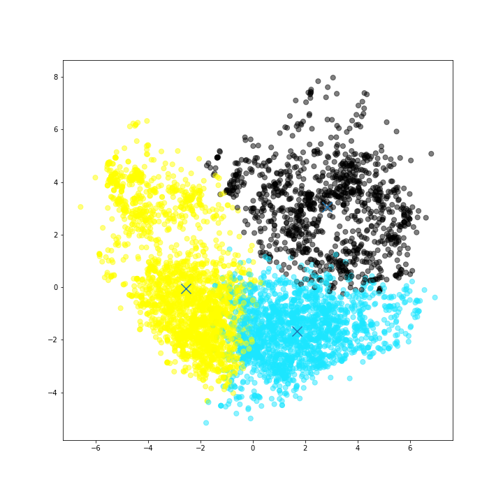
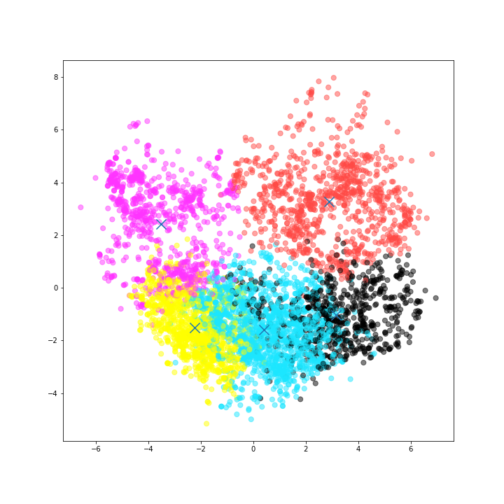
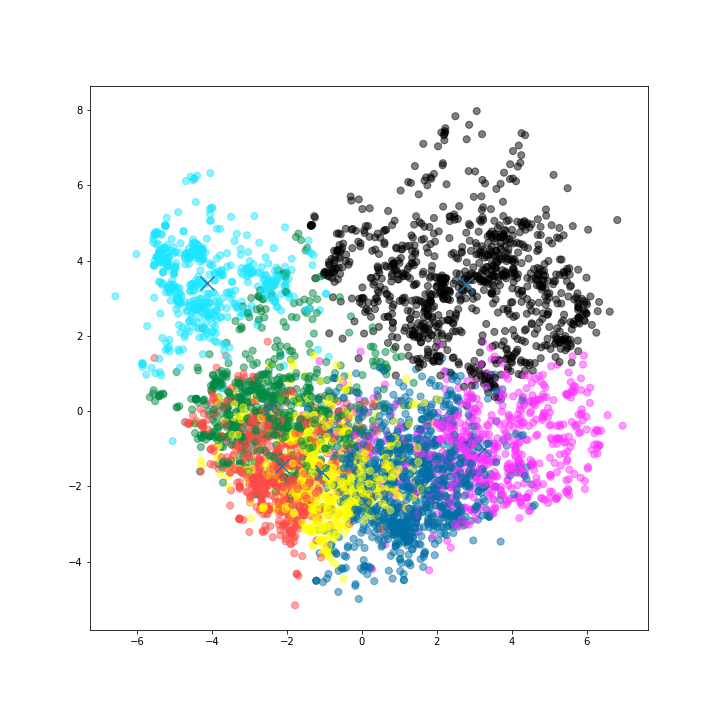
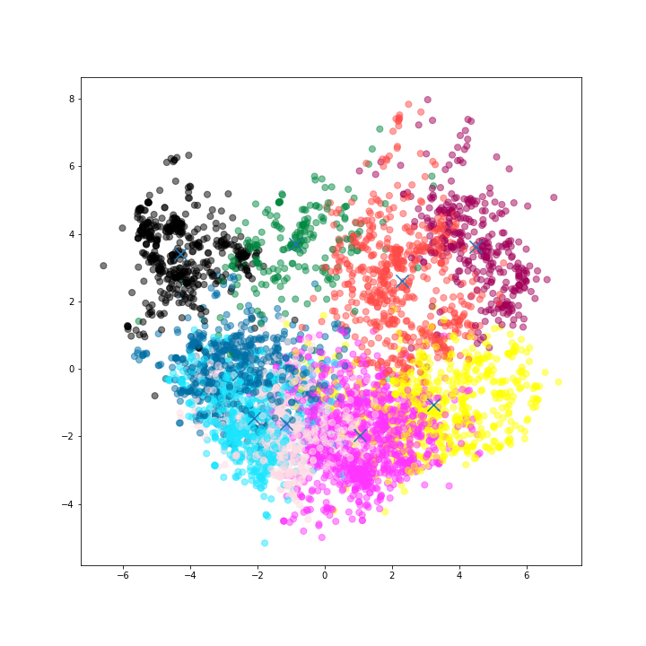
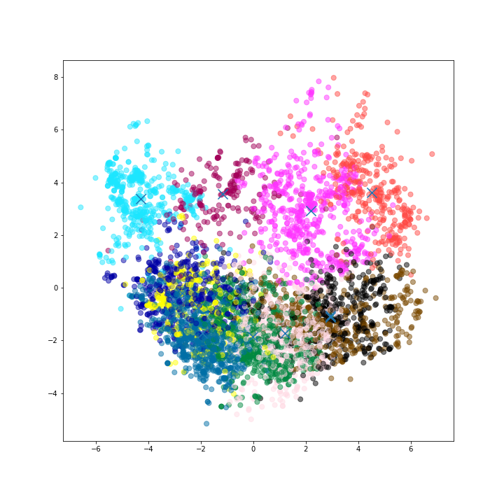
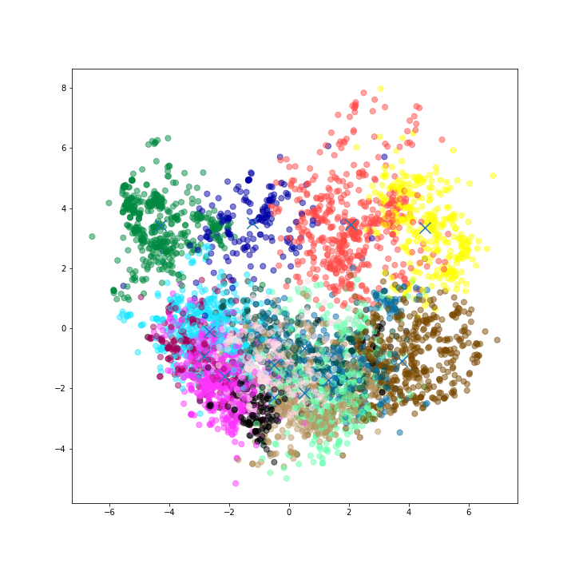
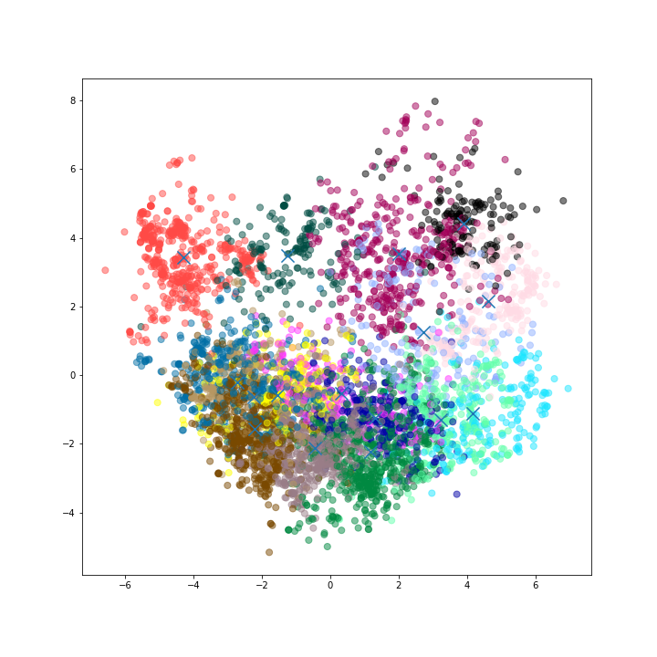
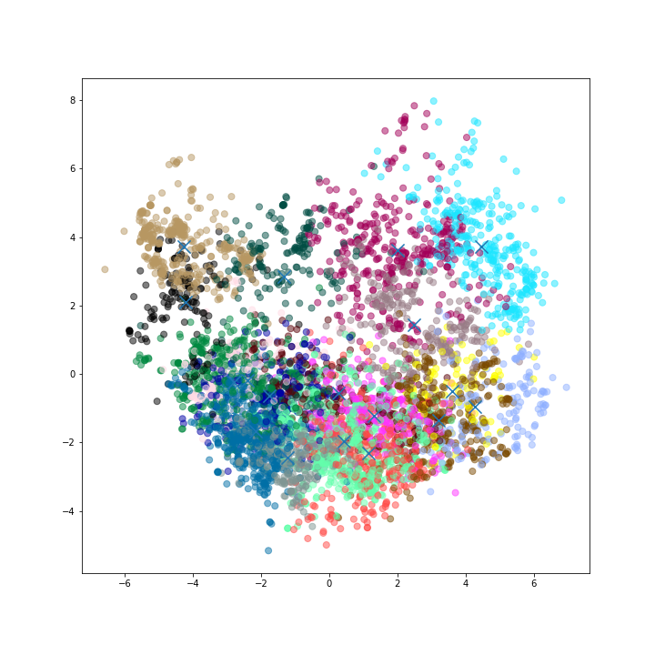
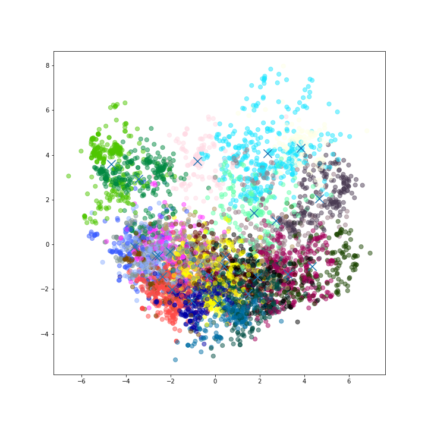
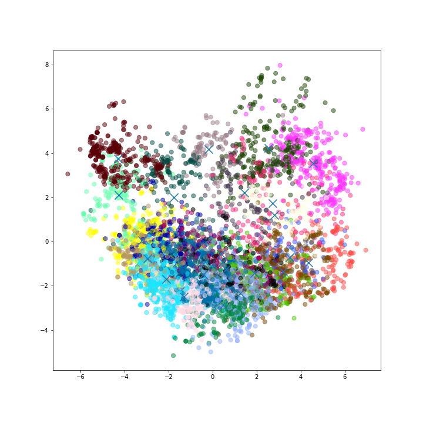

## Wild K-Means Analysis with c=3

### Cluster 1

Centroid: [2.25493519 2.71833333 2.56810185 2.36301852 2.0894537  1.91106481
 2.00037963 1.58012963 1.89081481 1.61237037 1.55577778 1.42199074
 1.50976852 1.84366667 2.35897222 1.68923148 1.78537963 1.81214815
 2.29741667 2.13661111 1.81018519 2.73103704 2.37507407 2.46707407]

|                       |    mean |   variance |
|-----------------------|---------|------------|
| churches              | 2.25269 |   0.76832  |
| resorts               | 2.717   |   1.00223  |
| beaches               | 2.57172 |   0.915354 |
| parks                 | 2.36591 |   0.778003 |
| theatres              | 2.08972 |   0.309992 |
| museums               | 1.91156 |   0.244622 |
| malls                 | 2.00047 |   0.723042 |
| zoo                   | 1.58018 |   0.167467 |
| restaurants           | 1.89335 |   0.82452  |
| pubs/bars             | 1.61539 |   0.2902   |
| local services        | 1.55523 |   0.235453 |
| burger/pizza shops    | 1.42098 |   0.233105 |
| hotels/other lodgings | 1.50859 |   0.567574 |
| juice bars            | 1.84188 |   1.48271  |
| art galleries         | 2.35645 |   2.98797  |
| dance clubs           | 1.68842 |   1.8865   |
| swimming pools        | 1.78342 |   2.33998  |
| gyms                  | 1.81007 |   2.29678  |
| bakeries              | 2.29444 |   3.22574  |
| beauty & spas         | 2.13799 |   2.84027  |
| cafes                 | 1.80857 |   1.84349  |
| view points           | 2.73523 |   2.34749  |
| monuments             | 2.37606 |   1.4896   |
| gardens               | 2.465   |   1.52521  |

### Cluster 2

Centroid: [1.09201217 1.94030832 1.91829615 2.10752941 2.26223529 2.71259635
 3.92331846 3.08372008 4.02090467 3.57423124 3.18066126 2.4896146
 2.5771643  2.91888032 2.86458012 1.05529006 0.7616146  0.60856795
 0.70255984 0.7318215  0.69583367 0.99378499 0.90437728 1.05932657]

|                       |     mean |   variance |
|-----------------------|----------|------------|
| churches              | 1.09201  |   0.416842 |
| resorts               | 1.94031  |   2.22541  |
| beaches               | 1.9183   |   0.876691 |
| parks                 | 2.10753  |   0.84932  |
| theatres              | 2.26224  |   0.86634  |
| museums               | 2.7126   |   1.56861  |
| malls                 | 3.92332  |   1.66664  |
| zoo                   | 3.08372  |   1.39256  |
| restaurants           | 4.0209   |   1.10831  |
| pubs/bars             | 3.57423  |   1.45531  |
| local services        | 3.18066  |   1.98531  |
| burger/pizza shops    | 2.48961  |   1.79824  |
| hotels/other lodgings | 2.57716  |   2.2655   |
| juice bars            | 2.91888  |   3.1084   |
| art galleries         | 2.86458  |   3.65128  |
| dance clubs           | 1.05529  |   1.1813   |
| swimming pools        | 0.761615 |   0.478301 |
| gyms                  | 0.608568 |   0.336469 |
| bakeries              | 0.70256  |   0.654911 |
| beauty & spas         | 0.731822 |   0.694357 |
| cafes                 | 0.695834 |   0.190842 |
| view points           | 0.993785 |   0.768202 |
| monuments             | 0.904377 |   0.298859 |
| gardens               | 1.05933  |   0.475748 |

### Cluster 3

Centroid: [1.47319205 2.58380952 3.18139194 3.93128728 4.34901099 3.68204082
 3.37719519 2.38339613 2.66978022 2.56594976 2.29830979 1.91872841
 1.89091052 1.44800628 1.27167975 1.089618   0.71860806 0.53890633
 0.56424385 0.70377289 0.83693354 2.17254317 1.86477237 1.69507064]

|                       |     mean |   variance |
|-----------------------|----------|------------|
| churches              | 1.47365  |   0.453197 |
| resorts               | 2.58443  |   1.98928  |
| beaches               | 3.17998  |   1.89847  |
| parks                 | 3.93129  |   1.35562  |
| theatres              | 4.35123  |   0.836964 |
| museums               | 3.68361  |   1.32382  |
| malls                 | 3.37859  |   1.69199  |
| zoo                   | 2.38421  |   0.709542 |
| restaurants           | 2.66916  |   1.25967  |
| pubs/bars             | 2.56524  |   1.22276  |
| local services        | 2.2994   |   1.62275  |
| burger/pizza shops    | 1.91982  |   1.5177   |
| hotels/other lodgings | 1.89198  |   1.87498  |
| juice bars            | 1.44861  |   0.948053 |
| art galleries         | 1.27197  |   0.564227 |
| dance clubs           | 1.08945  |   0.734836 |
| swimming pools        | 0.718601 |   0.272962 |
| gyms                  | 0.538748 |   0.140376 |
| bakeries              | 0.564117 |   0.218968 |
| beauty & spas         | 0.701493 |   0.652836 |
| cafes                 | 0.836831 |   0.667497 |
| view points           | 2.16958  |   3.52004  |
| monuments             | 1.86368  |   2.70496  |
| gardens               | 1.69544  |   1.63972  |
## Wild K-Means Analysis with c=4

### Cluster 1

Centroid: [2.27488679 2.78034906 2.64158491 2.42884906 2.12664151 1.93011321
 1.97432075 1.54790566 1.90398113 1.58837736 1.50699057 1.37078302
 1.45627358 1.7385     2.1889717  1.5100566  1.58130189 1.67066981
 2.36756604 2.24608491 1.82834906 2.78041509 2.38212264 2.47416981]

|                       |    mean |   variance |
|-----------------------|---------|------------|
| churches              | 2.27489 |   0.824227 |
| resorts               | 2.78035 |   1.02942  |
| beaches               | 2.64158 |   0.982661 |
| parks                 | 2.42885 |   0.873867 |
| theatres              | 2.12664 |   0.35759  |
| museums               | 1.93011 |   0.264065 |
| malls                 | 1.97432 |   0.632271 |
| zoo                   | 1.54791 |   0.14548  |
| restaurants           | 1.90398 |   0.973492 |
| pubs/bars             | 1.58838 |   0.34454  |
| local services        | 1.50699 |   0.214333 |
| burger/pizza shops    | 1.37078 |   0.211491 |
| hotels/other lodgings | 1.45627 |   0.551509 |
| juice bars            | 1.7385  |   1.31936  |
| art galleries         | 2.18897 |   2.73026  |
| dance clubs           | 1.51006 |   1.41666  |
| swimming pools        | 1.5813  |   1.86046  |
| gyms                  | 1.67067 |   1.93281  |
| bakeries              | 2.36757 |   3.13281  |
| beauty & spas         | 2.24608 |   2.91211  |
| cafes                 | 1.82835 |   1.92946  |
| view points           | 2.78042 |   2.43588  |
| monuments             | 2.38212 |   1.54487  |
| gardens               | 2.47417 |   1.57309  |

### Cluster 2

Centroid: [1.1680774  2.15170412 1.8677965  2.18000624 2.39706617 2.95107366
 4.16315231 3.52099251 4.5087578  3.91241573 3.26938826 1.97862672
 1.79275281 1.75724095 2.0878839  0.99088639 0.65470662 0.49821473
 0.5150437  0.61936954 0.68437578 1.08406367 0.99218477 1.09872659]

|                       |     mean |   variance |
|-----------------------|----------|------------|
| churches              | 1.16831  |   0.302829 |
| resorts               | 2.14993  |   2.3222   |
| beaches               | 1.86798  |   0.87296  |
| parks                 | 2.17824  |   1.00105  |
| theatres              | 2.39678  |   0.962512 |
| museums               | 2.95114  |   1.47237  |
| malls                 | 4.16263  |   1.05486  |
| zoo                   | 3.52139  |   1.19112  |
| restaurants           | 4.50979  |   0.633474 |
| pubs/bars             | 3.91307  |   1.68622  |
| local services        | 3.27006  |   2.60603  |
| burger/pizza shops    | 1.9785   |   1.04595  |
| hotels/other lodgings | 1.79264  |   1.057    |
| juice bars            | 1.75696  |   1.33286  |
| art galleries         | 2.08705  |   2.70894  |
| dance clubs           | 0.988382 |   0.878545 |
| swimming pools        | 0.654753 |   0.187439 |
| gyms                  | 0.49817  |   0.149807 |
| bakeries              | 0.514997 |   0.257688 |
| beauty & spas         | 0.619375 |   0.390562 |
| cafes                 | 0.684391 |   0.168684 |
| view points           | 1.08429  |   0.863359 |
| monuments             | 0.992349 |   0.301292 |
| gardens               | 1.09894  |   0.244438 |

### Cluster 3

Centroid: [1.48115175 2.58845524 3.21066594 3.97936135 4.39561681 3.69735808
 3.36040939 2.36394105 2.60155568 2.58151201 2.34878821 1.94616812
 1.95407205 1.52078057 1.2928821  1.10364083 0.72745633 0.54144105
 0.55463974 0.66127729 0.8249345  2.19548035 1.89677402 1.74290393]

|                       |     mean |   variance |
|-----------------------|----------|------------|
| churches              | 1.48077  |   0.440525 |
| resorts               | 2.58977  |   1.96626  |
| beaches               | 3.20977  |   1.86316  |
| parks                 | 3.97992  |   1.27286  |
| theatres              | 4.39478  |   0.787553 |
| museums               | 3.69689  |   1.33809  |
| malls                 | 3.3613   |   1.68315  |
| zoo                   | 2.36422  |   0.621787 |
| restaurants           | 2.6017   |   1.10202  |
| pubs/bars             | 2.58167  |   1.12922  |
| local services        | 2.3487   |   1.60774  |
| burger/pizza shops    | 1.9463   |   1.51709  |
| hotels/other lodgings | 1.95408  |   1.97309  |
| juice bars            | 1.52116  |   1.1658   |
| art galleries         | 1.29405  |   0.62233  |
| dance clubs           | 1.10577  |   0.755551 |
| swimming pools        | 0.727376 |   0.280134 |
| gyms                  | 0.541457 |   0.140436 |
| bakeries              | 0.554659 |   0.173029 |
| beauty & spas         | 0.661249 |   0.472379 |
| cafes                 | 0.824845 |   0.639938 |
| view points           | 2.19468  |   3.57477  |
| monuments             | 1.89614  |   2.78818  |
| gardens               | 1.74237  |   1.74172  |

### Cluster 4

Centroid: [0.98367983 1.58011435 1.9829106  1.97782744 2.07574844 2.32825364
 3.4997817  2.33932432 3.16866944 2.88427235 2.88429314 3.27564449
 3.7435447  4.68748441 4.16361746 1.34926195 1.1654158  0.9627027
 0.97761954 0.90628898 0.7525052  0.87827443 0.79888773 0.97627859]

|                       |     mean |   variance |
|-----------------------|----------|------------|
| churches              | 0.98368  |   0.533627 |
| resorts               | 1.58011  |   1.75121  |
| beaches               | 1.98291  |   0.834765 |
| parks                 | 1.97783  |   0.544482 |
| theatres              | 2.07575  |   0.676483 |
| museums               | 2.32825  |   1.46164  |
| malls                 | 3.49978  |   2.4692   |
| zoo                   | 2.33932  |   0.893177 |
| restaurants           | 3.16867  |   0.857972 |
| pubs/bars             | 2.88427  |   0.591514 |
| local services        | 2.88429  |   0.943323 |
| burger/pizza shops    | 3.27564  |   1.95279  |
| hotels/other lodgings | 3.74354  |   1.74552  |
| juice bars            | 4.68748  |   0.581242 |
| art galleries         | 4.16362  |   2.56252  |
| dance clubs           | 1.34926  |   2.27239  |
| swimming pools        | 1.16542  |   1.75782  |
| gyms                  | 0.962703 |   1.3143   |
| bakeries              | 0.97762  |   1.18861  |
| beauty & spas         | 0.906289 |   1.1494   |
| cafes                 | 0.752505 |   0.244928 |
| view points           | 0.878274 |   0.524787 |
| monuments             | 0.798888 |   0.250916 |
| gardens               | 0.976279 |   0.651325 |
## Wild K-Means Analysis with c=5

### Cluster 1

Centroid: [1.63314094 2.22304698 3.11257718 4.29531544 4.07797315 3.1866443
 2.72312752 2.19012081 2.65692617 2.71104698 2.684      1.59542282
 1.84455034 1.23002685 1.16048322 1.20908725 0.86826846 0.67261745
 0.61868456 0.97072483 1.03426846 4.72649664 2.54640268 1.78332886]

|                       |     mean |   variance |
|-----------------------|----------|------------|
| churches              | 1.63314  |  0.359983  |
| resorts               | 2.22305  |  1.0057    |
| beaches               | 3.11258  |  2.24504   |
| parks                 | 4.29532  |  1.27734   |
| theatres              | 4.07797  |  1.29874   |
| museums               | 3.18664  |  1.23538   |
| malls                 | 2.72313  |  1.00843   |
| zoo                   | 2.19012  |  0.432645  |
| restaurants           | 2.65693  |  1.43464   |
| pubs/bars             | 2.71105  |  1.42583   |
| local services        | 2.684    |  2.3836    |
| burger/pizza shops    | 1.59542  |  1.57475   |
| hotels/other lodgings | 1.84455  |  2.57101   |
| juice bars            | 1.23003  |  0.75469   |
| art galleries         | 1.16048  |  0.353373  |
| dance clubs           | 1.20909  |  0.496632  |
| swimming pools        | 0.868268 |  0.181002  |
| gyms                  | 0.672617 |  0.087168  |
| bakeries              | 0.618685 |  0.0468217 |
| beauty & spas         | 0.970725 |  1.4475    |
| cafes                 | 1.03427  |  1.40763   |
| view points           | 4.7265   |  0.470371  |
| monuments             | 2.5464   |  3.53426   |
| gardens               | 1.78333  |  1.03705   |

### Cluster 2

Centroid: [1.16933333 1.96816878 1.77004219 2.05210127 2.16740084 2.70910549
 3.9927173  3.71832068 4.64747679 4.48023629 3.66258228 2.01313924
 1.75270042 1.57065823 2.04926582 1.0124557  0.65043882 0.45122363
 0.46428692 0.55494515 0.65273418 1.12249789 1.01532489 1.10895359]

|                       |     mean |   variance |
|-----------------------|----------|------------|
| churches              | 1.17256  |   0.226092 |
| resorts               | 1.97073  |   1.8688   |
| beaches               | 1.76968  |   0.76398  |
| parks                 | 2.05148  |   1.05054  |
| theatres              | 2.16669  |   0.847259 |
| museums               | 2.71088  |   1.30869  |
| malls                 | 3.99288  |   1.0728   |
| zoo                   | 3.7194   |   0.852614 |
| restaurants           | 4.64608  |   0.415792 |
| pubs/bars             | 4.4789   |   0.687803 |
| local services        | 3.66157  |   2.52882  |
| burger/pizza shops    | 2.01289  |   1.22164  |
| hotels/other lodgings | 1.75196  |   1.10477  |
| juice bars            | 1.57355  |   1.03544  |
| art galleries         | 2.04823  |   2.72812  |
| dance clubs           | 1.01228  |   0.885617 |
| swimming pools        | 0.650573 |   0.246952 |
| gyms                  | 0.451543 |   0.18773  |
| bakeries              | 0.464764 |   0.272606 |
| beauty & spas         | 0.554941 |   0.377815 |
| cafes                 | 0.652656 |   0.185159 |
| view points           | 1.12198  |   0.921216 |
| monuments             | 1.01491  |   0.319226 |
| gardens               | 1.10858  |   0.157967 |

### Cluster 3

Centroid: [1.35411695 2.83648553 2.989557   3.42585351 4.03627289 3.81055523
 3.89116361 2.53881276 2.99277023 2.39107501 2.0705316  2.03732428
 1.96468399 1.89422327 1.62611341 1.02961016 0.6618606  0.52765505
 0.58937389 0.7376078  0.76901949 0.85438866 1.33030124 1.53048435]

|                       |     mean |   variance |
|-----------------------|----------|------------|
| churches              | 1.35196  |  0.595491  |
| resorts               | 2.83521  |  2.62459   |
| beaches               | 2.99053  |  1.73235   |
| parks                 | 3.4271   |  1.34091   |
| theatres              | 4.03788  |  1.08318   |
| museums               | 3.80996  |  1.32137   |
| malls                 | 3.89099  |  1.67541   |
| zoo                   | 2.53736  |  1.0448    |
| restaurants           | 2.99277  |  1.49225   |
| pubs/bars             | 2.39077  |  1.0255    |
| local services        | 2.0703   |  1.00285   |
| burger/pizza shops    | 2.03751  |  1.15896   |
| hotels/other lodgings | 1.96533  |  1.42867   |
| juice bars            | 1.89239  |  1.63606   |
| art galleries         | 1.62659  |  1.54294   |
| dance clubs           | 1.02975  |  0.956011  |
| swimming pools        | 0.661773 |  0.244226  |
| gyms                  | 0.527476 |  0.142202  |
| bakeries              | 0.589113 |  0.303024  |
| beauty & spas         | 0.737719 |  0.648259  |
| cafes                 | 0.769143 |  0.268017  |
| view points           | 0.854592 |  0.0968166 |
| monuments             | 1.33078  |  1.47307   |
| gardens               | 1.531    |  1.75964   |

### Cluster 4

Centroid: [0.94348315 1.48440449 1.96621348 1.93619101 1.99580899 2.23153933
 3.49557303 2.30439326 3.19570787 2.91894382 2.91002247 3.3324382
 3.78862921 4.75292135 4.24483146 1.30469663 1.09078652 0.87791011
 1.00533708 0.91603371 0.74805618 0.84889888 0.77341573 0.91149438]

|                       |     mean |   variance |
|-----------------------|----------|------------|
| churches              | 0.943483 |   0.483761 |
| resorts               | 1.4844   |   1.58913  |
| beaches               | 1.96621  |   0.873027 |
| parks                 | 1.93619  |   0.514575 |
| theatres              | 1.99581  |   0.526075 |
| museums               | 2.23154  |   1.28707  |
| malls                 | 3.49557  |   2.52846  |
| zoo                   | 2.30439  |   0.880275 |
| restaurants           | 3.19571  |   0.864253 |
| pubs/bars             | 2.91894  |   0.591029 |
| local services        | 2.91002  |   0.929278 |
| burger/pizza shops    | 3.33244  |   1.9733   |
| hotels/other lodgings | 3.78863  |   1.7161   |
| juice bars            | 4.75292  |   0.463615 |
| art galleries         | 4.24483  |   2.34273  |
| dance clubs           | 1.3047   |   2.16409  |
| swimming pools        | 1.09079  |   1.53906  |
| gyms                  | 0.87791  |   1.00169  |
| bakeries              | 1.00534  |   1.23326  |
| beauty & spas         | 0.916034 |   1.2124   |
| cafes                 | 0.748056 |   0.263005 |
| view points           | 0.848899 |   0.475316 |
| monuments             | 0.773416 |   0.234628 |
| gardens               | 0.911494 |   0.478933 |

### Cluster 5

Centroid: [2.34129374 2.69838812 2.49646872 2.23211029 2.04436903 1.8718982
 1.93670201 1.56480382 1.75816543 1.57010604 1.56688229 1.43172853
 1.53505832 1.8438176  2.34910923 1.59393425 1.77082715 1.88401909
 2.53195122 2.13313892 1.86412513 2.64849417 2.45724284 2.61922587]

|                       |    mean |   variance |
|-----------------------|---------|------------|
| churches              | 2.34129 |   0.69393  |
| resorts               | 2.69839 |   0.903196 |
| beaches               | 2.49647 |   0.679707 |
| parks                 | 2.23211 |   0.493942 |
| theatres              | 2.04437 |   0.265665 |
| museums               | 1.8719  |   0.237363 |
| malls                 | 1.9367  |   0.6538   |
| zoo                   | 1.5648  |   0.179699 |
| restaurants           | 1.75817 |   0.517358 |
| pubs/bars             | 1.57011 |   0.13499  |
| local services        | 1.56688 |   0.240596 |
| burger/pizza shops    | 1.43173 |   0.21453  |
| hotels/other lodgings | 1.53506 |   0.605401 |
| juice bars            | 1.84382 |   1.43041  |
| art galleries         | 2.34911 |   2.91298  |
| dance clubs           | 1.59393 |   1.56977  |
| swimming pools        | 1.77083 |   2.18336  |
| gyms                  | 1.88402 |   2.21942  |
| bakeries              | 2.53195 |   3.18336  |
| beauty & spas         | 2.13314 |   2.66211  |
| cafes                 | 1.86413 |   1.88366  |
| view points           | 2.64849 |   2.12974  |
| monuments             | 2.45724 |   1.35943  |
| gardens               | 2.61923 |   1.50323  |
## Wild K-Means Analysis with c=6

### Cluster 1

Centroid: [0.84868827 1.08989198 1.68381173 1.68813272 1.70246914 1.70625
 3.03858025 2.00813272 2.74484568 2.85112654 3.13760802 3.83351852
 4.09625    4.74337963 4.0392284  1.61631173 1.36510802 1.0779784
 1.12777778 0.97294753 0.73723765 0.79344136 0.74425926 0.84049383]

|                       |     mean |   variance |
|-----------------------|----------|------------|
| churches              | 0.848408 |   0.361755 |
| resorts               | 1.08961  |   0.391428 |
| beaches               | 1.68464  |   0.25941  |
| parks                 | 1.68672  |   0.180953 |
| theatres              | 1.70087  |   0.202756 |
| museums               | 1.70465  |   0.150221 |
| malls                 | 3.03555  |   2.53419  |
| zoo                   | 2.00801  |   0.298358 |
| restaurants           | 2.74425  |   0.205049 |
| pubs/bars             | 2.85148  |   0.219292 |
| local services        | 3.13845  |   0.792368 |
| burger/pizza shops    | 3.83544  |   1.62497  |
| hotels/other lodgings | 4.09856  |   1.30604  |
| juice bars            | 4.74298  |   0.601698 |
| art galleries         | 4.03974  |   2.90014  |
| dance clubs           | 1.61765  |   3.00456  |
| swimming pools        | 1.36618  |   2.39688  |
| gyms                  | 1.07861  |   1.81111  |
| bakeries              | 1.12847  |   1.65003  |
| beauty & spas         | 0.974451 |   1.51546  |
| cafes                 | 0.738377 |   0.320449 |
| view points           | 0.793138 |   0.43273  |
| monuments             | 0.743972 |   0.298669 |
| gardens               | 0.840216 |   0.379981 |

### Cluster 2

Centroid: [1.14095388 2.91318658 2.28972746 2.26771488 2.51704403 3.45341719
 4.63709644 3.2462369  4.47709644 3.16425577 2.18350105 1.89634172
 2.02281971 2.98124738 3.65461216 0.79475891 0.65252621 0.65446541
 0.70805031 0.84735849 0.83292453 0.90616352 0.89761006 1.02807128]

|                       |     mean |   variance |
|-----------------------|----------|------------|
| churches              | 1.14045  |  0.56498   |
| resorts               | 2.91035  |  3.47152   |
| beaches               | 2.29137  |  1.40039   |
| parks                 | 2.27092  |  0.629873  |
| theatres              | 2.51851  |  0.705225  |
| museums               | 3.45202  |  1.79072   |
| malls                 | 4.63786  |  0.769501  |
| zoo                   | 3.2452   |  1.78822   |
| restaurants           | 4.47456  |  0.750523  |
| pubs/bars             | 3.16497  |  2.12062   |
| local services        | 2.18687  |  0.885119  |
| burger/pizza shops    | 1.89737  |  0.423076  |
| hotels/other lodgings | 2.02361  |  1.07772   |
| juice bars            | 2.98257  |  2.67137   |
| art galleries         | 3.65441  |  3.16595   |
| dance clubs           | 0.794529 |  0.455787  |
| swimming pools        | 0.65249  |  0.0315664 |
| gyms                  | 0.654414 |  0.0352729 |
| bakeries              | 0.707908 |  0.245848  |
| beauty & spas         | 0.84637  |  0.473337  |
| cafes                 | 0.831883 |  0.116109  |
| view points           | 0.906046 |  0.145313  |
| monuments             | 0.897458 |  0.0990454 |
| gardens               | 1.02777  |  0.368507  |

### Cluster 3

Centroid: [1.39551282 2.75044495 3.18829563 3.67811463 4.3588537  3.83231523
 3.67767722 2.45133484 2.62779035 2.45630468 2.07323529 2.06616139
 1.98230015 1.68671946 1.31941176 1.06277526 0.66279789 0.48871041
 0.56085973 0.68153846 0.74941176 0.84864253 1.47865762 1.66641026]

|                       |     mean |   variance |
|-----------------------|----------|------------|
| churches              | 1.39598  |   0.585903 |
| resorts               | 2.75113  |   2.37883  |
| beaches               | 3.18693  |   1.77008  |
| parks                 | 3.67712  |   1.33667  |
| theatres              | 4.35935  |   0.807452 |
| museums               | 3.83307  |   1.31813  |
| malls                 | 3.67668  |   1.7185   |
| zoo                   | 2.45061  |   0.791263 |
| restaurants           | 2.62721  |   1.09738  |
| pubs/bars             | 2.45485  |   1.02265  |
| local services        | 2.07103  |   1.01898  |
| burger/pizza shops    | 2.06607  |   1.32964  |
| hotels/other lodgings | 1.98214  |   1.64063  |
| juice bars            | 1.68631  |   1.37363  |
| art galleries         | 1.31783  |   0.632829 |
| dance clubs           | 1.06311  |   0.95627  |
| swimming pools        | 0.662845 |   0.306306 |
| gyms                  | 0.488634 |   0.167644 |
| bakeries              | 0.56083  |   0.30941  |
| beauty & spas         | 0.681487 |   0.613872 |
| cafes                 | 0.749472 |   0.336592 |
| view points           | 0.848747 |   0.101136 |
| monuments             | 1.47923  |   1.91656  |
| gardens               | 1.6671   |   2.09932  |

### Cluster 4

Centroid: [1.23442045 1.57797727 1.7015     2.20219318 2.29673864 2.56814773
 3.70214773 3.63677273 4.52331818 4.47036364 4.18357955 2.08831818
 1.85368182 1.35253409 1.38943182 1.11742045 0.66315909 0.38821591
 0.35755682 0.44676136 0.57903409 1.24072727 1.10326136 1.19625   ]

|                       |     mean |   variance |
|-----------------------|----------|------------|
| churches              | 1.23442  |   0.140217 |
| resorts               | 1.57798  |   0.615817 |
| beaches               | 1.7015   |   0.503105 |
| parks                 | 2.20219  |   1.29292  |
| theatres              | 2.29674  |   0.984627 |
| museums               | 2.56815  |   0.904588 |
| malls                 | 3.70215  |   0.998304 |
| zoo                   | 3.63677  |   0.686324 |
| restaurants           | 4.52332  |   0.496077 |
| pubs/bars             | 4.47036  |   0.563595 |
| local services        | 4.18358  |   2.13794  |
| burger/pizza shops    | 2.08832  |   1.54077  |
| hotels/other lodgings | 1.85368  |   1.46502  |
| juice bars            | 1.35253  |   0.374031 |
| art galleries         | 1.38943  |   0.969664 |
| dance clubs           | 1.11742  |   1.07504  |
| swimming pools        | 0.663159 |   0.312271 |
| gyms                  | 0.388216 |   0.201343 |
| bakeries              | 0.357557 |   0.201328 |
| beauty & spas         | 0.446761 |   0.331939 |
| cafes                 | 0.579034 |   0.169732 |
| view points           | 1.24073  |   1.27543  |
| monuments             | 1.10326  |   0.46816  |
| gardens               | 1.19625  |   0.160326 |

### Cluster 5

Centroid: [1.64150761 2.23084371 3.1264177  4.30698479 4.07598893 3.19780083
 2.72858921 2.19207469 2.66614108 2.71479945 2.6717704  1.6028769
 1.86799447 1.27174274 1.19040111 1.21582296 0.87143845 0.66930844
 0.62232365 0.9849101  1.04322268 4.81589212 2.48786999 1.77950207]

|                       |     mean |   variance |
|-----------------------|----------|------------|
| churches              | 1.64151  |  0.364958  |
| resorts               | 2.23084  |  1.00269   |
| beaches               | 3.12642  |  2.26012   |
| parks                 | 4.30698  |  1.26537   |
| theatres              | 4.07599  |  1.29067   |
| museums               | 3.1978   |  1.22866   |
| malls                 | 2.72859  |  1.01683   |
| zoo                   | 2.19207  |  0.431214  |
| restaurants           | 2.66614  |  1.42189   |
| pubs/bars             | 2.7148   |  1.40635   |
| local services        | 2.67177  |  2.32953   |
| burger/pizza shops    | 1.60288  |  1.59547   |
| hotels/other lodgings | 1.86799  |  2.62718   |
| juice bars            | 1.27174  |  0.880676  |
| art galleries         | 1.1904   |  0.462539  |
| dance clubs           | 1.21582  |  0.506717  |
| swimming pools        | 0.871438 |  0.182815  |
| gyms                  | 0.669308 |  0.0599217 |
| bakeries              | 0.622324 |  0.0439109 |
| beauty & spas         | 0.98491  |  1.48082   |
| cafes                 | 1.04322  |  1.41677   |
| view points           | 4.81589  |  0.165018  |
| monuments             | 2.48787  |  3.49527   |
| gardens               | 1.7795   |  1.01375   |

### Cluster 6

Centroid: [2.35723243 2.72678919 2.50905946 2.24155676 2.04498378 1.87355676
 1.9299027  1.54454054 1.74395676 1.55174054 1.55033514 1.41597838
 1.51602162 1.82619459 2.27269189 1.54674595 1.7072973  1.82770811
 2.56942703 2.17143784 1.88081081 2.67380541 2.47464865 2.63848649]

|                       |    mean |   variance |
|-----------------------|---------|------------|
| churches              | 2.35723 |   0.695183 |
| resorts               | 2.72679 |   0.905318 |
| beaches               | 2.50906 |   0.681679 |
| parks                 | 2.24156 |   0.516621 |
| theatres              | 2.04498 |   0.261476 |
| museums               | 1.87356 |   0.250734 |
| malls                 | 1.9299  |   0.644213 |
| zoo                   | 1.54454 |   0.155196 |
| restaurants           | 1.74396 |   0.516186 |
| pubs/bars             | 1.55174 |   0.122789 |
| local services        | 1.55034 |   0.225708 |
| burger/pizza shops    | 1.41598 |   0.208012 |
| hotels/other lodgings | 1.51602 |   0.595003 |
| juice bars            | 1.82619 |   1.44452  |
| art galleries         | 2.27269 |   2.79028  |
| dance clubs           | 1.54675 |   1.42832  |
| swimming pools        | 1.7073  |   2.01975  |
| gyms                  | 1.82771 |   2.0789   |
| bakeries              | 2.56943 |   3.13931  |
| beauty & spas         | 2.17144 |   2.67797  |
| cafes                 | 1.88081 |   1.90245  |
| view points           | 2.67381 |   2.15052  |
| monuments             | 2.47465 |   1.36875  |
| gardens               | 2.63849 |   1.50494  |
## Wild K-Means Analysis with c=7

### Cluster 1

Centroid: [2.33036055 2.62969247 2.42846235 2.19038176 2.01664899 1.85097561
 1.95147402 1.58772004 1.75697773 1.60793213 1.59622481 1.4659597
 1.57019088 1.9252386  2.41932131 1.73763521 1.9164263  1.94865323
 2.46387063 2.08283139 1.87937434 2.64239661 2.45450689 2.60149523]

|                       |    mean |   variance |
|-----------------------|---------|------------|
| churches              | 2.33036 |   0.658046 |
| resorts               | 2.62969 |   0.848005 |
| beaches               | 2.42846 |   0.607171 |
| parks                 | 2.19038 |   0.440731 |
| theatres              | 2.01665 |   0.242848 |
| museums               | 1.85098 |   0.213481 |
| malls                 | 1.95147 |   0.725194 |
| zoo                   | 1.58772 |   0.192462 |
| restaurants           | 1.75698 |   0.437765 |
| pubs/bars             | 1.60793 |   0.152331 |
| local services        | 1.59622 |   0.23751  |
| burger/pizza shops    | 1.46596 |   0.231716 |
| hotels/other lodgings | 1.57019 |   0.61176  |
| juice bars            | 1.92524 |   1.57881  |
| art galleries         | 2.41932 |   2.98584  |
| dance clubs           | 1.73764 |   1.91912  |
| swimming pools        | 1.91643 |   2.47767  |
| gyms                  | 1.94865 |   2.39814  |
| bakeries              | 2.46387 |   3.24094  |
| beauty & spas         | 2.08283 |   2.62802  |
| cafes                 | 1.87937 |   1.86379  |
| view points           | 2.6424  |   2.05574  |
| monuments             | 2.45451 |   1.29349  |
| gardens               | 2.6015  |   1.43509  |

### Cluster 2

Centroid: [1.21294344 2.34722365 1.94498715 2.22482005 2.81397172 3.73582262
 4.58214653 3.38347044 4.04958869 3.03919023 1.85374036 1.76417738
 1.76374036 2.35596401 1.0655527  0.75173522 0.61096401 0.53978149
 0.65161954 0.81473008 0.78362468 0.89317481 1.00075835 1.27017995]

|                       |     mean |   variance |
|-----------------------|----------|------------|
| churches              | 1.21339  |  0.678274  |
| resorts               | 2.34608  |  2.88369   |
| beaches               | 1.9485   |  0.879844  |
| parks                 | 2.22438  |  0.711678  |
| theatres              | 2.81427  |  1.1216    |
| museums               | 3.73355  |  1.35115   |
| malls                 | 4.57987  |  0.590902  |
| zoo                   | 3.38595  |  1.66963   |
| restaurants           | 4.05294  |  1.52184   |
| pubs/bars             | 3.04397  |  2.12834   |
| local services        | 1.8542   |  0.500439  |
| burger/pizza shops    | 1.76455  |  0.630943  |
| hotels/other lodgings | 1.76378  |  1.0423    |
| juice bars            | 2.35598  |  2.6506    |
| art galleries         | 1.06463  |  0.183495  |
| dance clubs           | 0.757314 |  0.243853  |
| swimming pools        | 0.610835 |  0.0762599 |
| gyms                  | 0.538946 |  0.124221  |
| bakeries              | 0.650746 |  0.339676  |
| beauty & spas         | 0.814499 |  0.489486  |
| cafes                 | 0.782995 |  0.109715  |
| view points           | 0.893265 |  0.124672  |
| monuments             | 1.00131  |  0.339159  |
| gardens               | 1.27062  |  1.112     |

### Cluster 3

Centroid: [0.68419608 0.93658824 1.60592157 1.58252941 1.59666667 1.61503922
 2.87590196 1.94617647 2.7257451  2.91456863 3.24986275 4.23298039
 4.47068627 4.96766667 3.91964706 1.0314902  0.88403922 0.89464706
 1.32015686 1.06772549 0.63152941 0.60841176 0.58778431 0.69443137]

|                       |     mean |   variance |
|-----------------------|----------|------------|
| churches              | 0.684196 |  0.301089  |
| resorts               | 0.936588 |  0.34638   |
| beaches               | 1.60592  |  0.146309  |
| parks                 | 1.58253  |  0.0364924 |
| theatres              | 1.59667  |  0.0990152 |
| museums               | 1.61504  |  0.0914372 |
| malls                 | 2.8759   |  2.53368   |
| zoo                   | 1.94618  |  0.280909  |
| restaurants           | 2.72575  |  0.131456  |
| pubs/bars             | 2.91457  |  0.155822  |
| local services        | 3.24986  |  0.689914  |
| burger/pizza shops    | 4.23298  |  1.19644   |
| hotels/other lodgings | 4.47069  |  0.795536  |
| juice bars            | 4.96767  |  0.114498  |
| art galleries         | 3.91965  |  3.24851   |
| dance clubs           | 1.03149  |  1.2658    |
| swimming pools        | 0.884039 |  0.771313  |
| gyms                  | 0.894647 |  0.889714  |
| bakeries              | 1.32016  |  1.86275   |
| beauty & spas         | 1.06773  |  1.83352   |
| cafes                 | 0.631529 |  0.281213  |
| view points           | 0.608412 |  0.256182  |
| monuments             | 0.587784 |  0.229509  |
| gardens               | 0.694431 |  0.345708  |

### Cluster 4

Centroid: [1.64762973 2.25413745 3.14660589 4.29081346 4.08115007 3.21088359
 2.72004208 2.16809257 2.62244039 2.67607293 2.62239832 1.60171108
 1.80290323 1.24915849 1.15509116 1.21468443 0.87137447 0.67057504
 0.63199158 1.00406732 1.0398878  4.82963534 2.49350631 1.78423562]

|                       |     mean |   variance |
|-----------------------|----------|------------|
| churches              | 1.64763  |  0.394837  |
| resorts               | 2.25414  |  1.04302   |
| beaches               | 3.14661  |  2.2624    |
| parks                 | 4.29081  |  1.27183   |
| theatres              | 4.08115  |  1.2676    |
| museums               | 3.21088  |  1.23005   |
| malls                 | 2.72004  |  1.03577   |
| zoo                   | 2.16809  |  0.426479  |
| restaurants           | 2.62244  |  1.39067   |
| pubs/bars             | 2.67607  |  1.41345   |
| local services        | 2.6224   |  2.28507   |
| burger/pizza shops    | 1.60171  |  1.61742   |
| hotels/other lodgings | 1.8029   |  2.46943   |
| juice bars            | 1.24916  |  0.816418  |
| art galleries         | 1.15509  |  0.334109  |
| dance clubs           | 1.21468  |  0.515029  |
| swimming pools        | 0.871374 |  0.185163  |
| gyms                  | 0.670575 |  0.0601793 |
| bakeries              | 0.631992 |  0.0741882 |
| beauty & spas         | 1.00407  |  1.54285   |
| cafes                 | 1.03989  |  1.38851   |
| view points           | 4.82964  |  0.120506  |
| monuments             | 2.49351  |  3.50348   |
| gardens               | 1.78424  |  1.04174   |

### Cluster 5

Centroid: [1.2402193  1.54926901 1.66328947 2.2026462  2.28216374 2.37115497
 3.49562865 3.50893275 4.40516082 4.35796784 4.96421053 2.28118421
 2.05261696 1.34190058 1.51226608 1.19935673 0.75640351 0.43444444
 0.35368421 0.34415205 0.51320175 1.33595029 1.10381579 1.18647661]

|                       |     mean |   variance |
|-----------------------|----------|------------|
| churches              | 1.24022  |  0.168328  |
| resorts               | 1.54927  |  0.451022  |
| beaches               | 1.66329  |  0.367246  |
| parks                 | 2.20265  |  1.3699    |
| theatres              | 2.28216  |  1.09996   |
| museums               | 2.37115  |  0.805817  |
| malls                 | 3.49563  |  0.885521  |
| zoo                   | 3.50893  |  0.617608  |
| restaurants           | 4.40516  |  0.519093  |
| pubs/bars             | 4.35797  |  0.562045  |
| local services        | 4.96421  |  0.0664282 |
| burger/pizza shops    | 2.28118  |  1.83117   |
| hotels/other lodgings | 2.05262  |  1.90286   |
| juice bars            | 1.3419   |  0.330871  |
| art galleries         | 1.51227  |  1.07582   |
| dance clubs           | 1.19936  |  1.09725   |
| swimming pools        | 0.756404 |  0.422103  |
| gyms                  | 0.434444 |  0.288734  |
| bakeries              | 0.353684 |  0.230304  |
| beauty & spas         | 0.344152 |  0.211372  |
| cafes                 | 0.513202 |  0.168794  |
| view points           | 1.33595  |  1.7633    |
| monuments             | 1.10382  |  0.717645  |
| gardens               | 1.18648  |  0.17755   |

### Cluster 6

Centroid: [1.19443396 2.55438005 2.36638814 2.37966307 2.55820755 3.17867925
 4.53743935 3.00331536 4.28696765 3.3088814  2.34942049 1.93304582
 2.20169811 3.01265499 4.83702156 1.16281671 0.788531   0.64478437
 0.69543127 0.81649596 0.86165768 1.04032345 0.96933962 1.0840566 ]

|                       |     mean |   variance |
|-----------------------|----------|------------|
| churches              | 1.19443  |   0.437611 |
| resorts               | 2.55438  |   2.92575  |
| beaches               | 2.36639  |   1.45324  |
| parks                 | 2.37966  |   0.813452 |
| theatres              | 2.55821  |   0.745017 |
| museums               | 3.17868  |   1.68992  |
| malls                 | 4.53744  |   0.97884  |
| zoo                   | 3.00332  |   1.64034  |
| restaurants           | 4.28697  |   1.00838  |
| pubs/bars             | 3.30888  |   2.05181  |
| local services        | 2.34942  |   1.19964  |
| burger/pizza shops    | 1.93305  |   0.409487 |
| hotels/other lodgings | 2.2017   |   1.21446  |
| juice bars            | 3.01265  |   2.67281  |
| art galleries         | 4.83702  |   0.196038 |
| dance clubs           | 1.16282  |   1.81942  |
| swimming pools        | 0.788531 |   0.641501 |
| gyms                  | 0.644784 |   0.191635 |
| bakeries              | 0.695431 |   0.317143 |
| beauty & spas         | 0.816496 |   0.505305 |
| cafes                 | 0.861658 |   0.152796 |
| view points           | 1.04032  |   0.369672 |
| monuments             | 0.96934  |   0.11855  |
| gardens               | 1.08406  |   0.289731 |

### Cluster 7

Centroid: [1.42074586 3.04831492 3.51975138 3.98214549 4.48403315 3.72141805
 3.42188766 2.3628453  2.57289134 2.52678637 2.11712707 2.10766114
 1.97121547 1.59069061 1.36517495 1.11342541 0.66455801 0.47843462
 0.53322284 0.696814   0.76777164 0.85150092 1.57721915 1.68628913]

|                       |     mean |   variance |
|-----------------------|----------|------------|
| churches              | 1.42042  |  0.493166  |
| resorts               | 3.04913  |  2.2975    |
| beaches               | 3.51724  |  1.53236   |
| parks                 | 3.98246  |  0.991919  |
| theatres              | 4.48382  |  0.708816  |
| museums               | 3.72305  |  1.40232   |
| malls                 | 3.42352  |  1.76407   |
| zoo                   | 2.36107  |  0.597999  |
| restaurants           | 2.57049  |  1.04674   |
| pubs/bars             | 2.52336  |  1.1126    |
| local services        | 2.1168   |  1.08775   |
| burger/pizza shops    | 2.10739  |  1.36706   |
| hotels/other lodgings | 1.97119  |  1.60142   |
| juice bars            | 1.59068  |  1.04164   |
| art galleries         | 1.36584  |  0.702363  |
| dance clubs           | 1.10943  |  1.04116   |
| swimming pools        | 0.66465  |  0.348869  |
| gyms                  | 0.479033 |  0.16486   |
| bakeries              | 0.533849 |  0.319867  |
| beauty & spas         | 0.69698  |  0.751337  |
| cafes                 | 0.768223 |  0.415519  |
| view points           | 0.851436 |  0.0904978 |
| monuments             | 1.57682  |  2.11089   |
| gardens               | 1.68598  |  2.05754   |
## Wild K-Means Analysis with c=8

### Cluster 1

Centroid: [1.35530612 2.7227708  3.15417582 3.693281   4.42747253 3.88744113
 3.71854788 2.47459969 2.60443485 2.48897959 2.10736264 2.09750392
 2.0072135  1.69167975 1.31472527 1.03866562 0.66320251 0.4822449
 0.54271586 0.60580848 0.74300628 0.84321036 1.50761381 1.69383046]

|                       |     mean |   variance |
|-----------------------|----------|------------|
| churches              | 1.35531  |   0.457025 |
| resorts               | 2.72277  |   2.39707  |
| beaches               | 3.15418  |   1.75731  |
| parks                 | 3.69328  |   1.34543  |
| theatres              | 4.42747  |   0.725566 |
| museums               | 3.88744  |   1.29948  |
| malls                 | 3.71855  |   1.71086  |
| zoo                   | 2.4746   |   0.788501 |
| restaurants           | 2.60443  |   1.03047  |
| pubs/bars             | 2.48898  |   0.993337 |
| local services        | 2.10736  |   1.04743  |
| burger/pizza shops    | 2.0975   |   1.35941  |
| hotels/other lodgings | 2.00721  |   1.69011  |
| juice bars            | 1.69168  |   1.40632  |
| art galleries         | 1.31473  |   0.634173 |
| dance clubs           | 1.03867  |   0.85045  |
| swimming pools        | 0.663203 |   0.317834 |
| gyms                  | 0.482245 |   0.17169  |
| bakeries              | 0.542716 |   0.277335 |
| beauty & spas         | 0.605808 |   0.319807 |
| cafes                 | 0.743006 |   0.347175 |
| view points           | 0.84321  |   0.103072 |
| monuments             | 1.50761  |   1.99783  |
| gardens               | 1.69383  |   2.15423  |

### Cluster 2

Centroid: [1.145353   2.87151739 2.27711275 2.26792413 2.51748156 3.44962065
 4.64826133 3.24663857 4.46238145 3.17436249 2.23642782 1.91213909
 2.06916754 3.08115911 3.65760801 0.72734457 0.65781876 0.65726027
 0.69007376 0.82384615 0.82665964 0.92771338 0.90119073 1.0412118 ]

|                       |     mean |   variance |
|-----------------------|----------|------------|
| churches              | 1.14499  |  0.561387  |
| resorts               | 2.86995  |  3.45422   |
| beaches               | 2.27616  |  1.37601   |
| parks                 | 2.26701  |  0.643912  |
| theatres              | 2.51631  |  0.715032  |
| museums               | 3.45125  |  1.80476   |
| malls                 | 4.64863  |  0.739801  |
| zoo                   | 3.24749  |  1.77024   |
| restaurants           | 4.46295  |  0.751099  |
| pubs/bars             | 3.17391  |  2.05731   |
| local services        | 2.23934  |  0.969745  |
| burger/pizza shops    | 1.91244  |  0.43741   |
| hotels/other lodgings | 2.06852  |  1.16332   |
| juice bars            | 3.08318  |  2.70166   |
| art galleries         | 3.65473  |  3.19075   |
| dance clubs           | 0.727337 |  0.15644   |
| swimming pools        | 0.657874 |  0.0318037 |
| gyms                  | 0.657326 |  0.0352295 |
| bakeries              | 0.690126 |  0.162313  |
| beauty & spas         | 0.8238   |  0.378207  |
| cafes                 | 0.826632 |  0.117885  |
| view points           | 0.927558 |  0.204957  |
| monuments             | 0.901053 |  0.10432   |
| gardens               | 1.04094  |  0.396488  |

### Cluster 3

Centroid: [2.54962857 2.5808     2.38134286 2.02074286 1.84888571 1.58711429
 1.51051429 1.29785714 1.51554286 1.50971429 1.47488571 1.07528571
 1.01031429 1.34468571 2.4772     1.71445714 1.42568571 1.30828571
 1.75125714 2.34602857 3.06591429 4.3478     3.39717143 3.1942    ]

|                       |    mean |   variance |
|-----------------------|---------|------------|
| churches              | 2.54963 |  0.467443  |
| resorts               | 2.5808  |  0.366915  |
| beaches               | 2.38134 |  0.37922   |
| parks                 | 2.02074 |  0.33527   |
| theatres              | 1.84889 |  0.279617  |
| museums               | 1.58711 |  0.324685  |
| malls                 | 1.51051 |  0.460595  |
| zoo                   | 1.29786 |  0.0154656 |
| restaurants           | 1.51554 |  0.383073  |
| pubs/bars             | 1.50971 |  0.217467  |
| local services        | 1.47489 |  0.38498   |
| burger/pizza shops    | 1.07529 |  0.174538  |
| hotels/other lodgings | 1.01031 |  0.201109  |
| juice bars            | 1.34469 |  1.47578   |
| art galleries         | 2.4772  |  3.78841   |
| dance clubs           | 1.71446 |  2.2241    |
| swimming pools        | 1.42569 |  1.59834   |
| gyms                  | 1.30829 |  0.852779  |
| bakeries              | 1.75126 |  2.21257   |
| beauty & spas         | 2.34603 |  2.5312    |
| cafes                 | 3.06591 |  2.20481   |
| view points           | 4.3478  |  0.505013  |
| monuments             | 3.39717 |  1.00104   |
| gardens               | 3.1942  |  1.49395   |

### Cluster 4

Centroid: [1.65526611 2.21886555 3.14502801 4.31752101 4.09577031 3.20929972
 2.73236695 2.20443978 2.67455182 2.71498599 2.70187675 1.61369748
 1.89259104 1.28728291 1.20106443 1.19051821 0.87490196 0.67012605
 0.6207563  0.94061625 1.01471989 4.81077031 2.48103641 1.7787395 ]

|                       |     mean |   variance |
|-----------------------|----------|------------|
| churches              | 1.65527  |  0.384454  |
| resorts               | 2.21887  |  0.963463  |
| beaches               | 3.14503  |  2.24546   |
| parks                 | 4.31752  |  1.25705   |
| theatres              | 4.09577  |  1.28189   |
| museums               | 3.2093   |  1.23174   |
| malls                 | 2.73237  |  1.0129    |
| zoo                   | 2.20444  |  0.430531  |
| restaurants           | 2.67455  |  1.41564   |
| pubs/bars             | 2.71499  |  1.36526   |
| local services        | 2.70188  |  2.32525   |
| burger/pizza shops    | 1.6137   |  1.60775   |
| hotels/other lodgings | 1.89259  |  2.67171   |
| juice bars            | 1.28728  |  0.929081  |
| art galleries         | 1.20106  |  0.483545  |
| dance clubs           | 1.19052  |  0.430205  |
| swimming pools        | 0.874902 |  0.184048  |
| gyms                  | 0.670126 |  0.060484  |
| bakeries              | 0.620756 |  0.0429464 |
| beauty & spas         | 0.940616 |  1.32813   |
| cafes                 | 1.01472  |  1.32395   |
| view points           | 4.81077  |  0.171224  |
| monuments             | 2.48104  |  3.49595   |
| gardens               | 1.77874  |  1.01501   |

### Cluster 5

Centroid: [0.64122699 0.90805726 1.5904908  1.57122699 1.58351738 1.61294479
 2.92218814 1.94836401 2.74961145 2.95169734 3.32323108 4.31654397
 4.5702045  4.90879346 3.85928425 0.74134969 0.8101227  0.94531697
 1.37498978 1.07807771 0.58087935 0.55137014 0.53425358 0.649182  ]

|                       |     mean |   variance |
|-----------------------|----------|------------|
| churches              | 0.641227 |  0.287039  |
| resorts               | 0.908057 |  0.343919  |
| beaches               | 1.59049  |  0.159462  |
| parks                 | 1.57123  |  0.0584464 |
| theatres              | 1.58352  |  0.104022  |
| museums               | 1.61294  |  0.134697  |
| malls                 | 2.92219  |  2.57585   |
| zoo                   | 1.94836  |  0.297357  |
| restaurants           | 2.74961  |  0.158387  |
| pubs/bars             | 2.9517   |  0.158294  |
| local services        | 3.32323  |  0.703357  |
| burger/pizza shops    | 4.31654  |  1.08037   |
| hotels/other lodgings | 4.5702   |  0.644955  |
| juice bars            | 4.90879  |  0.362968  |
| art galleries         | 3.85928  |  3.40561   |
| dance clubs           | 0.74135  |  0.10875   |
| swimming pools        | 0.810123 |  0.40833   |
| gyms                  | 0.945317 |  0.930576  |
| bakeries              | 1.37499  |  1.91848   |
| beauty & spas         | 1.07808  |  1.89383   |
| cafes                 | 0.580879 |  0.272235  |
| view points           | 0.55137  |  0.228043  |
| monuments             | 0.534254 |  0.204427  |
| gardens               | 0.649182 |  0.33464   |

### Cluster 6

Centroid: [2.233267   2.92263682 2.7213267  2.4708126  2.23810945 2.10480929
 2.15917081 1.65585406 1.99200663 1.53189055 1.50988391 1.54263682
 1.73394693 2.00825871 2.01802653 1.24212272 1.59162521 1.83913765
 2.92525705 2.25610282 1.17331675 1.65262023 1.8520398  2.20819237]

|                       |    mean |   variance |
|-----------------------|---------|------------|
| churches              | 2.23327 |   0.967484 |
| resorts               | 2.92264 |   1.30158  |
| beaches               | 2.72133 |   1.06202  |
| parks                 | 2.47081 |   0.682016 |
| theatres              | 2.23811 |   0.217969 |
| museums               | 2.10481 |   0.136272 |
| malls                 | 2.15917 |   0.418074 |
| zoo                   | 1.65585 |   0.140173 |
| restaurants           | 1.99201 |   0.960809 |
| pubs/bars             | 1.53189 |   0.16422  |
| local services        | 1.50988 |   0.104137 |
| burger/pizza shops    | 1.54264 |   0.120053 |
| hotels/other lodgings | 1.73395 |   0.588228 |
| juice bars            | 2.00826 |   1.1803   |
| art galleries         | 2.01803 |   2.03636  |
| dance clubs           | 1.24212 |   0.411186 |
| swimming pools        | 1.59163 |   1.67405  |
| gyms                  | 1.83914 |   2.16251  |
| bakeries              | 2.92526 |   3.18227  |
| beauty & spas         | 2.2561  |   2.97891  |
| cafes                 | 1.17332 |   0.438718 |
| view points           | 1.65262 |   0.633334 |
| monuments             | 1.85204 |   0.851563 |
| gardens               | 2.20819 |   1.29352  |

### Cluster 7

Centroid: [1.24312281 1.60794152 1.69161404 2.18591813 2.26534503 2.5694152
 3.69363743 3.68252632 4.56930994 4.51145029 4.13853801 2.05383626
 1.80683041 1.34860819 1.33900585 1.02767251 0.6402924  0.37836257
 0.34218713 0.446      0.58769591 1.25894737 1.11367251 1.20665497]

|                       |     mean |   variance |
|-----------------------|----------|------------|
| churches              | 1.24364  |   0.13492  |
| resorts               | 1.60821  |   0.697563 |
| beaches               | 1.69199  |   0.464887 |
| parks                 | 2.18684  |   1.29508  |
| theatres              | 2.26636  |   0.927758 |
| museums               | 2.56657  |   0.913077 |
| malls                 | 3.69211  |   0.977537 |
| zoo                   | 3.68208  |   0.654778 |
| restaurants           | 4.56881  |   0.443062 |
| pubs/bars             | 4.51352  |   0.5252   |
| local services        | 4.13753  |   2.21254  |
| burger/pizza shops    | 2.05367  |   1.50611  |
| hotels/other lodgings | 1.80725  |   1.39704  |
| juice bars            | 1.34433  |   0.348669 |
| art galleries         | 1.3395   |   0.871093 |
| dance clubs           | 1.02803  |   0.753644 |
| swimming pools        | 0.640211 |   0.232789 |
| gyms                  | 0.377963 |   0.203519 |
| bakeries              | 0.341721 |   0.154266 |
| beauty & spas         | 0.445609 |   0.336149 |
| cafes                 | 0.587447 |   0.171871 |
| view points           | 1.25951  |   1.27854  |
| monuments             | 1.11407  |   0.450712 |
| gardens               | 1.20715  |   0.154292 |

### Cluster 8

Centroid: [1.4931982  1.77346847 2.06454955 2.18536036 2.17121622 2.06702703
 3.45945946 2.25617117 2.74837838 2.6154955  2.64040541 2.3736036
 2.45855856 3.24288288 4.14207207 4.74837838 3.07495495 1.88216216
 0.72054054 0.63563063 1.11216216 1.33833333 1.3122973  1.35243243]

|                       |     mean |   variance |
|-----------------------|----------|------------|
| churches              | 1.4932   |   0.304921 |
| resorts               | 1.77347  |   0.510727 |
| beaches               | 2.06455  |   0.795712 |
| parks                 | 2.18536  |   0.527591 |
| theatres              | 2.17122  |   0.54577  |
| museums               | 2.06703  |   0.196117 |
| malls                 | 3.45946  |   2.32746  |
| zoo                   | 2.25617  |   0.353493 |
| restaurants           | 2.74838  |   0.40232  |
| pubs/bars             | 2.6155   |   0.468792 |
| local services        | 2.64041  |   0.96491  |
| burger/pizza shops    | 2.3736   |   0.445819 |
| hotels/other lodgings | 2.45856  |   0.361016 |
| juice bars            | 3.24288  |   2.02071  |
| art galleries         | 4.14207  |   1.56235  |
| dance clubs           | 4.74838  |   0.74742  |
| swimming pools        | 3.07495  |   4.65781  |
| gyms                  | 1.88216  |   4.78724  |
| bakeries              | 0.720541 |   1.22046  |
| beauty & spas         | 0.635631 |   0.291311 |
| cafes                 | 1.11216  |   0.240993 |
| view points           | 1.33833  |   0.194729 |
| monuments             | 1.3123   |   0.137654 |
| gardens               | 1.35243  |   0.130382 |
## Wild K-Means Analysis with c=9

### Cluster 1

Centroid: [0.64173278 0.90244259 1.58471816 1.56693111 1.58269311 1.60204593
 2.9077453  1.94160752 2.73519833 2.94484342 3.29757829 4.31845511
 4.58617954 4.97455115 3.90427975 0.77465553 0.80167015 0.92776618
 1.38133612 1.10104384 0.58427975 0.55929019 0.54085595 0.65329854]

|                       |     mean |   variance |
|-----------------------|----------|------------|
| churches              | 0.641733 |  0.286421  |
| resorts               | 0.902443 |  0.3423    |
| beaches               | 1.58472  |  0.135725  |
| parks                 | 1.56693  |  0.0342757 |
| theatres              | 1.58269  |  0.101927  |
| museums               | 1.60205  |  0.0941038 |
| malls                 | 2.90775  |  2.5943    |
| zoo                   | 1.94161  |  0.292478  |
| restaurants           | 2.7352   |  0.134855  |
| pubs/bars             | 2.94484  |  0.146978  |
| local services        | 3.29758  |  0.668842  |
| burger/pizza shops    | 4.31846  |  1.06638   |
| hotels/other lodgings | 4.58618  |  0.614031  |
| juice bars            | 4.97455  |  0.103049  |
| art galleries         | 3.90428  |  3.32073   |
| dance clubs           | 0.774656 |  0.260405  |
| swimming pools        | 0.80167  |  0.403992  |
| gyms                  | 0.927766 |  0.878937  |
| bakeries              | 1.38134  |  1.91749   |
| beauty & spas         | 1.10104  |  1.92117   |
| cafes                 | 0.58428  |  0.258411  |
| view points           | 0.55929  |  0.228603  |
| monuments             | 0.540856 |  0.20384   |
| gardens               | 0.653299 |  0.335806  |

### Cluster 2

Centroid: [1.64740316 2.23311334 3.15421808 4.328967   4.11727403 3.23045911
 2.72067432 2.18505022 2.6261406  2.69167862 2.65929699 1.61456241
 1.82713056 1.25804878 1.16361549 1.20472023 0.87505022 0.6702439
 0.62163558 0.95535151 1.01281205 4.82572453 2.48939742 1.78457676]

|                       |     mean |   variance |
|-----------------------|----------|------------|
| churches              | 1.6474   |  0.381489  |
| resorts               | 2.23311  |  1.00165   |
| beaches               | 3.15422  |  2.27588   |
| parks                 | 4.32897  |  1.23408   |
| theatres              | 4.11727  |  1.24473   |
| museums               | 3.23046  |  1.2367    |
| malls                 | 2.72067  |  1.03172   |
| zoo                   | 2.18505  |  0.425237  |
| restaurants           | 2.62614  |  1.36632   |
| pubs/bars             | 2.69168  |  1.37359   |
| local services        | 2.6593   |  2.28625   |
| burger/pizza shops    | 1.61456  |  1.64651   |
| hotels/other lodgings | 1.82713  |  2.52371   |
| juice bars            | 1.25805  |  0.846064  |
| art galleries         | 1.16362  |  0.361094  |
| dance clubs           | 1.20472  |  0.460454  |
| swimming pools        | 0.87505  |  0.188135  |
| gyms                  | 0.670244 |  0.0612009 |
| bakeries              | 0.621636 |  0.0445867 |
| beauty & spas         | 0.955352 |  1.37863   |
| cafes                 | 1.01281  |  1.30665   |
| view points           | 4.82572  |  0.122594  |
| monuments             | 2.4894   |  3.51262   |
| gardens               | 1.78458  |  1.03728   |

### Cluster 3

Centroid: [1.24636896 1.5454612  1.69062958 2.20437775 2.2961347  2.36777452
 3.50704246 3.49764275 4.3910981  4.34185944 4.96565154 2.27267936
 2.05853587 1.34759883 1.50961933 1.22316252 0.73751098 0.43623719
 0.34942899 0.35288433 0.51311859 1.33414348 1.10825769 1.19248902]

|                       |     mean |   variance |
|-----------------------|----------|------------|
| churches              | 1.24637  |  0.163279  |
| resorts               | 1.54546  |  0.432607  |
| beaches               | 1.69063  |  0.446783  |
| parks                 | 2.20438  |  1.34428   |
| theatres              | 2.29613  |  1.10832   |
| museums               | 2.36777  |  0.788882  |
| malls                 | 3.50704  |  0.893697  |
| zoo                   | 3.49764  |  0.629957  |
| restaurants           | 4.3911   |  0.52419   |
| pubs/bars             | 4.34186  |  0.573334  |
| local services        | 4.96565  |  0.0651032 |
| burger/pizza shops    | 2.27268  |  1.80029   |
| hotels/other lodgings | 2.05854  |  1.88904   |
| juice bars            | 1.3476   |  0.332986  |
| art galleries         | 1.50962  |  1.0341    |
| dance clubs           | 1.22316  |  1.17159   |
| swimming pools        | 0.737511 |  0.343146  |
| gyms                  | 0.436237 |  0.288685  |
| bakeries              | 0.349429 |  0.198589  |
| beauty & spas         | 0.352884 |  0.226089  |
| cafes                 | 0.513119 |  0.167473  |
| view points           | 1.33414  |  1.75679   |
| monuments             | 1.10826  |  0.714309  |
| gardens               | 1.19249  |  0.17222   |

### Cluster 4

Centroid: [1.36475655 2.91906367 3.40498127 3.9951779  4.58021536 3.83970037
 3.56401685 2.40281835 2.54367041 2.60025281 2.1735206  2.15888577
 2.01191948 1.63694757 1.38327715 1.15822097 0.65381086 0.45804307
 0.47702247 0.57279026 0.75096442 0.84759363 1.58857678 1.68179775]

|                       |     mean |   variance |
|-----------------------|----------|------------|
| churches              | 1.36476  |   0.342575 |
| resorts               | 2.91906  |   2.37157  |
| beaches               | 3.40498  |   1.59478  |
| parks                 | 3.99518  |   0.965262 |
| theatres              | 4.58022  |   0.53761  |
| museums               | 3.8397   |   1.37613  |
| malls                 | 3.56402  |   1.80263  |
| zoo                   | 2.40282  |   0.578577 |
| restaurants           | 2.54367  |   0.907687 |
| pubs/bars             | 2.60025  |   1.0391   |
| local services        | 2.17352  |   1.09031  |
| burger/pizza shops    | 2.15889  |   1.36491  |
| hotels/other lodgings | 2.01192  |   1.61865  |
| juice bars            | 1.63695  |   1.16445  |
| art galleries         | 1.38328  |   0.700262 |
| dance clubs           | 1.15822  |   1.1759   |
| swimming pools        | 0.653811 |   0.36255  |
| gyms                  | 0.458043 |   0.171309 |
| bakeries              | 0.477022 |   0.172087 |
| beauty & spas         | 0.57279  |   0.288486 |
| cafes                 | 0.750964 |   0.421165 |
| view points           | 0.847594 |   0.095026 |
| monuments             | 1.58858  |   2.15184  |
| gardens               | 1.6818   |   2.05835  |

### Cluster 5

Centroid: [2.25862779 3.0138765  2.78893654 2.49536878 2.2609777  2.12602058
 2.13545455 1.63415094 2.00504288 1.49180103 1.47559177 1.51001715
 1.70198971 1.97053173 1.93610635 1.1845283  1.40766724 1.68478559
 2.83049743 2.34634648 1.18053173 1.70013722 1.85907376 2.18874786]

|                       |    mean |   variance |
|-----------------------|---------|------------|
| churches              | 2.25863 |  1.0552    |
| resorts               | 3.01388 |  1.3261    |
| beaches               | 2.78894 |  1.1105    |
| parks                 | 2.49537 |  0.694757  |
| theatres              | 2.26098 |  0.21239   |
| museums               | 2.12602 |  0.141628  |
| malls                 | 2.13545 |  0.319608  |
| zoo                   | 1.63415 |  0.140327  |
| restaurants           | 2.00504 |  1.07963   |
| pubs/bars             | 1.4918  |  0.146719  |
| local services        | 1.47559 |  0.0962487 |
| burger/pizza shops    | 1.51002 |  0.114016  |
| hotels/other lodgings | 1.70199 |  0.588446  |
| juice bars            | 1.97053 |  1.18352   |
| art galleries         | 1.93611 |  1.90756   |
| dance clubs           | 1.18453 |  0.341845  |
| swimming pools        | 1.40767 |  1.16812   |
| gyms                  | 1.68479 |  1.86079   |
| bakeries              | 2.8305  |  3.2016    |
| beauty & spas         | 2.34635 |  3.04339   |
| cafes                 | 1.18053 |  0.452615  |
| view points           | 1.70014 |  0.860384  |
| monuments             | 1.85907 |  0.966138  |
| gardens               | 2.18875 |  1.34801   |

### Cluster 6

Centroid: [1.5357767  1.76752427 1.95092233 1.98849515 1.91723301 1.89
 3.15504854 2.11169903 2.54825243 2.3442233  2.2873301  2.29631068
 2.34941748 3.42592233 4.21873786 4.25941748 3.78834951 2.54024272
 1.36786408 0.65606796 1.23009709 1.54160194 1.50936893 1.54063107]

|                       |     mean |   variance |
|-----------------------|----------|------------|
| churches              | 1.53578  |  0.066964  |
| resorts               | 1.76752  |  0.19647   |
| beaches               | 1.95092  |  0.231348  |
| parks                 | 1.9885   |  0.199446  |
| theatres              | 1.91723  |  0.115235  |
| museums               | 1.89     |  0.0265639 |
| malls                 | 3.15505  |  2.28868   |
| zoo                   | 2.1117   |  0.256623  |
| restaurants           | 2.54825  |  0.317712  |
| pubs/bars             | 2.34422  |  0.156056  |
| local services        | 2.28733  |  0.329866  |
| burger/pizza shops    | 2.29631  |  0.430684  |
| hotels/other lodgings | 2.34942  |  0.20875   |
| juice bars            | 3.42592  |  1.57784   |
| art galleries         | 4.21874  |  1.75354   |
| dance clubs           | 4.25942  |  1.92465   |
| swimming pools        | 3.78835  |  3.6013    |
| gyms                  | 2.54024  |  5.36465   |
| bakeries              | 1.36786  |  3.3091    |
| beauty & spas         | 0.656068 |  0.416244  |
| cafes                 | 1.2301   |  0.249005  |
| view points           | 1.5416   |  0.101194  |
| monuments             | 1.50937  |  0.0836694 |
| gardens               | 1.54063  |  0.161058  |

### Cluster 7

Centroid: [1.18321958 2.61188427 2.37454006 2.38256677 2.58198813 3.28627596
 4.55627596 3.11575668 4.43243323 3.42283383 2.34541543 1.9147181
 2.1874184  2.97014837 4.85578635 0.8185905  0.63931751 0.63532641
 0.67724036 0.80034125 0.82712166 1.01583086 0.94275964 1.06643917]

|                       |     mean |   variance |
|-----------------------|----------|------------|
| churches              | 1.18322  |  0.491217  |
| resorts               | 2.61188  |  3.09913   |
| beaches               | 2.37454  |  1.49873   |
| parks                 | 2.38257  |  0.816984  |
| theatres              | 2.58199  |  0.752835  |
| museums               | 3.28628  |  1.72588   |
| malls                 | 4.55628  |  0.941053  |
| zoo                   | 3.11576  |  1.66366   |
| restaurants           | 4.43243  |  0.819206  |
| pubs/bars             | 3.42283  |  2.11656   |
| local services        | 2.34542  |  1.21829   |
| burger/pizza shops    | 1.91472  |  0.427338  |
| hotels/other lodgings | 2.18742  |  1.30076   |
| juice bars            | 2.97015  |  2.72271   |
| art galleries         | 4.85579  |  0.16217   |
| dance clubs           | 0.818591 |  0.557882  |
| swimming pools        | 0.639318 |  0.0352804 |
| gyms                  | 0.635326 |  0.0339361 |
| bakeries              | 0.67724  |  0.162012  |
| beauty & spas         | 0.800341 |  0.423711  |
| cafes                 | 0.827122 |  0.141248  |
| view points           | 1.01583  |  0.36708   |
| monuments             | 0.94276  |  0.114633  |
| gardens               | 1.06644  |  0.308815  |

### Cluster 8

Centroid: [2.55552941 2.51285294 2.34629412 1.97888235 1.81955882 1.558
 1.48985294 1.29688235 1.47508824 1.51161765 1.48961765 1.08047059
 1.009      1.34479412 2.42832353 1.71605882 1.47329412 1.33526471
 1.705      2.28217647 3.11502941 4.31302941 3.41041176 3.26876471]

|                       |    mean |   variance |
|-----------------------|---------|------------|
| churches              | 2.55553 |  0.394995  |
| resorts               | 2.51285 |  0.240648  |
| beaches               | 2.34629 |  0.290108  |
| parks                 | 1.97888 |  0.251638  |
| theatres              | 1.81956 |  0.259023  |
| museums               | 1.558   |  0.304699  |
| malls                 | 1.48985 |  0.454678  |
| zoo                   | 1.29688 |  0.0140475 |
| restaurants           | 1.47509 |  0.247635  |
| pubs/bars             | 1.51162 |  0.182381  |
| local services        | 1.48962 |  0.388977  |
| burger/pizza shops    | 1.08047 |  0.182639  |
| hotels/other lodgings | 1.009   |  0.208369  |
| juice bars            | 1.34479 |  1.51864   |
| art galleries         | 2.42832 |  3.72914   |
| dance clubs           | 1.71606 |  2.20883   |
| swimming pools        | 1.47329 |  1.69842   |
| gyms                  | 1.33526 |  0.869348  |
| bakeries              | 1.705   |  2.0757    |
| beauty & spas         | 2.28218 |  2.41108   |
| cafes                 | 3.11503 |  2.12832   |
| view points           | 4.31303 |  0.527212  |
| monuments             | 3.41041 |  0.896095  |
| gardens               | 3.26876 |  1.37526   |

### Cluster 9

Centroid: [1.20995868 2.42214876 1.93798898 2.17137741 2.73304408 3.68650138
 4.57578512 3.47904959 4.15475207 3.10269972 1.85670799 1.75793388
 1.76056474 2.35720386 1.03749311 0.7184022  0.61991736 0.55188705
 0.66130854 0.81530303 0.78936639 0.88595041 0.99242424 1.27269972]

|                       |     mean |   variance |
|-----------------------|----------|------------|
| churches              | 1.20996  |  0.690437  |
| resorts               | 2.42215  |  2.99873   |
| beaches               | 1.93799  |  0.907468  |
| parks                 | 2.17138  |  0.686922  |
| theatres              | 2.73304  |  1.05301   |
| museums               | 3.6865   |  1.33172   |
| malls                 | 4.57579  |  0.570763  |
| zoo                   | 3.47905  |  1.63521   |
| restaurants           | 4.15475  |  1.41062   |
| pubs/bars             | 3.1027   |  2.18857   |
| local services        | 1.85671  |  0.496294  |
| burger/pizza shops    | 1.75793  |  0.622805  |
| hotels/other lodgings | 1.76056  |  1.0731    |
| juice bars            | 2.3572   |  2.68518   |
| art galleries         | 1.03749  |  0.162553  |
| dance clubs           | 0.718402 |  0.13042   |
| swimming pools        | 0.619917 |  0.0684356 |
| gyms                  | 0.551887 |  0.118782  |
| bakeries              | 0.661309 |  0.326572  |
| beauty & spas         | 0.815303 |  0.410398  |
| cafes                 | 0.789366 |  0.11185   |
| view points           | 0.88595  |  0.126214  |
| monuments             | 0.992424 |  0.318336  |
| gardens               | 1.2727   |  1.12614   |
## Wild K-Means Analysis with c=10

### Cluster 1

Centroid: [1.64686695 2.23038627 3.16549356 4.34967096 4.11319027 3.21042918
 2.69469242 2.1648927  2.63739628 2.68811159 2.66164521 1.58082976
 1.82866953 1.27310443 1.18397711 1.20559371 0.87783977 0.66715308
 0.62081545 0.97       1.02160229 4.80904149 2.46839771 1.7358083 ]

|                       |     mean |   variance |
|-----------------------|----------|------------|
| churches              | 1.64687  |  0.397754  |
| resorts               | 2.23039  |  0.997135  |
| beaches               | 3.16549  |  2.27284   |
| parks                 | 4.34967  |  1.19311   |
| theatres              | 4.11319  |  1.2461    |
| museums               | 3.21043  |  1.23738   |
| malls                 | 2.69469  |  0.991796  |
| zoo                   | 2.16489  |  0.393526  |
| restaurants           | 2.6374   |  1.40914   |
| pubs/bars             | 2.68811  |  1.40676   |
| local services        | 2.66165  |  2.31715   |
| burger/pizza shops    | 1.58083  |  1.57381   |
| hotels/other lodgings | 1.82867  |  2.51417   |
| juice bars            | 1.2731   |  0.86872   |
| art galleries         | 1.18398  |  0.410591  |
| dance clubs           | 1.20559  |  0.458538  |
| swimming pools        | 0.87784  |  0.185109  |
| gyms                  | 0.667153 |  0.0626379 |
| bakeries              | 0.620815 |  0.0489596 |
| beauty & spas         | 0.97     |  1.44779   |
| cafes                 | 1.0216   |  1.35127   |
| view points           | 4.80904  |  0.181004  |
| monuments             | 2.4684   |  3.49077   |
| gardens               | 1.73581  |  0.903714  |

### Cluster 2

Centroid: [1.18071104 1.56695915 1.86567322 2.543177   3.25844175 4.05425113
 4.59826021 3.13829047 3.79981846 2.80155825 1.59037821 1.56049924
 1.62871407 1.791059   1.21316188 0.73697428 0.54987897 0.45142209
 0.57352496 0.72786687 0.74937973 0.94573374 1.11435703 1.06562784]

|                       |     mean |   variance |
|-----------------------|----------|------------|
| churches              | 1.18071  |   0.390492 |
| resorts               | 1.56696  |   1.17913  |
| beaches               | 1.86567  |   0.671535 |
| parks                 | 2.54318  |   1.00617  |
| theatres              | 3.25844  |   1.2256   |
| museums               | 4.05425  |   0.910418 |
| malls                 | 4.59826  |   0.550828 |
| zoo                   | 3.13829  |   1.86184  |
| restaurants           | 3.79982  |   1.9827   |
| pubs/bars             | 2.80156  |   2.27245  |
| local services        | 1.59038  |   0.28257  |
| burger/pizza shops    | 1.5605   |   0.483599 |
| hotels/other lodgings | 1.62871  |   0.878132 |
| juice bars            | 1.79106  |   1.57805  |
| art galleries         | 1.21316  |   0.532749 |
| dance clubs           | 0.736974 |   0.208687 |
| swimming pools        | 0.549879 |   0.101206 |
| gyms                  | 0.451422 |   0.136209 |
| bakeries              | 0.573525 |   0.334847 |
| beauty & spas         | 0.727867 |   0.493886 |
| cafes                 | 0.74938  |   0.146523 |
| view points           | 0.945734 |   0.171028 |
| monuments             | 1.11436  |   0.554707 |
| gardens               | 1.06563  |   0.210418 |

### Cluster 3

Centroid: [0.64437759 0.90313278 1.59885892 1.57236515 1.58653527 1.60614108
 2.92134855 1.93224066 2.74775934 2.9470332  3.29651452 4.30655602
 4.55400415 4.96740664 3.89533195 0.73991701 0.80103734 0.92775934
 1.38095436 1.09273859 0.58838174 0.56022822 0.54118257 0.64605809]

|                       |     mean |   variance |
|-----------------------|----------|------------|
| churches              | 0.644378 |  0.288273  |
| resorts               | 0.903133 |  0.342674  |
| beaches               | 1.59886  |  0.183423  |
| parks                 | 1.57237  |  0.0575004 |
| theatres              | 1.58654  |  0.109545  |
| museums               | 1.60614  |  0.111072  |
| malls                 | 2.92135  |  2.60461   |
| zoo                   | 1.93224  |  0.280549  |
| restaurants           | 2.74776  |  0.16779   |
| pubs/bars             | 2.94703  |  0.158977  |
| local services        | 3.29651  |  0.676001  |
| burger/pizza shops    | 4.30656  |  1.09986   |
| hotels/other lodgings | 4.554    |  0.684161  |
| juice bars            | 4.96741  |  0.127746  |
| art galleries         | 3.89533  |  3.33268   |
| dance clubs           | 0.739917 |  0.110123  |
| swimming pools        | 0.801037 |  0.402122  |
| gyms                  | 0.927759 |  0.875079  |
| bakeries              | 1.38095  |  1.90337   |
| beauty & spas         | 1.09274  |  1.90437   |
| cafes                 | 0.588382 |  0.270703  |
| view points           | 0.560228 |  0.228202  |
| monuments             | 0.541183 |  0.202687  |
| gardens               | 0.646058 |  0.296424  |

### Cluster 4

Centroid: [1.47980296 1.68935961 2.01108374 2.1353202  2.08891626 2.02399015
 3.49034483 2.21600985 2.6808867  2.51600985 2.55955665 2.37197044
 2.44527094 3.34655172 4.18916256 4.80571429 3.1529064  1.91738916
 0.65261084 0.65408867 1.16428571 1.35714286 1.33980296 1.37847291]

|                       |     mean |   variance |
|-----------------------|----------|------------|
| churches              | 1.4798   |   0.192965 |
| resorts               | 1.68936  |   0.24961  |
| beaches               | 2.01108  |   0.635382 |
| parks                 | 2.13532  |   0.438102 |
| theatres              | 2.08892  |   0.392088 |
| museums               | 2.02399  |   0.135057 |
| malls                 | 3.49034  |   2.37185  |
| zoo                   | 2.21601  |   0.316401 |
| restaurants           | 2.68089  |   0.291442 |
| pubs/bars             | 2.51601  |   0.25624  |
| local services        | 2.55956  |   0.788319 |
| burger/pizza shops    | 2.37197  |   0.397156 |
| hotels/other lodgings | 2.44527  |   0.279789 |
| juice bars            | 3.34655  |   1.95913  |
| art galleries         | 4.18916  |   1.53382  |
| dance clubs           | 4.80571  |   0.604047 |
| swimming pools        | 3.15291  |   4.60163  |
| gyms                  | 1.91739  |   4.90925  |
| bakeries              | 0.652611 |   0.989826 |
| beauty & spas         | 0.654089 |   0.306273 |
| cafes                 | 1.16429  |   0.216051 |
| view points           | 1.35714  |   0.162929 |
| monuments             | 1.3398   |   0.120288 |
| gardens               | 1.37847  |   0.114721 |

### Cluster 5

Centroid: [1.3382687  3.42867036 4.06876731 4.06893352 4.45914127 3.78214681
 3.27548476 2.28257618 2.56526316 2.58199446 2.10527701 1.83860111
 1.74565097 1.59160665 1.47518006 1.29157895 0.60609418 0.39195291
 0.40972299 0.60380886 0.78292244 0.84552632 1.09909972 1.08056787]

|                       |     mean |   variance |
|-----------------------|----------|------------|
| churches              | 1.33827  |   0.512151 |
| resorts               | 3.42867  |   2.347    |
| beaches               | 4.06877  |   1.11679  |
| parks                 | 4.06893  |   0.855705 |
| theatres              | 4.45914  |   0.700635 |
| museums               | 3.78215  |   1.5076   |
| malls                 | 3.27548  |   2.06702  |
| zoo                   | 2.28258  |   0.669755 |
| restaurants           | 2.56526  |   1.29616  |
| pubs/bars             | 2.58199  |   1.44147  |
| local services        | 2.10528  |   1.22764  |
| burger/pizza shops    | 1.8386   |   0.669242 |
| hotels/other lodgings | 1.74565  |   0.776521 |
| juice bars            | 1.59161  |   0.663362 |
| art galleries         | 1.47518  |   0.841963 |
| dance clubs           | 1.29158  |   1.50413  |
| swimming pools        | 0.606094 |   0.362529 |
| gyms                  | 0.391953 |   0.163633 |
| bakeries              | 0.409723 |   0.157625 |
| beauty & spas         | 0.603809 |   0.601291 |
| cafes                 | 0.782922 |   0.538521 |
| view points           | 0.845526 |   0.100859 |
| monuments             | 1.0991   |   0.616226 |
| gardens               | 1.08057  |   0.143581 |

### Cluster 6

Centroid: [2.04366795 2.74169884 2.57584942 2.40413127 2.17480695 2.07972973
 2.16698842 1.68117761 2.02237452 1.58374517 1.54523166 1.57859073
 1.81009653 2.18913127 2.26561776 1.34160232 1.74343629 2.04567568
 3.36361004 2.44169884 1.24530888 1.84378378 1.8765251  2.01027027]

|                       |    mean |   variance |
|-----------------------|---------|------------|
| churches              | 2.04367 |   0.665173 |
| resorts               | 2.7417  |   1.16513  |
| beaches               | 2.57585 |   0.907526 |
| parks                 | 2.40413 |   0.736309 |
| theatres              | 2.17481 |   0.235121 |
| museums               | 2.07973 |   0.139614 |
| malls                 | 2.16699 |   0.463552 |
| zoo                   | 1.68118 |   0.129732 |
| restaurants           | 2.02237 |   0.87046  |
| pubs/bars             | 1.58375 |   0.183129 |
| local services        | 1.54523 |   0.115054 |
| burger/pizza shops    | 1.57859 |   0.129873 |
| hotels/other lodgings | 1.8101  |   0.637693 |
| juice bars            | 2.18913 |   1.29166  |
| art galleries         | 2.26562 |   2.18011  |
| dance clubs           | 1.3416  |   0.473453 |
| swimming pools        | 1.74344 |   1.83286  |
| gyms                  | 2.04568 |   2.35787  |
| bakeries              | 3.36361 |   2.77656  |
| beauty & spas         | 2.4417  |   3.06489  |
| cafes                 | 1.24531 |   0.52831  |
| view points           | 1.84378 |   0.711307 |
| monuments             | 1.87653 |   0.536578 |
| gardens               | 2.01027 |   0.755354 |

### Cluster 7

Centroid: [1.22834055 1.58356421 1.67102453 2.17255411 2.2588456  2.36176046
 3.53887446 3.537114   4.44655123 4.38225108 4.89383838 2.2675469
 2.02497835 1.40165945 1.46304473 1.12443001 0.73831169 0.44337662
 0.35832612 0.35874459 0.52229437 1.32372294 1.07076479 1.16795094]

|                       |     mean |   variance |
|-----------------------|----------|------------|
| churches              | 1.22834  |   0.171632 |
| resorts               | 1.58356  |   0.594836 |
| beaches               | 1.67102  |   0.396498 |
| parks                 | 2.17255  |   1.34416  |
| theatres              | 2.25885  |   1.10143  |
| museums               | 2.36176  |   0.862571 |
| malls                 | 3.53887  |   0.908778 |
| zoo                   | 3.53711  |   0.623511 |
| restaurants           | 4.44655  |   0.47636  |
| pubs/bars             | 4.38225  |   0.539994 |
| local services        | 4.89384  |   0.235677 |
| burger/pizza shops    | 2.26755  |   1.79275  |
| hotels/other lodgings | 2.02498  |   1.84206  |
| juice bars            | 1.40166  |   0.509816 |
| art galleries         | 1.46304  |   0.988223 |
| dance clubs           | 1.12443  |   0.846284 |
| swimming pools        | 0.738312 |   0.338159 |
| gyms                  | 0.443377 |   0.28779  |
| bakeries              | 0.358326 |   0.200432 |
| beauty & spas         | 0.358745 |   0.216478 |
| cafes                 | 0.522294 |   0.168438 |
| view points           | 1.32372  |   1.71731  |
| monuments             | 1.07076  |   0.59956  |
| gardens               | 1.16795  |   0.154342 |

### Cluster 8

Centroid: [2.57938776 2.53793003 2.38553936 2.0038484  1.84011662 1.58291545
 1.50239067 1.30169096 1.47180758 1.51335277 1.49516035 1.09338192
 0.99810496 1.27215743 2.43329446 1.68655977 1.41944606 1.32230321
 1.6619242  2.25206997 3.07574344 4.28090379 3.41658892 3.27962099]

|                       |     mean |   variance |
|-----------------------|----------|------------|
| churches              | 2.57939  |  0.45345   |
| resorts               | 2.53793  |  0.263471  |
| beaches               | 2.38554  |  0.341493  |
| parks                 | 2.00385  |  0.252468  |
| theatres              | 1.84012  |  0.258064  |
| museums               | 1.58292  |  0.321562  |
| malls                 | 1.50239  |  0.45449   |
| zoo                   | 1.30169  |  0.0192416 |
| restaurants           | 1.47181  |  0.250956  |
| pubs/bars             | 1.51335  |  0.182914  |
| local services        | 1.49516  |  0.382124  |
| burger/pizza shops    | 1.09338  |  0.201245  |
| hotels/other lodgings | 0.998105 |  0.158181  |
| juice bars            | 1.27216  |  1.27079   |
| art galleries         | 2.43329  |  3.75831   |
| dance clubs           | 1.68656  |  2.17331   |
| swimming pools        | 1.41945  |  1.57824   |
| gyms                  | 1.3223   |  0.861721  |
| bakeries              | 1.66192  |  2.01274   |
| beauty & spas         | 2.25207  |  2.41655   |
| cafes                 | 3.07574  |  2.22522   |
| view points           | 4.2809   |  0.667191  |
| monuments             | 3.41659  |  0.951461  |
| gardens               | 3.27962  |  1.41649   |

### Cluster 9

Centroid: [1.17926735 3.09349614 2.3227892  2.27051414 2.46443445 3.26746787
 4.59663239 3.21607969 4.43102828 3.4557455  2.37781491 1.98493573
 2.125      3.18017995 4.1611054  0.74566838 0.65726221 0.65763496
 0.67313625 0.81471722 0.81227506 0.95394602 0.90673522 1.02023136]

|                       |     mean |   variance |
|-----------------------|----------|------------|
| churches              | 1.17927  |  0.623494  |
| resorts               | 3.0935   |  3.39881   |
| beaches               | 2.32279  |  1.43008   |
| parks                 | 2.27051  |  0.735221  |
| theatres              | 2.46443  |  0.72812   |
| museums               | 3.26747  |  1.79849   |
| malls                 | 4.59663  |  0.850021  |
| zoo                   | 3.21608  |  1.58586   |
| restaurants           | 4.43103  |  0.741704  |
| pubs/bars             | 3.45575  |  1.89604   |
| local services        | 2.37781  |  1.02196   |
| burger/pizza shops    | 1.98494  |  0.422288  |
| hotels/other lodgings | 2.125    |  1.20145   |
| juice bars            | 3.18018  |  2.66014   |
| art galleries         | 4.16111  |  2.34224   |
| dance clubs           | 0.745668 |  0.220617  |
| swimming pools        | 0.657262 |  0.0304964 |
| gyms                  | 0.657635 |  0.0308091 |
| bakeries              | 0.673136 |  0.178929  |
| beauty & spas         | 0.814717 |  0.402784  |
| cafes                 | 0.812275 |  0.11707   |
| view points           | 0.953946 |  0.294816  |
| monuments             | 0.906735 |  0.108095  |
| gardens               | 1.02023  |  0.293854  |

### Cluster 10

Centroid: [2.02106443 2.83728291 2.52568627 3.37403361 4.10742297 3.21613445
 3.40112045 2.73120448 2.51641457 2.42072829 2.29061625 2.82823529
 2.67128852 1.79529412 1.0002521  0.78585434 0.91053221 0.75868347
 0.84008403 0.79016807 0.78711485 0.91131653 2.73994398 4.07980392]

|                       |     mean |   variance |
|-----------------------|----------|------------|
| churches              | 2.02106  |  0.919662  |
| resorts               | 2.83728  |  1.49891   |
| beaches               | 2.52569  |  0.479244  |
| parks                 | 3.37403  |  1.52491   |
| theatres              | 4.10742  |  1.4103    |
| museums               | 3.21613  |  1.13751   |
| malls                 | 3.40112  |  1.06496   |
| zoo                   | 2.7312   |  0.751516  |
| restaurants           | 2.51641  |  0.548512  |
| pubs/bars             | 2.42073  |  0.437214  |
| local services        | 2.29062  |  0.857486  |
| burger/pizza shops    | 2.82824  |  2.24747   |
| hotels/other lodgings | 2.67129  |  3.16535   |
| juice bars            | 1.79529  |  2.74218   |
| art galleries         | 1.00025  |  0.426455  |
| dance clubs           | 0.785854 |  0.0460125 |
| swimming pools        | 0.910532 |  0.432787  |
| gyms                  | 0.758683 |  0.0763957 |
| bakeries              | 0.840084 |  0.106467  |
| beauty & spas         | 0.790168 |  0.0578994 |
| cafes                 | 0.787115 |  0.0151565 |
| view points           | 0.911317 |  0.365546  |
| monuments             | 2.73994  |  3.9121    |
| gardens               | 4.0798   |  2.14049   |
## Wild K-Means Analysis with c=11

### Cluster 1

Centroid: [1.60555076 2.20507559 2.9375162  4.49701944 4.15082073 3.31149028
 2.5612095  2.05414687 2.5938013  2.63362851 2.45019438 1.64097192
 1.69431965 1.31926566 1.21658747 1.33365011 0.81546436 0.62488121
 0.57816415 1.10220302 0.98568035 4.84781857 1.11330454 1.63330454]

|                       |     mean |   variance |
|-----------------------|----------|------------|
| churches              | 1.60555  |  0.432771  |
| resorts               | 2.20508  |  1.21121   |
| beaches               | 2.93752  |  2.43474   |
| parks                 | 4.49702  |  0.938452  |
| theatres              | 4.15082  |  1.16791   |
| museums               | 3.31149  |  1.41672   |
| malls                 | 2.56121  |  1.01292   |
| zoo                   | 2.05415  |  0.374179  |
| restaurants           | 2.5938   |  1.56562   |
| pubs/bars             | 2.63363  |  1.52183   |
| local services        | 2.45019  |  2.14668   |
| burger/pizza shops    | 1.64097  |  1.6007    |
| hotels/other lodgings | 1.69432  |  2.01643   |
| juice bars            | 1.31927  |  0.817156  |
| art galleries         | 1.21659  |  0.373232  |
| dance clubs           | 1.33365  |  0.604221  |
| swimming pools        | 0.815464 |  0.117431  |
| gyms                  | 0.624881 |  0.0612887 |
| bakeries              | 0.578164 |  0.0594072 |
| beauty & spas         | 1.1022   |  2.12742   |
| cafes                 | 0.98568  |  1.34246   |
| view points           | 4.84782  |  0.149054  |
| monuments             | 1.1133   |  0.167984  |
| gardens               | 1.6333   |  0.714951  |

### Cluster 2

Centroid: [1.13327231 4.99556064 2.22574371 2.0973913  2.23716247 3.05745995
 4.59322654 3.39201373 4.3476659  3.52286041 2.58356979 2.18803204
 1.85775744 3.01283753 3.05340961 0.7487643  0.67784897 0.68764302
 0.67295195 0.83455378 0.7917849  0.80935927 0.83210526 1.0101373 ]

|                       |     mean |    variance |
|-----------------------|----------|-------------|
| churches              | 1.13327  | 0.762779    |
| resorts               | 4.99556  | 0.000660522 |
| beaches               | 2.22574  | 1.26154     |
| parks                 | 2.09739  | 0.601651    |
| theatres              | 2.23716  | 0.63874     |
| museums               | 3.05746  | 1.80661     |
| malls                 | 4.59323  | 0.94753     |
| zoo                   | 3.39201  | 1.29739     |
| restaurants           | 4.34767  | 0.760921    |
| pubs/bars             | 3.52286  | 1.56833     |
| local services        | 2.58357  | 0.786816    |
| burger/pizza shops    | 2.18803  | 0.30107     |
| hotels/other lodgings | 1.85776  | 0.406883    |
| juice bars            | 3.01284  | 2.54083     |
| art galleries         | 3.05341  | 3.73831     |
| dance clubs           | 0.748764 | 0.177735    |
| swimming pools        | 0.677849 | 0.0233587   |
| gyms                  | 0.687643 | 0.0271451   |
| bakeries              | 0.672952 | 0.185649    |
| beauty & spas         | 0.834554 | 0.393698    |
| cafes                 | 0.791785 | 0.0565174   |
| view points           | 0.809359 | 0.0637124   |
| monuments             | 0.832105 | 0.0650657   |
| gardens               | 1.01014  | 0.511304    |

### Cluster 3

Centroid: [0.63296218 0.89878151 1.57615546 1.56516807 1.5787395  1.60033613
 2.8919958  1.9517437  2.7397479  2.94855042 3.31647059 4.36743697
 4.60684874 4.92357143 3.85542017 0.7417437  0.81516807 0.95336134
 1.39457983 1.09105042 0.57153361 0.54329832 0.52720588 0.64170168]

|                       |     mean |   variance |
|-----------------------|----------|------------|
| churches              | 0.632962 |  0.288842  |
| resorts               | 0.898782 |  0.345866  |
| beaches               | 1.57616  |  0.10992   |
| parks                 | 1.56517  |  0.0530116 |
| theatres              | 1.57874  |  0.102142  |
| museums               | 1.60034  |  0.110699  |
| malls                 | 2.892    |  2.54436   |
| zoo                   | 1.95174  |  0.303314  |
| restaurants           | 2.73975  |  0.13734   |
| pubs/bars             | 2.94855  |  0.137975  |
| local services        | 3.31647  |  0.685893  |
| burger/pizza shops    | 4.36744  |  1.00398   |
| hotels/other lodgings | 4.60685  |  0.58589   |
| juice bars            | 4.92357  |  0.304487  |
| art galleries         | 3.85542  |  3.43955   |
| dance clubs           | 0.741744 |  0.110883  |
| swimming pools        | 0.815168 |  0.415637  |
| gyms                  | 0.953361 |  0.950011  |
| bakeries              | 1.39458  |  1.95438   |
| beauty & spas         | 1.09105  |  1.93644   |
| cafes                 | 0.571534 |  0.253089  |
| view points           | 0.543298 |  0.22623   |
| monuments             | 0.527206 |  0.201586  |
| gardens               | 0.641702 |  0.337156  |

### Cluster 4

Centroid: [2.2044385  2.8485205  2.59647059 2.42395722 2.20752228 2.07757576
 2.13768271 1.66516934 1.94049911 1.55092692 1.52707665 1.56543672
 1.77269162 2.07427807 2.04588235 1.29137255 1.63449198 1.89926916
 3.07069519 2.30743316 1.20032086 1.71322638 1.91586453 2.26196078]

|                       |    mean |   variance |
|-----------------------|---------|------------|
| churches              | 2.20444 |   0.842413 |
| resorts               | 2.84852 |   1.26857  |
| beaches               | 2.59647 |   0.853786 |
| parks                 | 2.42396 |   0.638949 |
| theatres              | 2.20752 |   0.218889 |
| museums               | 2.07758 |   0.131897 |
| malls                 | 2.13768 |   0.400755 |
| zoo                   | 1.66517 |   0.148943 |
| restaurants           | 1.9405  |   0.809572 |
| pubs/bars             | 1.55093 |   0.165296 |
| local services        | 1.52708 |   0.104315 |
| burger/pizza shops    | 1.56544 |   0.118094 |
| hotels/other lodgings | 1.77269 |   0.628168 |
| juice bars            | 2.07428 |   1.29082  |
| art galleries         | 2.04588 |   2.00403  |
| dance clubs           | 1.29137 |   0.465444 |
| swimming pools        | 1.63449 |   1.65775  |
| gyms                  | 1.89927 |   2.16443  |
| bakeries              | 3.0707  |   3.08014  |
| beauty & spas         | 2.30743 |   2.95643  |
| cafes                 | 1.20032 |   0.473517 |
| view points           | 1.71323 |   0.660125 |
| monuments             | 1.91586 |   0.83417  |
| gardens               | 2.26196 |   1.22781  |

### Cluster 5

Centroid: [2.57822485 2.55245562 2.39071006 1.98686391 1.84491124 1.56730769
 1.48698225 1.29408284 1.4866568  1.49032544 1.49269231 1.07671598
 0.99763314 1.31763314 2.50423077 1.67281065 1.4291716  1.3206213
 1.73639053 2.27529586 3.09535503 4.34701183 3.44662722 3.23724852]

|                       |     mean |   variance |
|-----------------------|----------|------------|
| churches              | 2.57822  |  0.453316  |
| resorts               | 2.55246  |  0.299173  |
| beaches               | 2.39071  |  0.34321   |
| parks                 | 1.98686  |  0.252823  |
| theatres              | 1.84491  |  0.318557  |
| museums               | 1.56731  |  0.311344  |
| malls                 | 1.48698  |  0.428076  |
| zoo                   | 1.29408  |  0.0140426 |
| restaurants           | 1.48666  |  0.286365  |
| pubs/bars             | 1.49033  |  0.112571  |
| local services        | 1.49269  |  0.389899  |
| burger/pizza shops    | 1.07672  |  0.177485  |
| hotels/other lodgings | 0.997633 |  0.159141  |
| juice bars            | 1.31763  |  1.40635   |
| art galleries         | 2.50423  |  3.82408   |
| dance clubs           | 1.67281  |  2.13492   |
| swimming pools        | 1.42917  |  1.59488   |
| gyms                  | 1.32062  |  0.862648  |
| bakeries              | 1.73639  |  2.18358   |
| beauty & spas         | 2.2753   |  2.4382    |
| cafes                 | 3.09536  |  2.19055   |
| view points           | 4.34701  |  0.480556  |
| monuments             | 3.44663  |  0.919446  |
| gardens               | 3.23725  |  1.43819   |

### Cluster 6

Centroid: [1.16446559 1.47909224 2.5981552  3.17212299 3.98985359 4.3265593
 4.61702782 2.4677306  2.86349927 2.07800878 1.92686676 1.79581259
 1.89844802 1.90197657 1.35193265 0.9310981  0.68651537 0.46537335
 0.58998536 0.55172767 0.702694   0.82969253 0.97771596 1.28898975]

|                       |     mean |   variance |
|-----------------------|----------|------------|
| churches              | 1.16447  |   0.440171 |
| resorts               | 1.47909  |   0.530323 |
| beaches               | 2.59816  |   1.85241  |
| parks                 | 3.17212  |   1.35927  |
| theatres              | 3.98985  |   0.880993 |
| museums               | 4.32656  |   0.89274  |
| malls                 | 4.61703  |   0.699948 |
| zoo                   | 2.46773  |   1.30417  |
| restaurants           | 2.8635   |   1.62422  |
| pubs/bars             | 2.07801  |   0.651941 |
| local services        | 1.92687  |   0.963766 |
| burger/pizza shops    | 1.79581  |   0.906492 |
| hotels/other lodgings | 1.89845  |   1.33506  |
| juice bars            | 1.90198  |   1.69994  |
| art galleries         | 1.35193  |   0.549349 |
| dance clubs           | 0.931098 |   0.475882 |
| swimming pools        | 0.686515 |   0.245475 |
| gyms                  | 0.465373 |   0.169656 |
| bakeries              | 0.589985 |   0.435357 |
| beauty & spas         | 0.551728 |   0.230509 |
| cafes                 | 0.702694 |   0.324649 |
| view points           | 0.829693 |   0.140011 |
| monuments             | 0.977716 |   0.438437 |
| gardens               | 1.28899  |   1.32672  |

### Cluster 7

Centroid: [1.26271833 1.45329643 1.71119311 2.20435424 2.29637146 2.55806888
 3.62926199 3.66496925 4.51688807 4.48787208 4.18099631 2.04693727
 1.84496925 1.380369   1.28766298 1.11477245 0.65722017 0.36605166
 0.32210332 0.41630996 0.56238622 1.26742927 1.06881919 1.21586716]

|                       |     mean |   variance |
|-----------------------|----------|------------|
| churches              | 1.26272  |   0.135702 |
| resorts               | 1.4533   |   0.182893 |
| beaches               | 1.71119  |   0.524445 |
| parks                 | 2.20435  |   1.30111  |
| theatres              | 2.29637  |   0.956948 |
| museums               | 2.55807  |   0.87051  |
| malls                 | 3.62926  |   0.927608 |
| zoo                   | 3.66497  |   0.658747 |
| restaurants           | 4.51689  |   0.486418 |
| pubs/bars             | 4.48787  |   0.519045 |
| local services        | 4.181    |   2.16269  |
| burger/pizza shops    | 2.04694  |   1.53265  |
| hotels/other lodgings | 1.84497  |   1.52363  |
| juice bars            | 1.38037  |   0.498666 |
| art galleries         | 1.28766  |   0.661726 |
| dance clubs           | 1.11477  |   1.01109  |
| swimming pools        | 0.65722  |   0.31304  |
| gyms                  | 0.366052 |   0.211021 |
| bakeries              | 0.322103 |   0.158233 |
| beauty & spas         | 0.41631  |   0.297989 |
| cafes                 | 0.562386 |   0.173212 |
| view points           | 1.26743  |   1.34543  |
| monuments             | 1.06882  |   0.270135 |
| gardens               | 1.21587  |   0.158561 |

### Cluster 8

Centroid: [1.49303867 1.71558011 1.90674033 1.94922652 1.89502762 1.88519337
 3.20441989 2.15022099 2.6081768  2.3880663  2.3440884  2.36480663
 2.44872928 3.59856354 4.31629834 4.63679558 3.68342541 2.27972376
 0.85016575 0.61497238 1.26160221 1.49690608 1.45828729 1.48823204]

|                       |     mean |   variance |
|-----------------------|----------|------------|
| churches              | 1.49304  |  0.0644846 |
| resorts               | 1.71558  |  0.14206   |
| beaches               | 1.90674  |  0.179707  |
| parks                 | 1.94923  |  0.154296  |
| theatres              | 1.89503  |  0.0744118 |
| museums               | 1.88519  |  0.0238384 |
| malls                 | 3.20442  |  2.31795   |
| zoo                   | 2.15022  |  0.284044  |
| restaurants           | 2.60818  |  0.314068  |
| pubs/bars             | 2.38807  |  0.148389  |
| local services        | 2.34409  |  0.348648  |
| burger/pizza shops    | 2.36481  |  0.447102  |
| hotels/other lodgings | 2.44873  |  0.315729  |
| juice bars            | 3.59856  |  1.56851   |
| art galleries         | 4.3163   |  1.65345   |
| dance clubs           | 4.6368   |  1.06841   |
| swimming pools        | 3.68343  |  3.92562   |
| gyms                  | 2.27972  |  5.47668   |
| bakeries              | 0.850166 |  1.80543   |
| beauty & spas         | 0.614972 |  0.278858  |
| cafes                 | 1.2616   |  0.173989  |
| view points           | 1.49691  |  0.0912704 |
| monuments             | 1.45829  |  0.0734443 |
| gardens               | 1.48823  |  0.150824  |

### Cluster 9

Centroid: [1.52942761 4.02058923 3.78355219 3.88755892 4.45710438 3.44799663
 2.88035354 2.44816498 2.75722222 2.73560606 2.0670202  2.05215488
 2.02148148 1.66195286 1.48968013 1.22590909 0.58835017 0.45893939
 0.49855219 0.77260943 0.8262963  0.87690236 1.01545455 1.64691919]

|                       |     mean |   variance |
|-----------------------|----------|------------|
| churches              | 1.52943  |  0.7372    |
| resorts               | 4.02059  |  1.48355   |
| beaches               | 3.78355  |  1.24152   |
| parks                 | 3.88756  |  0.942996  |
| theatres              | 4.4571   |  0.827601  |
| museums               | 3.448    |  1.38507   |
| malls                 | 2.88035  |  1.49838   |
| zoo                   | 2.44816  |  0.658936  |
| restaurants           | 2.75722  |  1.30746   |
| pubs/bars             | 2.73561  |  1.42381   |
| local services        | 2.06702  |  0.942494  |
| burger/pizza shops    | 2.05215  |  1.01835   |
| hotels/other lodgings | 2.02148  |  1.38218   |
| juice bars            | 1.66195  |  1.02029   |
| art galleries         | 1.48968  |  1.08404   |
| dance clubs           | 1.22591  |  1.65452   |
| swimming pools        | 0.58835  |  0.365845  |
| gyms                  | 0.458939 |  0.156746  |
| bakeries              | 0.498552 |  0.133708  |
| beauty & spas         | 0.772609 |  0.773302  |
| cafes                 | 0.826296 |  0.361177  |
| view points           | 0.876902 |  0.0564113 |
| monuments             | 1.01545  |  0.145918  |
| gardens               | 1.64692  |  1.83391   |

### Cluster 10

Centroid: [1.70423256 2.38244186 3.13530233 4.01404651 4.18060465 3.16504651
 3.20427907 2.5284186  2.71681395 2.70055814 2.85846512 2.1214186
 2.17397674 1.20034884 1.09955814 0.92502326 0.91093023 0.76597674
 0.72234884 0.74386047 0.97565116 3.15927907 4.93565116 2.361     ]

|                       |     mean |   variance |
|-----------------------|----------|------------|
| churches              | 1.70423  |  0.286028  |
| resorts               | 2.38244  |  0.793445  |
| beaches               | 3.1353   |  1.51633   |
| parks                 | 4.01405  |  1.59315   |
| theatres              | 4.1806   |  1.32408   |
| museums               | 3.16505  |  1.01023   |
| malls                 | 3.20428  |  0.947566  |
| zoo                   | 2.52842  |  0.444114  |
| restaurants           | 2.71681  |  0.956598  |
| pubs/bars             | 2.70056  |  0.887017  |
| local services        | 2.85847  |  2.15161   |
| burger/pizza shops    | 2.12142  |  2.56416   |
| hotels/other lodgings | 2.17398  |  3.46538   |
| juice bars            | 1.20035  |  1.05589   |
| art galleries         | 1.09956  |  0.488593  |
| dance clubs           | 0.925023 |  0.168656  |
| swimming pools        | 0.91093  |  0.221616  |
| gyms                  | 0.765977 |  0.039922  |
| bakeries              | 0.722349 |  0.0170842 |
| beauty & spas         | 0.74386  |  0.142227  |
| cafes                 | 0.975651 |  0.900438  |
| view points           | 3.15928  |  3.78633   |
| monuments             | 4.93565  |  0.03762   |
| gardens               | 2.361    |  2.35341   |

### Cluster 11

Centroid: [1.16858333 1.35164583 2.3493125  2.37072917 2.60589583 3.4905625
 4.6685625  3.1935625  4.4861875  3.40177083 2.31852083 1.77591667
 2.2928125  3.11933333 4.58941667 0.8600625  0.63739583 0.62822917
 0.68891667 0.819      0.83272917 1.0755625  0.96241667 1.077     ]

|                       |     mean |   variance |
|-----------------------|----------|------------|
| churches              | 1.16858  |  0.384022  |
| resorts               | 1.35165  |  0.271811  |
| beaches               | 2.34931  |  1.64701   |
| parks                 | 2.37073  |  0.86586   |
| theatres              | 2.6059   |  0.801172  |
| museums               | 3.49056  |  1.67544   |
| malls                 | 4.66856  |  0.622745  |
| zoo                   | 3.19356  |  1.86876   |
| restaurants           | 4.48619  |  0.765514  |
| pubs/bars             | 3.40177  |  2.17773   |
| local services        | 2.31852  |  1.49195   |
| burger/pizza shops    | 1.77592  |  0.418234  |
| hotels/other lodgings | 2.29281  |  1.67328   |
| juice bars            | 3.11933  |  2.94547   |
| art galleries         | 4.58942  |  1.04154   |
| dance clubs           | 0.860063 |  0.721001  |
| swimming pools        | 0.637396 |  0.0367721 |
| gyms                  | 0.628229 |  0.0355762 |
| bakeries              | 0.688917 |  0.134391  |
| beauty & spas         | 0.819    |  0.437855  |
| cafes                 | 0.832729 |  0.182909  |
| view points           | 1.07556  |  0.494616  |
| monuments             | 0.962417 |  0.142268  |
| gardens               | 1.077    |  0.296855  |
## Wild K-Means Analysis with c=12

### Cluster 1

Centroid: [1.42975728 1.64893204 1.97004854 2.12757282 2.11213592 2.0218932
 3.49145631 2.23208738 2.70223301 2.54208738 2.61907767 2.38995146
 2.48       3.29713592 4.15296117 4.79194175 3.17936893 1.89417476
 0.6426699  0.62033981 1.15325243 1.35679612 1.32436893 1.36228155]

|                       |    mean |   variance |
|-----------------------|---------|------------|
| churches              | 1.42976 |   0.079978 |
| resorts               | 1.64893 |   0.140345 |
| beaches               | 1.97005 |   0.544552 |
| parks                 | 2.12757 |   0.438915 |
| theatres              | 2.11214 |   0.465813 |
| museums               | 2.02189 |   0.139101 |
| malls                 | 3.49146 |   2.35069  |
| zoo                   | 2.23209 |   0.32532  |
| restaurants           | 2.70223 |   0.335875 |
| pubs/bars             | 2.54209 |   0.3128   |
| local services        | 2.61908 |   0.918476 |
| burger/pizza shops    | 2.38995 |   0.46481  |
| hotels/other lodgings | 2.48    |   0.369907 |
| juice bars            | 3.29714 |   2.01258  |
| art galleries         | 4.15296 |   1.6209   |
| dance clubs           | 4.79194 |   0.624664 |
| swimming pools        | 3.17937 |   4.58572  |
| gyms                  | 1.89417 |   4.87471  |
| bakeries              | 0.64267 |   0.981481 |
| beauty & spas         | 0.62034 |   0.246133 |
| cafes                 | 1.15325 |   0.222393 |
| view points           | 1.3568  |   0.191333 |
| monuments             | 1.32437 |   0.134873 |
| gardens               | 1.36228 |   0.130335 |

### Cluster 2

Centroid: [2.16972628 2.85149635 2.6079562  2.3975     2.19337591 2.07837591
 2.13366788 1.66868613 1.93614964 1.57386861 1.54186131 1.58082117
 1.80133212 2.13082117 2.12434307 1.31388686 1.72476277 1.98748175
 3.18649635 2.2920438  1.2170073  1.75085766 1.80251825 2.23      ]

|                       |    mean |   variance |
|-----------------------|---------|------------|
| churches              | 2.16973 |   0.775375 |
| resorts               | 2.8515  |   1.28941  |
| beaches               | 2.60796 |   0.923    |
| parks                 | 2.3975  |   0.632468 |
| theatres              | 2.19338 |   0.220223 |
| museums               | 2.07838 |   0.131142 |
| malls                 | 2.13367 |   0.398128 |
| zoo                   | 1.66869 |   0.124151 |
| restaurants           | 1.93615 |   0.732745 |
| pubs/bars             | 1.57387 |   0.171841 |
| local services        | 1.54186 |   0.105332 |
| burger/pizza shops    | 1.58082 |   0.11719  |
| hotels/other lodgings | 1.80133 |   0.626613 |
| juice bars            | 2.13082 |   1.25952  |
| art galleries         | 2.12434 |   2.08042  |
| dance clubs           | 1.31389 |   0.459119 |
| swimming pools        | 1.72476 |   1.84537  |
| gyms                  | 1.98748 |   2.29207  |
| bakeries              | 3.1865  |   2.96344  |
| beauty & spas         | 2.29204 |   2.92342  |
| cafes                 | 1.21701 |   0.501715 |
| view points           | 1.75086 |   0.646232 |
| monuments             | 1.80252 |   0.530383 |
| gardens               | 2.23    |   1.19702  |

### Cluster 3

Centroid: [1.20739884 1.47942197 1.99645472 2.84524085 3.97021195 4.20472062
 4.50980732 2.42371869 2.91917148 1.96235067 1.74298651 1.87421965
 1.70466281 1.49903661 1.33194605 0.77635838 0.62990366 0.57693642
 0.7122736  0.68863198 0.70117534 0.84109827 0.97878613 1.27554913]

|                       |     mean |   variance |
|-----------------------|----------|------------|
| churches              | 1.2074   |   0.537442 |
| resorts               | 1.47942  |   0.716403 |
| beaches               | 1.99645  |   0.627534 |
| parks                 | 2.84524  |   1.1059   |
| theatres              | 3.97021  |   0.981852 |
| museums               | 4.20472  |   0.951081 |
| malls                 | 4.50981  |   0.896175 |
| zoo                   | 2.42372  |   1.25992  |
| restaurants           | 2.91917  |   1.7741   |
| pubs/bars             | 1.96235  |   0.505185 |
| local services        | 1.74299  |   0.609742 |
| burger/pizza shops    | 1.87422  |   1.22128  |
| hotels/other lodgings | 1.70466  |   1.09351  |
| juice bars            | 1.49904  |   0.86956  |
| art galleries         | 1.33195  |   0.630918 |
| dance clubs           | 0.776358 |   0.168748 |
| swimming pools        | 0.629904 |   0.143086 |
| gyms                  | 0.576936 |   0.15414  |
| bakeries              | 0.712274 |   0.464016 |
| beauty & spas         | 0.688632 |   0.354111 |
| cafes                 | 0.701175 |   0.115609 |
| view points           | 0.841098 |   0.124604 |
| monuments             | 0.978786 |   0.504848 |
| gardens               | 1.27555  |   1.37352  |

### Cluster 4

Centroid: [1.33888342 3.70078818 4.29019704 4.13949097 4.36735632 3.71325123
 3.22110016 2.32623974 2.72875205 2.71929392 2.0999179  1.7501642
 1.67993432 1.56440066 1.63077176 1.37333333 0.57669951 0.31962233
 0.33592775 0.60868637 0.78357964 0.85701149 0.9816913  1.15995074]

|                       |     mean |   variance |
|-----------------------|----------|------------|
| churches              | 1.33888  |  0.51417   |
| resorts               | 3.70079  |  2.28558   |
| beaches               | 4.2902   |  0.945933  |
| parks                 | 4.13949  |  0.721301  |
| theatres              | 4.36736  |  0.776621  |
| museums               | 3.71325  |  1.49809   |
| malls                 | 3.2211   |  2.06362   |
| zoo                   | 2.32624  |  0.651749  |
| restaurants           | 2.72875  |  1.39473   |
| pubs/bars             | 2.71929  |  1.56049   |
| local services        | 2.09992  |  1.20486   |
| burger/pizza shops    | 1.75016  |  0.31466   |
| hotels/other lodgings | 1.67993  |  0.358499  |
| juice bars            | 1.5644   |  0.281386  |
| art galleries         | 1.63077  |  1.03113   |
| dance clubs           | 1.37333  |  1.74181   |
| swimming pools        | 0.5767   |  0.383413  |
| gyms                  | 0.319622 |  0.138432  |
| bakeries              | 0.335928 |  0.132608  |
| beauty & spas         | 0.608686 |  0.830836  |
| cafes                 | 0.78358  |  0.603774  |
| view points           | 0.857011 |  0.109538  |
| monuments             | 0.981691 |  0.0728976 |
| gardens               | 1.15995  |  0.313897  |

### Cluster 5

Centroid: [1.80664537 2.28603834 2.53734824 3.99268371 4.09127796 2.88015974
 3.25412141 2.91415335 3.43351438 3.22948882 3.76578275 2.55763578
 4.86929712 1.99530351 1.54332268 0.97635783 0.92495208 0.77571885
 0.72543131 0.7086262  0.72789137 3.05364217 2.9070607  2.2486262 ]

|                       |     mean |   variance |
|-----------------------|----------|------------|
| churches              | 1.80665  | 0.202227   |
| resorts               | 2.28604  | 0.328424   |
| beaches               | 2.53735  | 0.814018   |
| parks                 | 3.99268  | 1.84365    |
| theatres              | 4.09128  | 1.35597    |
| museums               | 2.88016  | 0.570619   |
| malls                 | 3.25412  | 0.328378   |
| zoo                   | 2.91415  | 0.134619   |
| restaurants           | 3.43351  | 0.785258   |
| pubs/bars             | 3.22949  | 0.410854   |
| local services        | 3.76578  | 1.32678    |
| burger/pizza shops    | 2.55764  | 2.3757     |
| hotels/other lodgings | 4.8693   | 0.323176   |
| juice bars            | 1.9953   | 2.78942    |
| art galleries         | 1.54332  | 1.73031    |
| dance clubs           | 0.976358 | 0.0403611  |
| swimming pools        | 0.924952 | 0.0746885  |
| gyms                  | 0.775719 | 0.0782765  |
| bakeries              | 0.725431 | 0.0101589  |
| beauty & spas         | 0.708626 | 0.00882471 |
| cafes                 | 0.727891 | 0.010825   |
| view points           | 3.05364  | 3.51346    |
| monuments             | 2.90706  | 3.45678    |
| gardens               | 2.24863  | 1.81744    |

### Cluster 6

Centroid: [0.6405071  0.90338742 1.59288032 1.57338742 1.59034483 1.61095335
 2.93066937 1.94764706 2.75024341 2.95474645 3.34109533 4.29945233
 4.54448276 4.89985801 3.86239351 0.73890467 0.80679513 0.94229209
 1.36596349 1.07890467 0.57198783 0.55290061 0.53472617 0.64227181]

|                       |     mean |   variance |
|-----------------------|----------|------------|
| churches              | 0.640507 |  0.283787  |
| resorts               | 0.903387 |  0.330269  |
| beaches               | 1.59288  |  0.177328  |
| parks                 | 1.57339  |  0.0451265 |
| theatres              | 1.59034  |  0.112511  |
| museums               | 1.61095  |  0.106364  |
| malls                 | 2.93067  |  2.58392   |
| zoo                   | 1.94765  |  0.286236  |
| restaurants           | 2.75024  |  0.138508  |
| pubs/bars             | 2.95475  |  0.153334  |
| local services        | 3.3411   |  0.725583  |
| burger/pizza shops    | 4.29945  |  1.0923    |
| hotels/other lodgings | 4.54448  |  0.685716  |
| juice bars            | 4.89986  |  0.402894  |
| art galleries         | 3.86239  |  3.36562   |
| dance clubs           | 0.738905 |  0.106485  |
| swimming pools        | 0.806795 |  0.404367  |
| gyms                  | 0.942292 |  0.923583  |
| bakeries              | 1.36596  |  1.91147   |
| beauty & spas         | 1.0789   |  1.89182   |
| cafes                 | 0.571988 |  0.274582  |
| view points           | 0.552901 |  0.229288  |
| monuments             | 0.534726 |  0.205194  |
| gardens               | 0.642272 |  0.295056  |

### Cluster 7

Centroid: [1.5635589  2.21295739 2.98253133 4.52902256 4.13235589 3.37360902
 2.46270677 1.92478697 2.45461153 2.53884712 2.20609023 1.58779449
 1.18052632 1.10982456 1.19378446 1.38017544 0.80270677 0.60541353
 0.56067669 1.1816792  1.04506266 4.87182957 1.07318296 1.60691729]

|                       |     mean |   variance |
|-----------------------|----------|------------|
| churches              | 1.56356  |  0.459149  |
| resorts               | 2.21296  |  1.37448   |
| beaches               | 2.98253  |  2.61971   |
| parks                 | 4.52902  |  0.819662  |
| theatres              | 4.13236  |  1.18063   |
| museums               | 3.37361  |  1.51391   |
| malls                 | 2.46271  |  1.03526   |
| zoo                   | 1.92479  |  0.290424  |
| restaurants           | 2.45461  |  1.56134   |
| pubs/bars             | 2.53885  |  1.65612   |
| local services        | 2.20609  |  1.92299   |
| burger/pizza shops    | 1.58779  |  1.61422   |
| hotels/other lodgings | 1.18053  |  0.374848  |
| juice bars            | 1.10982  |  0.0610389 |
| art galleries         | 1.19378  |  0.241066  |
| dance clubs           | 1.38018  |  0.683697  |
| swimming pools        | 0.802707 |  0.131938  |
| gyms                  | 0.605414 |  0.067437  |
| bakeries              | 0.560677 |  0.0649299 |
| beauty & spas         | 1.18168  |  2.46225   |
| cafes                 | 1.04506  |  1.57706   |
| view points           | 4.87183  |  0.0939074 |
| monuments             | 1.07318  |  0.137067  |
| gardens               | 1.60692  |  0.768972  |

### Cluster 8

Centroid: [1.11392569 2.70702746 2.27970921 2.20500808 2.4544588  3.39258481
 4.63061389 3.21105008 4.6076252  3.51786753 2.26728595 1.91476575
 2.04542811 2.86276252 4.84174475 0.72100162 0.63067851 0.63361874
 0.67261712 0.81378029 0.84857835 0.92835218 0.9380937  1.03759289]

|                       |     mean |   variance |
|-----------------------|----------|------------|
| churches              | 1.11393  |  0.397988  |
| resorts               | 2.70703  |  3.28791   |
| beaches               | 2.27971  |  1.37887   |
| parks                 | 2.20501  |  0.539827  |
| theatres              | 2.45446  |  0.655447  |
| museums               | 3.39258  |  1.85823   |
| malls                 | 4.63061  |  0.854936  |
| zoo                   | 3.21105  |  1.73094   |
| restaurants           | 4.60763  |  0.596403  |
| pubs/bars             | 3.51787  |  2.2522    |
| local services        | 2.26729  |  1.14235   |
| burger/pizza shops    | 1.91477  |  0.427443  |
| hotels/other lodgings | 2.04543  |  1.05829   |
| juice bars            | 2.86276  |  2.69761   |
| art galleries         | 4.84174  |  0.295059  |
| dance clubs           | 0.721002 |  0.213451  |
| swimming pools        | 0.630679 |  0.0316034 |
| gyms                  | 0.633619 |  0.0330118 |
| bakeries              | 0.672617 |  0.161725  |
| beauty & spas         | 0.81378  |  0.482923  |
| cafes                 | 0.848578 |  0.12737   |
| view points           | 0.928352 |  0.110977  |
| monuments             | 0.938094 |  0.119579  |
| gardens               | 1.03759  |  0.314795  |

### Cluster 9

Centroid: [1.76223242 2.50269113 3.25923547 3.93629969 3.99079511 3.12792049
 3.09831804 2.27908257 2.35391437 2.40266055 2.43360856 1.79614679
 0.9935474  0.98752294 1.06477064 0.9111315  0.90379205 0.76131498
 0.72238532 0.77110092 1.06256881 3.07804281 4.8959633  2.50831804]

|                       |     mean |   variance |
|-----------------------|----------|------------|
| churches              | 1.76223  |  0.516295  |
| resorts               | 2.50269  |  1.20051   |
| beaches               | 3.25924  |  1.55604   |
| parks                 | 3.9363   |  1.49687   |
| theatres              | 3.9908   |  1.55079   |
| museums               | 3.12792  |  1.28173   |
| malls                 | 3.09832  |  1.29146   |
| zoo                   | 2.27908  |  0.528578  |
| restaurants           | 2.35391  |  0.844213  |
| pubs/bars             | 2.40266  |  1.04347   |
| local services        | 2.43361  |  2.02815   |
| burger/pizza shops    | 1.79615  |  2.09581   |
| hotels/other lodgings | 0.993547 |  0.19404   |
| juice bars            | 0.987523 |  0.42087   |
| art galleries         | 1.06477  |  0.435659  |
| dance clubs           | 0.911131 |  0.256771  |
| swimming pools        | 0.903792 |  0.338363  |
| gyms                  | 0.761315 |  0.0474667 |
| bakeries              | 0.722385 |  0.0241716 |
| beauty & spas         | 0.771101 |  0.244282  |
| cafes                 | 1.06257  |  1.20823   |
| view points           | 3.07804  |  3.87893   |
| monuments             | 4.89596  |  0.0864033 |
| gardens               | 2.50832  |  2.61883   |

### Cluster 10

Centroid: [1.34339934 3.48706271 2.4050165  2.24778878 2.89561056 3.53171617
 4.46112211 3.52716172 3.71511551 2.77290429 2.45871287 2.24359736
 2.42772277 4.37858086 0.95990099 0.74366337 0.8029703  0.68858086
 0.74825083 0.92339934 0.76653465 0.78825083 0.85917492 1.60933993]

|                       |     mean |   variance |
|-----------------------|----------|------------|
| churches              | 1.3434   |  1.27907   |
| resorts               | 3.48706  |  2.84265   |
| beaches               | 2.40502  |  1.12524   |
| parks                 | 2.24779  |  0.513374  |
| theatres              | 2.89561  |  1.62333   |
| museums               | 3.53172  |  1.8262    |
| malls                 | 4.46112  |  0.781126  |
| zoo                   | 3.52716  |  1.43652   |
| restaurants           | 3.71512  |  1.2072    |
| pubs/bars             | 2.7729   |  0.777025  |
| local services        | 2.45871  |  0.656974  |
| burger/pizza shops    | 2.2436   |  0.881048  |
| hotels/other lodgings | 2.42772  |  1.80869   |
| juice bars            | 4.37858  |  1.35481   |
| art galleries         | 0.959901 |  0.196974  |
| dance clubs           | 0.743663 |  0.0233769 |
| swimming pools        | 0.80297  |  0.174353  |
| gyms                  | 0.688581 |  0.080846  |
| bakeries              | 0.748251 |  0.111846  |
| beauty & spas         | 0.923399 |  0.430141  |
| cafes                 | 0.766535 |  0.0624962 |
| view points           | 0.788251 |  0.0774608 |
| monuments             | 0.859175 |  0.235149  |
| gardens               | 1.60934  |  2.49515   |

### Cluster 11

Centroid: [1.2360076  1.63951838 1.6904436  2.14357414 2.24368821 2.58277567
 3.71996198 3.7313308  4.5787706  4.58836502 4.05437262 2.00117871
 1.64479087 1.31401774 1.27217997 1.03098859 0.62140684 0.34735108
 0.32411914 0.4190621  0.58802281 1.17666667 1.02659062 1.20108999]

|                       |     mean |   variance |
|-----------------------|----------|------------|
| churches              | 1.23601  |   0.122588 |
| resorts               | 1.63952  |   0.857196 |
| beaches               | 1.69044  |   0.509335 |
| parks                 | 2.14357  |   1.23416  |
| theatres              | 2.24369  |   0.922812 |
| museums               | 2.58278  |   0.923599 |
| malls                 | 3.71996  |   0.965787 |
| zoo                   | 3.73133  |   0.642798 |
| restaurants           | 4.57877  |   0.429804 |
| pubs/bars             | 4.58837  |   0.430548 |
| local services        | 4.05437  |   2.33614  |
| burger/pizza shops    | 2.00118  |   1.40098  |
| hotels/other lodgings | 1.64479  |   0.936912 |
| juice bars            | 1.31402  |   0.214042 |
| art galleries         | 1.27218  |   0.636278 |
| dance clubs           | 1.03099  |   0.813374 |
| swimming pools        | 0.621407 |   0.244408 |
| gyms                  | 0.347351 |   0.182757 |
| bakeries              | 0.324119 |   0.18583  |
| beauty & spas         | 0.419062 |   0.304006 |
| cafes                 | 0.588023 |   0.194052 |
| view points           | 1.17667  |   1.06643  |
| monuments             | 1.02659  |   0.148959 |
| gardens               | 1.20109  |   0.152375 |

### Cluster 12

Centroid: [2.60939577 2.55093656 2.38371601 1.97332326 1.8165861  1.55673716
 1.45688822 1.29238671 1.48308157 1.48202417 1.49697885 1.0789426
 1.00024169 1.31208459 2.51247734 1.68546828 1.43063444 1.33202417
 1.74996979 2.27483384 3.10655589 4.3289426  3.43749245 3.27634441]

|                       |    mean |   variance |
|-----------------------|---------|------------|
| churches              | 2.6094  |  0.442433  |
| resorts               | 2.55094 |  0.268743  |
| beaches               | 2.38372 |  0.314303  |
| parks                 | 1.97332 |  0.223635  |
| theatres              | 1.81659 |  0.253911  |
| museums               | 1.55674 |  0.304481  |
| malls                 | 1.45689 |  0.355245  |
| zoo                   | 1.29239 |  0.0125213 |
| restaurants           | 1.48308 |  0.291386  |
| pubs/bars             | 1.48202 |  0.0752762 |
| local services        | 1.49698 |  0.393167  |
| burger/pizza shops    | 1.07894 |  0.182266  |
| hotels/other lodgings | 1.00024 |  0.163445  |
| juice bars            | 1.31208 |  1.39298   |
| art galleries         | 2.51248 |  3.831     |
| dance clubs           | 1.68547 |  2.16991   |
| swimming pools        | 1.43063 |  1.58098   |
| gyms                  | 1.33202 |  0.877153  |
| bakeries              | 1.74997 |  2.2118    |
| beauty & spas         | 2.27483 |  2.42648   |
| cafes                 | 3.10656 |  2.154     |
| view points           | 4.32894 |  0.505091  |
| monuments             | 3.43749 |  0.890347  |
| gardens               | 3.27634 |  1.41284   |
## Wild K-Means Analysis with c=13

### Cluster 1

Centroid: [1.43970443 1.65384236 1.97576355 2.13014778 2.09403941 2.01778325
 3.50655172 2.22591133 2.67546798 2.50576355 2.58389163 2.3829064
 2.4555665  3.33078818 4.1679803  4.80147783 3.17394089 1.9164532
 0.64901478 0.6262069  1.16748768 1.35044335 1.33596059 1.37389163]

|                       |     mean |   variance |
|-----------------------|----------|------------|
| churches              | 1.4397   |  0.0729346 |
| resorts               | 1.65384  |  0.140694  |
| beaches               | 1.97576  |  0.549215  |
| parks                 | 2.13015  |  0.440497  |
| theatres              | 2.09404  |  0.418568  |
| museums               | 2.01778  |  0.134474  |
| malls                 | 3.50655  |  2.3691    |
| zoo                   | 2.22591  |  0.32352   |
| restaurants           | 2.67547  |  0.284394  |
| pubs/bars             | 2.50576  |  0.226397  |
| local services        | 2.58389  |  0.846682  |
| burger/pizza shops    | 2.38291  |  0.431046  |
| hotels/other lodgings | 2.45557  |  0.311894  |
| juice bars            | 3.33079  |  1.9633    |
| art galleries         | 4.16798  |  1.58598   |
| dance clubs           | 4.80148  |  0.606036  |
| swimming pools        | 3.17394  |  4.58906   |
| gyms                  | 1.91645  |  4.91172   |
| bakeries              | 0.649015 |  0.991928  |
| beauty & spas         | 0.626207 |  0.245932  |
| cafes                 | 1.16749  |  0.21064   |
| view points           | 1.35044  |  0.17323   |
| monuments             | 1.33596  |  0.124605  |
| gardens               | 1.37389  |  0.119578  |

### Cluster 2

Centroid: [1.27373887 4.91679525 2.64780415 2.45626113 2.59813056 3.07255193
 4.39148368 3.0304451  3.99151335 2.97578635 2.57020772 2.31646884
 1.9551632  3.71106825 3.08940653 0.83014837 0.71436202 0.7221365
 0.63353116 0.90317507 0.73756677 0.77382789 0.83537092 1.00724036]

|                       |     mean |   variance |
|-----------------------|----------|------------|
| churches              | 1.27374  |  1.08757   |
| resorts               | 4.9168   |  0.187066  |
| beaches               | 2.6478   |  1.54509   |
| parks                 | 2.45626  |  0.769478  |
| theatres              | 2.59813  |  0.80209   |
| museums               | 3.07255  |  1.59225   |
| malls                 | 4.39148  |  1.2812    |
| zoo                   | 3.03045  |  1.3741    |
| restaurants           | 3.99151  |  0.905558  |
| pubs/bars             | 2.97579  |  1.02429   |
| local services        | 2.57021  |  0.672534  |
| burger/pizza shops    | 2.31647  |  0.485654  |
| hotels/other lodgings | 1.95516  |  0.467496  |
| juice bars            | 3.71107  |  1.85523   |
| art galleries         | 3.08941  |  3.6616    |
| dance clubs           | 0.830148 |  0.439881  |
| swimming pools        | 0.714362 |  0.0177026 |
| gyms                  | 0.722136 |  0.0185353 |
| bakeries              | 0.633531 |  0.122838  |
| beauty & spas         | 0.903175 |  0.615672  |
| cafes                 | 0.737567 |  0.0520417 |
| view points           | 0.773828 |  0.0472517 |
| monuments             | 0.835371 |  0.120695  |
| gardens               | 1.00724  |  0.467833  |

### Cluster 3

Centroid: [1.21281046 1.48135621 1.6629085  2.12694444 2.19785948 2.36127451
 3.48861111 3.57369281 4.45746732 4.44635621 4.93125817 2.24065359
 1.81712418 1.35978758 1.46831699 1.13055556 0.71656863 0.40382353
 0.31398693 0.3129085  0.50294118 1.19517974 0.95174837 1.15683007]

|                       |     mean |   variance |
|-----------------------|----------|------------|
| churches              | 1.21281  |   0.154481 |
| resorts               | 1.48136  |   0.378314 |
| beaches               | 1.66291  |   0.45383  |
| parks                 | 2.12694  |   1.32654  |
| theatres              | 2.19786  |   1.01197  |
| museums               | 2.36127  |   0.849201 |
| malls                 | 3.48861  |   0.909276 |
| zoo                   | 3.57369  |   0.653322 |
| restaurants           | 4.45747  |   0.441791 |
| pubs/bars             | 4.44636  |   0.498498 |
| local services        | 4.93126  |   0.140195 |
| burger/pizza shops    | 2.24065  |   1.79793  |
| hotels/other lodgings | 1.81712  |   1.3454   |
| juice bars            | 1.35979  |   0.334232 |
| art galleries         | 1.46832  |   1.03753  |
| dance clubs           | 1.13056  |   0.909807 |
| swimming pools        | 0.716569 |   0.346413 |
| gyms                  | 0.403824 |   0.280666 |
| bakeries              | 0.313987 |   0.176769 |
| beauty & spas         | 0.312908 |   0.1915   |
| cafes                 | 0.502941 |   0.181022 |
| view points           | 1.19518  |   1.39125  |
| monuments             | 0.951748 |   0.200438 |
| gardens               | 1.15683  |   0.15106  |

### Cluster 4

Centroid: [1.54150659 2.24030132 3.24887006 4.5133145  4.13067797 3.20231638
 2.48879473 1.93190207 2.40303202 2.48632768 2.18305085 1.40438795
 1.08214689 1.05169492 1.1312806  1.28986817 0.86544256 0.63877589
 0.59015066 1.07762712 1.14116761 4.83137476 2.13510358 1.70977401]

|                       |     mean |   variance |
|-----------------------|----------|------------|
| churches              | 1.54151  |  0.427028  |
| resorts               | 2.2403   |  1.2987    |
| beaches               | 3.24887  |  2.50965   |
| parks                 | 4.51331  |  0.804054  |
| theatres              | 4.13068  |  1.27666   |
| museums               | 3.20232  |  1.4628    |
| malls                 | 2.48879  |  0.998043  |
| zoo                   | 1.9319   |  0.259731  |
| restaurants           | 2.40303  |  1.48296   |
| pubs/bars             | 2.48633  |  1.56442   |
| local services        | 2.18305  |  1.93082   |
| burger/pizza shops    | 1.40439  |  1.2653    |
| hotels/other lodgings | 1.08215  |  0.213198  |
| juice bars            | 1.05169  |  0.0561907 |
| art galleries         | 1.13128  |  0.23148   |
| dance clubs           | 1.28987  |  0.616292  |
| swimming pools        | 0.865443 |  0.233917  |
| gyms                  | 0.638776 |  0.0732685 |
| bakeries              | 0.590151 |  0.0555894 |
| beauty & spas         | 1.07763  |  1.9554    |
| cafes                 | 1.14117  |  1.82064   |
| view points           | 4.83137  |  0.227696  |
| monuments             | 2.1351   |  3.10055   |
| gardens               | 1.70977  |  1.08177   |

### Cluster 5

Centroid: [2.5738024  2.53137725 2.38062874 1.97859281 1.82311377 1.55976048
 1.48775449 1.2952994  1.45068862 1.49344311 1.49997006 1.08482036
 0.99745509 1.29488024 2.46335329 1.68386228 1.45095808 1.33724551
 1.69727545 2.26532934 3.10610778 4.32353293 3.42113772 3.2908982 ]

|                       |     mean |   variance |
|-----------------------|----------|------------|
| churches              | 2.5738   |  0.401033  |
| resorts               | 2.53138  |  0.237736  |
| beaches               | 2.38063  |  0.320367  |
| parks                 | 1.97859  |  0.220312  |
| theatres              | 1.82311  |  0.252742  |
| museums               | 1.55976  |  0.302774  |
| malls                 | 1.48775  |  0.455581  |
| zoo                   | 1.2953   |  0.0127181 |
| restaurants           | 1.45069  |  0.177116  |
| pubs/bars             | 1.49344  |  0.109426  |
| local services        | 1.49997  |  0.389384  |
| burger/pizza shops    | 1.08482  |  0.185012  |
| hotels/other lodgings | 0.997455 |  0.161106  |
| juice bars            | 1.29488  |  1.3413    |
| art galleries         | 2.46335  |  3.77905   |
| dance clubs           | 1.68386  |  2.14999   |
| swimming pools        | 1.45096  |  1.64328   |
| gyms                  | 1.33725  |  0.875933  |
| bakeries              | 1.69728  |  2.07716   |
| beauty & spas         | 2.26533  |  2.40062   |
| cafes                 | 3.10611  |  2.15284   |
| view points           | 4.32353  |  0.501233  |
| monuments             | 3.42114  |  0.898655  |
| gardens               | 3.2909   |  1.39349   |

### Cluster 6

Centroid: [0.62617521 0.89232906 1.57237179 1.56205128 1.57416667 1.59844017
 2.89450855 1.93666667 2.72510684 2.94777778 3.30910256 4.36711538
 4.61617521 4.95767094 3.88852564 0.74168803 0.80858974 0.93882479
 1.40940171 1.10393162 0.57235043 0.54149573 0.5274359  0.63395299]

|                       |     mean |   variance |
|-----------------------|----------|------------|
| churches              | 0.626175 |  0.285078  |
| resorts               | 0.892329 |  0.341059  |
| beaches               | 1.57237  |  0.107235  |
| parks                 | 1.56205  |  0.0500562 |
| theatres              | 1.57417  |  0.0978852 |
| museums               | 1.59844  |  0.110301  |
| malls                 | 2.89451  |  2.57804   |
| zoo                   | 1.93667  |  0.285196  |
| restaurants           | 2.72511  |  0.115113  |
| pubs/bars             | 2.94778  |  0.138721  |
| local services        | 3.3091   |  0.666965  |
| burger/pizza shops    | 4.36712  |  1.00182   |
| hotels/other lodgings | 4.61618  |  0.561354  |
| juice bars            | 4.95767  |  0.166872  |
| art galleries         | 3.88853  |  3.37867   |
| dance clubs           | 0.741688 |  0.112436  |
| swimming pools        | 0.80859  |  0.409069  |
| gyms                  | 0.938825 |  0.893499  |
| bakeries              | 1.4094   |  1.97263   |
| beauty & spas         | 1.10393  |  1.95764   |
| cafes                 | 0.57235  |  0.252336  |
| view points           | 0.541496 |  0.221094  |
| monuments             | 0.527436 |  0.20036   |
| gardens               | 0.633953 |  0.298181  |

### Cluster 7

Centroid: [1.09202312 1.25959538 2.50138728 2.21349711 2.51407514 3.46728324
 4.67806358 2.91179191 4.54089595 2.99300578 2.1583815  1.79398844
 2.35624277 3.63367052 4.52283237 0.69702312 0.6433526  0.64699422
 0.68739884 0.76228324 0.82080925 0.89086705 0.90560694 0.99592486]

|                       |     mean |   variance |
|-----------------------|----------|------------|
| churches              | 1.09202  |  0.449838  |
| resorts               | 1.2596   |  0.298896  |
| beaches               | 2.50139  |  1.85224   |
| parks                 | 2.2135   |  0.490569  |
| theatres              | 2.51408  |  0.708646  |
| museums               | 3.46728  |  2.02544   |
| malls                 | 4.67806  |  0.712683  |
| zoo                   | 2.91179  |  2.05491   |
| restaurants           | 4.5409   |  0.735027  |
| pubs/bars             | 2.99301  |  2.14511   |
| local services        | 2.15838  |  1.07125   |
| burger/pizza shops    | 1.79399  |  0.436874  |
| hotels/other lodgings | 2.35624  |  1.5573    |
| juice bars            | 3.63367  |  2.56112   |
| art galleries         | 4.52283  |  1.36526   |
| dance clubs           | 0.697023 |  0.138745  |
| swimming pools        | 0.643353 |  0.0360171 |
| gyms                  | 0.646994 |  0.0358205 |
| bakeries              | 0.687399 |  0.0630181 |
| beauty & spas         | 0.762283 |  0.276777  |
| cafes                 | 0.820809 |  0.227142  |
| view points           | 0.890867 |  0.107814  |
| monuments             | 0.905607 |  0.150995  |
| gardens               | 0.995925 |  0.292793  |

### Cluster 8

Centroid: [1.36695988 3.52064815 4.18655864 4.13112654 4.45290123 3.76106481
 3.21726852 2.31324074 2.6403858  2.65228395 2.04685185 1.78862654
 1.65131173 1.47044753 1.46881173 1.32623457 0.58401235 0.35010802
 0.3654784  0.5933179  0.79515432 0.8579784  1.15733025 1.10802469]

|                       |     mean |   variance |
|-----------------------|----------|------------|
| churches              | 1.36696  |   0.496743 |
| resorts               | 3.52065  |   2.25253  |
| beaches               | 4.18656  |   1.0203   |
| parks                 | 4.13113  |   0.770493 |
| theatres              | 4.4529   |   0.676308 |
| museums               | 3.76106  |   1.48925  |
| malls                 | 3.21727  |   2.00994  |
| zoo                   | 2.31324  |   0.654893 |
| restaurants           | 2.64039  |   1.35367  |
| pubs/bars             | 2.65228  |   1.5167   |
| local services        | 2.04685  |   1.10865  |
| burger/pizza shops    | 1.78863  |   0.531174 |
| hotels/other lodgings | 1.65131  |   0.510504 |
| juice bars            | 1.47045  |   0.221494 |
| art galleries         | 1.46881  |   0.787668 |
| dance clubs           | 1.32623  |   1.56312  |
| swimming pools        | 0.584012 |   0.389952 |
| gyms                  | 0.350108 |   0.151206 |
| bakeries              | 0.365478 |   0.143602 |
| beauty & spas         | 0.593318 |   0.717891 |
| cafes                 | 0.795154 |   0.594083 |
| view points           | 0.857978 |   0.106866 |
| monuments             | 1.15733  |   0.71288  |
| gardens               | 1.10802  |   0.119416 |

### Cluster 9

Centroid: [1.85286219 2.15558304 2.59932862 3.85141343 3.86484099 2.96222615
 3.3039576  2.90392226 3.53321555 3.3480212  4.07660777 2.29074205
 4.3865371  2.02844523 1.63399293 1.01674912 0.90929329 0.76392226
 0.70717314 0.69431095 0.70954064 3.81975265 3.22279152 1.65787986]

|                       |     mean |   variance |
|-----------------------|----------|------------|
| churches              | 1.85286  |  0.208381  |
| resorts               | 2.15558  |  0.102842  |
| beaches               | 2.59933  |  1.10187   |
| parks                 | 3.85141  |  2.03171   |
| theatres              | 3.86484  |  1.41297   |
| museums               | 2.96223  |  0.634293  |
| malls                 | 3.30396  |  0.369655  |
| zoo                   | 2.90392  |  0.117283  |
| restaurants           | 3.53322  |  0.746725  |
| pubs/bars             | 3.34802  |  0.462744  |
| local services        | 4.07661  |  1.00865   |
| burger/pizza shops    | 2.29074  |  2.25129   |
| hotels/other lodgings | 4.38654  |  1.95711   |
| juice bars            | 2.02845  |  2.78352   |
| art galleries         | 1.63399  |  1.74856   |
| dance clubs           | 1.01675  |  0.041066  |
| swimming pools        | 0.909293 |  0.0239605 |
| gyms                  | 0.763922 |  0.0768651 |
| bakeries              | 0.707173 |  0.0139608 |
| beauty & spas         | 0.694311 |  0.0127835 |
| cafes                 | 0.709541 |  0.0139845 |
| view points           | 3.81975  |  2.38817   |
| monuments             | 3.22279  |  3.44672   |
| gardens               | 1.65788  |  0.130474  |

### Cluster 10

Centroid: [1.16843666 2.59285714 1.64134771 2.03293801 2.22008086 3.35016173
 4.60097035 4.20827493 4.92795148 4.89528302 1.88380054 1.6112938
 1.36989218 1.28431267 2.45339623 0.72256065 0.4693531  0.39167116
 0.53857143 0.81153639 0.88504043 1.07862534 1.13169811 1.15040431]

|                       |     mean |   variance |
|-----------------------|----------|------------|
| churches              | 1.16844  |  0.0714527 |
| resorts               | 2.59286  |  2.83727   |
| beaches               | 1.64135  |  0.321465  |
| parks                 | 2.03294  |  0.806281  |
| theatres              | 2.22008  |  0.64689   |
| museums               | 3.35016  |  1.15591   |
| malls                 | 4.60097  |  0.522737  |
| zoo                   | 4.20827  |  0.322964  |
| restaurants           | 4.92795  |  0.224448  |
| pubs/bars             | 4.89528  |  0.286878  |
| local services        | 1.8838   |  0.942556  |
| burger/pizza shops    | 1.61129  |  0.220963  |
| hotels/other lodgings | 1.36989  |  0.0947584 |
| juice bars            | 1.28431  |  0.269814  |
| art galleries         | 2.4534   |  3.74958   |
| dance clubs           | 0.722561 |  0.345172  |
| swimming pools        | 0.469353 |  0.0588947 |
| gyms                  | 0.391671 |  0.0883794 |
| bakeries              | 0.538571 |  0.316219  |
| beauty & spas         | 0.811536 |  0.514844  |
| cafes                 | 0.88504  |  0.10836   |
| view points           | 1.07863  |  0.0965795 |
| monuments             | 1.1317   |  0.0748866 |
| gardens               | 1.1504   |  0.109696  |

### Cluster 11

Centroid: [1.15708249 1.44529175 1.94488934 2.79863179 3.86816901 4.27138833
 4.58354125 2.49358149 3.0172837  1.9239839  1.75734406 1.76993964
 1.91313883 1.89913481 1.3378672  0.75800805 0.63639839 0.56132797
 0.69283702 0.70420523 0.71034205 0.86209256 1.05603622 0.94625755]

|                       |     mean |   variance |
|-----------------------|----------|------------|
| churches              | 1.15708  |   0.518402 |
| resorts               | 1.44529  |   0.735316 |
| beaches               | 1.94489  |   0.507479 |
| parks                 | 2.79863  |   0.999244 |
| theatres              | 3.86817  |   0.965863 |
| museums               | 4.27139  |   0.92566  |
| malls                 | 4.58354  |   0.785148 |
| zoo                   | 2.49358  |   1.50772  |
| restaurants           | 3.01728  |   1.88214  |
| pubs/bars             | 1.92398  |   0.522842 |
| local services        | 1.75734  |   0.699966 |
| burger/pizza shops    | 1.76994  |   0.986702 |
| hotels/other lodgings | 1.91314  |   1.51519  |
| juice bars            | 1.89913  |   1.78294  |
| art galleries         | 1.33787  |   0.63165  |
| dance clubs           | 0.758008 |   0.143499 |
| swimming pools        | 0.636398 |   0.113497 |
| gyms                  | 0.561328 |   0.149614 |
| bakeries              | 0.692837 |   0.41148  |
| beauty & spas         | 0.704205 |   0.393605 |
| cafes                 | 0.710342 |   0.129199 |
| view points           | 0.862093 |   0.16714  |
| monuments             | 1.05604  |   0.772705 |
| gardens               | 0.946258 |   0.147213 |

### Cluster 12

Centroid: [2.11290625 2.86325    2.58490625 3.21996875 3.95621875 3.23934375
 3.34878125 2.67215625 2.41125    2.3249375  2.22003125 2.63028125
 2.34225    1.75884375 0.96809375 0.7620625  0.94390625 0.75121875
 0.8495625  0.795      0.7904375  0.96815625 2.6065625  4.50134375]

|                       |     mean |   variance |
|-----------------------|----------|------------|
| churches              | 2.11291  |  1.09526   |
| resorts               | 2.86325  |  1.57461   |
| beaches               | 2.58491  |  0.592599  |
| parks                 | 3.21997  |  1.3765    |
| theatres              | 3.95622  |  1.52346   |
| museums               | 3.23934  |  1.24325   |
| malls                 | 3.34878  |  1.222     |
| zoo                   | 2.67216  |  0.856713  |
| restaurants           | 2.41125  |  0.542524  |
| pubs/bars             | 2.32494  |  0.465868  |
| local services        | 2.22003  |  0.847703  |
| burger/pizza shops    | 2.63028  |  2.13415   |
| hotels/other lodgings | 2.34225  |  2.78939   |
| juice bars            | 1.75884  |  2.70646   |
| art galleries         | 0.968094 |  0.414059  |
| dance clubs           | 0.762063 |  0.048133  |
| swimming pools        | 0.943906 |  0.57485   |
| gyms                  | 0.751219 |  0.0792308 |
| bakeries              | 0.849562 |  0.117602  |
| beauty & spas         | 0.795    |  0.0634984 |
| cafes                 | 0.790438 |  0.0161691 |
| view points           | 0.968156 |  0.56225   |
| monuments             | 2.60656  |  3.83439   |
| gardens               | 4.50134  |  1.11267   |

### Cluster 13

Centroid: [2.04494071 2.72849802 2.56492095 2.37383399 2.16994071 2.07454545
 2.15478261 1.68693676 2.01968379 1.59284585 1.55262846 1.59019763
 1.82592885 2.20535573 2.26460474 1.36393281 1.74274704 2.07658103
 3.40555336 2.44612648 1.24624506 1.85371542 1.86832016 2.00713439]

|                       |    mean |   variance |
|-----------------------|---------|------------|
| churches              | 2.04494 |   0.644141 |
| resorts               | 2.7285  |   1.15531  |
| beaches               | 2.56492 |   0.90311  |
| parks                 | 2.37383 |   0.67041  |
| theatres              | 2.16994 |   0.230017 |
| museums               | 2.07455 |   0.132005 |
| malls                 | 2.15478 |   0.421769 |
| zoo                   | 1.68694 |   0.128817 |
| restaurants           | 2.01968 |   0.846854 |
| pubs/bars             | 1.59285 |   0.181847 |
| local services        | 1.55263 |   0.112702 |
| burger/pizza shops    | 1.5902  |   0.124954 |
| hotels/other lodgings | 1.82593 |   0.640023 |
| juice bars            | 2.20536 |   1.28054  |
| art galleries         | 2.2646  |   2.14505  |
| dance clubs           | 1.36393 |   0.499123 |
| swimming pools        | 1.74275 |   1.79185  |
| gyms                  | 2.07658 |   2.37034  |
| bakeries              | 3.40555 |   2.7219   |
| beauty & spas         | 2.44613 |   3.0444   |
| cafes                 | 1.24625 |   0.525275 |
| view points           | 1.85372 |   0.693862 |
| monuments             | 1.86832 |   0.48806  |
| gardens               | 2.00713 |   0.726998 |
## Wild K-Means Analysis with c=14

### Cluster 1

Centroid: [1.29772321 1.70026786 1.76004464 2.77709821 2.72848214 3.22080357
 3.91303571 3.75316964 4.87366071 4.99410714 1.36946429 1.32370536
 1.24147321 1.245625   0.92276786 1.133125   0.4115625  0.27629464
 0.34790179 1.32611607 1.15589286 1.71325893 1.33433036 1.28383929]

|                       |     mean |    variance |
|-----------------------|----------|-------------|
| churches              | 1.29772  | 0.0195612   |
| resorts               | 1.70027  | 0.953534    |
| beaches               | 1.76004  | 0.622386    |
| parks                 | 2.7771   | 1.82547     |
| theatres              | 2.72848  | 0.933841    |
| museums               | 3.2208   | 0.383577    |
| malls                 | 3.91304  | 1.14315     |
| zoo                   | 3.75317  | 1.14141     |
| restaurants           | 4.87366  | 0.383338    |
| pubs/bars             | 4.99411  | 0.000283504 |
| local services        | 1.36946  | 0.183943    |
| burger/pizza shops    | 1.32371  | 0.170202    |
| hotels/other lodgings | 1.24147  | 0.114992    |
| juice bars            | 1.24563  | 0.337361    |
| art galleries         | 0.922768 | 0.0477923   |
| dance clubs           | 1.13313  | 1.46467     |
| swimming pools        | 0.411563 | 0.05712     |
| gyms                  | 0.276295 | 0.0794512   |
| bakeries              | 0.347902 | 0.0825126   |
| beauty & spas         | 1.32612  | 2.58993     |
| cafes                 | 1.15589  | 1.32792     |
| view points           | 1.71326  | 1.94376     |
| monuments             | 1.33433  | 0.206952    |
| gardens               | 1.28384  | 0.0208264   |

### Cluster 2

Centroid: [2.62412651 2.57900602 2.42048193 2.02777108 1.87156627 1.58340361
 1.51575301 1.30436747 1.44572289 1.50424699 1.52921687 1.11506024
 1.00174699 1.09105422 2.41156627 1.65114458 1.44478916 1.33192771
 1.48310241 2.11078313 2.94873494 4.1373494  3.54740964 3.3596988 ]

|                       |    mean |   variance |
|-----------------------|---------|------------|
| churches              | 2.62413 |  0.44772   |
| resorts               | 2.57901 |  0.273889  |
| beaches               | 2.42048 |  0.268891  |
| parks                 | 2.02777 |  0.192253  |
| theatres              | 1.87157 |  0.236453  |
| museums               | 1.5834  |  0.272424  |
| malls                 | 1.51575 |  0.453357  |
| zoo                   | 1.30437 |  0.0151165 |
| restaurants           | 1.44572 |  0.183017  |
| pubs/bars             | 1.50425 |  0.10446   |
| local services        | 1.52922 |  0.371037  |
| burger/pizza shops    | 1.11506 |  0.206499  |
| hotels/other lodgings | 1.00175 |  0.121969  |
| juice bars            | 1.09105 |  0.655177  |
| art galleries         | 2.41157 |  3.77318   |
| dance clubs           | 1.65114 |  2.11471   |
| swimming pools        | 1.44479 |  1.65823   |
| gyms                  | 1.33193 |  0.879936  |
| bakeries              | 1.4831  |  1.55256   |
| beauty & spas         | 2.11078 |  2.26416   |
| cafes                 | 2.94873 |  2.37199   |
| view points           | 4.13735 |  1.0453    |
| monuments             | 3.54741 |  0.88825   |
| gardens               | 3.3597  |  1.34292   |

### Cluster 3

Centroid: [1.20236 3.00792 2.4794  2.30168 2.57286 3.54862 4.59536 3.16984 4.11004
 3.01988 2.43458 2.17386 2.45696 4.6084  3.27894 0.71538 0.68902 0.68878
 0.65146 0.80308 0.75488 0.8307  0.8872  1.04086]

|                       |    mean |   variance |
|-----------------------|---------|------------|
| churches              | 1.20236 |  0.786327  |
| resorts               | 3.00792 |  3.47598   |
| beaches               | 2.4794  |  1.40286   |
| parks                 | 2.30168 |  0.432663  |
| theatres              | 2.57286 |  0.616134  |
| museums               | 3.54862 |  1.81065   |
| malls                 | 4.59536 |  0.807388  |
| zoo                   | 3.16984 |  1.48757   |
| restaurants           | 4.11004 |  0.922514  |
| pubs/bars             | 3.01988 |  1.18403   |
| local services        | 2.43458 |  0.838859  |
| burger/pizza shops    | 2.17386 |  0.609237  |
| hotels/other lodgings | 2.45696 |  1.47292   |
| juice bars            | 4.6084  |  0.403244  |
| art galleries         | 3.27894 |  3.86031   |
| dance clubs           | 0.71538 |  0.0633339 |
| swimming pools        | 0.68902 |  0.0322249 |
| gyms                  | 0.68878 |  0.0383699 |
| bakeries              | 0.65146 |  0.113555  |
| beauty & spas         | 0.80308 |  0.360263  |
| cafes                 | 0.75488 |  0.100349  |
| view points           | 0.8307  |  0.0847893 |
| monuments             | 0.8872  |  0.152815  |
| gardens               | 1.04086 |  0.490104  |

### Cluster 4

Centroid: [1.22629252 1.5047449  1.65363946 2.1637415  2.23243197 2.37501701
 3.45654762 3.55984694 4.40836735 4.39858844 4.95360544 2.29554422
 1.87001701 1.3212585  1.30683673 1.18569728 0.73469388 0.40176871
 0.31430272 0.29770408 0.48445578 1.1860034  0.99651361 1.17430272]

|                       |     mean |   variance |
|-----------------------|----------|------------|
| churches              | 1.22629  |  0.156268  |
| resorts               | 1.50474  |  0.381775  |
| beaches               | 1.65364  |  0.389747  |
| parks                 | 2.16374  |  1.34587   |
| theatres              | 2.23243  |  0.997397  |
| museums               | 2.37502  |  0.827861  |
| malls                 | 3.45655  |  0.844386  |
| zoo                   | 3.55985  |  0.627189  |
| restaurants           | 4.40837  |  0.469673  |
| pubs/bars             | 4.39859  |  0.517608  |
| local services        | 4.95361  |  0.0916333 |
| burger/pizza shops    | 2.29554  |  1.91529   |
| hotels/other lodgings | 1.87002  |  1.47372   |
| juice bars            | 1.32126  |  0.187419  |
| art galleries         | 1.30684  |  0.433574  |
| dance clubs           | 1.1857   |  1.06442   |
| swimming pools        | 0.734694 |  0.387482  |
| gyms                  | 0.401769 |  0.28839   |
| bakeries              | 0.314303 |  0.214691  |
| beauty & spas         | 0.297704 |  0.187626  |
| cafes                 | 0.484456 |  0.174764  |
| view points           | 1.186    |  1.39768   |
| monuments             | 0.996514 |  0.374854  |
| gardens               | 1.1743   |  0.151983  |

### Cluster 5

Centroid: [2.09307847 2.65354125 2.48895372 2.30507042 2.10565392 2.02804829
 2.1150503  1.67643863 1.93285714 1.59808853 1.55607646 1.59156942
 1.83871227 2.34040241 2.26124748 1.37615694 1.7916499  2.10382294
 3.59028169 2.38507042 1.35334004 2.00366197 1.92700201 2.0694165 ]

|                       |    mean |   variance |
|-----------------------|---------|------------|
| churches              | 2.09308 |   0.592755 |
| resorts               | 2.65354 |   1.0738   |
| beaches               | 2.48895 |   0.845051 |
| parks                 | 2.30507 |   0.649283 |
| theatres              | 2.10565 |   0.248138 |
| museums               | 2.02805 |   0.166338 |
| malls                 | 2.11505 |   0.472923 |
| zoo                   | 1.67644 |   0.132791 |
| restaurants           | 1.93286 |   0.608719 |
| pubs/bars             | 1.59809 |   0.154632 |
| local services        | 1.55608 |   0.115413 |
| burger/pizza shops    | 1.59157 |   0.129718 |
| hotels/other lodgings | 1.83871 |   0.671828 |
| juice bars            | 2.3404  |   1.49748  |
| art galleries         | 2.26125 |   2.17077  |
| dance clubs           | 1.37616 |   0.47357  |
| swimming pools        | 1.79165 |   1.82057  |
| gyms                  | 2.10382 |   2.33785  |
| bakeries              | 3.59028 |   2.43344  |
| beauty & spas         | 2.38507 |   2.88641  |
| cafes                 | 1.35334 |   0.77602  |
| view points           | 2.00366 |   0.958281 |
| monuments             | 1.927   |   0.465636 |
| gardens               | 2.06942 |   0.702133 |

### Cluster 6

Centroid: [0.63101911 0.89019108 1.58917197 1.56199575 1.57171975 1.58367304
 2.88360934 1.92932059 2.73842887 2.95199575 3.2952017  4.34184713
 4.59210191 4.96664544 3.91212314 0.73955414 0.80515924 0.93503185
 1.39592357 1.10320594 0.58541401 0.54868365 0.53082803 0.63687898]

|                       |     mean |   variance |
|-----------------------|----------|------------|
| churches              | 0.631019 |  0.284487  |
| resorts               | 0.890191 |  0.33781   |
| beaches               | 1.58917  |  0.157117  |
| parks                 | 1.562    |  0.0501649 |
| theatres              | 1.57172  |  0.0946598 |
| museums               | 1.58367  |  0.0607884 |
| malls                 | 2.88361  |  2.5773    |
| zoo                   | 1.92932  |  0.281214  |
| restaurants           | 2.73843  |  0.146602  |
| pubs/bars             | 2.952    |  0.15573   |
| local services        | 3.2952   |  0.654986  |
| burger/pizza shops    | 4.34185  |  1.04271   |
| hotels/other lodgings | 4.5921   |  0.608183  |
| juice bars            | 4.96665  |  0.13071   |
| art galleries         | 3.91212  |  3.33661   |
| dance clubs           | 0.739554 |  0.111348  |
| swimming pools        | 0.805159 |  0.407988  |
| gyms                  | 0.935032 |  0.890219  |
| bakeries              | 1.39592  |  1.93671   |
| beauty & spas         | 1.10321  |  1.94394   |
| cafes                 | 0.585414 |  0.270533  |
| view points           | 0.548684 |  0.225917  |
| monuments             | 0.530828 |  0.201515  |
| gardens               | 0.636879 |  0.298217  |

### Cluster 7

Centroid: [2.02574324 2.85709459 2.55236486 3.25283784 4.05733108 3.31820946
 3.43162162 2.74209459 2.4660473  2.36824324 2.23706081 2.69006757
 2.43128378 1.80371622 0.96540541 0.76706081 0.89827703 0.74341216
 0.84550676 0.78777027 0.78530405 0.92746622 2.4327027  4.58087838]

|                       |     mean |   variance |
|-----------------------|----------|------------|
| churches              | 2.02574  |  1.0195    |
| resorts               | 2.85709  |  1.64782   |
| beaches               | 2.55236  |  0.589991  |
| parks                 | 3.25284  |  1.4504    |
| theatres              | 4.05733  |  1.41015   |
| museums               | 3.31821  |  1.1855    |
| malls                 | 3.43162  |  1.14751   |
| zoo                   | 2.74209  |  0.813545  |
| restaurants           | 2.46605  |  0.506579  |
| pubs/bars             | 2.36824  |  0.431163  |
| local services        | 2.23706  |  0.796708  |
| burger/pizza shops    | 2.69007  |  2.12565   |
| hotels/other lodgings | 2.43128  |  2.90244   |
| juice bars            | 1.80372  |  2.79194   |
| art galleries         | 0.965405 |  0.388906  |
| dance clubs           | 0.767061 |  0.0454744 |
| swimming pools        | 0.898277 |  0.391838  |
| gyms                  | 0.743412 |  0.0819758 |
| bakeries              | 0.845507 |  0.127066  |
| beauty & spas         | 0.78777  |  0.0679076 |
| cafes                 | 0.785304 |  0.0168135 |
| view points           | 0.927466 |  0.438892  |
| monuments             | 2.4327   |  3.74906   |
| gardens               | 4.58088  |  1.0098    |

### Cluster 8

Centroid: [0.98153061 2.93578231 1.90676871 1.7905102  1.94095238 2.79891156
 4.71159864 3.68       4.96520408 4.74931973 2.69755102 1.87139456
 1.53122449 1.40180272 4.50346939 0.81659864 0.59442177 0.59040816
 0.72670068 0.79493197 0.89414966 0.95656463 0.90112245 0.93479592]

|                       |     mean |   variance |
|-----------------------|----------|------------|
| churches              | 0.981531 |  0.140657  |
| resorts               | 2.93578  |  3.55305   |
| beaches               | 1.90677  |  1.24755   |
| parks                 | 1.79051  |  0.589199  |
| theatres              | 1.94095  |  0.726058  |
| museums               | 2.79891  |  1.954     |
| malls                 | 4.7116   |  0.651572  |
| zoo                   | 3.68     |  1.285     |
| restaurants           | 4.9652   |  0.0531691 |
| pubs/bars             | 4.74932  |  0.599157  |
| local services        | 2.69755  |  1.65655   |
| burger/pizza shops    | 1.87139  |  0.218861  |
| hotels/other lodgings | 1.53122  |  0.123931  |
| juice bars            | 1.4018   |  0.193492  |
| art galleries         | 4.50347  |  1.40377   |
| dance clubs           | 0.816599 |  0.589392  |
| swimming pools        | 0.594422 |  0.0388589 |
| gyms                  | 0.590408 |  0.0434265 |
| bakeries              | 0.726701 |  0.29944   |
| beauty & spas         | 0.794932 |  0.249775  |
| cafes                 | 0.89415  |  0.153795  |
| view points           | 0.956565 |  0.208202  |
| monuments             | 0.901122 |  0.145879  |
| gardens               | 0.934796 |  0.134756  |

### Cluster 9

Centroid: [1.10116477 1.67659091 1.76099432 2.31056818 3.11318182 3.99590909
 4.74920455 2.6709375  3.96559659 1.58647727 1.43045455 1.48911932
 1.51613636 1.40258523 2.14363636 0.75076705 0.6384375  0.61832386
 0.79241477 0.82269886 0.87917614 0.90534091 1.02275568 0.97735795]

|                       |     mean |   variance |
|-----------------------|----------|------------|
| churches              | 1.10116  |  0.397978  |
| resorts               | 1.67659  |  1.61711   |
| beaches               | 1.76099  |  0.485579  |
| parks                 | 2.31057  |  0.471841  |
| theatres              | 3.11318  |  0.531482  |
| museums               | 3.99591  |  0.978697  |
| malls                 | 4.7492   |  0.435385  |
| zoo                   | 2.67094  |  2.32415   |
| restaurants           | 3.9656   |  2.04132   |
| pubs/bars             | 1.58648  |  0.364834  |
| local services        | 1.43045  |  0.189284  |
| burger/pizza shops    | 1.48912  |  0.53465   |
| hotels/other lodgings | 1.51614  |  0.489563  |
| juice bars            | 1.40259  |  0.156872  |
| art galleries         | 2.14364  |  2.57822   |
| dance clubs           | 0.750767 |  0.391931  |
| swimming pools        | 0.638438 |  0.0460565 |
| gyms                  | 0.618324 |  0.0722054 |
| bakeries              | 0.792415 |  0.431943  |
| beauty & spas         | 0.822699 |  0.566018  |
| cafes                 | 0.879176 |  0.13173   |
| view points           | 0.905341 |  0.124471  |
| monuments             | 1.02276  |  0.508882  |
| gardens               | 0.977358 |  0.109401  |

### Cluster 10

Centroid: [1.59371269 2.28554104 3.36809701 4.38378731 4.10740672 3.26373134
 2.57343284 1.99817164 2.26845149 2.35248134 2.36813433 1.45757463
 1.10195896 1.0491791  1.18880597 1.16649254 0.8868097  0.65063433
 0.60272388 0.8488806  1.00231343 4.76748134 2.36460821 1.7533209 ]

|                       |     mean |   variance |
|-----------------------|----------|------------|
| churches              | 1.59371  |  0.450576  |
| resorts               | 2.28554  |  1.20112   |
| beaches               | 3.3681   |  2.35013   |
| parks                 | 4.38379  |  1.07196   |
| theatres              | 4.10741  |  1.33334   |
| museums               | 3.26373  |  1.50086   |
| malls                 | 2.57343  |  1.15703   |
| zoo                   | 1.99817  |  0.316944  |
| restaurants           | 2.26845  |  1.07178   |
| pubs/bars             | 2.35248  |  1.18503   |
| local services        | 2.36813  |  2.02549   |
| burger/pizza shops    | 1.45757  |  1.3871    |
| hotels/other lodgings | 1.10196  |  0.26974   |
| juice bars            | 1.04918  |  0.0579305 |
| art galleries         | 1.18881  |  0.374205  |
| dance clubs           | 1.16649  |  0.391046  |
| swimming pools        | 0.88681  |  0.231034  |
| gyms                  | 0.650634 |  0.0747603 |
| bakeries              | 0.602724 |  0.0592247 |
| beauty & spas         | 0.848881 |  1.08241   |
| cafes                 | 1.00231  |  1.35005   |
| view points           | 4.76748  |  0.354826  |
| monuments             | 2.36461  |  3.47533   |
| gardens               | 1.75332  |  1.14473   |

### Cluster 11

Centroid: [1.48514451 1.70890173 1.9034104  1.94606936 1.89416185 1.88416185
 3.22549133 2.15653179 2.60046243 2.39300578 2.35739884 2.37930636
 2.46473988 3.65040462 4.31057803 4.75312139 3.64289017 2.17884393
 0.68150289 0.60520231 1.27872832 1.48843931 1.44936416 1.48040462]

|                       |     mean |   variance |
|-----------------------|----------|------------|
| churches              | 1.48514  |  0.0659681 |
| resorts               | 1.7089   |  0.142663  |
| beaches               | 1.90341  |  0.179604  |
| parks                 | 1.94607  |  0.15831   |
| theatres              | 1.89416  |  0.0776779 |
| museums               | 1.88416  |  0.0248489 |
| malls                 | 3.22549  |  2.33546   |
| zoo                   | 2.15653  |  0.295994  |
| restaurants           | 2.60046  |  0.294409  |
| pubs/bars             | 2.39301  |  0.152692  |
| local services        | 2.3574   |  0.360686  |
| burger/pizza shops    | 2.37931  |  0.463017  |
| hotels/other lodgings | 2.46474  |  0.324139  |
| juice bars            | 3.6504   |  1.57792   |
| art galleries         | 4.31058  |  1.67445   |
| dance clubs           | 4.75312  |  0.754819  |
| swimming pools        | 3.64289  |  4.00778   |
| gyms                  | 2.17884  |  5.43765   |
| bakeries              | 0.681503 |  1.21375   |
| beauty & spas         | 0.605202 |  0.252687  |
| cafes                 | 1.27873  |  0.171063  |
| view points           | 1.48844  |  0.0937807 |
| monuments             | 1.44936  |  0.0749665 |
| gardens               | 1.4804   |  0.156362  |

### Cluster 12

Centroid: [1.46975391 4.67087248 4.09279642 3.89541387 4.18407159 3.33284116
 2.9053915  2.38199105 2.90187919 2.71527964 1.90051454 1.72033557
 1.63485459 1.62203579 1.81718121 1.33391499 0.47863535 0.37331096
 0.43400447 1.03501119 0.84409396 0.89774049 1.05214765 1.14702461]

|                       |     mean |   variance |
|-----------------------|----------|------------|
| churches              | 1.46975  |   0.887314 |
| resorts               | 4.67087  |   0.487671 |
| beaches               | 4.0928   |   1.09234  |
| parks                 | 3.89541  |   0.846686 |
| theatres              | 4.18407  |   1.1184   |
| museums               | 3.33284  |   1.458    |
| malls                 | 2.90539  |   1.69764  |
| zoo                   | 2.38199  |   0.729277 |
| restaurants           | 2.90188  |   1.60417  |
| pubs/bars             | 2.71528  |   1.73623  |
| local services        | 1.90051  |   0.873624 |
| burger/pizza shops    | 1.72034  |   0.302408 |
| hotels/other lodgings | 1.63485  |   0.232142 |
| juice bars            | 1.62204  |   0.391393 |
| art galleries         | 1.81718  |   1.61503  |
| dance clubs           | 1.33391  |   2.1      |
| swimming pools        | 0.478635 |   0.236897 |
| gyms                  | 0.373311 |   0.118584 |
| bakeries              | 0.434004 |   0.172557 |
| beauty & spas         | 1.03501  |   1.89989  |
| cafes                 | 0.844094 |   0.406    |
| view points           | 0.89774  |   0.056213 |
| monuments             | 1.05215  |   0.305466 |
| gardens               | 1.14702  |   0.168521 |

### Cluster 13

Centroid: [1.2406746  1.72       3.31748016 3.88569444 4.55170635 4.25835317
 4.12920635 2.22081349 2.32978175 2.36069444 2.33093254 2.00075397
 1.90876984 1.66666667 1.42714286 1.17869048 0.70458333 0.44938492
 0.43805556 0.45871032 0.61492063 0.79813492 1.14577381 0.9647619 ]

|                       |     mean |   variance |
|-----------------------|----------|------------|
| churches              | 1.24067  |  0.345254  |
| resorts               | 1.72     |  0.505029  |
| beaches               | 3.31748  |  1.87931   |
| parks                 | 3.88569  |  1.03137   |
| theatres              | 4.55171  |  0.454768  |
| museums               | 4.25835  |  1.07129   |
| malls                 | 4.12921  |  1.65888   |
| zoo                   | 2.22081  |  0.591763  |
| restaurants           | 2.32978  |  0.677681  |
| pubs/bars             | 2.36069  |  0.749364  |
| local services        | 2.33093  |  1.50717   |
| burger/pizza shops    | 2.00075  |  1.03672   |
| hotels/other lodgings | 1.90877  |  1.32304   |
| juice bars            | 1.66667  |  1.1867    |
| art galleries         | 1.42714  |  0.604214  |
| dance clubs           | 1.17869  |  0.87507   |
| swimming pools        | 0.704583 |  0.349799  |
| gyms                  | 0.449385 |  0.199334  |
| bakeries              | 0.438056 |  0.188907  |
| beauty & spas         | 0.45871  |  0.200073  |
| cafes                 | 0.614921 |  0.413299  |
| view points           | 0.798135 |  0.150201  |
| monuments             | 1.14577  |  0.995285  |
| gardens               | 0.964762 |  0.0930898 |

### Cluster 14

Centroid: [1.86595041 2.14033058 2.53863636 4.01442149 3.98553719 2.86
 3.20694215 2.92115702 3.5685124  3.39731405 4.06       2.31004132
 4.82636364 2.18946281 1.5642562  1.03103306 0.91243802 0.76880165
 0.70243802 0.68991736 0.70487603 3.86665289 3.02917355 1.66495868]

|                       |     mean |   variance |
|-----------------------|----------|------------|
| churches              | 1.86595  | 0.179751   |
| resorts               | 2.14033  | 0.0566215  |
| beaches               | 2.53864  | 1.01163    |
| parks                 | 4.01442  | 1.8975     |
| theatres              | 3.98554  | 1.36624    |
| museums               | 2.86     | 0.526508   |
| malls                 | 3.20694  | 0.261206   |
| zoo                   | 2.92116  | 0.0864028  |
| restaurants           | 3.56851  | 0.720284   |
| pubs/bars             | 3.39731  | 0.4454     |
| local services        | 4.06     | 1.04712    |
| burger/pizza shops    | 2.31004  | 2.17927    |
| hotels/other lodgings | 4.82636  | 0.576662   |
| juice bars            | 2.18946  | 3.06568    |
| art galleries         | 1.56426  | 1.762      |
| dance clubs           | 1.03103  | 0.0186466  |
| swimming pools        | 0.912438 | 0.0174766  |
| gyms                  | 0.768802 | 0.0829542  |
| bakeries              | 0.702438 | 0.0092293  |
| beauty & spas         | 0.689917 | 0.00834688 |
| cafes                 | 0.704876 | 0.00931471 |
| view points           | 3.86665  | 2.36605    |
| monuments             | 3.02917  | 3.46832    |
| gardens               | 1.66496  | 0.0874185  |
## Wild K-Means Analysis with c=15

### Cluster 1

Centroid: [1.29468944 4.90804348 2.65673913 2.46686335 2.59487578 3.04304348
 4.36459627 2.9607764  3.94913043 3.04090062 2.6218323  2.36326087
 1.975      3.8318323  3.13639752 0.8368323  0.71767081 0.72509317
 0.62785714 0.90012422 0.73223602 0.77136646 0.83732919 1.02652174]

|                       |     mean |   variance |
|-----------------------|----------|------------|
| churches              | 1.29469  |  1.13173   |
| resorts               | 4.90804  |  0.212739  |
| beaches               | 2.65674  |  1.52292   |
| parks                 | 2.46686  |  0.788987  |
| theatres              | 2.59488  |  0.812258  |
| museums               | 3.04304  |  1.61362   |
| malls                 | 4.3646   |  1.33171   |
| zoo                   | 2.96078  |  1.26355   |
| restaurants           | 3.94913  |  0.903108  |
| pubs/bars             | 3.0409   |  0.962435  |
| local services        | 2.62183  |  0.63741   |
| burger/pizza shops    | 2.36326  |  0.474316  |
| hotels/other lodgings | 1.975    |  0.477155  |
| juice bars            | 3.83183  |  1.69338   |
| art galleries         | 3.1364   |  3.73682   |
| dance clubs           | 0.836832 |  0.459297  |
| swimming pools        | 0.717671 |  0.0186086 |
| gyms                  | 0.725093 |  0.0193933 |
| bakeries              | 0.627857 |  0.129123  |
| beauty & spas         | 0.900124 |  0.590193  |
| cafes                 | 0.732236 |  0.0528598 |
| view points           | 0.771366 |  0.0484741 |
| monuments             | 0.837329 |  0.126213  |
| gardens               | 1.02652  |  0.521689  |

### Cluster 2

Centroid: [2.57684713 2.47952229 2.31901274 1.92700637 1.77105096 1.49910828
 1.38515924 1.29423567 1.45429936 1.48761146 1.51143312 1.0710828
 0.98515924 1.3422293  2.50085987 1.71261146 1.48044586 1.36207006
 1.72640127 2.19869427 3.19407643 4.29       3.41984076 3.36111465]

|                       |     mean |   variance |
|-----------------------|----------|------------|
| churches              | 2.57685  |  0.307794  |
| resorts               | 2.47952  |  0.128024  |
| beaches               | 2.31901  |  0.212806  |
| parks                 | 1.92701  |  0.206053  |
| theatres              | 1.77105  |  0.229563  |
| museums               | 1.49911  |  0.238864  |
| malls                 | 1.38516  |  0.213978  |
| zoo                   | 1.29424  |  0.0113561 |
| restaurants           | 1.4543   |  0.184383  |
| pubs/bars             | 1.48761  |  0.0362949 |
| local services        | 1.51143  |  0.408665  |
| burger/pizza shops    | 1.07108  |  0.188254  |
| hotels/other lodgings | 0.985159 |  0.164879  |
| juice bars            | 1.34223  |  1.54888   |
| art galleries         | 2.50086  |  3.81822   |
| dance clubs           | 1.71261  |  2.16927   |
| swimming pools        | 1.48045  |  1.67816   |
| gyms                  | 1.36207  |  0.901765  |
| bakeries              | 1.7264   |  2.09892   |
| beauty & spas         | 2.19869  |  2.2364    |
| cafes                 | 3.19408  |  2.01478   |
| view points           | 4.29     |  0.491309  |
| monuments             | 3.41984  |  0.788058  |
| gardens               | 3.36111  |  1.27357   |

### Cluster 3

Centroid: [1.07579387 1.25331476 2.51579387 2.20013928 2.49743733 3.41509749
 4.66501393 2.90674095 4.524039   3.04498607 2.1783844  1.79771588
 2.36376045 3.63947075 4.45821727 0.72969359 0.6418663  0.64554318
 0.70005571 0.77601671 0.83192201 0.88679666 0.90206128 0.99008357]

|                       |     mean |   variance |
|-----------------------|----------|------------|
| churches              | 1.07579  |  0.394962  |
| resorts               | 1.25331  |  0.295835  |
| beaches               | 2.51579  |  1.88493   |
| parks                 | 2.20014  |  0.491818  |
| theatres              | 2.49744  |  0.732417  |
| museums               | 3.4151   |  2.06327   |
| malls                 | 4.66501  |  0.735135  |
| zoo                   | 2.90674  |  2.04593   |
| restaurants           | 4.52404  |  0.751552  |
| pubs/bars             | 3.04499  |  2.14989   |
| local services        | 2.17838  |  1.07115   |
| burger/pizza shops    | 1.79772  |  0.43312   |
| hotels/other lodgings | 2.36376  |  1.55292   |
| juice bars            | 3.63947  |  2.55231   |
| art galleries         | 4.45822  |  1.55847   |
| dance clubs           | 0.729694 |  0.290608  |
| swimming pools        | 0.641866 |  0.0373264 |
| gyms                  | 0.645543 |  0.0371929 |
| bakeries              | 0.700056 |  0.117106  |
| beauty & spas         | 0.776017 |  0.318577  |
| cafes                 | 0.831922 |  0.271354  |
| view points           | 0.886797 |  0.107188  |
| monuments             | 0.902061 |  0.148495  |
| gardens               | 0.990084 |  0.286043  |

### Cluster 4

Centroid: [2.24616228 2.81372807 2.49776316 2.34813596 2.16225877 2.04451754
 2.10067982 1.67282895 1.78826754 1.58813596 1.57247807 1.61817982
 1.8666886  2.17964912 1.97078947 1.34089912 1.84348684 2.16504386
 3.39826754 1.64438596 1.28767544 1.77721491 1.93322368 2.39008772]

|                       |    mean |   variance |
|-----------------------|---------|------------|
| churches              | 2.24616 |  0.731486  |
| resorts               | 2.81373 |  1.2955    |
| beaches               | 2.49776 |  0.730852  |
| parks                 | 2.34814 |  0.577119  |
| theatres              | 2.16226 |  0.228159  |
| museums               | 2.04452 |  0.148192  |
| malls                 | 2.10068 |  0.426954  |
| zoo                   | 1.67283 |  0.145665  |
| restaurants           | 1.78827 |  0.357993  |
| pubs/bars             | 1.58814 |  0.146187  |
| local services        | 1.57248 |  0.0961857 |
| burger/pizza shops    | 1.61818 |  0.109661  |
| hotels/other lodgings | 1.86669 |  0.704589  |
| juice bars            | 2.17965 |  1.41337   |
| art galleries         | 1.97079 |  1.83041   |
| dance clubs           | 1.3409  |  0.492435  |
| swimming pools        | 1.84349 |  2.03954   |
| gyms                  | 2.16504 |  2.50502   |
| bakeries              | 3.39827 |  2.80909   |
| beauty & spas         | 1.64439 |  1.5034    |
| cafes                 | 1.28768 |  0.610107  |
| view points           | 1.77721 |  0.666947  |
| monuments             | 1.93322 |  0.705171  |
| gardens               | 2.39009 |  1.24647   |

### Cluster 5

Centroid: [1.21230769 1.48459969 1.68103611 2.17682889 2.26169545 2.38427002
 3.53533752 3.53089482 4.4055102  4.38817896 4.95152276 2.28023548
 1.85549451 1.34018838 1.54959184 1.23161695 0.72390895 0.41527473
 0.33304553 0.33015699 0.50643642 1.16036107 0.98872841 1.15899529]

|                       |     mean |   variance |
|-----------------------|----------|------------|
| churches              | 1.21231  |  0.152541  |
| resorts               | 1.4846   |  0.36397   |
| beaches               | 1.68104  |  0.490168  |
| parks                 | 2.17683  |  1.35576   |
| theatres              | 2.2617   |  1.08654   |
| museums               | 2.38427  |  0.842393  |
| malls                 | 3.53534  |  0.934609  |
| zoo                   | 3.53089  |  0.666175  |
| restaurants           | 4.40551  |  0.499598  |
| pubs/bars             | 4.38818  |  0.5511    |
| local services        | 4.95152  |  0.0963117 |
| burger/pizza shops    | 2.28024  |  1.80536   |
| hotels/other lodgings | 1.85549  |  1.36527   |
| juice bars            | 1.34019  |  0.243917  |
| art galleries         | 1.54959  |  1.16874   |
| dance clubs           | 1.23162  |  1.25581   |
| swimming pools        | 0.723909 |  0.362023  |
| gyms                  | 0.415275 |  0.271957  |
| bakeries              | 0.333046 |  0.206583  |
| beauty & spas         | 0.330157 |  0.20259   |
| cafes                 | 0.506436 |  0.175021  |
| view points           | 1.16036  |  1.30678   |
| monuments             | 0.988728 |  0.351036  |
| gardens               | 1.159    |  0.147505  |

### Cluster 6

Centroid: [1.12518359 1.36431965 1.90017279 2.75319654 3.7987905  4.28723542
 4.66360691 2.48984881 3.04095032 1.9062203  1.68691145 1.71285097
 1.84114471 1.94600432 1.39825054 0.84993521 0.62133909 0.54600432
 0.69166307 0.64196544 0.70611231 0.85462203 0.98475162 0.98196544]

|                       |     mean |   variance |
|-----------------------|----------|------------|
| churches              | 1.12518  |   0.496441 |
| resorts               | 1.36432  |   0.614695 |
| beaches               | 1.90017  |   0.478373 |
| parks                 | 2.7532   |   0.888485 |
| theatres              | 3.79879  |   0.964247 |
| museums               | 4.28724  |   0.894562 |
| malls                 | 4.66361  |   0.664095 |
| zoo                   | 2.48985  |   1.51247  |
| restaurants           | 3.04095  |   1.90982  |
| pubs/bars             | 1.90622  |   0.490301 |
| local services        | 1.68691  |   0.497808 |
| burger/pizza shops    | 1.71285  |   0.786281 |
| hotels/other lodgings | 1.84114  |   1.25876  |
| juice bars            | 1.946    |   1.78416  |
| art galleries         | 1.39825  |   0.703156 |
| dance clubs           | 0.849935 |   0.552029 |
| swimming pools        | 0.621339 |   0.10768  |
| gyms                  | 0.546004 |   0.147085 |
| bakeries              | 0.691663 |   0.437065 |
| beauty & spas         | 0.641965 |   0.139756 |
| cafes                 | 0.706112 |   0.132655 |
| view points           | 0.854622 |   0.136295 |
| monuments             | 0.984752 |   0.547423 |
| gardens               | 0.981965 |   0.360037 |

### Cluster 7

Centroid: [1.60944928 2.10156522 3.08857971 4.55086957 4.28063768 3.50211594
 2.45866667 1.96626087 2.16623188 2.38142029 2.42014493 1.74773913
 1.28188406 1.11872464 1.1973913  1.22785507 0.84585507 0.60585507
 0.54866667 0.54510145 0.86866667 4.85028986 1.04411594 1.66171014]

|                       |     mean |   variance |
|-----------------------|----------|------------|
| churches              | 1.60945  |  0.48393   |
| resorts               | 2.10157  |  1.0003    |
| beaches               | 3.08858  |  2.58607   |
| parks                 | 4.55087  |  0.792313  |
| theatres              | 4.28064  |  1.09827   |
| museums               | 3.50212  |  1.66513   |
| malls                 | 2.45867  |  1.17492   |
| zoo                   | 1.96626  |  0.278123  |
| restaurants           | 2.16623  |  0.902223  |
| pubs/bars             | 2.38142  |  1.11633   |
| local services        | 2.42014  |  1.8989    |
| burger/pizza shops    | 1.74774  |  1.91418   |
| hotels/other lodgings | 1.28188  |  0.622353  |
| juice bars            | 1.11872  |  0.067867  |
| art galleries         | 1.19739  |  0.233276  |
| dance clubs           | 1.22786  |  0.31963   |
| swimming pools        | 0.845855 |  0.144552  |
| gyms                  | 0.605855 |  0.0777011 |
| bakeries              | 0.548667 |  0.0735511 |
| beauty & spas         | 0.545101 |  0.084671  |
| cafes                 | 0.868667 |  1.15838   |
| view points           | 4.85029  |  0.105981  |
| monuments             | 1.04412  |  0.153167  |
| gardens               | 1.66171  |  0.827915  |

### Cluster 8

Centroid: [1.3769391  3.50940705 4.19602564 4.07738782 4.46158654 3.80461538
 3.26016026 2.34496795 2.63078526 2.68310897 2.08001603 1.82373397
 1.71179487 1.48836538 1.46814103 1.32125    0.58009615 0.33884615
 0.35267628 0.47950321 0.78296474 0.85145833 0.97793269 1.11584936]

|                       |     mean |   variance |
|-----------------------|----------|------------|
| churches              | 1.37694  |  0.517248  |
| resorts               | 3.50941  |  2.30098   |
| beaches               | 4.19603  |  1.03807   |
| parks                 | 4.07739  |  0.817732  |
| theatres              | 4.46159  |  0.650864  |
| museums               | 3.80462  |  1.46417   |
| malls                 | 3.26016  |  2.03874   |
| zoo                   | 2.34497  |  0.679074  |
| restaurants           | 2.63079  |  1.28572   |
| pubs/bars             | 2.68311  |  1.47085   |
| local services        | 2.08002  |  1.11853   |
| burger/pizza shops    | 1.82373  |  0.502867  |
| hotels/other lodgings | 1.71179  |  0.574376  |
| juice bars            | 1.48837  |  0.219319  |
| art galleries         | 1.46814  |  0.774684  |
| dance clubs           | 1.32125  |  1.54116   |
| swimming pools        | 0.580096 |  0.402745  |
| gyms                  | 0.338846 |  0.155419  |
| bakeries              | 0.352676 |  0.142246  |
| beauty & spas         | 0.479503 |  0.233304  |
| cafes                 | 0.782965 |  0.586402  |
| view points           | 0.851458 |  0.106812  |
| monuments             | 0.977933 |  0.0705997 |
| gardens               | 1.11585  |  0.166463  |

### Cluster 9

Centroid: [0.62597849 0.88860215 1.57116129 1.56204301 1.57421505 1.59086022
 2.88597849 1.93350538 2.72324731 2.94845161 3.30791398 4.37262366
 4.62139785 4.96621505 3.89021505 0.74189247 0.80883871 0.93987097
 1.40331183 1.09752688 0.56301075 0.5408172  0.52670968 0.63262366]

|                       |     mean |   variance |
|-----------------------|----------|------------|
| churches              | 0.625978 |  0.285503  |
| resorts               | 0.888602 |  0.33972   |
| beaches               | 1.57116  |  0.107202  |
| parks                 | 1.56204  |  0.050259  |
| theatres              | 1.57422  |  0.0984279 |
| museums               | 1.59086  |  0.0860031 |
| malls                 | 2.88598  |  2.5754    |
| zoo                   | 1.93351  |  0.283619  |
| restaurants           | 2.72325  |  0.115091  |
| pubs/bars             | 2.94845  |  0.138912  |
| local services        | 3.30791  |  0.663702  |
| burger/pizza shops    | 4.37262  |  0.996393  |
| hotels/other lodgings | 4.6214   |  0.556006  |
| juice bars            | 4.96622  |  0.132386  |
| art galleries         | 3.89022  |  3.37568   |
| dance clubs           | 0.741892 |  0.113074  |
| swimming pools        | 0.808839 |  0.411413  |
| gyms                  | 0.939871 |  0.898826  |
| bakeries              | 1.40331  |  1.95656   |
| beauty & spas         | 1.09753  |  1.93484   |
| cafes                 | 0.563011 |  0.210412  |
| view points           | 0.540817 |  0.221079  |
| monuments             | 0.52671  |  0.200228  |
| gardens               | 0.632624 |  0.299593  |

### Cluster 10

Centroid: [1.48350575 1.70649425 1.90890805 1.94609195 1.91149425 1.88931034
 3.2354023  2.15603448 2.62051724 2.39574713 2.35752874 2.37994253
 2.46471264 3.64666667 4.31385057 4.7537931  3.62574713 2.17005747
 0.6816092  0.62367816 1.2716092  1.48568966 1.44689655 1.47833333]

|                       |     mean |   variance |
|-----------------------|----------|------------|
| churches              | 1.48351  |  0.066394  |
| resorts               | 1.70649  |  0.143513  |
| beaches               | 1.90891  |  0.181672  |
| parks                 | 1.94609  |  0.157315  |
| theatres              | 1.91149  |  0.13258   |
| museums               | 1.88931  |  0.0291255 |
| malls                 | 3.2354   |  2.34078   |
| zoo                   | 2.15603  |  0.294326  |
| restaurants           | 2.62052  |  0.324886  |
| pubs/bars             | 2.39575  |  0.154618  |
| local services        | 2.35753  |  0.35927   |
| burger/pizza shops    | 2.37994  |  0.460744  |
| hotels/other lodgings | 2.46471  |  0.322663  |
| juice bars            | 3.64667  |  1.56894   |
| art galleries         | 4.31385  |  1.66833   |
| dance clubs           | 4.75379  |  0.755449  |
| swimming pools        | 3.62575  |  4.03575   |
| gyms                  | 2.17006  |  5.41966   |
| bakeries              | 0.681609 |  1.20787   |
| beauty & spas         | 0.623678 |  0.285655  |
| cafes                 | 1.27161  |  0.179199  |
| view points           | 1.48569  |  0.0943946 |
| monuments             | 1.4469   |  0.0759741 |
| gardens               | 1.47833  |  0.156528  |

### Cluster 11

Centroid: [1.73643216 3.10065327 2.96884422 3.3459799  2.77291457 2.43065327
 2.3939196  1.64683417 3.1681407  2.09080402 1.22773869 1.20834171
 1.24869347 1.43090452 2.13281407 1.50120603 0.82788945 0.83422111
 1.43477387 4.9760804  1.29241206 2.81984925 1.59035176 1.44809045]

|                       |     mean |   variance |
|-----------------------|----------|------------|
| churches              | 1.73643  |  1.04472   |
| resorts               | 3.10065  |  1.90851   |
| beaches               | 2.96884  |  1.85608   |
| parks                 | 3.34598  |  1.42953   |
| theatres              | 2.77291  |  0.610528  |
| museums               | 2.43065  |  0.157023  |
| malls                 | 2.39392  |  0.331299  |
| zoo                   | 1.64683  |  0.15609   |
| restaurants           | 3.16814  |  2.68948   |
| pubs/bars             | 2.0908   |  2.34556   |
| local services        | 1.22774  |  0.186227  |
| burger/pizza shops    | 1.20834  |  0.118604  |
| hotels/other lodgings | 1.24869  |  0.130111  |
| juice bars            | 1.4309   |  0.241486  |
| art galleries         | 2.13281  |  2.48967   |
| dance clubs           | 1.50121  |  1.30715   |
| swimming pools        | 0.827889 |  0.11232   |
| gyms                  | 0.834221 |  0.111539  |
| bakeries              | 1.43477  |  1.94391   |
| beauty & spas         | 4.97608  |  0.0058482 |
| cafes                 | 1.29241  |  1.23764   |
| view points           | 2.81985  |  3.35864   |
| monuments             | 1.59035  |  0.980456  |
| gardens               | 1.44809  |  0.462145  |

### Cluster 12

Centroid: [1.8697449  2.11938776 2.59857143 3.8325     3.77346939 2.75795918
 3.26739796 2.98505102 3.77785714 3.46709184 4.33607143 1.79454082
 4.96520408 2.41821429 1.63311224 1.04586735 0.89642857 0.77107143
 0.6919898  0.68020408 0.69372449 4.20806122 2.84719388 1.68326531]

|                       |     mean |   variance |
|-----------------------|----------|------------|
| churches              | 1.86974  | 0.196947   |
| resorts               | 2.11939  | 0.0427524  |
| beaches               | 2.59857  | 1.17185    |
| parks                 | 3.8325   | 2.09401    |
| theatres              | 3.77347  | 1.44151    |
| museums               | 2.75796  | 0.415099   |
| malls                 | 3.2674   | 0.179993   |
| zoo                   | 2.98505  | 0.0230733  |
| restaurants           | 3.77786  | 0.596647   |
| pubs/bars             | 3.46709  | 0.334674   |
| local services        | 4.33607  | 0.512462   |
| burger/pizza shops    | 1.79454  | 1.04052    |
| hotels/other lodgings | 4.9652   | 0.118308   |
| juice bars            | 2.41821  | 3.35427    |
| art galleries         | 1.63311  | 2.03933    |
| dance clubs           | 1.04587  | 0.00786232 |
| swimming pools        | 0.896429 | 0.0164651  |
| gyms                  | 0.771071 | 0.102985   |
| bakeries              | 0.69199  | 0.0109483  |
| beauty & spas         | 0.680204 | 0.0104615  |
| cafes                 | 0.693724 | 0.0110707  |
| view points           | 4.20806  | 1.37757    |
| monuments             | 2.84719  | 3.35877    |
| gardens               | 1.68327  | 0.0992847  |

### Cluster 13

Centroid: [1.71655319 2.57212766 2.40893617 3.51153191 4.546      3.43280851
 3.62829787 2.97319149 2.71412766 2.6573617  2.38846809 3.23655319
 3.37251064 2.02817021 1.07625532 0.77897872 0.91008511 0.72348936
 0.85310638 0.77557447 0.78455319 0.87659574 2.41817021 4.29846809]

|                       |     mean |   variance |
|-----------------------|----------|------------|
| churches              | 1.71655  |  0.589742  |
| resorts               | 2.57213  |  1.07427   |
| beaches               | 2.40894  |  0.240522  |
| parks                 | 3.51153  |  1.67374   |
| theatres              | 4.546    |  0.860334  |
| museums               | 3.43281  |  1.0342    |
| malls                 | 3.6283   |  0.792572  |
| zoo                   | 2.97319  |  0.486167  |
| restaurants           | 2.71413  |  0.298406  |
| pubs/bars             | 2.65736  |  0.216863  |
| local services        | 2.38847  |  0.574039  |
| burger/pizza shops    | 3.23655  |  2.09785   |
| hotels/other lodgings | 3.37251  |  3.04824   |
| juice bars            | 2.02817  |  3.36806   |
| art galleries         | 1.07626  |  0.617431  |
| dance clubs           | 0.778979 |  0.0403605 |
| swimming pools        | 0.910085 |  0.329737  |
| gyms                  | 0.723489 |  0.104931  |
| bakeries              | 0.853106 |  0.147986  |
| beauty & spas         | 0.775574 |  0.0726419 |
| cafes                 | 0.784553 |  0.0159223 |
| view points           | 0.876596 |  0.237664  |
| monuments             | 2.41817  |  3.62501   |
| gardens               | 4.29847  |  1.9819    |

### Cluster 14

Centroid: [1.17059432 2.69901809 1.65157623 2.03361757 2.25782946 3.38105943
 4.61142119 4.24573643 4.90886305 4.74160207 1.86317829 1.59790698
 1.38392765 1.28666667 2.38204134 0.72170543 0.47883721 0.40511628
 0.54813953 0.83994832 0.88286822 1.06850129 1.12077519 1.15129199]

|                       |     mean |   variance |
|-----------------------|----------|------------|
| churches              | 1.17059  |  0.109834  |
| resorts               | 2.69902  |  2.93417   |
| beaches               | 1.65158  |  0.339101  |
| parks                 | 2.03362  |  0.777687  |
| theatres              | 2.25783  |  0.686466  |
| museums               | 3.38106  |  1.12625   |
| malls                 | 4.61142  |  0.506727  |
| zoo                   | 4.24574  |  0.337352  |
| restaurants           | 4.90886  |  0.259085  |
| pubs/bars             | 4.7416   |  0.752253  |
| local services        | 1.86318  |  0.894016  |
| burger/pizza shops    | 1.59791  |  0.216239  |
| hotels/other lodgings | 1.38393  |  0.126797  |
| juice bars            | 1.28667  |  0.262576  |
| art galleries         | 2.38204  |  3.60578   |
| dance clubs           | 0.721705 |  0.331068  |
| swimming pools        | 0.478837 |  0.0588253 |
| gyms                  | 0.405116 |  0.0892406 |
| bakeries              | 0.54814  |  0.306333  |
| beauty & spas         | 0.839948 |  0.629595  |
| cafes                 | 0.882868 |  0.107031  |
| view points           | 1.0685   |  0.0983527 |
| monuments             | 1.12078  |  0.0760269 |
| gardens               | 1.15129  |  0.141957  |

### Cluster 15

Centroid: [1.7165     2.43053571 3.405      4.03528571 3.96875    3.15703571
 3.06917857 2.22882143 2.33475    2.41092857 2.50632143 1.62032143
 0.99746429 0.89660714 1.07907143 0.93903571 0.93789286 0.75196429
 0.71232143 0.72560714 1.08928571 3.47067857 4.92742857 2.12864286]

|                       |     mean |   variance |
|-----------------------|----------|------------|
| churches              | 1.7165   |  0.507497  |
| resorts               | 2.43054  |  1.07496   |
| beaches               | 3.405    |  1.62731   |
| parks                 | 4.03529  |  1.43945   |
| theatres              | 3.96875  |  1.57443   |
| museums               | 3.15704  |  1.28857   |
| malls                 | 3.06918  |  1.33287   |
| zoo                   | 2.22882  |  0.487827  |
| restaurants           | 2.33475  |  0.873326  |
| pubs/bars             | 2.41093  |  1.10964   |
| local services        | 2.50632  |  2.15849   |
| burger/pizza shops    | 1.62032  |  1.93636   |
| hotels/other lodgings | 0.997464 |  0.273992  |
| juice bars            | 0.896607 |  0.0177408 |
| art galleries         | 1.07907  |  0.428327  |
| dance clubs           | 0.939036 |  0.282226  |
| swimming pools        | 0.937893 |  0.294054  |
| gyms                  | 0.751964 |  0.053023  |
| bakeries              | 0.712321 |  0.0309218 |
| beauty & spas         | 0.725607 |  0.0869459 |
| cafes                 | 1.08929  |  1.34311   |
| view points           | 3.47068  |  3.51867   |
| monuments             | 4.92743  |  0.0470407 |
| gardens               | 2.12864  |  2.00703   |
## Wild K-Means Analysis with c=16

### Cluster 1

Centroid: [2.48935897 2.45429487 2.21160256 1.74923077 1.69       1.36205128
 1.31903846 1.28762821 1.50826923 1.54923077 1.5724359  0.94410256
 0.935      1.33115385 4.13955128 1.97705128 1.40826923 1.29980769
 1.63551282 2.62660256 3.68       4.02955128 3.50339744 2.8424359 ]

|                       |     mean |   variance |
|-----------------------|----------|------------|
| churches              | 2.48936  | 0.114542   |
| resorts               | 2.45429  | 0.127217   |
| beaches               | 2.2116   | 0.116069   |
| parks                 | 1.74923  | 0.155716   |
| theatres              | 1.69     | 0.287071   |
| museums               | 1.36205  | 0.152498   |
| malls                 | 1.31904  | 0.121286   |
| zoo                   | 1.28763  | 0.00588789 |
| restaurants           | 1.50827  | 0.185746   |
| pubs/bars             | 1.54923  | 0.0251117  |
| local services        | 1.57244  | 0.670194   |
| burger/pizza shops    | 0.944103 | 0.0768527  |
| hotels/other lodgings | 0.935    | 0.126355   |
| juice bars            | 1.33115  | 1.56597    |
| art galleries         | 4.13955  | 2.62806    |
| dance clubs           | 1.97705  | 2.83704    |
| swimming pools        | 1.40827  | 1.44562    |
| gyms                  | 1.29981  | 0.951197   |
| bakeries              | 1.63551  | 2.00444    |
| beauty & spas         | 2.6266   | 2.51375    |
| cafes                 | 3.68     | 1.12742    |
| view points           | 4.02955  | 0.488071   |
| monuments             | 3.5034   | 0.945326   |
| gardens               | 2.84244  | 0.747115   |

### Cluster 2

Centroid: [1.31006873 2.98364261 2.44106529 2.35941581 3.0975945  3.64869416
 4.35487973 3.21597938 3.41714777 2.6904811  2.43412371 2.27271478
 2.50824742 4.7580756  0.8733677  0.75467354 0.8167354  0.70250859
 0.77728522 0.91986254 0.76161512 0.7842268  0.83780069 1.55883162]

|                       |     mean |   variance |
|-----------------------|----------|------------|
| churches              | 1.31007  |  1.22711   |
| resorts               | 2.98364  |  3.01638   |
| beaches               | 2.44107  |  0.923089  |
| parks                 | 2.35942  |  0.493862  |
| theatres              | 3.09759  |  1.80763   |
| museums               | 3.64869  |  1.89584   |
| malls                 | 4.35488  |  1.08799   |
| zoo                   | 3.21598  |  1.49957   |
| restaurants           | 3.41715  |  1.46108   |
| pubs/bars             | 2.69048  |  0.750383  |
| local services        | 2.43412  |  0.642092  |
| burger/pizza shops    | 2.27271  |  0.920486  |
| hotels/other lodgings | 2.50825  |  1.91423   |
| juice bars            | 4.75808  |  0.219152  |
| art galleries         | 0.873368 |  0.0531093 |
| dance clubs           | 0.754674 |  0.0208388 |
| swimming pools        | 0.816735 |  0.174753  |
| gyms                  | 0.702509 |  0.0861251 |
| bakeries              | 0.777285 |  0.121909  |
| beauty & spas         | 0.919863 |  0.323407  |
| cafes                 | 0.761615 |  0.0533157 |
| view points           | 0.784227 |  0.0708369 |
| monuments             | 0.837801 |  0.179596  |
| gardens               | 1.55883  |  2.40735   |

### Cluster 3

Centroid: [1.56968326 2.33294118 3.64597285 4.19393665 4.00425339 3.10696833
 2.92628959 2.14923077 2.3440724  2.4620362  2.53950226 1.30846154
 0.99266968 0.91131222 1.13963801 0.96624434 0.98696833 0.73085973
 0.69348416 0.71190045 1.16882353 4.05674208 4.94574661 1.96755656]

|                       |     mean |   variance |
|-----------------------|----------|------------|
| churches              | 1.56968  |  0.369795  |
| resorts               | 2.33294  |  0.910201  |
| beaches               | 3.64597  |  1.67052   |
| parks                 | 4.19394  |  1.36042   |
| theatres              | 4.00425  |  1.60084   |
| museums               | 3.10697  |  1.27214   |
| malls                 | 2.92629  |  1.27892   |
| zoo                   | 2.14923  |  0.367376  |
| restaurants           | 2.34407  |  0.995469  |
| pubs/bars             | 2.46204  |  1.24077   |
| local services        | 2.5395   |  2.31219   |
| burger/pizza shops    | 1.30846  |  1.29856   |
| hotels/other lodgings | 0.99267  |  0.265451  |
| juice bars            | 0.911312 |  0.0200715 |
| art galleries         | 1.13964  |  0.518531  |
| dance clubs           | 0.966244 |  0.24797   |
| swimming pools        | 0.986968 |  0.334967  |
| gyms                  | 0.73086  |  0.0611833 |
| bakeries              | 0.693484 |  0.0322128 |
| beauty & spas         | 0.7119   |  0.0989155 |
| cafes                 | 1.16882  |  1.66821   |
| view points           | 4.05674  |  2.40689   |
| monuments             | 4.94575  |  0.01926   |
| gardens               | 1.96756  |  1.74382   |

### Cluster 4

Centroid: [1.8747619  2.11021164 2.60603175 3.78708995 3.72645503 2.74201058
 3.26269841 2.98550265 3.78031746 3.47724868 4.37915344 1.68015873
 4.96391534 2.44121693 1.63857143 1.04492063 0.89507937 0.77042328
 0.68904762 0.67751323 0.69068783 4.26624339 2.76693122 1.70910053]

|                       |     mean |   variance |
|-----------------------|----------|------------|
| churches              | 1.87476  | 0.193189   |
| resorts               | 2.11021  | 0.0447595  |
| beaches               | 2.60603  | 1.21722    |
| parks                 | 3.78709  | 2.12905    |
| theatres              | 3.72646  | 1.43351    |
| museums               | 2.74201  | 0.401912   |
| malls                 | 3.2627   | 0.179236   |
| zoo                   | 2.9855   | 0.0239706  |
| restaurants           | 3.78032  | 0.587829   |
| pubs/bars             | 3.47725  | 0.344155   |
| local services        | 4.37915  | 0.413032   |
| burger/pizza shops    | 1.68016  | 0.704355   |
| hotels/other lodgings | 4.96392  | 0.122667   |
| juice bars            | 2.44122  | 3.39818    |
| art galleries         | 1.63857  | 2.11366    |
| dance clubs           | 1.04492  | 0.00769215 |
| swimming pools        | 0.895079 | 0.0170326  |
| gyms                  | 0.770423 | 0.10671    |
| bakeries              | 0.689048 | 0.0109853  |
| beauty & spas         | 0.677513 | 0.0105358  |
| cafes                 | 0.690688 | 0.0111277  |
| view points           | 4.26624  | 1.24006    |
| monuments             | 2.76693  | 3.30703    |
| gardens               | 1.7091   | 0.155177   |

### Cluster 5

Centroid: [0.62991489 0.89251064 1.57957447 1.55921277 1.56391489 1.58674468
 2.882      1.93023404 2.73293617 2.95004255 3.29868085 4.34240426
 4.59329787 4.95785106 3.91774468 0.73789362 0.80487234 0.93397872
 1.40574468 1.10240426 0.57885106 0.54795745 0.52942553 0.63731915]

|                       |     mean |   variance |
|-----------------------|----------|------------|
| churches              | 0.629915 |  0.286183  |
| resorts               | 0.892511 |  0.340155  |
| beaches               | 1.57957  |  0.130286  |
| parks                 | 1.55921  |  0.0462891 |
| theatres              | 1.56391  |  0.0690452 |
| museums               | 1.58674  |  0.0757307 |
| malls                 | 2.882    |  2.56795   |
| zoo                   | 1.93023  |  0.278852  |
| restaurants           | 2.73294  |  0.122288  |
| pubs/bars             | 2.95004  |  0.141734  |
| local services        | 3.29868  |  0.649611  |
| burger/pizza shops    | 4.3424   |  1.03577   |
| hotels/other lodgings | 4.5933   |  0.599374  |
| juice bars            | 4.95785  |  0.166168  |
| art galleries         | 3.91774  |  3.32865   |
| dance clubs           | 0.737894 |  0.1108    |
| swimming pools        | 0.804872 |  0.409066  |
| gyms                  | 0.933979 |  0.891934  |
| bakeries              | 1.40574  |  1.96737   |
| beauty & spas         | 1.1024   |  1.95012   |
| cafes                 | 0.578851 |  0.256121  |
| view points           | 0.547957 |  0.227409  |
| monuments             | 0.529426 |  0.202576  |
| gardens               | 0.637319 |  0.299058  |

### Cluster 6

Centroid: [1.36253521 3.49593114 4.17600939 4.07233177 4.46547731 3.80893584
 3.30107981 2.32395931 2.5985133  2.65358372 2.12109546 1.80716745
 1.70593114 1.50295775 1.49619718 1.32153365 0.584241   0.34765258
 0.36054773 0.50580595 0.78046948 0.84730829 0.97405321 1.0957903 ]

|                       |     mean |   variance |
|-----------------------|----------|------------|
| churches              | 1.36254  |  0.528911  |
| resorts               | 3.49593  |  2.3729    |
| beaches               | 4.17601  |  1.05039   |
| parks                 | 4.07233  |  0.818804  |
| theatres              | 4.46548  |  0.651591  |
| museums               | 3.80894  |  1.45605   |
| malls                 | 3.30108  |  2.06353   |
| zoo                   | 2.32396  |  0.682114  |
| restaurants           | 2.59851  |  1.2606    |
| pubs/bars             | 2.65358  |  1.45274   |
| local services        | 2.1211   |  1.23575   |
| burger/pizza shops    | 1.80717  |  0.452412  |
| hotels/other lodgings | 1.70593  |  0.550825  |
| juice bars            | 1.50296  |  0.242151  |
| art galleries         | 1.4962   |  0.78359   |
| dance clubs           | 1.32153  |  1.57213   |
| swimming pools        | 0.584241 |  0.396771  |
| gyms                  | 0.347653 |  0.156586  |
| bakeries              | 0.360548 |  0.145096  |
| beauty & spas         | 0.505806 |  0.309324  |
| cafes                 | 0.780469 |  0.573911  |
| view points           | 0.847308 |  0.103931  |
| monuments             | 0.974053 |  0.0899784 |
| gardens               | 1.09579  |  0.146066  |

### Cluster 7

Centroid: [1.14105263 1.32306636 2.24311213 2.30306636 2.65816934 3.51002288
 4.76146453 3.12025172 4.44043478 3.32276888 2.20221968 1.78871854
 2.16823799 2.8683524  4.77883295 0.91144165 0.61649886 0.61610984
 0.68455378 0.79535469 0.84231121 0.94627002 0.96002288 1.05302059]

|                       |     mean |   variance |
|-----------------------|----------|------------|
| churches              | 1.14105  |  0.359913  |
| resorts               | 1.32307  |  0.238185  |
| beaches               | 2.24311  |  1.45661   |
| parks                 | 2.30307  |  0.533717  |
| theatres              | 2.65817  |  0.792547  |
| museums               | 3.51002  |  1.65573   |
| malls                 | 4.76146  |  0.507735  |
| zoo                   | 3.12025  |  1.96525   |
| restaurants           | 4.44043  |  0.904579  |
| pubs/bars             | 3.32277  |  2.33133   |
| local services        | 2.20222  |  1.40289   |
| burger/pizza shops    | 1.78872  |  0.411903  |
| hotels/other lodgings | 2.16824  |  1.34073   |
| juice bars            | 2.86835  |  2.86302   |
| art galleries         | 4.77883  |  0.24551   |
| dance clubs           | 0.911442 |  1.02093   |
| swimming pools        | 0.616499 |  0.0322645 |
| gyms                  | 0.61611  |  0.0336532 |
| bakeries              | 0.684554 |  0.157097  |
| beauty & spas         | 0.795355 |  0.382946  |
| cafes                 | 0.842311 |  0.193593  |
| view points           | 0.94627  |  0.10165   |
| monuments             | 0.960023 |  0.127748  |
| gardens               | 1.05302  |  0.273611  |

### Cluster 8

Centroid: [2.02920673 2.59012019 2.37884615 2.28600962 2.0815625  2.0084375
 2.09858173 1.68925481 1.87182692 1.61771635 1.5803125  1.62225962
 1.90043269 2.42444712 2.12521635 1.42290865 1.91879808 2.31709135
 3.82709135 1.90774038 1.43266827 2.0246875  1.93483173 2.08507212]

|                       |    mean |   variance |
|-----------------------|---------|------------|
| churches              | 2.02921 |   0.424353 |
| resorts               | 2.59012 |   1.04232  |
| beaches               | 2.37885 |   0.670385 |
| parks                 | 2.28601 |   0.689979 |
| theatres              | 2.08156 |   0.261402 |
| museums               | 2.00844 |   0.172441 |
| malls                 | 2.09858 |   0.487473 |
| zoo                   | 1.68925 |   0.134831 |
| restaurants           | 1.87183 |   0.430985 |
| pubs/bars             | 1.61772 |   0.16385  |
| local services        | 1.58031 |   0.118755 |
| burger/pizza shops    | 1.62226 |   0.134685 |
| hotels/other lodgings | 1.90043 |   0.732717 |
| juice bars            | 2.42445 |   1.58978  |
| art galleries         | 2.12522 |   1.87497  |
| dance clubs           | 1.42291 |   0.524513 |
| swimming pools        | 1.9188  |   2.01813  |
| gyms                  | 2.31709 |   2.56618  |
| bakeries              | 3.82709 |   2.0408   |
| beauty & spas         | 1.90774 |   1.9998   |
| cafes                 | 1.43267 |   0.854166 |
| view points           | 2.02469 |   0.896789 |
| monuments             | 1.93483 |   0.336603 |
| gardens               | 2.08507 |   0.638528 |

### Cluster 9

Centroid: [3.02181818 3.01255411 2.7352381  2.34060606 2.11034632 1.83619048
 1.74978355 1.37454545 1.42134199 1.41138528 1.46679654 1.30900433
 1.1638961  1.0521645  0.92073593 1.24670996 1.41619048 1.25454545
 1.33761905 1.36064935 1.94835498 3.33424242 3.04562771 4.09705628]

|                       |     mean |   variance |
|-----------------------|----------|------------|
| churches              | 3.02182  |  0.673516  |
| resorts               | 3.01255  |  0.824263  |
| beaches               | 2.73524  |  0.568722  |
| parks                 | 2.34061  |  0.165961  |
| theatres              | 2.11035  |  0.158268  |
| museums               | 1.83619  |  0.280149  |
| malls                 | 1.74978  |  0.620017  |
| zoo                   | 1.37455  |  0.078224  |
| restaurants           | 1.42134  |  0.289571  |
| pubs/bars             | 1.41139  |  0.0260555 |
| local services        | 1.4668   |  0.0815236 |
| burger/pizza shops    | 1.309    |  0.217491  |
| hotels/other lodgings | 1.1639   |  0.250633  |
| juice bars            | 1.05216  |  0.219056  |
| art galleries         | 0.920736 |  0.102986  |
| dance clubs           | 1.24671  |  1.11207   |
| swimming pools        | 1.41619  |  1.76454   |
| gyms                  | 1.25455  |  0.673363  |
| bakeries              | 1.33762  |  1.12192   |
| beauty & spas         | 1.36065  |  0.879953  |
| cafes                 | 1.94835  |  2.28517   |
| view points           | 3.33424  |  3.22505   |
| monuments             | 3.04563  |  1.90947   |
| gardens               | 4.09706  |  0.975887  |

### Cluster 10

Centroid: [1.22585925 1.48815057 1.64757774 2.15247136 2.23664484 2.35846154
 3.50854337 3.57104746 4.40924714 4.4104419  4.94741408 2.26076923
 1.84291326 1.31517185 1.45145663 1.21081833 0.72502455 0.40371522
 0.31076923 0.30883797 0.50162029 1.17782324 0.97476268 1.16418985]

|                       |     mean |   variance |
|-----------------------|----------|------------|
| churches              | 1.22586  |   0.153398 |
| resorts               | 1.48815  |   0.355459 |
| beaches               | 1.64758  |   0.400906 |
| parks                 | 2.15247  |   1.3157   |
| theatres              | 2.23664  |   1.01921  |
| museums               | 2.35846  |   0.807253 |
| malls                 | 3.50854  |   0.884429 |
| zoo                   | 3.57105  |   0.622608 |
| restaurants           | 4.40925  |   0.492133 |
| pubs/bars             | 4.41044  |   0.528538 |
| local services        | 4.94741  |   0.109512 |
| burger/pizza shops    | 2.26077  |   1.82748  |
| hotels/other lodgings | 1.84291  |   1.40195  |
| juice bars            | 1.31517  |   0.181441 |
| art galleries         | 1.45146  |   0.904232 |
| dance clubs           | 1.21082  |   1.17043  |
| swimming pools        | 0.725025 |   0.376733 |
| gyms                  | 0.403715 |   0.280955 |
| bakeries              | 0.310769 |   0.174359 |
| beauty & spas         | 0.308838 |   0.188029 |
| cafes                 | 0.50162  |   0.181798 |
| view points           | 1.17782  |   1.35014  |
| monuments             | 0.974763 |   0.282148 |
| gardens               | 1.16419  |   0.148813 |

### Cluster 11

Centroid: [1.76504032 2.60512097 2.41350806 3.78778226 4.63782258 3.47129032
 3.57387097 2.81330645 2.66334677 2.61532258 2.45145161 3.57274194
 2.9703629  1.22725806 1.11580645 0.79971774 0.82895161 0.80483871
 0.83197581 0.75689516 0.77487903 0.96721774 3.17895161 3.62366935]

|                       |     mean |   variance |
|-----------------------|----------|------------|
| churches              | 1.76504  |  0.380709  |
| resorts               | 2.60512  |  1.17764   |
| beaches               | 2.41351  |  0.270739  |
| parks                 | 3.78778  |  1.71569   |
| theatres              | 4.63782  |  0.660134  |
| museums               | 3.47129  |  0.956253  |
| malls                 | 3.57387  |  0.795922  |
| zoo                   | 2.81331  |  0.463405  |
| restaurants           | 2.66335  |  0.368088  |
| pubs/bars             | 2.61532  |  0.342164  |
| local services        | 2.45145  |  1.06795   |
| burger/pizza shops    | 3.57274  |  2.18231   |
| hotels/other lodgings | 2.97036  |  3.6993    |
| juice bars            | 1.22726  |  1.20797   |
| art galleries         | 1.11581  |  0.629394  |
| dance clubs           | 0.799718 |  0.0722643 |
| swimming pools        | 0.828952 |  0.178787  |
| gyms                  | 0.804839 |  0.055506  |
| bakeries              | 0.831976 |  0.142856  |
| beauty & spas         | 0.756895 |  0.0475114 |
| cafes                 | 0.774879 |  0.0166915 |
| view points           | 0.967218 |  0.582684  |
| monuments             | 3.17895  |  3.79948   |
| gardens               | 3.62367  |  3.16863   |

### Cluster 12

Centroid: [1.56979351 2.07292035 3.06144543 4.57917404 4.31256637 3.52079646
 2.4639233  1.97224189 2.14882006 2.39837758 2.4379941  1.75625369
 1.28076696 1.11483776 1.20123894 1.23548673 0.84589971 0.60271386
 0.54386431 0.53970501 0.86890855 4.84764012 1.04563422 1.62533923]

|                       |     mean |   variance |
|-----------------------|----------|------------|
| churches              | 1.56979  |  0.386325  |
| resorts               | 2.07292  |  0.963389  |
| beaches               | 3.06145  |  2.57682   |
| parks                 | 4.57917  |  0.744414  |
| theatres              | 4.31257  |  1.0563    |
| museums               | 3.5208   |  1.67178   |
| malls                 | 2.46392  |  1.19153   |
| zoo                   | 1.97224  |  0.280033  |
| restaurants           | 2.14882  |  0.848712  |
| pubs/bars             | 2.39838  |  1.11894   |
| local services        | 2.43799  |  1.91355   |
| burger/pizza shops    | 1.75625  |  1.9434    |
| hotels/other lodgings | 1.28077  |  0.632341  |
| juice bars            | 1.11484  |  0.0667949 |
| art galleries         | 1.20124  |  0.235466  |
| dance clubs           | 1.23549  |  0.321919  |
| swimming pools        | 0.8459   |  0.146708  |
| gyms                  | 0.602714 |  0.0785021 |
| bakeries              | 0.543864 |  0.0734764 |
| beauty & spas         | 0.539705 |  0.0844384 |
| cafes                 | 0.868909 |  1.17882   |
| view points           | 4.84764  |  0.107457  |
| monuments             | 1.04563  |  0.151101  |
| gardens               | 1.62534  |  0.707355  |

### Cluster 13

Centroid: [1.07949843 4.98689655 2.32429467 2.14106583 2.20344828 2.93241379
 4.50172414 3.24783699 4.52824451 3.75009404 2.53203762 2.13065831
 1.82805643 2.58100313 3.98407524 0.78407524 0.64902821 0.65636364
 0.68329154 0.78062696 0.80871473 0.84592476 0.86094044 0.96893417]

|                       |     mean |   variance |
|-----------------------|----------|------------|
| churches              | 1.0795   | 0.508195   |
| resorts               | 4.9869   | 0.00695606 |
| beaches               | 2.32429  | 1.46343    |
| parks                 | 2.14107  | 0.716959   |
| theatres              | 2.20345  | 0.62482    |
| museums               | 2.93241  | 1.7913     |
| malls                 | 4.50172  | 1.21974    |
| zoo                   | 3.24784  | 1.33921    |
| restaurants           | 4.52824  | 0.672252   |
| pubs/bars             | 3.75009  | 1.84335    |
| local services        | 2.53204  | 0.917236   |
| burger/pizza shops    | 2.13066  | 0.25799    |
| hotels/other lodgings | 1.82806  | 0.245446   |
| juice bars            | 2.581    | 2.3502     |
| art galleries         | 3.98408  | 2.49002    |
| dance clubs           | 0.784075 | 0.411749   |
| swimming pools        | 0.649028 | 0.0257805  |
| gyms                  | 0.656364 | 0.026632   |
| bakeries              | 0.683292 | 0.188932   |
| beauty & spas         | 0.780627 | 0.288642   |
| cafes                 | 0.808715 | 0.0556584  |
| view points           | 0.845925 | 0.0515204  |
| monuments             | 0.86094  | 0.0650916  |
| gardens               | 0.968934 | 0.267315   |

### Cluster 14

Centroid: [1.47929412 1.70135294 1.89905882 1.94082353 1.89188235 1.88505882
 3.23217647 2.16311765 2.612      2.40029412 2.36429412 2.38558824
 2.47376471 3.67952941 4.32447059 4.768      3.63958824 2.14429412
 0.63976471 0.59864706 1.27376471 1.48076471 1.44123529 1.45788235]

|                       |     mean |   variance |
|-----------------------|----------|------------|
| churches              | 1.47929  |  0.0641628 |
| resorts               | 1.70135  |  0.139106  |
| beaches               | 1.89906  |  0.179134  |
| parks                 | 1.94082  |  0.157938  |
| theatres              | 1.89188  |  0.0786674 |
| museums               | 1.88506  |  0.0247553 |
| malls                 | 3.23218  |  2.33243   |
| zoo                   | 2.16312  |  0.296985  |
| restaurants           | 2.612    |  0.288043  |
| pubs/bars             | 2.40029  |  0.148472  |
| local services        | 2.36429  |  0.363453  |
| burger/pizza shops    | 2.38559  |  0.46887   |
| hotels/other lodgings | 2.47376  |  0.322051  |
| juice bars            | 3.67953  |  1.55154   |
| art galleries         | 4.32447  |  1.66191   |
| dance clubs           | 4.768    |  0.713196  |
| swimming pools        | 3.63959  |  4.02969   |
| gyms                  | 2.14429  |  5.43848   |
| bakeries              | 0.639765 |  1.12949   |
| beauty & spas         | 0.598647 |  0.236734  |
| cafes                 | 1.27376  |  0.164032  |
| view points           | 1.48076  |  0.0899077 |
| monuments             | 1.44124  |  0.0696807 |
| gardens               | 1.45788  |  0.0850452 |

### Cluster 15

Centroid: [1.675      3.11143617 2.99819149 3.37611702 2.80324468 2.4487234
 2.39218085 1.64712766 3.25994681 2.12319149 1.21143617 1.19191489
 1.22648936 1.41101064 2.0856383  1.52095745 0.80968085 0.81579787
 1.33845745 4.97468085 1.31898936 2.85287234 1.56510638 1.41478723]

|                       |     mean |   variance |
|-----------------------|----------|------------|
| churches              | 1.675    | 0.936599   |
| resorts               | 3.11144  | 1.9349     |
| beaches               | 2.99819  | 1.88494    |
| parks                 | 3.37612  | 1.43013    |
| theatres              | 2.80324  | 0.62355    |
| museums               | 2.44872  | 0.152961   |
| malls                 | 2.39218  | 0.308444   |
| zoo                   | 1.64713  | 0.160519   |
| restaurants           | 3.25995  | 2.68675    |
| pubs/bars             | 2.12319  | 2.45677    |
| local services        | 1.21144  | 0.188058   |
| burger/pizza shops    | 1.19191  | 0.116246   |
| hotels/other lodgings | 1.22649  | 0.121687   |
| juice bars            | 1.41101  | 0.236266   |
| art galleries         | 2.08564  | 2.42585    |
| dance clubs           | 1.52096  | 1.3684     |
| swimming pools        | 0.809681 | 0.106388   |
| gyms                  | 0.815798 | 0.105622   |
| bakeries              | 1.33846  | 1.73444    |
| beauty & spas         | 4.97468  | 0.00615658 |
| cafes                 | 1.31899  | 1.29683    |
| view points           | 2.85287  | 3.4255     |
| monuments             | 1.56511  | 0.956377   |
| gardens               | 1.41479  | 0.405551   |

### Cluster 16

Centroid: [1.19478343 1.43653484 1.77887006 2.58013183 3.30681733 3.99775895
 4.56939736 3.10536723 3.79758945 2.893258   1.5273823  1.50152542
 1.46224105 1.32322034 1.17907721 0.7453484  0.51693032 0.39702448
 0.52020716 0.66165725 0.72393597 0.95195857 1.13018832 1.13455744]

|                       |     mean |   variance |
|-----------------------|----------|------------|
| churches              | 1.19478  |   0.353077 |
| resorts               | 1.43653  |   0.778089 |
| beaches               | 1.77887  |   0.589567 |
| parks                 | 2.58013  |   1.11479  |
| theatres              | 3.30682  |   1.12793  |
| museums               | 3.99776  |   0.830216 |
| malls                 | 4.5694   |   0.576938 |
| zoo                   | 3.10537  |   1.7523   |
| restaurants           | 3.79759  |   1.95821  |
| pubs/bars             | 2.89326  |   2.36102  |
| local services        | 1.52738  |   0.190108 |
| burger/pizza shops    | 1.50153  |   0.41721  |
| hotels/other lodgings | 1.46224  |   0.446577 |
| juice bars            | 1.32322  |   0.13941  |
| art galleries         | 1.17908  |   0.2604   |
| dance clubs           | 0.745348 |   0.258864 |
| swimming pools        | 0.51693  |   0.112728 |
| gyms                  | 0.397024 |   0.142109 |
| bakeries              | 0.520207 |   0.39833  |
| beauty & spas         | 0.661657 |   0.400873 |
| cafes                 | 0.723936 |   0.160871 |
| view points           | 0.951959 |   0.158585 |
| monuments             | 1.13019  |   0.528647 |
| gardens               | 1.13456  |   0.40794  |
## Wild K-Means Analysis with c=17

### Cluster 1

Centroid: [0.47032172 0.75506702 1.49316354 1.51050938 1.52380697 1.55434316
 2.69546917 1.91986595 2.72892761 3.00616622 3.48613941 4.80262735
 4.79351206 4.91190349 3.58378016 0.78707775 0.89072386 1.06316354
 1.53297587 1.03155496 0.41790885 0.39364611 0.38369973 0.49892761]

|                       |     mean |   variance |
|-----------------------|----------|------------|
| churches              | 0.470322 |  0.17206   |
| resorts               | 0.755067 |  0.289187  |
| beaches               | 1.49316  |  0.0909109 |
| parks                 | 1.51051  |  0.0215919 |
| theatres              | 1.52381  |  0.075007  |
| museums               | 1.55434  |  0.0999607 |
| malls                 | 2.69547  |  2.42527   |
| zoo                   | 1.91987  |  0.298359  |
| restaurants           | 2.72893  |  0.093723  |
| pubs/bars             | 3.00617  |  0.131584  |
| local services        | 3.48614  |  0.691669  |
| burger/pizza shops    | 4.80263  |  0.315961  |
| hotels/other lodgings | 4.79351  |  0.285972  |
| juice bars            | 4.9119   |  0.355179  |
| art galleries         | 3.58378  |  3.8964    |
| dance clubs           | 0.787078 |  0.120851  |
| swimming pools        | 0.890724 |  0.491078  |
| gyms                  | 1.06316  |  1.14722   |
| bakeries              | 1.53298  |  2.30057   |
| beauty & spas         | 1.03155  |  1.8734    |
| cafes                 | 0.417909 |  0.164627  |
| view points           | 0.393646 |  0.172782  |
| monuments             | 0.3837   |  0.156688  |
| gardens               | 0.498928 |  0.259255  |

### Cluster 2

Centroid: [1.22908108 2.30837838 3.51583784 3.83518919 4.17664865 3.16318919
 4.44578378 2.67805405 3.0867027  3.45356757 4.26654054 2.35437838
 1.96535135 1.65648649 2.67891892 2.44654054 0.63302703 0.52708108
 0.52010811 0.74848649 0.60010811 0.81405405 0.91059459 0.98437838]

|                       |     mean |   variance |
|-----------------------|----------|------------|
| churches              | 1.22908  |  0.351914  |
| resorts               | 2.30838  |  2.26334   |
| beaches               | 3.51584  |  2.4115    |
| parks                 | 3.83519  |  0.980023  |
| theatres              | 4.17665  |  0.992318  |
| museums               | 3.16319  |  1.0463    |
| malls                 | 4.44578  |  1.13299   |
| zoo                   | 2.67805  |  0.804246  |
| restaurants           | 3.0867   |  1.0305    |
| pubs/bars             | 3.45357  |  1.24987   |
| local services        | 4.26654  |  1.50092   |
| burger/pizza shops    | 2.35438  |  0.862151  |
| hotels/other lodgings | 1.96535  |  0.354623  |
| juice bars            | 1.65649  |  0.4904    |
| art galleries         | 2.67892  |  1.48406   |
| dance clubs           | 2.44654  |  3.76536   |
| swimming pools        | 0.633027 |  0.116768  |
| gyms                  | 0.527081 |  0.0925653 |
| bakeries              | 0.520108 |  0.0944206 |
| beauty & spas         | 0.748486 |  0.790348  |
| cafes                 | 0.600108 |  0.184416  |
| view points           | 0.814054 |  0.202427  |
| monuments             | 0.910595 |  0.175026  |
| gardens               | 0.984378 |  0.0581128 |

### Cluster 3

Centroid: [1.5288806  2.08922886 3.42462687 4.56661692 4.3191791  3.375
 2.4021393  1.92995025 1.91616915 2.19942786 2.39069652 1.575199
 1.23340796 1.07278607 1.13791045 1.15691542 0.9368408  0.62820896
 0.55594527 0.54833333 0.66776119 4.84435323 1.96865672 1.81848259]

|                       |     mean |   variance |
|-----------------------|----------|------------|
| churches              | 1.52888  |  0.372853  |
| resorts               | 2.08923  |  0.86055   |
| beaches               | 3.42463  |  2.48804   |
| parks                 | 4.56662  |  0.660715  |
| theatres              | 4.31918  |  1.17519   |
| museums               | 3.375    |  1.81435   |
| malls                 | 2.40214  |  1.12958   |
| zoo                   | 1.92995  |  0.197316  |
| restaurants           | 1.91617  |  0.374725  |
| pubs/bars             | 2.19943  |  0.746431  |
| local services        | 2.3907   |  1.79789   |
| burger/pizza shops    | 1.5752   |  1.62923   |
| hotels/other lodgings | 1.23341  |  0.625993  |
| juice bars            | 1.07279  |  0.0641428 |
| art galleries         | 1.13791  |  0.182379  |
| dance clubs           | 1.15692  |  0.11624   |
| swimming pools        | 0.936841 |  0.288586  |
| gyms                  | 0.628209 |  0.0765718 |
| bakeries              | 0.555945 |  0.0587309 |
| beauty & spas         | 0.548333 |  0.0713506 |
| cafes                 | 0.667761 |  0.301019  |
| view points           | 4.84435  |  0.145116  |
| monuments             | 1.96866  |  2.96224   |
| gardens               | 1.81848  |  1.29369   |

### Cluster 4

Centroid: [1.77662745 2.59337255 2.43647059 3.78145098 4.56898039 3.4612549
 3.64509804 2.85376471 2.67733333 2.60145098 2.46101961 3.41839216
 2.72611765 1.22917647 1.09772549 0.79290196 0.82396078 0.79788235
 0.82027451 0.76278431 0.77960784 1.00564706 3.38313725 3.63478431]

|                       |     mean |   variance |
|-----------------------|----------|------------|
| churches              | 1.77663  |  0.38173   |
| resorts               | 2.59337  |  1.20496   |
| beaches               | 2.43647  |  0.378528  |
| parks                 | 3.78145  |  1.70296   |
| theatres              | 4.56898  |  0.783455  |
| museums               | 3.46125  |  0.942424  |
| malls                 | 3.6451   |  0.723387  |
| zoo                   | 2.85376  |  0.458661  |
| restaurants           | 2.67733  |  0.328628  |
| pubs/bars             | 2.60145  |  0.285097  |
| local services        | 2.46102  |  1.07068   |
| burger/pizza shops    | 3.41839  |  2.27694   |
| hotels/other lodgings | 2.72612  |  3.69808   |
| juice bars            | 1.22918  |  1.236     |
| art galleries         | 1.09773  |  0.611845  |
| dance clubs           | 0.792902 |  0.0697144 |
| swimming pools        | 0.823961 |  0.174426  |
| gyms                  | 0.797882 |  0.0534577 |
| bakeries              | 0.820275 |  0.11503   |
| beauty & spas         | 0.762784 |  0.0464351 |
| cafes                 | 0.779608 |  0.018155  |
| view points           | 1.00565  |  0.758998  |
| monuments             | 3.38314  |  3.62396   |
| gardens               | 3.63478  |  3.05494   |

### Cluster 5

Centroid: [1.06534545 4.31985455 2.58887273 2.14676364 2.21472727 2.6516
 4.39585455 2.93865455 4.55945455 3.74127273 2.65058182 2.19789091
 1.85970909 2.66850909 4.84992727 0.75181818 0.66541818 0.67069091
 0.67912727 0.77236364 0.8104     0.808      0.848      0.96076364]

|                       |     mean |   variance |
|-----------------------|----------|------------|
| churches              | 1.06535  |  0.531467  |
| resorts               | 4.31985  |  2.32176   |
| beaches               | 2.58887  |  1.84176   |
| parks                 | 2.14676  |  0.738942  |
| theatres              | 2.21473  |  0.683486  |
| museums               | 2.6516   |  1.68132   |
| malls                 | 4.39585  |  1.45877   |
| zoo                   | 2.93865  |  1.39749   |
| restaurants           | 4.55945  |  0.563364  |
| pubs/bars             | 3.74127  |  1.67189   |
| local services        | 2.65058  |  0.835224  |
| burger/pizza shops    | 2.19789  |  0.282392  |
| hotels/other lodgings | 1.85971  |  0.225437  |
| juice bars            | 2.66851  |  2.20754   |
| art galleries         | 4.84993  |  0.342099  |
| dance clubs           | 0.751818 |  0.212043  |
| swimming pools        | 0.665418 |  0.0298001 |
| gyms                  | 0.670691 |  0.0295232 |
| bakeries              | 0.679127 |  0.151885  |
| beauty & spas         | 0.772364 |  0.308031  |
| cafes                 | 0.8104   |  0.15267   |
| view points           | 0.808    |  0.0550956 |
| monuments             | 0.848    |  0.145964  |
| gardens               | 0.960764 |  0.318335  |

### Cluster 6

Centroid: [2.58459283 2.57078176 2.42661238 1.99169381 1.85149837 1.57442997
 1.49794788 1.29977199 1.44449511 1.497557   1.53912052 1.0942671
 0.98286645 1.09257329 2.54521173 1.65674267 1.28071661 1.3276873
 1.54859935 2.13143322 3.05967427 4.33960912 3.54508143 3.34491857]

|                       |     mean |   variance |
|-----------------------|----------|------------|
| churches              | 2.58459  |  0.410213  |
| resorts               | 2.57078  |  0.219607  |
| beaches               | 2.42661  |  0.266921  |
| parks                 | 1.99169  |  0.179636  |
| theatres              | 1.8515   |  0.238419  |
| museums               | 1.57443  |  0.311238  |
| malls                 | 1.49795  |  0.47901   |
| zoo                   | 1.29977  |  0.0147075 |
| restaurants           | 1.4445   |  0.155176  |
| pubs/bars             | 1.49756  |  0.0331747 |
| local services        | 1.53912  |  0.394355  |
| burger/pizza shops    | 1.09427  |  0.210332  |
| hotels/other lodgings | 0.982866 |  0.118891  |
| juice bars            | 1.09257  |  0.654436  |
| art galleries         | 2.54521  |  3.89701   |
| dance clubs           | 1.65674  |  2.12341   |
| swimming pools        | 1.28072  |  1.0912    |
| gyms                  | 1.32769  |  0.875618  |
| bakeries              | 1.5486   |  1.75339   |
| beauty & spas         | 2.13143  |  2.29492   |
| cafes                 | 3.05967  |  2.29276   |
| view points           | 4.33961  |  0.420465  |
| monuments             | 3.54508  |  0.851898  |
| gardens               | 3.34492  |  1.3993    |

### Cluster 7

Centroid: [1.29448339 3.535369   4.0902952  4.17479705 4.58027675 3.96186347
 3.13354244 2.30402214 2.5248155  2.57907749 1.77785978 1.77822878
 1.68636531 1.51202952 1.35343173 1.21918819 0.57693727 0.32778598
 0.33870849 0.48845018 0.78394834 0.83968635 1.11896679 1.13677122]

|                       |     mean |   variance |
|-----------------------|----------|------------|
| churches              | 1.29448  |   0.265009 |
| resorts               | 3.53537  |   2.29238  |
| beaches               | 4.0903   |   1.07073  |
| parks                 | 4.1748   |   0.737318 |
| theatres              | 4.58028  |   0.476988 |
| museums               | 3.96186  |   1.41481  |
| malls                 | 3.13354  |   2.04356  |
| zoo                   | 2.30402  |   0.611682 |
| restaurants           | 2.52482  |   1.19467  |
| pubs/bars             | 2.57908  |   1.28032  |
| local services        | 1.77786  |   0.230221 |
| burger/pizza shops    | 1.77823  |   0.471411 |
| hotels/other lodgings | 1.68637  |   0.630392 |
| juice bars            | 1.51203  |   0.420822 |
| art galleries         | 1.35343  |   0.588282 |
| dance clubs           | 1.21919  |   1.25402  |
| swimming pools        | 0.576937 |   0.442908 |
| gyms                  | 0.327786 |   0.165815 |
| bakeries              | 0.338708 |   0.146295 |
| beauty & spas         | 0.48845  |   0.304716 |
| cafes                 | 0.783948 |   0.554846 |
| view points           | 0.839686 |   0.107328 |
| monuments             | 1.11897  |   0.621942 |
| gardens               | 1.13677  |   0.217905 |

### Cluster 8

Centroid: [2.07056537 2.3195053  2.05236749 2.07597173 1.97123675 1.8444523
 1.99491166 1.67349823 1.77681979 1.6464311  1.61137809 1.65501767
 2.01954064 2.74003534 1.98908127 1.61915194 2.53872792 3.00459364
 4.03625442 2.09954064 1.70127208 2.22968198 2.13816254 2.3545583 ]

|                       |    mean |   variance |
|-----------------------|---------|------------|
| churches              | 2.07057 |   0.118127 |
| resorts               | 2.31951 |   0.718905 |
| beaches               | 2.05237 |   0.156727 |
| parks                 | 2.07597 |   0.374114 |
| theatres              | 1.97124 |   0.346588 |
| museums               | 1.84445 |   0.107026 |
| malls                 | 1.99491 |   0.662961 |
| zoo                   | 1.6735  |   0.160724 |
| restaurants           | 1.77682 |   0.266436 |
| pubs/bars             | 1.64643 |   0.212834 |
| local services        | 1.61138 |   0.16188  |
| burger/pizza shops    | 1.65502 |   0.184158 |
| hotels/other lodgings | 2.01954 |   1.05077  |
| juice bars            | 2.74004 |   2.09806  |
| art galleries         | 1.98908 |   1.73495  |
| dance clubs           | 1.61915 |   0.836184 |
| swimming pools        | 2.53873 |   2.8317   |
| gyms                  | 3.00459 |   2.76285  |
| bakeries              | 4.03625 |   1.59721  |
| beauty & spas         | 2.09954 |   2.45118  |
| cafes                 | 1.70127 |   0.914698 |
| view points           | 2.22968 |   0.814095 |
| monuments             | 2.13816 |   0.190921 |
| gardens               | 2.35456 |   0.576329 |

### Cluster 9

Centroid: [1.12034642 1.34424942 1.78357968 2.6787067  3.63441109 4.26819861
 4.77942263 2.43048499 3.38293303 1.81159353 1.51842956 1.53448037
 1.55554273 1.4904157  1.91981524 0.71923788 0.60267898 0.52168591
 0.65972286 0.6286836  0.73360277 0.90676674 1.05284065 1.06023095]

|                       |     mean |   variance |
|-----------------------|----------|------------|
| churches              | 1.12035  |  0.361976  |
| resorts               | 1.34425  |  0.621652  |
| beaches               | 1.78358  |  0.396408  |
| parks                 | 2.67871  |  0.861922  |
| theatres              | 3.63441  |  0.823722  |
| museums               | 4.2682   |  0.864771  |
| malls                 | 4.77942  |  0.384187  |
| zoo                   | 2.43048  |  1.55953   |
| restaurants           | 3.38293  |  2.04325   |
| pubs/bars             | 1.81159  |  0.465233  |
| local services        | 1.51843  |  0.167417  |
| burger/pizza shops    | 1.53448  |  0.510466  |
| hotels/other lodgings | 1.55554  |  0.521433  |
| juice bars            | 1.49042  |  0.423186  |
| art galleries         | 1.91982  |  1.98014   |
| dance clubs           | 0.719238 |  0.0940529 |
| swimming pools        | 0.602679 |  0.103995  |
| gyms                  | 0.521686 |  0.130094  |
| bakeries              | 0.659723 |  0.46458   |
| beauty & spas         | 0.628684 |  0.192947  |
| cafes                 | 0.733603 |  0.148224  |
| view points           | 0.906767 |  0.177263  |
| monuments             | 1.05284  |  0.653063  |
| gardens               | 1.06023  |  0.476545  |

### Cluster 10

Centroid: [1.91198347 2.17342975 2.78491736 3.58512397 3.64950413 2.9814876
 3.37867769 2.9411157  3.61198347 3.38991736 4.32880165 1.90305785
 3.84652893 1.77805785 1.31690083 0.98524793 0.89301653 0.7668595
 0.70553719 0.69719008 0.74512397 4.43107438 3.44409091 1.74756198]

|                       |     mean |   variance |
|-----------------------|----------|------------|
| churches              | 1.91198  |  0.185555  |
| resorts               | 2.17343  |  0.115146  |
| beaches               | 2.78492  |  1.44613   |
| parks                 | 3.58512  |  2.15004   |
| theatres              | 3.6495   |  1.45232   |
| museums               | 2.98149  |  0.543158  |
| malls                 | 3.37868  |  0.327971  |
| zoo                   | 2.94112  |  0.0478564 |
| restaurants           | 3.61198  |  0.582745  |
| pubs/bars             | 3.38992  |  0.381518  |
| local services        | 4.3288   |  0.560911  |
| burger/pizza shops    | 1.90306  |  1.60132   |
| hotels/other lodgings | 3.84653  |  3.18401   |
| juice bars            | 1.77806  |  2.39902   |
| art galleries         | 1.3169   |  0.926558  |
| dance clubs           | 0.985248 |  0.0644898 |
| swimming pools        | 0.893017 |  0.0207904 |
| gyms                  | 0.76686  |  0.115689  |
| bakeries              | 0.705537 |  0.020697  |
| beauty & spas         | 0.69719  |  0.0173995 |
| cafes                 | 0.745124 |  0.14426   |
| view points           | 4.43107  |  0.805239  |
| monuments             | 3.44409  |  3.25542   |
| gardens               | 1.74756  |  0.316992  |

### Cluster 11

Centroid: [1.47869565 1.69478261 1.89397516 1.89968944 1.88484472 1.87496894
 3.22198758 2.15080745 2.5984472  2.39180124 2.35534161 2.39708075
 2.46832298 3.71645963 4.3431677  4.87850932 3.66534161 2.0268323
 0.5378882  0.62801242 1.30708075 1.48409938 1.44186335 1.4747205 ]

|                       |     mean |   variance |
|-----------------------|----------|------------|
| churches              | 1.4787   |  0.0687314 |
| resorts               | 1.69478  |  0.135206  |
| beaches               | 1.89398  |  0.174474  |
| parks                 | 1.89969  |  0.0869968 |
| theatres              | 1.88484  |  0.0778889 |
| museums               | 1.87497  |  0.0211489 |
| malls                 | 3.22199  |  2.34911   |
| zoo                   | 2.15081  |  0.265417  |
| restaurants           | 2.59845  |  0.271819  |
| pubs/bars             | 2.3918   |  0.157604  |
| local services        | 2.35534  |  0.340196  |
| burger/pizza shops    | 2.39708  |  0.491991  |
| hotels/other lodgings | 2.46832  |  0.301705  |
| juice bars            | 3.71646  |  1.555     |
| art galleries         | 4.34317  |  1.65446   |
| dance clubs           | 4.87851  |  0.383878  |
| swimming pools        | 3.66534  |  4.0007    |
| gyms                  | 2.02683  |  5.27994   |
| bakeries              | 0.537888 |  0.917757  |
| beauty & spas         | 0.628012 |  0.257251  |
| cafes                 | 1.30708  |  0.160432  |
| view points           | 1.4841   |  0.0930756 |
| monuments             | 1.44186  |  0.0777115 |
| gardens               | 1.47472  |  0.165928  |

### Cluster 12

Centroid: [1.22176265 1.47179756 1.60136126 2.0600349  2.14907504 2.35265271
 3.47720768 3.6134555  4.48635253 4.47181501 4.95881326 2.22568935
 1.81670157 1.31237347 1.42411867 1.11806283 0.72310646 0.37471204
 0.29724258 0.30460733 0.50399651 1.20603839 0.96944154 1.1713438 ]

|                       |     mean |   variance |
|-----------------------|----------|------------|
| churches              | 1.22176  |  0.151143  |
| resorts               | 1.4718   |  0.322883  |
| beaches               | 1.60136  |  0.260205  |
| parks                 | 2.06003  |  1.18324   |
| theatres              | 2.14908  |  0.907474  |
| museums               | 2.35265  |  0.811952  |
| malls                 | 3.47721  |  0.843636  |
| zoo                   | 3.61346  |  0.580408  |
| restaurants           | 4.48635  |  0.40777   |
| pubs/bars             | 4.47182  |  0.468537  |
| local services        | 4.95881  |  0.0826346 |
| burger/pizza shops    | 2.22569  |  1.82164   |
| hotels/other lodgings | 1.8167   |  1.40775   |
| juice bars            | 1.31237  |  0.188064  |
| art galleries         | 1.42412  |  0.92981   |
| dance clubs           | 1.11806  |  0.857414  |
| swimming pools        | 0.723106 |  0.386052  |
| gyms                  | 0.374712 |  0.214409  |
| bakeries              | 0.297243 |  0.176895  |
| beauty & spas         | 0.304607 |  0.230718  |
| cafes                 | 0.503997 |  0.188329  |
| view points           | 1.20604  |  1.37544   |
| monuments             | 0.969442 |  0.222208  |
| gardens               | 1.17134  |  0.145181  |

### Cluster 13

Centroid: [1.2954717  2.55292453 2.27490566 4.65113208 3.64150943 2.61207547
 2.39150943 1.64650943 4.20235849 3.56698113 0.8845283  0.86339623
 0.87792453 0.98943396 1.08566038 2.08433962 0.60254717 0.59132075
 0.61688679 3.21716981 3.09858491 4.67415094 1.93188679 1.25028302]

|                       |     mean |    variance |
|-----------------------|----------|-------------|
| churches              | 1.29547  | 0.114945    |
| resorts               | 2.55292  | 2.82575     |
| beaches               | 2.27491  | 1.95929     |
| parks                 | 4.65113  | 0.64406     |
| theatres              | 3.64151  | 1.08594     |
| museums               | 2.61208  | 0.0501766   |
| malls                 | 2.39151  | 0.0465996   |
| zoo                   | 1.64651  | 0.0329087   |
| restaurants           | 4.20236  | 1.99099     |
| pubs/bars             | 3.56698  | 3.67267     |
| local services        | 0.884528 | 0.00874501  |
| burger/pizza shops    | 0.863396 | 0.00377502  |
| hotels/other lodgings | 0.877925 | 0.00383565  |
| juice bars            | 0.989434 | 0.0190663   |
| art galleries         | 1.08566  | 0.0109848   |
| dance clubs           | 2.08434  | 2.2472      |
| swimming pools        | 0.602547 | 0.00929155  |
| gyms                  | 0.591321 | 0.000676334 |
| bakeries              | 0.616887 | 0.00173974  |
| beauty & spas         | 3.21717  | 4.30571     |
| cafes                 | 3.09858  | 3.7952      |
| view points           | 4.67415  | 1.15561     |
| monuments             | 1.93189  | 2.07896     |
| gardens               | 1.25028  | 0.0034904   |

### Cluster 14

Centroid: [2.34847938 3.37639175 3.22920103 2.71868557 2.39175258 2.24466495
 2.2392268  1.625      2.17448454 1.44363402 1.41201031 1.42582474
 1.48381443 1.60443299 2.16201031 1.00533505 1.05494845 0.99412371
 2.08595361 2.35332474 0.92110825 1.49587629 1.67074742 2.03365979]

|                       |     mean |   variance |
|-----------------------|----------|------------|
| churches              | 2.34848  |  1.61999   |
| resorts               | 3.37639  |  1.2604    |
| beaches               | 3.2292   |  1.18584   |
| parks                 | 2.71869  |  0.736762  |
| theatres              | 2.39175  |  0.129566  |
| museums               | 2.24466  |  0.133416  |
| malls                 | 2.23923  |  0.259242  |
| zoo                   | 1.625    |  0.162323  |
| restaurants           | 2.17448  |  1.4765    |
| pubs/bars             | 1.44363  |  0.126395  |
| local services        | 1.41201  |  0.0687071 |
| burger/pizza shops    | 1.42582  |  0.0726549 |
| hotels/other lodgings | 1.48381  |  0.139368  |
| juice bars            | 1.60443  |  0.305697  |
| art galleries         | 2.16201  |  2.55774   |
| dance clubs           | 1.00534  |  0.165311  |
| swimming pools        | 1.05495  |  0.40404   |
| gyms                  | 0.994124 |  0.11506   |
| bakeries              | 2.08595  |  2.72375   |
| beauty & spas         | 2.35332  |  3.38576   |
| cafes                 | 0.921108 |  0.161673  |
| view points           | 1.49588  |  1.08467   |
| monuments             | 1.67075  |  1.29471   |
| gardens               | 2.03366  |  1.74436   |

### Cluster 15

Centroid: [1.22613419 1.38239617 2.22894569 2.28776358 2.44019169 3.03089457
 4.27102236 2.77146965 3.75795527 3.04178914 2.47821086 2.08332268
 3.36041534 4.80284345 4.89968051 0.67923323 0.60897764 0.60728435
 0.73214058 0.9257508  0.89025559 1.13456869 0.99488818 1.12865815]

|                       |     mean |   variance |
|-----------------------|----------|------------|
| churches              | 1.22613  |  0.426859  |
| resorts               | 1.3824   |  0.292082  |
| beaches               | 2.22895  |  1.08861   |
| parks                 | 2.28776  |  0.748557  |
| theatres              | 2.44019  |  0.667145  |
| museums               | 3.03089  |  1.92049   |
| malls                 | 4.27102  |  1.45705   |
| zoo                   | 2.77147  |  1.47604   |
| restaurants           | 3.75796  |  1.19383   |
| pubs/bars             | 3.04179  |  1.32033   |
| local services        | 2.47821  |  1.05174   |
| burger/pizza shops    | 2.08332  |  0.48674   |
| hotels/other lodgings | 3.36042  |  1.88949   |
| juice bars            | 4.80284  |  0.259165  |
| art galleries         | 4.89968  |  0.101847  |
| dance clubs           | 0.679233 |  0.166219  |
| swimming pools        | 0.608978 |  0.0484919 |
| gyms                  | 0.607284 |  0.0407609 |
| bakeries              | 0.732141 |  0.188591  |
| beauty & spas         | 0.925751 |  0.978191  |
| cafes                 | 0.890256 |  0.208392  |
| view points           | 1.13457  |  0.452002  |
| monuments             | 0.994888 |  0.0897097 |
| gardens               | 1.12866  |  0.338883  |

### Cluster 16

Centroid: [1.34671429 3.20017857 2.42689286 2.30453571 2.97642857 3.51221429
 4.41217857 3.29021429 3.57228571 2.79539286 2.53364286 2.27103571
 2.6175     4.70225    0.87192857 0.75464286 0.81857143 0.69521429
 0.75864286 0.89025    0.751      0.77428571 0.81692857 1.58957143]

|                       |     mean |   variance |
|-----------------------|----------|------------|
| churches              | 1.34671  |  1.36279   |
| resorts               | 3.20018  |  2.98482   |
| beaches               | 2.42689  |  1.00571   |
| parks                 | 2.30454  |  0.578433  |
| theatres              | 2.97643  |  1.78467   |
| museums               | 3.51221  |  1.98326   |
| malls                 | 4.41218  |  0.918895  |
| zoo                   | 3.29021  |  1.42923   |
| restaurants           | 3.57229  |  1.31703   |
| pubs/bars             | 2.79539  |  0.745264  |
| local services        | 2.53364  |  0.631792  |
| burger/pizza shops    | 2.27104  |  0.856173  |
| hotels/other lodgings | 2.6175   |  2.00357   |
| juice bars            | 4.70225  |  0.389109  |
| art galleries         | 0.871929 |  0.0268321 |
| dance clubs           | 0.754643 |  0.0211941 |
| swimming pools        | 0.818571 |  0.178266  |
| gyms                  | 0.695214 |  0.0838724 |
| bakeries              | 0.758643 |  0.117103  |
| beauty & spas         | 0.89025  |  0.255387  |
| cafes                 | 0.751    |  0.051723  |
| view points           | 0.774286 |  0.0695938 |
| monuments             | 0.816929 |  0.122543  |
| gardens               | 1.58957  |  2.48365   |

### Cluster 17

Centroid: [1.19109467 2.25754438 1.72109467 2.1060355  2.30991124 3.55387574
 4.54920118 4.26994083 4.88591716 4.64494083 1.65964497 1.52668639
 1.3587574  1.27970414 1.95517751 0.73730769 0.47609467 0.38869822
 0.51168639 0.83674556 0.87266272 1.08381657 1.15088757 1.19745562]

|                       |     mean |   variance |
|-----------------------|----------|------------|
| churches              | 1.19109  |  0.0652347 |
| resorts               | 2.25754  |  2.34662   |
| beaches               | 1.72109  |  0.53928   |
| parks                 | 2.10604  |  0.843068  |
| theatres              | 2.30991  |  0.665693  |
| museums               | 3.55388  |  0.937759  |
| malls                 | 4.5492   |  0.559224  |
| zoo                   | 4.26994  |  0.385852  |
| restaurants           | 4.88592  |  0.310938  |
| pubs/bars             | 4.64494  |  0.960656  |
| local services        | 1.65964  |  0.384799  |
| burger/pizza shops    | 1.52669  |  0.196088  |
| hotels/other lodgings | 1.35876  |  0.137149  |
| juice bars            | 1.2797   |  0.258482  |
| art galleries         | 1.95518  |  2.93438   |
| dance clubs           | 0.737308 |  0.379594  |
| swimming pools        | 0.476095 |  0.0569722 |
| gyms                  | 0.388698 |  0.090012  |
| bakeries              | 0.511686 |  0.28305   |
| beauty & spas         | 0.836746 |  0.663873  |
| cafes                 | 0.872663 |  0.119464  |
| view points           | 1.08382  |  0.101888  |
| monuments             | 1.15089  |  0.0748663 |
| gardens               | 1.19746  |  0.184403  |
## Wild K-Means Analysis with c=18

### Cluster 1

Centroid: [0.35952703 0.90858108 1.47804054 1.47439189 1.61608108 1.63851351
 2.96432432 2.35378378 3.02290541 3.22959459 4.25418919 4.71337838
 4.88054054 4.28810811 0.86506757 0.92493243 1.20527027 1.36864865
 1.66709459 0.76121622 0.21932432 0.21297297 0.22959459 0.45972973]

|                       |     mean |   variance |
|-----------------------|----------|------------|
| churches              | 0.359527 |  0.161147  |
| resorts               | 0.908581 |  0.305966  |
| beaches               | 1.47804  |  0.0629179 |
| parks                 | 1.47439  |  0.0370112 |
| theatres              | 1.61608  |  0.436352  |
| museums               | 1.63851  |  0.382519  |
| malls                 | 2.96432  |  2.12267   |
| zoo                   | 2.35378  |  0.325356  |
| restaurants           | 3.02291  |  0.303225  |
| pubs/bars             | 3.22959  |  0.315747  |
| local services        | 4.25419  |  0.919479  |
| burger/pizza shops    | 4.71338  |  0.380144  |
| hotels/other lodgings | 4.88054  |  0.206113  |
| juice bars            | 4.28811  |  2.39894   |
| art galleries         | 0.865068 |  0.0151925 |
| dance clubs           | 0.924932 |  0.400293  |
| swimming pools        | 1.20527  |  1.19727   |
| gyms                  | 1.36865  |  1.90724   |
| bakeries              | 1.66709  |  2.96431   |
| beauty & spas         | 0.761216 |  2.16336   |
| cafes                 | 0.219324 |  0.107745  |
| view points           | 0.212973 |  0.102754  |
| monuments             | 0.229595 |  0.106103  |
| gardens               | 0.45973  |  0.372197  |

### Cluster 2

Centroid: [1.29509615 2.50817308 2.25990385 4.64442308 3.61586538 2.61480769
 2.39144231 1.64615385 4.21125    3.65625    0.88605769 0.86461538
 0.87903846 0.98990385 1.08615385 2.11144231 0.60336538 0.59173077
 0.61721154 3.22769231 3.09855769 4.63105769 1.87278846 1.24932692]

|                       |     mean |    variance |
|-----------------------|----------|-------------|
| churches              | 1.2951   | 0.117163    |
| resorts               | 2.50817  | 2.77317     |
| beaches               | 2.2599   | 1.92896     |
| parks                 | 4.64442  | 0.654157    |
| theatres              | 3.61587  | 1.06974     |
| museums               | 2.61481  | 0.050532    |
| malls                 | 2.39144  | 0.0474824   |
| zoo                   | 1.64615  | 0.0335055   |
| restaurants           | 4.21125  | 2.00685     |
| pubs/bars             | 3.65625  | 3.5531      |
| local services        | 0.886058 | 0.00879499  |
| burger/pizza shops    | 0.864615 | 0.00377267  |
| hotels/other lodgings | 0.879038 | 0.00384567  |
| juice bars            | 0.989904 | 0.0191213   |
| art galleries         | 1.08615  | 0.0111831   |
| dance clubs           | 2.11144  | 2.25141     |
| swimming pools        | 0.603365 | 0.00942837  |
| gyms                  | 0.591731 | 0.000643577 |
| bakeries              | 0.617212 | 0.00169021  |
| beauty & spas         | 3.22769  | 4.29939     |
| cafes                 | 3.09856  | 3.7988      |
| view points           | 4.63106  | 1.2923      |
| monuments             | 1.87279  | 1.93314     |
| gardens               | 1.24933  | 0.00350537  |

### Cluster 3

Centroid: [2.56728659 2.49182927 2.33652439 1.94301829 1.78573171 1.50972561
 1.42692073 1.29060976 1.45146341 1.48045732 1.50390244 1.08597561
 0.99990854 1.36667683 2.48771341 1.72185976 1.54283537 1.3627439
 1.70948171 2.28417683 3.13932927 4.24185976 3.42515244 3.33097561]

|                       |     mean |   variance |
|-----------------------|----------|------------|
| churches              | 2.56729  |  0.326735  |
| resorts               | 2.49183  |  0.167917  |
| beaches               | 2.33652  |  0.238738  |
| parks                 | 1.94302  |  0.209261  |
| theatres              | 1.78573  |  0.232994  |
| museums               | 1.50973  |  0.229686  |
| malls                 | 1.42692  |  0.327736  |
| zoo                   | 1.29061  |  0.0098773 |
| restaurants           | 1.45146  |  0.178657  |
| pubs/bars             | 1.48046  |  0.0368099 |
| local services        | 1.5039   |  0.393878  |
| burger/pizza shops    | 1.08598  |  0.190998  |
| hotels/other lodgings | 0.999909 |  0.167901  |
| juice bars            | 1.36668  |  1.60792   |
| art galleries         | 2.48771  |  3.79455   |
| dance clubs           | 1.72186  |  2.19835   |
| swimming pools        | 1.54284  |  1.84728   |
| gyms                  | 1.36274  |  0.881417  |
| bakeries              | 1.70948  |  1.99959   |
| beauty & spas         | 2.28418  |  2.33013   |
| cafes                 | 3.13933  |  2.01284   |
| view points           | 4.24186  |  0.580443  |
| monuments             | 3.42515  |  0.782908  |
| gardens               | 3.33098  |  1.26892   |

### Cluster 4

Centroid: [1.80330472 2.67497854 2.40137339 3.83171674 4.58171674 3.36515021
 3.54798283 2.89991416 2.76051502 2.71343348 2.51158798 3.67296137
 2.93854077 1.27450644 1.15802575 0.79450644 0.82042918 0.80081545
 0.8251073  0.76802575 0.78618026 1.03703863 3.46424893 3.61334764]

|                       |     mean |   variance |
|-----------------------|----------|------------|
| churches              | 1.8033   |  0.321716  |
| resorts               | 2.67498  |  1.15203   |
| beaches               | 2.40137  |  0.264102  |
| parks                 | 3.83172  |  1.73184   |
| theatres              | 4.58172  |  0.731945  |
| museums               | 3.36515  |  0.862113  |
| malls                 | 3.54798  |  0.618029  |
| zoo                   | 2.89991  |  0.364647  |
| restaurants           | 2.76052  |  0.31332   |
| pubs/bars             | 2.71343  |  0.269592  |
| local services        | 2.51159  |  1.08919   |
| burger/pizza shops    | 3.67296  |  1.94954   |
| hotels/other lodgings | 2.93854  |  3.71343   |
| juice bars            | 1.27451  |  1.3322    |
| art galleries         | 1.15803  |  0.727346  |
| dance clubs           | 0.794506 |  0.0789024 |
| swimming pools        | 0.820429 |  0.184709  |
| gyms                  | 0.800815 |  0.0558558 |
| bakeries              | 0.825107 |  0.119911  |
| beauty & spas         | 0.768026 |  0.0469633 |
| cafes                 | 0.78618  |  0.0159703 |
| view points           | 1.03704  |  0.77081   |
| monuments             | 3.46425  |  3.49522   |
| gardens               | 3.61335  |  3.06903   |

### Cluster 5

Centroid: [1.31648148 4.53169312 4.19587302 4.1681746  4.54597884 3.56973545
 3.04108466 2.51510582 2.92804233 3.1210582  2.09415344 1.79489418
 1.69082011 1.67478836 1.71232804 1.5644709  0.43097884 0.26809524
 0.31068783 0.6289418  0.79121693 0.88042328 1.01925926 1.18952381]

|                       |     mean |   variance |
|-----------------------|----------|------------|
| churches              | 1.31648  |  0.385476  |
| resorts               | 4.53169  |  1.03831   |
| beaches               | 4.19587  |  1.03538   |
| parks                 | 4.16817  |  0.543095  |
| theatres              | 4.54598  |  0.610538  |
| museums               | 3.56974  |  1.50884   |
| malls                 | 3.04108  |  2.0065    |
| zoo                   | 2.51511  |  0.633694  |
| restaurants           | 2.92804  |  1.46069   |
| pubs/bars             | 3.12106  |  1.60556   |
| local services        | 2.09415  |  1.0456    |
| burger/pizza shops    | 1.79489  |  0.200853  |
| hotels/other lodgings | 1.69082  |  0.112045  |
| juice bars            | 1.67479  |  0.349378  |
| art galleries         | 1.71233  |  1.10707   |
| dance clubs           | 1.56447  |  2.57607   |
| swimming pools        | 0.430979 |  0.289152  |
| gyms                  | 0.268095 |  0.10101   |
| bakeries              | 0.310688 |  0.107087  |
| beauty & spas         | 0.628942 |  0.645567  |
| cafes                 | 0.791217 |  0.430366  |
| view points           | 0.880423 |  0.0883362 |
| monuments             | 1.01926  |  0.0972117 |
| gardens               | 1.18952  |  0.174932  |

### Cluster 6

Centroid: [1.128675 1.311475 2.21585  2.26115  2.6001   3.59295  4.762225 3.207875
 4.5726   3.36645  2.10735  1.7468   2.156275 2.918    4.855225 0.7425
 0.6195   0.619175 0.689675 0.79515  0.8464   0.9601   0.964875 1.051925]

|                       |     mean |   variance |
|-----------------------|----------|------------|
| churches              | 1.12868  |  0.361256  |
| resorts               | 1.31147  |  0.245623  |
| beaches               | 2.21585  |  1.39602   |
| parks                 | 2.26115  |  0.498895  |
| theatres              | 2.6001   |  0.675054  |
| museums               | 3.59295  |  1.69164   |
| malls                 | 4.76222  |  0.489064  |
| zoo                   | 3.20788  |  2.0216    |
| restaurants           | 4.5726   |  0.732016  |
| pubs/bars             | 3.36645  |  2.47535   |
| local services        | 2.10735  |  1.25346   |
| burger/pizza shops    | 1.7468   |  0.415202  |
| hotels/other lodgings | 2.15627  |  1.44594   |
| juice bars            | 2.918    |  2.90263   |
| art galleries         | 4.85523  |  0.15939   |
| dance clubs           | 0.7425   |  0.344615  |
| swimming pools        | 0.6195   |  0.0329531 |
| gyms                  | 0.619175 |  0.0344783 |
| bakeries              | 0.689675 |  0.170959  |
| beauty & spas         | 0.79515  |  0.396047  |
| cafes                 | 0.8464   |  0.185115  |
| view points           | 0.9601   |  0.102025  |
| monuments             | 0.964875 |  0.134279  |
| gardens               | 1.05193  |  0.278846  |

### Cluster 7

Centroid: [1.24920635 1.48733686 1.63430335 2.16324515 2.23324515 2.37470899
 3.49227513 3.60920635 4.46934744 4.47093474 4.96858907 2.15790123
 1.70633157 1.32220459 1.43957672 1.15469136 0.7052381  0.35567901
 0.29557319 0.30014109 0.5066843  1.23834215 0.99675485 1.19941799]

|                       |     mean |   variance |
|-----------------------|----------|------------|
| churches              | 1.24921  |  0.136602  |
| resorts               | 1.48734  |  0.322675  |
| beaches               | 1.6343   |  0.34631   |
| parks                 | 2.16325  |  1.35879   |
| theatres              | 2.23325  |  1.01027   |
| museums               | 2.37471  |  0.794831  |
| malls                 | 3.49228  |  0.837034  |
| zoo                   | 3.60921  |  0.615461  |
| restaurants           | 4.46935  |  0.414938  |
| pubs/bars             | 4.47093  |  0.464938  |
| local services        | 4.96859  |  0.0585107 |
| burger/pizza shops    | 2.1579   |  1.66021   |
| hotels/other lodgings | 1.70633  |  1.06216   |
| juice bars            | 1.3222   |  0.163953  |
| art galleries         | 1.43958  |  0.882573  |
| dance clubs           | 1.15469  |  0.971579  |
| swimming pools        | 0.705238 |  0.360353  |
| gyms                  | 0.355679 |  0.175614  |
| bakeries              | 0.295573 |  0.176865  |
| beauty & spas         | 0.300141 |  0.193151  |
| cafes                 | 0.506684 |  0.184527  |
| view points           | 1.23834  |  1.41873   |
| monuments             | 0.996755 |  0.214038  |
| gardens               | 1.19942  |  0.126422  |

### Cluster 8

Centroid: [2.06432507 2.70556474 2.48636364 2.32887052 2.16415978 2.0714876
 2.18953168 1.65121212 1.99424242 1.58909091 1.57393939 1.61856749
 1.92763085 2.31909091 2.34245179 1.35774105 1.90559229 2.46509642
 4.2646832  2.01768595 1.35349862 1.96493113 1.89438017 2.03515152]

|                       |    mean |   variance |
|-----------------------|---------|------------|
| churches              | 2.06433 |   0.696956 |
| resorts               | 2.70556 |   1.18861  |
| beaches               | 2.48636 |   0.745778 |
| parks                 | 2.32887 |   0.586611 |
| theatres              | 2.16416 |   0.271168 |
| museums               | 2.07149 |   0.16965  |
| malls                 | 2.18953 |   0.554916 |
| zoo                   | 1.65121 |   0.100957 |
| restaurants           | 1.99424 |   0.80988  |
| pubs/bars             | 1.58909 |   0.174164 |
| local services        | 1.57394 |   0.120192 |
| burger/pizza shops    | 1.61857 |   0.134802 |
| hotels/other lodgings | 1.92763 |   0.812528 |
| juice bars            | 2.31909 |   1.49122  |
| art galleries         | 2.34245 |   2.37191  |
| dance clubs           | 1.35774 |   0.508855 |
| swimming pools        | 1.90559 |   2.22738  |
| gyms                  | 2.4651  |   2.95274  |
| bakeries              | 4.26468 |   1.25073  |
| beauty & spas         | 2.01769 |   2.58593  |
| cafes                 | 1.3535  |   0.651792 |
| view points           | 1.96493 |   0.892344 |
| monuments             | 1.89438 |   0.552772 |
| gardens               | 2.03515 |   0.814591 |

### Cluster 9

Centroid: [1.08665236 4.99077253 2.51429185 2.23583691 2.31566524 2.84253219
 4.41424893 3.02575107 4.42802575 3.57630901 2.62699571 2.20832618
 1.89901288 2.88085837 4.81493562 0.71386266 0.6516309  0.65858369
 0.65888412 0.76909871 0.79261803 0.83746781 0.86454936 1.00137339]

|                       |     mean |   variance |
|-----------------------|----------|------------|
| churches              | 1.08665  | 0.468368   |
| resorts               | 4.99077  | 0.00127612 |
| beaches               | 2.51429  | 1.55829    |
| parks                 | 2.23584  | 0.677096   |
| theatres              | 2.31567  | 0.563579   |
| museums               | 2.84253  | 1.65853    |
| malls                 | 4.41425  | 1.4141     |
| zoo                   | 3.02575  | 1.28997    |
| restaurants           | 4.42803  | 0.745787   |
| pubs/bars             | 3.57631  | 1.72616    |
| local services        | 2.627    | 0.96223    |
| burger/pizza shops    | 2.20833  | 0.279058   |
| hotels/other lodgings | 1.89901  | 0.29448    |
| juice bars            | 2.88086  | 2.35678    |
| art galleries         | 4.81494  | 0.441104   |
| dance clubs           | 0.713863 | 0.0909092  |
| swimming pools        | 0.651631 | 0.0312766  |
| gyms                  | 0.658584 | 0.0321872  |
| bakeries              | 0.658884 | 0.17397    |
| beauty & spas         | 0.769099 | 0.337845   |
| cafes                 | 0.792618 | 0.0516013  |
| view points           | 0.837468 | 0.0502423  |
| monuments             | 0.864549 | 0.0753025  |
| gardens               | 1.00137  | 0.34561    |

### Cluster 10

Centroid: [1.57220447 2.01980831 3.16255591 4.56658147 4.35504792 3.60769968
 2.47025559 1.99520767 2.01332268 2.33354633 2.56099042 1.83201278
 1.31555911 1.12894569 1.19674121 1.18779553 0.86626198 0.60520767
 0.53316294 0.52060703 0.60968051 4.81801917 1.02827476 1.67044728]

|                       |     mean |   variance |
|-----------------------|----------|------------|
| churches              | 1.5722   |  0.360732  |
| resorts               | 2.01981  |  0.781517  |
| beaches               | 3.16256  |  2.60295   |
| parks                 | 4.56658  |  0.758064  |
| theatres              | 4.35505  |  1.01539   |
| museums               | 3.6077   |  1.7281    |
| malls                 | 2.47026  |  1.28735   |
| zoo                   | 1.99521  |  0.288232  |
| restaurants           | 2.01332  |  0.454554  |
| pubs/bars             | 2.33355  |  0.824301  |
| local services        | 2.56099  |  1.82577   |
| burger/pizza shops    | 1.83201  |  2.02916   |
| hotels/other lodgings | 1.31556  |  0.667795  |
| juice bars            | 1.12895  |  0.0663389 |
| art galleries         | 1.19674  |  0.215111  |
| dance clubs           | 1.1878   |  0.0877538 |
| swimming pools        | 0.866262 |  0.153236  |
| gyms                  | 0.605208 |  0.0835968 |
| bakeries              | 0.533163 |  0.0707608 |
| beauty & spas         | 0.520607 |  0.0879884 |
| cafes                 | 0.609681 |  0.170154  |
| view points           | 4.81802  |  0.153597  |
| monuments             | 1.02827  |  0.161089  |
| gardens               | 1.67045  |  0.784052  |

### Cluster 11

Centroid: [1.35870229 3.305      2.41072519 2.23824427 2.86164122 3.47332061
 4.42431298 3.40171756 3.66217557 2.86614504 2.57335878 2.29770992
 2.53293893 4.68736641 0.88484733 0.74927481 0.82175573 0.68709924
 0.74255725 0.89461832 0.75507634 0.77557252 0.82148855 1.63729008]

|                       |     mean |   variance |
|-----------------------|----------|------------|
| churches              | 1.3587   |  1.33955   |
| resorts               | 3.305    |  2.95749   |
| beaches               | 2.41073  |  1.04521   |
| parks                 | 2.23824  |  0.508055  |
| theatres              | 2.86164  |  1.65856   |
| museums               | 3.47332  |  1.9656    |
| malls                 | 4.42431  |  0.852222  |
| zoo                   | 3.40172  |  1.33319   |
| restaurants           | 3.66218  |  1.14069   |
| pubs/bars             | 2.86615  |  0.710608  |
| local services        | 2.57336  |  0.59103   |
| burger/pizza shops    | 2.29771  |  0.832163  |
| hotels/other lodgings | 2.53294  |  1.84438   |
| juice bars            | 4.68737  |  0.408855  |
| art galleries         | 0.884847 |  0.0569071 |
| dance clubs           | 0.749275 |  0.0202803 |
| swimming pools        | 0.821756 |  0.190885  |
| gyms                  | 0.687099 |  0.0873877 |
| bakeries              | 0.742557 |  0.118135  |
| beauty & spas         | 0.894618 |  0.269889  |
| cafes                 | 0.755076 |  0.0550151 |
| view points           | 0.775573 |  0.0721037 |
| monuments             | 0.821489 |  0.129964  |
| gardens               | 1.63729  |  2.60929   |

### Cluster 12

Centroid: [1.17160656 1.56981967 2.72767213 3.3505082  4.23286885 4.34621311
 4.34296721 2.1512459  2.56052459 2.03242623 1.9445082  1.77
 1.72909836 1.52134426 1.32040984 0.89103279 0.6992459  0.49818033
 0.56909836 0.51342623 0.66977049 0.80185246 1.02877049 1.07908197]

|                       |     mean |   variance |
|-----------------------|----------|------------|
| churches              | 1.17161  |   0.399568 |
| resorts               | 1.56982  |   0.672706 |
| beaches               | 2.72767  |   1.92534  |
| parks                 | 3.35051  |   1.4577   |
| theatres              | 4.23287  |   0.749006 |
| museums               | 4.34621  |   0.899349 |
| malls                 | 4.34297  |   1.32698  |
| zoo                   | 2.15125  |   0.751084 |
| restaurants           | 2.56052  |   1.33066  |
| pubs/bars             | 2.03243  |   0.532191 |
| local services        | 1.94451  |   1.00854  |
| burger/pizza shops    | 1.77     |   0.832814 |
| hotels/other lodgings | 1.7291   |   1.06927  |
| juice bars            | 1.52134  |   0.814134 |
| art galleries         | 1.32041  |   0.440078 |
| dance clubs           | 0.891033 |   0.212054 |
| swimming pools        | 0.699246 |   0.286011 |
| gyms                  | 0.49818  |   0.182601 |
| bakeries              | 0.569098 |   0.414917 |
| beauty & spas         | 0.513426 |   0.15587  |
| cafes                 | 0.66977  |   0.323073 |
| view points           | 0.801852 |   0.127926 |
| monuments             | 1.02877  |   0.722711 |
| gardens               | 1.07908  |   0.673744 |

### Cluster 13

Centroid: [0.75264045 0.92865169 1.64376404 1.59924157 1.58438202 1.59646067
 2.8752809  1.8158427  2.67879213 2.87688202 2.99926966 4.17553371
 4.46148876 4.99011236 4.99115169 0.69626404 0.66502809 0.78030899
 1.20289326 1.17117978 0.72101124 0.67573034 0.64823034 0.71365169]

|                       |     mean |   variance |
|-----------------------|----------|------------|
| churches              | 0.75264  | 0.285592   |
| resorts               | 0.928652 | 0.363244   |
| beaches               | 1.64376  | 0.213704   |
| parks                 | 1.59924  | 0.0520211  |
| theatres              | 1.58438  | 0.0239064  |
| museums               | 1.59646  | 0.0214438  |
| malls                 | 2.87528  | 2.66669    |
| zoo                   | 1.81584  | 0.218457   |
| restaurants           | 2.67879  | 0.12325    |
| pubs/bars             | 2.87688  | 0.115645   |
| local services        | 2.99927  | 0.232956   |
| burger/pizza shops    | 4.17553  | 1.27141    |
| hotels/other lodgings | 4.46149  | 0.749069   |
| juice bars            | 4.99011  | 0.0348045  |
| art galleries         | 4.99115  | 0.00778599 |
| dance clubs           | 0.696264 | 0.0735626  |
| swimming pools        | 0.665028 | 0.0363394  |
| gyms                  | 0.780309 | 0.487842   |
| bakeries              | 1.20289  | 1.4057     |
| beauty & spas         | 1.17118  | 1.69725    |
| cafes                 | 0.721011 | 0.265242   |
| view points           | 0.67573  | 0.21769    |
| monuments             | 0.64823  | 0.193273   |
| gardens               | 0.713652 | 0.263865   |

### Cluster 14

Centroid: [1.45030769 1.66066667 1.97671795 2.14102564 2.10651282 2.03415385
 3.53333333 2.21928205 2.65328205 2.48292308 2.56974359 2.38866667
 2.44153846 3.36441026 4.19148718 4.87805128 3.12928205 1.8114359
 0.57564103 0.64666667 1.18512821 1.35523077 1.33912821 1.3785641 ]

|                       |     mean |   variance |
|-----------------------|----------|------------|
| churches              | 1.45031  |  0.0559917 |
| resorts               | 1.66067  |  0.120566  |
| beaches               | 1.97672  |  0.559825  |
| parks                 | 2.14103  |  0.459415  |
| theatres              | 2.10651  |  0.431717  |
| museums               | 2.03415  |  0.136832  |
| malls                 | 3.53333  |  2.3883    |
| zoo                   | 2.21928  |  0.312166  |
| restaurants           | 2.65328  |  0.233606  |
| pubs/bars             | 2.48292  |  0.16634   |
| local services        | 2.56974  |  0.81478   |
| burger/pizza shops    | 2.38867  |  0.397499  |
| hotels/other lodgings | 2.44154  |  0.252099  |
| juice bars            | 3.36441  |  1.97188   |
| art galleries         | 4.19149  |  1.491     |
| dance clubs           | 4.87805  |  0.375908  |
| swimming pools        | 3.12928  |  4.66162   |
| gyms                  | 1.81144  |  4.75364   |
| bakeries              | 0.575641 |  0.819831  |
| beauty & spas         | 0.646667 |  0.243509  |
| cafes                 | 1.18513  |  0.198685  |
| view points           | 1.35523  |  0.157076  |
| monuments             | 1.33913  |  0.113293  |
| gardens               | 1.37856  |  0.108073  |

### Cluster 15

Centroid: [1.62040404 2.3780303  3.74530303 4.01494949 3.93954545 3.05090909
 2.88242424 2.15888889 2.18676768 2.27555556 2.64878788 1.34010101
 1.03015152 0.91989899 1.15611111 0.96373737 1.00813131 0.73732323
 0.70313131 0.73823232 0.89979798 4.28449495 4.93181818 2.06363636]

|                       |     mean |   variance |
|-----------------------|----------|------------|
| churches              | 1.6204   |  0.403505  |
| resorts               | 2.37803  |  0.85769   |
| beaches               | 3.7453   |  1.57691   |
| parks                 | 4.01495  |  1.50769   |
| theatres              | 3.93955  |  1.6968    |
| museums               | 3.05091  |  1.24702   |
| malls                 | 2.88242  |  1.26931   |
| zoo                   | 2.15889  |  0.389523  |
| restaurants           | 2.18677  |  0.645394  |
| pubs/bars             | 2.27556  |  0.872786  |
| local services        | 2.64879  |  2.27459   |
| burger/pizza shops    | 1.3401   |  1.32818   |
| hotels/other lodgings | 1.03015  |  0.372328  |
| juice bars            | 0.919899 |  0.0217574 |
| art galleries         | 1.15611  |  0.572967  |
| dance clubs           | 0.963737 |  0.180336  |
| swimming pools        | 1.00813  |  0.36172   |
| gyms                  | 0.737323 |  0.0641659 |
| bakeries              | 0.703131 |  0.0356856 |
| beauty & spas         | 0.738232 |  0.211774  |
| cafes                 | 0.899798 |  0.660987  |
| view points           | 4.28449  |  1.78123   |
| monuments             | 4.93182  |  0.0289419 |
| gardens               | 2.06364  |  1.87022   |

### Cluster 16

Centroid: [2.5025641  3.31179487 3.22007326 2.68673993 2.38567766 2.19289377
 2.15091575 1.66864469 2.0718315  1.46388278 1.42333333 1.43699634
 1.47263736 1.55007326 1.71835165 1.03648352 1.14142857 1.02608059
 1.10358974 2.44029304 0.9014652  1.4696337  1.72285714 2.3229304 ]

|                       |     mean |   variance |
|-----------------------|----------|------------|
| churches              | 2.50256  |  1.42388   |
| resorts               | 3.31179  |  1.22985   |
| beaches               | 3.22007  |  1.35191   |
| parks                 | 2.68674  |  0.664085  |
| theatres              | 2.38568  |  0.163539  |
| museums               | 2.19289  |  0.114103  |
| malls                 | 2.15092  |  0.226699  |
| zoo                   | 1.66864  |  0.19034   |
| restaurants           | 2.07183  |  1.35634   |
| pubs/bars             | 1.46388  |  0.160045  |
| local services        | 1.42333  |  0.0800877 |
| burger/pizza shops    | 1.437    |  0.0847123 |
| hotels/other lodgings | 1.47264  |  0.162519  |
| juice bars            | 1.55007  |  0.292297  |
| art galleries         | 1.71835  |  1.69105   |
| dance clubs           | 1.03648  |  0.192086  |
| swimming pools        | 1.14143  |  0.631487  |
| gyms                  | 1.02608  |  0.129026  |
| bakeries              | 1.10359  |  0.168508  |
| beauty & spas         | 2.44029  |  3.49239   |
| cafes                 | 0.901465 |  0.0864449 |
| view points           | 1.46963  |  0.99927   |
| monuments             | 1.72286  |  1.29905   |
| gardens               | 2.32293  |  1.97278   |

### Cluster 17

Centroid: [1.87721053 2.10673684 2.59642105 3.76636842 3.69215789 2.73568421
 3.27031579 2.99468421 3.80168421 3.49010526 4.41315789 1.66757895
 4.96410526 2.43431579 1.635      1.04573684 0.89163158 0.76894737
 0.68768421 0.67615789 0.68931579 4.21794737 2.74394737 1.70757895]

|                       |     mean |   variance |
|-----------------------|----------|------------|
| churches              | 1.87721  | 0.186188   |
| resorts               | 2.10674  | 0.0443597  |
| beaches               | 2.59642  | 1.21928    |
| parks                 | 3.76637  | 2.13167    |
| theatres              | 3.69216  | 1.43749    |
| museums               | 2.73568  | 0.405337   |
| malls                 | 3.27032  | 0.16545    |
| zoo                   | 2.99468  | 0.0151086  |
| restaurants           | 3.80168  | 0.569391   |
| pubs/bars             | 3.49011  | 0.326317   |
| local services        | 4.41316  | 0.359848   |
| burger/pizza shops    | 1.66758  | 0.645636   |
| hotels/other lodgings | 4.96411  | 0.122024   |
| juice bars            | 2.43432  | 3.38933    |
| art galleries         | 1.635    | 2.10388    |
| dance clubs           | 1.04574  | 0.00738332 |
| swimming pools        | 0.891632 | 0.0167693  |
| gyms                  | 0.768947 | 0.106348   |
| bakeries              | 0.687684 | 0.0109523  |
| beauty & spas         | 0.676158 | 0.0105     |
| cafes                 | 0.689316 | 0.0110985  |
| view points           | 4.21795  | 1.37021    |
| monuments             | 2.74395  | 3.29325    |
| gardens               | 1.70758  | 0.154684   |

### Cluster 18

Centroid: [1.17413115 2.32514754 1.78596721 2.18068852 2.37085246 3.50157377
 4.49757377 4.26278689 4.85832787 4.14777049 1.62265574 1.49232787
 1.36180328 1.30377049 1.04845902 0.70852459 0.47803279 0.37340984
 0.47439344 0.81272131 0.85527869 1.05340984 1.14219672 1.1797377 ]

|                       |     mean |   variance |
|-----------------------|----------|------------|
| churches              | 1.17413  |  0.0747625 |
| resorts               | 2.32515  |  2.62068   |
| beaches               | 1.78597  |  0.703937  |
| parks                 | 2.18069  |  0.905886  |
| theatres              | 2.37085  |  0.66726   |
| museums               | 3.50157  |  0.936684  |
| malls                 | 4.49757  |  0.600611  |
| zoo                   | 4.26279  |  0.455469  |
| restaurants           | 4.85833  |  0.363887  |
| pubs/bars             | 4.14777  |  2.21651   |
| local services        | 1.62266  |  0.398279  |
| burger/pizza shops    | 1.49233  |  0.219569  |
| hotels/other lodgings | 1.3618   |  0.144768  |
| juice bars            | 1.30377  |  0.271773  |
| art galleries         | 1.04846  |  0.175127  |
| dance clubs           | 0.708525 |  0.271575  |
| swimming pools        | 0.478033 |  0.0628402 |
| gyms                  | 0.37341  |  0.103959  |
| bakeries              | 0.474393 |  0.176332  |
| beauty & spas         | 0.812721 |  0.667187  |
| cafes                 | 0.855279 |  0.13058   |
| view points           | 1.05341  |  0.112835  |
| monuments             | 1.1422   |  0.0875711 |
| gardens               | 1.17974  |  0.160789  |
## Wild K-Means Analysis with c=19

### Cluster 1

Centroid: [1.87074866 2.11101604 2.58       3.7359893  3.74229947 2.76251337
 3.26149733 2.9857754  3.7484492  3.48775401 4.36026738 1.8715508
 4.86631016 2.20101604 1.45016043 1.0426738  0.89508021 0.76695187
 0.68962567 0.67807487 0.69171123 4.38588235 3.01925134 1.70743316]

|                       |     mean |   variance |
|-----------------------|----------|------------|
| churches              | 1.87075  | 0.179885   |
| resorts               | 2.11102  | 0.0479457  |
| beaches               | 2.58     | 1.1708     |
| parks                 | 3.73599  | 2.13708    |
| theatres              | 3.7423   | 1.45783    |
| museums               | 2.76251  | 0.407037   |
| malls                 | 3.2615   | 0.181447   |
| zoo                   | 2.98578  | 0.0245923  |
| restaurants           | 3.74845  | 0.601263   |
| pubs/bars             | 3.48775  | 0.38687    |
| local services        | 4.36027  | 0.568903   |
| burger/pizza shops    | 1.87155  | 1.24155    |
| hotels/other lodgings | 4.86631  | 0.462854   |
| juice bars            | 2.20102  | 3.14987    |
| art galleries         | 1.45016  | 1.49644    |
| dance clubs           | 1.04267  | 0.00844227 |
| swimming pools        | 0.89508  | 0.0179305  |
| gyms                  | 0.766952 | 0.108129   |
| bakeries              | 0.689626 | 0.0115079  |
| beauty & spas         | 0.678075 | 0.0109748  |
| cafes                 | 0.691711 | 0.0115874  |
| view points           | 4.38588  | 1.04997    |
| monuments             | 3.01925  | 3.35972    |
| gardens               | 1.70743  | 0.157569   |

### Cluster 2

Centroid: [1.17903346 2.49583643 1.83933086 2.16144981 2.29877323 3.37345725
 4.42215613 4.16888476 4.86126394 4.57758364 1.67840149 1.51349442
 1.37687732 1.29141264 1.02765799 0.75245353 0.46628253 0.353829
 0.45122677 0.80219331 0.85081784 1.0429368  1.146171   1.18669145]

|                       |     mean |   variance |
|-----------------------|----------|------------|
| churches              | 1.17903  |  0.0769752 |
| resorts               | 2.49584  |  2.80505   |
| beaches               | 1.83933  |  0.875046  |
| parks                 | 2.16145  |  1.03624   |
| theatres              | 2.29877  |  0.737167  |
| museums               | 3.37346  |  0.936626  |
| malls                 | 4.42216  |  0.692151  |
| zoo                   | 4.16888  |  0.547074  |
| restaurants           | 4.86126  |  0.372264  |
| pubs/bars             | 4.57758  |  1.14694   |
| local services        | 1.6784   |  0.422581  |
| burger/pizza shops    | 1.51349  |  0.185387  |
| hotels/other lodgings | 1.37688  |  0.148305  |
| juice bars            | 1.29141  |  0.241786  |
| art galleries         | 1.02766  |  0.173798  |
| dance clubs           | 0.752454 |  0.439663  |
| swimming pools        | 0.466283 |  0.0629921 |
| gyms                  | 0.353829 |  0.0999013 |
| bakeries              | 0.451227 |  0.185003  |
| beauty & spas         | 0.802193 |  0.663823  |
| cafes                 | 0.850818 |  0.201265  |
| view points           | 1.04294  |  0.113821  |
| monuments             | 1.14617  |  0.0914469 |
| gardens               | 1.18669  |  0.175548  |

### Cluster 3

Centroid: [0.74258621 0.91227011 1.62988506 1.59298851 1.57752874 1.58971264
 2.8345977  1.81517241 2.67448276 2.88307471 3.00982759 4.21275862
 4.49873563 4.98988506 4.99646552 0.6987931  0.67060345 0.78833333
 1.21689655 1.18077586 0.71051724 0.66448276 0.63663793 0.6958046 ]

|                       |     mean |   variance |
|-----------------------|----------|------------|
| churches              | 0.742586 | 0.287342   |
| resorts               | 0.91227  | 0.356135   |
| beaches               | 1.62989  | 0.18409    |
| parks                 | 1.59299  | 0.0498902  |
| theatres              | 1.57753  | 0.0200285  |
| museums               | 1.58971  | 0.0176103  |
| malls                 | 2.8346   | 2.63397    |
| zoo                   | 1.81517  | 0.223265   |
| restaurants           | 2.67448  | 0.122671   |
| pubs/bars             | 2.88307  | 0.115386   |
| local services        | 3.00983  | 0.233108   |
| burger/pizza shops    | 4.21276  | 1.23869    |
| hotels/other lodgings | 4.49874  | 0.704208   |
| juice bars            | 4.98989  | 0.0356046  |
| art galleries         | 4.99647  | 0.00216759 |
| dance clubs           | 0.698793 | 0.0747732  |
| swimming pools        | 0.670603 | 0.0343521  |
| gyms                  | 0.788333 | 0.49473    |
| bakeries              | 1.2169   | 1.42931    |
| beauty & spas         | 1.18078  | 1.72959    |
| cafes                 | 0.710517 | 0.265731   |
| view points           | 0.664483 | 0.216722   |
| monuments             | 0.636638 | 0.191426   |
| gardens               | 0.695805 | 0.24229    |

### Cluster 4

Centroid: [2.62939597 2.52728188 2.38946309 1.96865772 1.81426174 1.54560403
 1.46818792 1.29785235 1.43553691 1.50402685 1.54728188 1.0857047
 0.97815436 1.08993289 2.53973154 1.69365772 1.31275168 1.345
 1.58318792 2.08221477 3.14486577 4.31966443 3.48483221 3.37610738]

|                       |     mean |   variance |
|-----------------------|----------|------------|
| churches              | 2.6294   | 0.366916   |
| resorts               | 2.52728  | 0.139074   |
| beaches               | 2.38946  | 0.225163   |
| parks                 | 1.96866  | 0.16715    |
| theatres              | 1.81426  | 0.191066   |
| museums               | 1.5456   | 0.292815   |
| malls                 | 1.46819  | 0.441697   |
| zoo                   | 1.29785  | 0.00674419 |
| restaurants           | 1.43554  | 0.152193   |
| pubs/bars             | 1.50403  | 0.0228888  |
| local services        | 1.54728  | 0.400008   |
| burger/pizza shops    | 1.0857   | 0.193642   |
| hotels/other lodgings | 0.978154 | 0.121354   |
| juice bars            | 1.08993  | 0.673414   |
| art galleries         | 2.53973  | 3.88769    |
| dance clubs           | 1.69366  | 2.17052    |
| swimming pools        | 1.31275  | 1.15758    |
| gyms                  | 1.345    | 0.890396   |
| bakeries              | 1.58319  | 1.82735    |
| beauty & spas         | 2.08221  | 2.1733     |
| cafes                 | 3.14487  | 2.20932    |
| view points           | 4.31966  | 0.419591   |
| monuments             | 3.48483  | 0.812581   |
| gardens               | 3.37611  | 1.33253    |

### Cluster 5

Centroid: [1.36360595 3.2402974  2.41394052 2.28312268 2.88052045 3.54386617
 4.4866171  3.33223048 3.62297398 2.82576208 2.52862454 2.20828996
 2.566171   4.67776952 0.87572491 0.75115242 0.76769517 0.69401487
 0.75386617 0.89914498 0.74828996 0.76933086 0.81446097 1.49758364]

|                       |     mean |   variance |
|-----------------------|----------|------------|
| churches              | 1.36361  |  1.41064   |
| resorts               | 3.2403   |  3.06427   |
| beaches               | 2.41394  |  1.04726   |
| parks                 | 2.28312  |  0.597142  |
| theatres              | 2.88052  |  1.67536   |
| museums               | 3.54387  |  2.01907   |
| malls                 | 4.48662  |  0.787986  |
| zoo                   | 3.33223  |  1.45693   |
| restaurants           | 3.62297  |  1.29091   |
| pubs/bars             | 2.82576  |  0.783191  |
| local services        | 2.52862  |  0.623166  |
| burger/pizza shops    | 2.20829  |  0.749846  |
| hotels/other lodgings | 2.56617  |  1.97484   |
| juice bars            | 4.67777  |  0.434365  |
| art galleries         | 0.875725 |  0.027835  |
| dance clubs           | 0.751152 |  0.020017  |
| swimming pools        | 0.767695 |  0.0589432 |
| gyms                  | 0.694015 |  0.0813905 |
| bakeries              | 0.753866 |  0.119706  |
| beauty & spas         | 0.899145 |  0.264753  |
| cafes                 | 0.74829  |  0.0534538 |
| view points           | 0.769331 |  0.0703055 |
| monuments             | 0.814461 |  0.127633  |
| gardens               | 1.49758  |  2.22212   |

### Cluster 6

Centroid: [2.08332155 2.32007067 2.05893993 2.04282686 1.97416961 1.84469965
 2.01664311 1.66342756 1.75971731 1.62628975 1.60713781 1.65381625
 2.02254417 2.73314488 2.00897527 1.60816254 2.54402827 3.00166078
 3.92840989 1.98208481 1.70282686 2.22077739 2.15007067 2.36943463]

|                       |    mean |   variance |
|-----------------------|---------|------------|
| churches              | 2.08332 |   0.110134 |
| resorts               | 2.32007 |   0.670924 |
| beaches               | 2.05894 |   0.153324 |
| parks                 | 2.04283 |   0.326783 |
| theatres              | 1.97417 |   0.342917 |
| museums               | 1.8447  |   0.103002 |
| malls                 | 2.01664 |   0.72623  |
| zoo                   | 1.66343 |   0.153886 |
| restaurants           | 1.75972 |   0.258407 |
| pubs/bars             | 1.62629 |   0.197413 |
| local services        | 1.60714 |   0.155544 |
| burger/pizza shops    | 1.65382 |   0.179078 |
| hotels/other lodgings | 2.02254 |   1.04757  |
| juice bars            | 2.73314 |   2.07537  |
| art galleries         | 2.00898 |   1.82881  |
| dance clubs           | 1.60816 |   0.820197 |
| swimming pools        | 2.54403 |   2.82305  |
| gyms                  | 3.00166 |   2.72974  |
| bakeries              | 3.92841 |   1.63176  |
| beauty & spas         | 1.98208 |   2.04234  |
| cafes                 | 1.70283 |   0.895354 |
| view points           | 2.22078 |   0.749638 |
| monuments             | 2.15007 |   0.180907 |
| gardens               | 2.36943 |   0.580231 |

### Cluster 7

Centroid: [2.94171717 3.42833333 3.19136364 2.64161616 2.37626263 2.1609596
 2.12378788 1.63085859 1.73656566 1.46671717 1.47085859 1.45171717
 1.49055556 1.515      1.22631313 1.01343434 1.13949495 1.00707071
 1.3879798  1.16656566 0.92883838 1.43111111 1.95348485 2.78005051]

|                       |     mean |   variance |
|-----------------------|----------|------------|
| churches              | 2.94172  |  1.33798   |
| resorts               | 3.42833  |  1.18316   |
| beaches               | 3.19136  |  1.26098   |
| parks                 | 2.64162  |  0.540797  |
| theatres              | 2.37626  |  0.215737  |
| museums               | 2.16096  |  0.13878   |
| malls                 | 2.12379  |  0.284774  |
| zoo                   | 1.63086  |  0.21095   |
| restaurants           | 1.73657  |  0.642016  |
| pubs/bars             | 1.46672  |  0.0832597 |
| local services        | 1.47086  |  0.117047  |
| burger/pizza shops    | 1.45172  |  0.0651239 |
| hotels/other lodgings | 1.49056  |  0.184971  |
| juice bars            | 1.515    |  0.468413  |
| art galleries         | 1.22631  |  0.40532   |
| dance clubs           | 1.01343  |  0.19037   |
| swimming pools        | 1.13949  |  0.647904  |
| gyms                  | 1.00707  |  0.107559  |
| bakeries              | 1.38798  |  1.11348   |
| beauty & spas         | 1.16657  |  0.570011  |
| cafes                 | 0.928838 |  0.209421  |
| view points           | 1.43111  |  1.18196   |
| monuments             | 1.95348  |  2.03214   |
| gardens               | 2.78005  |  2.30013   |

### Cluster 8

Centroid: [1.33674487 4.89082111 4.18       4.09680352 4.48941349 3.56964809
 3.04442815 2.55994135 2.92205279 3.13032258 2.0727566  1.82835777
 1.72527859 1.70912023 1.85029326 1.54190616 0.40680352 0.27392962
 0.32498534 0.69225806 0.78888563 0.89404692 1.03510264 1.1971261 ]

|                       |     mean |   variance |
|-----------------------|----------|------------|
| churches              | 1.33674  |  0.417372  |
| resorts               | 4.89082  |  0.227999  |
| beaches               | 4.18     |  1.03355   |
| parks                 | 4.0968   |  0.542703  |
| theatres              | 4.48941  |  0.753146  |
| museums               | 3.56965  |  1.50284   |
| malls                 | 3.04443  |  2.00616   |
| zoo                   | 2.55994  |  0.595037  |
| restaurants           | 2.92205  |  1.36318   |
| pubs/bars             | 3.13032  |  1.54921   |
| local services        | 2.07276  |  0.965521  |
| burger/pizza shops    | 1.82836  |  0.21314   |
| hotels/other lodgings | 1.72528  |  0.107019  |
| juice bars            | 1.70912  |  0.37478   |
| art galleries         | 1.85029  |  1.46731   |
| dance clubs           | 1.54191  |  2.67306   |
| swimming pools        | 0.406804 |  0.255721  |
| gyms                  | 0.27393  |  0.0967651 |
| bakeries              | 0.324985 |  0.10681   |
| beauty & spas         | 0.692258 |  0.741058  |
| cafes                 | 0.788886 |  0.375051  |
| view points           | 0.894047 |  0.0609553 |
| monuments             | 1.0351   |  0.195454  |
| gardens               | 1.19713  |  0.190741  |

### Cluster 9

Centroid: [1.00015444 2.53826255 1.94301158 1.89339768 2.03181467 2.7323166
 4.65779923 3.69451737 4.96517375 4.62980695 2.7742471  1.85617761
 1.49610039 1.37918919 4.97868726 0.88069498 0.58849421 0.58216216
 0.70969112 0.79965251 0.8884556  0.96957529 0.92822394 0.96054054]

|                       |     mean |   variance |
|-----------------------|----------|------------|
| churches              | 1.00015  |  0.148256  |
| resorts               | 2.53826  |  3.22691   |
| beaches               | 1.94301  |  1.30729   |
| parks                 | 1.8934   |  0.796265  |
| theatres              | 2.03181  |  0.79797   |
| museums               | 2.73232  |  1.72238   |
| malls                 | 4.6578   |  0.751478  |
| zoo                   | 3.69452  |  1.35587   |
| restaurants           | 4.96517  |  0.0577065 |
| pubs/bars             | 4.62981  |  0.962331  |
| local services        | 2.77425  |  1.93156   |
| burger/pizza shops    | 1.85618  |  0.324693  |
| hotels/other lodgings | 1.4961   |  0.0939626 |
| juice bars            | 1.37919  |  0.156689  |
| art galleries         | 4.97869  |  0.0034285 |
| dance clubs           | 0.880695 |  0.792395  |
| swimming pools        | 0.588494 |  0.0436942 |
| gyms                  | 0.582162 |  0.0486178 |
| bakeries              | 0.709691 |  0.270077  |
| beauty & spas         | 0.799653 |  0.284965  |
| cafes                 | 0.888456 |  0.171188  |
| view points           | 0.969575 |  0.233374  |
| monuments             | 0.928224 |  0.175363  |
| gardens               | 0.960541 |  0.146827  |

### Cluster 10

Centroid: [1.45382716 1.8581893  1.71230453 4.60366255 4.25502058 3.47337449
 2.35312757 1.93057613 2.64621399 2.80773663 1.95777778 1.8791358
 1.33530864 1.12901235 1.20539095 1.62131687 0.86563786 0.61465021
 0.55477366 1.33226337 1.32609053 4.85329218 1.13967078 1.42176955]

|                       |     mean |   variance |
|-----------------------|----------|------------|
| churches              | 1.45383  |  0.217085  |
| resorts               | 1.85819  |  0.902669  |
| beaches               | 1.7123   |  0.423363  |
| parks                 | 4.60366  |  0.785937  |
| theatres              | 4.25502  |  0.896333  |
| museums               | 3.47337  |  1.32035   |
| malls                 | 2.35313  |  0.819015  |
| zoo                   | 1.93058  |  0.22283   |
| restaurants           | 2.64621  |  1.70547   |
| pubs/bars             | 2.80774  |  1.77036   |
| local services        | 1.95778  |  1.33515   |
| burger/pizza shops    | 1.87914  |  2.25648   |
| hotels/other lodgings | 1.33531  |  0.823762  |
| juice bars            | 1.12901  |  0.0404271 |
| art galleries         | 1.20539  |  0.0968208 |
| dance clubs           | 1.62132  |  0.97719   |
| swimming pools        | 0.865638 |  0.138283  |
| gyms                  | 0.61465  |  0.070387  |
| bakeries              | 0.554774 |  0.0506705 |
| beauty & spas         | 1.33226  |  2.92064   |
| cafes                 | 1.32609  |  2.60338   |
| view points           | 4.85329  |  0.0943007 |
| monuments             | 1.13967  |  0.505762  |
| gardens               | 1.42177  |  0.129851  |

### Cluster 11

Centroid: [1.19904025 2.70095975 2.5301548  2.50396285 2.70922601 3.59687307
 4.54640867 3.03640867 4.21114551 3.07773994 2.37520124 2.0598452
 2.68241486 4.49482972 4.86009288 0.70752322 0.66229102 0.6623839
 0.62414861 0.74804954 0.76080495 0.96077399 0.93594427 1.11287926]

|                       |     mean |   variance |
|-----------------------|----------|------------|
| churches              | 1.19904  |  0.540942  |
| resorts               | 2.70096  |  3.29377   |
| beaches               | 2.53015  |  1.4558    |
| parks                 | 2.50396  |  0.548518  |
| theatres              | 2.70923  |  0.393931  |
| museums               | 3.59687  |  1.57675   |
| malls                 | 4.54641  |  0.934503  |
| zoo                   | 3.03641  |  1.45998   |
| restaurants           | 4.21115  |  0.862067  |
| pubs/bars             | 3.07774  |  1.4732    |
| local services        | 2.3752   |  1.02224   |
| burger/pizza shops    | 2.05985  |  0.508085  |
| hotels/other lodgings | 2.68241  |  1.55285   |
| juice bars            | 4.49483  |  0.678337  |
| art galleries         | 4.86009  |  0.138729  |
| dance clubs           | 0.707523 |  0.0905112 |
| swimming pools        | 0.662291 |  0.0340525 |
| gyms                  | 0.662384 |  0.0330431 |
| bakeries              | 0.624149 |  0.102638  |
| beauty & spas         | 0.74805  |  0.402592  |
| cafes                 | 0.760805 |  0.116799  |
| view points           | 0.960774 |  0.220458  |
| monuments             | 0.935944 |  0.0851757 |
| gardens               | 1.11288  |  0.479786  |

### Cluster 12

Centroid: [1.15070352 1.38477387 1.71540201 2.58831658 3.58298995 4.27349246
 4.83233668 2.39261307 3.46497487 1.79168342 1.54957286 1.52658291
 1.53741206 1.4839196  1.98721106 0.70746231 0.60075377 0.53113065
 0.67404523 0.64434673 0.76341709 0.91120603 1.08351759 1.10472362]

|                       |     mean |   variance |
|-----------------------|----------|------------|
| churches              | 1.1507   |  0.351274  |
| resorts               | 1.38477  |  0.687017  |
| beaches               | 1.7154   |  0.285479  |
| parks                 | 2.58832  |  0.721617  |
| theatres              | 3.58299  |  0.780096  |
| museums               | 4.27349  |  0.877229  |
| malls                 | 4.83234  |  0.286552  |
| zoo                   | 2.39261  |  1.57671   |
| restaurants           | 3.46497  |  2.05527   |
| pubs/bars             | 1.79168  |  0.479147  |
| local services        | 1.54957  |  0.362149  |
| burger/pizza shops    | 1.52658  |  0.476867  |
| hotels/other lodgings | 1.53741  |  0.431993  |
| juice bars            | 1.48392  |  0.379877  |
| art galleries         | 1.98721  |  2.02013   |
| dance clubs           | 0.707462 |  0.103208  |
| swimming pools        | 0.600754 |  0.0984574 |
| gyms                  | 0.531131 |  0.119314  |
| bakeries              | 0.674045 |  0.484386  |
| beauty & spas         | 0.644347 |  0.174667  |
| cafes                 | 0.763417 |  0.140237  |
| view points           | 0.911206 |  0.115384  |
| monuments             | 1.08352  |  0.674683  |
| gardens               | 1.10472  |  0.520733  |

### Cluster 13

Centroid: [1.21044503 1.88424084 3.79259162 4.13664921 4.57143979 4.10196335
 3.74484293 2.14471204 2.3265445  2.2936911  2.33507853 1.95680628
 1.75371728 1.41617801 1.2895288  1.10413613 0.76141361 0.47123037
 0.44136126 0.41900524 0.69693717 0.77659686 1.06062827 1.01408377]

|                       |     mean |   variance |
|-----------------------|----------|------------|
| churches              | 1.21045  |   0.304081 |
| resorts               | 1.88424  |   0.5745   |
| beaches               | 3.79259  |   1.46874  |
| parks                 | 4.13665  |   1.01845  |
| theatres              | 4.57144  |   0.432603 |
| museums               | 4.10196  |   1.28733  |
| malls                 | 3.74484  |   2.05005  |
| zoo                   | 2.14471  |   0.565528 |
| restaurants           | 2.32654  |   0.911583 |
| pubs/bars             | 2.29369  |   0.862295 |
| local services        | 2.33508  |   1.54327  |
| burger/pizza shops    | 1.95681  |   1.06166  |
| hotels/other lodgings | 1.75372  |   1.15933  |
| juice bars            | 1.41618  |   0.608168 |
| art galleries         | 1.28953  |   0.430831 |
| dance clubs           | 1.10414  |   0.441373 |
| swimming pools        | 0.761414 |   0.409816 |
| gyms                  | 0.47123  |   0.215335 |
| bakeries              | 0.441361 |   0.186256 |
| beauty & spas         | 0.419005 |   0.198772 |
| cafes                 | 0.696937 |   0.658311 |
| view points           | 0.776597 |   0.198024 |
| monuments             | 1.06063  |   0.753757 |
| gardens               | 1.01408  |   0.321377 |

### Cluster 14

Centroid: [1.77873469 2.61861224 2.41930612 3.75146939 4.57216327 3.37432653
 3.58093878 2.9022449  2.75326531 2.69065306 2.49053061 3.51318367
 2.83167347 1.38281633 1.12485714 0.78963265 0.87342857 0.78644898
 0.82269388 0.76497959 0.78616327 1.00342857 3.37146939 3.77738776]

|                       |     mean |   variance |
|-----------------------|----------|------------|
| churches              | 1.77873  |  0.380287  |
| resorts               | 2.61861  |  1.17156   |
| beaches               | 2.41931  |  0.318495  |
| parks                 | 3.75147  |  1.69285   |
| theatres              | 4.57216  |  0.768826  |
| museums               | 3.37433  |  0.8723    |
| malls                 | 3.58094  |  0.600353  |
| zoo                   | 2.90224  |  0.369994  |
| restaurants           | 2.75327  |  0.301088  |
| pubs/bars             | 2.69065  |  0.274965  |
| local services        | 2.49053  |  1.03267   |
| burger/pizza shops    | 3.51318  |  2.10354   |
| hotels/other lodgings | 2.83167  |  3.61494   |
| juice bars            | 1.38282  |  1.71722   |
| art galleries         | 1.12486  |  0.69562   |
| dance clubs           | 0.789633 |  0.0723445 |
| swimming pools        | 0.873429 |  0.313246  |
| gyms                  | 0.786449 |  0.0568582 |
| bakeries              | 0.822694 |  0.117156  |
| beauty & spas         | 0.76498  |  0.0466276 |
| cafes                 | 0.786163 |  0.0173246 |
| view points           | 1.00343  |  0.69727   |
| monuments             | 3.37147  |  3.61567   |
| gardens               | 3.77739  |  2.86473   |

### Cluster 15

Centroid: [1.66420814 3.41511312 3.35104072 2.96199095 2.47764706 2.38348416
 2.32036199 1.60425339 2.72579186 1.39343891 1.3239819  1.33855204
 1.40873303 1.629819   2.86972851 1.04371041 0.91891403 0.92678733
 2.63461538 3.79054299 0.9100905  1.8958371  1.48959276 1.31266968]

|                       |     mean |   variance |
|-----------------------|----------|------------|
| churches              | 1.66421  |  1.08578   |
| resorts               | 3.41511  |  1.44092   |
| beaches               | 3.35104  |  1.24709   |
| parks                 | 2.96199  |  1.04804   |
| theatres              | 2.47765  |  0.114043  |
| museums               | 2.38348  |  0.150089  |
| malls                 | 2.32036  |  0.126294  |
| zoo                   | 1.60425  |  0.122587  |
| restaurants           | 2.72579  |  2.09255   |
| pubs/bars             | 1.39344  |  0.201001  |
| local services        | 1.32398  |  0.100422  |
| burger/pizza shops    | 1.33855  |  0.0989588 |
| hotels/other lodgings | 1.40873  |  0.107699  |
| juice bars            | 1.62982  |  0.184075  |
| art galleries         | 2.86973  |  3.05851   |
| dance clubs           | 1.04371  |  0.342485  |
| swimming pools        | 0.918914 |  0.114487  |
| gyms                  | 0.926787 |  0.111702  |
| bakeries              | 2.63462  |  3.76509   |
| beauty & spas         | 3.79054  |  3.33434   |
| cafes                 | 0.91009  |  0.0333473 |
| view points           | 1.89584  |  2.02976   |
| monuments             | 1.48959  |  0.882803  |
| gardens               | 1.31267  |  0.25495   |

### Cluster 16

Centroid: [1.61280255 2.34691083 4.31738854 4.29557325 4.06299363 3.12496815
 2.7322293  2.05681529 2.20283439 2.42875796 2.65525478 1.21156051
 1.02238854 0.97089172 1.14324841 1.01423567 0.8893949  0.65856688
 0.61971338 0.65207006 0.96165605 4.73095541 3.24678344 1.96713376]

|                       |     mean |   variance |
|-----------------------|----------|------------|
| churches              | 1.6128   |  0.401747  |
| resorts               | 2.34691  |  1.02086   |
| beaches               | 4.31739  |  1.103     |
| parks                 | 4.29557  |  1.14887   |
| theatres              | 4.06299  |  1.5701    |
| museums               | 3.12497  |  1.52817   |
| malls                 | 2.73223  |  1.26969   |
| zoo                   | 2.05682  |  0.320554  |
| restaurants           | 2.20283  |  0.960983  |
| pubs/bars             | 2.42876  |  1.21313   |
| local services        | 2.65525  |  2.43725   |
| burger/pizza shops    | 1.21156  |  0.825473  |
| hotels/other lodgings | 1.02239  |  0.221398  |
| juice bars            | 0.970892 |  0.0528848 |
| art galleries         | 1.14325  |  0.428369  |
| dance clubs           | 1.01424  |  0.17364   |
| swimming pools        | 0.889395 |  0.300147  |
| gyms                  | 0.658567 |  0.0705548 |
| bakeries              | 0.619713 |  0.0515715 |
| beauty & spas         | 0.65207  |  0.171944  |
| cafes                 | 0.961656 |  1.13282   |
| view points           | 4.73096  |  0.465161  |
| monuments             | 3.24678  |  3.70245   |
| gardens               | 1.96713  |  1.63512   |

### Cluster 17

Centroid: [0.35952703 0.90858108 1.47804054 1.47439189 1.61608108 1.63851351
 2.96432432 2.35378378 3.02290541 3.22959459 4.25418919 4.71337838
 4.88054054 4.28810811 0.86506757 0.92493243 1.20527027 1.36864865
 1.66709459 0.76121622 0.21932432 0.21297297 0.22959459 0.45972973]

|                       |     mean |   variance |
|-----------------------|----------|------------|
| churches              | 0.359527 |  0.161147  |
| resorts               | 0.908581 |  0.305966  |
| beaches               | 1.47804  |  0.0629179 |
| parks                 | 1.47439  |  0.0370112 |
| theatres              | 1.61608  |  0.436352  |
| museums               | 1.63851  |  0.382519  |
| malls                 | 2.96432  |  2.12267   |
| zoo                   | 2.35378  |  0.325356  |
| restaurants           | 3.02291  |  0.303225  |
| pubs/bars             | 3.22959  |  0.315747  |
| local services        | 4.25419  |  0.919479  |
| burger/pizza shops    | 4.71338  |  0.380144  |
| hotels/other lodgings | 4.88054  |  0.206113  |
| juice bars            | 4.28811  |  2.39894   |
| art galleries         | 0.865068 |  0.0151925 |
| dance clubs           | 0.924932 |  0.400293  |
| swimming pools        | 1.20527  |  1.19727   |
| gyms                  | 1.36865  |  1.90724   |
| bakeries              | 1.66709  |  2.96431   |
| beauty & spas         | 0.761216 |  2.16336   |
| cafes                 | 0.219324 |  0.107745  |
| view points           | 0.212973 |  0.102754  |
| monuments             | 0.229595 |  0.106103  |
| gardens               | 0.45973  |  0.372197  |

### Cluster 18

Centroid: [1.25918216 1.49936803 1.64180297 2.13483271 2.24332714 2.37944238
 3.45492565 3.60672862 4.44665428 4.44804833 4.96879182 2.17100372
 1.7383829  1.32895911 1.26087361 1.12639405 0.71776952 0.35200743
 0.29150558 0.2904461  0.49513011 1.23750929 0.99574349 1.20669145]

|                       |     mean |   variance |
|-----------------------|----------|------------|
| churches              | 1.25918  |  0.137939  |
| resorts               | 1.49937  |  0.331789  |
| beaches               | 1.6418   |  0.336721  |
| parks                 | 2.13483  |  1.26251   |
| theatres              | 2.24333  |  1.0185    |
| museums               | 2.37944  |  0.796298  |
| malls                 | 3.45493  |  0.799935  |
| zoo                   | 3.60673  |  0.617321  |
| restaurants           | 4.44665  |  0.417488  |
| pubs/bars             | 4.44805  |  0.471412  |
| local services        | 4.96879  |  0.0597991 |
| burger/pizza shops    | 2.171    |  1.68284   |
| hotels/other lodgings | 1.73838  |  1.14246   |
| juice bars            | 1.32896  |  0.167456  |
| art galleries         | 1.26087  |  0.259815  |
| dance clubs           | 1.12639  |  0.8543    |
| swimming pools        | 0.71777  |  0.37246   |
| gyms                  | 0.352007 |  0.179062  |
| bakeries              | 0.291506 |  0.179914  |
| beauty & spas         | 0.290446 |  0.193599  |
| cafes                 | 0.49513  |  0.177907  |
| view points           | 1.23751  |  1.40495   |
| monuments             | 0.995743 |  0.215708  |
| gardens               | 1.20669  |  0.127735  |

### Cluster 19

Centroid: [1.44859375 1.65697917 1.96307292 2.12979167 2.10421875 2.03083333
 3.53921875 2.2025     2.65744792 2.48151042 2.57635417 2.39234375
 2.44447917 3.38578125 4.20359375 4.89364583 3.14130208 1.78463542
 0.55447917 0.64984375 1.18828125 1.35572917 1.33973958 1.37963542]

|                       |     mean |   variance |
|-----------------------|----------|------------|
| churches              | 1.44859  |  0.0565252 |
| resorts               | 1.65698  |  0.117211  |
| beaches               | 1.96307  |  0.519792  |
| parks                 | 2.12979  |  0.44624   |
| theatres              | 2.10422  |  0.435254  |
| museums               | 2.03083  |  0.135491  |
| malls                 | 3.53922  |  2.39623   |
| zoo                   | 2.2025   |  0.27348   |
| restaurants           | 2.65745  |  0.23402   |
| pubs/bars             | 2.48151  |  0.166537  |
| local services        | 2.57635  |  0.824579  |
| burger/pizza shops    | 2.39234  |  0.402783  |
| hotels/other lodgings | 2.44448  |  0.255399  |
| juice bars            | 3.38578  |  1.96797   |
| art galleries         | 4.20359  |  1.47768   |
| dance clubs           | 4.89365  |  0.326516  |
| swimming pools        | 3.1413   |  4.66855   |
| gyms                  | 1.78464  |  4.71319   |
| bakeries              | 0.554479 |  0.787291  |
| beauty & spas         | 0.649844 |  0.245118  |
| cafes                 | 1.18828  |  0.197225  |
| view points           | 1.35573  |  0.156263  |
| monuments             | 1.33974  |  0.112081  |
| gardens               | 1.37964  |  0.106817  |
## Wild K-Means Analysis with c=20

### Cluster 1

Centroid: [1.05918182 1.27939394 2.33839394 3.02290909 4.17527273 4.32984848
 4.44075758 2.44312121 2.16912121 2.14630303 1.95739394 1.7670303
 1.88006061 2.08354545 1.40778788 0.79912121 0.62142424 0.45924242
 0.56257576 0.55015152 0.56078788 0.76821212 0.89790909 0.84639394]

|                       |     mean |   variance |
|-----------------------|----------|------------|
| churches              | 1.05918  |   0.500324 |
| resorts               | 1.27939  |   0.441043 |
| beaches               | 2.33839  |   1.43157  |
| parks                 | 3.02291  |   0.910974 |
| theatres              | 4.17527  |   0.871573 |
| museums               | 4.32985  |   0.926584 |
| malls                 | 4.44076  |   1.00856  |
| zoo                   | 2.44312  |   0.950784 |
| restaurants           | 2.16912  |   0.479326 |
| pubs/bars             | 2.1463   |   0.410199 |
| local services        | 1.95739  |   0.889368 |
| burger/pizza shops    | 1.76703  |   0.557934 |
| hotels/other lodgings | 1.88006  |   1.16568  |
| juice bars            | 2.08355  |   1.96191  |
| art galleries         | 1.40779  |   0.699362 |
| dance clubs           | 0.799121 |   0.143049 |
| swimming pools        | 0.621424 |   0.139699 |
| gyms                  | 0.459242 |   0.188419 |
| bakeries              | 0.562576 |   0.460849 |
| beauty & spas         | 0.550152 |   0.18056  |
| cafes                 | 0.560788 |   0.159665 |
| view points           | 0.768212 |   0.148124 |
| monuments             | 0.897909 |   0.530082 |
| gardens               | 0.846394 |   0.121235 |

### Cluster 2

Centroid: [1.08530726 1.26899441 2.20117318 2.19692737 2.48634078 3.44
 4.74818436 3.42756983 4.57494413 3.77608939 2.37201117 1.83122905
 2.25164804 3.08625698 4.84505587 0.76955307 0.62298883 0.62131285
 0.68365922 0.81564246 0.81586592 0.95631285 0.94547486 1.03385475]

|                       |     mean |   variance |
|-----------------------|----------|------------|
| churches              | 1.08531  |  0.28934   |
| resorts               | 1.26899  |  0.211605  |
| beaches               | 2.20117  |  1.56219   |
| parks                 | 2.19693  |  0.55586   |
| theatres              | 2.48634  |  0.757084  |
| museums               | 3.44     |  1.82837   |
| malls                 | 4.74818  |  0.511903  |
| zoo                   | 3.42757  |  1.69577   |
| restaurants           | 4.57494  |  0.675675  |
| pubs/bars             | 3.77609  |  1.96947   |
| local services        | 2.37201  |  1.54513   |
| burger/pizza shops    | 1.83123  |  0.37835   |
| hotels/other lodgings | 2.25165  |  1.51926   |
| juice bars            | 3.08626  |  2.96315   |
| art galleries         | 4.84506  |  0.167098  |
| dance clubs           | 0.769553 |  0.424142  |
| swimming pools        | 0.622989 |  0.0339011 |
| gyms                  | 0.621313 |  0.0355924 |
| bakeries              | 0.683659 |  0.165009  |
| beauty & spas         | 0.815642 |  0.437146  |
| cafes                 | 0.815866 |  0.193228  |
| view points           | 0.956313 |  0.153159  |
| monuments             | 0.945475 |  0.143177  |
| gardens               | 1.03385  |  0.30476   |

### Cluster 3

Centroid: [0.75264045 0.92865169 1.64376404 1.59924157 1.58438202 1.59646067
 2.8752809  1.8158427  2.67879213 2.87688202 2.99926966 4.17553371
 4.46148876 4.99011236 4.99115169 0.69626404 0.66502809 0.78030899
 1.20289326 1.17117978 0.72101124 0.67573034 0.64823034 0.71365169]

|                       |     mean |   variance |
|-----------------------|----------|------------|
| churches              | 0.75264  | 0.285592   |
| resorts               | 0.928652 | 0.363244   |
| beaches               | 1.64376  | 0.213704   |
| parks                 | 1.59924  | 0.0520211  |
| theatres              | 1.58438  | 0.0239064  |
| museums               | 1.59646  | 0.0214438  |
| malls                 | 2.87528  | 2.66669    |
| zoo                   | 1.81584  | 0.218457   |
| restaurants           | 2.67879  | 0.12325    |
| pubs/bars             | 2.87688  | 0.115645   |
| local services        | 2.99927  | 0.232956   |
| burger/pizza shops    | 4.17553  | 1.27141    |
| hotels/other lodgings | 4.46149  | 0.749069   |
| juice bars            | 4.99011  | 0.0348045  |
| art galleries         | 4.99115  | 0.00778599 |
| dance clubs           | 0.696264 | 0.0735626  |
| swimming pools        | 0.665028 | 0.0363394  |
| gyms                  | 0.780309 | 0.487842   |
| bakeries              | 1.20289  | 1.4057     |
| beauty & spas         | 1.17118  | 1.69725    |
| cafes                 | 0.721011 | 0.265242   |
| view points           | 0.67573  | 0.21769    |
| monuments             | 0.64823  | 0.193273   |
| gardens               | 0.713652 | 0.263865   |

### Cluster 4

Centroid: [1.70585586 2.69103604 2.53747748 3.93594595 4.79702703 3.58972973
 3.19603604 2.4322973  2.31184685 2.27189189 2.30414414 3.07468468
 2.27256757 0.99747748 0.94373874 0.88013514 0.81040541 0.8918018
 0.81518018 0.75986486 0.76243243 0.82711712 2.55265766 1.10509009]

|                       |     mean |   variance |
|-----------------------|----------|------------|
| churches              | 1.70586  |  0.502404  |
| resorts               | 2.69104  |  0.822846  |
| beaches               | 2.53748  |  0.251332  |
| parks                 | 3.93595  |  1.61998   |
| theatres              | 4.79703  |  0.297161  |
| museums               | 3.58973  |  1.40919   |
| malls                 | 3.19604  |  1.53003   |
| zoo                   | 2.4323   |  0.71527   |
| restaurants           | 2.31185  |  0.503211  |
| pubs/bars             | 2.27189  |  0.468266  |
| local services        | 2.30414  |  1.16701   |
| burger/pizza shops    | 3.07468  |  2.52098   |
| hotels/other lodgings | 2.27257  |  3.42518   |
| juice bars            | 0.997477 |  0.401077  |
| art galleries         | 0.943739 |  0.201667  |
| dance clubs           | 0.880135 |  0.157476  |
| swimming pools        | 0.810405 |  0.161543  |
| gyms                  | 0.891802 |  0.0442728 |
| bakeries              | 0.81518  |  0.0301418 |
| beauty & spas         | 0.759865 |  0.0129878 |
| cafes                 | 0.762432 |  0.0118836 |
| view points           | 0.827117 |  0.108933  |
| monuments             | 2.55266  |  4.01228   |
| gardens               | 1.10509  |  0.131064  |

### Cluster 5

Centroid: [1.6442268  2.33974227 3.73417526 4.03185567 3.92541237 3.00701031
 2.90541237 2.18113402 2.4028866  2.56273196 2.57262887 1.39335052
 1.01118557 0.91917526 1.17747423 0.96489691 0.98458763 0.72845361
 0.69845361 0.72170103 1.23675258 4.62159794 4.93871134 2.09494845]

|                       |     mean |   variance |
|-----------------------|----------|------------|
| churches              | 1.64423  |  0.385755  |
| resorts               | 2.33974  |  0.942403  |
| beaches               | 3.73418  |  1.62092   |
| parks                 | 4.03186  |  1.5098    |
| theatres              | 3.92541  |  1.63297   |
| museums               | 3.00701  |  1.05504   |
| malls                 | 2.90541  |  1.16395   |
| zoo                   | 2.18113  |  0.415579  |
| restaurants           | 2.40289  |  1.07897   |
| pubs/bars             | 2.56273  |  1.31351   |
| local services        | 2.57263  |  2.41574   |
| burger/pizza shops    | 1.39335  |  1.50535   |
| hotels/other lodgings | 1.01119  |  0.297576  |
| juice bars            | 0.919175 |  0.0201693 |
| art galleries         | 1.17747  |  0.575504  |
| dance clubs           | 0.964897 |  0.274234  |
| swimming pools        | 0.984588 |  0.382747  |
| gyms                  | 0.728454 |  0.0651354 |
| bakeries              | 0.698454 |  0.0364049 |
| beauty & spas         | 0.721701 |  0.112316  |
| cafes                 | 1.23675  |  1.86206   |
| view points           | 4.6216   |  0.66387   |
| monuments             | 4.93871  |  0.0277004 |
| gardens               | 2.09495  |  1.8612    |

### Cluster 6

Centroid: [1.18697368 1.305      2.15109649 2.21131579 2.31776316 3.26078947
 4.2754386  3.92973684 4.8645614  4.71719298 1.68201754 1.46118421
 1.41969298 1.92662281 0.87820175 0.77758772 0.44942982 0.32061404
 0.41241228 0.78425439 0.79241228 1.01087719 1.14241228 1.15903509]

|                       |     mean |   variance |
|-----------------------|----------|------------|
| churches              | 1.18697  |  0.0943472 |
| resorts               | 1.305    |  0.14071   |
| beaches               | 2.1511   |  1.67515   |
| parks                 | 2.21132  |  1.20285   |
| theatres              | 2.31776  |  0.771789  |
| museums               | 3.26079  |  1.00488   |
| malls                 | 4.27544  |  0.839887  |
| zoo                   | 3.92974  |  1.07238   |
| restaurants           | 4.86456  |  0.382799  |
| pubs/bars             | 4.71719  |  0.53127   |
| local services        | 1.68202  |  0.44793   |
| burger/pizza shops    | 1.46118  |  0.181312  |
| hotels/other lodgings | 1.41969  |  0.388742  |
| juice bars            | 1.92662  |  2.15412   |
| art galleries         | 0.878202 |  0.033058  |
| dance clubs           | 0.777588 |  0.523716  |
| swimming pools        | 0.44943  |  0.0778072 |
| gyms                  | 0.320614 |  0.113739  |
| bakeries              | 0.412412 |  0.138363  |
| beauty & spas         | 0.784254 |  0.557143  |
| cafes                 | 0.792412 |  0.233366  |
| view points           | 1.01088  |  0.153177  |
| monuments             | 1.14241  |  0.130818  |
| gardens               | 1.15904  |  0.108884  |

### Cluster 7

Centroid: [2.06688963 2.30742475 2.08341137 2.07063545 1.98441472 1.86274247
 2.02622074 1.67745819 1.77334448 1.64568562 1.61628763 1.66197324
 2.01595318 2.68525084 2.06073579 1.59682274 2.47923077 2.90745819
 3.97919732 2.10026756 1.64812709 2.19578595 2.1270903  2.34013378]

|                       |    mean |   variance |
|-----------------------|---------|------------|
| churches              | 2.06689 |   0.11565  |
| resorts               | 2.30742 |   0.679964 |
| beaches               | 2.08341 |   0.237724 |
| parks                 | 2.07064 |   0.323678 |
| theatres              | 1.98441 |   0.326184 |
| museums               | 1.86274 |   0.103223 |
| malls                 | 2.02622 |   0.686927 |
| zoo                   | 1.67746 |   0.150352 |
| restaurants           | 1.77334 |   0.254239 |
| pubs/bars             | 1.64569 |   0.200729 |
| local services        | 1.61629 |   0.14986  |
| burger/pizza shops    | 1.66197 |   0.171031 |
| hotels/other lodgings | 2.01595 |   0.991623 |
| juice bars            | 2.68525 |   1.97747  |
| art galleries         | 2.06074 |   1.88357  |
| dance clubs           | 1.59682 |   0.782796 |
| swimming pools        | 2.47923 |   2.74912  |
| gyms                  | 2.90746 |   2.73813  |
| bakeries              | 3.9792  |   1.60169  |
| beauty & spas         | 2.10027 |   2.3125   |
| cafes                 | 1.64813 |   0.892302 |
| view points           | 2.19579 |   0.731259 |
| monuments             | 2.12709 |   0.186752 |
| gardens               | 2.34013 |   0.576876 |

### Cluster 8

Centroid: [1.65874419 2.48767442 2.40009302 3.3832093  4.40637209 3.61604651
 3.74655814 2.98413953 2.68       2.56116279 2.402      2.82293023
 2.86055814 2.0124186  1.00460465 0.77274419 0.89693023 0.70325581
 0.84432558 0.7547907  0.76586047 0.9055814  2.25702326 4.95934884]

|                       |     mean |   variance |
|-----------------------|----------|------------|
| churches              | 1.65874  |  0.632601  |
| resorts               | 2.48767  |  1.32414   |
| beaches               | 2.40009  |  0.44999   |
| parks                 | 3.38321  |  1.67514   |
| theatres              | 4.40637  |  1.10141   |
| museums               | 3.61605  |  1.16347   |
| malls                 | 3.74656  |  0.873794  |
| zoo                   | 2.98414  |  0.54629   |
| restaurants           | 2.68     |  0.314665  |
| pubs/bars             | 2.56116  |  0.256308  |
| local services        | 2.402    |  0.705599  |
| burger/pizza shops    | 2.82293  |  2.17416   |
| hotels/other lodgings | 2.86056  |  3.15809   |
| juice bars            | 2.01242  |  3.44393   |
| art galleries         | 1.0046   |  0.519691  |
| dance clubs           | 0.772744 |  0.0281583 |
| swimming pools        | 0.89693  |  0.362706  |
| gyms                  | 0.703256 |  0.107206  |
| bakeries              | 0.844326 |  0.168862  |
| beauty & spas         | 0.754791 |  0.0873522 |
| cafes                 | 0.76586  |  0.019873  |
| view points           | 0.905581 |  0.392124  |
| monuments             | 2.25702  |  3.4683    |
| gardens               | 4.95935  |  0.0206407 |

### Cluster 9

Centroid: [1.69666667 3.04713542 2.94369792 3.35182292 2.75755208 2.43927083
 2.41171875 1.64192708 3.21385417 2.08119792 1.20348958 1.19708333
 1.24203125 1.43291667 2.16255208 1.51661458 0.83458333 0.84067708
 1.46052083 4.97520833 1.31203125 2.89411458 1.61677083 1.36885417]

|                       |     mean |   variance |
|-----------------------|----------|------------|
| churches              | 1.69667  | 0.996573   |
| resorts               | 3.04714  | 1.85568    |
| beaches               | 2.9437   | 1.85656    |
| parks                 | 3.35182  | 1.45152    |
| theatres              | 2.75755  | 0.577348   |
| museums               | 2.43927  | 0.158322   |
| malls                 | 2.41172  | 0.333839   |
| zoo                   | 1.64193  | 0.144617   |
| restaurants           | 3.21385  | 2.66921    |
| pubs/bars             | 2.0812   | 2.3262     |
| local services        | 1.20349  | 0.116453   |
| burger/pizza shops    | 1.19708  | 0.116764   |
| hotels/other lodgings | 1.24203  | 0.129846   |
| juice bars            | 1.43292  | 0.242802   |
| art galleries         | 2.16255  | 2.52641    |
| dance clubs           | 1.51661  | 1.3239     |
| swimming pools        | 0.834583 | 0.1124     |
| gyms                  | 0.840677 | 0.111516   |
| bakeries              | 1.46052  | 1.99239    |
| beauty & spas         | 4.97521  | 0.00604079 |
| cafes                 | 1.31203  | 1.27148    |
| view points           | 2.89411  | 3.32379    |
| monuments             | 1.61677  | 0.996041   |
| gardens               | 1.36885  | 0.1966     |

### Cluster 10

Centroid: [1.44859375 1.65697917 1.96307292 2.12979167 2.10421875 2.03083333
 3.53921875 2.2025     2.65744792 2.48151042 2.57635417 2.39234375
 2.44447917 3.38578125 4.20359375 4.89364583 3.14130208 1.78463542
 0.55447917 0.64984375 1.18828125 1.35572917 1.33973958 1.37963542]

|                       |     mean |   variance |
|-----------------------|----------|------------|
| churches              | 1.44859  |  0.0565252 |
| resorts               | 1.65698  |  0.117211  |
| beaches               | 1.96307  |  0.519792  |
| parks                 | 2.12979  |  0.44624   |
| theatres              | 2.10422  |  0.435254  |
| museums               | 2.03083  |  0.135491  |
| malls                 | 3.53922  |  2.39623   |
| zoo                   | 2.2025   |  0.27348   |
| restaurants           | 2.65745  |  0.23402   |
| pubs/bars             | 2.48151  |  0.166537  |
| local services        | 2.57635  |  0.824579  |
| burger/pizza shops    | 2.39234  |  0.402783  |
| hotels/other lodgings | 2.44448  |  0.255399  |
| juice bars            | 3.38578  |  1.96797   |
| art galleries         | 4.20359  |  1.47768   |
| dance clubs           | 4.89365  |  0.326516  |
| swimming pools        | 3.1413   |  4.66855   |
| gyms                  | 1.78464  |  4.71319   |
| bakeries              | 0.554479 |  0.787291  |
| beauty & spas         | 0.649844 |  0.245118  |
| cafes                 | 1.18828  |  0.197225  |
| view points           | 1.35573  |  0.156263  |
| monuments             | 1.33974  |  0.112081  |
| gardens               | 1.37964  |  0.106817  |

### Cluster 11

Centroid: [2.55850746 3.58365672 3.24985075 2.72873134 2.4175     2.25567164
 2.22843284 1.60697761 1.90761194 1.44141791 1.42100746 1.42809701
 1.47067164 1.53268657 1.79406716 0.95970149 1.04436567 0.95313433
 2.00929104 1.12873134 0.93041045 1.38981343 1.68100746 2.29794776]

|                       |     mean |   variance |
|-----------------------|----------|------------|
| churches              | 2.55851  |  1.7556    |
| resorts               | 3.58366  |  1.15691   |
| beaches               | 3.24985  |  1.13437   |
| parks                 | 2.72873  |  0.708614  |
| theatres              | 2.4175   |  0.147283  |
| museums               | 2.25567  |  0.182152  |
| malls                 | 2.22843  |  0.3241    |
| zoo                   | 1.60698  |  0.189252  |
| restaurants           | 1.90761  |  0.933701  |
| pubs/bars             | 1.44142  |  0.0766152 |
| local services        | 1.42101  |  0.0535866 |
| burger/pizza shops    | 1.4281   |  0.0605892 |
| hotels/other lodgings | 1.47067  |  0.148151  |
| juice bars            | 1.53269  |  0.362804  |
| art galleries         | 1.79407  |  1.99549   |
| dance clubs           | 0.959701 |  0.170122  |
| swimming pools        | 1.04437  |  0.523413  |
| gyms                  | 0.953134 |  0.105614  |
| bakeries              | 2.00929  |  2.75817   |
| beauty & spas         | 1.12873  |  0.473782  |
| cafes                 | 0.93041  |  0.223835  |
| view points           | 1.38981  |  1.12898   |
| monuments             | 1.68101  |  1.64443   |
| gardens               | 2.29795  |  2.33109   |

### Cluster 12

Centroid: [1.27927374 1.43253259 1.62242086 2.20402235 2.27668529 2.43310987
 3.39217877 3.61081937 4.441527   4.42986965 4.99798883 2.17238361
 1.72709497 1.3249162  1.35592179 1.17528864 0.70932961 0.33849162
 0.27197393 0.27247672 0.48586592 1.25769088 1.04530726 1.23392924]

|                       |     mean |   variance |
|-----------------------|----------|------------|
| churches              | 1.27927  | 0.12958    |
| resorts               | 1.43253  | 0.0475421  |
| beaches               | 1.62242  | 0.252198   |
| parks                 | 2.20402  | 1.38853    |
| theatres              | 2.27669  | 1.01304    |
| museums               | 2.43311  | 0.811665   |
| malls                 | 3.39218  | 0.730014   |
| zoo                   | 3.61082  | 0.563041   |
| restaurants           | 4.44153  | 0.419065   |
| pubs/bars             | 4.42987  | 0.48339    |
| local services        | 4.99799  | 0.00217207 |
| burger/pizza shops    | 2.17238  | 1.78997    |
| hotels/other lodgings | 1.72709  | 1.18014    |
| juice bars            | 1.32492  | 0.220289   |
| art galleries         | 1.35592  | 0.579336   |
| dance clubs           | 1.17529  | 0.987615   |
| swimming pools        | 0.70933  | 0.380232   |
| gyms                  | 0.338492 | 0.179364   |
| bakeries              | 0.271974 | 0.175489   |
| beauty & spas         | 0.272477 | 0.188987   |
| cafes                 | 0.485866 | 0.181388   |
| view points           | 1.25769  | 1.46661    |
| monuments             | 1.04531  | 0.336537   |
| gardens               | 1.23393  | 0.116002   |

### Cluster 13

Centroid: [1.8697449  2.11938776 2.59857143 3.8325     3.77346939 2.75795918
 3.26739796 2.98505102 3.77785714 3.46709184 4.33607143 1.79454082
 4.96520408 2.41821429 1.63311224 1.04586735 0.89642857 0.77107143
 0.6919898  0.68020408 0.69372449 4.20806122 2.84719388 1.68326531]

|                       |     mean |   variance |
|-----------------------|----------|------------|
| churches              | 1.86974  | 0.196947   |
| resorts               | 2.11939  | 0.0427524  |
| beaches               | 2.59857  | 1.17185    |
| parks                 | 3.8325   | 2.09401    |
| theatres              | 3.77347  | 1.44151    |
| museums               | 2.75796  | 0.415099   |
| malls                 | 3.2674   | 0.179993   |
| zoo                   | 2.98505  | 0.0230733  |
| restaurants           | 3.77786  | 0.596647   |
| pubs/bars             | 3.46709  | 0.334674   |
| local services        | 4.33607  | 0.512462   |
| burger/pizza shops    | 1.79454  | 1.04052    |
| hotels/other lodgings | 4.9652   | 0.118308   |
| juice bars            | 2.41821  | 3.35427    |
| art galleries         | 1.63311  | 2.03933    |
| dance clubs           | 1.04587  | 0.00786232 |
| swimming pools        | 0.896429 | 0.0164651  |
| gyms                  | 0.771071 | 0.102985   |
| bakeries              | 0.69199  | 0.0109483  |
| beauty & spas         | 0.680204 | 0.0104615  |
| cafes                 | 0.693724 | 0.0110707  |
| view points           | 4.20806  | 1.37757    |
| monuments             | 2.84719  | 3.35877    |
| gardens               | 1.68327  | 0.0992847  |

### Cluster 14

Centroid: [2.61431034 2.51724138 2.37117241 1.95286207 1.79924138 1.53003448
 1.39717241 1.29541379 1.45203448 1.50710345 1.54427586 1.07903448
 0.97368966 1.10510345 2.57731034 1.71741379 1.3232069  1.36341379
 1.60341379 2.06993103 3.19972414 4.30089655 3.49048276 3.40555172]

|                       |    mean |   variance |
|-----------------------|---------|------------|
| churches              | 2.61431 |  0.323763  |
| resorts               | 2.51724 |  0.133588  |
| beaches               | 2.37117 |  0.201338  |
| parks                 | 1.95286 |  0.166175  |
| theatres              | 1.79924 |  0.189279  |
| museums               | 1.53003 |  0.283396  |
| malls                 | 1.39717 |  0.228231  |
| zoo                   | 1.29541 |  0.0067308 |
| restaurants           | 1.45203 |  0.198915  |
| pubs/bars             | 1.5071  |  0.0233847 |
| local services        | 1.54428 |  0.41147   |
| burger/pizza shops    | 1.07903 |  0.197286  |
| hotels/other lodgings | 0.97369 |  0.121497  |
| juice bars            | 1.1051  |  0.741047  |
| art galleries         | 2.57731 |  3.91918   |
| dance clubs           | 1.71741 |  2.20939   |
| swimming pools        | 1.32321 |  1.18514   |
| gyms                  | 1.36341 |  0.913082  |
| bakeries              | 1.60341 |  1.86699   |
| beauty & spas         | 2.06993 |  2.09667   |
| cafes                 | 3.19972 |  2.11119   |
| view points           | 4.3009  |  0.41804   |
| monuments             | 3.49048 |  0.790578  |
| gardens               | 3.40555 |  1.3033    |

### Cluster 15

Centroid: [1.15933962 1.70075472 1.90518868 2.38207547 3.04146226 4.12929245
 4.86603774 2.48768868 4.92400943 1.29066038 1.2579717  1.29872642
 1.57476415 1.62990566 2.31608491 0.6134434  0.57971698 0.58084906
 0.75283019 0.73014151 1.01806604 1.05127358 1.03518868 1.06575472]

|                       |     mean |   variance |
|-----------------------|----------|------------|
| churches              | 1.15934  |  0.342803  |
| resorts               | 1.70075  |  1.46891   |
| beaches               | 1.90519  |  0.304107  |
| parks                 | 2.38208  |  0.253139  |
| theatres              | 3.04146  |  0.198622  |
| museums               | 4.12929  |  0.950492  |
| malls                 | 4.86604  |  0.257552  |
| zoo                   | 2.48769  |  2.71467   |
| restaurants           | 4.92401  |  0.14351   |
| pubs/bars             | 1.29066  |  0.0951692 |
| local services        | 1.25797  |  0.0882257 |
| burger/pizza shops    | 1.29873  |  0.220358  |
| hotels/other lodgings | 1.57476  |  0.736259  |
| juice bars            | 1.62991  |  0.787052  |
| art galleries         | 2.31608  |  2.9951    |
| dance clubs           | 0.613443 |  0.0305459 |
| swimming pools        | 0.579717 |  0.0437544 |
| gyms                  | 0.580849 |  0.0546116 |
| bakeries              | 0.75283  |  0.293241  |
| beauty & spas         | 0.730142 |  0.152008  |
| cafes                 | 1.01807  |  0.0765086 |
| view points           | 1.05127  |  0.0787202 |
| monuments             | 1.03519  |  0.0729    |
| gardens               | 1.06575  |  0.0762606 |

### Cluster 16

Centroid: [1.54086567 2.05477612 3.07698507 4.60913433 4.34280597 3.53829851
 2.45919403 1.96337313 2.15495522 2.40137313 2.44029851 1.75220896
 1.27916418 1.11098507 1.18510448 1.24235821 0.84644776 0.59949254
 0.53361194 0.53146269 0.8620597  4.83907463 1.04791045 1.63423881]

|                       |     mean |   variance |
|-----------------------|----------|------------|
| churches              | 1.54087  |  0.31649   |
| resorts               | 2.05478  |  0.952381  |
| beaches               | 3.07699  |  2.61384   |
| parks                 | 4.60913  |  0.697586  |
| theatres              | 4.34281  |  1.01477   |
| museums               | 3.5383   |  1.68129   |
| malls                 | 2.45919  |  1.20051   |
| zoo                   | 1.96337  |  0.248398  |
| restaurants           | 2.15496  |  0.856436  |
| pubs/bars             | 2.40137  |  1.11612   |
| local services        | 2.4403   |  1.9059    |
| burger/pizza shops    | 1.75221  |  1.95271   |
| hotels/other lodgings | 1.27916  |  0.638178  |
| juice bars            | 1.11099  |  0.0642592 |
| art galleries         | 1.1851   |  0.201233  |
| dance clubs           | 1.24236  |  0.322691  |
| swimming pools        | 0.846448 |  0.145498  |
| gyms                  | 0.599493 |  0.0758641 |
| bakeries              | 0.533612 |  0.0635537 |
| beauty & spas         | 0.531463 |  0.0824455 |
| cafes                 | 0.86206  |  1.1884    |
| view points           | 4.83907  |  0.120689  |
| monuments             | 1.04791  |  0.154109  |
| gardens               | 1.63424  |  0.70606   |

### Cluster 17

Centroid: [1.32425287 4.8764751  2.56360153 2.44961686 2.60789272 3.22245211
 4.36038314 3.10501916 3.88176245 3.011341   2.64934866 2.49850575
 2.03356322 4.35367816 2.8708046  0.78651341 0.72770115 0.73302682
 0.60448276 0.88413793 0.74084291 0.77383142 0.86226054 1.07272031]

|                       |     mean |   variance |
|-----------------------|----------|------------|
| churches              | 1.32425  |  1.11933   |
| resorts               | 4.87648  |  0.314849  |
| beaches               | 2.5636   |  1.25905   |
| parks                 | 2.44962  |  0.610724  |
| theatres              | 2.60789  |  0.678498  |
| museums               | 3.22245  |  1.61975   |
| malls                 | 4.36038  |  1.31903   |
| zoo                   | 3.10502  |  1.08098   |
| restaurants           | 3.88176  |  0.799477  |
| pubs/bars             | 3.01134  |  0.595804  |
| local services        | 2.64935  |  0.445921  |
| burger/pizza shops    | 2.49851  |  0.469419  |
| hotels/other lodgings | 2.03356  |  0.543862  |
| juice bars            | 4.35368  |  0.672263  |
| art galleries         | 2.8708   |  3.89746   |
| dance clubs           | 0.786513 |  0.222439  |
| swimming pools        | 0.727701 |  0.0187947 |
| gyms                  | 0.733027 |  0.021502  |
| bakeries              | 0.604483 |  0.143869  |
| beauty & spas         | 0.884138 |  0.588415  |
| cafes                 | 0.740843 |  0.0487108 |
| view points           | 0.773831 |  0.0507468 |
| monuments             | 0.862261 |  0.131703  |
| gardens               | 1.07272  |  0.610775  |

### Cluster 18

Centroid: [0.89848837 4.99063953 1.77034884 1.57761628 1.74232558 2.66139535
 4.86197674 3.84697674 4.94843023 4.57011628 2.79093023 1.95656977
 1.58430233 1.36261628 3.17645349 0.66813953 0.61145349 0.61994186
 0.76837209 0.80226744 0.85959302 0.86703488 0.81674419 0.84360465]

|                       |     mean |   variance |
|-----------------------|----------|------------|
| churches              | 0.898488 | 0.15777    |
| resorts               | 4.99064  | 0.00132766 |
| beaches               | 1.77035  | 0.900313   |
| parks                 | 1.57762  | 0.144007   |
| theatres              | 1.74233  | 0.43051    |
| museums               | 2.6614   | 1.93982    |
| malls                 | 4.86198  | 0.351943   |
| zoo                   | 3.84698  | 0.966166   |
| restaurants           | 4.94843  | 0.0931162  |
| pubs/bars             | 4.57012  | 1.1317     |
| local services        | 2.79093  | 1.53518    |
| burger/pizza shops    | 1.95657  | 0.090908   |
| hotels/other lodgings | 1.5843   | 0.0300469  |
| juice bars            | 1.36262  | 0.0577095  |
| art galleries         | 3.17645  | 3.45807    |
| dance clubs           | 0.66814  | 0.00416728 |
| swimming pools        | 0.611453 | 0.0346113  |
| gyms                  | 0.619942 | 0.0357561  |
| bakeries              | 0.768372 | 0.231937   |
| beauty & spas         | 0.802267 | 0.222248   |
| cafes                 | 0.859593 | 0.0591232  |
| view points           | 0.867035 | 0.0749894  |
| monuments             | 0.816744 | 0.0650934  |
| gardens               | 0.843605 | 0.050284   |

### Cluster 19

Centroid: [1.27783186 3.94924779 4.45570796 4.28893805 4.50641593 3.86911504
 3.45867257 2.45185841 2.85940265 3.02482301 2.18462389 1.72033186
 1.70780973 1.65066372 1.73353982 1.53347345 0.5405531  0.20066372
 0.23084071 0.46900442 0.78873894 0.86433628 1.0324115  1.19440265]

|                       |     mean |   variance |
|-----------------------|----------|------------|
| churches              | 1.27783  |  0.260137  |
| resorts               | 3.94925  |  2.16328   |
| beaches               | 4.45571  |  0.802058  |
| parks                 | 4.28894  |  0.529301  |
| theatres              | 4.50642  |  0.551082  |
| museums               | 3.86912  |  1.42424   |
| malls                 | 3.45867  |  2.20277   |
| zoo                   | 2.45186  |  0.65363   |
| restaurants           | 2.8594   |  1.30917   |
| pubs/bars             | 3.02482  |  1.53789   |
| local services        | 2.18462  |  1.22261   |
| burger/pizza shops    | 1.72033  |  0.0856001 |
| hotels/other lodgings | 1.70781  |  0.0978078 |
| juice bars            | 1.65066  |  0.149836  |
| art galleries         | 1.73354  |  0.992543  |
| dance clubs           | 1.53347  |  2.03491   |
| swimming pools        | 0.540553 |  0.474935  |
| gyms                  | 0.200664 |  0.0787153 |
| bakeries              | 0.230841 |  0.0864073 |
| beauty & spas         | 0.469004 |  0.466481  |
| cafes                 | 0.788739 |  0.706426  |
| view points           | 0.864336 |  0.110448  |
| monuments             | 1.03241  |  0.0918503 |
| gardens               | 1.1944   |  0.151323  |

### Cluster 20

Centroid: [0.35768707 0.8992517  1.47095238 1.47333333 1.59306122 1.61897959
 2.97231293 2.35782313 3.0314966  3.23952381 4.24911565 4.71142857
 4.87972789 4.30911565 0.86278912 0.92292517 1.20401361 1.37401361
 1.67469388 0.76278912 0.21721088 0.21068027 0.22714286 0.45870748]

|                       |     mean |   variance |
|-----------------------|----------|------------|
| churches              | 0.357687 |  0.161747  |
| resorts               | 0.899252 |  0.295092  |
| beaches               | 1.47095  |  0.0558621 |
| parks                 | 1.47333  |  0.0370977 |
| theatres              | 1.59306  |  0.360376  |
| museums               | 1.61898  |  0.328279  |
| malls                 | 2.97231  |  2.1277    |
| zoo                   | 2.35782  |  0.325153  |
| restaurants           | 3.0315   |  0.294303  |
| pubs/bars             | 3.23952  |  0.303218  |
| local services        | 4.24912  |  0.921941  |
| burger/pizza shops    | 4.71143  |  0.382181  |
| hotels/other lodgings | 4.87973  |  0.207426  |
| juice bars            | 4.30912  |  2.34961   |
| art galleries         | 0.862789 |  0.014523  |
| dance clubs           | 0.922925 |  0.402435  |
| swimming pools        | 1.20401  |  1.20524   |
| gyms                  | 1.37401  |  1.91602   |
| bakeries              | 1.67469  |  2.97601   |
| beauty & spas         | 0.762789 |  2.17781   |
| cafes                 | 0.217211 |  0.107818  |
| view points           | 0.21068  |  0.102675  |
| monuments             | 0.227143 |  0.105934  |
| gardens               | 0.458707 |  0.374591  |
## Wild K-Means Analysis with c=21

### Cluster 1

Centroid: [2.09470046 2.36539171 2.07230415 1.96456221 1.92585253 1.81036866
 1.99082949 1.63129032 1.76875576 1.59589862 1.58009217 1.63640553
 2.07396313 3.00737327 1.9418894  1.62857143 2.7140553  3.48658986
 3.86718894 1.86829493 1.86612903 2.32285714 2.17373272 2.40797235]

|                       |    mean |   variance |
|-----------------------|---------|------------|
| churches              | 2.0947  |   0.129492 |
| resorts               | 2.36539 |   0.808248 |
| beaches               | 2.0723  |   0.223432 |
| parks                 | 1.96456 |   0.191998 |
| theatres              | 1.92585 |   0.308024 |
| museums               | 1.81037 |   0.116058 |
| malls                 | 1.99083 |   0.801319 |
| zoo                   | 1.63129 |   0.167549 |
| restaurants           | 1.76876 |   0.313979 |
| pubs/bars             | 1.5959  |   0.21626  |
| local services        | 1.58009 |   0.183408 |
| burger/pizza shops    | 1.63641 |   0.218157 |
| hotels/other lodgings | 2.07396 |   1.29243  |
| juice bars            | 3.00737 |   2.42997  |
| art galleries         | 1.94189 |   1.84447  |
| dance clubs           | 1.62857 |   0.941337 |
| swimming pools        | 2.71406 |   3.00192  |
| gyms                  | 3.48659 |   2.62306  |
| bakeries              | 3.86719 |   1.63261  |
| beauty & spas         | 1.86829 |   2.31785  |
| cafes                 | 1.86613 |   0.885068 |
| view points           | 2.32286 |   0.84124  |
| monuments             | 2.17373 |   0.209454 |
| gardens               | 2.40797 |   0.579569 |

### Cluster 2

Centroid: [1.26347015 1.50274254 1.61893657 2.1356903  2.23839552 2.37472015
 3.44798507 3.6026306  4.44652985 4.43850746 4.97097015 2.17296642
 1.74078358 1.32527985 1.2470709  1.13033582 0.72020522 0.35300373
 0.29149254 0.29020522 0.49578358 1.24048507 1.0066791  1.20953358]

|                       |     mean |   variance |
|-----------------------|----------|------------|
| churches              | 1.26347  |  0.138447  |
| resorts               | 1.50274  |  0.333501  |
| beaches               | 1.61894  |  0.253584  |
| parks                 | 2.13569  |  1.27631   |
| theatres              | 2.2384   |  1.0116    |
| museums               | 2.37472  |  0.786619  |
| malls                 | 3.44799  |  0.786534  |
| zoo                   | 3.60263  |  0.597701  |
| restaurants           | 4.44653  |  0.41909   |
| pubs/bars             | 4.43851  |  0.476382  |
| local services        | 4.97097  |  0.0526398 |
| burger/pizza shops    | 2.17297  |  1.69519   |
| hotels/other lodgings | 1.74078  |  1.16494   |
| juice bars            | 1.32528  |  0.166235  |
| art galleries         | 1.24707  |  0.232831  |
| dance clubs           | 1.13034  |  0.856176  |
| swimming pools        | 0.720205 |  0.373132  |
| gyms                  | 0.353004 |  0.180276  |
| bakeries              | 0.291493 |  0.180331  |
| beauty & spas         | 0.290205 |  0.19388   |
| cafes                 | 0.495784 |  0.1781    |
| view points           | 1.24049  |  1.40871   |
| monuments             | 1.00668  |  0.246135  |
| gardens               | 1.20953  |  0.127824  |

### Cluster 3

Centroid: [1.98977358 2.8134717  2.64015094 2.57845283 2.22958491 2.16592453
 2.25913208 1.7570566  2.16260377 1.64641509 1.5749434  1.59588679
 1.69709434 1.87150943 2.56166038 1.30392453 1.25445283 1.22154717
 3.52796226 2.65279245 0.92226415 1.77245283 1.76241509 1.742     ]

|                       |     mean |   variance |
|-----------------------|----------|------------|
| churches              | 1.98977  |  0.77828   |
| resorts               | 2.81347  |  1.10158   |
| beaches               | 2.64015  |  0.859925  |
| parks                 | 2.57845  |  0.917912  |
| theatres              | 2.22958  |  0.186848  |
| museums               | 2.16592  |  0.113495  |
| malls                 | 2.25913  |  0.319263  |
| zoo                   | 1.75706  |  0.139991  |
| restaurants           | 2.1626   |  0.899634  |
| pubs/bars             | 1.64642  |  0.126675  |
| local services        | 1.57494  |  0.0741304 |
| burger/pizza shops    | 1.59589  |  0.0653614 |
| hotels/other lodgings | 1.69709  |  0.120059  |
| juice bars            | 1.87151  |  0.161142  |
| art galleries         | 2.56166  |  2.23758   |
| dance clubs           | 1.30392  |  0.3356    |
| swimming pools        | 1.25445  |  0.324516  |
| gyms                  | 1.22155  |  0.133484  |
| bakeries              | 3.52796  |  2.63197   |
| beauty & spas         | 2.65279  |  3.0183    |
| cafes                 | 0.922264 |  0.243218  |
| view points           | 1.77245  |  0.892675  |
| monuments             | 1.76242  |  0.540907  |
| gardens               | 1.742    |  0.426915  |

### Cluster 4

Centroid: [1.58702439 2.36917073 3.72985366 4.13585366 3.96429268 2.98858537
 2.7842439  2.12263415 2.37478049 2.51239024 2.52165854 1.26331707
 1.00058537 0.91707317 1.16302439 0.97770732 0.98365854 0.72195122
 0.69087805 0.79619512 1.22980488 4.30058537 4.94736585 1.90926829]

|                       |     mean |   variance |
|-----------------------|----------|------------|
| churches              | 1.58702  |  0.367276  |
| resorts               | 2.36917  |  0.99743   |
| beaches               | 3.72985  |  1.61405   |
| parks                 | 4.13585  |  1.39808   |
| theatres              | 3.96429  |  1.61737   |
| museums               | 2.98859  |  1.10777   |
| malls                 | 2.78424  |  1.09147   |
| zoo                   | 2.12263  |  0.377379  |
| restaurants           | 2.37478  |  1.11162   |
| pubs/bars             | 2.51239  |  1.365     |
| local services        | 2.52166  |  2.40148   |
| burger/pizza shops    | 1.26332  |  1.17426   |
| hotels/other lodgings | 1.00059  |  0.28313   |
| juice bars            | 0.917073 |  0.020263  |
| art galleries         | 1.16302  |  0.549448  |
| dance clubs           | 0.977707 |  0.265767  |
| swimming pools        | 0.983659 |  0.360825  |
| gyms                  | 0.721951 |  0.0622197 |
| bakeries              | 0.690878 |  0.0333394 |
| beauty & spas         | 0.796195 |  0.458419  |
| cafes                 | 1.2298   |  1.84621   |
| view points           | 4.30059  |  1.74155   |
| monuments             | 4.94737  |  0.0192597 |
| gardens               | 1.90927  |  1.57738   |

### Cluster 5

Centroid: [1.0721645  1.56385281 4.79926407 4.23848485 4.31835498 4.13662338
 4.47151515 2.30220779 2.61268398 2.69666667 2.73831169 1.7295671
 1.65735931 1.53627706 1.67060606 1.33874459 0.72463203 0.17969697
 0.16316017 0.21142857 0.61619048 0.98809524 0.99142857 1.00714286]

|                       |     mean |   variance |
|-----------------------|----------|------------|
| churches              | 1.07216  |  0.186845  |
| resorts               | 1.56385  |  0.46821   |
| beaches               | 4.79926  |  0.319984  |
| parks                 | 4.23848  |  0.769512  |
| theatres              | 4.31835  |  0.514549  |
| museums               | 4.13662  |  1.03067   |
| malls                 | 4.47152  |  0.959899  |
| zoo                   | 2.30221  |  0.688005  |
| restaurants           | 2.61268  |  1.05711   |
| pubs/bars             | 2.69667  |  1.12487   |
| local services        | 2.73831  |  2.12378   |
| burger/pizza shops    | 1.72957  |  0.271175  |
| hotels/other lodgings | 1.65736  |  0.196901  |
| juice bars            | 1.53628  |  0.0719556 |
| art galleries         | 1.67061  |  0.608771  |
| dance clubs           | 1.33874  |  0.899451  |
| swimming pools        | 0.724632 |  0.572965  |
| gyms                  | 0.179697 |  0.0973969 |
| bakeries              | 0.16316  |  0.0816052 |
| beauty & spas         | 0.211429 |  0.239115  |
| cafes                 | 0.61619  |  1.03518   |
| view points           | 0.988095 |  1.15935   |
| monuments             | 0.991429 |  0.307984  |
| gardens               | 1.00714  |  0.142373  |

### Cluster 6

Centroid: [2.2184058  3.96458937 3.89845411 3.25439614 2.72565217 2.34690821
 2.29009662 1.56879227 2.56328502 1.32917874 1.28545894 1.27304348
 1.28410628 1.37140097 1.69753623 0.81057971 0.76690821 0.74357488
 0.80545894 2.24898551 0.92251208 1.45294686 0.9815942  1.90980676]

|                       |     mean |   variance |
|-----------------------|----------|------------|
| churches              | 2.21841  |  2.00674   |
| resorts               | 3.96459  |  1.01116   |
| beaches               | 3.89845  |  1.03893   |
| parks                 | 3.2544   |  1.06438   |
| theatres              | 2.72565  |  0.337251  |
| museums               | 2.34691  |  0.138075  |
| malls                 | 2.2901   |  0.352064  |
| zoo                   | 1.56879  |  0.146622  |
| restaurants           | 2.56329  |  2.5295    |
| pubs/bars             | 1.32918  |  0.185947  |
| local services        | 1.28546  |  0.118577  |
| burger/pizza shops    | 1.27304  |  0.0850019 |
| hotels/other lodgings | 1.28411  |  0.145213  |
| juice bars            | 1.3714   |  0.237094  |
| art galleries         | 1.69754  |  2.12606   |
| dance clubs           | 0.81058  |  0.198195  |
| swimming pools        | 0.766908 |  0.212569  |
| gyms                  | 0.743575 |  0.0328221 |
| bakeries              | 0.805459 |  0.0335142 |
| beauty & spas         | 2.24899  |  3.8701    |
| cafes                 | 0.922512 |  0.0328296 |
| view points           | 1.45295  |  1.86726   |
| monuments             | 0.981594 |  0.0805086 |
| gardens               | 1.90981  |  2.48571   |

### Cluster 7

Centroid: [1.17676976 2.78185567 2.46391753 2.47446735 2.71412371 3.71580756
 4.60003436 3.00498282 4.17852234 2.98914089 2.27044674 2.12367698
 2.69838488 4.52670103 4.83972509 0.68508591 0.65707904 0.66261168
 0.61429553 0.74972509 0.7914433  0.91223368 0.95017182 1.12457045]

|                       |     mean |   variance |
|-----------------------|----------|------------|
| churches              | 1.17677  |  0.497581  |
| resorts               | 2.78186  |  3.35571   |
| beaches               | 2.46392  |  1.30171   |
| parks                 | 2.47447  |  0.304972  |
| theatres              | 2.71412  |  0.293928  |
| museums               | 3.71581  |  1.5137    |
| malls                 | 4.60003  |  0.9301    |
| zoo                   | 3.00498  |  1.48242   |
| restaurants           | 4.17852  |  0.880004  |
| pubs/bars             | 2.98914  |  1.32489   |
| local services        | 2.27045  |  0.847641  |
| burger/pizza shops    | 2.12368  |  0.502419  |
| hotels/other lodgings | 2.69838  |  1.40722   |
| juice bars            | 4.5267   |  0.552447  |
| art galleries         | 4.83973  |  0.157312  |
| dance clubs           | 0.685086 |  0.0245858 |
| swimming pools        | 0.657079 |  0.029118  |
| gyms                  | 0.662612 |  0.0277883 |
| bakeries              | 0.614296 |  0.0955384 |
| beauty & spas         | 0.749725 |  0.430285  |
| cafes                 | 0.791443 |  0.105019  |
| view points           | 0.912234 |  0.0516988 |
| monuments             | 0.950172 |  0.0553513 |
| gardens               | 1.12457  |  0.474627  |

### Cluster 8

Centroid: [0.98920755 2.41962264 2.06539623 1.86264151 1.99422642 2.66354717
 4.61498113 3.65343396 4.95083019 4.79618868 2.89720755 1.87203774
 1.50350943 1.58113208 4.96928302 0.88845283 0.58550943 0.57698113
 0.70411321 0.78969811 0.83641509 0.93449057 0.89867925 0.93056604]

|                       |     mean |   variance |
|-----------------------|----------|------------|
| churches              | 0.989208 |  0.158603  |
| resorts               | 2.41962  |  3.19982   |
| beaches               | 2.0654   |  1.65802   |
| parks                 | 1.86264  |  0.808684  |
| theatres              | 1.99423  |  0.785554  |
| museums               | 2.66355  |  1.73057   |
| malls                 | 4.61498  |  0.794565  |
| zoo                   | 3.65343  |  1.2923    |
| restaurants           | 4.95083  |  0.0788629 |
| pubs/bars             | 4.79619  |  0.426116  |
| local services        | 2.89721  |  1.88713   |
| burger/pizza shops    | 1.87204  |  0.329662  |
| hotels/other lodgings | 1.50351  |  0.109146  |
| juice bars            | 1.58113  |  0.859078  |
| art galleries         | 4.96928  |  0.017893  |
| dance clubs           | 0.888453 |  0.846596  |
| swimming pools        | 0.585509 |  0.0475748 |
| gyms                  | 0.576981 |  0.0536446 |
| bakeries              | 0.704113 |  0.272515  |
| beauty & spas         | 0.789698 |  0.287698  |
| cafes                 | 0.836415 |  0.201682  |
| view points           | 0.934491 |  0.265872  |
| monuments             | 0.898679 |  0.207372  |
| gardens               | 0.930566 |  0.180354  |

### Cluster 9

Centroid: [1.33885375 3.31976285 2.42399209 2.24193676 2.79992095 3.4683004
 4.43964427 3.39652174 3.70343874 2.87885375 2.58699605 2.28818182
 2.49944664 4.72604743 0.87656126 0.74699605 0.82158103 0.68063241
 0.73509881 0.89501976 0.75849802 0.77964427 0.82616601 1.66656126]

|                       |     mean |   variance |
|-----------------------|----------|------------|
| churches              | 1.33885  |  1.27319   |
| resorts               | 3.31976  |  2.96969   |
| beaches               | 2.42399  |  1.0611    |
| parks                 | 2.24194  |  0.506751  |
| theatres              | 2.79992  |  1.55998   |
| museums               | 3.4683   |  1.96092   |
| malls                 | 4.43964  |  0.813438  |
| zoo                   | 3.39652  |  1.29757   |
| restaurants           | 3.70344  |  1.08889   |
| pubs/bars             | 2.87885  |  0.685198  |
| local services        | 2.587    |  0.563953  |
| burger/pizza shops    | 2.28818  |  0.776482  |
| hotels/other lodgings | 2.49945  |  1.77332   |
| juice bars            | 4.72605  |  0.239722  |
| art galleries         | 0.876561 |  0.0288893 |
| dance clubs           | 0.746996 |  0.0204759 |
| swimming pools        | 0.821581 |  0.19739   |
| gyms                  | 0.680632 |  0.0888139 |
| bakeries              | 0.735099 |  0.119497  |
| beauty & spas         | 0.89502  |  0.277074  |
| cafes                 | 0.758498 |  0.0561771 |
| view points           | 0.779644 |  0.0737304 |
| monuments             | 0.826166 |  0.133568  |
| gardens               | 1.66656  |  2.67542   |

### Cluster 10

Centroid: [2.48484127 2.56357143 2.31095238 1.81626984 1.76333333 1.41373016
 1.36492063 1.28007937 1.49293651 1.5584127  1.63674603 0.96714286
 0.92571429 1.15690476 4.9197619  1.87349206 1.17333333 1.34206349
 1.33960317 2.34761905 3.58714286 3.97603175 3.64246032 2.87801587]

|                       |     mean |   variance |
|-----------------------|----------|------------|
| churches              | 2.48484  | 0.1705     |
| resorts               | 2.56357  | 0.184439   |
| beaches               | 2.31095  | 0.164993   |
| parks                 | 1.81627  | 0.176886   |
| theatres              | 1.76333  | 0.253707   |
| museums               | 1.41373  | 0.206028   |
| malls                 | 1.36492  | 0.166161   |
| zoo                   | 1.28008  | 0.00527599 |
| restaurants           | 1.49294  | 0.127675   |
| pubs/bars             | 1.55841  | 0.0267703  |
| local services        | 1.63675  | 0.623795   |
| burger/pizza shops    | 0.967143 | 0.0923694  |
| hotels/other lodgings | 0.925714 | 0.0242999  |
| juice bars            | 1.1569   | 0.899625   |
| art galleries         | 4.91976  | 0.197938   |
| dance clubs           | 1.87349  | 2.67948    |
| swimming pools        | 1.17333  | 0.674571   |
| gyms                  | 1.34206  | 1.0435     |
| bakeries              | 1.3396   | 1.33192    |
| beauty & spas         | 2.34762  | 2.22382    |
| cafes                 | 3.58714  | 1.40556    |
| view points           | 3.97603  | 0.441997   |
| monuments             | 3.64246  | 0.916182   |
| gardens               | 2.87802  | 0.943488   |

### Cluster 11

Centroid: [1.18149194 2.32435484 1.83306452 2.13951613 2.22060484 3.35846774
 4.4275     4.0908871  4.86237903 4.84544355 1.71584677 1.53491935
 1.37774194 1.31564516 1.00653226 0.71028226 0.45580645 0.33967742
 0.43935484 0.76600806 0.84185484 1.03576613 1.14850806 1.19052419]

|                       |     mean |   variance |
|-----------------------|----------|------------|
| churches              | 1.18149  |  0.0804735 |
| resorts               | 2.32435  |  2.60086   |
| beaches               | 1.83306  |  0.90457   |
| parks                 | 2.13952  |  1.08788   |
| theatres              | 2.2206   |  0.667149  |
| museums               | 3.35847  |  0.996884  |
| malls                 | 4.4275   |  0.660988  |
| zoo                   | 4.09089  |  0.553556  |
| restaurants           | 4.86238  |  0.383196  |
| pubs/bars             | 4.84544  |  0.308119  |
| local services        | 1.71585  |  0.451803  |
| burger/pizza shops    | 1.53492  |  0.195308  |
| hotels/other lodgings | 1.37774  |  0.152542  |
| juice bars            | 1.31565  |  0.362937  |
| art galleries         | 1.00653  |  0.16641   |
| dance clubs           | 0.710282 |  0.254766  |
| swimming pools        | 0.455806 |  0.0664674 |
| gyms                  | 0.339677 |  0.101441  |
| bakeries              | 0.439355 |  0.19601   |
| beauty & spas         | 0.766008 |  0.503098  |
| cafes                 | 0.841855 |  0.20967   |
| view points           | 1.03577  |  0.119037  |
| monuments             | 1.14851  |  0.096033  |
| gardens               | 1.19052  |  0.188182  |

### Cluster 12

Centroid: [1.32514377 4.83555911 4.20897764 4.08373802 4.66763578 3.67479233
 2.99728435 2.64178914 2.88290735 3.25623003 2.12728435 1.86124601
 1.75319489 1.73153355 1.76753994 1.70833866 0.39683706 0.25063898
 0.3013099  0.69335463 0.78977636 0.89546326 1.00297125 1.20303514]

|                       |     mean |   variance |
|-----------------------|----------|------------|
| churches              | 1.32514  |  0.388849  |
| resorts               | 4.83556  |  0.436154  |
| beaches               | 4.20898  |  1.02354   |
| parks                 | 4.08374  |  0.496365  |
| theatres              | 4.66764  |  0.437325  |
| museums               | 3.67479  |  1.45214   |
| malls                 | 2.99728  |  2.02448   |
| zoo                   | 2.64179  |  0.610389  |
| restaurants           | 2.88291  |  1.25255   |
| pubs/bars             | 3.25623  |  1.48408   |
| local services        | 2.12728  |  1.01884   |
| burger/pizza shops    | 1.86125  |  0.202844  |
| hotels/other lodgings | 1.75319  |  0.0977725 |
| juice bars            | 1.73153  |  0.340801  |
| art galleries         | 1.76754  |  1.29037   |
| dance clubs           | 1.70834  |  2.93808   |
| swimming pools        | 0.396837 |  0.269244  |
| gyms                  | 0.250639 |  0.089472  |
| bakeries              | 0.30131  |  0.102267  |
| beauty & spas         | 0.693355 |  0.802865  |
| cafes                 | 0.789776 |  0.383359  |
| view points           | 0.895463 |  0.0600973 |
| monuments             | 1.00297  |  0.0536017 |
| gardens               | 1.20304  |  0.192599  |

### Cluster 13

Centroid: [1.84263636 2.69940909 2.43668182 3.89636364 4.56859091 3.3125
 3.55118182 2.92945455 2.79386364 2.74081818 2.48736364 3.64968182
 2.81331818 1.29709091 1.17895455 0.79036364 0.81518182 0.79027273
 0.82590909 0.77622727 0.79468182 1.09404545 3.71636364 3.67086364]

|                       |     mean |   variance |
|-----------------------|----------|------------|
| churches              | 1.84264  |  0.318118  |
| resorts               | 2.69941  |  1.19654   |
| beaches               | 2.43668  |  0.30245   |
| parks                 | 3.89636  |  1.62727   |
| theatres              | 4.56859  |  0.784177  |
| museums               | 3.3125   |  0.814368  |
| malls                 | 3.55118  |  0.537591  |
| zoo                   | 2.92945  |  0.330543  |
| restaurants           | 2.79386  |  0.289484  |
| pubs/bars             | 2.74082  |  0.25544   |
| local services        | 2.48736  |  1.07003   |
| burger/pizza shops    | 3.64968  |  1.97273   |
| hotels/other lodgings | 2.81332  |  3.72875   |
| juice bars            | 1.29709  |  1.40097   |
| art galleries         | 1.17895  |  0.762229  |
| dance clubs           | 0.790364 |  0.0803323 |
| swimming pools        | 0.815182 |  0.194524  |
| gyms                  | 0.790273 |  0.0405077 |
| bakeries              | 0.825909 |  0.125165  |
| beauty & spas         | 0.776227 |  0.0466848 |
| cafes                 | 0.794682 |  0.0132415 |
| view points           | 1.09405  |  0.918972  |
| monuments             | 3.71636  |  3.07681   |
| gardens               | 3.67086  |  2.96341   |

### Cluster 14

Centroid: [1.87425532 2.1087234  2.60718085 3.7806383  3.71968085 2.74393617
 3.26281915 2.98590426 3.78494681 3.48021277 4.39159574 1.66319149
 4.9637234  2.4487234  1.63888298 1.04537234 0.89494681 0.77037234
 0.68851064 0.67696809 0.69015957 4.26643617 2.75505319 1.70984043]

|                       |     mean |   variance |
|-----------------------|----------|------------|
| churches              | 1.87426  | 0.194173   |
| resorts               | 2.10872  | 0.044578   |
| beaches               | 2.60718  | 1.22348    |
| parks                 | 3.78064  | 2.13252    |
| theatres              | 3.71968  | 1.43245    |
| museums               | 2.74394  | 0.403357   |
| malls                 | 3.26282  | 0.180191   |
| zoo                   | 2.9859   | 0.0240682  |
| restaurants           | 3.78495  | 0.5869     |
| pubs/bars             | 3.48021  | 0.344326   |
| local services        | 4.3916   | 0.385825   |
| burger/pizza shops    | 1.66319  | 0.65342    |
| hotels/other lodgings | 4.96372  | 0.123315   |
| juice bars            | 2.44872  | 3.40565    |
| art galleries         | 1.63888  | 2.12495    |
| dance clubs           | 1.04537  | 0.00769451 |
| swimming pools        | 0.894947 | 0.0171203  |
| gyms                  | 0.770372 | 0.107281   |
| bakeries              | 0.688511 | 0.0109892  |
| beauty & spas         | 0.676968 | 0.0105357  |
| cafes                 | 0.69016  | 0.0111342  |
| view points           | 4.26644  | 1.24669    |
| monuments             | 2.75505  | 3.29791    |
| gardens               | 1.70984  | 0.155903   |

### Cluster 15

Centroid: [0.35768707 0.8992517  1.47095238 1.47333333 1.59306122 1.61897959
 2.97231293 2.35782313 3.0314966  3.23952381 4.24911565 4.71142857
 4.87972789 4.30911565 0.86278912 0.92292517 1.20401361 1.37401361
 1.67469388 0.76278912 0.21721088 0.21068027 0.22714286 0.45870748]

|                       |     mean |   variance |
|-----------------------|----------|------------|
| churches              | 0.357687 |  0.161747  |
| resorts               | 0.899252 |  0.295092  |
| beaches               | 1.47095  |  0.0558621 |
| parks                 | 1.47333  |  0.0370977 |
| theatres              | 1.59306  |  0.360376  |
| museums               | 1.61898  |  0.328279  |
| malls                 | 2.97231  |  2.1277    |
| zoo                   | 2.35782  |  0.325153  |
| restaurants           | 3.0315   |  0.294303  |
| pubs/bars             | 3.23952  |  0.303218  |
| local services        | 4.24912  |  0.921941  |
| burger/pizza shops    | 4.71143  |  0.382181  |
| hotels/other lodgings | 4.87973  |  0.207426  |
| juice bars            | 4.30912  |  2.34961   |
| art galleries         | 0.862789 |  0.014523  |
| dance clubs           | 0.922925 |  0.402435  |
| swimming pools        | 1.20401  |  1.20524   |
| gyms                  | 1.37401  |  1.91602   |
| bakeries              | 1.67469  |  2.97601   |
| beauty & spas         | 0.762789 |  2.17781   |
| cafes                 | 0.217211 |  0.107818  |
| view points           | 0.21068  |  0.102675  |
| monuments             | 0.227143 |  0.105934  |
| gardens               | 0.458707 |  0.374591  |

### Cluster 16

Centroid: [1.14897872 1.7993617  1.85987234 2.43578723 2.99131915 3.96765957
 4.87774468 2.6507234  4.76638298 1.37919149 1.32719149 1.36259574
 1.43897872 1.46565957 2.66455319 0.62629787 0.58319149 0.58502128
 0.70297872 0.7487234  0.98748936 1.02080851 1.01417021 1.06680851]

|                       |     mean |   variance |
|-----------------------|----------|------------|
| churches              | 1.14898  |  0.312295  |
| resorts               | 1.79936  |  1.79271   |
| beaches               | 1.85987  |  0.296584  |
| parks                 | 2.43579  |  0.294305  |
| theatres              | 2.99132  |  0.196253  |
| museums               | 3.96766  |  1.02903   |
| malls                 | 4.87774  |  0.251342  |
| zoo                   | 2.65072  |  2.77799   |
| restaurants           | 4.76638  |  0.604763  |
| pubs/bars             | 1.37919  |  0.189034  |
| local services        | 1.32719  |  0.12509   |
| burger/pizza shops    | 1.3626   |  0.238092  |
| hotels/other lodgings | 1.43898  |  0.119728  |
| juice bars            | 1.46566  |  0.109252  |
| art galleries         | 2.66455  |  3.04976   |
| dance clubs           | 0.626298 |  0.0662285 |
| swimming pools        | 0.583191 |  0.0408834 |
| gyms                  | 0.585021 |  0.0504268 |
| bakeries              | 0.702979 |  0.140983  |
| beauty & spas         | 0.748723 |  0.225526  |
| cafes                 | 0.987489 |  0.070583  |
| view points           | 1.02081  |  0.0757716 |
| monuments             | 1.01417  |  0.0667065 |
| gardens               | 1.06681  |  0.0716517 |

### Cluster 17

Centroid: [1.51550964 2.08374656 2.77322314 4.61239669 4.22603306 3.38661157
 2.3537741  1.94217631 2.40597796 2.62501377 2.23173554 1.66393939
 1.22008264 1.0822865  1.16490358 1.42482094 0.83123967 0.61027548
 0.56090909 1.08209366 1.08057851 4.87344353 1.05550964 1.60559229]

|                       |     mean |   variance |
|-----------------------|----------|------------|
| churches              | 1.51551  |  0.290748  |
| resorts               | 2.08375  |  1.11295   |
| beaches               | 2.77322  |  2.50828   |
| parks                 | 4.6124   |  0.708129  |
| theatres              | 4.22603  |  1.11895   |
| museums               | 3.38661  |  1.56808   |
| malls                 | 2.35377  |  0.841311  |
| zoo                   | 1.94218  |  0.23988   |
| restaurants           | 2.40598  |  1.43279   |
| pubs/bars             | 2.62501  |  1.62961   |
| local services        | 2.23174  |  1.89422   |
| burger/pizza shops    | 1.66394  |  1.89289   |
| hotels/other lodgings | 1.22008  |  0.598888  |
| juice bars            | 1.08229  |  0.0527779 |
| art galleries         | 1.1649   |  0.179777  |
| dance clubs           | 1.42482  |  0.723159  |
| swimming pools        | 0.83124  |  0.13169   |
| gyms                  | 0.610275 |  0.0622159 |
| bakeries              | 0.560909 |  0.0520989 |
| beauty & spas         | 1.08209  |  2.10131   |
| cafes                 | 1.08058  |  1.74273   |
| view points           | 4.87344  |  0.0959994 |
| monuments             | 1.05551  |  0.126438  |
| gardens               | 1.60559  |  0.661613  |

### Cluster 18

Centroid: [1.45497268 1.6604918  1.84338798 2.1089071  2.08021858 2.00300546
 3.46737705 2.19437158 2.64508197 2.46453552 2.51306011 2.39393443
 2.44655738 3.46606557 4.25306011 4.8884153  3.23590164 1.79355191
 0.51994536 0.62928962 1.21584699 1.37797814 1.3473224  1.38606557]

|                       |     mean |   variance |
|-----------------------|----------|------------|
| churches              | 1.45497  |  0.0566845 |
| resorts               | 1.66049  |  0.107088  |
| beaches               | 1.84339  |  0.173918  |
| parks                 | 2.10891  |  0.453317  |
| theatres              | 2.08022  |  0.438034  |
| museums               | 2.00301  |  0.119569  |
| malls                 | 3.46738  |  2.40402   |
| zoo                   | 2.19437  |  0.274125  |
| restaurants           | 2.64508  |  0.239755  |
| pubs/bars             | 2.46454  |  0.160472  |
| local services        | 2.51306  |  0.695061  |
| burger/pizza shops    | 2.39393  |  0.421423  |
| hotels/other lodgings | 2.44656  |  0.267193  |
| juice bars            | 3.46607  |  1.91546   |
| art galleries         | 4.25306  |  1.47044   |
| dance clubs           | 4.88842  |  0.342076  |
| swimming pools        | 3.2359   |  4.61553   |
| gyms                  | 1.79355  |  4.78154   |
| bakeries              | 0.519945 |  0.735321  |
| beauty & spas         | 0.62929  |  0.213766  |
| cafes                 | 1.21585  |  0.182084  |
| view points           | 1.37798  |  0.143091  |
| monuments             | 1.34732  |  0.113445  |
| gardens               | 1.38607  |  0.108983  |

### Cluster 19

Centroid: [2.81598174 2.65228311 2.50570776 2.17063927 1.93922374 1.70438356
 1.65050228 1.34342466 1.39228311 1.43853881 1.47703196 1.23255708
 1.08648402 1.05853881 0.93780822 1.45885845 1.54141553 1.29383562
 1.64342466 1.80018265 2.46721461 3.99424658 3.48863014 3.72315068]

|                       |     mean |   variance |
|-----------------------|----------|------------|
| churches              | 2.81598  |  0.618242  |
| resorts               | 2.65228  |  0.412071  |
| beaches               | 2.50571  |  0.308293  |
| parks                 | 2.17064  |  0.148467  |
| theatres              | 1.93922  |  0.163897  |
| museums               | 1.70438  |  0.314489  |
| malls                 | 1.6505   |  0.6695    |
| zoo                   | 1.34342  |  0.0756125 |
| restaurants           | 1.39228  |  0.142198  |
| pubs/bars             | 1.43854  |  0.026563  |
| local services        | 1.47703  |  0.1867    |
| burger/pizza shops    | 1.23256  |  0.245293  |
| hotels/other lodgings | 1.08648  |  0.199193  |
| juice bars            | 1.05854  |  0.487129  |
| art galleries         | 0.937808 |  0.0327007 |
| dance clubs           | 1.45886  |  1.59466   |
| swimming pools        | 1.54142  |  1.97444   |
| gyms                  | 1.29384  |  0.678605  |
| bakeries              | 1.64342  |  1.8444    |
| beauty & spas         | 1.80018  |  1.92362   |
| cafes                 | 2.46721  |  2.54392   |
| view points           | 3.99425  |  1.93345   |
| monuments             | 3.48863  |  0.975233  |
| gardens               | 3.72315  |  1.23012   |

### Cluster 20

Centroid: [1.30078283 1.81022727 2.03080808 3.12987374 4.47113636 4.36856061
 4.09340909 2.29244949 2.14174242 2.05651515 1.87262626 1.99505051
 1.98328283 1.52184343 1.15944444 0.82631313 0.70164141 0.65366162
 0.72436869 0.65386364 0.62219697 0.78866162 1.08406566 1.2425    ]

|                       |     mean |   variance |
|-----------------------|----------|------------|
| churches              | 1.30078  |  0.592184  |
| resorts               | 1.81023  |  0.97133   |
| beaches               | 2.03081  |  0.474786  |
| parks                 | 3.12987  |  1.46906   |
| theatres              | 4.47114  |  0.636674  |
| museums               | 4.36856  |  0.907154  |
| malls                 | 4.09341  |  1.72829   |
| zoo                   | 2.29245  |  0.835842  |
| restaurants           | 2.14174  |  0.454446  |
| pubs/bars             | 2.05652  |  0.379109  |
| local services        | 1.87263  |  0.61114   |
| burger/pizza shops    | 1.99505  |  1.37577   |
| hotels/other lodgings | 1.98328  |  1.95311   |
| juice bars            | 1.52184  |  1.352     |
| art galleries         | 1.15944  |  0.330123  |
| dance clubs           | 0.826313 |  0.134265  |
| swimming pools        | 0.701641 |  0.154663  |
| gyms                  | 0.653662 |  0.17873   |
| bakeries              | 0.724369 |  0.467137  |
| beauty & spas         | 0.653864 |  0.216605  |
| cafes                 | 0.622197 |  0.0700734 |
| view points           | 0.788662 |  0.087364  |
| monuments             | 1.08407  |  1.02101   |
| gardens               | 1.2425   |  1.29781   |

### Cluster 21

Centroid: [0.74258621 0.91227011 1.62988506 1.59298851 1.57752874 1.58971264
 2.8345977  1.81517241 2.67448276 2.88307471 3.00982759 4.21275862
 4.49873563 4.98988506 4.99646552 0.6987931  0.67060345 0.78833333
 1.21689655 1.18077586 0.71051724 0.66448276 0.63663793 0.6958046 ]

|                       |     mean |   variance |
|-----------------------|----------|------------|
| churches              | 0.742586 | 0.287342   |
| resorts               | 0.91227  | 0.356135   |
| beaches               | 1.62989  | 0.18409    |
| parks                 | 1.59299  | 0.0498902  |
| theatres              | 1.57753  | 0.0200285  |
| museums               | 1.58971  | 0.0176103  |
| malls                 | 2.8346   | 2.63397    |
| zoo                   | 1.81517  | 0.223265   |
| restaurants           | 2.67448  | 0.122671   |
| pubs/bars             | 2.88307  | 0.115386   |
| local services        | 3.00983  | 0.233108   |
| burger/pizza shops    | 4.21276  | 1.23869    |
| hotels/other lodgings | 4.49874  | 0.704208   |
| juice bars            | 4.98989  | 0.0356046  |
| art galleries         | 4.99647  | 0.00216759 |
| dance clubs           | 0.698793 | 0.0747732  |
| swimming pools        | 0.670603 | 0.0343521  |
| gyms                  | 0.788333 | 0.49473    |
| bakeries              | 1.2169   | 1.42931    |
| beauty & spas         | 1.18078  | 1.72959    |
| cafes                 | 0.710517 | 0.265731   |
| view points           | 0.664483 | 0.216722   |
| monuments             | 0.636638 | 0.191426   |
| gardens               | 0.695805 | 0.24229    |
## Wild K-Means Analysis with c=22

### Cluster 1

Centroid: [1.21834123 1.51293839 2.06559242 2.45492891 2.91720379 4.21805687
 4.85668246 2.89469194 4.57753555 2.20104265 1.61540284 1.607109
 2.6921327  3.52478673 4.8036019  0.64270142 0.62478673 0.63369668
 0.71236967 0.70383886 0.93061611 0.98004739 0.98990521 1.08729858]

|                       |     mean |   variance |
|-----------------------|----------|------------|
| churches              | 1.21834  |  0.647242  |
| resorts               | 1.51294  |  0.746303  |
| beaches               | 2.06559  |  0.56883   |
| parks                 | 2.45493  |  0.192356  |
| theatres              | 2.9172   |  0.214698  |
| museums               | 4.21806  |  1.01185   |
| malls                 | 4.85668  |  0.329321  |
| zoo                   | 2.89469  |  2.38733   |
| restaurants           | 4.57754  |  0.760824  |
| pubs/bars             | 2.20104  |  1.65371   |
| local services        | 1.6154   |  0.529963  |
| burger/pizza shops    | 1.60711  |  0.439477  |
| hotels/other lodgings | 2.69213  |  2.10872   |
| juice bars            | 3.52479  |  2.55514   |
| art galleries         | 4.8036   |  0.511852  |
| dance clubs           | 0.642701 |  0.0237312 |
| swimming pools        | 0.624787 |  0.0268041 |
| gyms                  | 0.633697 |  0.0255977 |
| bakeries              | 0.71237  |  0.190914  |
| beauty & spas         | 0.703839 |  0.203777  |
| cafes                 | 0.930616 |  0.0827068 |
| view points           | 0.980047 |  0.053391  |
| monuments             | 0.989905 |  0.0446028 |
| gardens               | 1.0873   |  0.251566  |

### Cluster 2

Centroid: [1.56310897 2.01458333 3.15666667 4.57269231 4.36051282 3.61076923
 2.47009615 1.99708333 2.01532051 2.33666667 2.56487179 1.83352564
 1.3149359  1.1286859  1.19759615 1.18907051 0.86653846 0.60461538
 0.53224359 0.51948718 0.60410256 4.8174359  1.02916667 1.67349359]

|                       |     mean |   variance |
|-----------------------|----------|------------|
| churches              | 1.56311  |  0.335915  |
| resorts               | 2.01458  |  0.775458  |
| beaches               | 3.15667  |  2.60043   |
| parks                 | 4.57269  |  0.748776  |
| theatres              | 4.36051  |  1.00928   |
| museums               | 3.61077  |  1.7307    |
| malls                 | 2.4701   |  1.29148   |
| zoo                   | 1.99708  |  0.288054  |
| restaurants           | 2.01532  |  0.454763  |
| pubs/bars             | 2.33667  |  0.823894  |
| local services        | 2.56487  |  1.82692   |
| burger/pizza shops    | 1.83353  |  2.03497   |
| hotels/other lodgings | 1.31494  |  0.66982   |
| juice bars            | 1.12869  |  0.0665311 |
| art galleries         | 1.1976   |  0.215573  |
| dance clubs           | 1.18907  |  0.0875255 |
| swimming pools        | 0.866538 |  0.153705  |
| gyms                  | 0.604615 |  0.0837555 |
| bakeries              | 0.532244 |  0.0707229 |
| beauty & spas         | 0.519487 |  0.0878775 |
| cafes                 | 0.604103 |  0.160932  |
| view points           | 4.81744  |  0.153984  |
| monuments             | 1.02917  |  0.161357  |
| gardens               | 1.67349  |  0.783659  |

### Cluster 3

Centroid: [0.88765027 4.99120219 1.77224044 1.60360656 1.78087432 2.74622951
 4.88081967 3.90136612 4.92322404 4.36639344 2.68704918 1.90846995
 1.55863388 1.35874317 3.0415847  0.66874317 0.61519126 0.62535519
 0.76650273 0.79639344 0.87016393 0.87180328 0.82371585 0.87071038]

|                       |     mean |   variance |
|-----------------------|----------|------------|
| churches              | 0.88765  | 0.061784   |
| resorts               | 4.9912   | 0.00125239 |
| beaches               | 1.77224  | 0.908091   |
| parks                 | 1.60361  | 0.157255   |
| theatres              | 1.78087  | 0.45759    |
| museums               | 2.74623  | 1.99928    |
| malls                 | 4.88082  | 0.29006    |
| zoo                   | 3.90137  | 0.995043   |
| restaurants           | 4.92322  | 0.152213   |
| pubs/bars             | 4.36639  | 1.66216    |
| local services        | 2.68705  | 1.54376    |
| burger/pizza shops    | 1.90847  | 0.117138   |
| hotels/other lodgings | 1.55863  | 0.0325228  |
| juice bars            | 1.35874  | 0.0619649  |
| art galleries         | 3.04158  | 3.46379    |
| dance clubs           | 0.668743 | 0.0043649  |
| swimming pools        | 0.615191 | 0.0334713  |
| gyms                  | 0.625355 | 0.0357283  |
| bakeries              | 0.766503 | 0.219859   |
| beauty & spas         | 0.796393 | 0.210587   |
| cafes                 | 0.870164 | 0.0575159  |
| view points           | 0.871803 | 0.0765445  |
| monuments             | 0.823716 | 0.0664927  |
| gardens               | 0.87071  | 0.135359   |

### Cluster 4

Centroid: [1.52904762 1.76079365 1.89404762 1.95714286 1.91230159 1.89690476
 3.19436508 2.20293651 2.6115873  2.35920635 2.29206349 2.32166667
 2.35746032 3.33507937 4.17793651 4.66103175 4.78849206 2.74246032
 0.67793651 0.56603175 1.24928571 1.53190476 1.49150794 1.52761905]

|                       |     mean |   variance |
|-----------------------|----------|------------|
| churches              | 1.52905  |  0.0723815 |
| resorts               | 1.76079  |  0.141623  |
| beaches               | 1.89405  |  0.175704  |
| parks                 | 1.95714  |  0.131408  |
| theatres              | 1.9123   |  0.0893539 |
| museums               | 1.8969   |  0.0152231 |
| malls                 | 3.19437  |  2.25725   |
| zoo                   | 2.20294  |  0.350808  |
| restaurants           | 2.61159  |  0.380425  |
| pubs/bars             | 2.35921  |  0.179062  |
| local services        | 2.29206  |  0.316354  |
| burger/pizza shops    | 2.32167  |  0.452612  |
| hotels/other lodgings | 2.35746  |  0.199133  |
| juice bars            | 3.33508  |  1.48715   |
| art galleries         | 4.17794  |  1.91787   |
| dance clubs           | 4.66103  |  1.00717   |
| swimming pools        | 4.78849  |  0.526664  |
| gyms                  | 2.74246  |  5.76359   |
| bakeries              | 0.677937 |  1.42032   |
| beauty & spas         | 0.566032 |  0.165634  |
| cafes                 | 1.24929  |  0.207629  |
| view points           | 1.5319   |  0.0991819 |
| monuments             | 1.49151  |  0.0831793 |
| gardens               | 1.52762  |  0.194159  |

### Cluster 5

Centroid: [1.31335907 4.8996139  2.53799228 2.42081081 2.58277992 3.22880309
 4.36795367 3.09366795 3.88316602 2.99617761 2.5792278  2.45644788
 2.07714286 4.33478764 2.7934749  0.72521236 0.71710425 0.72467181
 0.59822394 0.87555985 0.74644788 0.7769112  0.86250965 1.12606178]

|                       |     mean |   variance |
|-----------------------|----------|------------|
| churches              | 1.31336  |  1.12673   |
| resorts               | 4.89961  |  0.249125  |
| beaches               | 2.53799  |  1.20773   |
| parks                 | 2.42081  |  0.574375  |
| theatres              | 2.58278  |  0.629736  |
| museums               | 3.2288   |  1.59114   |
| malls                 | 4.36795  |  1.29155   |
| zoo                   | 3.09367  |  1.12451   |
| restaurants           | 3.88317  |  0.819864  |
| pubs/bars             | 2.99618  |  0.597886  |
| local services        | 2.57923  |  0.340859  |
| burger/pizza shops    | 2.45645  |  0.447661  |
| hotels/other lodgings | 2.07714  |  0.647987  |
| juice bars            | 4.33479  |  0.705123  |
| art galleries         | 2.79347  |  3.91922   |
| dance clubs           | 0.725212 |  0.0200274 |
| swimming pools        | 0.717104 |  0.0237462 |
| gyms                  | 0.724672 |  0.0280831 |
| bakeries              | 0.598224 |  0.149034  |
| beauty & spas         | 0.87556  |  0.576353  |
| cafes                 | 0.746448 |  0.0506176 |
| view points           | 0.776911 |  0.0547067 |
| monuments             | 0.86251  |  0.134699  |
| gardens               | 1.12606  |  0.784715  |

### Cluster 6

Centroid: [1.13838462 1.31323077 1.89646154 1.77792308 1.78580769 1.80280769
 3.87580769 2.02692308 2.69784615 2.74003846 2.765      3.27519231
 3.81342308 4.92638462 4.90780769 1.31423077 0.57230769 0.552
 0.83219231 1.13434615 1.03973077 1.08173077 1.03173077 1.11346154]

|                       |     mean |   variance |
|-----------------------|----------|------------|
| churches              | 1.13838  |  0.157494  |
| resorts               | 1.31323  |  0.173945  |
| beaches               | 1.89646  |  0.451299  |
| parks                 | 1.77792  |  0.0726683 |
| theatres              | 1.78581  |  0.110708  |
| museums               | 1.80281  |  0.115134  |
| malls                 | 3.87581  |  2.26486   |
| zoo                   | 2.02692  |  0.271124  |
| restaurants           | 2.69785  |  0.171455  |
| pubs/bars             | 2.74004  |  0.113973  |
| local services        | 2.765    |  0.285824  |
| burger/pizza shops    | 3.27519  |  1.27384   |
| hotels/other lodgings | 3.81342  |  1.26345   |
| juice bars            | 4.92638  |  0.153049  |
| art galleries         | 4.90781  |  0.12363   |
| dance clubs           | 1.31423  |  2.57295   |
| swimming pools        | 0.572308 |  0.0712302 |
| gyms                  | 0.552    |  0.0421388 |
| bakeries              | 0.832192 |  0.404224  |
| beauty & spas         | 1.13435  |  1.48362   |
| cafes                 | 1.03973  |  0.186362  |
| view points           | 1.08173  |  0.121022  |
| monuments             | 1.03173  |  0.0520414 |
| gardens               | 1.11346  |  0.177817  |

### Cluster 7

Centroid: [1.15037453 2.52370787 4.70419476 4.26531835 4.43992509 4.19254682
 4.65228464 2.27344569 2.55614232 2.60134831 2.49625468 1.77895131
 1.7064794  1.54074906 1.57299625 1.13494382 0.7376779  0.19213483
 0.20078652 0.23764045 0.64033708 0.73393258 0.96146067 0.9906367 ]

|                       |     mean |   variance |
|-----------------------|----------|------------|
| churches              | 1.15037  |   0.238884 |
| resorts               | 2.52371  |   2.50484  |
| beaches               | 4.70419  |   0.479409 |
| parks                 | 4.26532  |   0.664694 |
| theatres              | 4.43993  |   0.435243 |
| museums               | 4.19255  |   1.08434  |
| malls                 | 4.65228  |   0.631046 |
| zoo                   | 2.27345  |   0.655127 |
| restaurants           | 2.55614  |   1.07063  |
| pubs/bars             | 2.60135  |   1.021    |
| local services        | 2.49625  |   1.78643  |
| burger/pizza shops    | 1.77895  |   0.410488 |
| hotels/other lodgings | 1.70648  |   0.455166 |
| juice bars            | 1.54075  |   0.153646 |
| art galleries         | 1.573    |   0.440118 |
| dance clubs           | 1.13494  |   0.460038 |
| swimming pools        | 0.737678 |   0.634518 |
| gyms                  | 0.192135 |   0.118122 |
| bakeries              | 0.200787 |   0.11777  |
| beauty & spas         | 0.23764  |   0.118379 |
| cafes                 | 0.640337 |   0.810481 |
| view points           | 0.733933 |   0.192866 |
| monuments             | 0.961461 |   0.28694  |
| gardens               | 0.990637 |   0.139882 |

### Cluster 8

Centroid: [1.19311966 1.29393162 2.11606838 2.18448718 2.29811966 3.2715812
 4.32542735 3.99974359 4.86803419 4.53850427 1.66333333 1.44747863
 1.37183761 1.86551282 0.885      0.73876068 0.45384615 0.31987179
 0.41700855 0.80094017 0.77679487 1.02611111 1.15123932 1.16752137]

|                       |     mean |   variance |
|-----------------------|----------|------------|
| churches              | 1.19312  |  0.0928147 |
| resorts               | 1.29393  |  0.117594  |
| beaches               | 2.11607  |  1.62537   |
| parks                 | 2.18449  |  1.10785   |
| theatres              | 2.29812  |  0.694027  |
| museums               | 3.27158  |  0.947098  |
| malls                 | 4.32543  |  0.766815  |
| zoo                   | 3.99974  |  0.977603  |
| restaurants           | 4.86803  |  0.373402  |
| pubs/bars             | 4.5385   |  1.07308   |
| local services        | 1.66333  |  0.437684  |
| burger/pizza shops    | 1.44748  |  0.177795  |
| hotels/other lodgings | 1.37184  |  0.273697  |
| juice bars            | 1.86551  |  2.04561   |
| art galleries         | 0.885    |  0.0359453 |
| dance clubs           | 0.738761 |  0.352484  |
| swimming pools        | 0.453846 |  0.0752873 |
| gyms                  | 0.319872 |  0.113175  |
| bakeries              | 0.417009 |  0.136701  |
| beauty & spas         | 0.80094  |  0.619746  |
| cafes                 | 0.776795 |  0.150833  |
| view points           | 1.02611  |  0.151446  |
| monuments             | 1.15124  |  0.124903  |
| gardens               | 1.16752  |  0.102597  |

### Cluster 9

Centroid: [1.26996094 1.42835937 1.59771484 2.08439453 2.228125   2.39269531
 3.3478125  3.61076172 4.43640625 4.42689453 4.99476562 2.21509766
 1.789375   1.32175781 1.20351563 1.08912109 0.72583984 0.34427734
 0.26546875 0.26       0.47369141 1.25570312 0.99880859 1.21933594]

|                       |     mean |   variance |
|-----------------------|----------|------------|
| churches              | 1.26996  | 0.137887   |
| resorts               | 1.42836  | 0.0446458  |
| beaches               | 1.59771  | 0.192121   |
| parks                 | 2.08439  | 1.16661    |
| theatres              | 2.22813  | 0.987152   |
| museums               | 2.3927   | 0.822563   |
| malls                 | 3.34781  | 0.701391   |
| zoo                   | 3.61076  | 0.547569   |
| restaurants           | 4.43641  | 0.405614   |
| pubs/bars             | 4.42689  | 0.468319   |
| local services        | 4.99477  | 0.00726492 |
| burger/pizza shops    | 2.2151   | 1.87785    |
| hotels/other lodgings | 1.78937  | 1.3752     |
| juice bars            | 1.32176  | 0.20038    |
| art galleries         | 1.20352  | 0.133883   |
| dance clubs           | 1.08912  | 0.697543   |
| swimming pools        | 0.72584  | 0.390069   |
| gyms                  | 0.344277 | 0.224492   |
| bakeries              | 0.265469 | 0.178676   |
| beauty & spas         | 0.26     | 0.187716   |
| cafes                 | 0.473691 | 0.179412   |
| view points           | 1.2557   | 1.502      |
| monuments             | 0.998809 | 0.227301   |
| gardens               | 1.21934  | 0.128717   |

### Cluster 10

Centroid: [1.61514851 2.3890099  3.69475248 4.0659901  3.9760396  3.11470297
 2.98519802 2.18490099 2.17094059 2.22371287 2.57331683 1.30806931
 0.99668317 0.91628713 1.14386139 0.95252475 1.00732673 0.74831683
 0.70762376 0.69985149 0.89747525 4.12732673 4.92485149 2.0949505 ]

|                       |     mean |   variance |
|-----------------------|----------|------------|
| churches              | 1.61515  |  0.413368  |
| resorts               | 2.38901  |  0.870573  |
| beaches               | 3.69475  |  1.57855   |
| parks                 | 4.06599  |  1.4733    |
| theatres              | 3.97604  |  1.68031   |
| museums               | 3.1147   |  1.33618   |
| malls                 | 2.9852   |  1.40562   |
| zoo                   | 2.1849   |  0.449612  |
| restaurants           | 2.17094  |  0.613884  |
| pubs/bars             | 2.22371  |  0.676441  |
| local services        | 2.57332  |  2.09988   |
| burger/pizza shops    | 1.30807  |  1.18788   |
| hotels/other lodgings | 0.996683 |  0.284532  |
| juice bars            | 0.916287 |  0.0213976 |
| art galleries         | 1.14386  |  0.567587  |
| dance clubs           | 0.952525 |  0.179044  |
| swimming pools        | 1.00733  |  0.357835  |
| gyms                  | 0.748317 |  0.0653872 |
| bakeries              | 0.707624 |  0.0355147 |
| beauty & spas         | 0.699851 |  0.0257109 |
| cafes                 | 0.897475 |  0.647449  |
| view points           | 4.12733  |  2.20134   |
| monuments             | 4.92485  |  0.0482569 |
| gardens               | 2.09495  |  1.97705   |

### Cluster 11

Centroid: [1.36959752 4.21315789 3.70371517 4.06622291 4.68708978 3.695387
 2.25359133 2.41071207 2.6319195  2.75653251 1.76829721 1.95182663
 1.68783282 1.45315789 1.32123839 1.2879257  0.4119195  0.41105263
 0.43024768 0.63975232 0.82910217 0.89693498 1.04566563 1.18526316]

|                       |     mean |   variance |
|-----------------------|----------|------------|
| churches              | 1.3696   |   0.345816 |
| resorts               | 4.21316  |   1.34196  |
| beaches               | 3.70372  |   1.03443  |
| parks                 | 4.06622  |   0.730338 |
| theatres              | 4.68709  |   0.531636 |
| museums               | 3.69539  |   1.58237  |
| malls                 | 2.25359  |   0.727788 |
| zoo                   | 2.41071  |   0.618494 |
| restaurants           | 2.63192  |   1.37132  |
| pubs/bars             | 2.75653  |   1.62521  |
| local services        | 1.7683   |   0.252661 |
| burger/pizza shops    | 1.95183  |   0.690211 |
| hotels/other lodgings | 1.68783  |   0.706023 |
| juice bars            | 1.45316  |   0.329202 |
| art galleries         | 1.32124  |   0.897859 |
| dance clubs           | 1.28793  |   1.82605  |
| swimming pools        | 0.41192  |   0.192194 |
| gyms                  | 0.411053 |   0.174235 |
| bakeries              | 0.430248 |   0.138673 |
| beauty & spas         | 0.639752 |   0.33178  |
| cafes                 | 0.829102 |   0.294118 |
| view points           | 0.896935 |   0.041948 |
| monuments             | 1.04567  |   0.251757 |
| gardens               | 1.18526  |   0.239294 |

### Cluster 12

Centroid: [0.33322034 0.66942373 1.44874576 1.47308475 1.50864407 1.54328814
 2.24261017 1.92932203 2.80888136 3.07732203 3.72128814 4.85332203
 4.85044068 4.80461017 3.10013559 0.83077966 0.96667797 1.18525424
 1.66579661 0.95413559 0.26708475 0.2379322  0.23562712 0.37149153]

|                       |     mean |   variance |
|-----------------------|----------|------------|
| churches              | 0.33322  |  0.124591  |
| resorts               | 0.669424 |  0.292755  |
| beaches               | 1.44875  |  0.0833015 |
| parks                 | 1.47308  |  0.019716  |
| theatres              | 1.50864  |  0.137148  |
| museums               | 1.54329  |  0.166662  |
| malls                 | 2.24261  |  1.63743   |
| zoo                   | 1.92932  |  0.313629  |
| restaurants           | 2.80888  |  0.128645  |
| pubs/bars             | 3.07732  |  0.142871  |
| local services        | 3.72129  |  0.743995  |
| burger/pizza shops    | 4.85332  |  0.190711  |
| hotels/other lodgings | 4.85044  |  0.185911  |
| juice bars            | 4.80461  |  0.769059  |
| art galleries         | 3.10014  |  4.29536   |
| dance clubs           | 0.83078  |  0.147     |
| swimming pools        | 0.966678 |  0.596303  |
| gyms                  | 1.18525  |  1.38501   |
| bakeries              | 1.6658   |  2.67809   |
| beauty & spas         | 0.954136 |  1.96955   |
| cafes                 | 0.267085 |  0.109359  |
| view points           | 0.237932 |  0.10891   |
| monuments             | 0.235627 |  0.102698  |
| gardens               | 0.371492 |  0.249695  |

### Cluster 13

Centroid: [1.8621547  2.10961326 2.57685083 3.70005525 3.72740331 2.75895028
 3.25900552 2.9860221  3.76259669 3.49320442 4.36022099 1.90502762
 4.84160221 2.12906077 1.28878453 1.04149171 0.89381215 0.7679558
 0.68895028 0.67756906 0.69099448 4.40679558 3.10436464 1.7101105 ]

|                       |     mean |   variance |
|-----------------------|----------|------------|
| churches              | 1.86215  | 0.183497   |
| resorts               | 2.10961  | 0.0495015  |
| beaches               | 2.57685  | 1.1734     |
| parks                 | 3.70006  | 2.13845    |
| theatres              | 3.7274   | 1.45545    |
| museums               | 2.75895  | 0.405448   |
| malls                 | 3.25901  | 0.182807   |
| zoo                   | 2.98602  | 0.0254141  |
| restaurants           | 3.7626   | 0.604197   |
| pubs/bars             | 3.4932   | 0.398827   |
| local services        | 4.36022  | 0.581069   |
| burger/pizza shops    | 1.90503  | 1.32936    |
| hotels/other lodgings | 4.8416   | 0.546448   |
| juice bars            | 2.12906  | 3.08729    |
| art galleries         | 1.28878  | 0.961904   |
| dance clubs           | 1.04149  | 0.00884054 |
| swimming pools        | 0.893812 | 0.0183059  |
| gyms                  | 0.767956 | 0.111746   |
| bakeries              | 0.68895  | 0.0118861  |
| beauty & spas         | 0.677569 | 0.0113207  |
| cafes                 | 0.690994 | 0.0119479  |
| view points           | 4.4068   | 1.09359    |
| monuments             | 3.10436  | 3.34223    |
| gardens               | 1.71011  | 0.162756   |

### Cluster 14

Centroid: [2.59114943 3.51908046 3.23260536 2.68295019 2.40823755 2.25344828
 2.27260536 1.61413793 1.90275862 1.4489272  1.43321839 1.44609195
 1.49302682 1.5645977  1.84363985 0.97386973 1.06091954 0.96727969
 2.11141762 1.07873563 0.94180077 1.4437931  1.6808046  2.27245211]

|                       |     mean |   variance |
|-----------------------|----------|------------|
| churches              | 2.59115  |  1.7512    |
| resorts               | 3.51908  |  1.16171   |
| beaches               | 3.23261  |  1.1334    |
| parks                 | 2.68295  |  0.676751  |
| theatres              | 2.40824  |  0.143588  |
| museums               | 2.25345  |  0.179381  |
| malls                 | 2.27261  |  0.412476  |
| zoo                   | 1.61414  |  0.193494  |
| restaurants           | 1.90276  |  0.882688  |
| pubs/bars             | 1.44893  |  0.0810258 |
| local services        | 1.43322  |  0.0527458 |
| burger/pizza shops    | 1.44609  |  0.0571108 |
| hotels/other lodgings | 1.49303  |  0.146861  |
| juice bars            | 1.5646   |  0.366855  |
| art galleries         | 1.84364  |  2.05411   |
| dance clubs           | 0.97387  |  0.175445  |
| swimming pools        | 1.06092  |  0.537505  |
| gyms                  | 0.96728  |  0.111723  |
| bakeries              | 2.11142  |  2.8634    |
| beauty & spas         | 1.07874  |  0.202095  |
| cafes                 | 0.941801 |  0.293152  |
| view points           | 1.44379  |  1.25125   |
| monuments             | 1.6808   |  1.58694   |
| gardens               | 2.27245  |  2.25632   |

### Cluster 15

Centroid: [1.4493038  2.27924051 2.85259494 3.90386076 3.85031646 2.7578481
 4.15487342 2.8743038  3.56063291 3.70778481 4.02981013 2.34278481
 2.51025316 2.15335443 3.46734177 2.80664557 0.6935443  0.63417722
 0.62113924 0.91462025 0.62417722 1.03753165 0.93063291 1.10139241]

|                       |     mean |   variance |
|-----------------------|----------|------------|
| churches              | 1.4493   |  0.588212  |
| resorts               | 2.27924  |  1.79336   |
| beaches               | 2.85259  |  2.17447   |
| parks                 | 3.90386  |  1.12177   |
| theatres              | 3.85032  |  1.22119   |
| museums               | 2.75785  |  0.422237  |
| malls                 | 4.15487  |  1.37251   |
| zoo                   | 2.8743   |  0.556868  |
| restaurants           | 3.56063  |  0.713712  |
| pubs/bars             | 3.70778  |  0.842298  |
| local services        | 4.02981  |  1.53287   |
| burger/pizza shops    | 2.34278  |  0.794918  |
| hotels/other lodgings | 2.51025  |  1.25989   |
| juice bars            | 2.15335  |  1.71419   |
| art galleries         | 3.46734  |  1.53569   |
| dance clubs           | 2.80665  |  4.10799   |
| swimming pools        | 0.693544 |  0.156659  |
| gyms                  | 0.634177 |  0.0360372 |
| bakeries              | 0.621139 |  0.04      |
| beauty & spas         | 0.91462  |  0.898598  |
| cafes                 | 0.624177 |  0.0679353 |
| view points           | 1.03753  |  0.568596  |
| monuments             | 0.930633 |  0.188803  |
| gardens               | 1.10139  |  0.106553  |

### Cluster 16

Centroid: [1.72102273 2.54492424 2.43125    3.56708333 4.48174242 3.43518939
 3.60515152 2.95477273 2.74477273 2.65897727 2.52882576 3.31984848
 3.0992803  1.8680303  1.06837121 0.78257576 0.89924242 0.73132576
 0.8269697  0.76621212 0.78901515 0.87231061 2.86079545 4.01462121]

|                       |     mean |   variance |
|-----------------------|----------|------------|
| churches              | 1.72102  |  0.479881  |
| resorts               | 2.54492  |  1.02056   |
| beaches               | 2.43125  |  0.242403  |
| parks                 | 3.56708  |  1.63122   |
| theatres              | 4.48174  |  0.924195  |
| museums               | 3.43519  |  1.02846   |
| malls                 | 3.60515  |  0.736132  |
| zoo                   | 2.95477  |  0.454685  |
| restaurants           | 2.74477  |  0.364917  |
| pubs/bars             | 2.65898  |  0.231919  |
| local services        | 2.52883  |  0.891674  |
| burger/pizza shops    | 3.31985  |  2.1377    |
| hotels/other lodgings | 3.09928  |  3.29221   |
| juice bars            | 1.86803  |  3.01069   |
| art galleries         | 1.06837  |  0.559753  |
| dance clubs           | 0.782576 |  0.0628565 |
| swimming pools        | 0.899242 |  0.305164  |
| gyms                  | 0.731326 |  0.093223  |
| bakeries              | 0.82697  |  0.109089  |
| beauty & spas         | 0.766212 |  0.0419818 |
| cafes                 | 0.789015 |  0.0157671 |
| view points           | 0.872311 |  0.189238  |
| monuments             | 2.8608   |  3.89208   |
| gardens               | 4.01462  |  2.52227   |

### Cluster 17

Centroid: [1.15443099 1.38987893 1.81433414 2.72317191 3.86048426 4.39992736
 4.64997579 2.45583535 3.02883777 1.89244552 1.63668281 1.67038741
 1.84089588 1.94273608 1.29510896 0.74983051 0.6474092  0.56142857
 0.68745763 0.65060533 0.70837772 0.86803874 1.05682809 1.05723971]

|                       |     mean |   variance |
|-----------------------|----------|------------|
| churches              | 1.15443  |  0.481192  |
| resorts               | 1.38988  |  0.629564  |
| beaches               | 1.81433  |  0.357901  |
| parks                 | 2.72317  |  0.889189  |
| theatres              | 3.86048  |  0.885159  |
| museums               | 4.39993  |  0.811224  |
| malls                 | 4.64998  |  0.680677  |
| zoo                   | 2.45584  |  1.4311    |
| restaurants           | 3.02884  |  1.88401   |
| pubs/bars             | 1.89245  |  0.438635  |
| local services        | 1.63668  |  0.304803  |
| burger/pizza shops    | 1.67039  |  0.758431  |
| hotels/other lodgings | 1.8409   |  1.30165   |
| juice bars            | 1.94274  |  1.83606   |
| art galleries         | 1.29511  |  0.43608   |
| dance clubs           | 0.749831 |  0.0946182 |
| swimming pools        | 0.647409 |  0.12738   |
| gyms                  | 0.561429 |  0.145931  |
| bakeries              | 0.687458 |  0.427209  |
| beauty & spas         | 0.650605 |  0.139234  |
| cafes                 | 0.708378 |  0.121513  |
| view points           | 0.868039 |  0.116255  |
| monuments             | 1.05683  |  0.731304  |
| gardens               | 1.05724  |  0.516959  |

### Cluster 18

Centroid: [2.60234266 2.5098951  2.36972028 1.95185315 1.7972028  1.52454545
 1.39090909 1.29566434 1.43940559 1.5108042  1.55129371 1.07940559
 0.97104895 1.08954545 2.58552448 1.72898601 1.32996503 1.36531469
 1.5643007  2.06367133 3.20171329 4.29933566 3.50097902 3.42951049]

|                       |     mean |   variance |
|-----------------------|----------|------------|
| churches              | 2.60234  | 0.303087   |
| resorts               | 2.5099   | 0.104941   |
| beaches               | 2.36972  | 0.19381    |
| parks                 | 1.95185  | 0.161723   |
| theatres              | 1.7972   | 0.183792   |
| museums               | 1.52455  | 0.277703   |
| malls                 | 1.39091  | 0.222883   |
| zoo                   | 1.29566  | 0.00603798 |
| restaurants           | 1.43941  | 0.157279   |
| pubs/bars             | 1.5108   | 0.0217969  |
| local services        | 1.55129  | 0.413079   |
| burger/pizza shops    | 1.07941  | 0.199411   |
| hotels/other lodgings | 0.971049 | 0.121593   |
| juice bars            | 1.08955  | 0.696604   |
| art galleries         | 2.58552  | 3.92681    |
| dance clubs           | 1.72899  | 2.2303     |
| swimming pools        | 1.32997  | 1.1982     |
| gyms                  | 1.36531  | 0.917042   |
| bakeries              | 1.5643   | 1.76673    |
| beauty & spas         | 2.06367  | 2.0878     |
| cafes                 | 3.20171  | 2.11048    |
| view points           | 4.29934  | 0.409197   |
| monuments             | 3.50098  | 0.762346   |
| gardens               | 3.42951  | 1.26923    |

### Cluster 19

Centroid: [1.87851613 3.39058065 3.38754839 2.99296774 2.48380645 2.33367742
 2.34470968 1.60445161 2.80470968 1.33322581 1.2743871  1.28135484
 1.33774194 1.55116129 2.37174194 1.10625806 0.91367742 0.92316129
 1.74954839 4.99206452 0.95470968 2.25632258 1.67103226 1.54309677]

|                       |     mean |   variance |
|-----------------------|----------|------------|
| churches              | 1.87852  |  1.18878   |
| resorts               | 3.39058  |  1.37717   |
| beaches               | 3.38755  |  1.47053   |
| parks                 | 2.99297  |  1.11532   |
| theatres              | 2.48381  |  0.12809   |
| museums               | 2.33368  |  0.115929  |
| malls                 | 2.34471  |  0.319454  |
| zoo                   | 1.60445  |  0.16859   |
| restaurants           | 2.80471  |  2.47846   |
| pubs/bars             | 1.33323  |  0.221521  |
| local services        | 1.27439  |  0.109208  |
| burger/pizza shops    | 1.28135  |  0.107431  |
| hotels/other lodgings | 1.33774  |  0.125536  |
| juice bars            | 1.55116  |  0.248217  |
| art galleries         | 2.37174  |  2.8497    |
| dance clubs           | 1.10626  |  0.500527  |
| swimming pools        | 0.913677 |  0.120186  |
| gyms                  | 0.923161 |  0.117135  |
| bakeries              | 1.74955  |  2.42826   |
| beauty & spas         | 4.99206  |  0.0019022 |
| cafes                 | 0.95471  |  0.0333731 |
| view points           | 2.25632  |  2.56683   |
| monuments             | 1.67103  |  1.06168   |
| gardens               | 1.5431   |  0.572786  |

### Cluster 20

Centroid: [1.30244186 2.14790698 2.05697674 4.69930233 3.78802326 2.64360465
 2.41767442 1.69023256 4.2105814  4.23093023 0.88732558 0.86162791
 0.87465116 0.95581395 1.09616279 2.135      0.60104651 0.58406977
 0.60302326 2.86813953 3.5072093  4.73430233 2.00534884 1.25069767]

|                       |     mean |    variance |
|-----------------------|----------|-------------|
| churches              | 1.30244  | 0.140054    |
| resorts               | 2.14791  | 2.31486     |
| beaches               | 2.05698  | 1.57733     |
| parks                 | 4.6993   | 0.564595    |
| theatres              | 3.78802  | 1.12294     |
| museums               | 2.6436   | 0.0520892   |
| malls                 | 2.41767  | 0.0407381   |
| zoo                   | 1.69023  | 0.00165171  |
| restaurants           | 4.21058  | 2.03366     |
| pubs/bars             | 4.23093  | 2.37225     |
| local services        | 0.887326 | 0.00887394  |
| burger/pizza shops    | 0.861628 | 0.00285144  |
| hotels/other lodgings | 0.874651 | 0.00282282  |
| juice bars            | 0.955814 | 0.0151705   |
| art galleries         | 1.09616  | 0.00915804  |
| dance clubs           | 2.135    | 2.2475      |
| swimming pools        | 0.601047 | 0.0112895   |
| gyms                  | 0.58407  | 0.000346772 |
| bakeries              | 0.603023 | 0.000597811 |
| beauty & spas         | 2.86814  | 4.45192     |
| cafes                 | 3.50721  | 3.62598     |
| view points           | 4.7343   | 0.952371    |
| monuments             | 2.00535  | 2.23819     |
| gardens               | 1.2507   | 0.00274539  |

### Cluster 21

Centroid: [1.01677778 1.18805556 2.14       1.82627778 1.99377778 2.94766667
 4.671      3.75866667 4.91622222 4.76127778 2.67144444 1.72783333
 1.42816667 1.88988889 4.985      0.88888889 0.59233333 0.57744444
 0.66894444 0.83288889 0.86861111 0.99394444 0.93477778 0.96611111]

|                       |     mean |   variance |
|-----------------------|----------|------------|
| churches              | 1.01678  | 0.100738   |
| resorts               | 1.18806  | 0.178743   |
| beaches               | 2.14     | 1.83831    |
| parks                 | 1.82628  | 0.547407   |
| theatres              | 1.99378  | 0.557429   |
| museums               | 2.94767  | 1.87787    |
| malls                 | 4.671    | 0.561835   |
| zoo                   | 3.75867  | 1.45785    |
| restaurants           | 4.91622  | 0.200796   |
| pubs/bars             | 4.76128  | 0.502436   |
| local services        | 2.67144  | 1.93933    |
| burger/pizza shops    | 1.72783  | 0.344542   |
| hotels/other lodgings | 1.42817  | 0.125871   |
| juice bars            | 1.88989  | 1.84491    |
| art galleries         | 4.985    | 0.00329665 |
| dance clubs           | 0.888889 | 0.850121   |
| swimming pools        | 0.592333 | 0.0430001  |
| gyms                  | 0.577444 | 0.051532   |
| bakeries              | 0.668944 | 0.28774    |
| beauty & spas         | 0.832889 | 0.438378   |
| cafes                 | 0.868611 | 0.260783   |
| view points           | 0.993944 | 0.351311   |
| monuments             | 0.934778 | 0.236944   |
| gardens               | 0.966111 | 0.230284   |

### Cluster 22

Centroid: [2.07979167 2.31163194 2.05395833 2.05267361 1.97552083 1.84961806
 1.988125   1.65527778 1.75079861 1.62232639 1.59861111 1.64329861
 2.00722222 2.72454861 1.99916667 1.60802083 2.41795139 2.89305556
 3.99475694 2.12961806 1.69899306 2.22527778 2.14496528 2.35482639]

|                       |    mean |   variance |
|-----------------------|---------|------------|
| churches              | 2.07979 |   0.115852 |
| resorts               | 2.31163 |   0.679426 |
| beaches               | 2.05396 |   0.151931 |
| parks                 | 2.05267 |   0.330652 |
| theatres              | 1.97552 |   0.343197 |
| museums               | 1.84962 |   0.109166 |
| malls                 | 1.98812 |   0.624672 |
| zoo                   | 1.65528 |   0.116573 |
| restaurants           | 1.7508  |   0.219724 |
| pubs/bars             | 1.62233 |   0.190189 |
| local services        | 1.59861 |   0.15236  |
| burger/pizza shops    | 1.6433  |   0.178047 |
| hotels/other lodgings | 2.00722 |   1.03903  |
| juice bars            | 2.72455 |   2.07957  |
| art galleries         | 1.99917 |   1.78217  |
| dance clubs           | 1.60802 |   0.853589 |
| swimming pools        | 2.41795 |   2.66842  |
| gyms                  | 2.89306 |   2.70865  |
| bakeries              | 3.99476 |   1.62677  |
| beauty & spas         | 2.12962 |   2.24815  |
| cafes                 | 1.69899 |   0.90293  |
| view points           | 2.22528 |   0.772994 |
| monuments             | 2.14497 |   0.185903 |
| gardens               | 2.35483 |   0.559983 |
## Wild K-Means Analysis with c=23

### Cluster 1

Centroid: [1.68230769 2.46840659 2.36978022 3.91445055 4.5782967  3.52956044
 3.66802198 2.7510989  2.64423077 2.52285714 2.50653846 3.0543956
 2.08505495 1.22175824 1.09032967 0.84505495 0.82258242 0.82076923
 0.76483516 0.73406593 0.76664835 0.94576923 4.88016484 2.77450549]

|                       |     mean |   variance |
|-----------------------|----------|------------|
| churches              | 1.68231  |  0.233746  |
| resorts               | 2.46841  |  1.10278   |
| beaches               | 2.36978  |  0.483676  |
| parks                 | 3.91445  |  1.79903   |
| theatres              | 4.5783   |  0.696371  |
| museums               | 3.52956  |  1.1958    |
| malls                 | 3.66802  |  0.919205  |
| zoo                   | 2.7511   |  0.370003  |
| restaurants           | 2.64423  |  0.411822  |
| pubs/bars             | 2.52286  |  0.392961  |
| local services        | 2.50654  |  1.42561   |
| burger/pizza shops    | 3.0544   |  2.78321   |
| hotels/other lodgings | 2.08505  |  3.27032   |
| juice bars            | 1.22176  |  1.22353   |
| art galleries         | 1.09033  |  0.670863  |
| dance clubs           | 0.845055 |  0.18267   |
| swimming pools        | 0.822582 |  0.10851   |
| gyms                  | 0.820769 |  0.0250193 |
| bakeries              | 0.764835 |  0.0188362 |
| beauty & spas         | 0.734066 |  0.0221889 |
| cafes                 | 0.766648 |  0.014923  |
| view points           | 0.945769 |  0.469607  |
| monuments             | 4.88016  |  0.0877022 |
| gardens               | 2.77451  |  3.24288   |

### Cluster 2

Centroid: [1.15392105 1.43718421 1.91544737 2.73926316 3.85884211 4.36647368
 4.52536842 2.21113158 2.88476316 1.93676316 1.62886842 1.77007895
 2.07281579 2.12236842 1.33121053 0.7985     0.62736842 0.54907895
 0.69844737 0.65171053 0.7115     0.86907895 0.89352632 0.93660526]

|                       |     mean |   variance |
|-----------------------|----------|------------|
| churches              | 1.15392  |  0.418832  |
| resorts               | 1.43718  |  0.619535  |
| beaches               | 1.91545  |  0.434921  |
| parks                 | 2.73926  |  0.785446  |
| theatres              | 3.85884  |  0.932019  |
| museums               | 4.36647  |  0.889311  |
| malls                 | 4.52537  |  0.933291  |
| zoo                   | 2.21113  |  1.14379   |
| restaurants           | 2.88476  |  1.86998   |
| pubs/bars             | 1.93676  |  0.561231  |
| local services        | 1.62887  |  0.249597  |
| burger/pizza shops    | 1.77008  |  0.875907  |
| hotels/other lodgings | 2.07282  |  1.69943   |
| juice bars            | 2.12237  |  2.14403   |
| art galleries         | 1.33121  |  0.520864  |
| dance clubs           | 0.7985   |  0.314771  |
| swimming pools        | 0.627368 |  0.130539  |
| gyms                  | 0.549079 |  0.153182  |
| bakeries              | 0.698447 |  0.462143  |
| beauty & spas         | 0.651711 |  0.132189  |
| cafes                 | 0.7115   |  0.125911  |
| view points           | 0.869079 |  0.113623  |
| monuments             | 0.893526 |  0.088548  |
| gardens               | 0.936605 |  0.0968816 |

### Cluster 3

Centroid: [2.12653179 2.34026012 2.10445087 2.05800578 1.95566474 1.85098266
 1.94352601 1.64450867 1.7317341  1.60786127 1.57222543 1.6066763
 1.93248555 2.56867052 1.81566474 1.59684971 2.25       2.55895954
 3.75147399 2.22248555 1.75401734 2.39323699 2.19618497 2.34956647]

|                       |    mean |   variance |
|-----------------------|---------|------------|
| churches              | 2.12653 |   0.122971 |
| resorts               | 2.34026 |   0.647003 |
| beaches               | 2.10445 |   0.240396 |
| parks                 | 2.05801 |   0.334262 |
| theatres              | 1.95566 |   0.303331 |
| museums               | 1.85098 |   0.140487 |
| malls                 | 1.94353 |   0.524693 |
| zoo                   | 1.64451 |   0.109807 |
| restaurants           | 1.73173 |   0.217807 |
| pubs/bars             | 1.60786 |   0.153611 |
| local services        | 1.57223 |   0.139431 |
| burger/pizza shops    | 1.60668 |   0.171396 |
| hotels/other lodgings | 1.93249 |   0.954474 |
| juice bars            | 2.56867 |   2.0151   |
| art galleries         | 1.81566 |   1.35203  |
| dance clubs           | 1.59685 |   0.819432 |
| swimming pools        | 2.25    |   2.41072  |
| gyms                  | 2.55896 |   2.49731  |
| bakeries              | 3.75147 |   1.94512  |
| beauty & spas         | 2.22249 |   2.3295   |
| cafes                 | 1.75402 |   1.07624  |
| view points           | 2.39324 |   1.06705  |
| monuments             | 2.19618 |   0.209963 |
| gardens               | 2.34957 |   0.462844 |

### Cluster 4

Centroid: [1.31542636 4.89748062 2.57992248 2.45282946 2.62488372 3.19329457
 4.40282946 3.08922481 3.89430233 3.01139535 2.65573643 2.48406977
 2.02430233 4.31003876 2.88100775 0.80073643 0.72352713 0.73166667
 0.60135659 0.91604651 0.74093023 0.77310078 0.84147287 1.02647287]

|                       |     mean |   variance |
|-----------------------|----------|------------|
| churches              | 1.31543  |  1.13036   |
| resorts               | 4.89748  |  0.257523  |
| beaches               | 2.57992  |  1.31633   |
| parks                 | 2.45283  |  0.605385  |
| theatres              | 2.62488  |  0.703248  |
| museums               | 3.19329  |  1.57817   |
| malls                 | 4.40283  |  1.26476   |
| zoo                   | 3.08922  |  1.08799   |
| restaurants           | 3.8943   |  0.790971  |
| pubs/bars             | 3.0114   |  0.605919  |
| local services        | 2.65574  |  0.477298  |
| burger/pizza shops    | 2.48407  |  0.422613  |
| hotels/other lodgings | 2.0243   |  0.495221  |
| juice bars            | 4.31004  |  0.739356  |
| art galleries         | 2.88101  |  3.83805   |
| dance clubs           | 0.800736 |  0.292785  |
| swimming pools        | 0.723527 |  0.0187887 |
| gyms                  | 0.731667 |  0.0193618 |
| bakeries              | 0.601357 |  0.142658  |
| beauty & spas         | 0.916047 |  0.70214   |
| cafes                 | 0.74093  |  0.0493057 |
| view points           | 0.773101 |  0.0510674 |
| monuments             | 0.841473 |  0.0637184 |
| gardens               | 1.02647  |  0.480389  |

### Cluster 5

Centroid: [1.29387179 1.38479487 1.5925641  2.18484615 2.34207692 2.52541026
 3.46497436 3.82969231 4.53579487 4.62123077 5.         1.53141026
 1.40371795 1.34776923 1.32874359 1.17046154 0.61574359 0.23787179
 0.2044359  0.25915385 0.5345641  1.41325641 1.05638462 1.2855641 ]

|                       |     mean |   variance |
|-----------------------|----------|------------|
| churches              | 1.29387  |  0.063213  |
| resorts               | 1.38479  |  0.0353356 |
| beaches               | 1.59256  |  0.214152  |
| parks                 | 2.18485  |  1.34043   |
| theatres              | 2.34208  |  1.12238   |
| museums               | 2.52541  |  0.749459  |
| malls                 | 3.46497  |  0.730852  |
| zoo                   | 3.82969  |  0.533796  |
| restaurants           | 4.53579  |  0.31464   |
| pubs/bars             | 4.62123  |  0.394218  |
| local services        | 5        |  0         |
| burger/pizza shops    | 1.53141  |  0.154775  |
| hotels/other lodgings | 1.40372  |  0.12597   |
| juice bars            | 1.34777  |  0.242541  |
| art galleries         | 1.32874  |  0.601074  |
| dance clubs           | 1.17046  |  1.13248   |
| swimming pools        | 0.615744 |  0.253609  |
| gyms                  | 0.237872 |  0.0789983 |
| bakeries              | 0.204436 |  0.132567  |
| beauty & spas         | 0.259154 |  0.225975  |
| cafes                 | 0.534564 |  0.214539  |
| view points           | 1.41326  |  1.67347   |
| monuments             | 1.05638  |  0.0996386 |
| gardens               | 1.28556  |  0.0641872 |

### Cluster 6

Centroid: [1.13955056 1.31771536 1.89483146 1.83483146 1.82928839 1.84382022
 3.90981273 2.0376779  2.70681648 2.72011236 2.76505618 3.272397
 3.80797753 4.90689139 4.8793633  1.32906367 0.57378277 0.55449438
 0.82764045 1.12078652 1.01775281 1.06134831 1.03344569 1.11445693]

|                       |     mean |   variance |
|-----------------------|----------|------------|
| churches              | 1.13955  |  0.150816  |
| resorts               | 1.31772  |  0.16607   |
| beaches               | 1.89483  |  0.420624  |
| parks                 | 1.83483  |  0.166674  |
| theatres              | 1.82929  |  0.14349   |
| museums               | 1.84382  |  0.140361  |
| malls                 | 3.90981  |  2.21141   |
| zoo                   | 2.03768  |  0.265601  |
| restaurants           | 2.70682  |  0.184114  |
| pubs/bars             | 2.72011  |  0.102164  |
| local services        | 2.76506  |  0.315426  |
| burger/pizza shops    | 3.2724   |  1.24926   |
| hotels/other lodgings | 3.80798  |  1.24243   |
| juice bars            | 4.90689  |  0.171034  |
| art galleries         | 4.87936  |  0.198204  |
| dance clubs           | 1.32906  |  2.61536   |
| swimming pools        | 0.573783 |  0.0689168 |
| gyms                  | 0.554494 |  0.0410775 |
| bakeries              | 0.82764  |  0.394194  |
| beauty & spas         | 1.12079  |  1.4808    |
| cafes                 | 1.01775  |  0.167575  |
| view points           | 1.06135  |  0.0608403 |
| monuments             | 1.03345  |  0.0460761 |
| gardens               | 1.11446  |  0.170668  |

### Cluster 7

Centroid: [1.09825758 1.84011364 4.41136364 4.17893939 4.35098485 3.93590909
 4.65643939 2.34306818 2.66814394 2.72924242 3.01939394 1.89829545
 1.75833333 1.56295455 1.88049242 1.51734848 0.73015152 0.26723485
 0.26772727 0.32643939 0.58325758 0.74761364 0.90280303 0.9617803 ]

|                       |     mean |   variance |
|-----------------------|----------|------------|
| churches              | 1.09826  |   0.198938 |
| resorts               | 1.84011  |   1.21179  |
| beaches               | 4.41136  |   1.22419  |
| parks                 | 4.17894  |   0.813338 |
| theatres              | 4.35098  |   0.568348 |
| museums               | 3.93591  |   1.17654  |
| malls                 | 4.65644  |   0.609454 |
| zoo                   | 2.34307  |   0.678119 |
| restaurants           | 2.66814  |   0.916435 |
| pubs/bars             | 2.72924  |   1.04363  |
| local services        | 3.01939  |   2.33829  |
| burger/pizza shops    | 1.8983   |   0.507899 |
| hotels/other lodgings | 1.75833  |   0.354219 |
| juice bars            | 1.56295  |   0.173775 |
| art galleries         | 1.88049  |   0.99715  |
| dance clubs           | 1.51735  |   1.62559  |
| swimming pools        | 0.730152 |   0.490618 |
| gyms                  | 0.267235 |   0.123943 |
| bakeries              | 0.267727 |   0.119973 |
| beauty & spas         | 0.326439 |   0.269648 |
| cafes                 | 0.583258 |   0.666623 |
| view points           | 0.747614 |   0.326986 |
| monuments             | 0.902803 |   0.19801  |
| gardens               | 0.96178  |   0.129368 |

### Cluster 8

Centroid: [1.54714715 2.05129129 3.06033033 4.616997   4.34582583 3.52042042
 2.44171171 1.95642643 2.14732733 2.38777778 2.42636637 1.75354354
 1.27735736 1.10783784 1.17216216 1.24171171 0.8536036  0.60513514
 0.53876877 0.53660661 0.87126126 4.82894895 1.04684685 1.62837838]

|                       |     mean |   variance |
|-----------------------|----------|------------|
| churches              | 1.54715  |  0.315426  |
| resorts               | 2.05129  |  0.926741  |
| beaches               | 3.06033  |  2.61007   |
| parks                 | 4.617    |  0.691549  |
| theatres              | 4.34583  |  1.01125   |
| museums               | 3.52042  |  1.6792    |
| malls                 | 2.44171  |  1.16909   |
| zoo                   | 1.95643  |  0.221207  |
| restaurants           | 2.14733  |  0.84042   |
| pubs/bars             | 2.38778  |  1.07928   |
| local services        | 2.42637  |  1.87534   |
| burger/pizza shops    | 1.75354  |  1.96406   |
| hotels/other lodgings | 1.27736  |  0.641435  |
| juice bars            | 1.10784  |  0.0630296 |
| art galleries         | 1.17216  |  0.157753  |
| dance clubs           | 1.24171  |  0.32254   |
| swimming pools        | 0.853604 |  0.142999  |
| gyms                  | 0.605135 |  0.0760925 |
| bakeries              | 0.538769 |  0.0644319 |
| beauty & spas         | 0.536607 |  0.0835773 |
| cafes                 | 0.871261 |  1.19779   |
| view points           | 4.82895  |  0.14622   |
| monuments             | 1.04685  |  0.149504  |
| gardens               | 1.62838  |  0.674321  |

### Cluster 9

Centroid: [1.55691729 1.78511278 1.91278195 1.96857143 1.90992481 1.89578947
 3.21203008 2.18278195 2.59488722 2.32586466 2.23609023 2.26406015
 2.33338346 3.31639098 4.16195489 4.53135338 4.72045113 2.90616541
 0.88082707 0.59105263 1.25646617 1.56390977 1.52390977 1.55857143]

|                       |     mean |   variance |
|-----------------------|----------|------------|
| churches              | 1.55692  | 0.0432185  |
| resorts               | 1.78511  | 0.149712   |
| beaches               | 1.91278  | 0.176393   |
| parks                 | 1.96857  | 0.124065   |
| theatres              | 1.90992  | 0.0788462  |
| museums               | 1.89579  | 0.00868214 |
| malls                 | 3.21203  | 2.28715    |
| zoo                   | 2.18278  | 0.331014   |
| restaurants           | 2.59489  | 0.359616   |
| pubs/bars             | 2.32586  | 0.111696   |
| local services        | 2.23609  | 0.188901   |
| burger/pizza shops    | 2.26406  | 0.321117   |
| hotels/other lodgings | 2.33338  | 0.125035   |
| juice bars            | 3.31639  | 1.36292    |
| art galleries         | 4.16195  | 1.9315     |
| dance clubs           | 4.53135  | 1.32842    |
| swimming pools        | 4.72045  | 0.7427     |
| gyms                  | 2.90617  | 5.65716    |
| bakeries              | 0.880827 | 2.01975    |
| beauty & spas         | 0.591053 | 0.203656   |
| cafes                 | 1.25647  | 0.187375   |
| view points           | 1.56391  | 0.0586407  |
| monuments             | 1.52391  | 0.0455467  |
| gardens               | 1.55857  | 0.148549   |

### Cluster 10

Centroid: [0.90655556 4.99105556 1.784      1.61072222 1.76955556 2.71383333
 4.86366667 3.85522222 4.91533333 4.45844444 2.74177778 1.94855556
 1.57494444 1.36427778 3.08077778 0.67516667 0.61822222 0.62838889
 0.76861111 0.80055556 0.85738889 0.86422222 0.81616667 0.84327778]

|                       |     mean |   variance |
|-----------------------|----------|------------|
| churches              | 0.906556 | 0.158464   |
| resorts               | 4.99106  | 0.00127206 |
| beaches               | 1.784    | 0.920756   |
| parks                 | 1.61072  | 0.212646   |
| theatres              | 1.76956  | 0.445943   |
| museums               | 2.71383  | 1.99376    |
| malls                 | 4.86367  | 0.339404   |
| zoo                   | 3.85522  | 0.999887   |
| restaurants           | 4.91533  | 0.159985   |
| pubs/bars             | 4.45844  | 1.41626    |
| local services        | 2.74178  | 1.53589    |
| burger/pizza shops    | 1.94856  | 0.119583   |
| hotels/other lodgings | 1.57494  | 0.0331726  |
| juice bars            | 1.36428  | 0.0601062  |
| art galleries         | 3.08078  | 3.42986    |
| dance clubs           | 0.675167 | 0.00866869 |
| swimming pools        | 0.618222 | 0.0349488  |
| gyms                  | 0.628389 | 0.0371879  |
| bakeries              | 0.768611 | 0.222068   |
| beauty & spas         | 0.800556 | 0.213151   |
| cafes                 | 0.857389 | 0.0574607  |
| view points           | 0.864222 | 0.0725921  |
| monuments             | 0.816167 | 0.0628238  |
| gardens               | 0.843278 | 0.0487439  |

### Cluster 11

Centroid: [1.27427313 1.45229075 1.74352423 2.42837004 2.60484581 3.50030837
 4.31493392 4.29387665 4.88735683 4.1492511  1.42079295 1.36550661
 1.27709251 1.37788546 0.93251101 0.73942731 0.41378855 0.27396476
 0.36678414 0.79414097 0.86444934 1.12493392 1.25207048 1.26017621]

|                       |     mean |   variance |
|-----------------------|----------|------------|
| churches              | 1.27427  |  0.0478697 |
| resorts               | 1.45229  |  0.253649  |
| beaches               | 1.74352  |  0.486472  |
| parks                 | 2.42837  |  1.11604   |
| theatres              | 2.60485  |  0.602372  |
| museums               | 3.50031  |  0.543932  |
| malls                 | 4.31493  |  0.768491  |
| zoo                   | 4.29388  |  0.416135  |
| restaurants           | 4.88736  |  0.34559   |
| pubs/bars             | 4.14925  |  2.31697   |
| local services        | 1.42079  |  0.207054  |
| burger/pizza shops    | 1.36551  |  0.159604  |
| hotels/other lodgings | 1.27709  |  0.108934  |
| juice bars            | 1.37789  |  0.633222  |
| art galleries         | 0.932511 |  0.0695897 |
| dance clubs           | 0.739427 |  0.443763  |
| swimming pools        | 0.413789 |  0.0659555 |
| gyms                  | 0.273965 |  0.0914568 |
| bakeries              | 0.366784 |  0.103707  |
| beauty & spas         | 0.794141 |  0.664862  |
| cafes                 | 0.864449 |  0.231443  |
| view points           | 1.12493  |  0.105184  |
| monuments             | 1.25207  |  0.0573121 |
| gardens               | 1.26018  |  0.0467009 |

### Cluster 12

Centroid: [2.15944751 3.67276243 3.60099448 2.96596685 2.51607735 2.40723757
 2.40447514 1.62005525 2.38088398 1.47585635 1.41546961 1.42226519
 1.48198895 1.57928177 2.8501105  0.93834254 0.86066298 0.87403315
 2.68049724 1.40569061 0.89563536 1.34911602 1.1678453  1.26469613]

|                       |     mean |   variance |
|-----------------------|----------|------------|
| churches              | 2.15945  |  2.16214   |
| resorts               | 3.67276  |  1.13648   |
| beaches               | 3.60099  |  1.15868   |
| parks                 | 2.96597  |  1.01222   |
| theatres              | 2.51608  |  0.157411  |
| museums               | 2.40724  |  0.20962   |
| malls                 | 2.40448  |  0.39627   |
| zoo                   | 1.62006  |  0.212547  |
| restaurants           | 2.38088  |  1.55837   |
| pubs/bars             | 1.47586  |  0.200733  |
| local services        | 1.41547  |  0.101158  |
| burger/pizza shops    | 1.42227  |  0.0763732 |
| hotels/other lodgings | 1.48199  |  0.0738082 |
| juice bars            | 1.57928  |  0.10035   |
| art galleries         | 2.85011  |  2.99872   |
| dance clubs           | 0.938343 |  0.303273  |
| swimming pools        | 0.860663 |  0.10447   |
| gyms                  | 0.874033 |  0.0939931 |
| bakeries              | 2.6805   |  3.75017   |
| beauty & spas         | 1.40569  |  1.38595   |
| cafes                 | 0.895635 |  0.239843  |
| view points           | 1.34912  |  1.12507   |
| monuments             | 1.16785  |  0.318276  |
| gardens               | 1.2647   |  0.593765  |

### Cluster 13

Centroid: [1.91059459 2.14216216 2.64913514 3.93524324 3.81994595 2.76081081
 3.2787027  2.97718919 3.74       3.45237838 4.30297297 1.69648649
 4.96313514 2.48875676 1.6572973  1.04210811 0.90491892 0.78216216
 0.70318919 0.69124324 0.70491892 4.29718919 2.83632432 1.71172973]

|                       |     mean |   variance |
|-----------------------|----------|------------|
| churches              | 1.91059  | 0.166057   |
| resorts               | 2.14216  | 0.0333507  |
| beaches               | 2.64914  | 1.19346    |
| parks                 | 3.93524  | 1.978      |
| theatres              | 3.81995  | 1.34837    |
| museums               | 2.76081  | 0.361344   |
| malls                 | 3.2787   | 0.13619    |
| zoo                   | 2.97719  | 0.0228627  |
| restaurants           | 3.74     | 0.564354   |
| pubs/bars             | 3.45238  | 0.339527   |
| local services        | 4.30297  | 0.516593   |
| burger/pizza shops    | 1.69649  | 0.754334   |
| hotels/other lodgings | 4.96314  | 0.125304   |
| juice bars            | 2.48876  | 3.46079    |
| art galleries         | 1.6573   | 2.14843    |
| dance clubs           | 1.04211  | 0.0073526  |
| swimming pools        | 0.904919 | 0.0120893  |
| gyms                  | 0.782162 | 0.104478   |
| bakeries              | 0.703189 | 0.00575445 |
| beauty & spas         | 0.691243 | 0.00541964 |
| cafes                 | 0.704919 | 0.00578274 |
| view points           | 4.29719  | 1.05601    |
| monuments             | 2.83632  | 3.27878    |
| gardens               | 1.71173  | 0.0786253  |

### Cluster 14

Centroid: [1.37276139 4.34882038 3.91659517 4.10627346 4.69270777 3.73571046
 2.67369973 2.44538874 2.66286863 2.89938338 1.8252815  1.89817694
 1.72469169 1.49938338 1.45809651 1.41817694 0.43922252 0.35538874
 0.37418231 0.59040214 0.83981233 0.89013405 1.01289544 1.1650134 ]

|                       |     mean |   variance |
|-----------------------|----------|------------|
| churches              | 1.37276  |  0.376744  |
| resorts               | 4.34882  |  1.2205    |
| beaches               | 3.9166   |  1.10562   |
| parks                 | 4.10627  |  0.642847  |
| theatres              | 4.69271  |  0.434487  |
| museums               | 3.73571  |  1.526     |
| malls                 | 2.6737   |  1.59685   |
| zoo                   | 2.44539  |  0.611357  |
| restaurants           | 2.66287  |  1.33242   |
| pubs/bars             | 2.89938  |  1.60376   |
| local services        | 1.82528  |  0.361446  |
| burger/pizza shops    | 1.89818  |  0.523724  |
| hotels/other lodgings | 1.72469  |  0.579384  |
| juice bars            | 1.49938  |  0.25927   |
| art galleries         | 1.4581   |  0.905905  |
| dance clubs           | 1.41818  |  2.21812   |
| swimming pools        | 0.439223 |  0.274918  |
| gyms                  | 0.355389 |  0.160288  |
| bakeries              | 0.374182 |  0.129066  |
| beauty & spas         | 0.590402 |  0.316588  |
| cafes                 | 0.839812 |  0.468736  |
| view points           | 0.890134 |  0.0548169 |
| monuments             | 1.0129   |  0.138425  |
| gardens               | 1.16501  |  0.179516  |

### Cluster 15

Centroid: [1.13408377 1.54151832 1.59602094 2.13617801 2.10429319 2.19874346
 3.18680628 3.00319372 4.07455497 3.8234555  4.97293194 4.01204188
 3.02382199 1.25099476 1.48183246 1.33544503 1.03115183 0.73287958
 0.54780105 0.33366492 0.35356021 0.86057592 0.88052356 0.98062827]

|                       |     mean |   variance |
|-----------------------|----------|------------|
| churches              | 1.13408  |  0.344819  |
| resorts               | 1.54152  |  0.0785045 |
| beaches               | 1.59602  |  0.0465536 |
| parks                 | 2.13618  |  1.33733   |
| theatres              | 2.10429  |  0.777136  |
| museums               | 2.19874  |  0.964702  |
| malls                 | 3.18681  |  0.828249  |
| zoo                   | 3.00319  |  0.122901  |
| restaurants           | 4.07455  |  0.706661  |
| pubs/bars             | 3.82346  |  0.41055   |
| local services        | 4.97293  |  0.0370071 |
| burger/pizza shops    | 4.01204  |  1.95906   |
| hotels/other lodgings | 3.02382  |  3.26201   |
| juice bars            | 1.25099  |  0.286211  |
| art galleries         | 1.48183  |  0.842588  |
| dance clubs           | 1.33545  |  1.14729   |
| swimming pools        | 1.03115  |  0.765879  |
| gyms                  | 0.73288  |  0.684269  |
| bakeries              | 0.547801 |  0.637901  |
| beauty & spas         | 0.333665 |  0.206009  |
| cafes                 | 0.35356  |  0.0823999 |
| view points           | 0.860576 |  1.13681   |
| monuments             | 0.880524 |  0.846419  |
| gardens               | 0.980628 |  0.265948  |

### Cluster 16

Centroid: [1.5495122  2.98871951 2.86182927 3.44591463 2.82682927 2.46664634
 2.43134146 1.6879878  3.41121951 2.22841463 1.2047561  1.17579268
 1.21189024 1.40195122 1.82371951 1.60731707 0.81335366 0.81865854
 1.15445122 4.97097561 1.38036585 3.0397561  1.56402439 1.36176829]

|                       |     mean |   variance |
|-----------------------|----------|------------|
| churches              | 1.54951  | 0.636716   |
| resorts               | 2.98872  | 1.96255    |
| beaches               | 2.86183  | 1.88014    |
| parks                 | 3.44591  | 1.50134    |
| theatres              | 2.82683  | 0.665693   |
| museums               | 2.46665  | 0.166319   |
| malls                 | 2.43134  | 0.327914   |
| zoo                   | 1.68799  | 0.16052    |
| restaurants           | 3.41122  | 2.67419    |
| pubs/bars             | 2.22841  | 2.64261    |
| local services        | 1.20476  | 0.208101   |
| burger/pizza shops    | 1.17579  | 0.124663   |
| hotels/other lodgings | 1.21189  | 0.132316   |
| juice bars            | 1.40195  | 0.250758   |
| art galleries         | 1.82372  | 1.85225    |
| dance clubs           | 1.60732  | 1.4715     |
| swimming pools        | 0.813354 | 0.109894   |
| gyms                  | 0.818659 | 0.108875   |
| bakeries              | 1.15445  | 1.14766    |
| beauty & spas         | 4.97098  | 0.00695487 |
| cafes                 | 1.38037  | 1.45462    |
| view points           | 3.03976  | 3.38509    |
| monuments             | 1.56402  | 0.828549   |
| gardens               | 1.36177  | 0.179974   |

### Cluster 17

Centroid: [1.68559748 2.58283019 2.35006289 3.11867925 4.32893082 3.65
 3.80402516 3.1236478  2.72710692 2.62194969 2.37044025 2.76559748
 3.33075472 2.29597484 0.95320755 0.78138365 0.97735849 0.67987421
 0.87603774 0.78119497 0.76647799 0.91308176 1.02446541 4.7027044 ]

|                       |     mean |   variance |
|-----------------------|----------|------------|
| churches              | 1.6856   |  0.967446  |
| resorts               | 2.58283  |  1.43539   |
| beaches               | 2.35006  |  0.364211  |
| parks                 | 3.11868  |  1.57232   |
| theatres              | 4.32893  |  1.21286   |
| museums               | 3.65     |  1.10243   |
| malls                 | 3.80403  |  0.927696  |
| zoo                   | 3.12365  |  0.724176  |
| restaurants           | 2.72711  |  0.348514  |
| pubs/bars             | 2.62195  |  0.20072   |
| local services        | 2.37044  |  0.386743  |
| burger/pizza shops    | 2.7656   |  2.14888   |
| hotels/other lodgings | 3.33075  |  2.71003   |
| juice bars            | 2.29597  |  3.85181   |
| art galleries         | 0.953208 |  0.280585  |
| dance clubs           | 0.781384 |  0.0186449 |
| swimming pools        | 0.977358 |  0.409761  |
| gyms                  | 0.679874 |  0.131752  |
| bakeries              | 0.876038 |  0.220529  |
| beauty & spas         | 0.781195 |  0.10267   |
| cafes                 | 0.766478 |  0.0202432 |
| view points           | 0.913082 |  0.457524  |
| monuments             | 1.02447  |  0.375902  |
| gardens               | 4.7027   |  0.827312  |

### Cluster 18

Centroid: [1.21093426 1.50737024 1.88719723 2.3567128  2.81266436 4.15875433
 4.83380623 3.39799308 4.69484429 3.0650519  1.64712803 1.59301038
 2.21643599 2.82737024 4.91       0.69058824 0.58740484 0.59024221
 0.67051903 0.77294118 0.93453287 1.05204152 1.03768166 1.12975779]

|                       |     mean |   variance |
|-----------------------|----------|------------|
| churches              | 1.21093  |  0.43087   |
| resorts               | 1.50737  |  0.479434  |
| beaches               | 1.8872   |  0.368752  |
| parks                 | 2.35671  |  0.33641   |
| theatres              | 2.81266  |  0.471237  |
| museums               | 4.15875  |  0.961226  |
| malls                 | 4.83381  |  0.361179  |
| zoo                   | 3.39799  |  2.19988   |
| restaurants           | 4.69484  |  0.602805  |
| pubs/bars             | 3.06505  |  2.73706   |
| local services        | 1.64713  |  0.607158  |
| burger/pizza shops    | 1.59301  |  0.3786    |
| hotels/other lodgings | 2.21644  |  1.81909   |
| juice bars            | 2.82737  |  2.9466    |
| art galleries         | 4.91     |  0.130144  |
| dance clubs           | 0.690588 |  0.248674  |
| swimming pools        | 0.587405 |  0.0316908 |
| gyms                  | 0.590242 |  0.0337461 |
| bakeries              | 0.670519 |  0.205592  |
| beauty & spas         | 0.772941 |  0.332182  |
| cafes                 | 0.934533 |  0.0763436 |
| view points           | 1.05204  |  0.061592  |
| monuments             | 1.03768  |  0.0478297 |
| gardens               | 1.12976  |  0.244797  |

### Cluster 19

Centroid: [2.47708029 2.54715328 2.29985401 1.77773723 1.72737226 1.38467153
 1.34306569 1.27664234 1.4929927  1.5510219  1.6110219  0.94613139
 0.91080292 1.21474453 4.54394161 1.80182482 1.15992701 1.32729927
 1.32277372 2.60131387 3.66313869 3.96861314 3.65686131 2.85372263]

|                       |     mean |   variance |
|-----------------------|----------|------------|
| churches              | 2.47708  | 0.128277   |
| resorts               | 2.54715  | 0.164082   |
| beaches               | 2.29985  | 0.158607   |
| parks                 | 1.77774  | 0.172963   |
| theatres              | 1.72737  | 0.238028   |
| museums               | 1.38467  | 0.158384   |
| malls                 | 1.34307  | 0.14468    |
| zoo                   | 1.27664  | 0.00548129 |
| restaurants           | 1.49299  | 0.120895   |
| pubs/bars             | 1.55102  | 0.0277313  |
| local services        | 1.61102  | 0.629833   |
| burger/pizza shops    | 0.946131 | 0.0784474  |
| hotels/other lodgings | 0.910803 | 0.0197104  |
| juice bars            | 1.21474  | 1.15534    |
| art galleries         | 4.54394  | 1.53022    |
| dance clubs           | 1.80182  | 2.52219    |
| swimming pools        | 1.15993  | 0.622037   |
| gyms                  | 1.3273   | 1.06333    |
| bakeries              | 1.32277  | 1.33109    |
| beauty & spas         | 2.60131  | 2.59692    |
| cafes                 | 3.66314  | 1.27132    |
| view points           | 3.96861  | 0.404768   |
| monuments             | 3.65686  | 0.942426   |
| gardens               | 2.85372  | 0.818085   |

### Cluster 20

Centroid: [1.6087234  2.33143617 3.77484043 4.0975     3.91281915 2.98664894
 2.82058511 2.15781915 2.39787234 2.54760638 2.57106383 1.30670213
 1.0125     0.92005319 1.18718085 0.97457447 0.99175532 0.72297872
 0.6912234  0.71505319 1.24228723 4.57654255 4.94510638 2.01106383]

|                       |     mean |   variance |
|-----------------------|----------|------------|
| churches              | 1.60872  |  0.378992  |
| resorts               | 2.33144  |  0.935802  |
| beaches               | 3.77484  |  1.61979   |
| parks                 | 4.0975   |  1.43684   |
| theatres              | 3.91282  |  1.65337   |
| museums               | 2.98665  |  1.08126   |
| malls                 | 2.82059  |  1.08811   |
| zoo                   | 2.15782  |  0.371723  |
| restaurants           | 2.39787  |  1.09475   |
| pubs/bars             | 2.54761  |  1.31424   |
| local services        | 2.57106  |  2.43459   |
| burger/pizza shops    | 1.3067   |  1.29016   |
| hotels/other lodgings | 1.0125   |  0.306956  |
| juice bars            | 0.920053 |  0.0206551 |
| art galleries         | 1.18718  |  0.590903  |
| dance clubs           | 0.974574 |  0.277291  |
| swimming pools        | 0.991755 |  0.3889    |
| gyms                  | 0.722979 |  0.0657312 |
| bakeries              | 0.691223 |  0.0356685 |
| beauty & spas         | 0.715053 |  0.113864  |
| cafes                 | 1.24229  |  1.92027   |
| view points           | 4.57654  |  0.835553  |
| monuments             | 4.94511  |  0.0205898 |
| gardens               | 2.01106  |  1.74922   |

### Cluster 21

Centroid: [0.32913669 0.63514388 1.4444964  1.4692446  1.4923741  1.50863309
 2.19816547 1.87780576 2.77669065 3.06971223 3.65582734 4.8526259
 4.84129496 5.         3.2347482  0.82672662 0.95694245 1.15136691
 1.6907554  0.98568345 0.27417266 0.24309353 0.23895683 0.37464029]

|                       |     mean |   variance |
|-----------------------|----------|------------|
| churches              | 0.329137 |  0.122624  |
| resorts               | 0.635144 |  0.280403  |
| beaches               | 1.4445   |  0.081671  |
| parks                 | 1.46924  |  0.0125189 |
| theatres              | 1.49237  |  0.0937344 |
| museums               | 1.50863  |  0.0666349 |
| malls                 | 2.19817  |  1.64426   |
| zoo                   | 1.87781  |  0.276054  |
| restaurants           | 2.77669  |  0.0841818 |
| pubs/bars             | 3.06971  |  0.138271  |
| local services        | 3.65583  |  0.672448  |
| burger/pizza shops    | 4.85263  |  0.193947  |
| hotels/other lodgings | 4.84129  |  0.195864  |
| juice bars            | 5        |  0         |
| art galleries         | 3.23475  |  4.2417    |
| dance clubs           | 0.826727 |  0.154092  |
| swimming pools        | 0.956942 |  0.616917  |
| gyms                  | 1.15137  |  1.30918   |
| bakeries              | 1.69076  |  2.64037   |
| beauty & spas         | 0.985683 |  1.98652   |
| cafes                 | 0.274173 |  0.110546  |
| view points           | 0.243094 |  0.110332  |
| monuments             | 0.238957 |  0.101991  |
| gardens               | 0.37464  |  0.258931  |

### Cluster 22

Centroid: [0.74848485 0.81583333 3.19689394 1.46106061 1.49295455 2.08674242
 4.61772727 3.02977273 4.9019697  4.46606061 3.21651515 1.89340909
 1.63318182 2.98477273 3.61909091 0.82818182 0.71401515 0.71848485
 0.77363636 0.80848485 0.73568182 0.63189394 0.60484848 0.64431818]

|                       |     mean |   variance |
|-----------------------|----------|------------|
| churches              | 0.748485 |  0.0555046 |
| resorts               | 0.815833 |  0.0983237 |
| beaches               | 3.19689  |  3.39998   |
| parks                 | 1.46106  |  0.158968  |
| theatres              | 1.49295  |  0.154439  |
| museums               | 2.08674  |  1.56595   |
| malls                 | 4.61773  |  0.82832   |
| zoo                   | 3.02977  |  1.94637   |
| restaurants           | 4.90197  |  0.17499   |
| pubs/bars             | 4.46606  |  0.864665  |
| local services        | 3.21652  |  0.991537  |
| burger/pizza shops    | 1.89341  |  0.156108  |
| hotels/other lodgings | 1.63318  |  0.0768234 |
| juice bars            | 2.98477  |  2.81722   |
| art galleries         | 3.61909  |  3.70484   |
| dance clubs           | 0.828182 |  0.405166  |
| swimming pools        | 0.714015 |  0.0176059 |
| gyms                  | 0.718485 |  0.0224755 |
| bakeries              | 0.773636 |  0.038463  |
| beauty & spas         | 0.808485 |  0.176511  |
| cafes                 | 0.735682 |  0.361042  |
| view points           | 0.631894 |  0.127109  |
| monuments             | 0.604848 |  0.0981855 |
| gardens               | 0.644318 |  0.083643  |

### Cluster 23

Centroid: [3.06803653 3.08593607 2.7513242  2.34744292 2.12616438 1.84703196
 1.76534247 1.37525114 1.39378995 1.41086758 1.47543379 1.29378995
 1.1347032  1.03675799 0.88584475 1.23657534 1.25127854 1.18324201
 1.27296804 1.37447489 1.91461187 3.30488584 3.04228311 4.16826484]

|                       |     mean |   variance |
|-----------------------|----------|------------|
| churches              | 3.06804  |  0.668955  |
| resorts               | 3.08594  |  0.897745  |
| beaches               | 2.75132  |  0.563592  |
| parks                 | 2.34744  |  0.136762  |
| theatres              | 2.12616  |  0.160377  |
| museums               | 1.84703  |  0.290855  |
| malls                 | 1.76534  |  0.646391  |
| zoo                   | 1.37525  |  0.0811287 |
| restaurants           | 1.39379  |  0.185881  |
| pubs/bars             | 1.41087  |  0.0252401 |
| local services        | 1.47543  |  0.135717  |
| burger/pizza shops    | 1.29379  |  0.218351  |
| hotels/other lodgings | 1.1347   |  0.188028  |
| juice bars            | 1.03676  |  0.223924  |
| art galleries         | 0.885845 |  0.0272143 |
| dance clubs           | 1.23658  |  1.15785   |
| swimming pools        | 1.25128  |  1.24738   |
| gyms                  | 1.18324  |  0.582478  |
| bakeries              | 1.27297  |  1.02401   |
| beauty & spas         | 1.37447  |  1.10774   |
| cafes                 | 1.91461  |  2.39891   |
| view points           | 3.30489  |  3.39859   |
| monuments             | 3.04228  |  2.05188   |
| gardens               | 4.16826  |  0.901537  |
## Wild K-Means Analysis with c=24

### Cluster 1

Centroid: [1.50466667 2.27779487 2.51015385 3.41087179 4.92430769 4.05005128
 3.28866667 2.26933333 2.00307692 1.95184615 2.0374359  2.60128205
 2.63733333 1.86502564 0.874      0.89328205 0.81353846 0.89676923
 0.96297436 0.79005128 0.71158974 0.74148718 0.79558974 0.86548718]

|                       |     mean |   variance |
|-----------------------|----------|------------|
| churches              | 1.50467  |  0.888887  |
| resorts               | 2.27779  |  0.785108  |
| beaches               | 2.51015  |  0.275559  |
| parks                 | 3.41087  |  1.67355   |
| theatres              | 4.92431  |  0.102169  |
| museums               | 4.05005  |  1.44806   |
| malls                 | 3.28867  |  2.217     |
| zoo                   | 2.26933  |  1.05238   |
| restaurants           | 2.00308  |  0.422961  |
| pubs/bars             | 1.95185  |  0.337867  |
| local services        | 2.03744  |  0.868384  |
| burger/pizza shops    | 2.60128  |  2.02612   |
| hotels/other lodgings | 2.63733  |  3.34515   |
| juice bars            | 1.86503  |  3.01063   |
| art galleries         | 0.874    |  0.0600252 |
| dance clubs           | 0.893282 |  0.169492  |
| swimming pools        | 0.813538 |  0.128369  |
| gyms                  | 0.896769 |  0.0778673 |
| bakeries              | 0.962974 |  0.273887  |
| beauty & spas         | 0.790051 |  0.102281  |
| cafes                 | 0.71159  |  0.0214196 |
| view points           | 0.741487 |  0.0251447 |
| monuments             | 0.79559  |  0.0309134 |
| gardens               | 0.865487 |  0.0650898 |

### Cluster 2

Centroid: [1.11579365 1.29710317 2.46186508 2.25115079 2.57123016 3.8115873
 4.69480159 3.23769841 4.41956349 3.09654762 2.19634921 1.78694444
 2.845      4.7681746  3.83257937 0.65555556 0.63027778 0.62805556
 0.67996032 0.76285714 0.76869048 0.89706349 0.90809524 1.0225    ]

|                       |     mean |   variance |
|-----------------------|----------|------------|
| churches              | 1.11579  |  0.50564   |
| resorts               | 1.2971   |  0.336307  |
| beaches               | 2.46187  |  1.66123   |
| parks                 | 2.25115  |  0.42116   |
| theatres              | 2.57123  |  0.600633  |
| museums               | 3.81159  |  1.84337   |
| malls                 | 4.6948   |  0.557235  |
| zoo                   | 3.2377   |  1.95886   |
| restaurants           | 4.41956  |  0.856501  |
| pubs/bars             | 3.09655  |  1.91558   |
| local services        | 2.19635  |  1.2167    |
| burger/pizza shops    | 1.78694  |  0.467668  |
| hotels/other lodgings | 2.845    |  2.0632    |
| juice bars            | 4.76817  |  0.317107  |
| art galleries         | 3.83258  |  3.14511   |
| dance clubs           | 0.655556 |  0.0439077 |
| swimming pools        | 0.630278 |  0.0473549 |
| gyms                  | 0.628056 |  0.0547679 |
| bakeries              | 0.67996  |  0.0805494 |
| beauty & spas         | 0.762857 |  0.297688  |
| cafes                 | 0.76869  |  0.150274  |
| view points           | 0.897063 |  0.115778  |
| monuments             | 0.908095 |  0.108803  |
| gardens               | 1.0225   |  0.371906  |

### Cluster 3

Centroid: [1.26527881 1.50351301 1.63141264 2.14702602 2.23819703 2.37492565
 3.45182156 3.60078067 4.44193309 4.43851301 4.96689591 2.17472119
 1.73611524 1.31951673 1.24182156 1.11026022 0.71219331 0.3552974
 0.29416357 0.29280669 0.49762082 1.2485316  1.00667286 1.21184015]

|                       |     mean |   variance |
|-----------------------|----------|------------|
| churches              | 1.26528  |  0.137952  |
| resorts               | 1.50351  |  0.332691  |
| beaches               | 1.63141  |  0.295129  |
| parks                 | 2.14703  |  1.30422   |
| theatres              | 2.2382   |  1.01246   |
| museums               | 2.37493  |  0.78665   |
| malls                 | 3.45182  |  0.796526  |
| zoo                   | 3.60078  |  0.607701  |
| restaurants           | 4.44193  |  0.420639  |
| pubs/bars             | 4.43851  |  0.475776  |
| local services        | 4.9669   |  0.0616144 |
| burger/pizza shops    | 2.17472  |  1.68625   |
| hotels/other lodgings | 1.73612  |  1.14016   |
| juice bars            | 1.31952  |  0.140346  |
| art galleries         | 1.24182  |  0.212376  |
| dance clubs           | 1.11026  |  0.795     |
| swimming pools        | 0.712193 |  0.337655  |
| gyms                  | 0.355297 |  0.179853  |
| bakeries              | 0.294164 |  0.180335  |
| beauty & spas         | 0.292807 |  0.193768  |
| cafes                 | 0.497621 |  0.17713   |
| view points           | 1.24853  |  1.42919   |
| monuments             | 1.00667  |  0.244826  |
| gardens               | 1.21184  |  0.125646  |

### Cluster 4

Centroid: [2.61370504 2.51658273 2.37251799 1.95071942 1.80402878 1.51802158
 1.3926259  1.29697842 1.43874101 1.51251799 1.5592446  1.07690647
 0.94478417 1.06521583 2.64406475 1.72125899 1.3102518  1.36643885
 1.49967626 2.04129496 3.22438849 4.28482014 3.51226619 3.43755396]

|                       |     mean |   variance |
|-----------------------|----------|------------|
| churches              | 2.61371  | 0.290864   |
| resorts               | 2.51658  | 0.100941   |
| beaches               | 2.37252  | 0.18475    |
| parks                 | 1.95072  | 0.160794   |
| theatres              | 1.80403  | 0.185096   |
| museums               | 1.51802  | 0.251462   |
| malls                 | 1.39263  | 0.228822   |
| zoo                   | 1.29698  | 0.00597712 |
| restaurants           | 1.43874  | 0.160688   |
| pubs/bars             | 1.51252  | 0.0212066  |
| local services        | 1.55924  | 0.419276   |
| burger/pizza shops    | 1.07691  | 0.201307   |
| hotels/other lodgings | 0.944784 | 0.0407398  |
| juice bars            | 1.06522  | 0.605641   |
| art galleries         | 2.64406  | 3.98018    |
| dance clubs           | 1.72126  | 2.23032    |
| swimming pools        | 1.31025  | 1.13283    |
| gyms                  | 1.36644  | 0.932749   |
| bakeries              | 1.49968  | 1.63485    |
| beauty & spas         | 2.04129  | 2.0672     |
| cafes                 | 3.22439  | 2.13935    |
| view points           | 4.28482  | 0.411419   |
| monuments             | 3.51227  | 0.760233   |
| gardens               | 3.43755  | 1.29816    |

### Cluster 5

Centroid: [1.67685714 2.37908571 3.77668571 3.95177143 3.91371429 3.04308571
 2.93245714 2.24005714 2.24885714 2.3748     2.73228571 1.43057143
 1.02817143 0.92497143 1.19131429 0.95685714 1.01502857 0.74062857
 0.70628571 0.6988     0.92165714 4.7224     4.92005714 2.1716    ]

|                       |     mean |   variance |
|-----------------------|----------|------------|
| churches              | 1.67686  |  0.412548  |
| resorts               | 2.37909  |  0.863253  |
| beaches               | 3.77669  |  1.59806   |
| parks                 | 3.95177  |  1.52825   |
| theatres              | 3.91371  |  1.65619   |
| museums               | 3.04309  |  1.14345   |
| malls                 | 2.93246  |  1.24604   |
| zoo                   | 2.24006  |  0.472506  |
| restaurants           | 2.24886  |  0.673262  |
| pubs/bars             | 2.3748   |  0.90571   |
| local services        | 2.73229  |  2.31978   |
| burger/pizza shops    | 1.43057  |  1.56042   |
| hotels/other lodgings | 1.02817  |  0.326435  |
| juice bars            | 0.924971 |  0.0217665 |
| art galleries         | 1.19131  |  0.635902  |
| dance clubs           | 0.956857 |  0.198358  |
| swimming pools        | 1.01503  |  0.4076    |
| gyms                  | 0.740629 |  0.0691737 |
| bakeries              | 0.706286 |  0.0388143 |
| beauty & spas         | 0.6988   |  0.0273221 |
| cafes                 | 0.921657 |  0.73974   |
| view points           | 4.7224   |  0.29091   |
| monuments             | 4.92006  |  0.0538305 |
| gardens               | 2.1716   |  1.99477   |

### Cluster 6

Centroid: [1.05878505 1.60906542 4.75121495 4.27864486 4.35841121 4.18523364
 4.32766355 2.31920561 2.74023364 2.71186916 2.53023364 1.6585514
 1.61925234 1.57214953 1.60448598 1.21285047 0.74102804 0.13228972
 0.13252336 0.17616822 0.64995327 0.74719626 0.95542056 1.00663551]

|                       |     mean |   variance |
|-----------------------|----------|------------|
| churches              | 1.05879  |  0.195328  |
| resorts               | 1.60907  |  0.505389  |
| beaches               | 4.75121  |  0.391038  |
| parks                 | 4.27864  |  0.718739  |
| theatres              | 4.35841  |  0.44581   |
| museums               | 4.18523  |  1.04267   |
| malls                 | 4.32766  |  1.17836   |
| zoo                   | 2.31921  |  0.685672  |
| restaurants           | 2.74023  |  1.20145   |
| pubs/bars             | 2.71187  |  1.2257    |
| local services        | 2.53023  |  1.87328   |
| burger/pizza shops    | 1.65855  |  0.115196  |
| hotels/other lodgings | 1.61925  |  0.126334  |
| juice bars            | 1.57215  |  0.119809  |
| art galleries         | 1.60449  |  0.520545  |
| dance clubs           | 1.21285  |  0.474524  |
| swimming pools        | 0.741028 |  0.619443  |
| gyms                  | 0.13229  |  0.07426   |
| bakeries              | 0.132523 |  0.0689767 |
| beauty & spas         | 0.176168 |  0.201681  |
| cafes                 | 0.649953 |  1.0771    |
| view points           | 0.747196 |  0.253301  |
| monuments             | 0.955421 |  0.233166  |
| gardens               | 1.00664  |  0.155904  |

### Cluster 7

Centroid: [1.13248649 1.343      1.77043243 2.66643243 3.45216216 4.22975676
 4.79086486 2.3402973  3.53491892 1.78267568 1.57243243 1.53840541
 1.50937838 1.56081081 2.07583784 0.69891892 0.56078378 0.48621622
 0.60297297 0.61543243 0.77767568 0.94594595 0.9592973  1.00067568]

|                       |     mean |   variance |
|-----------------------|----------|------------|
| churches              | 1.13249  |  0.289517  |
| resorts               | 1.343    |  0.558236  |
| beaches               | 1.77043  |  0.32157   |
| parks                 | 2.66643  |  0.613143  |
| theatres              | 3.45216  |  0.691591  |
| museums               | 4.22976  |  0.948709  |
| malls                 | 4.79086  |  0.374693  |
| zoo                   | 2.3403   |  1.59372   |
| restaurants           | 3.53492  |  2.11599   |
| pubs/bars             | 1.78268  |  0.506518  |
| local services        | 1.57243  |  0.419286  |
| burger/pizza shops    | 1.53841  |  0.384604  |
| hotels/other lodgings | 1.50938  |  0.140363  |
| juice bars            | 1.56081  |  0.347242  |
| art galleries         | 2.07584  |  2.01723   |
| dance clubs           | 0.698919 |  0.101488  |
| swimming pools        | 0.560784 |  0.090539  |
| gyms                  | 0.486216 |  0.109151  |
| bakeries              | 0.602973 |  0.345379  |
| beauty & spas         | 0.615432 |  0.100003  |
| cafes                 | 0.777676 |  0.145515  |
| view points           | 0.945946 |  0.122726  |
| monuments             | 0.959297 |  0.0913084 |
| gardens               | 1.00068  |  0.0925733 |

### Cluster 8

Centroid: [1.88150259 2.12222798 2.60870466 3.84637306 3.75440415 2.74823834
 3.25507772 2.98450777 3.76901554 3.46766839 4.3257513  1.76238342
 4.96466321 2.43435233 1.64088083 1.04352332 0.89668394 0.7715544
 0.69212435 0.68036269 0.69373057 4.26150259 2.81373057 1.68849741]

|                       |     mean |   variance |
|-----------------------|----------|------------|
| churches              | 1.8815   | 0.187501   |
| resorts               | 2.12223  | 0.0426143  |
| beaches               | 2.6087   | 1.1831     |
| parks                 | 3.84637  | 2.08073    |
| theatres              | 3.7544   | 1.44016    |
| museums               | 2.74824  | 0.390627   |
| malls                 | 3.25508  | 0.163117   |
| zoo                   | 2.98451  | 0.0233478  |
| restaurants           | 3.76902  | 0.587496   |
| pubs/bars             | 3.46767  | 0.339655   |
| local services        | 4.32575  | 0.513475   |
| burger/pizza shops    | 1.76238  | 0.94849    |
| hotels/other lodgings | 4.96466  | 0.120138   |
| juice bars            | 2.43435  | 3.38707    |
| art galleries         | 1.64088  | 2.06663    |
| dance clubs           | 1.04352  | 0.00742398 |
| swimming pools        | 0.896684 | 0.0165358  |
| gyms                  | 0.771554 | 0.104462   |
| bakeries              | 0.692124 | 0.0110658  |
| beauty & spas         | 0.680363 | 0.0105723  |
| cafes                 | 0.693731 | 0.0111579  |
| view points           | 4.2615   | 1.21143    |
| monuments             | 2.81373  | 3.33771    |
| gardens               | 1.6885   | 0.0956691  |

### Cluster 9

Centroid: [1.18519084 2.4710687  1.80034351 2.16709924 2.3110687  3.39335878
 4.42648855 4.20706107 4.87885496 4.59290076 1.66625954 1.51305344
 1.36045802 1.29171756 1.03110687 0.73572519 0.45950382 0.34629771
 0.4451145  0.80507634 0.84263359 1.05225191 1.1559542  1.16698473]

|                       |     mean |   variance |
|-----------------------|----------|------------|
| churches              | 1.18519  |  0.0720274 |
| resorts               | 2.47107  |  2.76763   |
| beaches               | 1.80034  |  0.758957  |
| parks                 | 2.1671   |  1.02011   |
| theatres              | 2.31107  |  0.735053  |
| museums               | 3.39336  |  0.910196  |
| malls                 | 4.42649  |  0.686316  |
| zoo                   | 4.20706  |  0.440955  |
| restaurants           | 4.87885  |  0.34418   |
| pubs/bars             | 4.5929   |  1.13237   |
| local services        | 1.66626  |  0.418079  |
| burger/pizza shops    | 1.51305  |  0.18354   |
| hotels/other lodgings | 1.36046  |  0.0993753 |
| juice bars            | 1.29172  |  0.243882  |
| art galleries         | 1.03111  |  0.17775   |
| dance clubs           | 0.735725 |  0.382031  |
| swimming pools        | 0.459504 |  0.0626469 |
| gyms                  | 0.346298 |  0.0984188 |
| bakeries              | 0.445115 |  0.185879  |
| beauty & spas         | 0.805076 |  0.681057  |
| cafes                 | 0.842634 |  0.13676   |
| view points           | 1.05225  |  0.110161  |
| monuments             | 1.15595  |  0.0850234 |
| gardens               | 1.16698  |  0.0732411 |

### Cluster 10

Centroid: [1.55526144 2.00147059 3.14284314 4.57960784 4.37235294 3.60898693
 2.47039216 1.99212418 2.00441176 2.34366013 2.58205882 1.83235294
 1.31261438 1.12352941 1.18346405 1.1896732  0.87039216 0.60026144
 0.52823529 0.51653595 0.6054902  4.84117647 1.02176471 1.65643791]

|                       |     mean |   variance |
|-----------------------|----------|------------|
| churches              | 1.55526  |  0.312109  |
| resorts               | 2.00147  |  0.747585  |
| beaches               | 3.14284  |  2.61132   |
| parks                 | 4.57961  |  0.737063  |
| theatres              | 4.37235  |  0.990955  |
| museums               | 3.60899  |  1.74252   |
| malls                 | 2.47039  |  1.30715   |
| zoo                   | 1.99212  |  0.26175   |
| restaurants           | 2.00441  |  0.434726  |
| pubs/bars             | 2.34366  |  0.832259  |
| local services        | 2.58206  |  1.84641   |
| burger/pizza shops    | 1.83235  |  2.05961   |
| hotels/other lodgings | 1.31261  |  0.680911  |
| juice bars            | 1.12353  |  0.064377  |
| art galleries         | 1.18346  |  0.169522  |
| dance clubs           | 1.18967  |  0.0863553 |
| swimming pools        | 0.870392 |  0.152413  |
| gyms                  | 0.600261 |  0.0827822 |
| bakeries              | 0.528235 |  0.0676795 |
| beauty & spas         | 0.516536 |  0.0838221 |
| cafes                 | 0.60549  |  0.161052  |
| view points           | 4.84118  |  0.0890773 |
| monuments             | 1.02176  |  0.154912  |
| gardens               | 1.65644  |  0.722405  |

### Cluster 11

Centroid: [1.30854962 4.90958015 2.55870229 2.41156489 2.56706107 3.15599237
 4.42572519 3.03377863 3.95335878 2.97767176 2.60557252 2.45160305
 1.9860687  4.2089313  2.92179389 0.76862595 0.7259542  0.73790076
 0.61354962 0.8729771  0.73965649 0.76912214 0.84026718 1.02469466]

|                       |     mean |   variance |
|-----------------------|----------|------------|
| churches              | 1.30855  |  1.12663   |
| resorts               | 4.90958  |  0.226573  |
| beaches               | 2.5587   |  1.29234   |
| parks                 | 2.41156  |  0.584354  |
| theatres              | 2.56706  |  0.620419  |
| museums               | 3.15599  |  1.61974   |
| malls                 | 4.42573  |  1.22372   |
| zoo                   | 3.03378  |  1.16334   |
| restaurants           | 3.95336  |  0.798012  |
| pubs/bars             | 2.97767  |  0.679098  |
| local services        | 2.60557  |  0.429392  |
| burger/pizza shops    | 2.4516   |  0.413166  |
| hotels/other lodgings | 1.98607  |  0.447404  |
| juice bars            | 4.20893  |  0.97618   |
| art galleries         | 2.92179  |  3.92373   |
| dance clubs           | 0.768626 |  0.149561  |
| swimming pools        | 0.725954 |  0.0159667 |
| gyms                  | 0.737901 |  0.0146818 |
| bakeries              | 0.61355  |  0.149323  |
| beauty & spas         | 0.872977 |  0.542642  |
| cafes                 | 0.739656 |  0.0500332 |
| view points           | 0.769122 |  0.0518831 |
| monuments             | 0.840267 |  0.068834  |
| gardens               | 1.02469  |  0.48103   |

### Cluster 12

Centroid: [0.35445205 0.89910959 1.46246575 1.46356164 1.56972603 1.60458904
 2.9819863  2.36390411 3.04226027 3.25178082 4.26821918 4.70945205
 4.87890411 4.30438356 0.86321918 0.92383562 1.20671233 1.37773973
 1.68027397 0.76260274 0.21342466 0.20684932 0.22335616 0.45630137]

|                       |     mean |   variance |
|-----------------------|----------|------------|
| churches              | 0.354452 |  0.161313  |
| resorts               | 0.89911  |  0.297124  |
| beaches               | 1.46247  |  0.045587  |
| parks                 | 1.46356  |  0.0232203 |
| theatres              | 1.56973  |  0.282263  |
| museums               | 1.60459  |  0.299891  |
| malls                 | 2.98199  |  2.12852   |
| zoo                   | 2.3639   |  0.321922  |
| restaurants           | 3.04226  |  0.279185  |
| pubs/bars             | 3.25178  |  0.283073  |
| local services        | 4.26822  |  0.874282  |
| burger/pizza shops    | 4.70945  |  0.384238  |
| hotels/other lodgings | 4.8789   |  0.208756  |
| juice bars            | 4.30438  |  2.3625    |
| art galleries         | 0.863219 |  0.0145958 |
| dance clubs           | 0.923836 |  0.405087  |
| swimming pools        | 1.20671  |  1.21247   |
| gyms                  | 1.37774  |  1.92717   |
| bakeries              | 1.68027  |  2.99192   |
| beauty & spas         | 0.762603 |  2.19282   |
| cafes                 | 0.213425 |  0.106439  |
| view points           | 0.206849 |  0.101211  |
| monuments             | 0.223356 |  0.104542  |
| gardens               | 0.456301 |  0.376317  |

### Cluster 13

Centroid: [0.99555118 2.51818898 1.9261811  1.86480315 2.01338583 2.73637795
 4.66377953 3.69704724 4.96685039 4.64846457 2.79047244 1.85433071
 1.49161417 1.35897638 4.97826772 0.86850394 0.58818898 0.58161417
 0.71051181 0.80035433 0.88984252 0.97255906 0.92574803 0.95732283]

|                       |     mean |   variance |
|-----------------------|----------|------------|
| churches              | 0.995551 | 0.144954   |
| resorts               | 2.51819  | 3.20565    |
| beaches               | 1.92618  | 1.2855     |
| parks                 | 1.8648   | 0.734616   |
| theatres              | 2.01339  | 0.770316   |
| museums               | 2.73638  | 1.72417    |
| malls                 | 4.66378  | 0.735364   |
| zoo                   | 3.69705  | 1.36472    |
| restaurants           | 4.96685  | 0.0575624  |
| pubs/bars             | 4.64846  | 0.911275   |
| local services        | 2.79047  | 1.95465    |
| burger/pizza shops    | 1.85433  | 0.329587   |
| hotels/other lodgings | 1.49161  | 0.0935195  |
| juice bars            | 1.35898  | 0.101128   |
| art galleries         | 4.97827  | 0.00348711 |
| dance clubs           | 0.868504 | 0.739725   |
| swimming pools        | 0.588189 | 0.0444623  |
| gyms                  | 0.581614 | 0.0494737  |
| bakeries              | 0.710512 | 0.275198   |
| beauty & spas         | 0.800354 | 0.289854   |
| cafes                 | 0.889843 | 0.174435   |
| view points           | 0.972559 | 0.237477   |
| monuments             | 0.925748 | 0.176435   |
| gardens               | 0.957323 | 0.146382   |

### Cluster 14

Centroid: [1.37113475 1.64212766 2.04205674 2.29078014 2.32205674 2.17453901
 3.71163121 2.20156028 2.85588652 2.70546099 2.84205674 2.50638298
 2.52801418 3.33822695 4.23219858 4.95886525 2.16695035 0.31212766
 0.48836879 0.65326241 1.11156028 1.18567376 1.18304965 1.23957447]

|                       |     mean |   variance |
|-----------------------|----------|------------|
| churches              | 1.37113  |  0.15424   |
| resorts               | 1.64213  |  0.382611  |
| beaches               | 2.04206  |  0.898104  |
| parks                 | 2.29078  |  0.725     |
| theatres              | 2.32206  |  0.802194  |
| museums               | 2.17454  |  0.271056  |
| malls                 | 3.71163  |  2.30205   |
| zoo                   | 2.20156  |  0.218258  |
| restaurants           | 2.85589  |  0.458472  |
| pubs/bars             | 2.70546  |  0.453096  |
| local services        | 2.84206  |  1.17993   |
| burger/pizza shops    | 2.50638  |  0.574045  |
| hotels/other lodgings | 2.52801  |  0.38445   |
| juice bars            | 3.33823  |  2.38168   |
| art galleries         | 4.2322   |  1.17233   |
| dance clubs           | 4.95887  |  0.071993  |
| swimming pools        | 2.16695  |  4.44516   |
| gyms                  | 0.312128 |  0.0897183 |
| bakeries              | 0.488369 |  0.269114  |
| beauty & spas         | 0.653262 |  0.299242  |
| cafes                 | 1.11156  |  0.216116  |
| view points           | 1.18567  |  0.191409  |
| monuments             | 1.18305  |  0.123226  |
| gardens               | 1.23957  |  0.102177  |

### Cluster 15

Centroid: [1.31196825 4.91834921 4.208      4.10796825 4.58288889 3.63431746
 3.04326984 2.57580952 2.79434921 3.08279365 2.04984127 1.83003175
 1.72444444 1.66053968 1.7015873  1.49755556 0.38819048 0.25828571
 0.31339683 0.66031746 0.77422222 0.89885714 1.02933333 1.20638095]

|                       |     mean |   variance |
|-----------------------|----------|------------|
| churches              | 1.31197  |  0.314709  |
| resorts               | 4.91835  |  0.155502  |
| beaches               | 4.208    |  0.99717   |
| parks                 | 4.10797  |  0.49517   |
| theatres              | 4.58289  |  0.590074  |
| museums               | 3.63432  |  1.4525    |
| malls                 | 3.04327  |  1.99127   |
| zoo                   | 2.57581  |  0.591022  |
| restaurants           | 2.79435  |  1.22768   |
| pubs/bars             | 3.08279  |  1.51692   |
| local services        | 2.04984  |  0.940646  |
| burger/pizza shops    | 1.83003  |  0.244547  |
| hotels/other lodgings | 1.72444  |  0.134603  |
| juice bars            | 1.66054  |  0.249475  |
| art galleries         | 1.70159  |  1.13379   |
| dance clubs           | 1.49756  |  2.54357   |
| swimming pools        | 0.38819  |  0.260274  |
| gyms                  | 0.258286 |  0.0939582 |
| bakeries              | 0.313397 |  0.106944  |
| beauty & spas         | 0.660317 |  0.631441  |
| cafes                 | 0.774222 |  0.285107  |
| view points           | 0.898857 |  0.058493  |
| monuments             | 1.02933  |  0.155911  |
| gardens               | 1.20638  |  0.195196  |

### Cluster 16

Centroid: [1.64861111 1.93194444 2.04314815 2.06685185 1.97851852 1.91509259
 3.03990741 2.21953704 2.45296296 2.26925926 2.12583333 2.08101852
 2.15898148 2.86240741 4.13509259 3.5612963  4.47759259 4.62601852
 2.18212963 0.62342593 1.06148148 1.64157407 1.6275     1.67157407]

|                       |     mean |   variance |
|-----------------------|----------|------------|
| churches              | 1.64861  | 0.0168999  |
| resorts               | 1.93194  | 0.214814   |
| beaches               | 2.04315  | 0.285947   |
| parks                 | 2.06685  | 0.15545    |
| theatres              | 1.97852  | 0.176822   |
| museums               | 1.91509  | 0.00499719 |
| malls                 | 3.03991  | 2.12629    |
| zoo                   | 2.21954  | 0.37367    |
| restaurants           | 2.45296  | 0.231143   |
| pubs/bars             | 2.26926  | 0.0716331  |
| local services        | 2.12583  | 0.0880731  |
| burger/pizza shops    | 2.08102  | 0.018398   |
| hotels/other lodgings | 2.15898  | 0.043527   |
| juice bars            | 2.86241  | 0.950166   |
| art galleries         | 4.13509  | 1.77092    |
| dance clubs           | 3.5613   | 2.72271    |
| swimming pools        | 4.47759  | 1.58397    |
| gyms                  | 4.62602  | 0.978325   |
| bakeries              | 2.18213  | 4.71001    |
| beauty & spas         | 0.623426 | 0.367845   |
| cafes                 | 1.06148  | 0.222209   |
| view points           | 1.64157  | 0.0287947  |
| monuments             | 1.6275   | 0.0228414  |
| gardens               | 1.67157  | 0.163557   |

### Cluster 17

Centroid: [0.745      0.91674286 1.63142857 1.5938     1.57837143 1.59051429
 2.84697143 1.81491429 2.67474286 2.88174286 3.00725714 4.20345714
 4.48871429 4.98994286 4.99648571 0.69825714 0.66997143 0.78702857
 1.21325714 1.17928571 0.71317143 0.66728571 0.63951429 0.69845714]

|                       |     mean |   variance |
|-----------------------|----------|------------|
| churches              | 0.745    | 0.286816   |
| resorts               | 0.916743 | 0.358391   |
| beaches               | 1.63143  | 0.18352    |
| parks                 | 1.5938   | 0.0497228  |
| theatres              | 1.57837  | 0.0200412  |
| museums               | 1.59051  | 0.0176267  |
| malls                 | 2.84697  | 2.64559    |
| zoo                   | 1.81491  | 0.222002   |
| restaurants           | 2.67474  | 0.122126   |
| pubs/bars             | 2.88174  | 0.115312   |
| local services        | 3.00726  | 0.233038   |
| burger/pizza shops    | 4.20346  | 1.24676    |
| hotels/other lodgings | 4.48871  | 0.717701   |
| juice bars            | 4.98994  | 0.0354011  |
| art galleries         | 4.99649  | 0.00215524 |
| dance clubs           | 0.698257 | 0.0744064  |
| swimming pools        | 0.669971 | 0.0342301  |
| gyms                  | 0.787029 | 0.492197   |
| bakeries              | 1.21326  | 1.42343    |
| beauty & spas         | 1.17929  | 1.72077    |
| cafes                 | 0.713171 | 0.265527   |
| view points           | 0.667286 | 0.21694    |
| monuments             | 0.639514 | 0.19187    |
| gardens               | 0.698457 | 0.242258   |

### Cluster 18

Centroid: [1.63167785 2.54073826 2.36416107 3.09765101 4.28389262 3.65731544
 3.81436242 3.09496644 2.71765101 2.60657718 2.34489933 2.71986577
 3.22154362 2.3895302  0.95691275 0.77651007 0.98691275 0.67087248
 0.88067114 0.78550336 0.76885906 0.92422819 1.03281879 4.93208054]

|                       |     mean |   variance |
|-----------------------|----------|------------|
| churches              | 1.63168  |  0.876356  |
| resorts               | 2.54074  |  1.41085   |
| beaches               | 2.36416  |  0.366297  |
| parks                 | 3.09765  |  1.49143   |
| theatres              | 4.28389  |  1.26234   |
| museums               | 3.65732  |  1.1632    |
| malls                 | 3.81436  |  0.961448  |
| zoo                   | 3.09497  |  0.698012  |
| restaurants           | 2.71765  |  0.370368  |
| pubs/bars             | 2.60658  |  0.206543  |
| local services        | 2.3449   |  0.347509  |
| burger/pizza shops    | 2.71987  |  2.11783   |
| hotels/other lodgings | 3.22154  |  2.70114   |
| juice bars            | 2.38953  |  3.97115   |
| art galleries         | 0.956913 |  0.290654  |
| dance clubs           | 0.77651  |  0.0191215 |
| swimming pools        | 0.986913 |  0.43589   |
| gyms                  | 0.670872 |  0.13913   |
| bakeries              | 0.880671 |  0.233981  |
| beauty & spas         | 0.785503 |  0.108711  |
| cafes                 | 0.768859 |  0.0201588 |
| view points           | 0.924228 |  0.485052  |
| monuments             | 1.03282  |  0.397376  |
| gardens               | 4.93208  |  0.0341639 |

### Cluster 19

Centroid: [2.95248649 3.41632432 3.23151351 2.65448649 2.34010811 2.14583784
 2.11724324 1.64302703 1.76416216 1.46702703 1.44897297 1.45097297
 1.48632432 1.46102703 1.22216216 1.00827027 1.13102703 0.99145946
 1.26108108 1.15448649 0.88286486 1.40172973 1.92902703 2.83843243]

|                       |     mean |   variance |
|-----------------------|----------|------------|
| churches              | 2.95249  |  1.32824   |
| resorts               | 3.41632  |  1.15664   |
| beaches               | 3.23151  |  1.32032   |
| parks                 | 2.65449  |  0.565861  |
| theatres              | 2.34011  |  0.107416  |
| museums               | 2.14584  |  0.12058   |
| malls                 | 2.11724  |  0.258345  |
| zoo                   | 1.64303  |  0.228173  |
| restaurants           | 1.76416  |  0.738503  |
| pubs/bars             | 1.46703  |  0.0881101 |
| local services        | 1.44897  |  0.0565082 |
| burger/pizza shops    | 1.45097  |  0.0669349 |
| hotels/other lodgings | 1.48632  |  0.18852   |
| juice bars            | 1.46103  |  0.292117  |
| art galleries         | 1.22216  |  0.426792  |
| dance clubs           | 1.00827  |  0.198065  |
| swimming pools        | 1.13103  |  0.682415  |
| gyms                  | 0.991459 |  0.0986375 |
| bakeries              | 1.26108  |  0.796631  |
| beauty & spas         | 1.15449  |  0.512627  |
| cafes                 | 0.882865 |  0.0997075 |
| view points           | 1.40173  |  1.15891   |
| monuments             | 1.92903  |  2.06278   |
| gardens               | 2.83843  |  2.32119   |

### Cluster 20

Centroid: [2.1872973  2.40250965 2.07501931 2.04830116 1.95710425 1.84050193
 1.8534749  1.58250965 1.63772201 1.52590734 1.52088803 1.57173745
 1.99521236 2.76868726 1.50532819 1.55378378 2.21764479 2.63092664
 3.87011583 2.36532819 1.89945946 2.40169884 2.24019305 2.46760618]

|                       |    mean |   variance |
|-----------------------|---------|------------|
| churches              | 2.1873  |   0.16267  |
| resorts               | 2.40251 |   0.770177 |
| beaches               | 2.07502 |   0.221776 |
| parks                 | 2.0483  |   0.361145 |
| theatres              | 1.9571  |   0.352425 |
| museums               | 1.8405  |   0.164188 |
| malls                 | 1.85347 |   0.367659 |
| zoo                   | 1.58251 |   0.105599 |
| restaurants           | 1.63772 |   0.146069 |
| pubs/bars             | 1.52591 |   0.14375  |
| local services        | 1.52089 |   0.139575 |
| burger/pizza shops    | 1.57174 |   0.179766 |
| hotels/other lodgings | 1.99521 |   1.21663  |
| juice bars            | 2.76869 |   2.46886  |
| art galleries         | 1.50533 |   0.532243 |
| dance clubs           | 1.55378 |   0.8346   |
| swimming pools        | 2.21764 |   2.35646  |
| gyms                  | 2.63093 |   2.48733  |
| bakeries              | 3.87012 |   1.73442  |
| beauty & spas         | 2.36533 |   2.21989  |
| cafes                 | 1.89946 |   0.928617 |
| view points           | 2.4017  |   0.970261 |
| monuments             | 2.24019 |   0.177535 |
| gardens               | 2.46761 |   0.542652 |

### Cluster 21

Centroid: [1.66854749 2.43586592 2.37810056 3.93787709 4.58100559 3.53184358
 3.65648045 2.71765363 2.62921788 2.50804469 2.48301676 3.02541899
 2.08117318 1.22692737 1.09452514 0.84787709 0.82569832 0.82089385
 0.76413408 0.73167598 0.76446927 0.88402235 4.88988827 2.75430168]

|                       |     mean |   variance |
|-----------------------|----------|------------|
| churches              | 1.66855  |  0.230386  |
| resorts               | 2.43587  |  1.05387   |
| beaches               | 2.3781   |  0.507956  |
| parks                 | 3.93788  |  1.78844   |
| theatres              | 4.58101  |  0.69619   |
| museums               | 3.53184  |  1.20573   |
| malls                 | 3.65648  |  0.912925  |
| zoo                   | 2.71765  |  0.324553  |
| restaurants           | 2.62922  |  0.434996  |
| pubs/bars             | 2.50804  |  0.397523  |
| local services        | 2.48302  |  1.41399   |
| burger/pizza shops    | 3.02542  |  2.8059    |
| hotels/other lodgings | 2.08117  |  3.26393   |
| juice bars            | 1.22693  |  1.24254   |
| art galleries         | 1.09453  |  0.680957  |
| dance clubs           | 0.847877 |  0.18164   |
| swimming pools        | 0.825698 |  0.106688  |
| gyms                  | 0.820894 |  0.0256149 |
| bakeries              | 0.764134 |  0.019194  |
| beauty & spas         | 0.731676 |  0.0222725 |
| cafes                 | 0.764469 |  0.0149237 |
| view points           | 0.884022 |  0.227283  |
| monuments             | 4.88989  |  0.0668955 |
| gardens               | 2.7543   |  3.23859   |

### Cluster 22

Centroid: [1.30376471 2.11811765 2.06658824 4.69576471 3.79929412 2.64694118
 2.41752941 1.68988235 4.202      4.268      0.88647059 0.86058824
 0.87352941 0.95282353 1.09458824 2.11952941 0.60070588 0.58352941
 0.60247059 2.84305882 3.53576471 4.73117647 2.01517647 1.25164706]

|                       |     mean |    variance |
|-----------------------|----------|-------------|
| churches              | 1.30376  | 0.141569    |
| resorts               | 2.11812  | 2.26519     |
| beaches               | 2.06659  | 1.58807     |
| parks                 | 4.69576  | 0.570227    |
| theatres              | 3.79929  | 1.12525     |
| museums               | 2.64694  | 0.0517405   |
| malls                 | 2.41753  | 0.0412212   |
| zoo                   | 1.68988  | 0.0016607   |
| restaurants           | 4.202    | 2.05147     |
| pubs/bars             | 4.268    | 2.28091     |
| local services        | 0.886471 | 0.00891597  |
| burger/pizza shops    | 0.860588 | 0.00279132  |
| hotels/other lodgings | 0.873529 | 0.00274692  |
| juice bars            | 0.952824 | 0.0145729   |
| art galleries         | 1.09459  | 0.00905132  |
| dance clubs           | 2.11953  | 2.25343     |
| swimming pools        | 0.600706 | 0.0114138   |
| gyms                  | 0.583529 | 0.00032549  |
| bakeries              | 0.602471 | 0.000578347 |
| beauty & spas         | 2.84306  | 4.45018     |
| cafes                 | 3.53576  | 3.59819     |
| view points           | 4.73118  | 0.962858    |
| monuments             | 2.01518  | 2.25643     |
| gardens               | 1.25165  | 0.00269964  |

### Cluster 23

Centroid: [1.75932039 3.61990291 3.29174757 2.9907767  2.47038835 2.44446602
 2.40660194 1.55466019 2.4876699  1.44533981 1.40660194 1.40368932
 1.48019417 1.66650485 3.84669903 0.90864078 0.91252427 0.8861165
 4.03291262 1.68834951 0.8738835  1.49058252 1.14660194 1.09427184]

|                       |     mean |   variance |
|-----------------------|----------|------------|
| churches              | 1.75932  |  1.80407   |
| resorts               | 3.6199   |  1.42973   |
| beaches               | 3.29175  |  0.886332  |
| parks                 | 2.99078  |  1.12156   |
| theatres              | 2.47039  |  0.114653  |
| museums               | 2.44447  |  0.244752  |
| malls                 | 2.4066   |  0.204427  |
| zoo                   | 1.55466  |  0.0905565 |
| restaurants           | 2.48767  |  1.54053   |
| pubs/bars             | 1.44534  |  0.123041  |
| local services        | 1.4066   |  0.0939325 |
| burger/pizza shops    | 1.40369  |  0.0528608 |
| hotels/other lodgings | 1.48019  |  0.0574745 |
| juice bars            | 1.6665   |  0.0874484 |
| art galleries         | 3.8467   |  2.55934   |
| dance clubs           | 0.908641 |  0.0989491 |
| swimming pools        | 0.912524 |  0.24199   |
| gyms                  | 0.886117 |  0.0785612 |
| bakeries              | 4.03291  |  2.63165   |
| beauty & spas         | 1.68835  |  1.96667   |
| cafes                 | 0.873883 |  0.195175  |
| view points           | 1.49058  |  1.50903   |
| monuments             | 1.1466   |  0.38038   |
| gardens               | 1.09427  |  0.217825  |

### Cluster 24

Centroid: [1.69693431 3.36094891 3.34941606 3.00948905 2.4919708  2.34437956
 2.38379562 1.63014599 2.84364964 1.3380292  1.27029197 1.26919708
 1.32335766 1.5529927  2.21124088 1.18189781 0.91459854 0.92364964
 1.35328467 4.9910219  0.96284672 2.39868613 1.77218978 1.51430657]

|                       |     mean |   variance |
|-----------------------|----------|------------|
| churches              | 1.69693  | 0.827683   |
| resorts               | 3.36095  | 1.39673    |
| beaches               | 3.34942  | 1.46622    |
| parks                 | 3.00949  | 1.18124    |
| theatres              | 2.49197  | 0.137153   |
| museums               | 2.34438  | 0.122869   |
| malls                 | 2.3838   | 0.398483   |
| zoo                   | 1.63015  | 0.189791   |
| restaurants           | 2.84365  | 2.48518    |
| pubs/bars             | 1.33803  | 0.255009   |
| local services        | 1.27029  | 0.121754   |
| burger/pizza shops    | 1.2692   | 0.118525   |
| hotels/other lodgings | 1.32336  | 0.133503   |
| juice bars            | 1.55299  | 0.267655   |
| art galleries         | 2.21124  | 2.59779    |
| dance clubs           | 1.1819   | 0.693696   |
| swimming pools        | 0.914599 | 0.128066   |
| gyms                  | 0.92365  | 0.125203   |
| bakeries              | 1.35328  | 1.2687     |
| beauty & spas         | 4.99102  | 0.00214454 |
| cafes                 | 0.962847 | 0.0338837  |
| view points           | 2.39869  | 2.70033    |
| monuments             | 1.77219  | 1.19869    |
| gardens               | 1.51431  | 0.411673   |
## Wild K-Means Analysis with c=25

### Cluster 1

Centroid: [1.49781065 1.74940828 1.74591716 4.5704142  4.51278107 3.81029586
 2.33923077 2.01994083 2.0439645  2.25715976 2.38207101 2.3435503
 1.53420118 1.19502959 1.2539645  1.24177515 0.97431953 0.61650888
 0.52609467 0.49597633 0.53236686 4.77142012 0.9504142  1.47745562]

|                       |     mean |   variance |
|-----------------------|----------|------------|
| churches              | 1.49781  |  0.209417  |
| resorts               | 1.74941  |  0.357265  |
| beaches               | 1.74592  |  0.260454  |
| parks                 | 4.57041  |  0.869262  |
| theatres              | 4.51278  |  0.553686  |
| museums               | 3.8103   |  1.46693   |
| malls                 | 2.33923  |  1.15809   |
| zoo                   | 2.01994  |  0.280789  |
| restaurants           | 2.04396  |  0.31018   |
| pubs/bars             | 2.25716  |  0.388891  |
| local services        | 2.38207  |  1.22708   |
| burger/pizza shops    | 2.34355  |  2.62763   |
| hotels/other lodgings | 1.5342   |  1.05498   |
| juice bars            | 1.19503  |  0.0371525 |
| art galleries         | 1.25396  |  0.126535  |
| dance clubs           | 1.24178  |  0.0558421 |
| swimming pools        | 0.97432  |  0.148262  |
| gyms                  | 0.616509 |  0.100538  |
| bakeries              | 0.526095 |  0.0681323 |
| beauty & spas         | 0.495976 |  0.0830659 |
| cafes                 | 0.532367 |  0.0625515 |
| view points           | 4.77142  |  0.163536  |
| monuments             | 0.950414 |  0.150511  |
| gardens               | 1.47746  |  0.150752  |

### Cluster 2

Centroid: [1.26292683 1.49739212 1.60923077 2.1054409  2.2072045  2.37377111
 3.42842402 3.60966229 4.47161351 4.46257036 4.96849906 2.13909944
 1.7088743  1.31772983 1.28071295 1.11915572 0.70437148 0.34206379
 0.27941839 0.27804878 0.49459662 1.24825516 1.01123827 1.21673546]

|                       |     mean |   variance |
|-----------------------|----------|------------|
| churches              | 1.26293  |  0.135438  |
| resorts               | 1.49739  |  0.330624  |
| beaches               | 1.60923  |  0.25224   |
| parks                 | 2.10544  |  1.23127   |
| theatres              | 2.2072   |  0.957342  |
| museums               | 2.37377  |  0.791259  |
| malls                 | 3.42842  |  0.750099  |
| zoo                   | 3.60966  |  0.592267  |
| restaurants           | 4.47161  |  0.396035  |
| pubs/bars             | 4.46257  |  0.457056  |
| local services        | 4.9685   |  0.0603519 |
| burger/pizza shops    | 2.1391   |  1.69269   |
| hotels/other lodgings | 1.70887  |  1.13957   |
| juice bars            | 1.31773  |  0.169749  |
| art galleries         | 1.28071  |  0.392763  |
| dance clubs           | 1.11916  |  0.831621  |
| swimming pools        | 0.704371 |  0.343563  |
| gyms                  | 0.342064 |  0.17785   |
| bakeries              | 0.279418 |  0.17935   |
| beauty & spas         | 0.278049 |  0.189606  |
| cafes                 | 0.494597 |  0.185075  |
| view points           | 1.24826  |  1.44271   |
| monuments             | 1.01124  |  0.24605   |
| gardens               | 1.21674  |  0.12533   |

### Cluster 3

Centroid: [1.27556075 3.47537383 2.43028037 2.15579439 2.54560748 3.48957944
 4.56649533 3.36121495 3.85766355 2.89593458 2.51864486 2.24598131
 2.25602804 4.63471963 0.88327103 0.73985981 0.73640187 0.7364486
 0.71621495 0.91224299 0.74084112 0.74906542 0.78528037 0.95154206]

|                       |     mean |   variance |
|-----------------------|----------|------------|
| churches              | 1.27556  |  1.27849   |
| resorts               | 3.47537  |  3.29648   |
| beaches               | 2.43028  |  1.31319   |
| parks                 | 2.15579  |  0.54064   |
| theatres              | 2.54561  |  1.28032   |
| museums               | 3.48958  |  2.10854   |
| malls                 | 4.5665   |  0.771123  |
| zoo                   | 3.36121  |  1.59235   |
| restaurants           | 3.85766  |  1.19183   |
| pubs/bars             | 2.89593  |  0.877066  |
| local services        | 2.51864  |  0.63302   |
| burger/pizza shops    | 2.24598  |  0.702309  |
| hotels/other lodgings | 2.25603  |  1.60392   |
| juice bars            | 4.63472  |  0.388831  |
| art galleries         | 0.883271 |  0.0274944 |
| dance clubs           | 0.73986  |  0.0230061 |
| swimming pools        | 0.736402 |  0.0296241 |
| gyms                  | 0.736449 |  0.0514897 |
| bakeries              | 0.716215 |  0.135113  |
| beauty & spas         | 0.912243 |  0.295632  |
| cafes                 | 0.740841 |  0.0637195 |
| view points           | 0.749065 |  0.0818799 |
| monuments             | 0.78528  |  0.0722457 |
| gardens               | 0.951542 |  0.463196  |

### Cluster 4

Centroid: [0.51358079 0.67650655 1.48489083 1.52305677 1.51427948 1.52877729
 2.43157205 1.73091703 2.6360262  2.94231441 3.18340611 4.89585153
 4.81620087 5.         5.         0.76227074 0.73790393 0.9080786
 1.38423581 1.0990393  0.48633188 0.45179039 0.4341048  0.4831441 ]

|                       |     mean |   variance |
|-----------------------|----------|------------|
| churches              | 0.513581 | 0.158563   |
| resorts               | 0.676507 | 0.276497   |
| beaches               | 1.48489  | 0.105136   |
| parks                 | 1.52306  | 0.0106792  |
| theatres              | 1.51428  | 0.00891143 |
| museums               | 1.52878  | 0.0112283  |
| malls                 | 2.43157  | 2.26251    |
| zoo                   | 1.73092  | 0.198978   |
| restaurants           | 2.63603  | 0.0426188  |
| pubs/bars             | 2.94231  | 0.0781538  |
| local services        | 3.18341  | 0.230684   |
| burger/pizza shops    | 4.89585  | 0.216981   |
| hotels/other lodgings | 4.8162   | 0.228807   |
| juice bars            | 5        | 0          |
| art galleries         | 5        | 0          |
| dance clubs           | 0.762271 | 0.0876211  |
| swimming pools        | 0.737904 | 0.0216544  |
| gyms                  | 0.908079 | 0.697315   |
| bakeries              | 1.38424  | 1.88768    |
| beauty & spas         | 1.09904  | 1.52202    |
| cafes                 | 0.486332 | 0.155705   |
| view points           | 0.45179  | 0.174154   |
| monuments             | 0.434105 | 0.15558    |
| gardens               | 0.483144 | 0.1708     |

### Cluster 5

Centroid: [2.07466942 2.37458678 2.10838843 2.0814876  2.03921488 1.90838843
 2.07417355 1.6957438  1.7542562  1.65136364 1.65495868 1.72061983
 2.1235124  2.63541322 1.9022314  1.61665289 2.38413223 3.19330579
 3.92785124 1.68429752 1.58826446 2.04161157 2.11491736 2.34690083]

|                       |    mean |   variance |
|-----------------------|---------|------------|
| churches              | 2.07467 |  0.112247  |
| resorts               | 2.37459 |  0.762263  |
| beaches               | 2.10839 |  0.185606  |
| parks                 | 2.08149 |  0.283172  |
| theatres              | 2.03921 |  0.298464  |
| museums               | 1.90839 |  0.0680725 |
| malls                 | 2.07417 |  0.657014  |
| zoo                   | 1.69574 |  0.101192  |
| restaurants           | 1.75426 |  0.190774  |
| pubs/bars             | 1.65136 |  0.171833  |
| local services        | 1.65496 |  0.118061  |
| burger/pizza shops    | 1.72062 |  0.136273  |
| hotels/other lodgings | 2.12351 |  1.01174   |
| juice bars            | 2.63541 |  1.91655   |
| art galleries         | 1.90223 |  1.47178   |
| dance clubs           | 1.61665 |  0.782573  |
| swimming pools        | 2.38413 |  2.51354   |
| gyms                  | 3.19331 |  2.61101   |
| bakeries              | 3.92785 |  1.6923    |
| beauty & spas         | 1.6843  |  1.58603   |
| cafes                 | 1.58826 |  0.593692  |
| view points           | 2.04161 |  0.272029  |
| monuments             | 2.11492 |  0.168945  |
| gardens               | 2.3469  |  0.542693  |

### Cluster 6

Centroid: [1.11888545 1.29294118 2.06034056 2.09160991 2.43594427 3.56789474
 4.7803096  3.51170279 4.82504644 3.63770898 2.11941176 1.67860681
 1.9001548  2.56095975 4.94684211 0.74006192 0.60625387 0.60458204
 0.67733746 0.78272446 0.9004644  0.98585139 0.96582043 1.01851393]

|                       |     mean |   variance |
|-----------------------|----------|------------|
| churches              | 1.11889  |  0.379929  |
| resorts               | 1.29294  |  0.236497  |
| beaches               | 2.06034  |  1.14655   |
| parks                 | 2.09161  |  0.420673  |
| theatres              | 2.43594  |  0.688701  |
| museums               | 3.56789  |  1.87902   |
| malls                 | 4.78031  |  0.450351  |
| zoo                   | 3.5117   |  1.97925   |
| restaurants           | 4.82505  |  0.325086  |
| pubs/bars             | 3.63771  |  2.61782   |
| local services        | 2.11941  |  1.45522   |
| burger/pizza shops    | 1.67861  |  0.387918  |
| hotels/other lodgings | 1.90015  |  1.07728   |
| juice bars            | 2.56096  |  2.68371   |
| art galleries         | 4.94684  |  0.0564869 |
| dance clubs           | 0.740062 |  0.389561  |
| swimming pools        | 0.606254 |  0.0339577 |
| gyms                  | 0.604582 |  0.03711   |
| bakeries              | 0.677337 |  0.179929  |
| beauty & spas         | 0.782724 |  0.317219  |
| cafes                 | 0.900464 |  0.174463  |
| view points           | 0.985851 |  0.16385   |
| monuments             | 0.96582  |  0.148848  |
| gardens               | 1.01851  |  0.229613  |

### Cluster 7

Centroid: [1.2806     2.70673333 3.41746667 3.82926667 4.0918     2.81593333
 4.40973333 2.76333333 3.36233333 3.59833333 3.90853333 2.3246
 2.10693333 1.72426667 3.02753333 2.97746667 0.64646667 0.5662
 0.57233333 0.94626667 0.62913333 0.78166667 0.874      0.9822    ]

|                       |     mean |   variance |
|-----------------------|----------|------------|
| churches              | 1.2806   |  0.475545  |
| resorts               | 2.70673  |  2.64323   |
| beaches               | 3.41747  |  2.49511   |
| parks                 | 3.82927  |  0.947132  |
| theatres              | 4.0918   |  1.08172   |
| museums               | 2.81593  |  0.451447  |
| malls                 | 4.40973  |  1.3152    |
| zoo                   | 2.76333  |  0.643283  |
| restaurants           | 3.36233  |  0.692399  |
| pubs/bars             | 3.59833  |  0.895457  |
| local services        | 3.90853  |  1.89956   |
| burger/pizza shops    | 2.3246   |  0.538955  |
| hotels/other lodgings | 2.10693  |  0.230443  |
| juice bars            | 1.72427  |  0.474272  |
| art galleries         | 3.02753  |  1.2606    |
| dance clubs           | 2.97747  |  4.01536   |
| swimming pools        | 0.646467 |  0.199132  |
| gyms                  | 0.5662   |  0.0501499 |
| bakeries              | 0.572333 |  0.0528623 |
| beauty & spas         | 0.946267 |  1.08364   |
| cafes                 | 0.629133 |  0.0709449 |
| view points           | 0.781667 |  0.0782717 |
| monuments             | 0.874    |  0.077957  |
| gardens               | 0.9822   |  0.0539032 |

### Cluster 8

Centroid: [1.66816456 2.5156962  2.36335443 3.13620253 4.37753165 3.60601266
 3.79746835 3.09620253 2.71246835 2.6035443  2.35993671 2.81443038
 3.34120253 2.22778481 0.95626582 0.78367089 0.99765823 0.68487342
 0.87797468 0.77721519 0.76664557 0.9128481  1.02487342 4.65962025]

|                       |     mean |   variance |
|-----------------------|----------|------------|
| churches              | 1.66816  |  0.902005  |
| resorts               | 2.5157   |  1.29361   |
| beaches               | 2.36335  |  0.352996  |
| parks                 | 3.1362   |  1.55279   |
| theatres              | 4.37753  |  1.13151   |
| museums               | 3.60601  |  1.11751   |
| malls                 | 3.79747  |  0.914968  |
| zoo                   | 3.0962   |  0.716059  |
| restaurants           | 2.71247  |  0.365645  |
| pubs/bars             | 2.60354  |  0.210305  |
| local services        | 2.35994  |  0.396234  |
| burger/pizza shops    | 2.81443  |  2.20105   |
| hotels/other lodgings | 3.3412   |  2.71092   |
| juice bars            | 2.22778  |  3.75487   |
| art galleries         | 0.956266 |  0.282213  |
| dance clubs           | 0.783671 |  0.0195278 |
| swimming pools        | 0.997658 |  0.447791  |
| gyms                  | 0.684873 |  0.141745  |
| bakeries              | 0.877975 |  0.21749   |
| beauty & spas         | 0.777215 |  0.102554  |
| cafes                 | 0.766646 |  0.0202759 |
| view points           | 0.912848 |  0.460148  |
| monuments             | 1.02487  |  0.37814   |
| gardens               | 4.65962  |  1.01138   |

### Cluster 9

Centroid: [1.72346667 2.4242     4.79093333 4.5136     4.07253333 3.30546667
 2.60226667 1.9304     2.006      2.3978     2.72093333 1.20606667
 1.06366667 1.05866667 1.16153333 1.09893333 0.7464     0.59266667
 0.55893333 0.61826667 0.71466667 4.9132     1.1056     1.86273333]

|                       |     mean |   variance |
|-----------------------|----------|------------|
| churches              | 1.72347  |  0.682652  |
| resorts               | 2.4242   |  1.19217   |
| beaches               | 4.79093  |  0.281674  |
| parks                 | 4.5136   |  0.720739  |
| theatres              | 4.07253  |  1.57181   |
| museums               | 3.30547  |  1.89349   |
| malls                 | 2.60227  |  1.34574   |
| zoo                   | 1.9304   |  0.249887  |
| restaurants           | 2.006    |  0.772289  |
| pubs/bars             | 2.3978   |  1.39541   |
| local services        | 2.72093  |  2.51187   |
| burger/pizza shops    | 1.20607  |  0.599845  |
| hotels/other lodgings | 1.06367  |  0.0958824 |
| juice bars            | 1.05867  |  0.0907459 |
| art galleries         | 1.16153  |  0.382755  |
| dance clubs           | 1.09893  |  0.119806  |
| swimming pools        | 0.7464   |  0.122866  |
| gyms                  | 0.592667 |  0.0644036 |
| bakeries              | 0.558933 |  0.0892512 |
| beauty & spas         | 0.618267 |  0.335723  |
| cafes                 | 0.714667 |  0.271695  |
| view points           | 4.9132   |  0.04534   |
| monuments             | 1.1056   |  0.149468  |
| gardens               | 1.86273  |  1.41272   |

### Cluster 10

Centroid: [1.34700809 4.31725067 3.90304582 4.02301887 4.60967655 3.72557951
 2.6087062  2.36722372 2.57932615 2.72207547 1.7419407  1.87291105
 1.71830189 1.49665768 1.38498652 1.14973046 0.44045822 0.36698113
 0.38940701 0.59725067 0.8261186  0.8877628  1.00908356 1.16185984]

|                       |     mean |   variance |
|-----------------------|----------|------------|
| churches              | 1.34701  |  0.2833    |
| resorts               | 4.31725  |  1.17264   |
| beaches               | 3.90305  |  1.05784   |
| parks                 | 4.02302  |  0.715888  |
| theatres              | 4.60968  |  0.59501   |
| museums               | 3.72558  |  1.58457   |
| malls                 | 2.60871  |  1.46875   |
| zoo                   | 2.36722  |  0.616222  |
| restaurants           | 2.57933  |  1.33883   |
| pubs/bars             | 2.72208  |  1.57989   |
| local services        | 1.74194  |  0.22994   |
| burger/pizza shops    | 1.87291  |  0.592841  |
| hotels/other lodgings | 1.7183   |  0.68732   |
| juice bars            | 1.49666  |  0.35965   |
| art galleries         | 1.38499  |  0.813145  |
| dance clubs           | 1.14973  |  1.50189   |
| swimming pools        | 0.440458 |  0.269938  |
| gyms                  | 0.366981 |  0.1694    |
| bakeries              | 0.389407 |  0.139616  |
| beauty & spas         | 0.597251 |  0.314621  |
| cafes                 | 0.826119 |  0.387801  |
| view points           | 0.887763 |  0.0544704 |
| monuments             | 1.00908  |  0.139145  |
| gardens               | 1.16186  |  0.185513  |

### Cluster 11

Centroid: [1.60923529 2.35947059 3.89517647 3.94611765 3.85294118 2.94029412
 2.79329412 2.09858824 2.136      2.20988235 2.58664706 1.07417647
 1.03405882 0.92405882 1.19158824 0.979      1.02217647 0.73370588
 0.70194118 0.73988235 0.92158824 4.51582353 4.92682353 2.085     ]

|                       |     mean |   variance |
|-----------------------|----------|------------|
| churches              | 1.60924  |  0.417641  |
| resorts               | 2.35947  |  0.840024  |
| beaches               | 3.89518  |  1.49186   |
| parks                 | 3.94612  |  1.55472   |
| theatres              | 3.85294  |  1.78155   |
| museums               | 2.94029  |  1.21733   |
| malls                 | 2.79329  |  1.22681   |
| zoo                   | 2.09859  |  0.338149  |
| restaurants           | 2.136    |  0.659347  |
| pubs/bars             | 2.20988  |  0.740479  |
| local services        | 2.58665  |  2.24205   |
| burger/pizza shops    | 1.07418  |  0.445675  |
| hotels/other lodgings | 1.03406  |  0.425635  |
| juice bars            | 0.924059 |  0.022539  |
| art galleries         | 1.19159  |  0.653622  |
| dance clubs           | 0.979    |  0.186933  |
| swimming pools        | 1.02218  |  0.414331  |
| gyms                  | 0.733706 |  0.0707406 |
| bakeries              | 0.701941 |  0.0393672 |
| beauty & spas         | 0.739882 |  0.24316   |
| cafes                 | 0.921588 |  0.762213  |
| view points           | 4.51582  |  1.04756   |
| monuments             | 4.92682  |  0.031339  |
| gardens               | 2.085    |  1.89123   |

### Cluster 12

Centroid: [1.13200542 1.38243902 1.79067751 2.65712737 3.76826558 4.33734417
 4.64311653 2.32560976 3.06539295 1.84831978 1.58203252 1.65672087
 1.66471545 1.71414634 1.4399729  0.73853659 0.61457995 0.54233062
 0.70327913 0.65238482 0.72338753 0.88723577 0.99731707 0.95588076]

|                       |     mean |   variance |
|-----------------------|----------|------------|
| churches              | 1.13201  |   0.377711 |
| resorts               | 1.38244  |   0.684466 |
| beaches               | 1.79068  |   0.374859 |
| parks                 | 2.65713  |   0.802381 |
| theatres              | 3.76827  |   0.874644 |
| museums               | 4.33734  |   0.863085 |
| malls                 | 4.64312  |   0.707633 |
| zoo                   | 2.32561  |   1.33949  |
| restaurants           | 3.06539  |   2.02949  |
| pubs/bars             | 1.84832  |   0.438219 |
| local services        | 1.58203  |   0.243394 |
| burger/pizza shops    | 1.65672  |   0.711579 |
| hotels/other lodgings | 1.66472  |   0.821701 |
| juice bars            | 1.71415  |   1.14457  |
| art galleries         | 1.43997  |   0.685136 |
| dance clubs           | 0.738537 |   0.104056 |
| swimming pools        | 0.61458  |   0.114113 |
| gyms                  | 0.542331 |   0.143061 |
| bakeries              | 0.703279 |   0.520223 |
| beauty & spas         | 0.652385 |   0.200096 |
| cafes                 | 0.723388 |   0.129503 |
| view points           | 0.887236 |   0.124347 |
| monuments             | 0.997317 |   0.445202 |
| gardens               | 0.955881 |   0.102178 |

### Cluster 13

Centroid: [1.1140708  4.99216814 2.48132743 2.24654867 2.31469027 2.8660177
 4.40044248 3.07300885 4.46371681 3.60384956 2.6159292  2.23190265
 1.91526549 2.90610619 4.8729646  0.71230088 0.64849558 0.65539823
 0.6549115  0.74331858 0.79106195 0.8409292  0.87575221 1.01853982]

|                       |     mean |   variance |
|-----------------------|----------|------------|
| churches              | 1.11407  | 0.546642   |
| resorts               | 4.99217  | 0.00112817 |
| beaches               | 2.48133  | 1.49945    |
| parks                 | 2.24655  | 0.683048   |
| theatres              | 2.31469  | 0.535076   |
| museums               | 2.86602  | 1.6797     |
| malls                 | 4.40044  | 1.47121    |
| zoo                   | 3.07301  | 1.23971    |
| restaurants           | 4.46372  | 0.655855   |
| pubs/bars             | 3.60385  | 1.67996    |
| local services        | 2.61593  | 0.883781   |
| burger/pizza shops    | 2.2319   | 0.268831   |
| hotels/other lodgings | 1.91527  | 0.299294   |
| juice bars            | 2.90611  | 2.41513    |
| art galleries         | 4.87296  | 0.207607   |
| dance clubs           | 0.712301 | 0.0937707  |
| swimming pools        | 0.648496 | 0.0320386  |
| gyms                  | 0.655398 | 0.0329423  |
| bakeries              | 0.654912 | 0.178924   |
| beauty & spas         | 0.743319 | 0.264003   |
| cafes                 | 0.791062 | 0.0553678  |
| view points           | 0.840929 | 0.05118    |
| monuments             | 0.875752 | 0.079829   |
| gardens               | 1.01854  | 0.35783    |

### Cluster 14

Centroid: [3.57161017 3.85025424 3.37305085 2.63483051 2.43525424 2.14686441
 2.11966102 1.48669492 1.57915254 1.31991525 1.36127119 1.37728814
 1.38313559 1.31508475 0.97635593 0.82779661 1.09372881 0.8690678
 1.21457627 1.12983051 0.88838983 1.04669492 1.99483051 3.38966102]

|                       |     mean |   variance |
|-----------------------|----------|------------|
| churches              | 3.57161  |  0.750885  |
| resorts               | 3.85025  |  0.935726  |
| beaches               | 3.37305  |  1.26586   |
| parks                 | 2.63483  |  0.182991  |
| theatres              | 2.43525  |  0.0840081 |
| museums               | 2.14686  |  0.122957  |
| malls                 | 2.11966  |  0.352709  |
| zoo                   | 1.48669  |  0.157968  |
| restaurants           | 1.57915  |  0.651963  |
| pubs/bars             | 1.31992  |  0.0205496 |
| local services        | 1.36127  |  0.0282796 |
| burger/pizza shops    | 1.37729  |  0.0367105 |
| hotels/other lodgings | 1.38314  |  0.204952  |
| juice bars            | 1.31508  |  0.298263  |
| art galleries         | 0.976356 |  0.314569  |
| dance clubs           | 0.827797 |  0.0319353 |
| swimming pools        | 1.09373  |  1.00236   |
| gyms                  | 0.869068 |  0.0314598 |
| bakeries              | 1.21458  |  1.10099   |
| beauty & spas         | 1.12983  |  0.967267  |
| cafes                 | 0.88839  |  0.0412598 |
| view points           | 1.04669  |  0.530082  |
| monuments             | 1.99483  |  2.81389   |
| gardens               | 3.38966  |  2.36887   |

### Cluster 15

Centroid: [1.74112 3.07852 3.07108 2.77292 2.3456  2.28248 2.30048 1.7168  2.51896
 1.54024 1.45276 1.46476 1.54216 1.7598  2.7918  1.15996 1.05564 1.06964
 2.73132 3.34916 0.84564 1.60824 1.50884 1.46352]

|                       |    mean |   variance |
|-----------------------|---------|------------|
| churches              | 1.74112 |  0.850199  |
| resorts               | 3.07852 |  1.31913   |
| beaches               | 3.07108 |  1.20879   |
| parks                 | 2.77292 |  1.00824   |
| theatres              | 2.3456  |  0.122445  |
| museums               | 2.28248 |  0.12326   |
| malls                 | 2.30048 |  0.207507  |
| zoo                   | 1.7168  |  0.149748  |
| restaurants           | 2.51896 |  1.61848   |
| pubs/bars             | 1.54024 |  0.199279  |
| local services        | 1.45276 |  0.0972691 |
| burger/pizza shops    | 1.46476 |  0.0923809 |
| hotels/other lodgings | 1.54216 |  0.102638  |
| juice bars            | 1.7598  |  0.171759  |
| art galleries         | 2.7918  |  2.61748   |
| dance clubs           | 1.15996 |  0.317408  |
| swimming pools        | 1.05564 |  0.128351  |
| gyms                  | 1.06964 |  0.142356  |
| bakeries              | 2.73132 |  3.28944   |
| beauty & spas         | 3.34916 |  3.31858   |
| cafes                 | 0.84564 |  0.0492319 |
| view points           | 1.60824 |  0.949626  |
| monuments             | 1.50884 |  0.477083  |
| gardens               | 1.46352 |  0.294899  |

### Cluster 16

Centroid: [1.73373684 2.52973684 2.38768421 4.07036842 4.57778947 3.48626316
 3.63373684 2.79984211 2.71142105 2.659      2.63578947 3.38721053
 2.19010526 1.22205263 1.11936842 0.83784211 0.81326316 0.80710526
 0.76526316 0.74142105 0.77278947 1.351      4.86968421 2.78373684]

|                       |     mean |   variance |
|-----------------------|----------|------------|
| churches              | 1.73374  |  0.230131  |
| resorts               | 2.52974  |  1.0576    |
| beaches               | 2.38768  |  0.378623  |
| parks                 | 4.07037  |  1.50927   |
| theatres              | 4.57779  |  0.668229  |
| museums               | 3.48626  |  1.01404   |
| malls                 | 3.63374  |  0.754397  |
| zoo                   | 2.79984  |  0.356345  |
| restaurants           | 2.71142  |  0.384668  |
| pubs/bars             | 2.659    |  0.538288  |
| local services        | 2.63579  |  1.57057   |
| burger/pizza shops    | 3.38721  |  2.56581   |
| hotels/other lodgings | 2.19011  |  3.35427   |
| juice bars            | 1.22205  |  1.16894   |
| art galleries         | 1.11937  |  0.647656  |
| dance clubs           | 0.837842 |  0.185172  |
| swimming pools        | 0.813263 |  0.101764  |
| gyms                  | 0.807105 |  0.0216207 |
| bakeries              | 0.765263 |  0.0177425 |
| beauty & spas         | 0.741421 |  0.0224292 |
| cafes                 | 0.772789 |  0.015398  |
| view points           | 1.351    |  1.73528   |
| monuments             | 4.86968  |  0.137466  |
| gardens               | 2.78374  |  3.14039   |

### Cluster 17

Centroid: [2.67754717 2.50278302 2.40004717 2.04193396 1.82948113 1.62764151
 1.50014151 1.3009434  1.42264151 1.42259434 1.4159434  1.15896226
 1.05273585 1.47632075 0.99632075 1.58207547 1.67830189 1.37504717
 2.04707547 2.21150943 2.85018868 4.43877358 3.21768868 3.53570755]

|                       |     mean |   variance |
|-----------------------|----------|------------|
| churches              | 2.67755  |  0.495329  |
| resorts               | 2.50278  |  0.24087   |
| beaches               | 2.40005  |  0.367145  |
| parks                 | 2.04193  |  0.22359   |
| theatres              | 1.82948  |  0.238026  |
| museums               | 1.62764  |  0.33363   |
| malls                 | 1.50014  |  0.444374  |
| zoo                   | 1.30094  |  0.0149868 |
| restaurants           | 1.42264  |  0.200061  |
| pubs/bars             | 1.42259  |  0.0393226 |
| local services        | 1.41594  |  0.227086  |
| burger/pizza shops    | 1.15896  |  0.22676   |
| hotels/other lodgings | 1.05274  |  0.240138  |
| juice bars            | 1.47632  |  1.86121   |
| art galleries         | 0.996321 |  0.0638442 |
| dance clubs           | 1.58208  |  1.82362   |
| swimming pools        | 1.6783   |  2.27182   |
| gyms                  | 1.37505  |  0.857511  |
| bakeries              | 2.04708  |  2.58331   |
| beauty & spas         | 2.21151  |  2.40023   |
| cafes                 | 2.85019  |  2.2614    |
| view points           | 4.43877  |  0.551535  |
| monuments             | 3.21769  |  0.780736  |
| gardens               | 3.53571  |  1.44675   |

### Cluster 18

Centroid: [1.2019403  2.4738806  1.80246269 2.15425373 2.30813433 3.39123134
 4.45466418 4.21141791 4.8736194  4.50623134 1.65451493 1.4961194
 1.36347015 1.28369403 1.03604478 0.70048507 0.46108209 0.3469403
 0.44817164 0.8        0.84365672 1.0561194  1.15641791 1.16791045]

|                       |     mean |   variance |
|-----------------------|----------|------------|
| churches              | 1.20194  |  0.126351  |
| resorts               | 2.47388  |  2.76925   |
| beaches               | 1.80246  |  0.782661  |
| parks                 | 2.15425  |  0.973416  |
| theatres              | 2.30813  |  0.70135   |
| museums               | 3.39123  |  0.899885  |
| malls                 | 4.45466  |  0.633     |
| zoo                   | 4.21142  |  0.472103  |
| restaurants           | 4.87362  |  0.351807  |
| pubs/bars             | 4.50623  |  1.39623   |
| local services        | 1.65451  |  0.425163  |
| burger/pizza shops    | 1.49612  |  0.188711  |
| hotels/other lodgings | 1.36347  |  0.150105  |
| juice bars            | 1.28369  |  0.239224  |
| art galleries         | 1.03604  |  0.179     |
| dance clubs           | 0.700485 |  0.236599  |
| swimming pools        | 0.461082 |  0.0628943 |
| gyms                  | 0.34694  |  0.0994123 |
| bakeries              | 0.448172 |  0.184288  |
| beauty & spas         | 0.8      |  0.666934  |
| cafes                 | 0.843657 |  0.137602  |
| view points           | 1.05612  |  0.112522  |
| monuments             | 1.15642  |  0.0866463 |
| gardens               | 1.16791  |  0.0743057 |

### Cluster 19

Centroid: [1.54056452 1.7758871  1.89967742 1.95596774 1.91403226 1.90024194
 3.20790323 2.20064516 2.6108871  2.35032258 2.27112903 2.33516129
 2.33814516 3.33153226 4.20830645 4.68193548 4.80645161 2.70604839
 0.66370968 0.57516129 1.2641129  1.54274194 1.50241935 1.5391129 ]

|                       |     mean |   variance |
|-----------------------|----------|------------|
| churches              | 1.54056  |  0.0543338 |
| resorts               | 1.77589  |  0.11839   |
| beaches               | 1.89968  |  0.176206  |
| parks                 | 1.95597  |  0.127206  |
| theatres              | 1.91403  |  0.0897186 |
| museums               | 1.90024  |  0.0138268 |
| malls                 | 3.2079   |  2.28049   |
| zoo                   | 2.20065  |  0.35413   |
| restaurants           | 2.61089  |  0.379603  |
| pubs/bars             | 2.35032  |  0.174228  |
| local services        | 2.27113  |  0.261337  |
| burger/pizza shops    | 2.33516  |  0.442841  |
| hotels/other lodgings | 2.33815  |  0.144724  |
| juice bars            | 3.33153  |  1.47659   |
| art galleries         | 4.20831  |  1.85462   |
| dance clubs           | 4.68194  |  0.952323  |
| swimming pools        | 4.80645  |  0.486195  |
| gyms                  | 2.70605  |  5.77311   |
| bakeries              | 0.66371  |  1.39098   |
| beauty & spas         | 0.575161 |  0.163033  |
| cafes                 | 1.26411  |  0.195272  |
| view points           | 1.54274  |  0.0813095 |
| monuments             | 1.50242  |  0.0661697 |
| gardens               | 1.53911  |  0.178125  |

### Cluster 20

Centroid: [1.09907216 1.64561856 4.60664948 4.41170103 4.39469072 4.3856701
 4.51046392 2.21350515 2.41608247 2.39742268 2.42097938 1.72350515
 1.6757732  1.45943299 1.36969072 1.17082474 0.78103093 0.17726804
 0.17231959 0.16262887 0.61061856 0.71891753 0.92237113 0.96      ]

|                       |     mean |   variance |
|-----------------------|----------|------------|
| churches              | 1.09907  |  0.259063  |
| resorts               | 1.64562  |  0.603478  |
| beaches               | 4.60665  |  0.62271   |
| parks                 | 4.4117   |  0.636615  |
| theatres              | 4.39469  |  0.423728  |
| museums               | 4.38567  |  0.816983  |
| malls                 | 4.51046  |  0.851693  |
| zoo                   | 2.21351  |  0.667967  |
| restaurants           | 2.41608  |  0.94957   |
| pubs/bars             | 2.39742  |  0.889032  |
| local services        | 2.42098  |  1.71925   |
| burger/pizza shops    | 1.72351  |  0.44496   |
| hotels/other lodgings | 1.67577  |  0.598329  |
| juice bars            | 1.45943  |  0.0902769 |
| art galleries         | 1.36969  |  0.209862  |
| dance clubs           | 1.17082  |  0.245904  |
| swimming pools        | 0.781031 |  0.643981  |
| gyms                  | 0.177268 |  0.12404   |
| bakeries              | 0.17232  |  0.121884  |
| beauty & spas         | 0.162629 |  0.086405  |
| cafes                 | 0.610619 |  0.954508  |
| view points           | 0.718918 |  0.245655  |
| monuments             | 0.922371 |  0.246556  |
| gardens               | 0.96     |  0.157688  |

### Cluster 21

Centroid: [1.29727273 2.47949495 2.25151515 4.64848485 3.65656566 2.61333333
 2.39070707 1.64656566 4.21464646 3.71090909 0.88616162 0.86393939
 0.87818182 0.98646465 1.08888889 2.08656566 0.60323232 0.59070707
 0.61545455 3.22626263 3.16434343 4.7679798  1.90454545 1.24979798]

|                       |     mean |    variance |
|-----------------------|----------|-------------|
| churches              | 1.29727  | 0.122661    |
| resorts               | 2.47949  | 2.77755     |
| beaches               | 2.25152  | 1.92393     |
| parks                 | 4.64848  | 0.648391    |
| theatres              | 3.65657  | 1.0894      |
| museums               | 2.61333  | 0.0505571   |
| malls                 | 2.39071  | 0.0498107   |
| zoo                   | 1.64657  | 0.034684    |
| restaurants           | 4.21465  | 1.97387     |
| pubs/bars             | 3.71091  | 3.47409     |
| local services        | 0.886162 | 0.00884022  |
| burger/pizza shops    | 0.863939 | 0.00356494  |
| hotels/other lodgings | 0.878182 | 0.00362523  |
| juice bars            | 0.986465 | 0.0181761   |
| art galleries         | 1.08889  | 0.0108671   |
| dance clubs           | 2.08657  | 2.19947     |
| swimming pools        | 0.603232 | 0.00983434  |
| gyms                  | 0.590707 | 0.000514801 |
| bakeries              | 0.615455 | 0.00146382  |
| beauty & spas         | 3.22626  | 4.28583     |
| cafes                 | 3.16434  | 3.76844     |
| view points           | 4.76798  | 0.843131    |
| monuments             | 1.90455  | 2.01018     |
| gardens               | 1.2498   | 0.003302    |

### Cluster 22

Centroid: [1.1778903  1.38067511 2.09535865 1.98063291 2.05620253 2.24274262
 3.89582278 2.03835443 3.04902954 2.66729958 2.60890295 2.59518987
 3.49223629 4.85371308 4.86075949 1.40616034 0.57362869 0.552827
 0.76084388 1.06333333 1.03936709 1.08434599 1.05696203 1.1621519 ]

|                       |     mean |   variance |
|-----------------------|----------|------------|
| churches              | 1.17789  |  0.158121  |
| resorts               | 1.38068  |  0.192739  |
| beaches               | 2.09536  |  0.75515   |
| parks                 | 1.98063  |  0.237392  |
| theatres              | 2.0562   |  0.340735  |
| museums               | 2.24274  |  1.02332   |
| malls                 | 3.89582  |  2.18906   |
| zoo                   | 2.03835  |  0.332149  |
| restaurants           | 3.04903  |  0.709697  |
| pubs/bars             | 2.6673   |  0.388516  |
| local services        | 2.6089   |  0.519806  |
| burger/pizza shops    | 2.59519  |  0.587434  |
| hotels/other lodgings | 3.49224  |  1.28604   |
| juice bars            | 4.85371  |  0.232234  |
| art galleries         | 4.86076  |  0.169527  |
| dance clubs           | 1.40616  |  2.81666   |
| swimming pools        | 0.573629 |  0.0811876 |
| gyms                  | 0.552827 |  0.0478432 |
| bakeries              | 0.760844 |  0.272902  |
| beauty & spas         | 1.06333  |  1.3739    |
| cafes                 | 1.03937  |  0.215842  |
| view points           | 1.08435  |  0.0596704 |
| monuments             | 1.05696  |  0.0512721 |
| gardens               | 1.16215  |  0.244618  |

### Cluster 23

Centroid: [2.4968254  2.58047619 2.31293651 1.82301587 1.76309524 1.42142857
 1.37222222 1.28039683 1.52261905 1.5481746  1.62587302 0.96134921
 0.95904762 1.18880952 4.98007937 1.80706349 1.16952381 1.28714286
 1.40150794 2.34769841 3.57261905 3.97214286 3.63357143 2.84634921]

|                       |     mean |   variance |
|-----------------------|----------|------------|
| churches              | 2.49683  | 0.207665   |
| resorts               | 2.58048  | 0.235128   |
| beaches               | 2.31294  | 0.169703   |
| parks                 | 1.82302  | 0.184028   |
| theatres              | 1.7631   | 0.262511   |
| museums               | 1.42143  | 0.218886   |
| malls                 | 1.37222  | 0.175539   |
| zoo                   | 1.2804   | 0.00578464 |
| restaurants           | 1.52262  | 0.225056   |
| pubs/bars             | 1.54817  | 0.0312998  |
| local services        | 1.62587  | 0.630752   |
| burger/pizza shops    | 0.961349 | 0.0859334  |
| hotels/other lodgings | 0.959048 | 0.156777   |
| juice bars            | 1.18881  | 1.01727    |
| art galleries         | 4.98008  | 0.0500008  |
| dance clubs           | 1.80706  | 2.5369     |
| swimming pools        | 1.16952  | 0.676824   |
| gyms                  | 1.28714  | 0.872203   |
| bakeries              | 1.40151  | 1.5071     |
| beauty & spas         | 2.3477   | 2.25215    |
| cafes                 | 3.57262  | 1.42751    |
| view points           | 3.97214  | 0.481876   |
| monuments             | 3.63357  | 0.929945   |
| gardens               | 2.84635  | 0.937414   |

### Cluster 24

Centroid: [1.88551351 2.11664865 2.61989189 3.83016216 3.70054054 2.74578378
 3.26405405 2.99356757 3.81183784 3.49437838 4.40827027 1.66556757
 4.96313514 2.49502703 1.64827027 1.04448649 0.89524324 0.77248649
 0.68940541 0.67772973 0.69113514 4.27702703 2.72167568 1.69291892]

|                       |     mean |   variance |
|-----------------------|----------|------------|
| churches              | 1.88551  | 0.187591   |
| resorts               | 2.11665  | 0.0410637  |
| beaches               | 2.61989  | 1.23086    |
| parks                 | 3.83016  | 2.08539    |
| theatres              | 3.70054  | 1.4324     |
| museums               | 2.74578  | 0.391926   |
| malls                 | 3.26405  | 0.156976   |
| zoo                   | 2.99357  | 0.0149687  |
| restaurants           | 3.81184  | 0.561229   |
| pubs/bars             | 3.49438  | 0.329514   |
| local services        | 4.40827  | 0.329173   |
| burger/pizza shops    | 1.66557  | 0.663112   |
| hotels/other lodgings | 4.96314  | 0.125304   |
| juice bars            | 2.49503  | 3.44486    |
| art galleries         | 1.64827  | 2.15352    |
| dance clubs           | 1.04449  | 0.00695096 |
| swimming pools        | 0.895243 | 0.0165229  |
| gyms                  | 0.772486 | 0.108856   |
| bakeries              | 0.689405 | 0.0111241  |
| beauty & spas         | 0.67773  | 0.0106742  |
| cafes                 | 0.691135 | 0.0112612  |
| view points           | 4.27703  | 1.19724    |
| monuments             | 2.72168  | 3.27627    |
| gardens               | 1.69292  | 0.0992817  |

### Cluster 25

Centroid: [0.36208054 0.91469799 1.48033557 1.49805369 1.62416107 1.64013423
 2.9738255  2.35852349 3.0361745  3.23154362 4.25919463 4.71530201
 4.88134228 4.27       0.86812081 0.92744966 1.2033557  1.36563758
 1.66033557 0.76040268 0.22214765 0.21597315 0.2338255  0.46147651]

|                       |     mean |   variance |
|-----------------------|----------|------------|
| churches              | 0.362081 |  0.16103   |
| resorts               | 0.914698 |  0.309474  |
| beaches               | 1.48034  |  0.0632776 |
| parks                 | 1.49805  |  0.120183  |
| theatres              | 1.62416  |  0.443131  |
| museums               | 1.64013  |  0.380326  |
| malls                 | 2.97383  |  2.12178   |
| zoo                   | 2.35852  |  0.326505  |
| restaurants           | 3.03617  |  0.32741   |
| pubs/bars             | 3.23154  |  0.314179  |
| local services        | 4.25919  |  0.916999  |
| burger/pizza shops    | 4.7153   |  0.378126  |
| hotels/other lodgings | 4.88134  |  0.204816  |
| juice bars            | 4.27     |  2.43159   |
| art galleries         | 0.868121 |  0.0164789 |
| dance clubs           | 0.92745  |  0.398533  |
| swimming pools        | 1.20336  |  1.18973   |
| gyms                  | 1.36564  |  1.89571   |
| bakeries              | 1.66034  |  2.95109   |
| beauty & spas         | 0.760403 |  2.14884   |
| cafes                 | 0.222148 |  0.108205  |
| view points           | 0.215973 |  0.103401  |
| monuments             | 0.233826 |  0.108054  |
| gardens               | 0.461477 |  0.370137  |